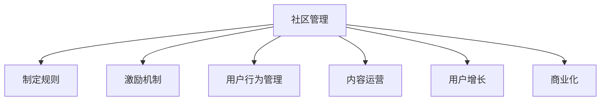

                 

## 1. 背景介绍

在数字化转型的浪潮中，技术社区运营成为推动技术进步、产品创新以及人才汇聚的重要力量。随着网络技术的发展，技术社区的规模不断扩大，用户参与度持续提升，运营模式和管理策略也面临新的挑战。本文将从技术社区运营的多个层面进行探讨，包括社区管理、内容运营、用户增长和商业化，阐述从管理到盈利模式转型的关键点和方法。

### 1.1 技术社区的定义与发展

技术社区是一个以技术讨论、知识共享、产品交流为主要活动形式的在线平台。这些社区可以是技术论坛、博客平台、社交网络或者视频分享网站。它们在促进技术创新、加速知识传播、培养技术人才和推动产业发展方面发挥了重要作用。

随着互联网和移动互联网的普及，技术社区的数量和规模迅速扩张，功能也逐渐从简单的技术交流扩展到项目合作、招聘、培训、商业合作等多个方面。这些社区通过聚集技术爱好者、开发者、产品经理、创业者和企业用户，形成了充满活力的创新生态系统。

### 1.2 技术社区的类型与特点

技术社区的类型多种多样，根据其功能和目标用户，大致可以分为以下几类：

- **技术讨论社区**：如Stack Overflow、GitHub、知乎技术社区等，用户以获取和分享技术知识为主。
- **产品交流社区**：如Medium、CSDN等，用户以产品展示、交流和反馈为主。
- **招聘和人才社区**：如LinkedIn、AngelList等，用户以招聘和求职、职业发展为主。
- **开源项目社区**：如GitHub、Apache Foundation等，用户以开源项目协作和贡献为主。
- **技术培训与教育社区**：如Coursera、Udacity等，用户以学习和培训为主。
- **技术合作与交流社区**：如Slack、Microsoft Teams等，用户以企业间的合作与交流为主。

每个社区都有其独特的服务对象和运营模式，但总体上，它们都致力于提供高效、便捷、有价值的技术资源和服务，帮助用户解决问题、分享知识和实现价值。

### 1.3 技术社区运营的重要性

技术社区的运营是决定其成功的关键因素。一个优秀的技术社区不仅能吸引和留住用户，还能产生有价值的内容，促进技术的快速传播和应用，同时也能为企业和个人带来商业机会。因此，理解技术社区运营的原理和方法，对任何希望构建和运营成功的技术社区都是必不可少的。

## 2. 核心概念与联系

### 2.1 核心概念概述

在探讨技术社区运营时，有几个核心概念需要理解：

- **社区管理**：指通过制定社区规则、激励机制、用户行为管理等手段，维护社区秩序和活跃度。
- **内容运营**：涉及内容策划、编辑、推广和用户参与等环节，保证内容质量和用户互动。
- **用户增长**：通过市场推广、广告投放、用户互动和口碑传播等手段，吸引新用户加入社区。
- **商业化**：指通过广告、会员服务、商品销售、赞助合作等形式，实现社区盈利。

### 2.2 核心概念原理和架构的 Mermaid 流程图

这个流程图展示了社区运营的各个环节相互依赖的关系。社区管理为其他环节提供基础保障，而内容运营、用户增长和商业化则是社区繁荣和盈利的重要手段。

### 2.3 核心概念联系与整合

技术社区运营是一个多维度、多层次的综合过程。各环节之间相互影响，缺一不可。

- **社区管理与内容运营**：管理良好的社区才能吸引高质量内容产出，而内容运营则通过提升内容质量和互动性，进一步促进社区活跃度。
- **内容运营与用户增长**：有价值的内容能够吸引新用户，而新用户的加入又反过来促进内容的更新和传播。
- **用户增长与商业化**：随着用户数量的增加，社区的商业化空间不断扩大，而商业收入又能反过来支持社区的长期发展。
- **商业化与社区管理**：合理的商业化策略需要建立在良好的社区管理之上，同时社区收入的增加也能用于社区的进一步建设和管理。

## 3. 核心算法原理 & 具体操作步骤

### 3.1 算法原理概述

技术社区运营的算法原理主要围绕用户行为分析和推荐系统展开。用户行为分析通过挖掘用户互动数据，了解用户需求和兴趣，从而指导内容运营和商业化策略。推荐系统则是根据用户行为和内容特征，为用户推荐感兴趣的资源和内容，提升用户满意度和活跃度。

### 3.2 算法步骤详解

技术社区运营的算法步骤包括：

1. **用户行为分析**：收集用户访问日志、互动数据、评论和反馈，使用聚类、分类和关联规则等技术，识别用户行为模式和需求。
2. **内容特征提取**：对社区内容进行文本分析、分类和标记，提取内容的关键词、标签和相关性特征。
3. **用户画像构建**：基于用户行为和内容特征，构建用户画像，描述用户的基本属性、兴趣偏好和行为习惯。
4. **个性化推荐算法**：设计推荐算法，根据用户画像和内容特征，为用户推荐个性化的内容资源。
5. **效果评估与优化**：通过A/B测试、指标监控和用户反馈，评估推荐效果，不断优化推荐模型和策略。

### 3.3 算法优缺点

**优点**：

- **提升用户体验**：通过个性化推荐，用户能够更快地找到有价值的内容，提升使用体验。
- **增加用户粘性**：良好的推荐系统能够增加用户的社区粘性，降低流失率。
- **提高转化率**：推荐系统能够精准引导用户进行购买、注册、订阅等转化行为，提高商业化效果。

**缺点**：

- **数据隐私问题**：个性化推荐需要大量的用户数据，可能引发隐私保护和数据安全问题。
- **推荐多样性问题**：过于个性化的推荐可能导致信息茧房，限制用户接触新内容和观点的机会。
- **冷启动问题**：新用户或冷门内容难以获得推荐，需要额外的机制来解决。

### 3.4 算法应用领域

技术社区运营的算法应用广泛，可以应用于：

- **社区内容推荐**：如知乎、Medium、Stack Overflow等，推荐用户感兴趣的问题和答案。
- **商品推荐**：如亚马逊、淘宝、京东等，推荐用户可能感兴趣的商品。
- **用户行为预测**：如Netflix、Spotify、YouTube等，预测用户观看视频、收听音乐等行为。
- **广告精准投放**：如Facebook、Google AdWords等，根据用户画像精准投放广告。
- **市场趋势分析**：如Gartner、Forrester等，分析市场和技术趋势，指导企业决策。

## 4. 数学模型和公式 & 详细讲解 & 举例说明

### 4.1 数学模型构建

技术社区运营的数学模型主要涉及以下几个方面：

- **用户行为模型**：使用隐马尔可夫模型(HMM)、长短期记忆网络(LSTM)等，预测用户行为序列。
- **内容特征模型**：使用词向量模型(如Word2Vec)、主题模型(LDA)等，提取和表示内容特征。
- **推荐模型**：使用协同过滤、矩阵分解、深度学习等方法，构建推荐算法。

### 4.2 公式推导过程

以协同过滤推荐模型为例，其公式推导过程如下：

1. **用户-项目评分矩阵**：
   设用户集合为 $U$，项目集合为 $I$，用户对项目的评分矩阵为 $R \in \mathbb{R}^{n \times m}$，其中 $n$ 为用户的数量，$m$ 为项目的数量。

2. **用户表示矩阵**：
   将用户对项目的评分矩阵 $R$ 拆分为用户表示矩阵 $P \in \mathbb{R}^{n \times d}$ 和项目表示矩阵 $Q \in \mathbb{R}^{m \times d}$，其中 $d$ 为向量维度。

3. **用户-项目评分预测**：
   利用用户表示矩阵 $P$ 和项目表示矩阵 $Q$，预测用户对项目的评分 $\hat{r}_{ui}$，公式如下：
   $$
   \hat{r}_{ui} = \vec{p}_u \cdot \vec{q}_i
   $$
   其中 $\vec{p}_u$ 和 $\vec{q}_i$ 分别为用户 $u$ 和项目 $i$ 的表示向量。

4. **推荐结果排序**：
   根据预测评分 $\hat{r}_{ui}$ 对推荐项目进行排序，选择评分最高的项目作为推荐结果。

### 4.3 案例分析与讲解

以Netflix的推荐系统为例，Netflix利用协同过滤和深度学习模型结合的方式，为用户提供个性化的推荐。Netflix的推荐系统首先使用协同过滤算法，根据用户的观看历史和评分数据，生成用户和项目的向量表示。然后，使用深度学习模型，进一步优化推荐结果，提升推荐精度和多样性。

Netflix的推荐系统通过不断地收集用户反馈和行为数据，不断优化算法模型，实现了从个性化推荐到智能推荐的全过程，有效提升了用户满意度和留存率。

## 5. 项目实践：代码实例和详细解释说明

### 5.1 开发环境搭建

技术社区运营的开发环境搭建主要涉及以下步骤：

1. **选择合适的开发语言和框架**：
   常见的开发语言包括Python、Java、JavaScript等，常用的框架包括Django、Flask、Node.js等。

2. **安装相关依赖库**：
   如SQLite、MySQL、Redis、Kafka、Elasticsearch等，用于数据存储、缓存、消息队列和搜索。

3. **配置开发环境**：
   包括虚拟环境、IDE、版本控制工具如Git等，确保开发过程的顺利进行。

### 5.2 源代码详细实现

以GitHub的推荐系统为例，其核心代码实现如下：

1. **用户行为数据收集与存储**：
   使用MySQL数据库存储用户行为数据，如访问记录、互动数据、评分数据等。

2. **内容特征提取与表示**：
   使用Scikit-Learn库提取问题标题、标签和内容关键词，生成向量表示。

3. **用户画像构建与更新**：
   使用Apache Spark对用户行为数据进行分布式处理，构建用户画像，并实时更新。

4. **推荐算法实现与优化**：
   使用TensorFlow实现协同过滤推荐算法，并通过A/B测试不断优化模型参数和推荐策略。

### 5.3 代码解读与分析

GitHub的推荐系统代码主要分为以下几个模块：

1. **用户行为数据收集模块**：
   负责从GitHub API中获取用户行为数据，并存储到MySQL数据库中。

2. **内容特征提取模块**：
   使用NLTK库对问题标题和内容进行文本处理，提取关键词和标签，生成向量表示。

3. **用户画像构建模块**：
   使用Spark Streaming对用户行为数据进行流式处理，构建用户画像，实时更新和存储。

4. **推荐算法实现模块**：
   使用TensorFlow实现协同过滤算法，并使用Keras API搭建深度学习模型。

5. **推荐结果排序模块**：
   根据推荐评分对推荐项目进行排序，并返回给用户端展示。

### 5.4 运行结果展示

GitHub的推荐系统运行结果主要通过以下界面展示：

1. **问题推荐列表**：
   根据用户的行为数据和内容特征，推荐用户可能感兴趣的问题。

2. **项目推荐列表**：
   推荐用户可能感兴趣的开源项目和代码库。

3. **用户反馈界面**：
   用户可以反馈推荐结果，提出建议和意见，进一步优化推荐系统。

## 6. 实际应用场景

技术社区运营在多个实际应用场景中得到了广泛应用：

### 6.1 社区内容推荐

社区内容推荐是技术社区的核心功能之一。知乎、Medium、Stack Overflow等平台通过算法模型为用户推荐有价值的内容，提升用户满意度和活跃度。例如，知乎推荐系统通过分析用户的浏览历史、点赞和评论，为用户推荐相关的问答和文章，有效解决了信息过载和获取优质内容难的问题。

### 6.2 用户行为预测

用户行为预测是技术社区运营中的重要环节。Netflix、Spotify、YouTube等平台通过分析用户观看视频、收听音乐等行为，预测用户未来的兴趣和需求，从而实现个性化推荐。Netflix通过协同过滤和深度学习结合的方式，构建了精准的推荐模型，提升了用户留存率和观看时长。

### 6.3 商业化变现

技术社区的商业化变现方式多种多样，主要包括：

- **广告投放**：如Facebook、Google AdWords等，通过精准广告投放，实现流量变现。
- **会员服务**：如Medium、Coursera等，通过会员订阅模式，实现盈利。
- **商品销售**：如亚马逊、淘宝等，通过电商平台销售相关商品，实现盈利。
- **赞助合作**：如GitHub、Apache Foundation等，通过企业赞助和合作，实现盈利。

## 7. 工具和资源推荐

### 7.1 学习资源推荐

为了帮助开发者系统掌握技术社区运营的理论基础和实践技巧，这里推荐一些优质的学习资源：

1. **《技术社区运营指南》**：详细介绍了技术社区的构建和管理策略，适用于各类技术社区运营人员。

2. **《推荐系统实战》**：通过实例讲解协同过滤、深度学习等推荐算法，适合技术社区推荐系统的开发者和运维人员。

3. **《数据科学基础》**：介绍了数据收集、清洗、分析和可视化等技术，适用于技术社区运营中的数据工程师和分析师。

4. **《机器学习实战》**：通过实例讲解机器学习算法和模型，适合技术社区运营中的算法工程师和数据科学家。

5. **《人工智能伦理》**：介绍了AI伦理和隐私保护的基本概念和实践方法，适用于技术社区运营中的伦理和合规人员。

### 7.2 开发工具推荐

技术社区运营的开发工具推荐如下：

1. **开发语言**：
   - Python：功能强大、生态丰富，适合技术社区的开发和数据分析。
   - Java：性能高、安全性好，适合大规模技术社区的部署和管理。
   - JavaScript：灵活便捷、生态丰富，适合技术社区的前端开发和用户体验优化。

2. **框架和库**：
   - Django、Flask：常用的Python Web框架，适合后端开发和API接口开发。
   - React、Vue、Angular：常用的JavaScript前端框架，适合前端页面开发和用户体验优化。
   - TensorFlow、PyTorch：常用的深度学习框架，适合推荐系统和用户行为预测等算法实现。

### 7.3 相关论文推荐

技术社区运营的相关论文推荐如下：

1. **《推荐系统理论与实践》**：介绍了推荐系统的基本理论和算法实现，适用于技术社区推荐系统的开发者和运维人员。

2. **《社区管理和运营的挑战与对策》**：详细介绍了技术社区管理的挑战和策略，适用于各类技术社区运营人员。

3. **《用户行为分析与个性化推荐》**：介绍了用户行为分析和个性化推荐的基本方法和技术，适用于技术社区运营中的数据工程师和算法工程师。

4. **《人工智能伦理与隐私保护》**：介绍了AI伦理和隐私保护的基本概念和实践方法，适用于技术社区运营中的伦理和合规人员。

## 8. 总结：未来发展趋势与挑战

### 8.1 研究成果总结

技术社区运营已经取得了显著的进展，从早期的社区管理到如今的商业化变现，形成了完整的生态系统。社区管理通过制定规则和激励机制，保证了社区的活跃度和秩序；内容运营通过个性化推荐和内容策划，提升了用户满意度和粘性；用户增长通过市场推广和广告投放，吸引了大量新用户；商业化通过多种变现方式，实现了社区盈利。

### 8.2 未来发展趋势

未来技术社区运营的发展趋势包括：

1. **智能化和自动化**：随着AI和机器学习技术的发展，技术社区运营将更加智能化和自动化，通过算法模型优化运营策略。
2. **数据驱动和精细化管理**：通过大数据分析，实现用户行为的精细化管理和个性化推荐，提升运营效果。
3. **社交和互动性增强**：通过社交网络和互动功能，增强社区的互动性和用户粘性。
4. **商业化多样化**：除了传统的广告和会员服务，技术社区将探索更多元化的商业化途径，如商品销售、电商合作等。
5. **全球化和本地化结合**：技术社区将更好地结合全球和本地市场，提供更符合用户需求的内容和服务。
6. **伦理和安全保障**：技术社区运营将更加注重用户隐私保护和伦理安全，构建健康、安全的社区环境。

### 8.3 面临的挑战

尽管技术社区运营已经取得了一定的成效，但在实际应用中也面临诸多挑战：

1. **数据隐私问题**：大量用户数据的收集和使用，可能引发隐私保护和数据安全问题。
2. **用户行为多样性**：不同用户的需求和行为差异较大，个性化推荐和用户画像构建仍需进一步优化。
3. **内容审核和监控**：技术社区需要处理大量用户生成内容，如何有效进行内容审核和监控是一个重要问题。
4. **技术人才短缺**：技术社区运营涉及多方面技术和算法，高水平人才的培养和引进仍需努力。
5. **商业模式探索**：如何更好地将技术社区与商业化结合，实现盈利，仍需更多实践和探索。

### 8.4 研究展望

未来技术社区运营的研究方向包括：

1. **智能算法和模型**：探索更加智能和高效的推荐算法和模型，提升推荐精度和多样性。
2. **数据隐私保护**：研究如何在保证用户体验和数据质量的前提下，保护用户隐私和数据安全。
3. **用户行为预测**：研究更精准的用户行为预测模型，提升个性化推荐效果。
4. **多模态数据融合**：探索将文本、图像、语音等多模态数据结合的技术，提升内容表达和推荐效果。
5. **伦理和合规研究**：研究技术社区的伦理和合规问题，确保社区的健康发展和用户权益。

## 9. 附录：常见问题与解答

**Q1: 技术社区运营的核心是什么？**

A: 技术社区运营的核心在于通过社区管理、内容运营、用户增长和商业化四个环节，实现用户满意度的提升和社区价值的最大化。

**Q2: 如何构建高质量的用户画像？**

A: 构建高质量的用户画像需要收集和分析大量的用户行为数据，使用聚类、分类和关联规则等技术，识别用户行为模式和需求。同时，要不断更新和优化用户画像，确保其时效性和准确性。

**Q3: 推荐系统的优缺点有哪些？**

A: 推荐系统的优点在于能够为用户推荐有价值的内容，提升用户体验和粘性。缺点在于可能引发隐私保护和数据安全问题，需要采取措施保护用户数据。

**Q4: 如何应对技术社区的伦理和合规问题？**

A: 技术社区的伦理和合规问题需要通过制定明确的社区规则和行为准则，加强用户教育和引导，建立投诉和监管机制，确保社区的健康发展和用户权益。

**Q5: 未来技术社区运营面临的最大挑战是什么？**

A: 未来技术社区运营面临的最大挑战在于如何更好地结合智能化和自动化，同时保护用户隐私和数据安全，确保社区的健康发展和用户权益。

