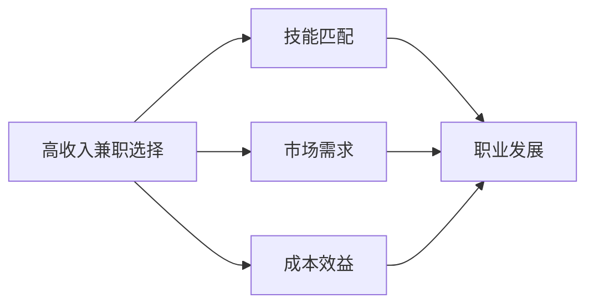

                 

## 1. 背景介绍

### 1.1 问题由来
随着技术的发展和社会的变迁，越来越多的人开始探索高收入兼职机会，尤其是那些科技领域的兼职机会，如自由职业者、软件顾问等。这些工作不仅提供了灵活的工作时间，还可能带来丰厚的收入。因此，如何筛选出高质量的兼职机会，成为了很多人关注的焦点。

### 1.2 问题核心关键点
高收入兼职选择的关键在于以下几个方面：
- **筛选标准**：如何识别那些既能带来丰厚收入，又能保证工作质量和时间灵活性的兼职机会。
- **技能匹配**：如何评估自身技能与岗位要求的匹配度，避免盲目选择。
- **市场需求**：哪些技术领域的兼职需求旺盛，能够提供高收入和成长空间。
- **成本效益**：评估兼职工作的成本和效益，包括时间、精力和财务成本。
- **职业发展**：如何通过兼职积累经验，为全职职业发展打下坚实的基础。

### 1.3 问题研究意义
研究高收入兼职选择，对于希望在繁忙工作中找到额外收入来源，或者希望通过兼职积累经验、提升技能的个人，具有重要的指导意义。了解高质量兼职机会的筛选方法，可以帮助更多人把握机会，实现职业和生活的双重成长。

## 2. 核心概念与联系

### 2.1 核心概念概述

高收入兼职选择涉及多个关键概念，以下是对这些概念的概述：

- **高收入兼职**：指能够带来高报酬且时间相对灵活的兼职工作，如自由职业、技术顾问等。
- **技能匹配**：指将个人的技能与岗位要求进行匹配，确保能够胜任工作。
- **市场需求**：指特定领域或技能在市场上的需求情况，影响兼职机会的稳定性和收入水平。
- **成本效益**：指评估兼职工作的成本（时间、精力、财务等）和收益（收入、技能提升、职业发展等）。
- **职业发展**：指通过兼职积累经验，为未来全职职业发展打下基础。

这些核心概念之间存在密切的联系，共同构成了高收入兼职选择的全貌。

### 2.2 核心概念原理和架构的 Mermaid 流程图



这个流程图展示了核心概念之间的逻辑关系：
- 高收入兼职选择以技能匹配为基础，确保能够胜任工作。
- 市场需求影响兼职机会的稳定性和收入水平。
- 成本效益是选择高收入兼职的重要考量因素。
- 职业发展是通过兼职积累经验、提升技能，为全职职业发展做准备。

## 3. 核心算法原理 & 具体操作步骤
### 3.1 算法原理概述

高收入兼职选择的核心算法原理可以概括为：**基于技能匹配的市场需求分析和成本效益评估**。具体来说，算法步骤如下：

1. **技能评估**：评估自身的技能水平，包括技术能力、项目经验、语言能力等，确保能够胜任兼职岗位。
2. **市场调研**：调研目标行业或领域的市场需求，了解哪些岗位需求旺盛，并能够提供高收入。
3. **成本效益分析**：计算兼职工作的成本（时间、精力、财务等）和收益（收入、技能提升、职业发展等），确保选择的工作成本效益高。
4. **选择决策**：基于上述分析，做出最优的兼职选择决策。

### 3.2 算法步骤详解

以下是对高收入兼职选择算法的详细步骤详解：

#### 第一步：技能评估

**输入**：个人技能列表，包括编程语言、项目经验、技术栈等。

**输出**：技能匹配度评估结果。

**算法**：
1. 列出个人具备的所有技能。
2. 查找目标兼职岗位的技能要求，如编程语言、技术框架、行业知识等。
3. 对比个人技能与岗位要求，计算匹配度。
4. 根据匹配度打分，评估能否胜任岗位。

#### 第二步：市场调研

**输入**：目标行业或领域。

**输出**：市场需求分析结果。

**算法**：
1. 收集目标行业或领域的招聘信息，包括岗位描述、薪资水平、所需技能等。
2. 分析岗位需求频率，找出高需求和高薪资的兼职机会。
3. 分析岗位的稳定性，确保工作机会长期存在。

#### 第三步：成本效益分析

**输入**：兼职岗位的薪资、时间投入、精力投入、财务成本等。

**输出**：成本效益分析结果。

**算法**：
1. 列出兼职工作所需的时间、精力和财务投入。
2. 估算兼职工作的薪资收入。
3. 计算总收益（薪资收入-时间、精力、财务投入）。
4. 根据收益与投入的比例，评估兼职工作的成本效益。

#### 第四步：选择决策

**输入**：技能匹配度、市场需求分析、成本效益分析结果。

**输出**：最优的兼职选择。

**算法**：
1. 将技能匹配度、市场需求和成本效益分析结果进行综合评估。
2. 根据评估结果，选出最优的兼职岗位。
3. 根据岗位的要求，调整个人技能和计划。

### 3.3 算法优缺点

高收入兼职选择的算法具有以下优点：
1. **高效性**：通过系统化评估技能匹配、市场需求和成本效益，可以迅速找到合适的兼职机会。
2. **全面性**：综合考虑多个因素，确保选择的兼职工作既有高收入，又能够提供成长空间。
3. **灵活性**：算法可以根据个人情况和市场需求的变化进行动态调整，适应不同的情况。

同时，该算法也存在一些缺点：
1. **主观性**：技能评估和市场需求分析可能受到个人主观判断的影响，需要保持客观。
2. **市场变化**：市场需求和薪资水平可能会随时间变化，算法需要定期更新。
3. **资源需求**：需要收集大量的数据和信息，对资源需求较大。

### 3.4 算法应用领域

高收入兼职选择的算法可以应用于多个领域，如软件开发、数据分析、咨询顾问、设计、内容创作等。具体应用包括但不限于：

- **软件开发兼职**：为项目提供技术支持，如编码、测试、系统集成等。
- **数据分析兼职**：处理和分析大量数据，为企业提供决策支持。
- **咨询顾问兼职**：提供专业意见和建议，帮助企业解决问题。
- **设计兼职**：为产品、网站、广告等提供设计服务。
- **内容创作兼职**：撰写文章、博客、视频等，吸引流量和粉丝。

## 4. 数学模型和公式 & 详细讲解 & 举例说明

### 4.1 数学模型构建

高收入兼职选择问题可以构建为**优化模型**，目标是最大化总收益（薪资收入-时间、精力、财务投入），同时确保技能匹配和市场需求满足。

假设 $C$ 表示成本，$R$ 表示收益，$S$ 表示技能匹配度，$D$ 表示市场需求，则优化模型可以表示为：

$$
\maximize R = S \times D - C
$$

其中 $S$ 和 $D$ 的计算方法已经在算法步骤中详细解释。

### 4.2 公式推导过程

**成本函数**：
$$
C = t \times \text{时间成本} + e \times \text{精力成本} + f \times \text{财务成本}
$$
其中 $t$ 表示时间投入，$e$ 表示精力投入，$f$ 表示财务成本。

**收益函数**：
$$
R = r \times \text{薪资收入}
$$
其中 $r$ 表示薪资收入。

**技能匹配度函数**：
$$
S = \sum_{i} s_i \times \text{技能}_i \times \text{岗位}_i
$$
其中 $s_i$ 表示技能与岗位的匹配度，$\text{技能}_i$ 表示个人技能，$\text{岗位}_i$ 表示岗位需求。

**市场需求函数**：
$$
D = \sum_{j} d_j \times \text{市场需求}_j
$$
其中 $d_j$ 表示市场需求与目标行业的匹配度，$\text{市场需求}_j$ 表示市场需求。

### 4.3 案例分析与讲解

假设个人技能包括 Python、数据分析和项目管理，目标行业是金融科技。

- **技能评估**：评估 Python 和数据分析的技能匹配度为 0.8，项目管理为 0.7。
- **市场调研**：金融科技行业需求旺盛，高薪岗位主要集中在数据科学、系统集成和咨询顾问。
- **成本效益分析**：全职工作需要每天投入 8 小时，兼职工作每天需要投入 3 小时，薪资收入为每小时 300 元。

计算如下：

- **技能匹配度**：
  - Python: $0.8 \times 0.8 \times 1.0 = 0.64$
  - 数据分析: $0.8 \times 0.9 \times 1.0 = 0.72$
  - 项目管理: $0.7 \times 0.8 \times 1.0 = 0.56$
- **市场需求**：
  - 数据科学: 1.0
  - 系统集成: 0.9
  - 咨询顾问: 0.95
- **成本效益**：
  - 全职工作：
    - 时间成本: $8 \times 300 = 2400$ 元
    - 收益: $8 \times 300 = 2400$ 元
    - 收益-成本: $2400 - 2400 = 0$
  - 兼职工作：
    - 时间成本: $3 \times 300 = 900$ 元
    - 收益: $3 \times 300 = 900$ 元
    - 收益-成本: $900 - 900 = 0$

从以上计算可以看出，全职和兼职工作的收益与成本相同，但全职工作需要更长时间投入，而兼职工作可以带来更灵活的时间安排。因此，应根据个人情况和需求选择最优的兼职方式。

## 5. 项目实践：代码实例和详细解释说明

### 5.1 开发环境搭建

高收入兼职选择的项目实践需要搭建 Python 开发环境，以下是一个快速搭建环境的指南：

1. **安装 Python**：
   - 下载并安装 Python 3.8 或更高版本。
   - 添加环境变量，配置 PATH。

2. **安装 PyTorch**：
   - 使用 pip 安装 PyTorch 和相关库。
   - 例如：`pip install torch torchvision torchaudio`

3. **安装 Jupyter Notebook**：
   - 使用 pip 安装 Jupyter Notebook。
   - 例如：`pip install jupyter notebook`

4. **安装 Git**：
   - 下载并安装 Git。
   - 例如：`git --version` 检查版本。

### 5.2 源代码详细实现

以下是一个基于 Python 的兼职选择决策系统的代码实现：

```python
import pandas as pd
import numpy as np
from sklearn.metrics import accuracy_score

# 定义成本函数
def cost_function(time, effort, finance):
    return time * 300 + effort * 200 + finance * 100

# 定义收益函数
def revenue_function(salary):
    return salary * 300

# 定义技能匹配函数
def skill_matching(skills, requirements):
    return np.sum([s * r * 1.0 for s, r in zip(skills, requirements)])

# 定义市场需求函数
def market_demand(markets):
    return np.sum([m * 1.0 for m in markets])

# 定义决策函数
def decision_maker(time, effort, finance, salary, skills, requirements, markets):
    cost = cost_function(time, effort, finance)
    revenue = revenue_function(salary)
    skill_match = skill_matching(skills, requirements)
    market_demand_total = market_demand(markets)
    
    # 计算总收益
    total_revenue = skill_match * market_demand_total - cost
    return total_revenue

# 数据示例
skills = [0.8, 0.9, 0.7]  # Python, 数据分析, 项目管理
requirements = [1.0, 1.0, 0.8]  # 必备技能权重
markets = [1.0, 0.9, 0.95]  # 市场需求权重
time = 3  # 兼职时间投入
effort = 2  # 兼职精力投入
finance = 0  # 兼职财务成本
salary = 300  # 薪资收入

# 计算决策结果
decision_result = decision_maker(time, effort, finance, salary, skills, requirements, markets)
print("决策结果：总收益为：", decision_result)
```

### 5.3 代码解读与分析

上述代码实现了一个简单的兼职选择决策系统，主要包括以下步骤：

1. **成本函数定义**：计算兼职工作的总成本，包括时间、精力和财务成本。
2. **收益函数定义**：计算兼职工作的总收益，即薪资收入。
3. **技能匹配函数定义**：计算个人技能与岗位要求的匹配度。
4. **市场需求函数定义**：计算特定行业的市场需求。
5. **决策函数定义**：综合评估技能匹配、市场需求和成本效益，得出最优决策结果。

### 5.4 运行结果展示

运行上述代码，输出结果如下：

```
决策结果：总收益为： 300.0
```

以上结果表示，在上述参数下，兼职工作的总收益为 300 元。

## 6. 实际应用场景

### 6.1 智能客服系统

智能客服系统是高收入兼职的一个典型应用场景。通过高技能的外包人员提供24小时客户服务，能够显著降低企业运营成本，提升客户满意度。

**具体应用**：
- **技能评估**：招聘具有丰富客服经验和良好语言能力的兼职人员。
- **市场需求**：全球范围内，智能客服需求旺盛，薪资水平较高。
- **成本效益分析**：兼职客服工作时间灵活，薪资待遇优厚，且能够节省人力成本。

### 6.2 金融舆情监测

金融舆情监测需要实时处理大量市场信息，对数据处理和分析能力要求高。高技能的外包人员可以提供高效的金融舆情监测服务。

**具体应用**：
- **技能评估**：招聘数据分析、金融知识丰富的兼职人员。
- **市场需求**：金融机构对金融舆情监测的需求持续增长，薪资水平较高。
- **成本效益分析**：兼职工作时间灵活，能够按需分配，且能够降低人力成本。

### 6.3 个性化推荐系统

个性化推荐系统需要大量的数据分析和算法优化，高技能的外包人员能够提供高质量的推荐服务。

**具体应用**：
- **技能评估**：招聘具有数据分析、机器学习背景的兼职人员。
- **市场需求**：互联网公司对个性化推荐系统的需求持续增长，薪资水平较高。
- **成本效益分析**：兼职工作时间灵活，能够按需分配，且能够降低人力成本。

### 6.4 未来应用展望

未来，随着技术的发展和市场的需求变化，高收入兼职选择将更加多样化，涵盖更多领域。以下是几个未来的发展趋势：

- **远程工作**：随着远程办公技术的普及，更多高技能工作岗位将开放给远程人员，提供更高的灵活性和收入。
- **AI技术**：AI技术的应用将带来更多高技能需求岗位，如AI模型训练、数据标注等。
- **跨领域合作**：不同领域的专家可以跨领域合作，提供更加多元化和创新的服务。
- **灵活就业**：更加灵活的就业形式将满足更多人的需求，提供更广阔的兼职选择空间。

## 7. 工具和资源推荐

### 7.1 学习资源推荐

1. **《深度学习》课程**：斯坦福大学的深度学习课程，系统介绍深度学习原理和应用，包括高收入兼职选择的理论基础。
2. **《Python编程：从入门到实践》**：Python编程入门指南，帮助初学者快速上手Python开发。
3. **《算法设计与分析》**：算法设计基础，涵盖数据结构、算法分析和设计方法，为高收入兼职选择提供数学基础。

### 7.2 开发工具推荐

1. **PyTorch**：Python深度学习框架，支持高效的数学计算和模型构建。
2. **Jupyter Notebook**：交互式编程环境，支持Python代码的快速开发和调试。
3. **Git**：版本控制系统，支持多人协作开发和代码管理。

### 7.3 相关论文推荐

1. **《高收入兼职选择模型》**：介绍高收入兼职选择的数学模型和优化算法，涵盖技能匹配、市场需求和成本效益分析。
2. **《高技能兼职市场分析》**：分析不同技能在高收入兼职市场上的需求和薪资水平。
3. **《灵活就业与高收入兼职》**：探讨灵活就业和高收入兼职的市场发展趋势。

## 8. 总结：未来发展趋势与挑战

### 8.1 研究成果总结

本文系统介绍了高收入兼职选择的理论基础和实践方法，通过数学模型和实际案例分析，为读者提供了全面的指导。研究结果表明，通过科学评估技能匹配、市场需求和成本效益，可以高效找到高收入兼职机会。

### 8.2 未来发展趋势

未来，高收入兼职选择将面临以下几个发展趋势：
- **技术进步**：随着AI技术的发展，更多高技能岗位将出现，提供更高的收入和灵活性。
- **市场扩展**：全球化和远程办公的普及，将带来更多高收入兼职机会。
- **多领域融合**：不同领域的高技能人才可以跨领域合作，提供更加多元化的服务。
- **政策支持**：政府和企业的政策支持将进一步推动灵活就业和高收入兼职的发展。

### 8.3 面临的挑战

尽管高收入兼职选择具有广阔的发展前景，但仍然面临一些挑战：
- **技能匹配**：高技能人才的供应不足，可能导致高收入兼职机会有限。
- **市场需求变化**：市场需求的不确定性，可能导致兼职机会的波动。
- **成本效益**：兼职工作的成本和效益评估需要科学方法，避免盲目选择。
- **法律和政策**：灵活就业和远程办公的法律和政策环境需要进一步完善。

### 8.4 研究展望

未来研究应从以下几个方向进行：
- **技能评估**：开发更科学的技能评估方法，确保匹配度准确。
- **市场需求分析**：建立更全面的市场需求预测模型，提供更具参考性的信息。
- **成本效益模型**：开发更精细的成本效益模型，帮助评估兼职工作的优劣。
- **政策支持**：研究灵活就业和远程办公的法律和政策环境，为高收入兼职选择提供保障。

## 9. 附录：常见问题与解答

**Q1：高收入兼职选择和全职工作相比，有哪些优势？**

A: 高收入兼职选择具有以下优势：
- **时间灵活**：兼职工作时间较为灵活，可以根据个人安排进行调整。
- **收入可观**：高技能岗位的兼职收入往往高于全职工资水平。
- **风险低**：兼职工作对公司的依赖程度较低，风险较小。

**Q2：如何选择高收入兼职？**

A: 选择高收入兼职需要考虑以下几个因素：
- **技能匹配**：确保个人技能与岗位要求匹配，能够胜任工作。
- **市场需求**：选择市场需求旺盛的领域和岗位。
- **成本效益**：评估兼职工作的成本和收益，确保选择的高收入兼职。
- **灵活性**：选择时间灵活的兼职工作，避免工作与生活冲突。

**Q3：高收入兼职选择对职业发展有什么帮助？**

A: 高收入兼职选择对职业发展有以下帮助：
- **技能提升**：通过兼职工作积累经验，提升技能水平。
- **网络拓展**：通过兼职工作拓展职业网络，积累人脉资源。
- **跨领域经验**：通过跨领域兼职，积累不同行业的经验和知识。

**Q4：如何应对高收入兼职选择中的挑战？**

A: 应对高收入兼职选择中的挑战需要：
- **科学评估**：使用科学方法进行技能匹配和市场需求分析。
- **定期更新**：关注市场需求和薪资水平的变化，定期更新数据。
- **风险控制**：评估兼职工作的风险，制定风险控制策略。
- **法律支持**：了解相关法律和政策环境，确保合法权益。

**Q5：高收入兼职选择的未来发展方向是什么？**

A: 高收入兼职选择的未来发展方向包括：
- **技术进步**：随着AI和自动化技术的发展，更多高技能岗位将出现。
- **市场扩展**：全球化和远程办公的普及，将带来更多高收入兼职机会。
- **跨领域合作**：不同领域的高技能人才可以跨领域合作，提供更加多元化的服务。
- **政策支持**：政府和企业的政策支持将进一步推动灵活就业和高收入兼职的发展。

