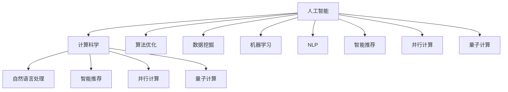

                 

# 拓展认知边界：人类计算的科学探索

> 关键词：人工智能,计算科学,认知边界,算法优化,应用场景,未来趋势,挑战与展望

## 1. 背景介绍

### 1.1 问题由来
现代计算科学已经步入一个崭新的时代，人工智能(Artificial Intelligence, AI)技术的飞速发展，让机器不仅能模仿人类的思维和行为，还能在某些领域超越人类。认知边界作为人类智慧与机器智能之间的一道分界线，正在被不断拓展。在可预见的未来，计算科学将重塑我们的认知方式，推动人类进入智能时代。

### 1.2 问题核心关键点
人工智能技术能够大幅度提升人类认知边界的原因在于其基于计算和数据驱动的特性。计算科学通过算法优化和数据挖掘，帮助机器快速处理和理解复杂的现实问题，从而超越人类的某些局限。其中，计算科学在人工智能领域的应用，从简单的信息检索、图像识别到复杂的自然语言处理、智能推荐，都已经展示出其巨大的潜力。

此外，计算科学还涉及到并行计算、量子计算、分布式计算等先进计算技术，进一步提升了机器处理大规模数据的能力。通过这些计算技术，人工智能在处理图像、音频、视频等多模态信息时，表现出强于人类的能力，标志着人类计算边界的拓展。

## 2. 核心概念与联系

### 2.1 核心概念概述

为更好地理解计算科学如何拓展认知边界，本节将介绍几个密切相关的核心概念：

- 人工智能：使机器能够模拟人类智能的科学和技术，包括但不限于学习、推理、感知、语言处理、决策等。
- 计算科学：研究如何用计算方法和工具解决各种复杂问题的科学，包括算法优化、计算模型、分布式系统等。
- 认知边界：人类智慧与机器智能之间的一个界限，计算科学通过突破这个界限，提升机器处理复杂问题的能力。
- 算法优化：在算法设计中寻找最优或近似最优解决方案的过程，包括但不限于线性规划、动态规划、机器学习等。
- 数据挖掘：从数据中提取有用信息或知识的过程，包括分类、聚类、关联规则等。
- 机器学习：让机器通过学习数据模式，自动改进性能和效果的过程，涉及监督学习、无监督学习、强化学习等。
- 自然语言处理(NLP)：使机器能够理解、解释和生成人类语言的技术，包括文本分类、语义分析、情感分析等。
- 智能推荐系统：通过学习用户行为，推荐相关物品的系统，包括协同过滤、内容过滤等。
- 并行计算：利用多个处理器并行处理任务，提升计算效率的技术，包括多线程、多进程、分布式计算等。
- 量子计算：利用量子位进行计算的新型计算技术，具有比传统计算更高的并行性和效率。

这些核心概念之间的逻辑关系可以通过以下Mermaid流程图来展示：



这个流程图展示了我认为的计算科学核心概念之间的关系：

1. 人工智能与计算科学相互交织，通过算法优化和数据挖掘，提升处理复杂问题的能力。
2. 算法优化是提升计算效率的关键，常用的方法包括线性规划、动态规划等。
3. 数据挖掘是提取知识的核心手段，常见的技术包括分类、聚类等。
4. 机器学习是让机器自动学习和改进性能的框架，包括监督学习、无监督学习、强化学习等。
5. 自然语言处理使机器能够理解和生成人类语言，实现语言-语义的映射。
6. 智能推荐系统通过学习用户行为，推荐相关物品，为用户提供个性化服务。
7. 并行计算和量子计算是提升计算效率的重要技术，使机器能更高效地处理大规模数据。
8. 自然语言处理、智能推荐、并行计算和量子计算等，都是人工智能在不同领域的具体应用。

## 3. 核心算法原理 & 具体操作步骤
### 3.1 算法原理概述

计算科学在拓展认知边界的过程中，算法优化和数据挖掘扮演了关键角色。以下将从算法优化和数据挖掘两方面展开讨论。

### 3.2 算法步骤详解

**算法优化**

算法优化是提升计算效率和处理复杂问题能力的关键。以动态规划为例，其基本步骤如下：

1. **定义子问题**：将原问题分解为若干子问题，以便递归求解。
2. **定义状态**：定义状态变量，表示当前问题的子问题求解结果。
3. **定义状态转移方程**：根据子问题之间的关系，定义状态转移方程，表达子问题之间的关系。
4. **定义边界条件**：定义最小子问题的解，作为递归的基础。
5. **递归求解**：自底向上递归求解子问题，最终得到原问题的解。

**数据挖掘**

数据挖掘是一种从大量数据中提取有用信息和知识的过程，以分类和聚类为例，其基本步骤如下：

1. **数据预处理**：清洗数据，处理缺失值和异常值，标准化数据格式。
2. **特征选择**：从原始数据中选择最具代表性的特征，以减少维度，提升挖掘效率。
3. **模型训练**：选择合适的算法模型，训练得到模型参数。
4. **模型评估**：使用测试集评估模型性能，选择最优模型。
5. **应用验证**：将模型应用于实际问题，验证效果。

**算法优缺点**

算法优化的优点在于可以大幅度提升计算效率，使得机器能够处理更复杂的问题。但算法优化也存在一定的局限性：

- 算法设计难度高：需要深入理解问题的本质，才能设计出高效的算法。
- 数据处理复杂：需要处理大规模数据，算法需要具备良好的可扩展性。
- 鲁棒性不足：算法的稳定性和可靠性需要不断优化，避免陷入局部最优。

数据挖掘的优点在于能够从数据中提取有用信息，提升决策质量。但数据挖掘也面临以下挑战：

- 数据质量要求高：数据质量直接影响挖掘结果，需要处理数据清洗、特征选择等问题。
- 模型选择困难：不同的问题需要不同的模型，选择最优模型难度较大。
- 信息过载：大规模数据可能导致信息过载，影响挖掘效率。

**算法应用领域**

算法优化和数据挖掘广泛应用于人工智能的各个领域：

- 机器学习：通过优化算法和数据挖掘，提升模型的性能和效果，如线性回归、决策树、神经网络等。
- 自然语言处理：通过算法优化和数据挖掘，实现语言理解和生成，如分词、词性标注、机器翻译等。
- 智能推荐系统：通过算法优化和数据挖掘，提升推荐效果，如协同过滤、基于内容的推荐等。
- 计算机视觉：通过算法优化和数据挖掘，提升图像处理能力，如目标检测、图像分割等。
- 金融分析：通过算法优化和数据挖掘，提升风险预测和投资决策能力，如信用评分、股票预测等。

## 4. 数学模型和公式 & 详细讲解 & 举例说明

### 4.1 数学模型构建

在计算科学中，数学模型扮演着至关重要的角色。以下以线性回归为例，构建其数学模型：

假设有一组线性回归数据，自变量为 $X=[x_1,x_2,...,x_n]$，因变量为 $Y$，回归系数为 $\theta=[\theta_1,\theta_2,...,\theta_n]^T$。回归模型的目标是最小化预测值与真实值之间的误差，即：

$$
\min_{\theta} \sum_{i=1}^N (y_i - \hat{y}_i)^2
$$

其中，$\hat{y}_i=\theta^TX_i$ 为预测值。

### 4.2 公式推导过程

线性回归的公式推导过程如下：

1. **定义目标函数**：
   $$
   J(\theta) = \frac{1}{2N} \sum_{i=1}^N (y_i - \hat{y}_i)^2
   $$

2. **求解目标函数最小值**：
   $$
   \frac{\partial J(\theta)}{\partial \theta} = 0
   $$
   
   解上述方程，得到回归系数 $\theta$ 的求解公式：
   $$
   \theta = (X^TX)^{-1}X^TY
   $$

### 4.3 案例分析与讲解

以电商网站推荐系统为例，假设网站有 $M$ 个用户和 $N$ 个商品，每个用户和商品都有一个特征向量。目标是预测用户对商品的评分，以便推荐相关商品。

通过构建用户-商品评分矩阵 $R$，将评分数据表示为 $R_{ij}=y_{ij}$，$i$ 为用户，$j$ 为商品，$y_{ij}$ 为用户 $i$ 对商品 $j$ 的评分。

对于用户 $i$，根据用户特征 $X_i$ 和商品特征 $X_j$，利用线性回归模型 $y_i=\theta^TX_i$ 预测用户对商品的评分。通过最小化损失函数 $J(\theta)$，得到回归系数 $\theta$。

## 5. 项目实践：代码实例和详细解释说明

### 5.1 开发环境搭建

在进行项目实践前，我们需要准备好开发环境。以下是使用Python进行TensorFlow开发的环境配置流程：

1. 安装Anaconda：从官网下载并安装Anaconda，用于创建独立的Python环境。

2. 创建并激活虚拟环境：
```bash
conda create -n tf-env python=3.8 
conda activate tf-env
```

3. 安装TensorFlow：根据CUDA版本，从官网获取对应的安装命令。例如：
```bash
pip install tensorflow==2.8
```

4. 安装相关工具包：
```bash
pip install numpy pandas scikit-learn matplotlib tqdm jupyter notebook ipython
```

完成上述步骤后，即可在`tf-env`环境中开始项目实践。

### 5.2 源代码详细实现

以下以电商推荐系统为例，给出使用TensorFlow进行线性回归的Python代码实现。

```python
import tensorflow as tf
import numpy as np

# 构造数据集
X = np.random.rand(100, 10)
y = np.random.rand(100, 1)

# 定义模型
model = tf.keras.Sequential([
    tf.keras.layers.Dense(units=1, input_shape=[10])
])

# 定义损失函数和优化器
loss_fn = tf.keras.losses.MeanSquaredError()
optimizer = tf.keras.optimizers.Adam(learning_rate=0.01)

# 训练模型
model.compile(optimizer=optimizer, loss=loss_fn)
model.fit(X, y, epochs=50, batch_size=32)

# 预测
X_test = np.random.rand(10, 10)
predictions = model.predict(X_test)
```

### 5.3 代码解读与分析

让我们再详细解读一下关键代码的实现细节：

**模型定义**：
```python
model = tf.keras.Sequential([
    tf.keras.layers.Dense(units=1, input_shape=[10])
])
```

**损失函数和优化器**：
```python
loss_fn = tf.keras.losses.MeanSquaredError()
optimizer = tf.keras.optimizers.Adam(learning_rate=0.01)
```

**模型训练**：
```python
model.compile(optimizer=optimizer, loss=loss_fn)
model.fit(X, y, epochs=50, batch_size=32)
```

**模型预测**：
```python
X_test = np.random.rand(10, 10)
predictions = model.predict(X_test)
```

可以看到，TensorFlow提供了简单易用的API，使得机器学习模型的构建和训练变得非常直观。开发者可以将更多精力放在算法优化和模型评估上，而不必过多关注底层实现细节。

## 6. 实际应用场景

### 6.1 智能推荐系统

智能推荐系统在电商网站、视频平台、社交网络等场景中应用广泛。通过计算科学，推荐系统能够根据用户行为和历史数据，预测用户对物品的兴趣，推荐相关物品，从而提升用户体验和业务转化率。

### 6.2 金融分析

在金融领域，计算科学用于风险预测、投资决策等任务。通过分析大量历史交易数据，构建机器学习模型，预测市场趋势和风险点，帮助投资者做出更加明智的投资决策。

### 6.3 自然语言处理

自然语言处理是计算科学在人工智能领域的重要应用之一。通过算法优化和数据挖掘，自然语言处理系统能够实现语言理解、情感分析、自动摘要等功能，提升人机交互体验。

### 6.4 未来应用展望

随着计算科学和人工智能技术的不断发展，未来在更多领域将看到计算科学的应用。例如，在医疗领域，计算科学用于疾病预测、基因分析等任务，提升医疗诊断和治疗水平。在环境监测领域，计算科学用于分析气候数据，预测环境变化趋势。

## 7. 工具和资源推荐

### 7.1 学习资源推荐

为了帮助开发者系统掌握计算科学的核心技术，这里推荐一些优质的学习资源：

1. 《算法导论》：经典算法教材，涵盖排序、图论、动态规划等核心算法。
2. 《统计学习方法》：机器学习经典教材，介绍分类、聚类、回归等基本算法。
3. 《深度学习》（Ian Goodfellow 著）：深度学习经典教材，详细介绍神经网络、卷积神经网络、循环神经网络等模型。
4. 《Python数据科学手册》：介绍Python在数据科学领域的应用，涵盖Pandas、NumPy、Scikit-learn等库。
5. Coursera上的《机器学习》课程：由斯坦福大学教授Andrew Ng讲授，系统介绍机器学习的基本概念和算法。

通过对这些资源的学习实践，相信你一定能够快速掌握计算科学的核心技术，并用于解决实际的计算问题。

### 7.2 开发工具推荐

高效的开发离不开优秀的工具支持。以下是几款用于计算科学开发的常用工具：

1. Python：开源编程语言，社区活跃，支持丰富的第三方库。
2. TensorFlow：由Google主导开发的深度学习框架，支持分布式计算和GPU加速。
3. PyTorch：由Facebook主导开发的深度学习框架，灵活易用，社区活跃。
4. Jupyter Notebook：交互式编程环境，支持Python、R、Julia等多种语言。
5. R：统计分析语言，支持数据可视化、统计建模等。
6. MATLAB：工程计算软件，支持数值计算、信号处理等。

合理利用这些工具，可以显著提升计算科学任务的开发效率，加快创新迭代的步伐。

### 7.3 相关论文推荐

计算科学和人工智能领域的不断发展，带来了一系列前沿的研究成果。以下是几篇奠基性的相关论文，推荐阅读：

1. Linear Regression with L1 and L2 Constraints（L1和L2正则化的线性回归）：提出L1和L2正则化方法，解决过拟合问题，提升模型泛化能力。
2. Deep Neural Networks for Earthquake Prediction（深度神经网络用于地震预测）：展示深度学习在处理复杂数据上的能力，提升预测准确性。
3. Natural Language Processing with Convolutional Neural Networks（卷积神经网络用于自然语言处理）：提出卷积神经网络用于处理文本序列，提升NLP任务性能。
4. Generative Adversarial Networks（生成对抗网络）：提出GAN模型，生成高质量的图像和音频等。
5. Reinforcement Learning for Human-Robot Interaction（强化学习用于人机交互）：提出基于强化学习的人机交互模型，提升人机互动体验。

这些论文代表了大规模计算科学的最新进展，展示了计算科学在多个领域的潜力。

## 8. 总结：未来发展趋势与挑战

### 8.1 总结

本文对计算科学如何拓展认知边界进行了全面系统的介绍。首先阐述了计算科学与人工智能之间的紧密联系，明确了算法优化和数据挖掘在拓展认知边界中的关键作用。其次，从原理到实践，详细讲解了计算科学的核心算法和操作步骤，给出了计算科学任务开发的完整代码实例。同时，本文还广泛探讨了计算科学在电商推荐、金融分析、自然语言处理等领域的实际应用，展示了计算科学技术的强大威力。

通过本文的系统梳理，可以看到，计算科学通过算法优化和数据挖掘，在拓展认知边界的过程中起到了至关重要的作用。未来，伴随计算科学技术的不断发展，机器智能将在更多领域得到应用，推动人类进入智能时代。

### 8.2 未来发展趋势

展望未来，计算科学将呈现以下几个发展趋势：

1. 算法优化持续演进。随着问题的复杂性不断提升，新的算法设计和优化方法将不断涌现，提升计算效率和处理能力。
2. 数据挖掘技术突破。通过先进的数据挖掘技术，可以从大规模数据中提取更深刻的知识和洞察，提升决策质量。
3. 跨领域应用拓展。计算科学将在更多领域得到应用，如医疗、环境监测、金融等，带来新的技术突破。
4. 计算模型的发展。未来将出现更多类型的计算模型，如神经网络、图模型、量子计算模型等，提升处理复杂问题的能力。
5. 智能计算体系构建。计算科学将与人工智能深度融合，构建智能计算体系，实现人机协同处理复杂问题。

这些趋势凸显了计算科学技术的广阔前景，计算科学将在各个领域带来深刻变革，推动人类进入智能时代。

### 8.3 面临的挑战

尽管计算科学已经取得了显著的进展，但在迈向更加智能化、普适化应用的过程中，仍面临诸多挑战：

1. 计算效率问题。大规模数据的处理和计算，仍需要高效的算法和硬件支持，避免资源浪费。
2. 数据隐私和安全。大规模数据的处理和存储，需要强大的隐私保护和安全机制，避免数据泄露和滥用。
3. 计算模型的可解释性。复杂的计算模型，往往难以解释其决策过程，需要更强的可解释性支持。
4. 算法和模型的不稳定性。复杂的计算模型，可能存在泛化能力不足、鲁棒性差等问题，需要更多优化方法。
5. 计算资源的不均衡。计算资源的分配和管理，仍需优化，避免资源浪费和效率低下。

正视计算科学面临的这些挑战，积极应对并寻求突破，将使计算科学技术更加成熟，推动其更好地服务于人类社会。

### 8.4 研究展望

未来的研究需要在以下几个方面寻求新的突破：

1. 探索高效的算法和模型设计。开发更加高效和可扩展的算法，如并行算法、分布式算法、量子算法等。
2. 研究先进的计算硬件。开发更高效、更快速的计算硬件，如GPU、TPU等，提升计算效率。
3. 引入更多的先验知识。将专家知识和领域知识与计算模型结合，提升模型性能和鲁棒性。
4. 融合跨学科知识。引入计算机科学、数学、统计学、物理等多学科知识，提升计算模型的性能和可解释性。
5. 开发更加通用的计算平台。构建统一的计算平台，方便跨领域应用和知识共享。

这些研究方向和技术的突破，将进一步推动计算科学技术的进步，拓展人类认知边界，推动智能时代的到来。

## 9. 附录：常见问题与解答

**Q1：计算科学如何拓展人类认知边界？**

A: 计算科学通过算法优化和数据挖掘，提升机器处理复杂问题的能力，使机器能够超越人类的某些局限。例如，机器学习通过构建模型，提升预测准确性，自然语言处理通过语言理解，提升人机交互体验。这些技术的发展，拓展了人类认知边界。

**Q2：如何提高计算效率？**

A: 提高计算效率可以通过以下几个方法：
1. 算法优化：选择高效的算法，避免不必要的计算。
2. 硬件加速：利用GPU、TPU等硬件加速，提升计算速度。
3. 并行计算：利用多线程、多进程等并行技术，提升计算效率。
4. 分布式计算：利用分布式计算框架，实现高效数据处理。

**Q3：计算科学在人工智能中的应用有哪些？**

A: 计算科学在人工智能中应用广泛，主要包括以下几个方面：
1. 机器学习：通过算法优化和数据挖掘，提升模型性能。
2. 自然语言处理：通过语言理解，提升人机交互体验。
3. 智能推荐系统：通过推荐算法，提升用户体验。
4. 计算机视觉：通过图像处理技术，提升视觉识别能力。
5. 金融分析：通过预测模型，提升投资决策能力。

**Q4：计算科学未来的发展趋势有哪些？**

A: 计算科学未来的发展趋势包括：
1. 算法优化持续演进。新的算法设计和优化方法不断涌现。
2. 数据挖掘技术突破。从大规模数据中提取更深刻的知识和洞察。
3. 跨领域应用拓展。在更多领域得到应用，如医疗、环境监测等。
4. 计算模型的发展。更多类型的计算模型，提升处理复杂问题的能力。
5. 智能计算体系构建。计算科学与人工智能深度融合，实现人机协同。

**Q5：计算科学面临的挑战有哪些？**

A: 计算科学面临的挑战包括：
1. 计算效率问题。大规模数据的处理和计算，需要高效的算法和硬件支持。
2. 数据隐私和安全。大规模数据的处理和存储，需要强大的隐私保护和安全机制。
3. 计算模型的可解释性。复杂的计算模型，难以解释其决策过程。
4. 算法和模型的不稳定性。复杂的计算模型，可能存在泛化能力不足、鲁棒性差等问题。
5. 计算资源的不均衡。计算资源的分配和管理，仍需优化。

这些挑战需要积极应对，以推动计算科学技术的不断进步。

---

作者：禅与计算机程序设计艺术 / Zen and the Art of Computer Programming

