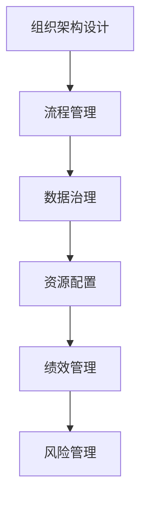

                 

# 拥有体系思维是管理者的必备能力

在快速变化的商业环境中，成功的管理者不仅需要具备技术专长，更需要具备全面系统的管理能力。这其中，拥有体系思维是管理者不可或缺的必备能力。体系思维意味着能够在复杂的系统中，通过系统化的方法和工具，实现组织的有效管理，从而提升整体竞争力。本文将从背景介绍、核心概念与联系、核心算法原理、实际操作、实际应用场景等多个维度，系统阐述体系思维在管理中的重要性，并给出具体的实践方法和工具推荐，帮助管理者更好地掌握这一核心能力。

## 1. 背景介绍

### 1.1 问题由来
随着企业规模的扩大和业务的复杂化，传统的管理方法逐渐显示出其局限性。许多企业在管理过程中，由于缺乏系统化的思维方式，导致资源浪费、效率低下，甚至陷入混乱。而拥有体系思维的管理者，通过系统化的方法，能够清晰地把握组织内部各环节的关联和制约，合理分配资源，高效协调各个部门和团队，使企业能够更好地适应外部环境的变化，提升整体竞争力和市场响应速度。

### 1.2 问题核心关键点
体系思维的本质在于全面、系统、动态地看待问题，从整体到局部，再从局部到整体，不断优化和调整。管理者需要具备系统化的思维框架，包括但不限于：
- **全局视角**：能够从整体上理解组织的运营和目标，确保各部门和团队的工作协同一致。
- **层级划分**：将组织分为多个层级，每个层级有明确的任务和职责，确保信息的上下传递和反馈。
- **数据驱动**：通过数据收集、分析和应用，进行科学的决策和优化，减少主观判断的误差。
- **动态调整**：能够根据环境变化，灵活调整组织的策略和结构，保持敏捷性和适应性。
- **协同合作**：促进不同部门和团队间的合作与沟通，实现资源共享和信息流通。

## 2. 核心概念与联系

### 2.1 核心概念概述

体系思维在管理中的应用，涉及多个核心概念，这些概念相互关联，共同构成了管理者的思维方式和方法论：

- **组织架构设计**：包括职能部门划分、层级结构、岗位职责等，是体系思维的基础。
- **流程管理**：对组织内部流程的梳理、优化和自动化，确保任务执行的顺畅和高效。
- **数据治理**：通过数据标准、数据管理和数据应用，支持决策和运营。
- **资源配置**：合理分配人力、财力、物力等资源，优化资源利用率。
- **绩效管理**：通过指标设定、绩效评估和激励机制，激发员工的工作动力和创造力。
- **风险管理**：识别、评估和控制组织运营中的风险，保障企业健康稳定发展。

### 2.2 核心概念原理和架构的 Mermaid 流程图(Mermaid 流程节点中不要有括号、逗号等特殊字符)



该图展示了体系思维中核心概念的相互关系。组织架构设计是体系思维的基础，流程管理通过优化流程提升效率，数据治理通过数据驱动决策，资源配置优化资源利用率，绩效管理激发员工动力，风险管理保障企业稳定。

## 3. 核心算法原理 & 具体操作步骤

### 3.1 算法原理概述

体系思维的管理方法，可以通过算法模型进行描述和优化。其主要原理包括：

- **目标函数优化**：通过设定合理的目标函数，指导管理决策的制定和优化。
- **约束条件**：基于组织结构、资源限制、政策法规等约束条件，确保管理决策的可行性和合规性。
- **动态规划**：通过时间序列和状态转移，进行长期和短期的资源配置和调整。
- **博弈论**：通过模型化管理过程，进行利益相关方的博弈分析和策略选择。
- **系统动力学**：通过系统模型分析，揭示管理过程的动态行为和稳定特性。

### 3.2 算法步骤详解

#### 3.2.1 目标函数优化

1. **明确目标**：首先，管理者需要明确管理目标，如提升效率、降低成本、提高质量等。
2. **量化指标**：将目标转化为可量化的指标，如处理时间、完成率、错误率等。
3. **构建模型**：基于目标和指标，构建数学模型，优化资源配置和决策方案。
4. **求解算法**：选择合适的求解算法，如线性规划、整数规划等，计算最优解。
5. **迭代优化**：不断迭代优化模型，调整参数和策略，直至满足管理目标。

#### 3.2.2 约束条件

1. **资源限制**：考虑组织可用的资源（如人力、时间、预算等）限制。
2. **政策法规**：考虑国家政策、行业规范和内部规章等约束条件。
3. **技术能力**：考虑现有技术水平和能力，评估新方案的可行性。
4. **外部环境**：考虑市场环境、竞争态势和客户需求等外部因素。

#### 3.2.3 动态规划

1. **分解问题**：将长期目标分解为短期任务，进行阶段性规划和执行。
2. **状态转移**：设定状态变量，定义状态转移方程，描述资源和任务的变化。
3. **优化路径**：通过动态规划算法，寻找最优路径和策略。
4. **持续调整**：根据实际执行情况，实时调整策略和资源分配。

#### 3.2.4 博弈论

1. **模型构建**：构建管理过程中的博弈模型，包括参与者、策略和收益等要素。
2. **策略选择**：通过博弈论算法，计算最优策略组合。
3. **合作共赢**：促进各方合作，实现资源共享和互利共赢。
4. **冲突管理**：通过博弈分析，提前识别和解决冲突点，避免利益冲突。

#### 3.2.5 系统动力学

1. **系统模型**：建立组织管理过程的系统模型，描述系统行为和参数关系。
2. **行为分析**：通过系统动力学工具，分析管理过程的行为特性。
3. **仿真实验**：进行系统仿真实验，验证管理方案的可行性和效果。
4. **反馈调整**：根据仿真结果，进行反馈调整和优化。

### 3.3 算法优缺点

#### 3.3.1 优点

- **全面性**：通过系统化的分析方法，全面考虑组织内部的各个环节和因素，避免遗漏和片面。
- **精确性**：通过数学模型和算法，提供科学、准确的决策支持，减少主观判断误差。
- **灵活性**：动态规划和博弈论等方法，使管理决策能够灵活调整和优化，适应环境变化。
- **可操作性**：算法和模型可以帮助管理者制定具体的操作方案，便于执行和实施。

#### 3.3.2 缺点

- **复杂性**：系统化方法涉及多个变量和约束，模型构建和求解复杂度高。
- **数据依赖**：模型效果依赖于数据质量，数据不准确或不完整会影响结果。
- **时间成本**：算法求解和模型优化需要消耗较多时间和计算资源。
- **适用性**：复杂模型可能不适用于小型企业或简单管理场景。

### 3.4 算法应用领域

体系思维在企业管理中的应用，广泛适用于以下领域：

- **人力资源管理**：通过人员配置、绩效评估、培训和发展等，优化人力资源的利用和价值创造。
- **供应链管理**：通过需求预测、库存管理、物流优化等，提升供应链的效率和稳定性。
- **财务管理**：通过预算编制、成本控制、财务分析等，确保企业的财务健康和利润最大化。
- **市场营销**：通过市场分析、客户细分、渠道管理等，提升市场竞争力和客户满意度。
- **产品开发**：通过需求分析、研发投入、产品迭代等，加速产品创新和市场响应速度。

## 4. 数学模型和公式 & 详细讲解 & 举例说明

### 4.1 数学模型构建

在企业管理中，常见的数学模型包括线性规划、整数规划、动态规划、博弈论模型等。这里以线性规划为例，进行详细讲解。

线性规划的目标函数和约束条件可以表示为：

$$
\begin{aligned}
\max & \quad c^T x \\
\text{subject to} & \quad Ax \leq b \\
& \quad x \geq 0
\end{aligned}
$$

其中，$c$ 为系数向量，$x$ 为决策变量向量，$A$ 为系数矩阵，$b$ 为常数向量。

### 4.2 公式推导过程

线性规划的求解过程，可以通过单纯形法、内点法等算法实现。以单纯形法为例，其基本步骤如下：

1. **初始化**：将问题转化为标准形式，引入人工变量和松弛变量，构造初始单纯形表。
2. **迭代计算**：通过单纯形表中的基变量和检验数，计算每行的比值，选择进基变量和出基变量。
3. **更新单纯形表**：根据进基和出基操作，更新单纯形表，继续迭代计算。
4. **最优解判断**：当单纯形表无进基变量时，计算得到最优解。

### 4.3 案例分析与讲解

#### 4.3.1 案例背景

某制造企业生产两种产品 A 和 B，生产每种产品需要投入人力、设备、原材料等资源。企业希望最大化利润，同时满足生产能力和成本约束。

#### 4.3.2 模型构建

设 $x_i$ 为产品 $i$ 的生产量，$p_i$ 为产品 $i$ 的单价，$c_i$ 为产品 $i$ 的成本，$a_i$ 为产品 $i$ 的生产能力，$b_i$ 为原材料需求量，$m_j$ 为资源约束。

目标函数为：

$$
\max \quad p_A x_A + p_B x_B - (c_A x_A + c_B x_B) - \sum_{j=1}^m m_j y_j
$$

约束条件为：

$$
\begin{aligned}
& x_A + x_B \leq a_A \\
& a_B x_B \leq a_B \\
& b_1 x_A + b_2 x_B \leq b_1 \\
& x_A, x_B \geq 0 \\
& y_j \geq 0
\end{aligned}
$$

其中，$y_j$ 为资源 $j$ 的分配量。

#### 4.3.3 求解过程

1. **初始化**：引入人工变量 $y_j^0$，构造单纯形表。
2. **迭代计算**：根据单纯形法，计算每行的比值，选择进基和出基变量。
3. **更新单纯形表**：更新基变量和检验数，继续迭代计算。
4. **最优解判断**：当单纯形表无进基变量时，计算得到最优解。

#### 4.3.4 结果分析

通过求解线性规划模型，可以确定最优的生产量和资源分配方案，从而最大化利润并满足生产能力和成本约束。

## 5. 项目实践：代码实例和详细解释说明

### 5.1 开发环境搭建

#### 5.1.1 安装相关软件

1. **Python**：下载并安装 Python 3.x 版本。
2. **Pandas**：使用 pip 安装 pandas 库，用于数据处理和分析。
3. **SciPy**：使用 pip 安装 scipy 库，用于科学计算和优化算法。
4. **Matplotlib**：使用 pip 安装 matplotlib 库，用于数据可视化。

#### 5.1.2 配置环境

1. **创建虚拟环境**：使用 Python 虚拟环境工具（如 venv），创建独立的 Python 开发环境。
2. **激活环境**：在命令行中激活虚拟环境。

### 5.2 源代码详细实现

#### 5.2.1 线性规划模型求解

```python
import numpy as np
from scipy.optimize import linprog

# 定义系数矩阵 A、常数向量 b、目标系数向量 c
A = np.array([[1, 1], [0, 1], [1, 0]])
b = np.array([10, 5, 20])
c = np.array([5, 8])

# 定义约束条件和变量范围
x0_bounds = (0, None)
x1_bounds = (0, None)

# 求解线性规划问题
res = linprog(c, A_ub=A, b_ub=b, bounds=[x0_bounds, x1_bounds])

# 输出结果
print("最优解：", res.x)
print("最优值：", res.fun)
```

#### 5.2.2 结果分析

1. **输出最优解**：
   - `res.x`：最优生产量和资源分配量。
   - `res.fun`：最优利润值。

### 5.3 代码解读与分析

#### 5.3.1 代码解读

- `linprog`：SciPy库中的线性规划求解函数。
- `c`：目标函数系数向量。
- `A`：约束条件系数矩阵。
- `b`：约束条件常数向量。
- `x0_bounds` 和 `x1_bounds`：决策变量范围。

#### 5.3.2 分析

通过调用 `linprog` 函数，可以求解线性规划模型，得到最优解和最优值。

## 6. 实际应用场景

### 6.1 供应链管理

#### 6.1.1 案例背景

某电子商务平台需要优化其供应链管理，以减少库存成本和物流时间，提升客户满意度。

#### 6.1.2 模型构建

设 $x_i$ 为商品 $i$ 的库存量，$p_i$ 为商品 $i$ 的单价，$c_i$ 为商品 $i$ 的单位成本，$d_i$ 为商品 $i$ 的需求量，$t_{ij}$ 为商品 $i$ 到地区 $j$ 的运输时间，$r_{ij}$ 为商品 $i$ 到地区 $j$ 的单位运输成本。

目标函数为：

$$
\min \quad \sum_{i=1}^n c_i x_i + \sum_{i=1}^n \sum_{j=1}^m r_{ij} t_{ij} x_i
$$

约束条件为：

$$
\begin{aligned}
& \sum_{i=1}^n d_i x_i = D \\
& x_i \geq 0 \\
& d_i x_i \geq 0
\end{aligned}
$$

其中，$D$ 为总需求量。

#### 6.1.3 求解过程

1. **初始化**：引入人工变量 $z_j^0$，构造单纯形表。
2. **迭代计算**：根据单纯形法，计算每行的比值，选择进基和出基变量。
3. **更新单纯形表**：更新基变量和检验数，继续迭代计算。
4. **最优解判断**：当单纯形表无进基变量时，计算得到最优解。

#### 6.1.4 结果分析

通过求解线性规划模型，可以确定最优的库存量和运输方案，从而降低库存成本和物流时间，提升客户满意度。

### 6.2 人力资源管理

#### 6.2.1 案例背景

某公司需要优化其人力资源管理，以提升员工满意度和工作效率。

#### 6.2.2 模型构建

设 $x_i$ 为员工 $i$ 的工作量，$p_i$ 为员工 $i$ 的薪水，$c_i$ 为员工 $i$ 的固定成本，$y_j$ 为项目 $j$ 的工期，$m_j$ 为项目 $j$ 的资源需求量。

目标函数为：

$$
\max \quad \sum_{i=1}^n p_i x_i - \sum_{i=1}^n c_i x_i - \sum_{j=1}^m m_j y_j
$$

约束条件为：

$$
\begin{aligned}
& \sum_{i=1}^n x_i = T \\
& x_i \geq 0 \\
& y_j \geq 0
\end{aligned}
$$

其中，$T$ 为总工期。

#### 6.2.3 求解过程

1. **初始化**：引入人工变量 $z_j^0$，构造单纯形表。
2. **迭代计算**：根据单纯形法，计算每行的比值，选择进基和出基变量。
3. **更新单纯形表**：更新基变量和检验数，继续迭代计算。
4. **最优解判断**：当单纯形表无进基变量时，计算得到最优解。

#### 6.2.4 结果分析

通过求解线性规划模型，可以确定最优的员工工作量和项目工期分配方案，从而提升员工满意度和工作效率。

## 7. 工具和资源推荐

### 7.1 学习资源推荐

#### 7.1.1 书籍推荐

1. 《运筹学导论》：介绍运筹学基本概念和方法，涵盖线性规划、动态规划、博弈论等。
2. 《管理科学与系统工程》：系统介绍管理科学与系统工程的理论和方法，涵盖决策分析、系统建模等。
3. 《数据科学导论》：介绍数据科学基本概念和方法，涵盖数据收集、分析和应用等。

#### 7.1.2 在线课程推荐

1. Coursera的《运筹学与线性规划》课程：由斯坦福大学教授主讲，深入浅出地介绍线性规划基本概念和方法。
2. edX的《系统工程与优化》课程：由MIT教授主讲，涵盖系统动力学、优化算法等内容。
3. Udacity的《数据科学与统计》课程：涵盖数据科学基本概念和工具，适合初学者学习。

### 7.2 开发工具推荐

#### 7.2.1 Python环境

- Anaconda：提供完整的 Python 开发环境，支持虚拟环境、包管理等。
- Jupyter Notebook：提供交互式开发环境，支持代码调试、数据可视化等。

#### 7.2.2 数据处理

- Pandas：用于数据处理和分析，支持数据导入、清洗、统计等。
- NumPy：用于科学计算和数组操作，支持数学运算、矩阵计算等。

#### 7.2.3 优化算法

- SciPy：用于科学计算和优化算法，支持线性规划、非线性规划等。
- Scikit-Optimize：用于优化问题求解，支持线性规划、非线性规划等。

### 7.3 相关论文推荐

#### 7.3.1 线性规划

1. 《线性规划及其应用》：系统介绍线性规划的基本概念和应用，适合初学者学习。
2. 《整数规划与混合整数规划》：介绍整数规划和混合整数规划的基本概念和算法，适合进阶学习。

#### 7.3.2 动态规划

1. 《动态规划：一种高效求解最优化问题的算法》：介绍动态规划的基本概念和算法，适合初学者学习。
2. 《复杂系统中的动态规划》：介绍复杂系统中的动态规划方法和应用，适合进阶学习。

#### 7.3.3 博弈论

1. 《博弈论及其应用》：介绍博弈论的基本概念和应用，适合初学者学习。
2. 《非合作博弈》：介绍非合作博弈的基本概念和算法，适合进阶学习。

## 8. 总结：未来发展趋势与挑战

### 8.1 研究成果总结

体系思维在企业管理中的应用，通过系统化的分析方法和工具，能够全面、科学地优化资源配置和决策，提升组织效率和竞争力。线性规划、动态规划、博弈论等方法，是体系思维的重要支撑，已经广泛应用于供应链管理、人力资源管理、财务分析等多个领域。

### 8.2 未来发展趋势

未来，体系思维将在企业管理中发挥越来越重要的作用，呈现以下几个发展趋势：

1. **数据驱动**：随着大数据和人工智能技术的发展，数据驱动将成为体系思维的重要特征，通过数据挖掘和分析，提供更科学、精准的决策支持。
2. **智能化**：结合人工智能技术，如机器学习、自然语言处理等，实现智能化决策和优化，提升管理效率和效果。
3. **动态调整**：通过实时监测和反馈机制，实现动态调整和优化，适应环境变化和市场趋势。
4. **多层次协同**：实现不同层次和部门之间的协同和沟通，形成更加全面的管理视角。
5. **跨领域融合**：将体系思维与其他学科和方法进行融合，如心理学、经济学、社会学等，提升管理决策的全面性和科学性。

### 8.3 面临的挑战

体系思维在企业管理中的应用，仍然面临以下挑战：

1. **数据质量和完整性**：数据质量和完整性对体系思维的效果至关重要，如何获取高质量、完整的数据，是管理者的重要任务。
2. **模型复杂性**：体系思维的模型构建和求解复杂度高，需要高水平的专业知识和技能。
3. **动态调整难度**：动态调整需要实时监测和反馈机制，对组织架构和管理流程要求较高。
4. **跨部门协同**：不同部门和团队之间的协同和沟通，需要明确职责和流程，避免信息孤岛和决策冲突。
5. **人机协同**：体系思维需要结合人工智慧，实现人机协同管理，避免完全依赖技术系统的风险。

### 8.4 研究展望

未来，体系思维在企业管理中的应用，需要进一步加强以下研究：

1. **数据治理**：加强数据质量控制和管理，提升数据的可用性和可信度。
2. **智能化决策**：结合人工智能技术，实现智能化决策和优化，提升管理效率和效果。
3. **动态优化**：研究动态调整和优化方法，适应环境变化和市场趋势。
4. **跨部门协同**：研究跨部门协同机制和方法，提升组织协同效率和效果。
5. **人机协同**：研究人机协同管理方法，实现技术系统的辅助决策和人工智慧的结合。

## 9. 附录：常见问题与解答

**Q1：什么是体系思维？**

A: 体系思维是指全面、系统、动态地看待问题，通过系统化的分析方法和工具，实现组织的有效管理，提升整体竞争力和市场响应速度。

**Q2：线性规划的基本原理是什么？**

A: 线性规划是数学规划的一种，目标函数和约束条件均为线性函数。通过求解线性规划模型，可以确定最优的决策变量和资源分配方案，实现目标函数的最大化或最小化。

**Q3：体系思维在企业管理中的应用有哪些？**

A: 体系思维在企业管理中的应用广泛，包括供应链管理、人力资源管理、财务分析、市场营销、产品开发等。通过系统化的分析方法和工具，可以实现资源的优化配置和决策的科学化。

**Q4：线性规划求解过程中需要注意哪些问题？**

A: 线性规划求解过程中，需要注意以下问题：
1. 模型构建：确保模型定义正确，目标函数和约束条件明确。
2. 数据质量：确保数据准确、完整，避免因数据错误导致模型失效。
3. 计算资源：确保计算资源充足，避免因资源不足导致求解失败。
4. 迭代优化：通过迭代求解，不断优化模型参数，直至达到最优解。

**Q5：未来体系思维在企业管理中的应用前景如何？**

A: 未来，体系思维在企业管理中的应用前景广阔，主要表现在以下几个方面：
1. 数据驱动：随着大数据和人工智能技术的发展，数据驱动将成为体系思维的重要特征，通过数据挖掘和分析，提供更科学、精准的决策支持。
2. 智能化：结合人工智能技术，如机器学习、自然语言处理等，实现智能化决策和优化，提升管理效率和效果。
3. 动态调整：通过实时监测和反馈机制，实现动态调整和优化，适应环境变化和市场趋势。
4. 跨领域融合：将体系思维与其他学科和方法进行融合，如心理学、经济学、社会学等，提升管理决策的全面性和科学性。

总之，体系思维在企业管理中的应用，将是未来企业发展的核心竞争力之一，需要不断探索和创新。

