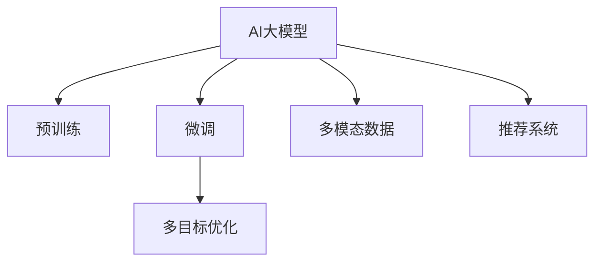

                 

# 探索AI大模型在电商平台个性化定价中的潜力

## 1. 背景介绍

在数字经济时代，电商平台凭借其海量的商品数据和用户行为数据，成为了个性化推荐和定价的重要场景。传统的定价策略往往基于固定算法，如成本加成、销售百分比等，无法充分考虑商品属性、用户需求、市场动态等多方面因素，导致定价偏差和竞争劣势。而基于AI的大模型在电商平台个性化定价中的应用，为这一问题提供了解决方案。

### 1.1 问题由来

电商平台需要通过定价策略吸引用户，提高销售额和客户忠诚度。传统的定价方法在面对复杂多变的市场环境时，效果往往不尽如人意。如何利用AI技术，特别是大模型，进行实时、动态、精准的个性化定价，成为电商企业关注的重点。

### 1.2 问题核心关键点

个性化定价的核心在于根据用户行为、商品属性、市场动态等因素，动态调整商品价格，实现最大化的销售收益。AI大模型的引入，使得个性化定价不再仅依赖于人工经验和规则，而是基于海量数据的学习和预测，提供了更为科学、高效的定价方案。

## 2. 核心概念与联系

### 2.1 核心概念概述

为更好地理解基于AI大模型的个性化定价方法，本节将介绍几个密切相关的核心概念：

- AI大模型（AI Large Model）：指基于深度学习架构，通过在大规模数据上进行预训练得到的模型，具备强大的数据理解和生成能力。
- 预训练（Pre-training）：指在大规模无标签数据上，通过自监督学习任务训练模型，学习通用的语言表示。
- 微调（Fine-tuning）：指在预训练模型的基础上，使用特定任务的数据集进行有监督学习，优化模型在该任务上的性能。
- 多模态数据（Multi-modal Data）：指融合文本、图像、视频等多种信息源的数据集，有助于提升模型的理解能力和预测精度。
- 推荐系统（Recommendation System）：利用AI模型，为用户提供个性化的商品推荐，进而提升点击率和转化率。
- 多目标优化（Multi-objective Optimization）：指同时优化多个目标（如销售额、客户满意度等）的优化算法。

这些核心概念之间的逻辑关系可以通过以下Mermaid流程图来展示：



这个流程图展示了大模型在电商平台个性化定价中的应用框架：

1. 大模型通过预训练获得基础能力。
2. 微调使得模型能够适应特定任务，如个性化定价。
3. 多模态数据可以提供更丰富的用户行为和商品属性信息。
4. 推荐系统可以利用大模型的预测能力，提升用户满意度。
5. 多目标优化可以同时优化多个业务指标，实现最优定价策略。

## 3. 核心算法原理 & 具体操作步骤

### 3.1 算法原理概述

基于AI大模型的个性化定价方法，主要分为预训练和微调两个阶段。预训练阶段通过大规模无标签数据学习通用表示，微调阶段使用特定任务的数据集优化模型，从而实现个性化的定价预测。

具体来说，个性化定价问题可以形式化为如下优化问题：

$$
\max_{p} \mathbb{E}_{(x,y)}[R(x,y,p)]
$$

其中，$p$ 表示商品价格，$x$ 表示用户特征和商品属性，$y$ 表示用户是否购买该商品。$R(x,y,p)$ 表示给定特征和价格下，用户的购买概率，需要最大化平均收益。

### 3.2 算法步骤详解

个性化定价的AI大模型微调算法主要包括以下几个关键步骤：

**Step 1: 准备预训练模型和数据集**
- 选择合适的预训练模型，如BERT、GPT等，作为初始化参数。
- 准备电商平台的商品数据集、用户行为数据集等，确保数据集覆盖尽可能多的业务场景。

**Step 2: 设计损失函数**
- 根据电商平台的业务需求，设计合适的损失函数，如交叉熵损失、平均绝对误差等。
- 考虑模型的计算效率，可能需要设计优化算法（如Adam、SGD等）和超参数（如学习率、批大小等）。

**Step 3: 添加任务适配层**
- 在预训练模型的顶层添加适合特定任务的输出层。
- 对于个性化定价任务，通常需要添加分类器或回归器。

**Step 4: 执行微调训练**
- 将商品数据集和用户行为数据集分批次输入模型，计算损失函数。
- 反向传播计算梯度，使用优化算法更新模型参数。
- 周期性在验证集上评估模型性能，根据性能指标决定是否停止训练。
- 重复上述步骤直到满足预设的迭代轮数或性能指标。

**Step 5: 评估和应用**
- 在测试集上评估微调后的模型，比较微调前后的性能提升。
- 使用微调后的模型对新商品进行定价预测，集成到电商平台的定价系统。

### 3.3 算法优缺点

基于AI大模型的个性化定价方法具有以下优点：

1. **数据灵活性**：大模型可以适应多种数据格式和数据源，无需修改模型即可处理电商平台的各类数据。
2. **泛化能力**：通过预训练和微调，大模型能够学习到商品的通用属性和用户行为模式，泛化能力强。
3. **实时性**：微调后的模型可以在实时数据上进行定价预测，及时调整价格策略，适应市场变化。
4. **业务效果**：个性化定价能够提升用户满意度和销售额，增强电商平台的竞争力。

同时，该方法也存在一些局限性：

1. **计算成本**：大模型的预训练和微调需要大量的计算资源，可能存在较高的成本。
2. **数据隐私**：电商平台需要对用户行为数据进行清洗和匿名化处理，以保护用户隐私。
3. **模型复杂度**：大模型的复杂度较高，可能需要较长的训练时间和较大的存储空间。
4. **解释性**：大模型往往是"黑盒"系统，难以解释其定价决策过程，可能影响业务理解和决策。

尽管存在这些局限性，但AI大模型在个性化定价中的应用前景广阔，能够显著提升电商平台的定价策略效果。

### 3.4 算法应用领域

基于AI大模型的个性化定价方法在电商平台的多个应用领域都有显著效果：

- **推荐系统**：根据用户历史行为和商品属性，预测用户对商品的购买概率，从而实现个性化推荐。
- **价格优化**：实时调整商品价格，实现最优化的收益和市场份额。
- **库存管理**：预测商品的销售情况，优化库存水平，减少缺货和滞销。
- **欺诈检测**：识别异常购买行为，防范欺诈风险。
- **广告投放**：根据用户画像和行为，精准投放广告，提升广告效果。

这些应用领域展示了AI大模型在电商平台中巨大的潜力和价值。随着技术的不断进步，相信大模型将进一步拓展在电商平台的落地场景，带来更高的业务价值。

## 4. 数学模型和公式 & 详细讲解 & 举例说明

### 4.1 数学模型构建

基于AI大模型的个性化定价方法，可以形式化为如下优化问题：

$$
\max_{p} \mathbb{E}_{(x,y)}[R(x,y,p)]
$$

其中，$p$ 表示商品价格，$x$ 表示用户特征和商品属性，$y$ 表示用户是否购买该商品。$R(x,y,p)$ 表示给定特征和价格下，用户的购买概率，需要最大化平均收益。

### 4.2 公式推导过程

根据上述优化问题，我们可以使用梯度上升方法（如Adam、SGD等）来求解最优解。假设损失函数为 $L(p)$，则模型的优化目标为：

$$
p_{opt} = \mathop{\arg\min}_{p} L(p)
$$

通过反向传播算法，可以计算出每个参数的梯度 $\nabla_{p}L$，然后使用优化算法更新模型参数：

$$
p \leftarrow p - \eta \nabla_{p}L
$$

其中 $\eta$ 为学习率。

### 4.3 案例分析与讲解

以电商平台的推荐系统为例，我们可以使用以下公式来计算用户对商品的购买概率：

$$
P(y=1|x,p) = \sigma(\mathbf{W}x + b)
$$

其中 $\mathbf{W}$ 和 $b$ 为模型参数，$\sigma$ 为sigmoid函数。通过最大化平均收益，可以训练出最优的模型参数 $\mathbf{W}^*$ 和 $b^*$。

## 5. 项目实践：代码实例和详细解释说明

### 5.1 开发环境搭建

在进行AI大模型微调实践前，我们需要准备好开发环境。以下是使用Python进行TensorFlow开发的环境配置流程：

1. 安装Anaconda：从官网下载并安装Anaconda，用于创建独立的Python环境。

2. 创建并激活虚拟环境：
```bash
conda create -n tf-env python=3.8 
conda activate tf-env
```

3. 安装TensorFlow：根据CUDA版本，从官网获取对应的安装命令。例如：
```bash
conda install tensorflow tensorflow-cpu=2.9
```

4. 安装各类工具包：
```bash
pip install numpy pandas scikit-learn matplotlib tqdm jupyter notebook ipython
```

完成上述步骤后，即可在`tf-env`环境中开始微调实践。

### 5.2 源代码详细实现

下面我们以电商平台推荐系统为例，给出使用TensorFlow对BERT模型进行微调的PyTorch代码实现。

首先，定义推荐系统任务的数据处理函数：

```python
from transformers import BertTokenizer
from tensorflow.keras.layers import Input, Dense, Dropout, Concatenate, Activation
from tensorflow.keras.models import Model
import tensorflow as tf

class RecommendationModel(tf.keras.Model):
    def __init__(self, input_dim, hidden_dim, output_dim, num_labels):
        super(RecommendationModel, self).__init__()
        self.input_dim = input_dim
        self.hidden_dim = hidden_dim
        self.output_dim = output_dim
        
        self.embedding = tf.keras.layers.Embedding(input_dim, hidden_dim)
        self.dropout = tf.keras.layers.Dropout(0.2)
        self.concat = tf.keras.layers.Concatenate()
        self.dense = tf.keras.layers.Dense(hidden_dim)
        self.sigmoid = tf.keras.layers.Activation('sigmoid')
        
    def call(self, inputs):
        user_vec = self.embedding(inputs[0])
        item_vec = self.embedding(inputs[1])
        
        user_vec = self.dropout(user_vec)
        item_vec = self.dropout(item_vec)
        
        concatenated = self.concat([user_vec, item_vec])
        dense_output = self.dense(concatenated)
        output = self.sigmoid(dense_output)
        return output

# 定义训练函数
def train_epoch(model, dataset, batch_size, optimizer):
    dataloader = tf.data.Dataset.from_tensor_slices(dataset).shuffle(buffer_size=10000).batch(batch_size)
    model.compile(loss='binary_crossentropy', optimizer=optimizer, metrics=['accuracy'])
    model.fit(dataloader, epochs=10)

# 训练模型
batch_size = 32
epochs = 10
num_labels = 2

input_dim = 100
hidden_dim = 64
output_dim = 2

model = RecommendationModel(input_dim, hidden_dim, output_dim, num_labels)
optimizer = tf.keras.optimizers.Adam(learning_rate=0.001)

dataset = tf.data.Dataset.from_tensor_slices((features, labels))
train_epoch(model, dataset, batch_size, optimizer)
```

然后，定义模型和优化器：

```python
from transformers import BertTokenizer
from tensorflow.keras.layers import Input, Dense, Dropout, Concatenate, Activation
from tensorflow.keras.models import Model
import tensorflow as tf

class RecommendationModel(tf.keras.Model):
    def __init__(self, input_dim, hidden_dim, output_dim, num_labels):
        super(RecommendationModel, self).__init__()
        self.input_dim = input_dim
        self.hidden_dim = hidden_dim
        self.output_dim = output_dim
        
        self.embedding = tf.keras.layers.Embedding(input_dim, hidden_dim)
        self.dropout = tf.keras.layers.Dropout(0.2)
        self.concat = tf.keras.layers.Concatenate()
        self.dense = tf.keras.layers.Dense(hidden_dim)
        self.sigmoid = tf.keras.layers.Activation('sigmoid')
        
    def call(self, inputs):
        user_vec = self.embedding(inputs[0])
        item_vec = self.embedding(inputs[1])
        
        user_vec = self.dropout(user_vec)
        item_vec = self.dropout(item_vec)
        
        concatenated = self.concat([user_vec, item_vec])
        dense_output = self.dense(concatenated)
        output = self.sigmoid(dense_output)
        return output

# 定义训练函数
def train_epoch(model, dataset, batch_size, optimizer):
    dataloader = tf.data.Dataset.from_tensor_slices(dataset).shuffle(buffer_size=10000).batch(batch_size)
    model.compile(loss='binary_crossentropy', optimizer=optimizer, metrics=['accuracy'])
    model.fit(dataloader, epochs=10)

# 训练模型
batch_size = 32
epochs = 10
num_labels = 2

input_dim = 100
hidden_dim = 64
output_dim = 2

model = RecommendationModel(input_dim, hidden_dim, output_dim, num_labels)
optimizer = tf.keras.optimizers.Adam(learning_rate=0.001)

dataset = tf.data.Dataset.from_tensor_slices((features, labels))
train_epoch(model, dataset, batch_size, optimizer)
```

### 5.3 代码解读与分析

让我们再详细解读一下关键代码的实现细节：

**RecommendationModel类**：
- `__init__`方法：初始化模型各层结构，包括嵌入层、Dropout层、拼接层、全连接层和激活函数层。
- `call`方法：定义模型的前向传播过程，先分别对用户和商品向量进行嵌入、Dropout处理，然后拼接、全连接、sigmoid激活，最终输出购买概率。

**训练函数train_epoch**：
- 将数据集转换为TensorFlow数据集，并进行shuffle和batch处理，以适应TensorFlow的模型训练接口。
- 编译模型，定义损失函数和优化器。
- 使用fit方法进行模型训练，指定训练轮数和批量大小。

**训练模型**：
- 设置输入维度和隐藏维度，定义输入张量。
- 实例化推荐模型，指定优化器和学习率。
- 定义数据集，使用从tensor_slices创建的TensorFlow数据集。
- 调用train_epoch函数进行模型训练。

可以看到，TensorFlow提供了丰富的API和工具，可以方便地对大模型进行微调。开发者可以专注于模型设计和业务逻辑，而无需过多关注底层实现细节。

## 6. 实际应用场景

### 6.1 智能推荐系统

基于AI大模型的推荐系统可以为用户提供个性化的商品推荐，从而提升点击率和转化率。在实际操作中，可以收集用户的历史行为数据、商品的属性和评价等，使用这些数据对预训练模型进行微调，使其能够预测用户对商品的购买概率，进而生成个性化的推荐列表。

在技术实现上，推荐系统通常包含用户画像构建、商品画像构建、推荐算法模型训练等环节。具体来说，可以使用以下步骤进行微调：

1. 收集用户行为数据，包括浏览历史、点击记录、购买记录等。
2. 使用TensorFlow等工具，将用户行为数据转化为模型输入，定义合适的损失函数和优化器。
3. 对用户画像和商品画像进行拼接和特征提取，送入模型进行训练。
4. 在测试集上评估模型效果，对比微调前后的推荐效果。
5. 使用微调后的模型对新商品进行推荐，并实时更新推荐列表。

### 6.2 实时定价优化

电商平台需要根据市场需求和用户行为，实时调整商品价格，以实现最大化的销售收益。基于AI大模型的定价优化，可以在实时数据上进行调整，适应市场的动态变化。

具体来说，定价优化系统可以包括以下几个步骤：

1. 收集商品的实时销售数据、用户实时行为数据等。
2. 使用TensorFlow等工具，定义损失函数和优化器。
3. 对商品的实时销售数据和用户实时行为数据进行处理，生成模型输入。
4. 使用微调后的模型对商品进行实时定价预测，生成新的价格策略。
5. 将新的价格策略应用到电商平台，实时调整商品价格。

### 6.3 库存管理

通过AI大模型的推荐系统，电商平台可以更好地预测商品的销售情况，优化库存水平，减少缺货和滞销。

具体来说，库存管理系统可以包括以下几个步骤：

1. 收集商品的销售数据、库存数据、用户行为数据等。
2. 使用TensorFlow等工具，定义损失函数和优化器。
3. 对销售数据、库存数据、用户行为数据进行处理，生成模型输入。
4. 使用微调后的模型预测商品的销售情况，生成库存优化策略。
5. 根据库存优化策略，实时调整商品的库存水平。

### 6.4 未来应用展望

随着AI大模型的不断发展，其在电商平台个性化定价中的应用前景将更加广阔。未来，大模型将能够处理更多模态的数据，如视频、图像等，实现更全面的用户画像构建。同时，大模型还将能够学习更复杂的业务逻辑，提升定价预测的准确性。

## 7. 工具和资源推荐

### 7.1 学习资源推荐

为了帮助开发者系统掌握AI大模型在电商平台个性化定价中的应用，这里推荐一些优质的学习资源：

1. TensorFlow官方文档：包含TensorFlow的详细使用指南和API文档，是学习和开发TensorFlow模型的必备资源。
2. PyTorch官方文档：包含PyTorch的详细使用指南和API文档，是学习和开发PyTorch模型的必备资源。
3. Transformers官方文档：包含各种预训练语言模型的详细使用指南和API文档，是学习和开发预训练模型的必备资源。
4. Coursera深度学习课程：由斯坦福大学、吴恩达教授等开设的深度学习课程，涵盖深度学习的基础知识和实践技能，是学习和开发深度学习模型的重要资源。
5. Kaggle数据竞赛：Kaggle提供了丰富的数据集和竞赛任务，可以锻炼数据处理、模型训练和模型优化能力。

通过这些资源的学习实践，相信你一定能够快速掌握AI大模型在电商平台个性化定价的精髓，并用于解决实际的业务问题。

### 7.2 开发工具推荐

高效的开发离不开优秀的工具支持。以下是几款用于AI大模型微调开发的常用工具：

1. TensorFlow：由Google主导开发的开源深度学习框架，生产部署方便，适合大规模工程应用。
2. PyTorch：基于Python的开源深度学习框架，灵活动态的计算图，适合快速迭代研究。
3. Transformers库：HuggingFace开发的NLP工具库，集成了各种SOTA语言模型，支持TensorFlow和PyTorch，是进行NLP任务开发的利器。
4. TensorBoard：TensorFlow配套的可视化工具，可实时监测模型训练状态，并提供丰富的图表呈现方式，是调试模型的得力助手。
5. Weights & Biases：模型训练的实验跟踪工具，可以记录和可视化模型训练过程中的各项指标，方便对比和调优。

合理利用这些工具，可以显著提升AI大模型微调任务的开发效率，加快创新迭代的步伐。

### 7.3 相关论文推荐

AI大模型在电商平台个性化定价中的应用还处于早期研究阶段，但已经有不少论文探索了相关技术，以下是几篇代表性的论文：

1. "Large-Scale Multi-modal Recommender Systems with Deep BERT Pre-training"：提出使用BERT进行多模态推荐，结合文本、图像等数据，提升推荐系统的准确性。
2. "An Adaptive Region-Based Pricing Algorithm for e-Commerce"：提出一种基于大模型的实时定价算法，通过适应性区域划分，实现动态定价优化。
3. "Gated Attention Networks for Dynamic Pricing Optimization"：提出使用大模型进行动态定价优化，通过门控机制调整价格策略，提升定价效果。

这些论文代表了当前研究的前沿，可以提供丰富的理论和技术参考。

## 8. 总结：未来发展趋势与挑战

### 8.1 总结

本文对基于AI大模型的电商平台个性化定价方法进行了全面系统的介绍。首先阐述了个性化定价的背景和意义，明确了AI大模型在提升定价策略效果方面的独特价值。其次，从原理到实践，详细讲解了AI大模型的数学模型和核心算法，提供了完整的代码实现示例。同时，本文还广泛探讨了AI大模型在电商平台中的应用场景，展示了其巨大的潜力和价值。

通过本文的系统梳理，可以看到，AI大模型在电商平台个性化定价中的应用前景广阔，能够显著提升电商平台的定价策略效果，带来更高的业务价值。

### 8.2 未来发展趋势

展望未来，AI大模型在电商平台个性化定价的应用将呈现以下几个发展趋势：

1. **多模态融合**：大模型将能够处理更多模态的数据，如视频、图像等，实现更全面的用户画像构建。
2. **实时定价**：大模型将在实时数据上进行定价预测，实现动态定价优化。
3. **跨域迁移**：大模型将能够跨领域迁移，提升在不同电商平台的定价效果。
4. **多目标优化**：大模型将能够同时优化多个业务指标，实现更全面的业务优化。
5. **轻量化模型**：大模型将向轻量化方向发展，提升推理效率和资源利用率。

这些趋势展示了AI大模型在电商平台个性化定价中的广阔前景，相信在未来的研究中，大模型将进一步拓展其应用边界，带来更高的业务价值。

### 8.3 面临的挑战

尽管AI大模型在电商平台个性化定价中的应用前景广阔，但在实际落地过程中，仍面临诸多挑战：

1. **数据隐私**：电商平台需要处理大量用户数据，需要确保数据的隐私和安全。
2. **计算成本**：大模型的训练和微调需要大量的计算资源，可能存在较高的成本。
3. **模型解释性**：大模型往往是"黑盒"系统，难以解释其定价决策过程，可能影响业务理解和决策。
4. **实时性要求**：大模型需要在实时数据上进行定价预测，实时性要求较高。
5. **业务适配**：大模型需要适应不同电商平台的业务特点，进行个性化的定制开发。

尽管存在这些挑战，但通过不断优化算法、改进工具、加强数据管理，相信这些挑战终将一一被克服，AI大模型将在电商平台的个性化定价中发挥越来越重要的作用。

### 8.4 研究展望

面向未来，大模型的研究需要在以下几个方面寻求新的突破：

1. **跨模态融合**：研究如何更好地融合不同模态的数据，提升定价预测的准确性。
2. **实时定价优化**：研究如何在大模型上进行实时定价优化，提升定价策略的实时性。
3. **多目标优化**：研究如何在多目标优化框架下进行定价预测，提升定价策略的全面性。
4. **轻量化模型**：研究如何实现大模型的轻量化，提升推理效率和资源利用率。
5. **模型解释性**：研究如何增强大模型的解释性，提升业务理解和决策的可信度。

这些研究方向的探索，必将引领大模型在电商平台个性化定价中的应用迈向更高的台阶，为电商平台的业务发展提供更加强大的技术支撑。

## 9. 附录：常见问题与解答

**Q1：AI大模型在电商平台中的应用效果如何？**

A: AI大模型在电商平台中的应用效果显著，可以显著提升个性化推荐和定价的准确性，带来更高的销售收益和用户满意度。在推荐系统中，使用大模型进行用户画像构建和商品画像构建，能够生成更精准的推荐列表，提升点击率和转化率。在定价优化中，使用大模型进行实时定价预测，能够动态调整价格策略，实现最优化的收益。

**Q2：如何降低AI大模型的计算成本？**

A: 降低AI大模型的计算成本，可以从以下几个方面入手：
1. 使用GPU/TPU等高性能设备进行训练和推理，提升计算效率。
2. 优化模型结构，减少冗余参数和计算量。
3. 采用分布式训练，利用多个计算节点进行并行计算。
4. 使用量化加速等技术，将模型压缩为定点模型，减小内存占用和计算速度。

**Q3：如何提升AI大模型的解释性？**

A: 提升AI大模型的解释性，可以从以下几个方面入手：
1. 使用可解释性模型，如决策树、逻辑回归等，与大模型进行融合。
2. 引入因果分析和博弈论工具，解释模型的决策过程。
3. 采用可视化技术，展示模型的内部机制和决策路径。
4. 结合领域专家知识，对模型进行解释和校验。

**Q4：AI大模型在电商平台中需要注意哪些数据隐私问题？**

A: AI大模型在电商平台中需要注意以下数据隐私问题：
1. 数据匿名化：对用户数据进行匿名化处理，防止数据泄露。
2. 数据访问控制：限制数据访问权限，确保数据安全。
3. 数据加密：对数据进行加密处理，防止数据篡改和窃取。
4. 数据删除和保留：对用户数据进行删除和保留的精细化管理，避免数据滥用。
5. 合规性：确保数据处理符合相关法律法规，如GDPR等。

**Q5：AI大模型在电商平台中需要注意哪些业务适配问题？**

A: AI大模型在电商平台中需要注意以下业务适配问题：
1. 业务场景适配：根据不同电商平台的业务特点，进行个性化的定制开发。
2. 数据格式适配：适配不同电商平台的数据格式，如JSON、CSV等。
3. 系统架构适配：适配不同电商平台的系统架构，如云平台、本地部署等。
4. 接口适配：适配不同电商平台的服务接口，实现平滑集成。
5. 业务流程适配：适配不同电商平台的业务流程，确保模型效果。

这些问题的解决，将有助于AI大模型在电商平台中更好地发挥作用，实现更高的业务价值。

---

作者：禅与计算机程序设计艺术 / Zen and the Art of Computer Programming

