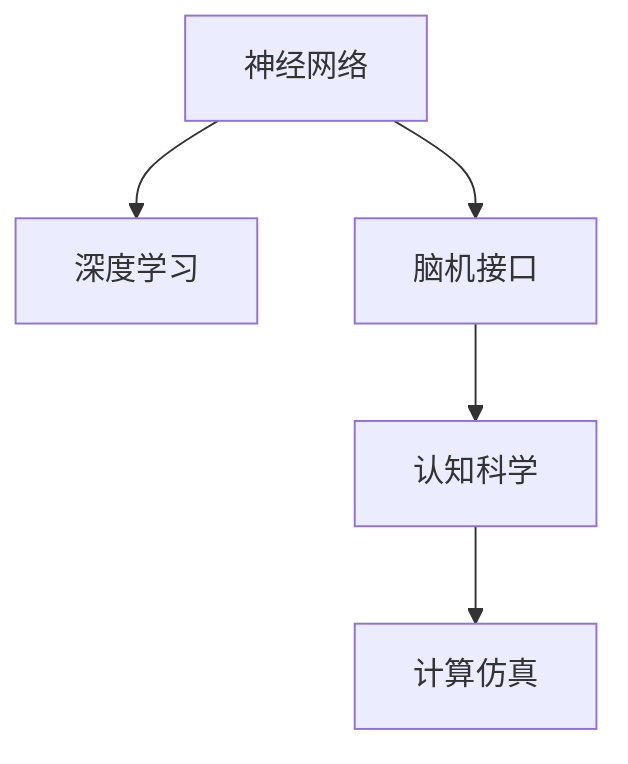

                 

# 探索人类思维的奥秘：人类计算的认知价值

> 关键词：人类计算, 认知价值, 人工智能, 神经网络, 深度学习, 脑机接口, 认知科学, 计算仿真

## 1. 背景介绍

### 1.1 问题由来

随着人工智能技术的飞速发展，人们开始越来越多地探讨机器的思维与人类思维的异同。在人类智能的探索过程中，计算被视为一种重要的工具。那么，我们该如何定义“计算”，以及它的认知价值又在哪里呢？本论文旨在探究人类计算的认知价值，探索它与人类思维的深度联系，以及未来可能的发展方向。

### 1.2 问题核心关键点

计算的本质在于处理信息和解决问题。人类计算不仅仅指传统的基于数字的数学运算，还包括了对符号、语言、图像等各种形式信息的处理。在人工智能领域，这种计算能力得以在神经网络、深度学习等技术中得到充分体现。

人类计算的认知价值在于：
1. **符号表征能力**：人类能够用符号来表征和处理信息，从而更好地理解和表达复杂的概念。
2. **逻辑推理能力**：通过对符号的组合和操作，人类能够进行逻辑推理，解决复杂的实际问题。
3. **学习与适应能力**：人类能够通过学习不断改进自己的计算能力，适应不断变化的环境。

## 2. 核心概念与联系

### 2.1 核心概念概述

为更好地理解人类计算的认知价值，本节将介绍几个关键概念：

- **神经网络**：由大量人工神经元相互连接构成的计算模型，用于处理复杂的数据和模式。
- **深度学习**：一种基于神经网络的机器学习方法，通过多层非线性变换来提取数据的高级特征。
- **脑机接口**：通过技术手段将人类大脑与计算机系统连接起来，实现脑电波与计算机指令的直接交互。
- **认知科学**：研究人类认知过程的科学，包括感知、记忆、思维等方面的知识。
- **计算仿真**：使用计算机模型来模拟人类大脑的计算过程，研究人类认知的机制。

这些概念之间存在紧密的联系，通过神经网络和深度学习技术，我们能够模拟人类大脑的计算过程，并通过脑机接口技术，让这种计算过程与人类思维直接关联。

### 2.2 核心概念原理和架构的 Mermaid 流程图



## 3. 核心算法原理 & 具体操作步骤

### 3.1 算法原理概述

人类计算的核心在于对信息的处理和问题的解决。现代计算模型，如神经网络，通过模拟人类大脑的神经元活动，实现了对复杂数据的高级处理。深度学习作为神经网络的一种特殊形式，通过多层非线性变换，能够从数据中提取更加抽象和高级的特征。

### 3.2 算法步骤详解

人类计算的算法步骤通常包括以下几个方面：

1. **数据采集**：收集用于计算的数据，包括文本、图像、音频等。
2. **数据预处理**：对采集的数据进行清洗和预处理，如分词、标准化等。
3. **模型训练**：使用深度学习等方法，训练神经网络模型，提取数据的高级特征。
4. **模型优化**：通过调整模型参数，优化模型的性能和鲁棒性。
5. **结果输出**：使用训练好的模型对新数据进行计算和推理，得到最终的输出结果。

### 3.3 算法优缺点

**优点**：
1. **高维处理能力**：深度学习模型能够处理高维数据，适用于复杂问题的建模。
2. **自适应学习能力**：通过反向传播算法，模型能够自动调整参数，优化计算过程。
3. **跨领域应用**：深度学习模型在多个领域中都有广泛的应用，如计算机视觉、自然语言处理等。

**缺点**：
1. **模型复杂度高**：深度学习模型参数量巨大，训练和推理过程复杂。
2. **数据依赖性强**：模型需要大量的标注数据进行训练，数据获取成本高。
3. **可解释性差**：深度学习模型通常被视为“黑箱”，难以解释其内部工作机制。

### 3.4 算法应用领域

人类计算技术在多个领域都有广泛的应用：

- **计算机视觉**：通过卷积神经网络(CNN)处理图像数据，实现图像分类、目标检测、人脸识别等功能。
- **自然语言处理**：使用循环神经网络(RNN)和Transformer模型处理文本数据，实现机器翻译、文本生成、情感分析等任务。
- **语音识别**：通过深度学习模型处理语音信号，实现语音识别、语音合成等功能。
- **智能推荐**：使用协同过滤和深度学习模型，根据用户历史行为推荐商品、文章等。
- **医疗诊断**：通过深度学习模型分析医学影像、电子病历等数据，辅助医生进行诊断和治疗决策。

## 4. 数学模型和公式 & 详细讲解 & 举例说明

### 4.1 数学模型构建

在深度学习中，我们通常使用多层神经网络来处理数据。以一个简单的全连接神经网络为例，模型结构可以表示为：

$$
y = W_1 \sigma(z_1) + b_1 = W_2 \sigma(z_2) + b_2 = \ldots = W_L \sigma(z_L) + b_L
$$

其中，$W_i$ 为第 $i$ 层的权重矩阵，$b_i$ 为偏置项，$\sigma$ 为激活函数，$z_i = W_i z_{i-1} + b_i$ 表示第 $i$ 层的输入。

### 4.2 公式推导过程

以一个简单的二分类任务为例，假设有 $n$ 个样本 $(x_1, y_1), (x_2, y_2), \ldots, (x_n, y_n)$，其中 $x_i \in \mathbb{R}^d$ 表示输入向量，$y_i \in \{0, 1\}$ 表示二分类标签。我们希望训练一个线性分类器 $f(x) = \sigma(Wx + b)$，其中 $\sigma$ 为激活函数，$W$ 为权重矩阵，$b$ 为偏置项。

首先，我们需要计算损失函数 $L$，通常使用交叉熵损失函数：

$$
L = -\frac{1}{n} \sum_{i=1}^n [y_i \log f(x_i) + (1-y_i) \log (1-f(x_i))]
$$

接着，使用梯度下降等优化算法，最小化损失函数 $L$，得到最优的参数 $W$ 和 $b$：

$$
W = W - \eta \frac{\partial L}{\partial W}, \quad b = b - \eta \frac{\partial L}{\partial b}
$$

其中 $\eta$ 为学习率，$\frac{\partial L}{\partial W}$ 和 $\frac{\partial L}{\partial b}$ 分别为损失函数对权重和偏置的梯度。

### 4.3 案例分析与讲解

以图像分类任务为例，我们可以使用卷积神经网络(CNN)进行模型构建。CNN通过卷积层、池化层和全连接层等结构，能够有效地处理图像数据。以下是一个简单的CNN模型：

```python
import torch
import torch.nn as nn

class CNN(nn.Module):
    def __init__(self):
        super(CNN, self).__init__()
        self.conv1 = nn.Conv2d(3, 32, 3)
        self.pool = nn.MaxPool2d(2, 2)
        self.fc1 = nn.Linear(32 * 8 * 8, 128)
        self.fc2 = nn.Linear(128, 10)
    
    def forward(self, x):
        x = self.pool(torch.relu(self.conv1(x)))
        x = x.view(-1, 32 * 8 * 8)
        x = torch.relu(self.fc1(x))
        x = self.fc2(x)
        return x

# 定义模型、损失函数和优化器
model = CNN()
criterion = nn.CrossEntropyLoss()
optimizer = torch.optim.SGD(model.parameters(), lr=0.001, momentum=0.9)

# 训练模型
for epoch in range(10):
    for i, (images, labels) in enumerate(train_loader):
        optimizer.zero_grad()
        outputs = model(images)
        loss = criterion(outputs, labels)
        loss.backward()
        optimizer.step()
```

## 5. 项目实践：代码实例和详细解释说明

### 5.1 开发环境搭建

在进行人类计算的实践之前，我们需要准备开发环境。以下是使用Python进行TensorFlow开发的环境配置流程：

1. 安装Anaconda：从官网下载并安装Anaconda，用于创建独立的Python环境。

2. 创建并激活虚拟环境：
```bash
conda create -n tf-env python=3.8 
conda activate tf-env
```

3. 安装TensorFlow：根据CUDA版本，从官网获取对应的安装命令。例如：
```bash
conda install tensorflow -c conda-forge
```

4. 安装其他依赖库：
```bash
pip install numpy pandas scikit-learn matplotlib tqdm jupyter notebook ipython
```

完成上述步骤后，即可在`tf-env`环境中开始人类计算的实践。

### 5.2 源代码详细实现

以下是一个简单的图像分类任务的TensorFlow代码实现。

```python
import tensorflow as tf
from tensorflow.keras import layers, models

# 定义模型
model = models.Sequential([
    layers.Conv2D(32, (3, 3), activation='relu', input_shape=(28, 28, 1)),
    layers.MaxPooling2D((2, 2)),
    layers.Flatten(),
    layers.Dense(10, activation='softmax')
])

# 定义损失函数和优化器
criterion = tf.keras.losses.CategoricalCrossentropy()
optimizer = tf.keras.optimizers.Adam()

# 训练模型
model.compile(optimizer=optimizer, loss=criterion, metrics=['accuracy'])
model.fit(train_images, train_labels, epochs=5, validation_data=(val_images, val_labels))
```

### 5.3 代码解读与分析

**模型定义**：
- `layers.Conv2D` 和 `layers.MaxPooling2D`：定义卷积层和池化层，用于处理图像数据。
- `layers.Flatten` 和 `layers.Dense`：定义全连接层，用于分类。
- `model = models.Sequential`：将所有层依次连接起来，构建神经网络模型。

**损失函数和优化器**：
- `tf.keras.losses.CategoricalCrossentropy`：定义交叉熵损失函数，用于分类任务。
- `tf.keras.optimizers.Adam`：定义Adam优化器，用于更新模型参数。

**模型训练**：
- `model.fit`：对模型进行训练，输入训练集数据和标签，设定训练轮数和验证集数据。

## 6. 实际应用场景

### 6.1 图像识别

人类计算在图像识别领域有着广泛的应用。通过深度学习模型，我们可以训练出高精度的图像分类器，用于识别和分类的任务。

在实际应用中，我们可以将采集的图像数据输入模型进行训练和推理，得到最终的分类结果。例如，在医学影像中，可以通过训练的模型自动识别出肿瘤等病变区域，辅助医生进行诊断。

### 6.2 自然语言处理

自然语言处理是另一个典型的人类计算应用场景。通过深度学习模型，我们可以实现文本分类、情感分析、机器翻译等任务。

在实际应用中，我们可以将文本数据输入模型进行训练和推理，得到分类、情感或翻译结果。例如，在机器翻译中，可以通过训练的模型将英语文本自动翻译成中文，极大地提高翻译效率和准确性。

### 6.3 医疗诊断

在医疗领域，人类计算技术也有着重要的应用。通过深度学习模型，我们可以分析医学影像、电子病历等数据，辅助医生进行诊断和治疗决策。

在实际应用中，我们可以将医学影像或病历数据输入模型进行训练和推理，得到诊断结果。例如，在癌症诊断中，可以通过训练的模型自动检测出病灶，辅助医生进行更准确的诊断。

### 6.4 未来应用展望

未来，人类计算技术将在更多的领域得到应用，为人类生产和生活带来深远的影响。以下是一些可能的应用方向：

- **智慧城市**：通过深度学习模型，可以实现交通流量预测、环境监测、智能交通管理等功能，提升城市治理的智能化水平。
- **教育**：通过深度学习模型，可以实现自动批改作业、个性化推荐学习内容等功能，提升教育效果和教学效率。
- **金融**：通过深度学习模型，可以实现风险评估、股票预测、客户行为分析等功能，提升金融服务的智能化水平。
- **农业**：通过深度学习模型，可以实现精准农业、病虫害预测、农产品质量检测等功能，提升农业生产效率和产品质量。

## 7. 工具和资源推荐

### 7.1 学习资源推荐

为了帮助开发者系统掌握人类计算的理论基础和实践技巧，这里推荐一些优质的学习资源：

1. **《深度学习》系列书籍**：Ian Goodfellow等著，全面介绍了深度学习的基本原理和应用实例。
2. **《神经网络与深度学习》系列视频**：Andrew Ng等讲授的课程，深入浅出地介绍了神经网络和深度学习的核心概念。
3. **《TensorFlow官方文档》**：TensorFlow的官方文档，提供了丰富的代码样例和教程，是学习TensorFlow的最佳资料。
4. **Kaggle平台**：提供大量的数据集和竞赛，实践深度学习模型的构建和优化。
5. **arXiv预印本库**：收录了前沿的研究论文，了解最新的研究成果和应用方向。

通过对这些资源的学习实践，相信你一定能够快速掌握人类计算的精髓，并用于解决实际的NLP问题。

### 7.2 开发工具推荐

高效的开发离不开优秀的工具支持。以下是几款用于人类计算开发的常用工具：

1. **TensorFlow**：由Google主导开发的深度学习框架，支持多种硬件加速，如GPU、TPU等。
2. **PyTorch**：Facebook开发的深度学习框架，支持动态图和静态图，适用于快速迭代研究。
3. **Keras**：高层深度学习API，易于上手，支持多种深度学习框架。
4. **Jupyter Notebook**：交互式编程环境，支持多语言的代码编写和实时可视化。
5. **Weights & Biases**：模型训练的实验跟踪工具，可以记录和可视化模型训练过程中的各项指标，方便对比和调优。

合理利用这些工具，可以显著提升人类计算任务的开发效率，加快创新迭代的步伐。

### 7.3 相关论文推荐

人类计算技术的发展源于学界的持续研究。以下是几篇奠基性的相关论文，推荐阅读：

1. **AlexNet**：Krizhevsky等著，提出了第一个成功的深度学习模型，开启了深度学习时代。
2. **ImageNet挑战**：深度学习在图像分类任务上的突破，ImageNet挑战是这一突破的重要标志。
3. **BERT**：Devlin等著，提出了BERT模型，通过预训练语言模型在NLP任务上的突破。
4. **AlphaGo**：Silver等著，使用深度强化学习技术，成功训练出战胜人类的围棋AI。
5. **GPT-3**：Brown等著，提出了GPT-3模型，展示了深度学习在自然语言生成上的巨大潜力。

这些论文代表了大计算技术的发展脉络。通过学习这些前沿成果，可以帮助研究者把握学科前进方向，激发更多的创新灵感。

## 8. 总结：未来发展趋势与挑战

### 8.1 总结

本文对人类计算的认知价值进行了全面系统的介绍。首先阐述了人类计算在符号表征、逻辑推理、学习能力等方面的特点，明确了其在人工智能中的核心地位。其次，从原理到实践，详细讲解了深度学习模型的构建和训练过程，给出了人类计算任务开发的完整代码实例。同时，本文还广泛探讨了人类计算技术在图像识别、自然语言处理、医疗诊断等诸多领域的应用前景，展示了人类计算技术的广阔前景。

通过本文的系统梳理，可以看到，人类计算技术正在成为人工智能领域的重要范式，极大地拓展了深度学习模型的应用边界，催生了更多的落地场景。未来，伴随深度学习模型和人类计算技术的持续演进，相信人工智能技术必将在更广阔的应用领域大放异彩，深刻影响人类的生产生活方式。

### 8.2 未来发展趋势

展望未来，人类计算技术将呈现以下几个发展趋势：

1. **模型规模持续增大**：随着算力成本的下降和数据规模的扩张，深度学习模型的参数量还将持续增长。超大规模模型蕴含的丰富知识，有望支撑更加复杂多变的任务处理。
2. **计算仿真与认知科学结合**：通过计算仿真技术，可以模拟人类大脑的计算过程，研究认知科学的原理。这种结合将进一步提升人类计算技术的能力。
3. **跨领域应用拓展**：人类计算技术将在更多的领域得到应用，如智慧城市、金融、教育等，为人类社会带来深远的影响。
4. **自动化与自适应学习**：未来的计算模型将具备更强的自动化和自适应学习能力，能够根据环境变化快速调整策略。
5. **伦理与安全性考量**：随着计算技术的广泛应用，伦理与安全性问题将受到更多关注。如何在提升计算能力的同时，保障数据安全和用户隐私，将是重要的研究方向。

以上趋势凸显了人类计算技术的广阔前景。这些方向的探索发展，必将进一步提升人工智能系统的性能和应用范围，为人类认知智能的进化带来深远影响。

### 8.3 面临的挑战

尽管人类计算技术已经取得了瞩目成就，但在迈向更加智能化、普适化应用的过程中，它仍面临着诸多挑战：

1. **数据依赖性强**：深度学习模型需要大量的标注数据进行训练，数据获取成本高。
2. **可解释性差**：深度学习模型通常被视为“黑箱”，难以解释其内部工作机制。
3. **计算资源消耗高**：深度学习模型参数量巨大，训练和推理过程复杂。
4. **伦理与安全问题**：深度学习模型可能学习到有害信息，对社会造成不良影响。
5. **对抗性攻击**：深度学习模型容易受到对抗性攻击，导致误判或失效。

这些挑战亟待解决，才能让人类计算技术真正成为人类生产生活中的可靠助手。

### 8.4 研究展望

面对人类计算技术面临的挑战，未来的研究需要在以下几个方面寻求新的突破：

1. **数据增强与生成技术**：开发更多数据增强和生成方法，提高数据利用效率，降低标注成本。
2. **可解释性与透明性**：研究可解释性技术，增强深度学习模型的透明性，方便用户理解和调试。
3. **计算图优化**：优化深度学习计算图，提高计算效率，降低资源消耗。
4. **安全性与隐私保护**：研究安全性技术，保障深度学习模型的鲁棒性和安全性。
5. **跨领域应用融合**：研究跨领域应用融合技术，提升人类计算技术在更多场景下的应用能力。

这些研究方向的探索，必将引领人类计算技术迈向更高的台阶，为构建安全、可靠、可解释、可控的智能系统铺平道路。

## 9. 附录：常见问题与解答

**Q1：人类计算与人工智能的区别是什么？**

A: 人类计算与人工智能的区别在于，人类计算强调的是人脑计算的模型化与模拟，而人工智能更关注于如何让机器模仿人类的智能行为。人类计算的认知价值在于其对符号表征、逻辑推理和自适应学习的支持，而人工智能更注重实际应用和问题解决。

**Q2：如何提高深度学习模型的可解释性？**

A: 提高深度学习模型的可解释性可以通过以下几种方法：
1. 可视化模型特征：使用可视化工具展示模型的中间特征，帮助理解模型的内部工作机制。
2. 生成可解释的特征：使用可解释的特征提取技术，如LIME、SHAP等，生成模型决策的可解释特征。
3. 引入先验知识：在模型训练过程中，加入先验知识约束，提高模型的可解释性。

**Q3：如何应对深度学习模型的计算资源消耗？**

A: 应对深度学习模型的计算资源消耗可以通过以下几种方法：
1. 模型剪枝：去除模型中不必要的参数，减小模型尺寸。
2. 量化加速：将浮点模型转为定点模型，压缩存储空间，提高计算效率。
3. 模型并行：采用模型并行技术，分布式计算，加速训练过程。

**Q4：如何提升深度学习模型的鲁棒性？**

A: 提升深度学习模型的鲁棒性可以通过以下几种方法：
1. 数据增强：通过数据增强技术，增加训练集的多样性，提高模型的泛化能力。
2. 对抗训练：在训练过程中加入对抗样本，提高模型对攻击的鲁棒性。
3. 模型正则化：使用L2正则、Dropout等技术，避免模型过拟合，提高模型的鲁棒性。

**Q5：深度学习模型如何处理对抗性攻击？**

A: 深度学习模型处理对抗性攻击可以通过以下几种方法：
1. 对抗样本生成：生成对抗样本，检测模型的鲁棒性。
2. 对抗训练：在训练过程中加入对抗样本，提高模型的鲁棒性。
3. 模型检测：使用检测算法，检测模型的对抗性漏洞，并进行修复。

---

作者：禅与计算机程序设计艺术 / Zen and the Art of Computer Programming

