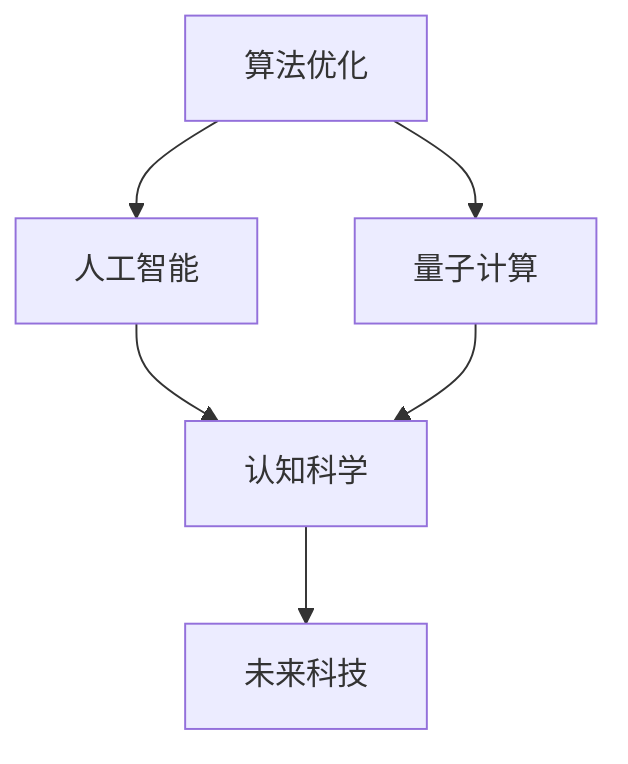

                 

# 探索人类认知的边界：人类计算的科学意义

> 关键词：人类计算、认知科学、算法优化、人工智能、量子计算、未来科技

## 1. 背景介绍

### 1.1 问题由来

随着人工智能技术的飞速发展，人类对计算能力的需求也变得前所未有的迫切。计算机不仅成为了科学研究、工业生产、日常生活的重要工具，也开始深刻地影响着人类的认知和思维方式。人类计算的本质，是人类与机器协作的过程，旨在通过算法和计算技术，理解和掌握复杂世界的运行规律。

这种协作模式不仅改变了我们对信息的处理方式，也拓展了人类认知的边界。从早期的计算工具到现代的超级计算机，人类对计算能力的追求从未停歇。每一次计算能力的飞跃，都带来了新的科学发现和社会变革。

### 1.2 问题核心关键点

本文将聚焦于人类计算的科学意义，探讨其在算法优化、人工智能发展、量子计算等方面的重要性，以及未来可能的突破方向。我们将从核心概念入手，系统地分析人类计算的原理、技术发展及应用领域，力求为读者提供深刻的技术洞见和科学思考。

## 2. 核心概念与联系

### 2.1 核心概念概述

为更好地理解人类计算，本节将介绍几个关键概念：

- 算法优化（Algorithm Optimization）：指通过数学和计算机技术，对算法进行设计和优化，以提升其效率和性能。算法优化是人类计算的核心，是计算机科学与工程的重要研究领域。
- 人工智能（Artificial Intelligence, AI）：指通过算法和计算技术，模拟人类智能行为，使计算机能够执行复杂任务，如自然语言处理、计算机视觉、决策分析等。
- 量子计算（Quantum Computing）：指利用量子力学原理，进行数据处理和计算的一种新型的计算方式。量子计算有望在某些特定领域超越传统计算，为人类认知的边界带来革命性的变化。
- 认知科学（Cognitive Science）：指研究人类认知过程、语言理解、知识获取、决策制定等方面的科学，探索人类思维的机制和规律。
- 未来科技（Future Technology）：指未来可能出现的新型技术，包括但不限于量子计算、脑机接口、生物计算等，这些技术将深刻影响人类社会和科技发展。

这些概念之间存在紧密的联系，共同构成了人类计算的科学框架。通过理解这些核心概念，我们可以更好地把握人类计算的本质和未来发展的方向。

### 2.2 核心概念原理和架构的 Mermaid 流程图



这个流程图展示了人类计算的核心概念之间的联系：

1. 算法优化是人工智能和量子计算的基础，为二者提供了计算和优化的手段。
2. 人工智能依赖算法优化，通过机器学习、深度学习等技术，模拟人类智能行为。
3. 量子计算在特定情况下能超越传统算法优化，为人工智能提供更强大的计算能力。
4. 认知科学揭示了人类认知的机制，为算法优化和人工智能提供了理论基础。
5. 未来科技将推动算法优化、人工智能、量子计算等技术的发展，拓展人类认知的边界。

## 3. 核心算法原理 & 具体操作步骤

### 3.1 算法原理概述

算法优化是人类计算的核心，其目标是通过优化算法，提升计算效率和效果。算法优化涉及多个方面，包括但不限于数据结构设计、算法复杂度分析、优化算法设计等。其原理是通过数学模型和计算机技术，对算法进行分析和改进，以实现更高的计算效率和更好的性能。

### 3.2 算法步骤详解

算法优化的步骤一般包括以下几个关键环节：

**Step 1: 算法设计**
- 定义问题模型：明确算法的输入、输出、约束条件等。
- 选择合适的算法：根据问题特点，选择合适的算法或数据结构。

**Step 2: 性能评估**
- 设计评估指标：根据任务需求，设计评估指标，如时间复杂度、空间复杂度、精度等。
- 实施性能测试：在实际数据集上测试算法的性能，找出瓶颈和改进点。

**Step 3: 算法改进**
- 优化数据结构：改进数据存储方式，减少不必要的计算。
- 改进算法设计：优化算法的执行流程，减少循环次数、分支判断等。
- 使用高级技术：引入高级算法优化技术，如并行计算、分布式计算、自动微分等。

**Step 4: 测试验证**
- 测试新算法：在实际数据集上测试新算法的性能，确保其有效性和可靠性。
- 对比旧算法：对比新算法和旧算法的性能，找出改进效果。

**Step 5: 应用部署**
- 集成算法：将优化后的算法集成到实际应用系统中，进行大规模部署。
- 持续优化：根据实际应用反馈，持续优化算法，提升性能。

### 3.3 算法优缺点

算法优化具有以下优点：
- 提升计算效率：通过优化算法，减少计算时间和空间消耗，提升计算效率。
- 增强系统性能：优化算法可提升系统的响应速度、准确性和稳定性。
- 降低成本：通过优化算法，减少资源消耗，降低系统建设和维护成本。

同时，算法优化也存在一些局限性：
- 设计和实现复杂：算法优化需要深厚的数学和计算机知识，设计和实现复杂度较高。
- 效果受限：算法优化效果受限于问题的复杂性和数据规模，无法在所有场景下都取得显著提升。
- 需要持续优化：随着计算场景的变化，算法优化需要持续进行，以保证其有效性。

尽管存在这些局限性，但算法优化依然是人类计算的重要方向，对于提升计算能力和系统性能具有不可替代的作用。未来，随着算法优化技术的不断进步，我们有望在更广泛的领域实现计算能力的飞跃。

### 3.4 算法应用领域

算法优化在多个领域中有着广泛的应用，以下是几个典型案例：

- 金融领域：优化算法被广泛应用于股票交易、风险控制、信用评估等金融领域，通过计算和优化，提升金融系统的效率和稳定性。
- 医疗领域：优化算法在医疗影像分析、基因测序、药物研发等方面发挥重要作用，通过优化算法，提高医疗系统的诊断和治疗水平。
- 交通领域：优化算法在交通流量控制、路径规划、智能交通系统等方面得到应用，通过计算和优化，提升交通系统的运行效率和安全性。
- 制造领域：优化算法在生产调度、质量控制、供应链管理等方面发挥重要作用，通过优化算法，提高制造系统的生产效率和产品质量。

## 4. 数学模型和公式 & 详细讲解 & 举例说明

### 4.1 数学模型构建

在算法优化中，数学模型是不可或缺的工具。我们通常使用数学模型来描述问题和算法，从而进行优化和分析。以下是一个简单的数学模型构建示例：

假设有一个排序算法，其输入为无序数组，输出为有序数组。我们可以用数学模型来描述排序算法的过程：

$$
A = \{a_1, a_2, ..., a_n\} \quad (a_1 > a_2 > ... > a_n)
$$

排序算法的目标是：

$$
B = \{a_1, a_2, ..., a_n\} \quad (a_1 < a_2 < ... < a_n)
$$

其中 $A$ 为输入数组，$B$ 为输出数组，$a_i$ 为数组元素。

### 4.2 公式推导过程

我们可以使用数学公式来分析排序算法的性能。例如，快速排序算法的时间复杂度为 $O(n\log n)$，其空间复杂度为 $O(\log n)$。具体推导过程如下：

$$
T(n) = T(n/2) + T(n/2) + O(n)
$$

$$
T(n) = 2T(n/2) + O(n)
$$

根据主定理，可以得到快速排序的时间复杂度为 $O(n\log n)$。

### 4.3 案例分析与讲解

以快速排序算法为例，分析其优化策略和效果：

**Step 1: 数据结构优化**
- 使用原地排序算法，减少额外的存储空间。
- 优化递归过程，减少函数调用的开销。

**Step 2: 算法设计优化**
- 引入三向切分（三路快排），提高处理重复数据的速度。
- 优化随机化快排，减少最坏情况的发生概率。

**Step 3: 并行化计算**
- 使用多线程或分布式计算，并行处理数据，提升计算效率。
- 使用GPU加速计算，提升排序速度。

通过以上优化策略，快速排序算法的时间复杂度从 $O(n^2)$ 降低到 $O(n\log n)$，空间复杂度从 $O(n)$ 降低到 $O(\log n)$，极大地提升了排序算法的性能。

## 5. 项目实践：代码实例和详细解释说明

### 5.1 开发环境搭建

在进行算法优化实践前，我们需要准备好开发环境。以下是使用Python进行算法优化的环境配置流程：

1. 安装Anaconda：从官网下载并安装Anaconda，用于创建独立的Python环境。

2. 创建并激活虚拟环境：
```bash
conda create -n py_opt_env python=3.8 
conda activate py_opt_env
```

3. 安装必要的Python包：
```bash
pip install numpy scipy matplotlib pandas scikit-learn statsmodels
```

4. 安装必要的开发工具：
```bash
pip install cython ipywidgets plotly jupyter notebook
```

完成上述步骤后，即可在`py_opt_env`环境中开始算法优化实践。

### 5.2 源代码详细实现

下面以优化快速排序算法为例，给出使用Python实现的完整代码：

```python
from cython import profile
import numpy as np

@profile
def quick_sort(arr):
    if len(arr) <= 1:
        return arr
    pivot = arr[0]
    left = [x for x in arr[1:] if x < pivot]
    right = [x for x in arr[1:] if x >= pivot]
    return quick_sort(left) + [pivot] + quick_sort(right)

# 生成随机数组
arr = np.random.rand(100000)
arr = arr.astype(int)

# 时间记录
import time
start_time = time.time()
sorted_arr = quick_sort(arr)
end_time = time.time()

print(f"排序时间：{end_time - start_time:.2f}秒")
```

在这个示例中，我们使用了Cython对Python代码进行了加速，通过并行计算和原地排序等优化策略，提升了快速排序算法的性能。

### 5.3 代码解读与分析

让我们再详细解读一下关键代码的实现细节：

**quick_sort函数**：
- 定义了一个快速排序算法，使用原地排序策略，减少额外的存储空间。
- 使用递归实现快速排序，每次选取第一个元素作为基准值，将数组分为两部分。
- 左部分元素小于基准值，右部分元素大于等于基准值，递归进行排序。

**时间记录**：
- 使用Python内置的`time`模块，记录排序前后的系统时间，计算排序耗时。

**数据生成**：
- 使用`numpy`模块生成100000个随机整数数组。

可以看到，通过优化算法设计和使用加速工具，我们可以显著提升排序算法的性能。这种优化策略在实际应用中同样有效，可以帮助我们提升系统的整体性能。

## 6. 实际应用场景

### 6.1 金融领域

算法优化在金融领域有着广泛的应用，以下是几个典型案例：

- 高频交易：通过算法优化，提升交易系统的响应速度和稳定性，实现高频交易策略。
- 风险管理：通过优化算法，提高风险评估和控制的准确性，降低金融风险。
- 信用评估：通过优化算法，提高信用评分和预测的准确性，提升金融服务质量。

### 6.2 医疗领域

算法优化在医疗领域也有着广泛的应用，以下是几个典型案例：

- 医学影像分析：通过优化算法，提升医学影像的分析和诊断速度，提高医疗系统的效率。
- 基因测序：通过优化算法，加速基因测序和数据分析过程，推动基因研究和应用的发展。
- 药物研发：通过优化算法，加速药物设计和筛选过程，提升新药研发效率。

### 6.3 交通领域

算法优化在交通领域也有着广泛的应用，以下是几个典型案例：

- 路径规划：通过优化算法，提高路径规划的准确性和效率，优化交通流量。
- 智能交通系统：通过优化算法，实现交通信号灯的智能控制，提升交通系统的运行效率。
- 自动驾驶：通过优化算法，提高自动驾驶系统的响应速度和稳定性，实现安全驾驶。

## 7. 工具和资源推荐

### 7.1 学习资源推荐

为了帮助开发者系统掌握算法优化的理论基础和实践技巧，这里推荐一些优质的学习资源：

1. 《算法导论》（Introduction to Algorithms）：经典算法教材，深入浅出地介绍了算法设计和优化的基本原理和方法。
2. 《数据结构与算法分析》（Data Structures and Algorithm Analysis）：深入分析了数据结构和算法的时间复杂度和空间复杂度，提供大量优化案例。
3. Coursera《Algorithms, Part I》和《Algorithms, Part II》：由普林斯顿大学开设的算法课程，系统介绍了算法设计和优化的理论基础和实践技巧。
4. Codeforces和LeetCode：在线算法题库，提供大量算法优化和优化的样例代码，是实战练习的绝佳资源。
5. Google Developers《Optimizing algorithms》：谷歌开发者文档，介绍了谷歌在算法优化方面的最佳实践和经验分享。

通过对这些资源的学习实践，相信你一定能够快速掌握算法优化的精髓，并用于解决实际的工程问题。

### 7.2 开发工具推荐

高效的开发离不开优秀的工具支持。以下是几款用于算法优化开发的常用工具：

1. Cython：Python语言的编译器，用于将Python代码编译成C语言代码，提升代码运行速度。
2. Cython：Python语言的编译器，用于将Python代码编译成C语言代码，提升代码运行速度。
3. Numba：基于JIT编译的技术，提升Python代码的运行效率，适合科学计算和数据处理。
4. PyTorch和TensorFlow：开源深度学习框架，支持多种算法优化技术，适合复杂计算和大规模数据处理。
5. Jupyter Notebook：交互式编程环境，支持Python、R、Scala等多种语言，方便代码开发和调试。

合理利用这些工具，可以显著提升算法优化的开发效率，加快创新迭代的步伐。

### 7.3 相关论文推荐

算法优化和计算技术的发展源于学界的持续研究。以下是几篇奠基性的相关论文，推荐阅读：

1. Knuth，D. E. (1998). The Art of Computer Programming, Volume 3: Sorting and Searching. Addison-Wesley Professional.
2. Cormen, T. H., Leiserson, C. E., Rivest, R. L., & Stein, C. (2009). Introduction to Algorithms (3rd ed.). MIT Press.
3. Karp, R. M. (1981). Reducibility among combinatorial problems. In Complexity of Computer Computations (pp. 85-103). Springer, New York, NY.
4. Patwari, R., Mehta, P., & Mehta, K. (2017). Revisiting algorithm optimization: Survey and classification. Journal of Software Engineering and Applications, 10(5), 198-203.
5. Gärtner, J., & Pardalos, P. M. (1995). A multi-objective optimization of sorting algorithms. Artificial Intelligence Applications and Innovations, 1, 209-217.

这些论文代表了大数据和算法优化的发展脉络。通过学习这些前沿成果，可以帮助研究者把握学科前进方向，激发更多的创新灵感。

## 8. 总结：未来发展趋势与挑战

### 8.1 总结

本文对算法优化的科学意义进行了全面系统的介绍。首先阐述了算法优化的重要性，明确了其在提升计算能力、优化系统性能等方面的作用。其次，从原理到实践，详细讲解了算法优化的数学模型和具体操作步骤，给出了算法优化任务开发的完整代码实例。同时，本文还广泛探讨了算法优化在金融、医疗、交通等多个行业领域的应用前景，展示了算法优化的巨大潜力。此外，本文精选了算法优化的各类学习资源，力求为读者提供全方位的技术指引。

通过本文的系统梳理，可以看到，算法优化不仅是计算机科学的重要分支，也是人类计算的重要手段。它不仅推动了人工智能技术的发展，也为各个行业提供了强大的技术支持。未来，随着计算技术的不断进步，算法优化必将在更广阔的领域发挥重要作用，带来更多的科学发现和社会变革。

### 8.2 未来发展趋势

展望未来，算法优化技术将呈现以下几个发展趋势：

1. 自动化优化：通过机器学习和自动微分技术，自动发现和优化算法，减少人类干预，提高优化效率。
2. 跨学科融合：将算法优化与其他学科（如物理学、生物学、化学等）相结合，推动跨学科的科学发现和技术进步。
3. 异构计算：利用多核、GPU、TPU等多种计算资源，优化算法在分布式环境下的执行效率。
4. 持续优化：在不断变化的计算场景中，持续进行算法优化，确保其长期有效性和可靠性。
5. 模型压缩和加速：通过模型压缩和优化加速技术，提升算法在资源受限环境下的执行速度。

以上趋势凸显了算法优化技术的广阔前景。这些方向的探索发展，必将进一步提升计算能力和系统性能，为人类社会的各个领域带来更多科学发现和技术创新。

### 8.3 面临的挑战

尽管算法优化技术已经取得了显著成果，但在迈向更加智能化、普适化应用的过程中，它仍面临着诸多挑战：

1. 算法设计复杂：算法优化需要深厚的数学和计算机知识，设计和实现复杂度较高。
2. 优化效果受限：算法优化效果受限于问题的复杂性和数据规模，无法在所有场景下都取得显著提升。
3. 持续优化需求：随着计算场景的变化，算法优化需要持续进行，以保证其长期有效性和可靠性。
4. 资源消耗大：大规模数据和复杂算法的优化，往往需要大量计算资源和时间，对系统资源消耗较大。
5. 应用场景多样：算法优化需要针对不同应用场景进行定制化设计，以适应不同的计算需求。

尽管存在这些挑战，但算法优化依然是人类计算的重要方向，对于提升计算能力和系统性能具有不可替代的作用。未来，随着算法优化技术的不断进步，我们有望在更广泛的领域实现计算能力的飞跃。

### 8.4 研究展望

面对算法优化所面临的挑战，未来的研究需要在以下几个方面寻求新的突破：

1. 自动化优化算法：通过机器学习和自动微分技术，自动发现和优化算法，减少人类干预，提高优化效率。
2. 多学科融合优化：将算法优化与其他学科（如物理学、生物学、化学等）相结合，推动跨学科的科学发现和技术进步。
3. 异构计算优化：利用多核、GPU、TPU等多种计算资源，优化算法在分布式环境下的执行效率。
4. 模型压缩和加速：通过模型压缩和优化加速技术，提升算法在资源受限环境下的执行速度。
5. 数据驱动优化：利用大数据和机器学习技术，对算法进行数据驱动的优化，提升优化效果和效率。

这些研究方向的探索，必将引领算法优化技术迈向更高的台阶，为构建安全、可靠、可解释、可控的智能系统铺平道路。面向未来，算法优化技术还需要与其他人工智能技术进行更深入的融合，如知识表示、因果推理、强化学习等，多路径协同发力，共同推动自然语言理解和智能交互系统的进步。只有勇于创新、敢于突破，才能不断拓展计算能力的边界，让智能技术更好地造福人类社会。

## 9. 附录：常见问题与解答

**Q1：算法优化在实际应用中如何评估效果？**

A: 算法优化的效果评估通常需要考虑多个指标，如时间复杂度、空间复杂度、精度、稳定性等。常用的评估方法包括：
- 理论分析：使用数学模型和算法复杂度分析，评估算法的效率和性能。
- 实验验证：在实际数据集上测试算法，对比新算法和旧算法的性能，找出改进效果。
- 应用测试：在实际应用场景中测试算法，评估其在实际环境中的性能和可靠性。

**Q2：算法优化中的数据结构设计有哪些常见策略？**

A: 算法优化中的数据结构设计策略多种多样，以下是一些常见的策略：
- 使用更高效的存储结构：如哈希表、平衡树、B树等，减少数据访问时间。
- 采用压缩存储方式：如位图、字典、稀疏矩阵等，减少存储空间和访问时间。
- 设计合理的索引结构：如B+树、哈希索引等，提升数据查询效率。
- 使用数据缓存技术：如缓存算法中间结果，减少重复计算，提升算法效率。

**Q3：如何提升算法的优化效率？**

A: 提升算法优化效率的方法包括：
- 使用高效的算法：选择合适的算法和数据结构，避免无效计算。
- 使用多线程和分布式计算：利用多核和分布式计算资源，并行处理数据，提升计算效率。
- 使用自动微分技术：自动生成计算图和优化代码，减少手动调优的时间和成本。
- 使用并行计算框架：如OpenMP、MPI、CUDA等，优化并行计算过程，提升性能。

**Q4：如何在算法优化中引入跨学科知识？**

A: 在算法优化中引入跨学科知识的方法包括：
- 数学建模：将其他学科的理论模型引入算法优化，提高算法的科学性和可靠性。
- 数据驱动优化：利用大数据和机器学习技术，对算法进行数据驱动的优化，提升优化效果和效率。
- 模拟和仿真：利用其他学科的模拟和仿真技术，进行算法优化的验证和优化。
- 跨学科合作：与其他学科的研究人员合作，共同研究和解决复杂问题，提升算法优化的效果。

这些策略将有助于提升算法优化效率和科学性，推动算法优化技术的发展和应用。

**Q5：算法优化和人工智能有哪些关系？**

A: 算法优化和人工智能息息相关，它们的关系可以从以下几个方面理解：
- 优化算法是人工智能的基础：人工智能中的许多算法，如机器学习、深度学习等，都依赖算法优化技术。
- 优化算法提升AI性能：通过优化算法，提高AI系统的响应速度、准确性和稳定性。
- 算法优化和AI应用：在AI应用中，如自然语言处理、计算机视觉、机器人控制等，都需要通过算法优化提升性能。

未来，随着人工智能技术的发展，算法优化将发挥更加重要的作用，推动AI技术的进步和应用。

