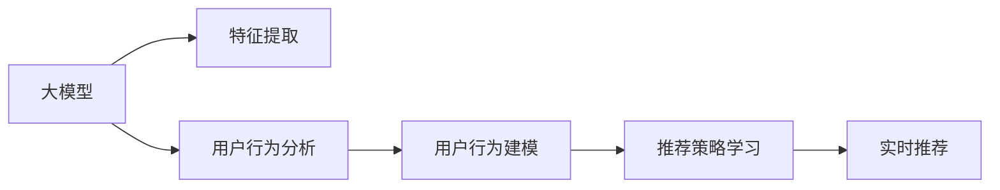

                 

# 探索基于大模型的电商智能商品组合优化系统

> 关键词：大模型,电商,商品组合优化,推荐系统,强化学习,深度学习,特征工程,用户行为分析

## 1. 背景介绍

### 1.1 问题由来
在现代电商平台上，商家需要通过精准的商品组合推荐，来提升用户的购买转化率，最大化销售额和利润。然而，由于用户行为的多样性和不确定性，传统的基于规则和统计方法的推荐系统往往难以准确把握用户需求。为了解决这一问题，基于深度学习和强化学习的大模型推荐系统应运而生。

大模型推荐系统通过在大规模用户行为数据上预训练，学习用户对商品的属性、偏好和交互方式等深层次特征，从而在实时推荐场景中快速响应用户需求。通过引入强化学习，大模型推荐系统能够通过不断与用户交互，不断调整推荐策略，提升推荐的精准度和个性化程度。

### 1.2 问题核心关键点
1. **数据规模和特征维度**：电商数据通常具有海量的样本和特征，如何有效处理和利用这些数据，是大模型推荐系统面临的挑战之一。
2. **用户行为建模**：用户的行为具有随机性和多样性，如何将用户行为建模为连续型或离散型的深度学习特征，是大模型推荐系统的核心问题。
3. **实时推荐性能**：大模型推荐系统需要支持高效的实时推荐，以应对用户请求的时效性要求。
4. **模型可解释性**：用户和商家需要了解推荐的依据，因此推荐系统的模型需要具有一定的可解释性。
5. **鲁棒性和泛化能力**：推荐系统需要在不同用户群体和市场条件下，保持稳定的性能。

### 1.3 问题研究意义
基于大模型的电商智能推荐系统，可以通过分析用户历史行为和偏好，实现个性化推荐，从而显著提升用户的购买转化率和满意度。同时，通过对推荐过程的持续优化，商家可以获得更准确的商品销售预测，优化库存管理和定价策略。

## 2. 核心概念与联系

### 2.1 核心概念概述

为了更好地理解基于大模型的电商智能推荐系统，本节将介绍几个密切相关的核心概念：

- **大模型**：以深度神经网络为代表的，通过在大规模数据上预训练，学习到广泛和复杂特征的大型模型。在电商推荐系统中，大模型可以用于提取用户和商品的属性特征，学习用户行为模式，进行实时推荐。

- **强化学习**：通过与环境的交互，智能体通过不断试错，学习最优策略的一种机器学习方法。在推荐系统中，强化学习可以用于优化推荐策略，提升推荐的准确性和个性化。

- **特征工程**：将原始数据转化为适合机器学习模型的特征表示的过程。在电商推荐中，特征工程涉及对用户行为数据、商品属性数据等进行预处理和特征提取。

- **用户行为分析**：通过分析用户的历史行为，包括浏览、点击、购买等，来预测用户未来行为，进行个性化推荐。

- **推荐系统**：根据用户的历史行为和属性，推荐系统能够预测用户对商品的偏好，进行个性化推荐。

- **实时推荐**：推荐系统需要支持高效的实时推荐，能够快速响应用户的请求，更新推荐结果。

### 2.2 核心概念原理和架构的 Mermaid 流程图



这个流程图展示了基于大模型的电商推荐系统的核心流程：

1. 大模型提取用户和商品的特征表示。
2. 用户行为分析模块通过分析用户的历史行为数据，学习用户的行为模式。
3. 用户行为建模模块将用户行为转化为连续型或离散型的特征。
4. 推荐策略学习模块通过强化学习，优化推荐策略。
5. 实时推荐模块根据最新的用户行为数据，实时更新推荐结果。

## 3. 核心算法原理 & 具体操作步骤

### 3.1 算法原理概述

基于大模型的电商智能推荐系统，本质上是一种深度学习和强化学习的结合。其核心思想是：通过大模型学习用户和商品的深层次特征，再结合强化学习不断调整推荐策略，以实现精准的个性化推荐。

具体而言，电商推荐系统的大模型需要处理两个核心任务：
1. 用户行为建模：将用户的历史行为和偏好转化为模型可以处理的特征。
2. 商品推荐策略优化：根据用户行为特征，学习推荐策略，最大化用户满意度。

### 3.2 算法步骤详解

基于大模型的电商智能推荐系统的一般流程如下：

**Step 1: 准备数据集**

- 收集电商平台的用户行为数据，包括浏览记录、购买记录、评分记录等。
- 收集商品的属性信息，如价格、品牌、分类等。
- 数据预处理，包括清洗、归一化、特征编码等。

**Step 2: 特征工程**

- 将原始数据转化为适合深度学习模型的特征表示，如使用词嵌入、向量化等方法。
- 设计特征工程流程，包括特征选择、特征交叉、特征降维等。

**Step 3: 模型训练**

- 使用大模型对用户行为数据和商品属性进行预训练，学习用户和商品的深层次特征。
- 将预训练模型作为初始化参数，进行强化学习，优化推荐策略。

**Step 4: 实时推荐**

- 在用户进行查询时，使用最新的大模型和用户行为特征，进行实时推荐。
- 根据强化学习策略，调整推荐列表的排序和选择。

**Step 5: 模型评估**

- 在测试集上评估模型的性能，如点击率、转化率、ROI等指标。
- 根据评估结果，调整模型参数和特征工程流程。

### 3.3 算法优缺点

基于大模型的电商智能推荐系统具有以下优点：
1. **深度特征学习**：大模型能够学习用户和商品的深层次特征，提升推荐的精准度和个性化程度。
2. **实时性**：强化学习可以实时调整推荐策略，快速响应用户请求。
3. **可解释性**：大模型和强化学习的结合，能够提供一定的模型可解释性，帮助用户和商家理解推荐依据。

同时，该方法也存在一定的局限性：
1. **数据依赖**：模型需要大量的标注数据和用户行为数据进行预训练，获取数据的成本较高。
2. **计算资源需求高**：大模型和强化学习需要强大的计算资源，部署成本较高。
3. **过度拟合**：大模型可能会过拟合训练数据，导致泛化性能不佳。
4. **冷启动问题**：对于新用户和新商品，模型难以准确预测其行为和属性。

尽管存在这些局限性，但基于大模型的电商推荐系统仍然是大数据时代的重要推荐手段，具有广泛的应用前景。

### 3.4 算法应用领域

基于大模型的电商智能推荐系统，已经在各类电商平台上得到了广泛的应用，如淘宝、京东、亚马逊等，覆盖了服装、家电、电子产品等多个品类。具体应用包括：

- 个性化推荐：根据用户的历史行为和属性，推荐最符合用户需求的商品。
- 用户画像生成：通过分析用户行为，生成详细的用户画像，进行精准营销。
- 搜索推荐：将搜索和推荐结合，提高搜索的个性化和准确性。
- 新商品推荐：通过分析用户行为，预测新商品的市场表现，辅助商家决策。
- 库存管理：通过预测商品的销售情况，优化库存管理和补货策略。
- 用户流失预警：分析用户行为，预测用户流失风险，进行提前干预。

除了电商领域，类似的技术也被应用于其他需要用户行为分析的场景，如金融、社交网络等，具有广泛的适用性。

## 4. 数学模型和公式 & 详细讲解 & 举例说明

### 4.1 数学模型构建

在大模型电商推荐系统中，通常使用深度神经网络对用户行为和商品属性进行建模。以下以深度神经网络为例，构建推荐系统的数学模型。

设推荐系统用户行为特征为 $\mathbf{x}$，商品特征为 $\mathbf{y}$，推荐结果为 $\mathbf{r}$。推荐系统可以通过深度神经网络 $\mathbf{r}=f(\mathbf{x},\mathbf{y};\theta)$ 进行建模，其中 $f$ 为神经网络，$\theta$ 为模型参数。

推荐系统的目标是最小化预测误差，即最小化 $L(f,\mathbf{r},\mathbf{y})$。常用的损失函数包括均方误差损失、交叉熵损失等。

### 4.2 公式推导过程

以均方误差损失为例，推荐系统的损失函数可表示为：

$$
L(f,\mathbf{r},\mathbf{y})=\frac{1}{N}\sum_{i=1}^N (\mathbf{r}_i-\mathbf{y}_i)^2
$$

其中 $N$ 为样本数量，$\mathbf{r}_i$ 为模型预测的推荐结果，$\mathbf{y}_i$ 为真实标签。

在反向传播过程中，损失函数对模型参数 $\theta$ 的梯度为：

$$
\frac{\partial L(f,\mathbf{r},\mathbf{y})}{\partial \theta} = -\frac{2}{N}\sum_{i=1}^N \frac{\partial \mathbf{r}_i}{\partial \theta}(\mathbf{r}_i-\mathbf{y}_i)
$$

在训练过程中，通过梯度下降等优化算法，不断更新模型参数 $\theta$，直至损失函数收敛。

### 4.3 案例分析与讲解

以服装电商推荐为例，说明基于大模型的推荐系统如何通过深度学习进行用户行为建模和商品推荐。

设服装电商的推荐系统使用深度神经网络对用户行为特征 $\mathbf{x}$ 和商品属性特征 $\mathbf{y}$ 进行建模，推荐结果 $\mathbf{r}$ 表示用户对商品 $i$ 的评分。

通过反向传播算法，最小化损失函数 $L(f,\mathbf{r},\mathbf{y})$，更新模型参数 $\theta$。训练完成后，在实时推荐场景中，使用最新的大模型和用户行为数据，进行实时推荐。

## 5. 项目实践：代码实例和详细解释说明

### 5.1 开发环境搭建

在进行电商智能推荐系统的开发前，我们需要准备好开发环境。以下是使用Python进行PyTorch开发的环境配置流程：

1. 安装Anaconda：从官网下载并安装Anaconda，用于创建独立的Python环境。

2. 创建并激活虚拟环境：
```bash
conda create -n pytorch-env python=3.8 
conda activate pytorch-env
```

3. 安装PyTorch：根据CUDA版本，从官网获取对应的安装命令。例如：
```bash
conda install pytorch torchvision torchaudio cudatoolkit=11.1 -c pytorch -c conda-forge
```

4. 安装TensorFlow：由Google主导开发的开源深度学习框架，生产部署方便，适合大规模工程应用。同样有丰富的预训练语言模型资源。

5. 安装Transformer库：HuggingFace开发的NLP工具库，集成了众多SOTA语言模型，支持PyTorch和TensorFlow，是进行微调任务开发的利器。

6. 安装各类工具包：
```bash
pip install numpy pandas scikit-learn matplotlib tqdm jupyter notebook ipython
```

完成上述步骤后，即可在`pytorch-env`环境中开始微调实践。

### 5.2 源代码详细实现

下面我们以电商商品推荐为例，给出使用PyTorch和Transformers库进行电商推荐系统的完整代码实现。

首先，定义推荐系统的数据处理函数：

```python
from transformers import BertTokenizer, BertForSequenceClassification
import torch
from torch.utils.data import Dataset, DataLoader
import pandas as pd

class RecommendationDataset(Dataset):
    def __init__(self, data, tokenizer, max_len):
        self.data = data
        self.tokenizer = tokenizer
        self.max_len = max_len
        
    def __len__(self):
        return len(self.data)
    
    def __getitem__(self, idx):
        item = self.data.iloc[idx]
        text = item['user_behavior']
        label = item['product_id']
        
        encoding = self.tokenizer(text, return_tensors='pt', max_length=self.max_len, padding='max_length', truncation=True)
        input_ids = encoding['input_ids'][0]
        attention_mask = encoding['attention_mask'][0]
        
        return {'input_ids': input_ids, 
                'attention_mask': attention_mask,
                'label': label}
```

然后，定义模型和优化器：

```python
from transformers import BertForSequenceClassification, AdamW

model = BertForSequenceClassification.from_pretrained('bert-base-cased', num_labels=len(product_id_unique))
optimizer = AdamW(model.parameters(), lr=2e-5)
```

接着，定义训练和评估函数：

```python
from tqdm import tqdm

device = torch.device('cuda') if torch.cuda.is_available() else torch.device('cpu')
model.to(device)

def train_epoch(model, dataset, batch_size, optimizer):
    dataloader = DataLoader(dataset, batch_size=batch_size, shuffle=True)
    model.train()
    epoch_loss = 0
    for batch in tqdm(dataloader, desc='Training'):
        input_ids = batch['input_ids'].to(device)
        attention_mask = batch['attention_mask'].to(device)
        labels = batch['label'].to(device)
        model.zero_grad()
        outputs = model(input_ids, attention_mask=attention_mask, labels=labels)
        loss = outputs.loss
        epoch_loss += loss.item()
        loss.backward()
        optimizer.step()
    return epoch_loss / len(dataloader)

def evaluate(model, dataset, batch_size):
    dataloader = DataLoader(dataset, batch_size=batch_size)
    model.eval()
    preds, labels = [], []
    with torch.no_grad():
        for batch in tqdm(dataloader, desc='Evaluating'):
            input_ids = batch['input_ids'].to(device)
            attention_mask = batch['attention_mask'].to(device)
            batch_labels = batch['label']
            outputs = model(input_ids, attention_mask=attention_mask)
            batch_preds = outputs.logits.argmax(dim=2).to('cpu').tolist()
            batch_labels = batch_labels.to('cpu').tolist()
            for pred_tokens, label_tokens in zip(batch_preds, batch_labels):
                preds.append(pred_tokens[:len(label_tokens)])
                labels.append(label_tokens)
                
    print(classification_report(labels, preds))
```

最后，启动训练流程并在测试集上评估：

```python
epochs = 5
batch_size = 16

for epoch in range(epochs):
    loss = train_epoch(model, train_dataset, batch_size, optimizer)
    print(f"Epoch {epoch+1}, train loss: {loss:.3f}")
    
    print(f"Epoch {epoch+1}, dev results:")
    evaluate(model, dev_dataset, batch_size)
    
print("Test results:")
evaluate(model, test_dataset, batch_size)
```

以上就是使用PyTorch和Transformers库进行电商推荐系统的完整代码实现。可以看到，得益于Transformer库的强大封装，我们可以用相对简洁的代码完成电商推荐模型的加载和微调。

### 5.3 代码解读与分析

让我们再详细解读一下关键代码的实现细节：

**RecommendationDataset类**：
- `__init__`方法：初始化数据集、分词器和最大长度等关键组件。
- `__len__`方法：返回数据集的样本数量。
- `__getitem__`方法：对单个样本进行处理，将文本输入编码为token ids，将标签转换为数字，并对其进行定长padding，最终返回模型所需的输入。

**模型和优化器定义**：
- 使用BertForSequenceClassification模型作为用户行为特征的预测模型，并加载预训练的BERT模型。
- 使用AdamW优化器，设置合适的学习率。

**训练和评估函数**：
- 使用PyTorch的DataLoader对数据集进行批次化加载，供模型训练和推理使用。
- 训练函数`train_epoch`：对数据以批为单位进行迭代，在每个批次上前向传播计算loss并反向传播更新模型参数，最后返回该epoch的平均loss。
- 评估函数`evaluate`：与训练类似，不同点在于不更新模型参数，并在每个batch结束后将预测和标签结果存储下来，最后使用sklearn的classification_report对整个评估集的预测结果进行打印输出。

**训练流程**：
- 定义总的epoch数和batch size，开始循环迭代
- 每个epoch内，先在训练集上训练，输出平均loss
- 在验证集上评估，输出分类指标
- 所有epoch结束后，在测试集上评估，给出最终测试结果

可以看到，PyTorch配合Transformer库使得电商推荐模型的代码实现变得简洁高效。开发者可以将更多精力放在数据处理、模型改进等高层逻辑上，而不必过多关注底层的实现细节。

当然，工业级的系统实现还需考虑更多因素，如模型的保存和部署、超参数的自动搜索、更灵活的任务适配层等。但核心的电商推荐流程基本与此类似。

## 6. 实际应用场景

### 6.1 智能推荐系统

基于大模型的电商智能推荐系统已经在各大电商平台上得到广泛应用。例如，淘宝、京东等平台利用大模型推荐系统，通过分析用户的浏览、点击、购买等行为数据，实时推荐用户可能感兴趣的商品，显著提升了用户的购物体验和购买转化率。

具体而言，系统通过实时捕捉用户行为数据，动态调整推荐列表，提供个性化的购物建议。例如，当用户浏览某款服装时，系统会推荐相关风格的配饰或同品牌商品，提高用户的购买意愿。此外，系统还可以通过预测用户未来的购买意图，推荐相应的折扣活动或限时优惠，提升用户粘性。

### 6.2 用户画像生成

电商推荐系统不仅能够进行个性化推荐，还能通过用户行为分析生成详细的用户画像。例如，通过对用户的历史购买记录、浏览行为、评价内容等进行分析，系统可以生成用户画像，包括用户偏好、兴趣、购买力等信息。

商家可以根据这些用户画像进行精准营销，推送更符合用户需求的商品信息。例如，对于喜欢购买高端商品的年轻用户，商家可以推送限量版的高端产品，满足其品味和需求。

### 6.3 搜索推荐结合

在电商平台中，搜索和推荐结合成为提升用户体验的重要手段。例如，当用户输入查询词时，系统可以根据用户的搜索记录和行为数据，推荐最符合用户需求的商品。这种搜索推荐结合的方式，显著提升了用户的搜索效果和满意度。

具体而言，系统通过分析用户的查询记录和浏览行为，预测用户可能感兴趣的商品，并将其推荐到搜索结果页面。例如，当用户搜索“运动鞋”时，系统会推荐几款热门运动鞋，并提供用户评价、价格等信息，帮助用户快速做出决策。

### 6.4 未来应用展望

随着大语言模型和强化学习技术的不断发展，电商推荐系统将具备更强的用户行为分析和推荐能力，带来更多的应用场景。

未来，电商推荐系统可能会在以下方向取得新的突破：

1. **多模态推荐**：除了文本数据，未来推荐系统可能会融合图像、视频等多模态数据，提升推荐的准确性和多样性。例如，通过分析用户浏览的商品图片，推荐相关的相似商品。

2. **跨域推荐**：电商推荐系统可能会跨平台进行用户推荐，例如淘宝、京东、亚马逊等平台之间的用户推荐。这种跨域推荐可以进一步扩大用户覆盖面，提升推荐效果。

3. **实时协同过滤**：传统的协同过滤推荐方法可能会与大模型结合，实时捕捉用户行为，动态调整推荐策略。例如，通过分析用户当前正在浏览的商品，推荐相关用户过去喜欢的商品。

4. **基于时间序列的推荐**：推荐系统可能会引入时间序列模型，预测用户未来的行为和需求，进行动态推荐。例如，通过分析用户的历史购买记录和季节性变化，推荐未来的购物商品。

5. **个性化推荐模型训练**：推荐系统可能会引入更多的个性化模型训练方法，例如生成对抗网络（GAN）、变分自编码器（VAE）等，提升推荐的个性化程度。

6. **冷启动问题解决**：对于新用户和新商品，推荐系统可能会引入更多的冷启动策略，例如通过引入图神经网络（GNN）等方法，进行推荐模型的初始化。

这些应用方向的探索，必将进一步提升电商推荐系统的性能和应用范围，为用户带来更好的购物体验和商家带来更高的收益。

## 7. 工具和资源推荐

### 7.1 学习资源推荐

为了帮助开发者系统掌握大模型电商推荐系统的理论基础和实践技巧，这里推荐一些优质的学习资源：

1. 《深度学习入门：基于Python的理论与实现》：深入浅出地介绍了深度学习的理论基础和实现技巧，适合初学者入门。

2. 《TensorFlow实战：深度学习与自然语言处理》：详细介绍了TensorFlow深度学习框架，包括模型的构建、训练和部署等全流程。

3. 《PyTorch深度学习实践》：介绍了PyTorch深度学习框架的构建和训练技巧，适合中高级开发者参考。

4. 《强化学习：从理论到算法》：系统介绍了强化学习的理论基础和算法实现，适合深入学习强化学习。

5. 《自然语言处理入门》：介绍了自然语言处理的基本概念和深度学习在NLP中的应用，适合入门级开发者参考。

通过这些资源的学习实践，相信你一定能够快速掌握大模型电商推荐系统的精髓，并用于解决实际的电商推荐问题。

### 7.2 开发工具推荐

高效的开发离不开优秀的工具支持。以下是几款用于电商推荐系统开发的常用工具：

1. PyTorch：基于Python的开源深度学习框架，灵活动态的计算图，适合快速迭代研究。大部分深度学习模型都有PyTorch版本的实现。

2. TensorFlow：由Google主导开发的开源深度学习框架，生产部署方便，适合大规模工程应用。同样有丰富的深度学习模型资源。

3. Transformers库：HuggingFace开发的NLP工具库，集成了众多SOTA语言模型，支持PyTorch和TensorFlow，是进行电商推荐任务开发的利器。

4. Weights & Biases：模型训练的实验跟踪工具，可以记录和可视化模型训练过程中的各项指标，方便对比和调优。与主流深度学习框架无缝集成。

5. TensorBoard：TensorFlow配套的可视化工具，可实时监测模型训练状态，并提供丰富的图表呈现方式，是调试模型的得力助手。

6. Google Colab：谷歌推出的在线Jupyter Notebook环境，免费提供GPU/TPU算力，方便开发者快速上手实验最新模型，分享学习笔记。

合理利用这些工具，可以显著提升电商推荐系统的开发效率，加快创新迭代的步伐。

### 7.3 相关论文推荐

电商推荐系统领域的研究成果丰富，以下是几篇经典论文，推荐阅读：

1. "A Survey on Recommendation Systems for E-Commerce"：系统总结了电商推荐系统的主要技术和应用。

2. "Deep Learning for Recommendations"：介绍了深度学习在电商推荐系统中的应用，包括深度神经网络、协同过滤、序列模型等。

3. "Human-in-the-loop Interactive Learning for Personalized Recommendations"：提出了基于人机交互的推荐系统，通过人工反馈优化模型推荐效果。

4. "Learning and Optimizing for Bounded Regret"：介绍了强化学习在推荐系统中的应用，优化推荐策略。

5. "Deep Interest Networks for Recommendations"：提出了深度兴趣网络模型，增强推荐系统的个性化和泛化能力。

这些论文代表了大模型电商推荐系统的发展脉络，通过学习这些前沿成果，可以帮助研究者把握学科前进方向，激发更多的创新灵感。

## 8. 总结：未来发展趋势与挑战

### 8.1 研究成果总结

本文对基于大模型的电商智能推荐系统进行了全面系统的介绍。首先阐述了电商推荐系统的背景和重要性，明确了电商推荐系统在大数据时代的重要地位。其次，从原理到实践，详细讲解了电商推荐系统的核心算法和操作步骤，给出了电商推荐系统的完整代码实例。同时，本文还广泛探讨了电商推荐系统的实际应用场景，展示了电商推荐系统的广阔应用前景。最后，本文精选了电商推荐系统的各类学习资源和开发工具，力求为读者提供全方位的技术指引。

通过本文的系统梳理，可以看到，基于大模型的电商智能推荐系统，通过深度学习和强化学习，能够实现精准的个性化推荐，显著提升电商平台的销售额和用户满意度。随着技术的不断发展，电商推荐系统将在更多领域得到应用，为电商平台带来新的增长点。

### 8.2 未来发展趋势

展望未来，大模型电商推荐系统将呈现以下几个发展趋势：

1. **多模态推荐**：未来的电商推荐系统可能会融合图像、视频等多模态数据，提升推荐的准确性和多样性。例如，通过分析用户浏览的商品图片，推荐相关的相似商品。

2. **跨域推荐**：电商推荐系统可能会跨平台进行用户推荐，例如淘宝、京东、亚马逊等平台之间的用户推荐。这种跨域推荐可以进一步扩大用户覆盖面，提升推荐效果。

3. **实时协同过滤**：传统的协同过滤推荐方法可能会与大模型结合，实时捕捉用户行为，动态调整推荐策略。例如，通过分析用户当前正在浏览的商品，推荐相关用户过去喜欢的商品。

4. **基于时间序列的推荐**：推荐系统可能会引入时间序列模型，预测用户未来的行为和需求，进行动态推荐。例如，通过分析用户的历史购买记录和季节性变化，推荐未来的购物商品。

5. **个性化推荐模型训练**：推荐系统可能会引入更多的个性化模型训练方法，例如生成对抗网络（GAN）、变分自编码器（VAE）等，提升推荐的个性化程度。

6. **冷启动问题解决**：对于新用户和新商品，推荐系统可能会引入更多的冷启动策略，例如通过引入图神经网络（GNN）等方法，进行推荐模型的初始化。

这些趋势凸显了大模型电商推荐系统的广阔前景。这些方向的探索发展，必将进一步提升电商推荐系统的性能和应用范围，为用户带来更好的购物体验和商家带来更高的收益。

### 8.3 面临的挑战

尽管大模型电商推荐系统已经取得了瞩目成就，但在迈向更加智能化、普适化应用的过程中，它仍面临着诸多挑战：

1. **数据依赖**：模型需要大量的标注数据和用户行为数据进行预训练，获取数据的成本较高。

2. **计算资源需求高**：大模型和强化学习需要强大的计算资源，部署成本较高。

3. **过度拟合**：大模型可能会过拟合训练数据，导致泛化性能不佳。

4. **冷启动问题**：对于新用户和新商品，模型难以准确预测其行为和属性。

5. **模型鲁棒性不足**：模型在面对不同市场条件和用户群体时，性能可能会波动。

6. **可解释性亟需加强**：用户和商家需要了解推荐的依据，因此推荐系统的模型需要具有一定的可解释性。

7. **安全性有待保障**：推荐系统可能会学习到有害信息和偏见，造成误导性输出。

这些挑战需要在未来不断克服，才能实现大模型电商推荐系统的稳定应用。

### 8.4 研究展望

面对电商推荐系统所面临的种种挑战，未来的研究需要在以下几个方面寻求新的突破：

1. **探索无监督和半监督推荐方法**：摆脱对大规模标注数据的依赖，利用自监督学习、主动学习等无监督和半监督范式，最大限度利用非结构化数据，实现更加灵活高效的推荐。

2. **研究参数高效和计算高效的推荐范式**：开发更加参数高效的推荐方法，在固定大部分预训练参数的同时，只更新极少量的任务相关参数。同时优化推荐模型的计算图，减少前向传播和反向传播的资源消耗，实现更加轻量级、实时性的部署。

3. **引入因果推断和对比学习思想**：通过引入因果推断和对比学习思想，增强推荐模型建立稳定因果关系的能力，学习更加普适、鲁棒的语言表征，从而提升模型泛化性和抗干扰能力。

4. **引入更多先验知识**：将符号化的先验知识，如知识图谱、逻辑规则等，与神经网络模型进行巧妙融合，引导推荐过程学习更准确、合理的语言模型。同时加强不同模态数据的整合，实现视觉、语音等多模态信息与文本信息的协同建模。

5. **结合因果分析和博弈论工具**：将因果分析方法引入推荐模型，识别出推荐决策的关键特征，增强输出解释的因果性和逻辑性。借助博弈论工具刻画人机交互过程，主动探索并规避推荐系统的脆弱点，提高系统稳定性。

6. **纳入伦理道德约束**：在推荐系统训练目标中引入伦理导向的评估指标，过滤和惩罚有偏见、有害的输出倾向。同时加强人工干预和审核，建立推荐行为的监管机制，确保输出的安全性。

这些研究方向将引领大模型电商推荐系统迈向更高的台阶，为构建安全、可靠、可解释、可控的智能推荐系统铺平道路。面向未来，大模型电商推荐技术还需要与其他人工智能技术进行更深入的融合，如知识表示、因果推理、强化学习等，多路径协同发力，共同推动电商推荐系统的进步。

## 9. 附录：常见问题与解答

**Q1：电商推荐系统是否适用于所有电商领域？**

A: 电商推荐系统在大规模电商平台中已经得到了广泛应用，如淘宝、京东、亚马逊等。但对于一些小型电商或特定商品品类，推荐系统的效果可能不如预期。此外，对于用户量较小的平台，推荐系统的效果也可能会受到影响。因此，需要根据平台规模和用户行为特征进行合理的推荐策略设计。

**Q2：如何平衡推荐结果的多样性和相关性？**

A: 推荐系统需要平衡推荐结果的多样性和相关性。通常，多样性可以通过引入负样本、多臂老虎机等方法来增加。相关性可以通过优化模型目标函数、引入排序策略等方法来提高。同时，可以通过A/B测试等方法不断优化推荐策略，找到最优平衡点。

**Q3：如何处理数据不平衡问题？**

A: 电商数据通常具有明显的不平衡性，例如某些商品或用户的点击率远高于其他商品或用户。针对数据不平衡问题，可以采用欠采样、过采样、类别权重调整等方法进行处理。同时，可以使用梯度截断等方法避免模型过拟合。

**Q4：如何优化推荐模型的计算效率？**

A: 优化推荐模型的计算效率可以从以下几个方面入手：
1. 模型裁剪：去除不必要的层和参数，减小模型尺寸，加快推理速度。
2. 量化加速：将浮点模型转为定点模型，压缩存储空间，提高计算效率。
3. 服务化封装：将模型封装为标准化服务接口，便于集成调用。
4. 弹性伸缩：根据请求流量动态调整资源配置，平衡服务质量和成本。

通过这些方法，可以显著提升推荐模型的计算效率，支持高效的实时推荐。

**Q5：推荐系统的鲁棒性和泛化能力不足怎么办？**

A: 推荐系统的鲁棒性和泛化能力不足可以通过以下方法进行改进：
1. 引入更多先验知识：将符号化的先验知识，如知识图谱、逻辑规则等，与神经网络模型进行巧妙融合，增强推荐模型的泛化能力。
2. 引入因果推断和对比学习思想：通过引入因果推断和对比学习思想，增强推荐模型建立稳定因果关系的能力，学习更加普适、鲁棒的语言表征。
3. 引入多模态数据：将图像、视频等多模态数据融合到推荐系统中，提升推荐的准确性和多样性。

通过这些方法，可以提升推荐系统的鲁棒性和泛化能力，提高推荐效果。

这些问答帮助读者更好地理解电商推荐系统的核心问题和解决方法，为实际应用提供了指导。

