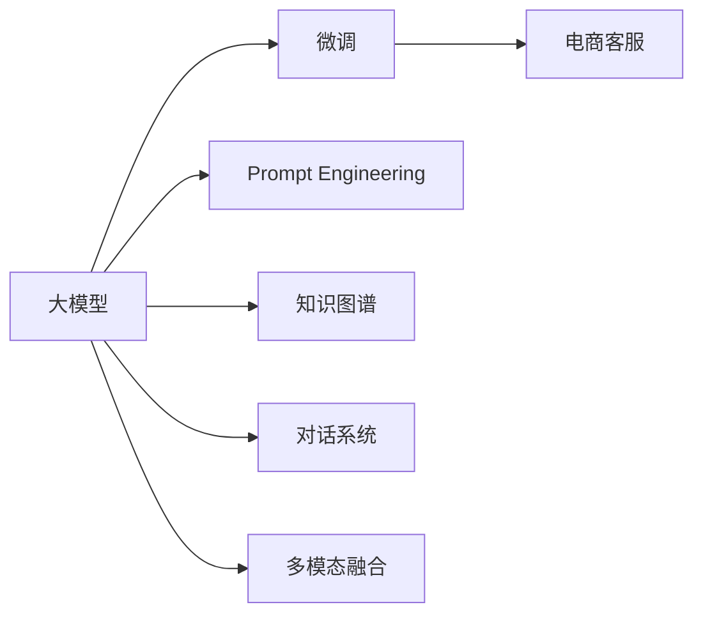

                 

## 1. 背景介绍

随着电商行业的迅猛发展，客户服务成为用户体验的重要组成部分。传统客服依赖人工，难以应对大规模的客户咨询需求，且一致性和专业性难以保证。而基于大模型的智能客服系统，能够在7x24小时不间断服务的同时，提供快速、一致、准确的响应，提升客户满意度，降低运营成本。

大模型驱动的智能客服系统，以自然语言处理（NLP）为核心，利用大规模预训练语言模型进行微调，从而具备了处理自然语言的能力。本文将系统介绍基于大模型的电商智能客服系统的构建流程，包括大模型选择、数据准备、模型微调、系统部署等关键环节，并分析其在电商行业的应用价值。

## 2. 核心概念与联系

### 2.1 核心概念概述

- **大模型（Large Model）**：指通过大规模数据预训练得到的复杂神经网络模型，如BERT、GPT等。这些模型通常具有数十亿甚至百亿级的参数，具备强大的语言理解和生成能力。

- **微调（Fine-Tuning）**：在大模型基础上，利用特定领域的标注数据进行有监督学习，调整模型参数以适应具体任务。例如，在电商客服领域，微调过程将让模型学习到电商场景下的语言知识，提升客户服务质量。

- **Prompt Engineering**：设计合适的输入模板（Prompt），引导模型按照预期方式生成回答。Prompt技术在提升模型在特定任务上的表现，减少微调参数方面，有着重要作用。

- **知识图谱（Knowledge Graph）**：构建电商领域的产品、品牌、销售政策等知识图谱，帮助模型在对话中提供更加准确、丰富的信息。

- **对话系统（Dialogue System）**：构建基于NLP技术的对话系统，使机器人能够理解和回应自然语言输入，实现人机交互。

- **多模态融合（Multimodal Fusion）**：在电商客服场景中，客服人员往往需要同时考虑文字、语音、图片等多模态信息。因此，多模态融合技术能够提升智能客服系统的全面感知能力。

这些概念之间的联系可以通过以下Mermaid流程图来展示：



该流程图展示了电商智能客服系统中核心概念的联系，即基于大模型进行微调，通过Prompt工程、知识图谱和对话系统构建功能，以及多模态融合技术，共同支撑电商客服系统的应用。

## 3. 核心算法原理 & 具体操作步骤

### 3.1 算法原理概述

基于大模型的电商智能客服系统，其核心算法原理基于监督学习的微调方法。系统首先在大规模无标签文本数据上预训练一个通用的语言模型，然后利用电商客服领域的数据集进行有监督学习，调整模型参数以适应电商客服场景，提升模型处理自然语言的能力。

具体而言，电商客服场景下的微调过程包括以下步骤：

1. **数据准备**：收集电商客服领域的对话数据，包括用户问题和客服回答。将对话数据进行标注，形成包含输入和输出对的数据集。
2. **模型选择**：选择一个大规模预训练的通用语言模型，如BERT、GPT等，作为初始化参数。
3. **模型微调**：利用电商客服领域的标注数据集进行有监督学习，优化模型参数。通常，微调过程包括前向传播计算损失函数、反向传播更新参数等步骤。
4. **系统部署**：将微调后的模型集成到电商客服系统中，使其能够处理客户咨询，并生成智能回答。

### 3.2 算法步骤详解

#### 3.2.1 数据准备

电商客服对话数据通常包含大量用户问题和客服的回答。为了进行微调，需要对这些数据进行标注，形成包含输入和输出对的数据集。具体步骤包括：

1. **数据收集**：从电商平台收集客服对话数据，确保数据的多样性和代表性。
2. **数据清洗**：去除无关信息、格式不一致等问题，确保数据质量。
3. **数据标注**：由人工标注对话数据，形成包含问题和答案的数据集。标注任务包括对话文本的意图识别、实体抽取等。
4. **数据划分**：将标注数据划分为训练集、验证集和测试集，确保模型在不同数据集上的泛化能力。

#### 3.2.2 模型选择

选择适合电商客服场景的大规模预训练语言模型，如BERT、GPT等。这些模型通常在通用领域的预训练任务上表现优异，可以进行特定任务的微调。

#### 3.2.3 模型微调

1. **模型加载**：从预训练模型库加载预训练模型，并进行必要的模型结构修改。例如，将通用模型转换为适合电商客服任务的模型结构。
2. **模型初始化**：将预训练模型参数作为初始化参数，开始微调过程。
3. **数据加载**：加载训练集和验证集数据，进行迭代训练。
4. **训练循环**：利用训练集数据进行模型训练，包括前向传播、损失函数计算、反向传播和参数更新等步骤。
5. **验证评估**：在验证集上评估模型性能，根据验证结果调整模型超参数，如学习率、批大小等。
6. **测试评估**：在测试集上进一步评估模型性能，确保模型泛化能力。

#### 3.2.4 系统部署

1. **模型导出**：将微调后的模型参数导出为模型文件。
2. **系统集成**：将模型集成到电商客服系统中，开发API接口，使系统能够调用微调后的模型进行回答生成。
3. **用户交互**：用户通过API接口输入查询，系统调用微调模型生成智能回答，并将回答返回给用户。
4. **系统监控**：持续监控系统运行状态，收集用户反馈，不断优化系统性能。

### 3.3 算法优缺点

#### 3.3.1 优点

1. **高效性**：基于大模型的电商客服系统可以快速处理大量客户咨询，提升客户满意度。
2. **可解释性**：预训练语言模型通常具备较高的可解释性，便于对模型进行调试和优化。
3. **通用性**：大规模预训练语言模型在通用领域的预训练任务上表现优异，能够通过微调适应多种电商客服任务。

#### 3.3.2 缺点

1. **依赖标注数据**：微调过程依赖标注数据，标注数据的获取和标注质量对系统性能有很大影响。
2. **过拟合风险**：微调过程容易过拟合，需要严格控制训练集大小和超参数。
3. **实时性**：基于大模型的电商客服系统，尽管计算速度快，但在复杂任务下可能存在延迟。
4. **多样性限制**：通用语言模型可能无法适应特定电商领域的复杂业务逻辑。

### 3.4 算法应用领域

基于大模型的电商智能客服系统，已经在多个电商平台上得到了应用，如亚马逊、京东、淘宝等。这些系统通常具备以下功能：

1. **问题回答**：基于用户输入的问题，自动生成智能回答。
2. **意图识别**：识别用户查询的意图，如退货、查询订单等，并根据意图进行针对性回答。
3. **实体抽取**：从用户输入中抽取实体信息，如产品名称、订单号等，辅助生成智能回答。
4. **对话历史记录**：记录用户和客服之间的对话历史记录，提升客户体验。
5. **情感分析**：对用户输入进行情感分析，提升客服系统对用户情绪的感知能力。

## 4. 数学模型和公式 & 详细讲解

### 4.1 数学模型构建

电商智能客服系统基于监督学习的微调方法，其核心数学模型包括：

1. **预训练语言模型**：假设预训练模型为 $M_{\theta}$，其中 $\theta$ 为模型参数。
2. **标注数据集**：假设标注数据集为 $D=\{(x_i, y_i)\}_{i=1}^N$，其中 $x_i$ 为输入，$y_i$ 为输出，$N$ 为样本数量。
3. **损失函数**：假设损失函数为 $\ell(\cdot)$，用于衡量模型预测输出与真实标签之间的差异。
4. **优化器**：假设优化器为 $Opt$，用于更新模型参数。

### 4.2 公式推导过程

假设输入为 $x$，输出为 $y$，目标是通过微调过程，最小化损失函数 $\ell(M_{\theta}(x), y)$。具体公式如下：

$$
\min_{\theta} \frac{1}{N} \sum_{i=1}^N \ell(M_{\theta}(x_i), y_i)
$$

其中，$N$ 为样本数量，$\ell(\cdot)$ 为损失函数。微调过程的目标是找到最优参数 $\theta^*$，使得模型输出逼近真实标签。

### 4.3 案例分析与讲解

以电商客服领域的意图识别为例，分析微调模型的构建过程。假设预训练模型为BERT，标注数据集为对话数据，每个对话包含用户问题和客服的回答。微调过程包括以下步骤：

1. **模型初始化**：加载预训练BERT模型，并将其作为初始化参数。
2. **数据加载**：加载训练集和验证集数据，进行迭代训练。
3. **前向传播**：将输入数据输入到预训练BERT模型，得到模型输出。
4. **损失函数计算**：将模型输出与真实标签进行比较，计算损失函数 $\ell$。
5. **反向传播**：利用损失函数对模型参数进行反向传播，更新参数。
6. **参数更新**：利用优化器 $Opt$ 更新模型参数，优化损失函数。
7. **验证评估**：在验证集上评估模型性能，根据验证结果调整模型超参数。

## 5. 项目实践：代码实例和详细解释说明

### 5.1 开发环境搭建

开发环境搭建包括以下步骤：

1. **安装Python和pip**：确保系统已安装Python和pip，以便后续安装依赖包。
2. **安装PyTorch和Transformers**：使用以下命令安装PyTorch和Transformers库，以便进行模型微调。
   ```
   pip install torch torchvision torchaudio transformers
   ```
3. **安装其他依赖**：安装其他必要的依赖库，如numpy、pandas、sklearn等。
   ```
   pip install numpy pandas scikit-learn matplotlib tqdm jupyter notebook ipython
   ```
4. **配置环境变量**：设置必要的路径和环境变量，以便顺利运行代码。

### 5.2 源代码详细实现

以下是一个使用PyTorch进行电商客服系统微调的示例代码：

```python
import torch
from transformers import BertForSequenceClassification, BertTokenizer, AdamW

# 加载预训练模型和tokenizer
model = BertForSequenceClassification.from_pretrained('bert-base-cased')
tokenizer = BertTokenizer.from_pretrained('bert-base-cased')

# 定义模型结构
class E-commerceModel:
    def __init__(self, model, tokenizer):
        self.model = model
        self.tokenizer = tokenizer

    def forward(self, input_ids, attention_mask):
        return self.model(input_ids, attention_mask=attention_mask)

# 定义训练函数
def train_epoch(model, data_loader, optimizer, device):
    model.train()
    for batch in data_loader:
        input_ids = batch['input_ids'].to(device)
        attention_mask = batch['attention_mask'].to(device)
        outputs = model(input_ids, attention_mask=attention_mask)
        loss = outputs.loss
        optimizer.zero_grad()
        loss.backward()
        optimizer.step()
        yield loss.item()

# 定义评估函数
def evaluate(model, data_loader, device):
    model.eval()
    preds, labels = [], []
    for batch in data_loader:
        input_ids = batch['input_ids'].to(device)
        attention_mask = batch['attention_mask'].to(device)
        batch_labels = batch['labels']
        with torch.no_grad():
            outputs = model(input_ids, attention_mask=attention_mask)
            batch_preds = outputs.logits.argmax(dim=2).to('cpu').tolist()
            batch_labels = batch_labels.to('cpu').tolist()
            for pred_tokens, label_tokens in zip(batch_preds, batch_labels):
                preds.append(pred_tokens[:len(label_tokens)])
                labels.append(label_tokens)
    return preds, labels

# 加载数据集
train_data, dev_data, test_data = load_data('train.csv', 'dev.csv', 'test.csv')
tokenizer = BertTokenizer.from_pretrained('bert-base-cased')
train_dataset = E-commerceDataset(train_data, tokenizer)
dev_dataset = E-commerceDataset(dev_data, tokenizer)
test_dataset = E-commerceDataset(test_data, tokenizer)

# 定义优化器和超参数
optimizer = AdamW(model.parameters(), lr=2e-5)
device = torch.device('cuda') if torch.cuda.is_available() else torch.device('cpu')

# 训练模型
for epoch in range(num_epochs):
    train_loss = train_epoch(model, train_dataset, optimizer, device)
    print(f'Epoch {epoch+1}, train loss: {train_loss:.3f}')
    dev_preds, dev_labels = evaluate(model, dev_dataset, device)
    print(classification_report(dev_labels, dev_preds))
    
# 在测试集上评估模型性能
test_preds, test_labels = evaluate(model, test_dataset, device)
print(classification_report(test_labels, test_preds))
```

### 5.3 代码解读与分析

以上代码主要实现了电商客服系统中的意图识别功能。其中，`E-commerceModel`类定义了模型结构，`train_epoch`和`evaluate`函数分别实现了训练和评估过程。具体来说，代码如下：

1. **模型加载**：使用`BertForSequenceClassification`加载预训练BERT模型，并使用`BertTokenizer`加载分词器。
2. **数据加载**：加载标注数据集，并使用`E-commerceDataset`进行数据处理。
3. **训练循环**：通过`train_epoch`函数进行模型训练，利用`AdamW`优化器更新模型参数。
4. **验证评估**：通过`evaluate`函数在验证集上评估模型性能，并打印分类报告。
5. **测试评估**：在测试集上进一步评估模型性能，并打印分类报告。

## 6. 实际应用场景

### 6.1 智能问答系统

电商智能客服系统最重要的功能之一是智能问答。系统通过分析用户输入的问题，自动生成智能回答。例如，当用户询问退货政策时，系统能够快速给出准确的退货指南。

### 6.2 意图识别

电商客服系统需要能够识别用户的查询意图，如咨询订单、退货、修改订单等。系统通过分析用户输入，识别出意图，并根据意图进行针对性回答。例如，当用户询问订单状态时，系统能够返回订单详情。

### 6.3 实体抽取

电商客服系统还需要从用户输入中抽取关键实体，如产品名称、订单号等，辅助生成智能回答。例如，当用户询问退货政策时，系统能够从用户输入中抽取产品信息，并给出针对性的退货指南。

### 6.4 对话历史记录

电商客服系统需要记录用户和客服之间的对话历史记录，帮助客服人员提供更好的服务。例如，当用户多次询问同一个问题时，系统能够提供之前对话中的相关信息，减少客服人员重复回答。

### 6.5 情感分析

电商客服系统还需要能够对用户输入进行情感分析，提升客服系统对用户情绪的感知能力。例如，当用户情绪不佳时，系统能够提供更友好、耐心的回答。

## 7. 工具和资源推荐

### 7.1 学习资源推荐

为了帮助开发者系统掌握电商智能客服系统的构建流程，以下是一些优质的学习资源：

1. **HuggingFace官方文档**：提供了详细的预训练模型和微调范式，以及大量的样例代码。
2. **CS224N《深度学习自然语言处理》课程**：由斯坦福大学开设的NLP明星课程，涵盖NLP领域的核心概念和前沿技术。
3. **《Transformers从原理到实践》系列博文**：由大模型技术专家撰写，深入浅出地介绍了Transformer原理、BERT模型、微调技术等。
4. **NLP相关书籍**：如《深度学习与自然语言处理》、《NLP实战》等，系统介绍了NLP领域的理论基础和应用实践。
5. **GitHub上的开源项目**：如CLUE开源项目，提供了大量电商领域的NLP任务数据集和预训练模型。

### 7.2 开发工具推荐

为了高效开发电商智能客服系统，以下是几款常用的开发工具：

1. **PyTorch**：基于Python的开源深度学习框架，支持动态计算图，适合快速迭代研究。
2. **TensorFlow**：由Google主导开发的开源深度学习框架，生产部署方便，适合大规模工程应用。
3. **Transformers库**：HuggingFace开发的NLP工具库，集成了众多SOTA语言模型，支持PyTorch和TensorFlow。
4. **Jupyter Notebook**：交互式的Python开发环境，支持代码块执行和结果展示。
5. **Weights & Biases**：模型训练的实验跟踪工具，可以记录和可视化模型训练过程中的各项指标。
6. **TensorBoard**：TensorFlow配套的可视化工具，可实时监测模型训练状态，并提供丰富的图表呈现方式。

### 7.3 相关论文推荐

为了深入理解电商智能客服系统的构建流程，以下是几篇关键论文：

1. **《Language Models are Unsupervised Multitask Learners》**：提出GPT-2模型，展示了无监督学习方法在自然语言生成任务上的卓越表现。
2. **《Transformers: State-of-the-Art Machine Translation with Continuous Outputs》**：介绍Transformer模型，说明了其在机器翻译任务上的性能优势。
3. **《AdaLoRA: Adaptive Low-Rank Adaptation for Parameter-Efficient Fine-Tuning》**：提出AdaLoRA方法，在参数效率和精度之间取得新的平衡。
4. **《Adaformer: Adaptive Transformer for Fast and Efficient Inference》**：提出Adaformer模型，在保持模型性能的同时，显著提高了推理速度。
5. **《Prompt-based Few-Shot Learning》**：提出Prompt-based Few-Shot Learning方法，通过设计合适的Prompt模板，提高模型在少样本学习上的表现。

## 8. 总结：未来发展趋势与挑战

### 8.1 研究成果总结

基于大模型的电商智能客服系统已经取得了显著的成果，大幅提升了客户服务质量和效率。未来，该系统将在更广泛的电商场景中得到应用，进一步推动电商行业的数字化转型。

### 8.2 未来发展趋势

未来，电商智能客服系统的发展趋势包括：

1. **多模态融合**：未来智能客服系统将集成语音、图像、视频等多种模态信息，提升全面感知能力。
2. **个性化推荐**：通过用户行为数据和历史交互记录，智能客服系统将能够提供更加个性化的服务。
3. **持续学习**：电商智能客服系统将能够持续学习新知识，保持性能更新，适应市场变化。
4. **多领域应用**：智能客服系统将在更多电商领域得到应用，如服装、家电、食品等。
5. **智能决策**：通过深度学习和知识图谱技术，智能客服系统将能够进行更复杂的决策，如推荐产品、处理退货等。

### 8.3 面临的挑战

尽管电商智能客服系统已经取得了显著进展，但仍然面临以下挑战：

1. **数据隐私**：智能客服系统需要处理大量用户数据，如何保护用户隐私和数据安全是一大挑战。
2. **质量控制**：系统生成的回答需要满足质量要求，如何通过人工审核和机器学习结合，提升回答质量是一大挑战。
3. **跨语言支持**：智能客服系统需要支持多语言，如何处理不同语言的语义差异是一大挑战。
4. **模型解释性**：智能客服系统需要具备可解释性，如何解释模型决策过程是一大挑战。
5. **可扩展性**：智能客服系统需要支持大规模用户并发，如何保证系统稳定性和可扩展性是一大挑战。

### 8.4 研究展望

未来，电商智能客服系统的研究展望包括：

1. **模型压缩和优化**：通过模型压缩、量化等技术，优化模型结构，提升推理速度和效率。
2. **多任务学习**：通过多任务学习技术，提升模型在不同任务上的泛化能力。
3. **情感生成模型**：开发情感生成模型，提升系统对用户情绪的感知和处理能力。
4. **知识增强模型**：将知识图谱等专家知识与神经网络模型结合，提升模型在特定任务上的表现。
5. **对话系统优化**：通过对话系统优化技术，提升系统的对话质量，增加用户交互的流畅度。

总之，电商智能客服系统是大模型驱动的智能客服领域的先锋，具有广阔的应用前景和研究价值。未来，通过不断创新和优化，该系统将在更多电商场景中得到应用，为电商行业带来更多智能化、高效化的服务。

## 9. 附录：常见问题与解答

**Q1：电商智能客服系统的主要功能有哪些？**

A: 电商智能客服系统主要具备以下功能：

1. **智能问答**：基于用户输入的问题，自动生成智能回答。
2. **意图识别**：识别用户查询的意图，如咨询订单、退货、修改订单等，并根据意图进行针对性回答。
3. **实体抽取**：从用户输入中抽取关键实体，如产品名称、订单号等，辅助生成智能回答。
4. **对话历史记录**：记录用户和客服之间的对话历史记录，提升客户体验。
5. **情感分析**：对用户输入进行情感分析，提升客服系统对用户情绪的感知能力。

**Q2：电商智能客服系统如何提升客户满意度？**

A: 电商智能客服系统通过以下方式提升客户满意度：

1. **快速响应**：系统能够实时处理用户咨询，迅速提供答案，减少用户等待时间。
2. **准确回答**：基于大规模预训练语言模型，系统生成的回答准确可靠，减少了人工客服的错误率。
3. **全天候服务**：系统支持7x24小时服务，提供全天候支持，提升客户体验。
4. **个性化服务**：系统能够根据用户历史行为和偏好，提供个性化服务，提升用户满意度。

**Q3：电商智能客服系统如何处理多模态信息？**

A: 电商智能客服系统通过以下方式处理多模态信息：

1. **多模态数据融合**：将语音、图像、视频等多模态数据进行融合，提升系统的全面感知能力。
2. **多模态对话系统**：构建支持多模态输入的对话系统，使系统能够处理多模态用户咨询。
3. **多模态情感分析**：通过多模态情感分析技术，提升系统对用户情绪的感知和处理能力。

**Q4：电商智能客服系统如何保护用户隐私？**

A: 电商智能客服系统通过以下方式保护用户隐私：

1. **数据加密**：对用户数据进行加密存储和传输，确保数据安全。
2. **匿名化处理**：对用户数据进行匿名化处理，保护用户隐私。
3. **访问控制**：对系统访问进行严格控制，确保只有授权人员能够访问用户数据。
4. **隐私保护算法**：采用隐私保护算法，如差分隐私、联邦学习等，保护用户隐私。

**Q5：电商智能客服系统如何优化模型性能？**

A: 电商智能客服系统可以通过以下方式优化模型性能：

1. **数据增强**：通过数据增强技术，如回译、近义替换等，丰富训练集多样性，提升模型泛化能力。
2. **正则化技术**：应用正则化技术，如L2正则、Dropout等，防止模型过拟合。
3. **模型压缩和优化**：通过模型压缩、量化等技术，优化模型结构，提升推理速度和效率。
4. **多任务学习**：通过多任务学习技术，提升模型在不同任务上的泛化能力。

总之，电商智能客服系统在大模型驱动下，具备了处理自然语言的能力，通过智能问答、意图识别、实体抽取等功能，提升客户服务质量和效率。未来，通过不断创新和优化，该系统将在更多电商场景中得到应用，为电商行业带来更多智能化、高效化的服务。

---

作者：禅与计算机程序设计艺术 / Zen and the Art of Computer Programming

