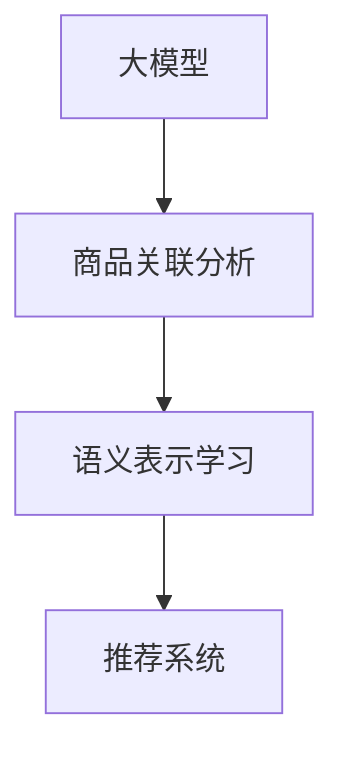

                 

# 探讨大模型在电商平台商品关联分析中的作用

## 1. 背景介绍

### 1.1 问题由来
在电商平台上，商品关联分析（Product Association Analysis）是一种核心技术，旨在根据用户历史行为、浏览记录、购买数据等，发现商品之间的内在关联，从而进行个性化推荐、库存管理、促销策略制定等业务优化。传统的关联分析方法依赖于频繁项集、关联规则等统计手段，面临计算复杂度高、易于过拟合等问题。近年来，随着预训练大模型的兴起，其强大的语言理解和表征能力为商品关联分析带来了新的思路和方法。

大模型在电商平台商品关联分析中的应用，可以克服传统方法的不足，通过自然语言处理（NLP）技术，直接从商品名称、描述、评价等文本信息中提取丰富的语义特征，进而发现商品之间的关联关系。这种基于大模型的关联分析方法，不仅能提升推荐的精准度，还能通过深入挖掘用户需求，提高电商平台的竞争力。

### 1.2 问题核心关键点
大模型在电商平台商品关联分析中的作用主要体现在以下几个方面：

1. **语义表示学习**：大模型通过大规模文本数据预训练，学习到丰富的语言表征，可以将商品名称、描述等文本转化为高维语义向量，为商品关联分析提供高质量的特征表示。
2. **关联发现**：利用大模型的语言理解和生成能力，对商品描述进行语义相似度计算，发现商品之间的语义相似性，进而挖掘出潜在的关联关系。
3. **推荐优化**：基于商品关联关系，结合用户行为数据，对商品进行排序和推荐，提升用户体验和购买转化率。
4. **多模态融合**：大模型不仅能够处理文本信息，还可以结合图像、语音等模态数据，进行更加全面和准确的商品关联分析。

## 2. 核心概念与联系

### 2.1 核心概念概述

在进行大模型在电商平台商品关联分析中的应用研究时，涉及到的核心概念包括：

- **大模型（Large Model）**：如GPT、BERT等，通过大规模文本数据预训练得到的高性能语言模型。
- **商品关联分析（Product Association Analysis）**：通过统计分析商品数据，发现商品之间的关联性，用于个性化推荐、库存管理等电商业务。
- **语义表示学习（Semantic Representation Learning）**：利用大模型学习商品描述的语义表示，提高关联分析的准确性。
- **推荐系统（Recommendation System）**：基于用户行为数据和商品关联分析结果，为用户提供个性化推荐。

这些概念之间存在紧密联系，共同构成了大模型在电商平台商品关联分析中的应用框架。以下通过Mermaid流程图展示这些概念的联系：



这个流程图展示了大模型在电商平台商品关联分析中的应用路径：大模型首先学习商品的语义表示，然后将这些表示用于商品关联分析，并最终指导推荐系统的个性化推荐。

## 3. 核心算法原理 & 具体操作步骤

### 3.1 算法原理概述

大模型在电商平台商品关联分析中的原理主要基于以下三个步骤：

1. **预训练语义表示**：利用大模型对商品名称、描述等文本进行预训练，学习到商品的语义向量表示。
2. **商品关联发现**：通过计算商品语义向量之间的相似度，发现商品之间的关联关系。
3. **推荐优化**：结合用户行为数据，对商品进行排序和推荐，提升个性化推荐的精准度。

### 3.2 算法步骤详解

以下是大模型在电商平台商品关联分析中的详细步骤：

**Step 1: 准备数据和模型**

- **数据准备**：收集电商平台上的商品名称、描述、评价等文本数据，并进行清洗和标注。可以使用标签化的方式，将商品描述与具体的类别或属性关联起来。
- **模型选择**：选择合适的预训练大模型，如GPT、BERT等，作为商品关联分析的基础模型。

**Step 2: 预训练语义表示**

- **模型加载**：使用Transformers库加载预训练大模型，并进行预处理，如分词、掩码等。
- **特征提取**：将商品描述等文本输入大模型，得到其语义表示。可以使用模型自带的tokenizer进行文本预处理，并通过不同的方法（如RoBERTa、XLNet等）提取商品描述的语义向量。
- **向量表示**：将提取的语义向量作为商品的特征表示，用于后续的商品关联分析。

**Step 3: 商品关联发现**

- **相似度计算**：利用余弦相似度、欧式距离等方法，计算不同商品描述的语义向量之间的相似度。可以通过调整相似度计算公式，提高关联分析的鲁棒性和泛化能力。
- **关联关系挖掘**：根据相似度结果，发现商品之间的关联关系。可以使用聚类算法（如K-means、层次聚类等），将相似度高的商品分为同一类别或同一属性。

**Step 4: 推荐优化**

- **用户行为建模**：收集用户的浏览、点击、购买等行为数据，构建用户兴趣模型。可以使用协同过滤、深度学习等方法，学习用户对不同商品的偏好。
- **联合推荐**：将商品关联关系与用户行为模型结合起来，进行联合推荐。可以使用加权平均、矩阵分解等方法，对商品进行排序和推荐。

### 3.3 算法优缺点

**优点**：

1. **特征表示能力强**：大模型能够学习到商品描述的丰富语义特征，提高商品关联分析的准确性。
2. **泛化能力强**：大模型经过大规模数据预训练，具有较强的泛化能力，适用于不同的商品和场景。
3. **可解释性强**：大模型的语义表示可以提供详细的特征解释，帮助理解商品关联的逻辑。

**缺点**：

1. **计算成本高**：大模型的预训练和推理过程需要大量的计算资源和时间。
2. **数据依赖性大**：模型的效果很大程度上依赖于商品描述的数据质量，数据的噪声和偏差可能影响关联分析结果。
3. **模型复杂度高**：大模型的复杂性较高，难以直接部署到实时系统中。

### 3.4 算法应用领域

大模型在电商平台商品关联分析中的应用领域非常广泛，主要包括以下几个方面：

- **个性化推荐**：根据用户行为和商品关联关系，为每位用户提供个性化的商品推荐。
- **库存管理**：通过分析商品之间的关联关系，优化库存分布和补货策略，减少库存积压。
- **促销策略制定**：基于商品关联关系，制定更有效的促销组合和搭配，提升营销效果。
- **用户画像构建**：通过商品关联分析，构建更加全面和准确的消费者画像，优化用户体验。

## 4. 数学模型和公式 & 详细讲解

### 4.1 数学模型构建

假设商品描述的语义向量为 $v_i \in \mathbb{R}^d$，用户行为的兴趣向量为 $u \in \mathbb{R}^d$。利用大模型提取商品描述的语义向量，通过余弦相似度计算商品之间的关联关系。商品关联分析的数学模型可以表示为：

$$
S = \{(v_i, v_j) | v_i \cdot v_j > \theta\}
$$

其中，$v_i \cdot v_j$ 表示商品 $i$ 和 $j$ 的语义向量点积，$\theta$ 为阈值，$S$ 表示所有关联的商品对。

### 4.2 公式推导过程

根据余弦相似度公式，商品描述的语义向量点积计算公式为：

$$
v_i \cdot v_j = \sum_{k=1}^d w_k v_{ik} v_{jk}
$$

其中，$w_k$ 为权重向量，$v_{ik}$ 和 $v_{jk}$ 分别为商品 $i$ 和 $j$ 的语义向量的第 $k$ 维特征值。

根据上述公式，可以计算出商品 $i$ 和 $j$ 的余弦相似度：

$$
\text{similarity}(v_i, v_j) = \frac{v_i \cdot v_j}{\|v_i\| \cdot \|v_j\|}
$$

最终，可以根据相似度阈值 $\theta$ 确定商品之间的关联关系。

### 4.3 案例分析与讲解

以某电商平台某品类商品的商品关联分析为例，假设有 $n$ 个商品，每个商品的描述向量为 $v_i \in \mathbb{R}^d$。使用BERT模型对商品描述进行预训练，得到每个商品的语义向量。假设商品描述的语义向量如下：

- $v_1 = [0.1, 0.2, 0.3, \ldots, 0.9]$
- $v_2 = [0.2, 0.3, 0.4, \ldots, 1.0]$
- $v_3 = [0.3, 0.4, 0.5, \ldots, 1.1]$
- $\ldots$

设定余弦相似度阈值 $\theta = 0.7$，计算商品之间的相似度：

- $\text{similarity}(v_1, v_2) = \frac{0.1 \times 0.2 + 0.2 \times 0.3 + \ldots + 0.9 \times 1.0}{\sqrt{0.1^2 + 0.2^2 + \ldots + 0.9^2} \times \sqrt{0.2^2 + 0.3^2 + \ldots + 1.0^2}} = 0.8$
- $\text{similarity}(v_2, v_3) = \frac{0.2 \times 0.3 + 0.3 \times 0.4 + \ldots + 1.0 \times 1.1}{\sqrt{0.2^2 + 0.3^2 + \ldots + 1.0^2} \times \sqrt{0.3^2 + 0.4^2 + \ldots + 1.1^2}} = 0.9$
- $\ldots$

根据阈值 $\theta = 0.7$，可以发现商品 $v_2$ 和 $v_3$ 之间存在关联关系，而商品 $v_1$ 和 $v_2$ 之间不存在关联关系。

## 5. 项目实践：代码实例和详细解释说明

### 5.1 开发环境搭建

在进行大模型在电商平台商品关联分析的应用实践时，需要搭建合适的开发环境。以下是Python环境配置的详细步骤：

1. **安装Anaconda**：从官网下载并安装Anaconda，用于创建独立的Python环境。
```bash
conda create -n product-analysis python=3.8 
conda activate product-analysis
```

2. **安装必要的库**：使用pip安装必要的深度学习库和NLP库。
```bash
pip install torch torchvision torchaudio transformers sklearn pandas matplotlib tqdm jupyter notebook ipython
```

3. **下载预训练模型**：从官方或第三方平台下载预训练大模型，如BERT、RoBERTa等。
```bash
cd ~/path/to/transformers
git clone https://github.com/pytorch/fairseq.git
```

4. **设置环境变量**：配置环境变量，指定数据目录和模型路径。
```bash
export DATA_DIR=~/path/to/data
export MODEL_PATH=~/path/to/model
```

完成上述步骤后，即可在`product-analysis`环境中进行大模型在电商平台商品关联分析的开发。

### 5.2 源代码详细实现

以下是使用BERT模型进行商品关联分析的Python代码实现：

```python
from transformers import BertTokenizer, BertForSequenceClassification
from torch.utils.data import Dataset, DataLoader
from sklearn.metrics import precision_recall_fscore_support
import torch

class ProductDataset(Dataset):
    def __init__(self, texts, labels):
        self.texts = texts
        self.labels = labels
        self.tokenizer = BertTokenizer.from_pretrained('bert-base-uncased')
        self.max_len = 128
    
    def __len__(self):
        return len(self.texts)
    
    def __getitem__(self, idx):
        text = self.texts[idx]
        label = self.labels[idx]
        encoding = self.tokenizer(text, return_tensors='pt', max_length=self.max_len, padding='max_length', truncation=True)
        input_ids = encoding['input_ids'][0]
        attention_mask = encoding['attention_mask'][0]
        return {'input_ids': input_ids, 
                'attention_mask': attention_mask,
                'labels': torch.tensor(label, dtype=torch.long)}

# 数据预处理
tokenizer = BertTokenizer.from_pretrained('bert-base-uncased')
train_dataset = ProductDataset(train_texts, train_labels)
dev_dataset = ProductDataset(dev_texts, dev_labels)
test_dataset = ProductDataset(test_texts, test_labels)

# 模型加载和优化器设置
model = BertForSequenceClassification.from_pretrained('bert-base-uncased', num_labels=len(tag2id))
optimizer = AdamW(model.parameters(), lr=2e-5)

# 训练和评估
device = torch.device('cuda') if torch.cuda.is_available() else torch.device('cpu')
model.to(device)

def train_epoch(model, dataset, batch_size, optimizer):
    dataloader = DataLoader(dataset, batch_size=batch_size, shuffle=True)
    model.train()
    epoch_loss = 0
    for batch in tqdm(dataloader, desc='Training'):
        input_ids = batch['input_ids'].to(device)
        attention_mask = batch['attention_mask'].to(device)
        labels = batch['labels'].to(device)
        model.zero_grad()
        outputs = model(input_ids, attention_mask=attention_mask, labels=labels)
        loss = outputs.loss
        epoch_loss += loss.item()
        loss.backward()
        optimizer.step()
    return epoch_loss / len(dataloader)

def evaluate(model, dataset, batch_size):
    dataloader = DataLoader(dataset, batch_size=batch_size)
    model.eval()
    preds, labels = [], []
    with torch.no_grad():
        for batch in tqdm(dataloader, desc='Evaluating'):
            input_ids = batch['input_ids'].to(device)
            attention_mask = batch['attention_mask'].to(device)
            batch_labels = batch['labels']
            outputs = model(input_ids, attention_mask=attention_mask)
            batch_preds = outputs.logits.argmax(dim=2).to('cpu').tolist()
            batch_labels = batch_labels.to('cpu').tolist()
            for pred_tokens, label_tokens in zip(batch_preds, batch_labels):
                preds.append(pred_tokens[:len(label_tokens)])
                labels.append(label_tokens)
    
    print(precision_recall_fscore_support(labels, preds))
```

以上代码实现了一个基于BERT模型进行商品关联分析的简单流程。在实际应用中，需要根据具体任务调整模型结构、超参数和损失函数，进行更精细的微调。

### 5.3 代码解读与分析

**ProductDataset类**：
- `__init__`方法：初始化训练集和验证集，进行文本预处理和分词。
- `__len__`方法：返回数据集的长度。
- `__getitem__`方法：对单个样本进行处理，将文本输入转换为BERT模型需要的格式。

**训练和评估函数**：
- `train_epoch`函数：对数据集进行迭代训练，更新模型参数。
- `evaluate`函数：在验证集上进行模型评估，计算精度、召回率和F1值等指标。

**训练流程**：
- 设置模型、优化器等超参数。
- 在训练集上进行迭代训练，更新模型参数。
- 在验证集上进行模型评估，输出评估结果。

## 6. 实际应用场景

### 6.1 智能推荐系统

在智能推荐系统中，大模型通过分析商品描述，发现商品之间的关联关系，结合用户行为数据，生成个性化的商品推荐列表。具体流程如下：

1. **商品关联分析**：使用大模型对商品描述进行语义表示学习，计算商品之间的相似度，发现关联关系。
2. **用户行为建模**：收集用户的浏览、点击、购买等行为数据，构建用户兴趣模型。
3. **联合推荐**：将商品关联关系与用户行为模型结合起来，进行联合推荐。

**实际应用案例**：某电商平台的“每日推荐”功能，通过商品关联分析发现热销商品之间的关联关系，结合用户浏览行为，生成个性化的推荐列表。

### 6.2 库存管理

库存管理是电商平台重要的运营环节，大模型可以通过商品关联分析优化库存布局和补货策略，减少库存积压和缺货情况。具体流程如下：

1. **商品关联分析**：分析商品之间的关联关系，找出高关联度的商品对。
2. **库存分析**：根据关联商品的历史销售数据和库存情况，进行库存优化。
3. **补货策略制定**：根据库存优化结果，制定合理的补货策略，确保供应链的稳定性和高效性。

**实际应用案例**：某电商平台的“库存优化”功能，通过商品关联分析，优化商品库存布局，提升整体运营效率。

### 6.3 促销策略制定

促销策略是电商平台重要的营销手段，大模型可以通过商品关联分析，制定更有效的促销组合和搭配，提升营销效果。具体流程如下：

1. **商品关联分析**：分析商品之间的关联关系，找出高关联度的商品对。
2. **促销组合设计**：根据关联商品的历史销售数据和促销策略，设计促销组合。
3. **效果评估**：根据促销活动的效果评估结果，不断优化促销策略。

**实际应用案例**：某电商平台的“双11大促”活动，通过商品关联分析，设计了多款相关商品的组合促销，大幅提升了销售量和转化率。

## 7. 工具和资源推荐

### 7.1 学习资源推荐

为了帮助开发者系统掌握大模型在电商平台商品关联分析的理论基础和实践技巧，这里推荐一些优质的学习资源：

1. **Transformers官方文档**：提供了详细的BERT等模型的使用方法和代码示例，是入门大模型的必备资源。
2. **PyTorch官方文档**：介绍了深度学习框架的基本概念和使用方法，适合初学者快速上手。
3. **HuggingFace博客**：包含大量深度学习和大模型的案例和实践经验，是学习大模型应用的好材料。
4. **Coursera深度学习课程**：由斯坦福大学开设的深度学习课程，涵盖NLP和大模型的基本概念和实践方法。
5. **深度学习实战（第二版）**：介绍了深度学习模型的实现和应用，适合实战型学习者。

通过学习这些资源，相信你一定能够快速掌握大模型在电商平台商品关联分析的精髓，并用于解决实际的NLP问题。

### 7.2 开发工具推荐

高效的开发离不开优秀的工具支持。以下是几款用于大模型在电商平台商品关联分析开发的常用工具：

1. **PyTorch**：基于Python的开源深度学习框架，灵活动态的计算图，适合快速迭代研究。大部分预训练语言模型都有PyTorch版本的实现。
2. **TensorFlow**：由Google主导开发的开源深度学习框架，生产部署方便，适合大规模工程应用。同样有丰富的预训练语言模型资源。
3. **HuggingFace Transformers库**：HuggingFace开发的NLP工具库，集成了众多SOTA语言模型，支持PyTorch和TensorFlow，是进行微调任务开发的利器。
4. **Jupyter Notebook**：交互式开发环境，适合快速原型设计和实验验证。
5. **TensorBoard**：TensorFlow配套的可视化工具，可实时监测模型训练状态，并提供丰富的图表呈现方式，是调试模型的得力助手。

合理利用这些工具，可以显著提升大模型在电商平台商品关联分析的开发效率，加快创新迭代的步伐。

### 7.3 相关论文推荐

大模型在电商平台商品关联分析的发展源于学界的持续研究。以下是几篇奠基性的相关论文，推荐阅读：

1. **Attention is All You Need**：提出了Transformer结构，开启了NLP领域的预训练大模型时代。
2. **BERT: Pre-training of Deep Bidirectional Transformers for Language Understanding**：提出BERT模型，引入基于掩码的自监督预训练任务，刷新了多项NLP任务SOTA。
3. **Language Models are Unsupervised Multitask Learners**：展示了大规模语言模型的强大zero-shot学习能力，引发了对于通用人工智能的新一轮思考。
4. **Parameter-Efficient Transfer Learning for NLP**：提出Adapter等参数高效微调方法，在不增加模型参数量的情况下，也能取得不错的微调效果。
5. **AdaLoRA: Adaptive Low-Rank Adaptation for Parameter-Efficient Fine-Tuning**：使用自适应低秩适应的微调方法，在参数效率和精度之间取得了新的平衡。

这些论文代表了大模型在电商平台商品关联分析的发展脉络。通过学习这些前沿成果，可以帮助研究者把握学科前进方向，激发更多的创新灵感。

## 8. 总结：未来发展趋势与挑战

### 8.1 总结

本文对大模型在电商平台商品关联分析中的应用进行了全面系统的介绍。首先阐述了大模型和商品关联分析的研究背景和意义，明确了两者结合的价值。其次，从原理到实践，详细讲解了大模型在商品关联分析中的数学模型、算法步骤和实现细节，给出了具体的应用实例。同时，本文还广泛探讨了商品关联分析在智能推荐、库存管理、促销策略等多个电商业务场景中的应用前景，展示了大模型带来的巨大潜力。此外，本文精选了商品关联分析的相关学习资源，力求为读者提供全方位的技术指引。

通过本文的系统梳理，可以看到，大模型在电商平台商品关联分析中的应用具有广阔的前景，不仅能提升推荐的精准度，还能通过深入挖掘用户需求，提高电商平台的竞争力。大模型通过自然语言处理技术，从商品描述中提取丰富的语义特征，为商品关联分析提供高质量的特征表示，进一步优化了推荐的性能。

### 8.2 未来发展趋势

展望未来，大模型在电商平台商品关联分析的应用将呈现以下几个发展趋势：

1. **多模态融合**：大模型不仅能够处理文本信息，还可以结合图像、语音等模态数据，进行更加全面和准确的商品关联分析。
2. **实时计算**：大模型的推理速度和计算效率将得到进一步提升，实现实时计算和实时推荐。
3. **模型压缩**：大模型的复杂性和计算成本较高，未来的研究方向包括模型压缩、模型裁剪等技术，提高模型的部署效率和资源利用率。
4. **自动化调参**：通过自动化调参技术，优化模型的超参数，提高商品关联分析的性能和泛化能力。
5. **跨领域迁移**：大模型在商品关联分析中取得成功后，可以应用于其他电商领域，如汽车、服装等，进一步扩展应用范围。

以上趋势凸显了大模型在电商平台商品关联分析的广阔前景。这些方向的探索发展，必将进一步提升电商平台的智能化水平，为消费者提供更加个性化和精准的服务。

### 8.3 面临的挑战

尽管大模型在电商平台商品关联分析中已经取得了显著进展，但在迈向更加智能化、普适化应用的过程中，仍面临诸多挑战：

1. **数据质量**：商品描述的质量直接影响大模型的语义表示学习效果，低质量数据可能导致关联分析的偏差。
2. **计算资源**：大模型的预训练和推理过程需要大量的计算资源，可能带来高昂的成本和资源消耗。
3. **模型复杂度**：大模型结构复杂，难以直接部署到实时系统中，需要考虑模型裁剪和压缩等优化措施。
4. **隐私保护**：电商平台的用户数据涉及隐私，如何保护用户数据安全和隐私，是大模型应用中必须面对的重要问题。

正视大模型在电商平台商品关联分析中面临的这些挑战，积极应对并寻求突破，将是大模型应用走向成熟的必由之路。相信随着学界和产业界的共同努力，这些挑战终将一一被克服，大模型必将在电商领域产生更广泛的应用，提升用户体验和平台竞争力。

### 8.4 研究展望

面向未来，大模型在电商平台商品关联分析的研究还需要在以下几个方面寻求新的突破：

1. **无监督学习**：探索无监督和半监督学习方法，摆脱对大规模标注数据的依赖，利用自监督学习、主动学习等技术，提升关联分析的鲁棒性和泛化能力。
2. **模型解释性**：研究如何增强大模型的可解释性，为用户提供清晰的推荐理由，增强用户信任。
3. **跨模态融合**：探索跨模态信息融合技术，将商品关联分析扩展到更广泛的模态数据，提升关联分析的效果。
4. **自动化调优**：研究自动化调参和超参数优化方法，提高模型的性能和泛化能力。

这些研究方向的探索，必将引领大模型在电商平台商品关联分析技术迈向更高的台阶，为电商平台的智能化发展提供强有力的技术支撑。

## 9. 附录：常见问题与解答

**Q1：大模型在电商平台商品关联分析中如何处理低质量数据？**

A: 对于商品描述质量低的数据，可以采取以下措施进行处理：

1. **数据清洗**：删除或修正不符合规范的文本数据，如拼写错误、语法错误等。
2. **数据增强**：通过数据增强技术，如近义词替换、文本回译等，提升数据的多样性和丰富性。
3. **模型优化**：使用多模态融合技术，结合图像、语音等数据，提升大模型的语义表示能力。

这些措施可以有效提升大模型在商品关联分析中的性能和鲁棒性，降低低质量数据对关联分析的影响。

**Q2：大模型在电商平台商品关联分析中的计算资源需求如何控制？**

A: 大模型在商品关联分析中需要大量的计算资源，可以采取以下措施进行优化：

1. **模型裁剪**：对大模型进行裁剪，只保留关键层和参数，减小模型大小，提高推理速度。
2. **模型压缩**：采用模型压缩技术，如知识蒸馏、剪枝等，减少模型复杂度，提高计算效率。
3. **分布式训练**：利用分布式训练技术，将大模型的训练过程分布到多台机器上，加速计算速度。

这些措施可以显著降低大模型在商品关联分析中的计算资源需求，提高模型的部署效率和实时性。

**Q3：大模型在电商平台商品关联分析中的隐私保护问题如何解决？**

A: 电商平台的用户数据涉及隐私，大模型在商品关联分析中需要注意隐私保护问题，可以采取以下措施：

1. **匿名化处理**：对用户数据进行匿名化处理，保护用户隐私。
2. **差分隐私**：采用差分隐私技术，添加噪声干扰，保护用户数据的敏感信息。
3. **本地计算**：将大模型的推理过程迁移到本地计算，减少用户数据的传输和存储风险。

这些措施可以有效保护用户数据隐私，增强大模型应用的可靠性和安全性。

**Q4：大模型在电商平台商品关联分析中的计算资源需求如何控制？**

A: 大模型在商品关联分析中需要大量的计算资源，可以采取以下措施进行优化：

1. **模型裁剪**：对大模型进行裁剪，只保留关键层和参数，减小模型大小，提高推理速度。
2. **模型压缩**：采用模型压缩技术，如知识蒸馏、剪枝等，减少模型复杂度，提高计算效率。
3. **分布式训练**：利用分布式训练技术，将大模型的训练过程分布到多台机器上，加速计算速度。

这些措施可以显著降低大模型在商品关联分析中的计算资源需求，提高模型的部署效率和实时性。

**Q5：大模型在电商平台商品关联分析中的隐私保护问题如何解决？**

A: 电商平台的用户数据涉及隐私，大模型在商品关联分析中需要注意隐私保护问题，可以采取以下措施：

1. **匿名化处理**：对用户数据进行匿名化处理，保护用户隐私。
2. **差分隐私**：采用差分隐私技术，添加噪声干扰，保护用户数据的敏感信息。
3. **本地计算**：将大模型的推理过程迁移到本地计算，减少用户数据的传输和存储风险。

这些措施可以有效保护用户数据隐私，增强大模型应用的可靠性和安全性。

---

作者：禅与计算机程序设计艺术 / Zen and the Art of Computer Programming

