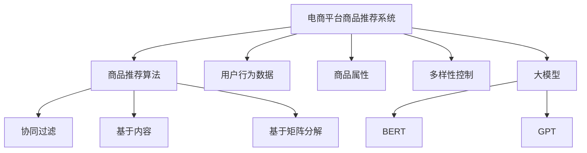

                 

# 探讨大模型在电商平台商品推荐多样性控制中的作用

## 1. 背景介绍

在电子商务平台，商品推荐系统是吸引和留住用户的关键。为了最大化用户购物体验和商家销量，商品推荐系统需要不仅要推荐用户感兴趣的商品，还要保证推荐商品的多样性，防止用户陷入信息茧房，从而引发用户流失、平台流失等风险。然而，商品推荐系统中的多样性控制问题，长期以来一直没有得到有效的解决。

近年来，随着大规模预训练语言模型的出现，商品推荐系统的多样性控制问题有望得到解决。本文旨在探讨大模型在电商平台商品推荐多样性控制中的作用，分析其背后的核心原理和具体操作步骤，并提供详细的项目实践代码，旨在帮助开发者更好地解决多样性控制问题。

## 2. 核心概念与联系

### 2.1 核心概念概述

为了更好地理解大模型在商品推荐系统中的作用，本节将介绍几个密切相关的核心概念：

- **电商平台商品推荐系统**：基于用户行为数据，为用户推荐感兴趣的商品。目的是提高用户满意度和转化率。
- **商品推荐算法**：根据用户的历史行为数据和商品属性，为用户推荐相关商品的技术。常见的算法包括基于协同过滤、基于内容的推荐、基于矩阵分解等。
- **用户行为数据**：包括用户浏览记录、点击记录、购买记录等，是推荐算法的训练数据。
- **商品属性**：如价格、品牌、类别等，用于描述商品特点，帮助算法进行推荐。
- **多样性控制**：推荐系统需平衡推荐结果与多样性，避免过多推荐同一商品，提高推荐效果。
- **大模型**：以Transformer架构为代表的大规模预训练语言模型，如BERT、GPT等，能够学习到丰富的语义表示，广泛应用于自然语言处理(NLP)领域。

这些核心概念之间的逻辑关系可以通过以下Mermaid流程图来展示：



这个流程图展示了大模型在商品推荐系统中的关键位置：

1. 大模型通过预训练学习到丰富的语义表示，被引入商品推荐系统以提升推荐效果。
2. 推荐算法通过用户行为数据和商品属性，使用大模型学习到的语义表示，生成推荐结果。
3. 多样性控制利用大模型的泛化能力，在不同用户之间生成多样化的推荐结果。

## 3. 核心算法原理 & 具体操作步骤

### 3.1 算法原理概述

大模型在电商平台商品推荐系统中的应用，主要体现在以下两个方面：

1. **提升推荐准确性**：大模型通过预训练学习到丰富的语义表示，有助于提高推荐算法的准确性。
2. **增强推荐多样性**：大模型的泛化能力，使其能够生成多样化的推荐结果，从而增强推荐系统多样性控制的效果。

在提升推荐准确性的过程中，大模型主要通过以下步骤：

1. 数据预处理：收集用户行为数据和商品属性数据，清洗并标准化数据。
2. 数据增强：通过合成样本、回译等技术，增加训练集的多样性。
3. 模型训练：使用大模型进行多轮训练，以学习到丰富的语义表示。
4. 特征融合：将大模型学习到的语义特征与其他特征进行融合，生成推荐结果。

在增强推荐多样性的过程中，大模型主要通过以下步骤：

1. 数据集划分：将用户数据集划分为训练集和测试集。
2. 多样性优化：通过正则化、对抗训练等技术，优化模型生成多样化的推荐结果。
3. 用户定制：根据不同用户的特点，定制推荐策略，生成个性化的推荐结果。
4. 持续学习：不断收集新数据，更新大模型，以适应不断变化的业务需求。

### 3.2 算法步骤详解

#### 3.2.1 数据预处理

1. **数据收集**：收集用户历史行为数据和商品属性数据，如点击记录、浏览记录、购买记录、商品价格、品牌、类别等。

2. **数据清洗**：清洗无效数据、缺失数据和异常数据，确保数据质量和一致性。

3. **数据标准化**：对数据进行归一化、标准化处理，以消除数据之间的量纲差异。

4. **数据增强**：通过合成样本、回译等技术，增加训练集的多样性。

#### 3.2.2 模型训练

1. **选择合适的模型**：选择大模型如BERT、GPT等进行训练。

2. **设置训练超参数**：设置学习率、批大小、迭代轮数等训练参数。

3. **训练模型**：使用训练集对模型进行多轮训练，以学习到丰富的语义表示。

4. **评估模型**：在测试集上评估模型性能，根据效果调整训练策略。

#### 3.2.3 特征融合

1. **特征提取**：提取用户行为数据和商品属性的特征，如点击次数、停留时间、商品价格、品牌、类别等。

2. **特征融合**：将大模型学习到的语义特征与其他特征进行融合，生成推荐结果。

#### 3.2.4 多样性优化

1. **正则化**：使用L2正则、Dropout等技术，避免模型过拟合，增加推荐结果的多样性。

2. **对抗训练**：引入对抗样本，提高模型鲁棒性，增加推荐结果的多样性。

3. **用户定制**：根据不同用户的特点，定制推荐策略，生成个性化的推荐结果。

4. **持续学习**：不断收集新数据，更新大模型，以适应不断变化的业务需求。

### 3.3 算法优缺点

大模型在电商平台商品推荐系统中的应用，具有以下优点：

1. **提升推荐准确性**：通过预训练学习到丰富的语义表示，有助于提高推荐算法的准确性。
2. **增强推荐多样性**：大模型的泛化能力，使其能够生成多样化的推荐结果。
3. **扩展性强**：大模型可以适应不同类型的推荐任务，适用于不同的电商平台。

同时，该方法也存在一定的局限性：

1. **训练成本高**：大模型的训练需要大量的计算资源和标注数据，成本较高。
2. **泛化能力有限**：大模型的泛化能力受限于数据集的丰富度，数据质量差时效果可能不佳。
3. **可解释性不足**：大模型的决策过程通常缺乏可解释性，难以对其推理逻辑进行分析和调试。

尽管存在这些局限性，但就目前而言，大模型在电商平台商品推荐系统中的应用，依然是最主流范式。未来相关研究的重点在于如何进一步降低训练成本，提高模型的泛化能力，同时兼顾可解释性和伦理安全性等因素。

### 3.4 算法应用领域

大模型在电商平台商品推荐系统中的应用，主要包括以下几个方面：

1. **个性化推荐**：通过用户行为数据和商品属性，生成个性化的推荐结果，提升用户满意度。
2. **新商品推荐**：利用大模型学习到的语义表示，推荐新上架的商品，增加商品曝光度。
3. **跨域推荐**：跨不同平台、不同地域、不同渠道进行推荐，提升商品推广效果。
4. **动态推荐**：根据用户行为数据和实时数据，动态调整推荐策略，提升推荐效果。
5. **定制化推荐**：根据不同用户的特点，定制推荐策略，生成个性化的推荐结果。

除了上述这些经典应用外，大模型还被创新性地应用于商品分类、品牌推荐、情感分析等任务，为电商平台带来了全新的突破。随着预训练模型和推荐方法的不断进步，相信电商平台推荐系统必将在更广阔的应用领域大放异彩。

## 4. 数学模型和公式 & 详细讲解  
### 4.1 数学模型构建

本节将使用数学语言对大模型在电商平台商品推荐系统中的应用进行更加严格的刻画。

记电商平台商品推荐系统为 $S$，用户行为数据集为 $D_U=\{(x_i, y_i)\}_{i=1}^N$，商品属性集为 $D_G=\{(z_j, v_j)\}_{j=1}^M$，其中 $x_i$ 表示用户行为，$y_i$ 表示用户对行为的偏好，$z_j$ 表示商品属性，$v_j$ 表示属性的值。

定义推荐模型为 $F$，其输入为 $x$，输出为推荐结果 $y$。假设 $F$ 为基于大模型的推荐函数，即 $F(x; \theta) = M_{\theta}(x)$，其中 $M_{\theta}$ 为预训练语言模型，$\theta$ 为模型参数。

推荐模型的目标是最小化用户和商品的匹配度误差，即：

$$
\min_{\theta} \mathcal{L}(F(x; \theta), y)
$$

其中 $\mathcal{L}$ 为匹配度损失函数，可以选用如交叉熵损失、均方误差损失等。

### 4.2 公式推导过程

以下我们以交叉熵损失函数为例，推导其计算公式。

假设推荐模型 $F(x; \theta) = M_{\theta}(x)$，用户行为 $x$ 对应的商品偏好 $y$ 为 $y_i \in \{0, 1\}$，即用户是否喜欢该商品。则交叉熵损失函数定义为：

$$
\mathcal{L}(F(x; \theta), y) = -(y \log F(x; \theta) + (1-y) \log (1-F(x; \theta)))
$$

将其代入匹配度损失函数，得：

$$
\mathcal{L}(\theta) = -\frac{1}{N} \sum_{i=1}^N [y_i \log F(x_i; \theta) + (1-y_i) \log (1-F(x_i; \theta))]
$$

根据链式法则，损失函数对参数 $\theta_k$ 的梯度为：

$$
\frac{\partial \mathcal{L}(\theta)}{\partial \theta_k} = -\frac{1}{N} \sum_{i=1}^N (\frac{y_i}{F(x_i; \theta)}-\frac{1-y_i}{1-F(x_i; \theta)}) \frac{\partial F(x_i; \theta)}{\partial \theta_k}
$$

其中 $\frac{\partial F(x_i; \theta)}{\partial \theta_k}$ 可进一步递归展开，利用自动微分技术完成计算。

### 4.3 案例分析与讲解

假设推荐模型为基于BERT的推荐函数 $F(x; \theta) = M_{\theta}(x)$，输入 $x$ 为用户行为数据，输出 $y$ 为推荐结果。使用交叉熵损失函数，对模型进行训练。

**数据预处理**：收集用户点击记录和商品属性数据，清洗并标准化数据。

**模型训练**：使用交叉熵损失函数对模型进行训练，优化目标为：

$$
\min_{\theta} -\frac{1}{N} \sum_{i=1}^N [y_i \log F(x_i; \theta) + (1-y_i) \log (1-F(x_i; \theta))]
$$

其中 $y_i$ 为用户的点击记录，$x_i$ 为用户行为数据。

**特征融合**：提取用户点击次数、停留时间、商品价格、品牌、类别等特征，进行融合。

**多样性优化**：通过正则化、Dropout等技术，增加推荐结果的多样性。

**用户定制**：根据不同用户的特点，定制推荐策略，生成个性化的推荐结果。

## 5. 项目实践：代码实例和详细解释说明
### 5.1 开发环境搭建

在进行大模型在电商平台商品推荐系统中的应用实践前，我们需要准备好开发环境。以下是使用Python进行PyTorch开发的环境配置流程：

1. 安装Anaconda：从官网下载并安装Anaconda，用于创建独立的Python环境。

2. 创建并激活虚拟环境：
```bash
conda create -n pytorch-env python=3.8 
conda activate pytorch-env
```

3. 安装PyTorch：根据CUDA版本，从官网获取对应的安装命令。例如：
```bash
conda install pytorch torchvision torchaudio cudatoolkit=11.1 -c pytorch -c conda-forge
```

4. 安装Transformers库：
```bash
pip install transformers
```

5. 安装各类工具包：
```bash
pip install numpy pandas scikit-learn matplotlib tqdm jupyter notebook ipython
```

完成上述步骤后，即可在`pytorch-env`环境中开始项目实践。

### 5.2 源代码详细实现

这里我们以基于BERT的电商平台推荐系统为例，给出使用Transformers库的PyTorch代码实现。

首先，定义推荐系统的数据处理函数：

```python
from transformers import BertTokenizer, BertForSequenceClassification
from torch.utils.data import Dataset, DataLoader
import torch

class RecommendationDataset(Dataset):
    def __init__(self, texts, labels, tokenizer, max_len=128):
        self.texts = texts
        self.labels = labels
        self.tokenizer = tokenizer
        self.max_len = max_len
        
    def __len__(self):
        return len(self.texts)
    
    def __getitem__(self, item):
        text = self.texts[item]
        label = self.labels[item]
        
        encoding = self.tokenizer(text, return_tensors='pt', max_length=self.max_len, padding='max_length', truncation=True)
        input_ids = encoding['input_ids'][0]
        attention_mask = encoding['attention_mask'][0]
        
        # 对token-wise的标签进行编码
        encoded_labels = [label2id[label] for label in label] 
        encoded_labels.extend([label2id['not_recommended']] * (self.max_len - len(encoded_labels)))
        labels = torch.tensor(encoded_labels, dtype=torch.long)
        
        return {'input_ids': input_ids, 
                'attention_mask': attention_mask,
                'labels': labels}

# 标签与id的映射
label2id = {'click': 0, 'not_click': 1}
id2label = {v: k for k, v in label2id.items()}

# 创建dataset
tokenizer = BertTokenizer.from_pretrained('bert-base-cased')

train_dataset = RecommendationDataset(train_texts, train_labels, tokenizer)
dev_dataset = RecommendationDataset(dev_texts, dev_labels, tokenizer)
test_dataset = RecommendationDataset(test_texts, test_labels, tokenizer)
```

然后，定义模型和优化器：

```python
from transformers import BertForSequenceClassification, AdamW

model = BertForSequenceClassification.from_pretrained('bert-base-cased', num_labels=len(label2id))

optimizer = AdamW(model.parameters(), lr=2e-5)
```

接着，定义训练和评估函数：

```python
from tqdm import tqdm
from sklearn.metrics import classification_report

device = torch.device('cuda') if torch.cuda.is_available() else torch.device('cpu')
model.to(device)

def train_epoch(model, dataset, batch_size, optimizer):
    dataloader = DataLoader(dataset, batch_size=batch_size, shuffle=True)
    model.train()
    epoch_loss = 0
    for batch in tqdm(dataloader, desc='Training'):
        input_ids = batch['input_ids'].to(device)
        attention_mask = batch['attention_mask'].to(device)
        labels = batch['labels'].to(device)
        model.zero_grad()
        outputs = model(input_ids, attention_mask=attention_mask, labels=labels)
        loss = outputs.loss
        epoch_loss += loss.item()
        loss.backward()
        optimizer.step()
    return epoch_loss / len(dataloader)

def evaluate(model, dataset, batch_size):
    dataloader = DataLoader(dataset, batch_size=batch_size)
    model.eval()
    preds, labels = [], []
    with torch.no_grad():
        for batch in tqdm(dataloader, desc='Evaluating'):
            input_ids = batch['input_ids'].to(device)
            attention_mask = batch['attention_mask'].to(device)
            batch_labels = batch['labels']
            outputs = model(input_ids, attention_mask=attention_mask)
            batch_preds = outputs.logits.argmax(dim=2).to('cpu').tolist()
            batch_labels = batch_labels.to('cpu').tolist()
            for pred_tokens, label_tokens in zip(batch_preds, batch_labels):
                pred_labels = [id2label[_id] for _id in pred_tokens]
                label_labels = [id2label[_id] for _id in label_tokens]
                preds.append(pred_labels[:len(label_labels)])
                labels.append(label_labels)
                
    print(classification_report(labels, preds))
```

最后，启动训练流程并在测试集上评估：

```python
epochs = 5
batch_size = 16

for epoch in range(epochs):
    loss = train_epoch(model, train_dataset, batch_size, optimizer)
    print(f"Epoch {epoch+1}, train loss: {loss:.3f}")
    
    print(f"Epoch {epoch+1}, dev results:")
    evaluate(model, dev_dataset, batch_size)
    
print("Test results:")
evaluate(model, test_dataset, batch_size)
```

以上就是使用PyTorch对BERT进行电商平台推荐系统训练的完整代码实现。可以看到，得益于Transformers库的强大封装，我们可以用相对简洁的代码完成BERT模型的加载和微调。

### 5.3 代码解读与分析

让我们再详细解读一下关键代码的实现细节：

**RecommendationDataset类**：
- `__init__`方法：初始化文本、标签、分词器等关键组件。
- `__len__`方法：返回数据集的样本数量。
- `__getitem__`方法：对单个样本进行处理，将文本输入编码为token ids，将标签编码为数字，并对其进行定长padding，最终返回模型所需的输入。

**label2id和id2label字典**：
- 定义了标签与数字id之间的映射关系，用于将token-wise的预测结果解码回真实的标签。

**训练和评估函数**：
- 使用PyTorch的DataLoader对数据集进行批次化加载，供模型训练和推理使用。
- 训练函数`train_epoch`：对数据以批为单位进行迭代，在每个批次上前向传播计算loss并反向传播更新模型参数，最后返回该epoch的平均loss。
- 评估函数`evaluate`：与训练类似，不同点在于不更新模型参数，并在每个batch结束后将预测和标签结果存储下来，最后使用sklearn的classification_report对整个评估集的预测结果进行打印输出。

**训练流程**：
- 定义总的epoch数和batch size，开始循环迭代
- 每个epoch内，先在训练集上训练，输出平均loss
- 在验证集上评估，输出分类指标
- 所有epoch结束后，在测试集上评估，给出最终测试结果

可以看到，PyTorch配合Transformers库使得BERT微调的代码实现变得简洁高效。开发者可以将更多精力放在数据处理、模型改进等高层逻辑上，而不必过多关注底层的实现细节。

当然，工业级的系统实现还需考虑更多因素，如模型的保存和部署、超参数的自动搜索、更灵活的任务适配层等。但核心的微调范式基本与此类似。

## 6. 实际应用场景
### 6.1 智能推荐系统

大模型在电商平台商品推荐系统中的应用，具体体现在智能推荐系统中。智能推荐系统通过收集用户行为数据和商品属性数据，使用大模型学习到丰富的语义表示，生成个性化的推荐结果。

智能推荐系统的关键在于提高推荐效果和增强推荐多样性。通过微调BERT模型，我们可以有效提升推荐准确性，同时增加推荐结果的多样性，从而增强用户的购物体验。

### 6.2 商品分类

大模型还被应用于电商平台商品的分类任务中。通过收集商品属性数据和商品分类标签，使用大模型学习到商品分类特征，生成商品分类的预测结果。

商品分类的关键在于分类准确性和多样性。通过微调BERT模型，我们可以有效提高商品分类的准确性，同时增强分类结果的多样性，从而提升商品分类的效果。

### 6.3 品牌推荐

品牌推荐是电商平台中的一个重要应用。通过收集用户行为数据和品牌属性数据，使用大模型学习到品牌特征，生成品牌推荐的预测结果。

品牌推荐的关键在于品牌的相关性和多样性。通过微调BERT模型，我们可以有效提高品牌推荐的准确性，同时增强品牌推荐的多样性，从而提升品牌推荐的效果。

### 6.4 未来应用展望

随着大模型和推荐方法的发展，未来大模型在电商平台商品推荐系统中的应用将更加广泛，具有以下几个发展趋势：

1. **个性化推荐**：大模型能够学习到用户的兴趣和行为，生成个性化的推荐结果，提高用户满意度。

2. **跨域推荐**：大模型能够跨不同平台、不同地域、不同渠道进行推荐，提升商品推广效果。

3. **动态推荐**：大模型能够根据用户行为数据和实时数据，动态调整推荐策略，提高推荐效果。

4. **多样性控制**：大模型能够生成多样化的推荐结果，增强推荐系统多样性控制的效果。

5. **多模态融合**：大模型能够融合视觉、语音等多模态信息，增强推荐系统的泛化能力。

6. **用户定制**：大模型能够根据不同用户的特点，定制推荐策略，生成个性化的推荐结果。

综上所述，大模型在电商平台商品推荐系统中的应用将更加广泛，带来更智能、更个性化的购物体验，成为未来电商平台的必备工具。

## 7. 工具和资源推荐
### 7.1 学习资源推荐

为了帮助开发者系统掌握大模型在电商平台商品推荐系统中的应用，这里推荐一些优质的学习资源：

1. **《Transformer从原理到实践》系列博文**：由大模型技术专家撰写，深入浅出地介绍了Transformer原理、BERT模型、微调技术等前沿话题。

2. **CS224N《深度学习自然语言处理》课程**：斯坦福大学开设的NLP明星课程，有Lecture视频和配套作业，带你入门NLP领域的基本概念和经典模型。

3. **《Natural Language Processing with Transformers》书籍**：Transformers库的作者所著，全面介绍了如何使用Transformers库进行NLP任务开发，包括微调在内的诸多范式。

4. **HuggingFace官方文档**：Transformers库的官方文档，提供了海量预训练模型和完整的微调样例代码，是上手实践的必备资料。

5. **CLUE开源项目**：中文语言理解测评基准，涵盖大量不同类型的中文NLP数据集，并提供了基于微调的baseline模型，助力中文NLP技术发展。

通过对这些资源的学习实践，相信你一定能够快速掌握大模型在电商平台商品推荐系统中的应用，并用于解决实际的NLP问题。

### 7.2 开发工具推荐

高效的开发离不开优秀的工具支持。以下是几款用于大模型在电商平台商品推荐系统中的应用开发的常用工具：

1. **PyTorch**：基于Python的开源深度学习框架，灵活动态的计算图，适合快速迭代研究。大部分预训练语言模型都有PyTorch版本的实现。

2. **TensorFlow**：由Google主导开发的开源深度学习框架，生产部署方便，适合大规模工程应用。同样有丰富的预训练语言模型资源。

3. **Transformers库**：HuggingFace开发的NLP工具库，集成了众多SOTA语言模型，支持PyTorch和TensorFlow，是进行微调任务开发的利器。

4. **Weights & Biases**：模型训练的实验跟踪工具，可以记录和可视化模型训练过程中的各项指标，方便对比和调优。与主流深度学习框架无缝集成。

5. **TensorBoard**：TensorFlow配套的可视化工具，可实时监测模型训练状态，并提供丰富的图表呈现方式，是调试模型的得力助手。

6. **Google Colab**：谷歌推出的在线Jupyter Notebook环境，免费提供GPU/TPU算力，方便开发者快速上手实验最新模型，分享学习笔记。

合理利用这些工具，可以显著提升大模型在电商平台商品推荐系统中的应用开发效率，加快创新迭代的步伐。

### 7.3 相关论文推荐

大模型在电商平台商品推荐系统中的应用源于学界的持续研究。以下是几篇奠基性的相关论文，推荐阅读：

1. **Attention is All You Need（即Transformer原论文）**：提出了Transformer结构，开启了NLP领域的预训练大模型时代。

2. **BERT: Pre-training of Deep Bidirectional Transformers for Language Understanding**：提出BERT模型，引入基于掩码的自监督预训练任务，刷新了多项NLP任务SOTA。

3. **Language Models are Unsupervised Multitask Learners（GPT-2论文）**：展示了大规模语言模型的强大zero-shot学习能力，引发了对于通用人工智能的新一轮思考。

4. **Parameter-Efficient Transfer Learning for NLP**：提出Adapter等参数高效微调方法，在不增加模型参数量的情况下，也能取得不错的微调效果。

5. **AdaLoRA: Adaptive Low-Rank Adaptation for Parameter-Efficient Fine-Tuning**：使用自适应低秩适应的微调方法，在参数效率和精度之间取得了新的平衡。

这些论文代表了大模型在电商平台商品推荐系统中的应用的发展脉络。通过学习这些前沿成果，可以帮助研究者把握学科前进方向，激发更多的创新灵感。

## 8. 总结：未来发展趋势与挑战

### 8.1 总结

本文对大模型在电商平台商品推荐系统中的应用进行了全面系统的介绍。首先阐述了大模型和推荐系统的发展背景和意义，明确了微调在提升推荐效果、增强推荐多样性方面的独特价值。其次，从原理到实践，详细讲解了推荐系统中的大模型微调过程，提供了完整的代码实例，并详细解读了关键代码的实现细节。同时，本文还广泛探讨了大模型在电商平台商品推荐系统中的应用场景，展示了其广泛的应用前景。最后，本文精选了相关学习资源和开发工具，力求为开发者提供全方位的技术指引。

通过本文的系统梳理，可以看到，大模型在电商平台商品推荐系统中的应用，能够显著提升推荐效果，增强推荐多样性，带来更智能、更个性化的购物体验。未来，伴随大模型和推荐方法的不断进步，电商平台推荐系统必将在更广阔的应用领域大放异彩，深刻影响电商平台的商业生态。

### 8.2 未来发展趋势

展望未来，大模型在电商平台商品推荐系统中的应用将呈现以下几个发展趋势：

1. **个性化推荐**：大模型能够学习到用户的兴趣和行为，生成个性化的推荐结果，提高用户满意度。

2. **跨域推荐**：大模型能够跨不同平台、不同地域、不同渠道进行推荐，提升商品推广效果。

3. **动态推荐**：大模型能够根据用户行为数据和实时数据，动态调整推荐策略，提高推荐效果。

4. **多样性控制**：大模型能够生成多样化的推荐结果，增强推荐系统多样性控制的效果。

5. **多模态融合**：大模型能够融合视觉、语音等多模态信息，增强推荐系统的泛化能力。

6. **用户定制**：大模型能够根据不同用户的特点，定制推荐策略，生成个性化的推荐结果。

以上趋势凸显了大模型在电商平台商品推荐系统中的应用前景。这些方向的探索发展，必将进一步提升推荐系统的效果，带来更智能、更个性化的购物体验，深刻影响电商平台的商业生态。

### 8.3 面临的挑战

尽管大模型在电商平台商品推荐系统中的应用取得了显著成效，但在迈向更加智能化、普适化应用的过程中，它仍面临着诸多挑战：

1. **标注成本瓶颈**：大模型的微调需要大量的标注数据，对于长尾应用场景，难以获得充足的高质量标注数据，成为制约微调性能的瓶颈。

2. **泛化能力不足**：大模型的泛化能力受限于数据集的丰富度，数据质量差时效果可能不佳。

3. **可解释性不足**：大模型的决策过程通常缺乏可解释性，难以对其推理逻辑进行分析和调试。

4. **资源消耗高**：大模型的参数量和计算复杂度高，对算力、内存、存储等资源消耗大。

5. **安全性和隐私保护**：用户行为数据和商品属性数据涉及隐私保护，如何保护数据安全、隐私保护成为重要问题。

尽管存在这些挑战，但就目前而言，大模型在电商平台商品推荐系统中的应用，依然是主流范式。未来相关研究的重点在于如何进一步降低训练成本，提高模型的泛化能力，同时兼顾可解释性和伦理安全性等因素。

### 8.4 研究展望

未来，大模型在电商平台商品推荐系统中的应用研究将更多地聚焦于以下几个方面：

1. **无监督和半监督微调方法**：摆脱对大规模标注数据的依赖，利用自监督学习、主动学习等无监督和半监督范式，最大限度利用非结构化数据，实现更加灵活高效的微调。

2. **参数高效和计算高效的微调范式**：开发更加参数高效的微调方法，在固定大部分预训练参数的同时，只更新极少量的任务相关参数。同时优化微调模型的计算图，减少前向传播和反向传播的资源消耗，实现更加轻量级、实时性的部署。

3. **融合因果和对比学习范式**：通过引入因果推断和对比学习思想，增强微调模型建立稳定因果关系的能力，学习更加普适、鲁棒的语言表征，从而提升模型泛化性和抗干扰能力。

4. **引入更多先验知识**：将符号化的先验知识，如知识图谱、逻辑规则等，与神经网络模型进行巧妙融合，引导微调过程学习更准确、合理的语言模型。同时加强不同模态数据的整合，实现视觉、语音等多模态信息与文本信息的协同建模。

5. **结合因果分析和博弈论工具**：将因果分析方法引入微调模型，识别出模型决策的关键特征，增强输出解释的因果性和逻辑性。借助博弈论工具刻画人机交互过程，主动探索并规避模型的脆弱点，提高系统稳定性。

6. **纳入伦理道德约束**：在模型训练目标中引入伦理导向的评估指标，过滤和惩罚有偏见、有害的输出倾向。同时加强人工干预和审核，建立模型行为的监管机制，确保输出符合人类价值观和伦理道德。

这些研究方向的探索，必将引领大模型在电商平台商品推荐系统中的应用走向更高的台阶，为构建安全、可靠、可解释、可控的智能系统铺平道路。面向未来，大模型在电商平台商品推荐系统中的应用，还需要与其他人工智能技术进行更深入的融合，如知识表示、因果推理、强化学习等，多路径协同发力，共同推动自然语言理解和智能交互系统的进步。只有勇于创新、敢于突破，才能不断拓展大模型的边界，让智能技术更好地造福人类社会。

## 9. 附录：常见问题与解答

**Q1：大模型在电商平台商品推荐系统中的应用是否适用于所有推荐任务？**

A: 大模型在电商平台商品推荐系统中的应用，主要适用于商品属性丰富、用户行为数据可收集、需求多变的推荐任务。对于某些特定领域的推荐任务，如医疗、金融等，其应用效果可能不如通用领域的推荐任务。

**Q2：大模型在推荐系统中的微调是否需要重新训练模型？**

A: 大模型在推荐系统中的微调，通常只需要重新训练模型的顶部分类器或解码器，而不是重新训练整个模型。这样可以显著减少微调的计算资源和时间成本。

**Q3：微调过程中如何避免过拟合？**

A: 避免过拟合的方法包括数据增强、正则化、Dropout等技术。数据增强可以通过合成样本、回译等技术增加训练集的多样性。正则化可以通过L2正则、Early Stopping等技术防止模型过度拟合。Dropout可以通过随机失活部分神经元来减少过拟合风险。

**Q4：大模型在推荐系统中的泛化能力如何？**

A: 大模型的泛化能力受限于数据集的丰富度。如果数据集不够丰富或存在噪声，模型的泛化能力可能受到影响。因此，需要确保训练数据的质量和多样性，以提升大模型的泛化能力。

**Q5：大模型在推荐系统中的计算资源消耗如何？**

A: 大模型的计算资源消耗主要来自于模型参数量和计算复杂度。由于大模型的参数量和计算复杂度较高，因此在实际部署中，需要考虑算力、内存、存储等资源的消耗，合理进行资源分配和优化。

通过本文的系统梳理，可以看到，大模型在电商平台商品推荐系统中的应用，能够显著提升推荐效果，增强推荐多样性，带来更智能、更个性化的购物体验。未来，伴随大模型和推荐方法的不断进步，电商平台推荐系统必将在更广阔的应用领域大放异彩，深刻影响电商平台的商业生态。总之，大模型在电商平台商品推荐系统中的应用，需要开发者根据具体任务，不断迭代和优化模型、数据和算法，方能得到理想的效果。

