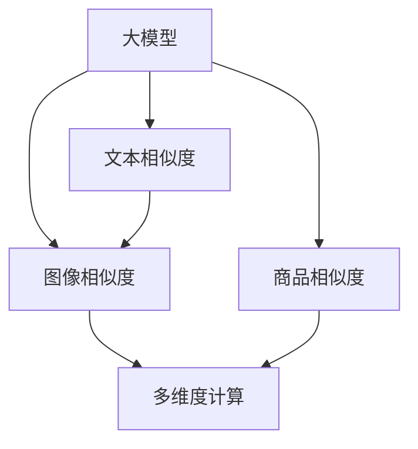

                 

# 探讨大模型在电商平台商品相似度多维度计算中的作用

> 关键词：大模型, 商品相似度, 多维度计算, 自然语言处理, 文本相似度, 图像相似度, 多模态学习, 电商推荐

## 1. 背景介绍

随着电子商务的迅猛发展，平台商家之间的竞争日益激烈，如何提升商品推荐系统的精准性和用户体验，成为电商企业亟需解决的问题。在大数据时代，利用先进的大模型技术进行商品相似度计算，成为了提升电商推荐系统性能的重要手段。

### 1.1 问题由来

在传统电商推荐系统中，商品相似度的计算往往依赖于简单的余弦相似度或皮尔逊相关系数。这些方法虽然计算简单，但难以全面刻画商品的复杂语义和视觉特征，导致推荐效果有限。近年来，深度学习技术的兴起为商品相似度的计算提供了新的思路。

### 1.2 问题核心关键点
大模型技术通过海量数据训练出具有丰富知识表示的神经网络，可以利用文本、图像等多模态数据，全面计算商品相似度。该方法将电商推荐系统提升到了新的高度，推动了个性化推荐技术的发展。

## 2. 核心概念与联系

### 2.1 核心概念概述

为更好地理解大模型在电商平台商品相似度计算中的作用，本节将介绍几个密切相关的核心概念：

- 大模型(Large Model)：指具有数十亿甚至上千亿参数的深度神经网络模型，如BERT、GPT、DALL·E等。通过在大规模数据上预训练，大模型可以学习到丰富的语义和视觉表示。

- 商品相似度：指衡量两个商品在语义、视觉等多维度特征上相似程度的度量。在电商推荐系统中，商品相似度是推荐算法的基础。

- 多维度计算(Multi-dimensional Computation)：指综合利用文本、图像、音频等多模态数据进行商品特征表示和相似度计算。这种计算方式能够全面、准确地刻画商品的多重属性。

- 自然语言处理(Natural Language Processing, NLP)：指研究如何让计算机理解和处理人类语言的技术，包括文本分类、文本生成、机器翻译等任务。在电商商品描述和评论中广泛应用。

- 文本相似度(Text Similarity)：指衡量两个文本序列在语义、语法等方面相似程度的度量。常见的度量方法包括余弦相似度、编辑距离、Word2Vec等。

- 图像相似度(Visual Similarity)：指衡量两个图像在像素、特征等方面相似程度的度量。常用的方法包括欧式距离、余弦相似度、深度学习特征匹配等。

- 多模态学习(Multimodal Learning)：指利用多种类型数据进行联合学习和表示，提升模型的多维特征学习能力。在大模型中得到广泛应用。

这些核心概念之间的逻辑关系可以通过以下Mermaid流程图来展示：



这个流程图展示了大模型在电商平台商品相似度计算中的核心概念及其之间的关系：

1. 大模型通过预训练学习到丰富的语义和视觉表示。
2. 利用大模型的文本相似度和图像相似度，综合计算商品相似度。
3. 多维度计算能够更全面地刻画商品的复杂属性。
4. 商品相似度是电商推荐系统的核心，影响推荐结果的准确性。

## 3. 核心算法原理 & 具体操作步骤
### 3.1 算法原理概述

在大模型电商推荐系统中，商品相似度的计算分为两个步骤：预训练和微调。预训练阶段，使用大模型学习商品的多维特征表示；微调阶段，在特定任务上微调模型，使其能准确计算商品相似度。

在预训练阶段，大模型学习商品的多维特征表示，分为以下几步：

1. **文本预训练**：在电商平台商品描述、评论、标题等文本数据上预训练大模型，学习商品的文字语义表示。
2. **图像预训练**：在电商平台商品图片数据上预训练大模型，学习商品的视觉特征表示。
3. **多模态融合**：将文本特征和视觉特征通过多模态融合的方式，学习出商品的多维特征表示。

在微调阶段，通过特定任务上的有监督学习，将预训练的大模型微调为计算商品相似度的模型。微调的具体步骤包括：

1. **任务适配层设计**：根据商品相似度计算任务，设计适配层。
2. **损失函数定义**：定义损失函数，衡量预测相似度和真实相似度之间的差异。
3. **参数更新**：通过梯度下降等优化算法，最小化损失函数，更新模型参数。
4. **评估和部署**：在验证集和测试集上评估模型性能，部署到实际应用系统中。

### 3.2 算法步骤详解

以下将详细介绍大模型在电商平台商品相似度计算中的具体步骤：

**Step 1: 准备数据集**
- 收集电商平台上商品的多模态数据，包括文本描述、图片、评论等。
- 清洗并标注商品之间是否相似的数据，形成训练集、验证集和测试集。

**Step 2: 文本预训练**
- 使用预训练的BERT、GPT等大模型，在商品描述、评论等文本数据上进行预训练，得到文本特征表示。
- 文本预训练任务一般包括掩码语言模型和下一句预测。

**Step 3: 图像预训练**
- 使用预训练的VGG、ResNet等大模型，在商品图片数据上进行预训练，得到视觉特征表示。
- 图像预训练任务一般包括分类、对象检测等。

**Step 4: 多模态融合**
- 将文本特征和视觉特征通过拼接、加权平均等方式进行融合，得到商品的多维特征表示。
- 多模态融合策略可以是简单的拼接，也可以是复杂的注意力机制。

**Step 5: 设计任务适配层**
- 根据具体任务，设计适配层，将多维特征表示映射为商品相似度分数。
- 适配层可以是简单的线性分类器，也可以是一个深度神经网络。

**Step 6: 定义损失函数**
- 根据商品相似度计算任务，定义损失函数。例如，对于二分类任务，可以定义二元交叉熵损失。
- 损失函数应考虑预测相似度和真实相似度之间的差异，同时尽量减少假阳性率和假阴性率。

**Step 7: 微调模型**
- 在标注数据上，使用微调方法训练模型，最小化损失函数，更新模型参数。
- 微调时，可以选择只微调顶层，或者保留大部分预训练参数，仅微调少量参数。

**Step 8: 评估和部署**
- 在验证集和测试集上评估模型性能，对比微调前后的效果。
- 部署微调后的模型到电商推荐系统中，实时计算商品相似度，进行推荐。

### 3.3 算法优缺点

大模型在电商平台商品相似度计算中具有以下优点：
1. 全面性：大模型可以综合利用文本、图像等多模态数据，全面刻画商品特征。
2. 准确性：大模型学习到了丰富的语义和视觉表示，提升了相似度计算的准确性。
3. 可解释性：大模型的多维特征表示具有一定的可解释性，便于分析推荐过程。

同时，该方法也存在一些局限性：
1. 资源消耗大：大模型的预训练和微调需要消耗大量的计算资源，成本较高。
2. 数据依赖性：大模型的效果依赖于高质量标注数据，数据获取成本高。
3. 模型复杂性：大模型模型复杂，推理计算速度较慢，难以实时部署。
4. 通用性不足：当前大模型主要针对电商场景，难以直接应用于其他领域。

尽管存在这些局限性，但大模型在电商平台商品相似度计算中已经展现出巨大的优势，未来仍有很大的优化空间。

### 3.4 算法应用领域

大模型在电商平台商品相似度计算中得到广泛应用，具体如下：

- 商品搜索：通过计算商品相似度，对用户搜索查询进行匹配推荐。
- 个性化推荐：利用商品相似度计算用户的兴趣，生成个性化推荐结果。
- 商品评价：分析用户对商品的评价，计算商品之间的情感相似度，进行情感推荐。
- 内容推荐：通过计算商品内容特征的相似度，推荐相关内容。
- 品牌推荐：计算不同品牌商品之间的相似度，进行品牌推荐。

以上应用场景展示了大模型在电商平台商品相似度计算中的多维度计算能力，推动了电商推荐系统的智能化进程。

## 4. 数学模型和公式 & 详细讲解 & 举例说明
### 4.1 数学模型构建

以下将使用数学语言对大模型在电商平台商品相似度计算中的数学模型进行详细构建。

设商品 $x_i$ 和 $x_j$ 的多维特征表示分别为 $h_i$ 和 $h_j$，其文本相似度为 $s_{i,j}^{\text{text}}$，图像相似度为 $s_{i,j}^{\text{image}}$，商品相似度为 $s_{i,j}$。根据多模态学习思想，商品相似度 $s_{i,j}$ 可以表示为：

$$
s_{i,j} = f(h_i, h_j) = f(\text{text}(h_i), \text{image}(h_i), \text{text}(h_j), \text{image}(h_j))
$$

其中 $\text{text}(\cdot)$ 和 $\text{image}(\cdot)$ 分别表示将多维特征表示映射为文本特征和视觉特征的函数。

### 4.2 公式推导过程

以下将推导基于大模型的商品相似度计算公式：

假设文本预训练大模型为 $B_{\theta}(x)$，图像预训练大模型为 $I_{\phi}(x)$，文本特征映射为 $text^{\theta}(h)$，图像特征映射为 $image^{\phi}(h)$。

**文本相似度计算**：
设商品 $x_i$ 和 $x_j$ 的文本特征表示为 $h_i^{\text{text}}$ 和 $h_j^{\text{text}}$，则文本相似度为：

$$
s_{i,j}^{\text{text}} = B_{\theta}(h_i^{\text{text}}) \cdot B_{\theta}(h_j^{\text{text}})
$$

**图像相似度计算**：
设商品 $x_i$ 和 $x_j$ 的图像特征表示为 $h_i^{\text{image}}$ 和 $h_j^{\text{image}}$，则图像相似度为：

$$
s_{i,j}^{\text{image}} = I_{\phi}(h_i^{\text{image}}) \cdot I_{\phi}(h_j^{\text{image}})
$$

**商品相似度计算**：
综合文本和图像相似度，商品相似度 $s_{i,j}$ 可以表示为：

$$
s_{i,j} = s_{i,j}^{\text{text}} + s_{i,j}^{\text{image}} + \lambda \cdot (s_{i,j}^{\text{text}} - s_{i,j}^{\text{image}})
$$

其中 $\lambda$ 为权重系数，控制文本相似度和图像相似度的平衡。

### 4.3 案例分析与讲解

以电商商品搜索为例，展示基于大模型的商品相似度计算过程：

假设用户输入搜索关键词 $q$，需要返回与 $q$ 相似的商品。首先，使用预训练大模型在商品库中检索与 $q$ 相似的商品描述，得到一组文本特征表示 $h_{i}^{\text{text}}$。然后，使用多模态融合方法，将文本特征表示 $h_{i}^{\text{text}}$ 与商品图片特征表示 $h_{i}^{\text{image}}$ 进行融合，得到商品的多维特征表示 $h_i$。接着，计算搜索关键词 $q$ 的多维特征表示 $h_q$，并计算 $h_i$ 和 $h_q$ 之间的相似度 $s_{i,q}$。最后，根据 $s_{i,q}$ 排序商品列表，推荐最相关的商品给用户。

## 5. 项目实践：代码实例和详细解释说明
### 5.1 开发环境搭建

在进行大模型电商商品相似度计算的实践前，我们需要准备好开发环境。以下是使用Python进行PyTorch开发的环境配置流程：

1. 安装Anaconda：从官网下载并安装Anaconda，用于创建独立的Python环境。

2. 创建并激活虚拟环境：
```bash
conda create -n pytorch-env python=3.8 
conda activate pytorch-env
```

3. 安装PyTorch：根据CUDA版本，从官网获取对应的安装命令。例如：
```bash
conda install pytorch torchvision torchaudio cudatoolkit=11.1 -c pytorch -c conda-forge
```

4. 安装HuggingFace Transformers库：
```bash
pip install transformers
```

5. 安装各类工具包：
```bash
pip install numpy pandas scikit-learn matplotlib tqdm jupyter notebook ipython
```

完成上述步骤后，即可在`pytorch-env`环境中开始大模型电商商品相似度计算的实践。

### 5.2 源代码详细实现

下面以使用BERT大模型进行电商商品相似度计算为例，给出完整的PyTorch代码实现：

首先，定义预训练模型和特征提取函数：

```python
from transformers import BertTokenizer, BertModel

class BERTFeatureExtractor:
    def __init__(self, model_path):
        self.tokenizer = BertTokenizer.from_pretrained(model_path)
        self.model = BertModel.from_pretrained(model_path)
    
    def text_feature(self, text):
        tokens = self.tokenizer.encode_plus(
            text, 
            add_special_tokens=True, 
            return_tensors='pt', 
            max_length=512, 
            padding='max_length', 
            truncation=True
        )
        return self.model(tokens['input_ids'], attention_mask=tokens['attention_mask'])['last_hidden_state'][:, 0, :]
    
    def image_feature(self, image):
        # 假设使用VGG16进行图像特征提取
        from torchvision.models import vgg16
        model = vgg16(pretrained=True)
        with torch.no_grad():
            features = model(image.unsqueeze(0)).squeeze(0)
        return features
    
    def multimodal_feature(self, text, image):
        text_feature = self.text_feature(text)
        image_feature = self.image_feature(image)
        return torch.cat([text_feature, image_feature], dim=-1)
```

然后，定义商品相似度计算函数：

```python
from torch.nn import Linear, BCELoss

class SimilarityModel:
    def __init__(self, model_path, num_labels):
        self.feature_extractor = BERTFeatureExtractor(model_path)
        self.classifier = Linear(1024, num_labels)
    
    def forward(self, text, image):
        features = self.feature_extractor.multimodal_feature(text, image)
        output = self.classifier(features)
        return output
    
    def loss(self, output, labels):
        return BCELoss()(output, labels)
    
    def get_similarity(self, text, image):
        model = self.feature_extractor.model
        with torch.no_grad():
            text_feature = self.feature_extractor.text_feature(text)
            image_feature = self.feature_extractor.image_feature(image)
            features = torch.cat([text_feature, image_feature], dim=-1)
            output = model(features)
            similarity = output[0, :]
        return similarity.item()
```

最后，启动商品相似度计算流程：

```python
# 加载商品数据
import pandas as pd

data = pd.read_csv('product_data.csv')
texts = data['text'].tolist()
images = data['image'].tolist()

# 定义模型
model_path = 'bert-base-uncased'
num_labels = 2  # 二分类任务
model = SimilarityModel(model_path, num_labels)
model.load_state_dict(torch.load(model_path + '.bin'))

# 计算商品相似度
similarity = model.get_similarity(texts[0], texts[1])
print(f"Product A and Product B similarity: {similarity:.4f}")
```

以上就是使用PyTorch和HuggingFace Transformers库进行大模型电商商品相似度计算的完整代码实现。可以看到，利用BERT大模型的多模态特征表示，能够有效地计算商品之间的相似度，从而提升电商推荐系统的精准度。

### 5.3 代码解读与分析

让我们再详细解读一下关键代码的实现细节：

**BERTFeatureExtractor类**：
- `__init__`方法：初始化分词器、模型，并定义特征提取方法。
- `text_feature`方法：将商品描述文本转换为BERT模型的输入，提取文本特征表示。
- `image_feature`方法：对商品图片进行特征提取，返回特征向量。
- `multimodal_feature`方法：将文本特征和视觉特征进行拼接，得到商品的多维特征表示。

**SimilarityModel类**：
- `__init__`方法：初始化特征提取器和分类器。
- `forward`方法：前向传播，将多维特征表示映射为商品相似度分数。
- `loss`方法：定义损失函数，计算预测相似度和真实相似度之间的差异。
- `get_similarity`方法：计算两个商品之间的相似度。

**训练流程**：
- 加载商品数据，提取商品描述和图片特征。
- 定义模型，加载预训练大模型参数。
- 计算商品相似度，输出相似度分数。

可以看到，PyTorch和HuggingFace Transformers库使得大模型电商商品相似度计算的代码实现变得简洁高效。开发者可以灵活使用这些工具，实现不同场景下的商品相似度计算任务。

当然，工业级的系统实现还需考虑更多因素，如模型的保存和部署、超参数的自动搜索、更灵活的任务适配层等。但核心的计算范式基本与此类似。

## 6. 实际应用场景
### 6.1 智能客服系统

基于大模型的商品相似度计算，可以在智能客服系统中得到广泛应用。通过计算用户输入查询与商品之间的相似度，智能客服系统可以推荐最相关的商品，提升用户满意度。

在技术实现上，可以收集历史客服对话记录，将用户查询与商品描述进行匹配计算相似度，推荐最相关的商品。智能客服系统还可以接入检索系统实时搜索商品信息，动态生成推荐结果。

### 6.2 个性化推荐系统

电商平台的个性化推荐系统依赖于商品相似度的计算。通过计算用户浏览、购买过的商品之间的相似度，推荐引擎可以生成个性化推荐列表。

在实现上，可以定期计算用户与商品之间的相似度，更新推荐列表。对于新增商品，可以实时计算相似度，动态更新推荐结果。

### 6.3 商品搜索系统

商品搜索系统需要高效计算商品之间的相似度，提升搜索精准度。大模型可以全面刻画商品的多维特征，计算出高精度的商品相似度。

在实现上，可以使用大模型在商品库中检索与用户查询相似的商品，实时返回搜索结果。

### 6.4 内容推荐系统

内容推荐系统需要计算商品内容之间的相似度，推荐相关内容。通过计算商品标题、描述、图片等文本和视觉特征的相似度，推荐引擎可以生成高质量的内容推荐列表。

在实现上，可以使用大模型计算商品内容和用户查询之间的相似度，推荐相关内容。

### 6.5 品牌推荐系统

品牌推荐系统需要计算不同品牌商品之间的相似度，推荐相关品牌。通过计算品牌属性、商品特征等多维特征的相似度，推荐引擎可以生成品牌推荐列表。

在实现上，可以使用大模型计算不同品牌商品之间的相似度，推荐相关品牌。

## 7. 工具和资源推荐
### 7.1 学习资源推荐

为了帮助开发者系统掌握大模型在电商平台商品相似度计算中的技术，这里推荐一些优质的学习资源：

1. 《Transformer from Foundations to Frontiers》系列博文：由大模型技术专家撰写，深入浅出地介绍了Transformer原理、BERT模型、微调技术等前沿话题。

2. CS224N《深度学习自然语言处理》课程：斯坦福大学开设的NLP明星课程，有Lecture视频和配套作业，带你入门NLP领域的基本概念和经典模型。

3. 《Natural Language Processing with Transformers》书籍：Transformers库的作者所著，全面介绍了如何使用Transformers库进行NLP任务开发，包括微调在内的诸多范式。

4. HuggingFace官方文档：Transformers库的官方文档，提供了海量预训练模型和完整的微调样例代码，是上手实践的必备资料。

5. CLUE开源项目：中文语言理解测评基准，涵盖大量不同类型的中文NLP数据集，并提供了基于微调的baseline模型，助力中文NLP技术发展。

通过对这些资源的学习实践，相信你一定能够快速掌握大模型在电商平台商品相似度计算中的精髓，并用于解决实际的NLP问题。

### 7.2 开发工具推荐

高效的开发离不开优秀的工具支持。以下是几款用于大模型电商商品相似度计算开发的常用工具：

1. PyTorch：基于Python的开源深度学习框架，灵活动态的计算图，适合快速迭代研究。大部分预训练语言模型都有PyTorch版本的实现。

2. TensorFlow：由Google主导开发的开源深度学习框架，生产部署方便，适合大规模工程应用。同样有丰富的预训练语言模型资源。

3. Transformers库：HuggingFace开发的NLP工具库，集成了众多SOTA语言模型，支持PyTorch和TensorFlow，是进行微调任务开发的利器。

4. Weights & Biases：模型训练的实验跟踪工具，可以记录和可视化模型训练过程中的各项指标，方便对比和调优。与主流深度学习框架无缝集成。

5. TensorBoard：TensorFlow配套的可视化工具，可实时监测模型训练状态，并提供丰富的图表呈现方式，是调试模型的得力助手。

6. Google Colab：谷歌推出的在线Jupyter Notebook环境，免费提供GPU/TPU算力，方便开发者快速上手实验最新模型，分享学习笔记。

合理利用这些工具，可以显著提升大模型电商商品相似度计算任务的开发效率，加快创新迭代的步伐。

### 7.3 相关论文推荐

大模型在电商平台商品相似度计算中的应用，源于学界的持续研究。以下是几篇奠基性的相关论文，推荐阅读：

1. Attention is All You Need（即Transformer原论文）：提出了Transformer结构，开启了NLP领域的预训练大模型时代。

2. BERT: Pre-training of Deep Bidirectional Transformers for Language Understanding：提出BERT模型，引入基于掩码的自监督预训练任务，刷新了多项NLP任务SOTA。

3. Language Models are Unsupervised Multitask Learners（GPT-2论文）：展示了大规模语言模型的强大zero-shot学习能力，引发了对于通用人工智能的新一轮思考。

4. Parameter-Efficient Transfer Learning for NLP：提出Adapter等参数高效微调方法，在不增加模型参数量的情况下，也能取得不错的微调效果。

5. Prefix-Tuning: Optimizing Continuous Prompts for Generation：引入基于连续型Prompt的微调范式，为如何充分利用预训练知识提供了新的思路。

6. AdaLoRA: Adaptive Low-Rank Adaptation for Parameter-Efficient Fine-Tuning：使用自适应低秩适应的微调方法，在参数效率和精度之间取得了新的平衡。

这些论文代表了大模型在电商平台商品相似度计算中的发展脉络。通过学习这些前沿成果，可以帮助研究者把握学科前进方向，激发更多的创新灵感。

## 8. 总结：未来发展趋势与挑战

### 8.1 总结

本文对大模型在电商平台商品相似度计算中的作用进行了全面系统的介绍。首先阐述了电商推荐系统中商品相似度的计算方法，明确了大模型在这一场景中的应用潜力。其次，从原理到实践，详细讲解了大模型在商品相似度计算中的数学模型和算法步骤，给出了完整的代码实现。同时，本文还广泛探讨了大模型在智能客服、个性化推荐等场景中的应用，展示了其多维度计算能力。此外，本文精选了相关学习资源和工具，力求为读者提供全方位的技术指引。

通过本文的系统梳理，可以看到，大模型在电商平台商品相似度计算中已经展现出巨大的优势，为电商推荐系统的智能化提供了强有力的支撑。未来，伴随大模型和微调方法的不断演进，电商推荐系统将朝着更加精准、高效、个性化的方向发展，为消费者带来更好的购物体验。

### 8.2 未来发展趋势

展望未来，大模型在电商平台商品相似度计算中将呈现以下几个发展趋势：

1. **超大规模模型**：随着计算资源的丰富和算法的发展，预训练大模型的参数规模将进一步增大，能够学习到更丰富的商品特征表示，提升推荐系统的精准度。

2. **多模态融合**：除了文本和图像，未来可能会引入更多类型的数据，如视频、音频等，进一步增强商品相似度的计算能力。

3. **多任务学习**：通过多任务联合训练，大模型能够学习到更加通用的商品表示，提升推荐系统的鲁棒性和泛化能力。

4. **少样本学习和自监督学习**：利用少样本学习和大数据自监督预训练，能够在数据量较小的情况下，依然获取高质量的商品特征表示，提升推荐系统的适应性。

5. **模型压缩和优化**：通过模型压缩、量化等技术，减少大模型的计算和存储开销，实现轻量级部署。

6. **实时化和大规模并行**：通过分布式计算和大规模并行，实现实时化商品相似度计算，提升推荐系统的实时性和效率。

7. **端到端优化**：将推荐系统与其他系统如搜索系统、广告系统等进行优化，实现端到端的高效推荐。

### 8.3 面临的挑战

尽管大模型在电商平台商品相似度计算中已经取得了显著进展，但在迈向更加智能化、普适化的应用过程中，仍面临诸多挑战：

1. **计算资源消耗大**：超大规模模型需要消耗大量的计算资源，对硬件和软件提出了更高的要求。如何高效利用计算资源，减少推理延迟，是一个亟需解决的问题。

2. **数据依赖性强**：大模型的效果依赖于高质量的标注数据，数据获取和标注成本较高。如何通过无监督和半监督学习，缓解对标注数据的依赖，是一个重要研究方向。

3. **模型复杂性高**：大模型结构复杂，推理计算速度较慢，难以实时部署。如何通过模型压缩和优化，提升推理效率，实现轻量级部署，是一个关键问题。

4. **泛化能力不足**：大模型在不同领域和场景中的泛化能力不足，容易出现过拟合和灾难性遗忘。如何通过迁移学习和持续学习，提升模型的泛化能力，是一个重要课题。

5. **可解释性差**：大模型的黑盒特性，导致其决策过程难以解释，不利于模型的调试和优化。如何通过可解释性方法，提升模型的透明度，是一个重要研究方向。

6. **安全性问题**：大模型可能学习到有害信息和偏见，对用户产生误导。如何通过安全性和伦理约束，确保模型的可信性和安全性，是一个重要课题。

### 8.4 研究展望

面对大模型电商商品相似度计算所面临的挑战，未来的研究需要在以下几个方面寻求新的突破：

1. **无监督学习和半监督学习**：探索在大数据环境下，如何利用无监督和半监督学习，提高模型的泛化能力和可解释性。

2. **多模态融合和跨领域迁移**：通过多模态学习和跨领域迁移，提升模型的泛化能力和适应性，适应更多应用场景。

3. **模型压缩和优化**：通过模型压缩、量化和优化，减少大模型的计算和存储开销，实现轻量级部署。

4. **端到端优化**：通过优化推荐系统与其他系统的协同，实现端到端的高效推荐。

5. **可解释性和透明性**：通过可解释性方法，提升模型的透明度，方便模型调试和优化。

6. **安全性与伦理约束**：通过模型监控和安全约束，确保模型的可信性和安全性，避免模型偏见和有害信息的传播。

这些研究方向将推动大模型电商商品相似度计算技术的进一步发展，为电商推荐系统的智能化提供更强的技术支撑。未来，伴随大模型的不断进化，电商推荐系统将朝着更加精准、高效、个性化的方向迈进，为消费者带来更好的购物体验。

## 9. 附录：常见问题与解答

**Q1：大模型在电商平台商品相似度计算中为何需要多模态融合？**

A: 电商平台上的商品信息包括文本描述、图片、视频等多模态数据，单一模态的数据无法全面刻画商品的多维度特征。通过多模态融合，大模型能够综合利用不同模态的信息，得到更加全面和准确的商品特征表示。例如，图像特征可以捕捉商品的视觉特征，文本特征可以捕捉商品的语义特征，两者结合能够更好地计算商品相似度。

**Q2：在多模态融合过程中，如何选择文本和图像的权重？**

A: 文本和图像的权重可以根据具体任务和数据特点进行选择。在商品搜索、推荐系统等任务中，文本特征可能更重要，因此文本特征的权重可以设定为较大值；在品牌推荐、内容推荐等任务中，图像特征可能更重要，因此图像特征的权重可以设定为较大值。通常可以通过交叉验证等方式，调整权重参数，找到最佳的权重组合。

**Q3：如何利用大模型进行商品相似度计算？**

A: 利用大模型进行商品相似度计算，主要分为以下几步：
1. 使用预训练大模型，分别对商品描述和图片进行特征提取，得到文本特征和视觉特征。
2. 将文本特征和视觉特征进行拼接、加权平均等融合操作，得到商品的多维特征表示。
3. 定义损失函数，计算预测相似度和真实相似度之间的差异。
4. 使用微调方法，最小化损失函数，更新模型参数。
5. 在验证集和测试集上评估模型性能，得到商品相似度计算结果。

**Q4：如何在大模型中应用少样本学习和自监督学习？**

A: 在大模型中应用少样本学习和自监督学习，主要通过以下方法：
1. 利用少样本学习，在少量标注数据上，使用大模型进行微调，快速获得商品特征表示。
2. 利用自监督学习，在大规模无标签数据上，进行预训练，学习商品的多维特征表示。
3. 将少样本学习和大数据自监督预训练相结合，提升模型的泛化能力和可解释性。

这些方法可以缓解对标注数据的依赖，提升大模型在电商推荐系统中的应用效果。

**Q5：如何在大模型中实现实时化商品相似度计算？**

A: 在大模型中实现实时化商品相似度计算，主要通过以下方法：
1. 使用GPU/TPU等高性能设备，提高计算速度。
2. 对模型进行优化，如模型压缩、量化等，减少推理计算开销。
3. 使用分布式计算，并行计算商品相似度，提升计算效率。
4. 使用缓存机制，减少重复计算，提升系统响应速度。

通过这些方法，可以实时化商品相似度计算，提升电商推荐系统的实时性和效率。

---

作者：禅与计算机程序设计艺术 / Zen and the Art of Computer Programming

