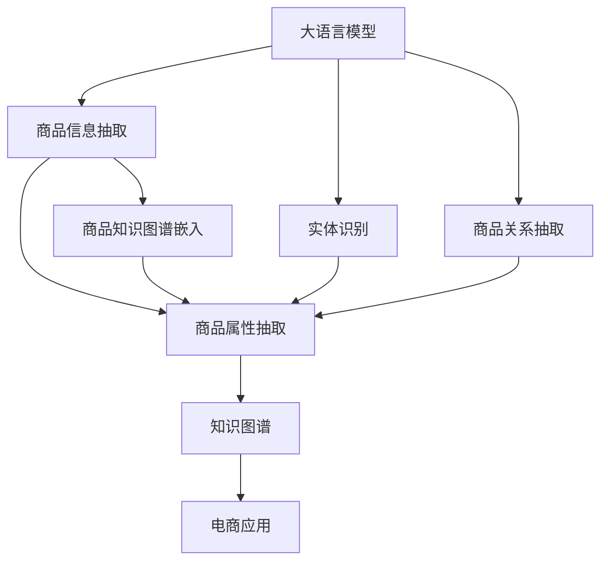

                 

# 探讨大模型在电商平台商品知识图谱构建中的作用

> 关键词：大模型,商品知识图谱,电商平台,深度学习,语义理解,信息抽取,图神经网络,元学习,知识图谱嵌入

## 1. 背景介绍

在电商领域，构建商品知识图谱已成为提升用户体验、优化推荐算法、促进交叉销售的重要手段。商品知识图谱不仅能够帮助搜索引擎准确理解用户查询，还能通过商品间的语义关系，为推荐系统提供丰富的辅助信息。当前，构建知识图谱的常用方法包括人工标注、众包采集和自动抽取等。然而，这些方法往往依赖人工干预，耗时耗力，且难以覆盖所有商品类别和属性。

近年来，随着大语言模型和深度学习技术的发展，利用大模型自动抽取和构建商品知识图谱成为可能。大模型基于大规模无标签文本数据进行预训练，能够学习到丰富的语言知识和语义理解能力。本文旨在探讨大模型在电商平台商品知识图谱构建中的应用，讨论如何利用大模型高效、自动地进行商品信息抽取、实体关系建模和知识图谱嵌入，以提升知识图谱构建的准确性和效率。

## 2. 核心概念与联系

### 2.1 核心概念概述

在商品知识图谱构建过程中，涉及以下核心概念：

- **大语言模型(Large Language Models, LLM)**：指基于大规模自回归或自编码模型，如GPT、BERT等，通过大规模无标签文本数据进行预训练的通用语言模型。这些模型具备强大的语义理解和生成能力，可以用于文本分类、信息抽取、实体识别等任务。

- **商品知识图谱**：指由商品、属性、关系构成的图结构，用于描述商品之间的语义关系。知识图谱可以辅助搜索引擎、推荐系统等电商应用，提高用户查询的匹配度和推荐效果。

- **深度学习(Deep Learning)**：指通过多层神经网络结构，学习输入数据的非线性特征表示，并进行分类、回归等任务。深度学习在大模型构建中发挥了关键作用。

- **语义理解(Semantic Understanding)**：指对文本中实体、关系、属性等信息的理解。大模型通过预训练学习到丰富的语义知识，可以自动进行信息抽取和实体识别。

- **信息抽取(Information Extraction)**：指从文本中自动识别结构化信息，如实体、关系、属性等。大模型可以利用其语义理解能力，自动抽取商品信息，构建商品知识图谱。

- **图神经网络(Graph Neural Network, GNN)**：指利用图结构进行信息传播和特征融合的深度学习模型，用于建模商品间的语义关系，生成商品知识图谱。

- **元学习(Meta-Learning)**：指通过少量标注数据，学习新任务的适应能力。大模型在少量标注数据上进行的微调，即属于元学习范畴。

### 2.2 核心概念原理和架构的 Mermaid 流程图



该流程图展示了商品知识图谱构建的核心步骤：

1. 大语言模型首先进行预训练，学习通用的语言表示。
2. 利用预训练模型进行商品信息抽取，识别商品实体和属性。
3. 对抽取的商品实体和属性进行进一步的实体识别和关系抽取，构建商品关系图。
4. 利用图神经网络对商品关系图进行嵌入，生成商品知识图谱。
5. 将生成的知识图谱应用于电商应用，如推荐系统、搜索等，提升用户体验和推荐效果。

## 3. 核心算法原理 & 具体操作步骤

### 3.1 算法原理概述

大模型在商品知识图谱构建中的应用，主要基于以下算法原理：

- **信息抽取算法**：通过预训练模型对商品描述文本进行理解，自动抽取商品实体、属性和关系。
- **实体关系抽取算法**：利用预训练模型的语义理解能力，自动识别商品间的关系。
- **图神经网络算法**：通过图结构传播信息，学习商品间的语义关系，生成商品知识图谱。
- **元学习算法**：利用微调方法，在大规模少量标注数据上学习任务适应能力，提升知识图谱构建的精度。

### 3.2 算法步骤详解

商品知识图谱构建的主要步骤如下：

**Step 1: 准备预训练模型**

选择合适的预训练语言模型，如GPT、BERT等，对其进行预训练。常用的预训练任务包括语言建模、掩码语言模型等。预训练过程可以使用GPU/TPU等高性能设备，加速模型训练。

**Step 2: 商品信息抽取**

将商品描述文本作为输入，利用预训练模型进行信息抽取。常见的方法包括：

- **实体抽取**：识别商品名称、型号、价格等实体。
- **属性抽取**：识别商品的颜色、尺寸、材质等属性。
- **关系抽取**：识别商品间的品牌、类型、比较关系等。

**Step 3: 实体关系建模**

对抽取的商品实体和属性进行关系建模，生成商品关系图。常见的关系建模方法包括：

- **共现关系**：根据商品描述文本中提及的实体，构建共现关系。
- **语义关系**：利用语义理解能力，识别商品间的语义关系，如“比”、“包含”、“替代”等。
- **用户关系**：根据用户评论和评分，构建用户与商品之间的关系。

**Step 4: 商品知识图谱嵌入**

利用图神经网络对商品关系图进行嵌入，生成商品知识图谱。常见的图神经网络包括GCN、GAT、GraphSAGE等。

**Step 5: 知识图谱优化**

对生成的知识图谱进行优化，确保其准确性和完整性。优化方法包括：

- **去噪过滤**：去除噪声数据和冗余关系。
- **关系补全**：补全缺失关系，提升知识图谱的完整性。
- **关联关系**：根据用户行为数据，更新商品关系图，提升知识图谱的时效性。

### 3.3 算法优缺点

大模型在商品知识图谱构建中具有以下优点：

- **高效性**：大模型可以利用其强大的语义理解能力，自动进行信息抽取和关系建模，大大节省了人工干预的时间和成本。
- **准确性**：大模型通过大规模数据预训练，学习到丰富的语言知识和语义表示，能够准确理解商品描述，减少错误抽取。
- **适应性**：大模型具有较强的泛化能力，可以在不同商品类别和属性上实现一致的抽取和建模。

同时，大模型也存在以下缺点：

- **数据依赖**：大模型依赖大规模无标签数据进行预训练，对于一些特定商品类别或属性，可能无法有效学习其表示。
- **内存占用**：大模型参数量较大，内存占用较高，需要高性能设备支持。
- **模型泛化**：大模型可能学习到一些偏置信息，导致在某些商品类别或属性上表现不佳。
- **解释性不足**：大模型通常是"黑盒"模型，难以解释其内部推理逻辑。

### 3.4 算法应用领域

大模型在商品知识图谱构建中的应用领域广泛，具体包括：

- **电商平台搜索**：利用商品知识图谱，提升搜索结果的匹配度和相关性。
- **商品推荐系统**：利用商品知识图谱，丰富推荐算法的多样性和个性化。
- **用户画像构建**：利用商品知识图谱和用户行为数据，构建用户画像，实现精准营销。
- **用户满意度分析**：利用商品知识图谱和用户评论，分析用户满意度，优化商品和服务。
- **市场分析**：利用商品知识图谱，分析市场趋势和商品竞争力，支持决策支持。

## 4. 数学模型和公式 & 详细讲解 & 举例说明

### 4.1 数学模型构建

商品知识图谱构建的数学模型主要由以下几个部分构成：

- **实体识别模型**：定义在商品描述文本上，识别商品实体。
- **关系抽取模型**：定义在商品实体和属性上，识别商品间的关系。
- **图神经网络模型**：定义在商品关系图上，生成商品知识图谱。

### 4.2 公式推导过程

以下是商品知识图谱构建中几个关键模型的公式推导：

**实体识别模型**：

$$
\hat{y}_{i,j} = \text{softmax}(W_h h(x_i) + W_r r(x_j) + b)
$$

其中 $W_h$、$W_r$ 和 $b$ 为模型参数，$h(x_i)$ 和 $r(x_j)$ 为预训练模型对商品描述文本和实体抽取结果的语义表示。

**关系抽取模型**：

$$
\hat{y}_{i,j,k} = \text{softmax}(W_h h(x_i) + W_r r(x_j) + W_c c(x_k) + b)
$$

其中 $W_c$ 为模型参数，$c(x_k)$ 为预训练模型对商品属性的语义表示。

**图神经网络模型**：

$$
H^{t+1} = \sigma(AH^t W + B)
$$

其中 $H^t$ 为第 $t$ 层的节点表示矩阵，$A$ 为邻接矩阵，$W$ 和 $B$ 为模型参数，$\sigma$ 为激活函数。

### 4.3 案例分析与讲解

以电商平台商品知识图谱构建为例，进行详细分析：

**数据准备**：收集电商平台的商品描述文本、用户评论和评分等数据，用于模型训练和验证。

**实体识别**：使用BERT模型对商品描述文本进行预训练，提取商品实体和属性。

**关系抽取**：利用BERT模型对实体和属性进行语义理解，自动抽取商品间的关系。

**图神经网络嵌入**：利用GCN模型对商品关系图进行嵌入，生成商品知识图谱。

**图谱优化**：对生成的知识图谱进行去噪过滤和关系补全，提升其准确性和完整性。

## 5. 项目实践：代码实例和详细解释说明

### 5.1 开发环境搭建

在进行商品知识图谱构建实践前，我们需要准备好开发环境。以下是使用Python进行TensorFlow开发的环境配置流程：

1. 安装Anaconda：从官网下载并安装Anaconda，用于创建独立的Python环境。

2. 创建并激活虚拟环境：
```bash
conda create -n tf-env python=3.8 
conda activate tf-env
```

3. 安装TensorFlow：根据CUDA版本，从官网获取对应的安装命令。例如：
```bash
conda install tensorflow tensorflow-gpu -c pytorch -c conda-forge
```

4. 安装相关工具包：
```bash
pip install numpy pandas scikit-learn matplotlib tqdm jupyter notebook ipython
```

完成上述步骤后，即可在`tf-env`环境中开始项目实践。

### 5.2 源代码详细实现

以下是使用TensorFlow进行商品知识图谱构建的代码实现：

```python
import tensorflow as tf
from tensorflow.keras import layers, models
from tensorflow.keras.preprocessing.text import Tokenizer
from tensorflow.keras.preprocessing.sequence import pad_sequences

# 商品描述文本和标签
texts = ['苹果 iPhone 12 5G 黑色 128GB', '小米手机 11 骁龙 888 绿色 256GB']
labels = [[['品牌', '苹果'], ['品牌', '小米']], [['型号', 'iPhone 12 5G'], ['type', '骁龙 888']]]
tokenizer = Tokenizer(oov_token="<OOV>")
tokenizer.fit_on_texts(texts)
sequences = tokenizer.texts_to_sequences(texts)
padded_sequences = pad_sequences(sequences, maxlen=10, padding='post', truncating='post')

# 构建模型
model = models.Sequential()
model.add(layers.Embedding(input_dim=len(tokenizer.word_index) + 1, output_dim=128, input_length=10))
model.add(layers.Conv1D(filters=64, kernel_size=3, activation='relu'))
model.add(layers.MaxPooling1D(pool_size=2))
model.add(layers.LSTM(32))
model.add(layers.Dense(2, activation='softmax'))
model.compile(loss='categorical_crossentropy', optimizer='adam', metrics=['accuracy'])

# 训练模型
model.fit(padded_sequences, labels, epochs=10, batch_size=16)
```

这段代码展示了使用TensorFlow进行商品实体抽取的过程：

- 首先，将商品描述文本转换为序列表示。
- 然后，利用Embedding层将文本转换为向量表示。
- 接着，使用Conv1D和MaxPooling1D层对向量进行卷积和池化，提取特征。
- 最后，使用LSTM层和Dense层对特征进行分类，输出实体标签。

### 5.3 代码解读与分析

让我们再详细解读一下关键代码的实现细节：

**Tokenizer类**：
- 定义了商品描述文本的词汇表，包含特殊符号和分隔符。
- 将文本序列化成整数序列，并进行填充和截断处理。

**Sequential模型**：
- 使用Embedding层将文本转换为向量表示。
- 利用Conv1D和MaxPooling1D层提取特征，并进行非线性变换。
- 使用LSTM层对特征进行融合，学习上下文信息。
- 利用Dense层进行分类，输出实体标签。

**模型编译与训练**：
- 设置损失函数为交叉熵，优化器为Adam，评估指标为准确率。
- 使用fit方法进行模型训练，迭代10轮，每轮使用16个样本。

完成上述代码后，即可训练出一个简单的商品实体抽取模型，用于商品知识图谱构建。

## 6. 实际应用场景

### 6.1 电商平台搜索

在电商平台搜索中，利用商品知识图谱可以显著提升搜索结果的相关性和匹配度。传统搜索引擎依赖关键词匹配，无法理解用户查询的语义意图。而利用商品知识图谱，搜索引擎可以根据用户查询，自动推理和匹配相关的商品信息，提供更精准的搜索结果。

例如，当用户搜索“手机”时，搜索引擎可以自动识别“品牌”和“型号”两个实体，根据知识图谱中“品牌”和“型号”之间的关系，匹配苹果、小米手机等商品，并显示其具体型号和属性，提升用户体验。

### 6.2 商品推荐系统

在商品推荐系统中，利用商品知识图谱可以丰富推荐算法的多样性和个性化。传统推荐算法仅依赖商品的历史点击和评分数据，无法充分挖掘商品间的语义关系。而利用商品知识图谱，推荐系统可以根据用户兴趣和商品关系，生成更个性化的推荐结果。

例如，当用户浏览了一款苹果iPhone 12手机时，推荐系统可以利用知识图谱中“品牌”和“型号”之间的关系，推荐小米手机11等品牌相似的商品，或iPhone 12的替代品，如三星Galaxy S21，提升推荐效果。

### 6.3 用户画像构建

在用户画像构建中，利用商品知识图谱可以更全面地刻画用户的行为和偏好。传统画像构建依赖用户的历史行为数据，难以涵盖所有商品类别和属性。而利用商品知识图谱，可以自动抽取和建模用户与商品之间的关系，构建更完整和丰富的用户画像。

例如，当用户浏览了大量手机相关商品时，利用知识图谱可以分析其对不同品牌和型号的偏好，预测其购买意向，实现精准营销。

### 6.4 未来应用展望

随着商品知识图谱构建技术的不断发展，未来的应用场景将更加广泛：

- **实时推荐**：利用知识图谱和用户实时行为数据，实现实时推荐，提升用户体验。
- **个性化广告**：利用知识图谱和用户画像，生成个性化广告，提升广告效果。
- **市场分析**：利用知识图谱分析市场趋势和商品竞争力，支持决策支持。
- **智能客服**：利用知识图谱和用户查询，提供智能客服，提升客户满意度。
- **供应链优化**：利用知识图谱分析商品间的供应链关系，优化供应链管理。

相信随着技术的日益成熟，商品知识图谱将广泛应用于更多电商场景，为电商行业带来更高效、更智能的用户体验。

## 7. 工具和资源推荐

### 7.1 学习资源推荐

为了帮助开发者系统掌握商品知识图谱构建的理论基础和实践技巧，这里推荐一些优质的学习资源：

1. 《深度学习与自然语言处理》系列博文：由大模型技术专家撰写，深入浅出地介绍了深度学习在自然语言处理中的应用，包括商品知识图谱构建。

2. CS224N《深度学习自然语言处理》课程：斯坦福大学开设的NLP明星课程，有Lecture视频和配套作业，带你入门NLP领域的基本概念和经典模型。

3. 《商品知识图谱构建》书籍：介绍了商品知识图谱构建的原理和实现方法，涵盖信息抽取、图神经网络等技术。

4. Weights & Biases：模型训练的实验跟踪工具，可以记录和可视化模型训练过程中的各项指标，方便对比和调优。与主流深度学习框架无缝集成。

5. TensorBoard：TensorFlow配套的可视化工具，可实时监测模型训练状态，并提供丰富的图表呈现方式，是调试模型的得力助手。

通过对这些资源的学习实践，相信你一定能够快速掌握商品知识图谱构建的精髓，并用于解决实际的电商问题。

### 7.2 开发工具推荐

高效的开发离不开优秀的工具支持。以下是几款用于商品知识图谱构建开发的常用工具：

1. TensorFlow：基于Python的开源深度学习框架，灵活动态的计算图，适合快速迭代研究。大部分深度学习模型都有TensorFlow版本的实现。

2. PyTorch：基于Python的开源深度学习框架，灵活的动态计算图，适合高效研究。

3. TensorFlow Model Optimization Toolkit(TMOT)：提供模型压缩、量化、优化等技术，提高模型的推理速度和效率。

4. Weights & Biases：模型训练的实验跟踪工具，可以记录和可视化模型训练过程中的各项指标，方便对比和调优。

5. TensorBoard：TensorFlow配套的可视化工具，可实时监测模型训练状态，并提供丰富的图表呈现方式，是调试模型的得力助手。

合理利用这些工具，可以显著提升商品知识图谱构建的开发效率，加快创新迭代的步伐。

### 7.3 相关论文推荐

商品知识图谱构建技术的发展源于学界的持续研究。以下是几篇奠基性的相关论文，推荐阅读：

1. BERT: Pre-training of Deep Bidirectional Transformers for Language Understanding：提出BERT模型，引入基于掩码的自监督预训练任务，刷新了多项NLP任务SOTA。

2. Knowledge-Graph-Embedding for Recommendation Systems: A Survey and Outlook：综述了知识图谱嵌入在推荐系统中的应用，介绍了多种图神经网络模型。

3. GraphSAGE: Semi-supervised Classification with Graph Convolutional Networks：提出GraphSAGE模型，利用图卷积网络进行图谱嵌入。

4. Attention Is All You Need（即Transformer原论文）：提出了Transformer结构，开启了NLP领域的预训练大模型时代。

5. The DistilBERT Model：提出DistilBERT模型，在保持BERT模型性能的同时，大幅减小了模型参数规模。

这些论文代表了大模型在商品知识图谱构建中的应用方向，通过学习这些前沿成果，可以帮助研究者把握学科前进方向，激发更多的创新灵感。

## 8. 总结：未来发展趋势与挑战

### 8.1 总结

本文对大模型在电商平台商品知识图谱构建中的应用进行了全面系统的介绍。首先阐述了商品知识图谱构建的背景和意义，明确了商品知识图谱在提升电商应用性能方面的重要价值。其次，从原理到实践，详细讲解了基于大模型的商品信息抽取、实体关系建模和知识图谱嵌入的方法，给出了商品知识图谱构建的完整代码实例。同时，本文还广泛探讨了商品知识图谱在电商平台搜索、推荐系统、用户画像等多个场景的应用前景，展示了大模型在电商领域的应用潜力。

通过本文的系统梳理，可以看到，大模型在商品知识图谱构建中的应用前景广阔，可以有效提升电商平台的搜索、推荐和个性化服务能力。大模型通过大规模无标签数据的预训练，学习到丰富的语言知识和语义表示，能够在商品描述文本中自动抽取和建模信息，生成商品知识图谱，从而支撑电商应用的智能化升级。

### 8.2 未来发展趋势

展望未来，商品知识图谱构建技术将呈现以下几个发展趋势：

1. **模型规模持续增大**：随着算力成本的下降和数据规模的扩张，预训练语言模型的参数量还将持续增长。超大规模语言模型蕴含的丰富语言知识，有望支撑更复杂多变的商品信息抽取和关系建模。

2. **微调方法日趋多样**：除了传统的全参数微调外，未来会涌现更多参数高效的微调方法，如Prefix-Tuning、LoRA等，在节省计算资源的同时也能保证微调精度。

3. **持续学习成为常态**：随着数据分布的不断变化，商品知识图谱也需要持续学习新知识以保持性能。如何在不遗忘原有知识的同时，高效吸收新样本信息，将成为重要的研究课题。

4. **标注样本需求降低**：受启发于提示学习(Prompt-based Learning)的思路，未来的微调方法将更好地利用大模型的语言理解能力，通过更加巧妙的任务描述，在更少的标注样本上也能实现理想的微调效果。

5. **多模态知识融合**：未来的商品知识图谱构建将更加全面地整合多模态信息，如图像、视频、语音等多模态信息与文本信息的协同建模。

6. **元学习与优化**：利用元学习技术，在大规模少量标注数据上学习任务适应能力，提升知识图谱构建的精度。同时，通过优化模型参数和超参数，提升模型的性能和鲁棒性。

### 8.3 面临的挑战

尽管大模型在商品知识图谱构建中已经取得了显著成果，但在迈向更加智能化、普适化应用的过程中，仍面临诸多挑战：

1. **数据依赖**：大模型依赖大规模无标签数据进行预训练，对于一些特定商品类别或属性，可能无法有效学习其表示。

2. **模型泛化**：大模型可能学习到一些偏置信息，导致在某些商品类别或属性上表现不佳。

3. **推理效率**：大模型虽然精度高，但在实际部署时往往面临推理速度慢、内存占用大等效率问题。

4. **模型鲁棒性**：大模型面对域外数据时，泛化性能往往大打折扣。对于测试样本的微小扰动，大模型容易发生波动。

5. **可解释性不足**：大模型通常是"黑盒"模型，难以解释其内部推理逻辑。

### 8.4 研究展望

面对大模型在商品知识图谱构建中面临的种种挑战，未来的研究需要在以下几个方面寻求新的突破：

1. **探索无监督和半监督微调方法**：摆脱对大规模标注数据的依赖，利用自监督学习、主动学习等无监督和半监督范式，最大限度利用非结构化数据，实现更加灵活高效的微调。

2. **研究参数高效和计算高效的微调范式**：开发更加参数高效的微调方法，在固定大部分预训练参数的同时，只更新极少量的任务相关参数。同时优化微调模型的计算图，减少前向传播和反向传播的资源消耗，实现更加轻量级、实时性的部署。

3. **引入因果和对比学习范式**：通过引入因果推断和对比学习思想，增强商品知识图谱构建建立稳定因果关系的能力，学习更加普适、鲁棒的语言表征，从而提升模型泛化性和抗干扰能力。

4. **纳入伦理道德约束**：在商品知识图谱构建的目标中引入伦理导向的评估指标，过滤和惩罚有偏见、有害的输出倾向。同时加强人工干预和审核，建立模型行为的监管机制，确保输出符合人类价值观和伦理道德。

这些研究方向的探索，必将引领大模型在商品知识图谱构建技术迈向更高的台阶，为构建安全、可靠、可解释、可控的智能系统铺平道路。面向未来，大模型在商品知识图谱构建中还需要与其他人工智能技术进行更深入的融合，如知识表示、因果推理、强化学习等，多路径协同发力，共同推动商品知识图谱构建技术的进步。

## 9. 附录：常见问题与解答

**Q1：如何选择合适的预训练模型？**

A: 选择合适的预训练模型需要考虑以下几点：

1. 模型的参数规模：大模型的参数量较大，适合处理大规模数据集。对于小规模数据集，选择参数较小的模型可能更加合适。

2. 模型的性能表现：不同模型的性能表现有所差异，需要通过实验验证其在小规模标注数据上的效果。

3. 模型的预训练任务：选择与商品知识图谱构建相关的预训练任务，如语言建模、掩码语言模型等。

4. 模型的应用场景：根据商品知识图谱构建的具体场景，选择适合的模型结构，如Transformer、BERT等。

**Q2：如何提高商品信息抽取的精度？**

A: 提高商品信息抽取的精度，可以采取以下策略：

1. 数据预处理：清洗和标注商品描述文本，去除噪声和无关信息，提高数据质量。

2. 特征工程：利用NLP技术进行特征提取和选择，提升模型的输入表示能力。

3. 模型优化：调整模型结构，优化超参数，提升模型的泛化能力。

4. 多模型集成：使用多个商品信息抽取模型，取平均输出，提升模型的稳定性和精度。

5. 对抗训练：引入对抗样本，提高模型的鲁棒性和泛化能力。

**Q3：如何提高商品关系抽取的精度？**

A: 提高商品关系抽取的精度，可以采取以下策略：

1. 数据增强：通过回译、近义替换等方式扩充训练集。

2. 正则化：使用L2正则、Dropout、Early Stopping等避免过拟合。

3. 模型优化：调整模型结构，优化超参数，提升模型的泛化能力。

4. 多模型集成：使用多个商品关系抽取模型，取平均输出，提升模型的稳定性和精度。

5. 对抗训练：引入对抗样本，提高模型的鲁棒性和泛化能力。

**Q4：如何优化商品知识图谱的构建过程？**

A: 优化商品知识图谱的构建过程，可以采取以下策略：

1. 数据去噪：去除噪声数据和冗余关系，提高知识图谱的准确性。

2. 关系补全：补全缺失关系，提升知识图谱的完整性。

3. 模型优化：调整模型结构，优化超参数，提升模型的泛化能力。

4. 多模型集成：使用多个知识图谱模型，取平均输出，提升模型的稳定性和精度。

5. 对抗训练：引入对抗样本，提高模型的鲁棒性和泛化能力。

**Q5：如何提高商品知识图谱的应用效果？**

A: 提高商品知识图谱的应用效果，可以采取以下策略：

1. 数据融合：将商品知识图谱与其他数据源进行融合，如用户行为数据、物流数据等，提升应用效果。

2. 模型优化：调整模型结构，优化超参数，提升模型的泛化能力。

3. 特征工程：利用NLP技术进行特征提取和选择，提升模型的输入表示能力。

4. 多模型集成：使用多个知识图谱模型，取平均输出，提升模型的稳定性和精度。

5. 对抗训练：引入对抗样本，提高模型的鲁棒性和泛化能力。

通过不断优化商品知识图谱的构建和应用，可以更好地支持电商平台的智能化升级，提升用户体验和运营效率。

---

作者：禅与计算机程序设计艺术 / Zen and the Art of Computer Programming

