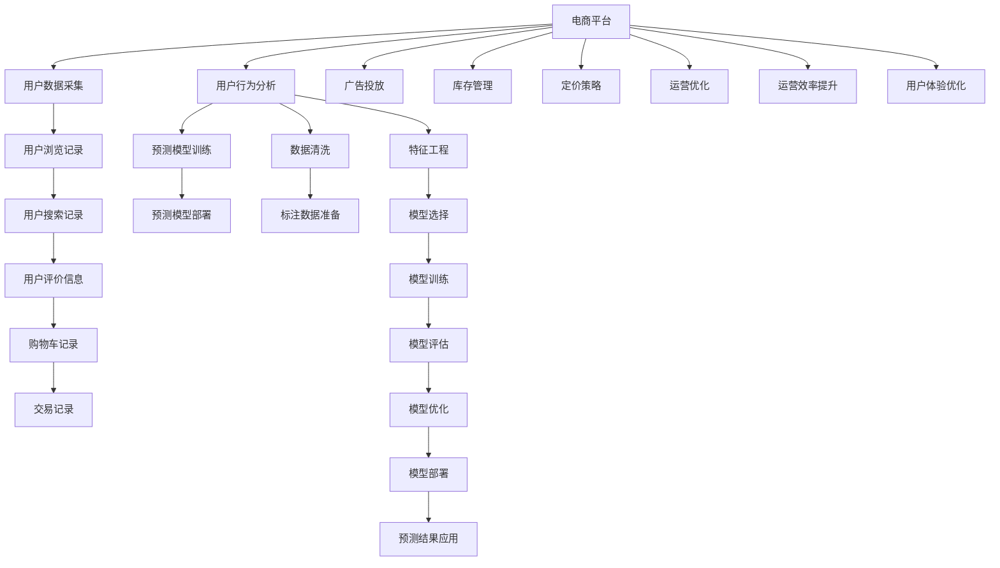

                 

# 探讨大模型在电商平台用户购买意向预测中的潜力

> 关键词：电商平台, 用户购买意向预测, 大模型, 深度学习, 迁移学习, 自然语言处理, 序列模型, 预测算法

## 1. 背景介绍

### 1.1 问题由来

随着互联网和电子商务的快速发展，电商平台成为人们日常购物的重要渠道。然而，电商平台上的海量商品信息和高竞争的市场环境，使得用户在面对多种商品选择时，常常陷入信息过载的困境。电商平台的运营者需要精准地预测用户购买意向，以便更好地进行个性化推荐，提高用户转化率和销售额。传统的用户行为分析方法通常基于简单的统计学模型，难以应对用户行为的复杂性，无法准确地预测用户购买意向。

近年来，深度学习和大模型的兴起为电商平台用户购买意向预测提供了新的解决思路。深度学习能够自动从大量数据中提取丰富的特征，进而建立高效的预测模型。大模型如BERT、GPT等，经过大规模预训练，已经具备强大的语言理解和生成能力，能够进一步提升预测模型的精度。因此，利用大模型对用户购买意向进行预测，成为了电商行业的热点研究方向。

### 1.2 问题核心关键点

用户购买意向预测的核心在于如何从用户的历史行为数据中挖掘出潜在的购买意愿。一般来说，电商平台的用户数据包括用户浏览历史、搜索记录、购物车记录、评价信息等。这些数据具有高维、稀疏、非结构化等特点，如何从中提取有价值的信息，建立精准的预测模型，成为研究的难点。

目前，用户购买意向预测的主流方法包括：

1. **基于统计学的预测方法**：如线性回归、逻辑回归、决策树等。这些方法通常适用于用户数据规模较小、特征数量不多的场景，但难以处理高维稀疏数据。

2. **基于深度学习的预测方法**：如卷积神经网络(CNN)、循环神经网络(RNN)等。这些方法能够自动从数据中提取特征，但需要大量的标注数据进行训练，难以应对电商平台数据的特点。

3. **基于大模型的预测方法**：如BERT、GPT等。这些大模型经过大规模预训练，具备强大的语言理解和生成能力，能够从文本数据中挖掘出丰富的语义信息，提升预测模型的精度。

这些方法各有优劣，如何选择合适的模型和算法，并结合电商平台的实际业务需求进行优化，是当前研究的重点。

### 1.3 问题研究意义

在电商平台中，用户购买意向预测的应用场景非常广泛，包括个性化推荐、库存管理、广告投放、定价策略等。利用大模型进行用户购买意向预测，能够显著提高电商平台的运营效率和用户体验，具体表现为：

1. **提高个性化推荐精度**：通过精准预测用户购买意向，电商平台能够提供更加个性化的商品推荐，提升用户满意度和转化率。

2. **优化库存管理**：预测不同商品的需求量，帮助电商平台进行更合理的库存管理，避免库存积压或短缺。

3. **提高广告投放效果**：预测用户的购买意向，有助于更精准地投放广告，提高广告的点击率和转化率。

4. **优化定价策略**：根据预测结果调整商品的定价策略，以获得更好的销售效果。

5. **提升平台运营效率**：通过精准预测，优化电商平台的运营策略，提高整体运营效率。

## 2. 核心概念与联系

### 2.1 核心概念概述

为了更好地理解大模型在电商平台用户购买意向预测中的应用，本节将介绍几个关键概念及其关系：

- **电商平台**：指通过互联网提供商品交易的虚拟平台，包括淘宝、京东、亚马逊等。

- **用户购买意向预测**：指根据用户的历史行为数据，预测其是否会购买某一商品或服务的过程。

- **深度学习**：指通过多层神经网络对数据进行自动特征提取和模型训练的技术。

- **大模型**：指通过大规模无标签数据进行预训练的深度学习模型，如BERT、GPT等。

- **迁移学习**：指将一个领域的知识迁移到另一个领域的过程，大模型的预训练可以看作一种迁移学习。

- **自然语言处理(NLP)**：指计算机对自然语言进行理解和生成的技术，大模型通常用于处理NLP任务。

- **序列模型**：指能够处理时间序列数据的深度学习模型，常用于处理电商数据。

这些概念构成了电商平台用户购买意向预测的核心技术体系，通过它们的有机结合，可以构建高效、精准的预测模型。

### 2.2 核心概念原理和架构的 Mermaid 流程图

以下是核心概念之间的逻辑关系图：



该流程图展示了从电商平台数据采集到预测模型应用的全过程，以及各个环节之间的逻辑关系。

## 3. 核心算法原理 & 具体操作步骤

### 3.1 算法原理概述

用户购买意向预测的算法原理主要包括数据预处理、特征工程、模型训练和模型评估等环节。

- **数据预处理**：包括数据清洗、标注数据准备、特征提取等。通过数据预处理，将原始数据转化为模型能够处理的格式。

- **特征工程**：指从原始数据中提取有意义的特征，以提高模型的预测精度。常见的特征包括用户行为特征、商品特征、时间特征等。

- **模型训练**：指通过标注数据训练预测模型。常见的模型包括线性回归、逻辑回归、深度神经网络等。

- **模型评估**：指对训练好的模型进行性能评估，选择最优模型进行预测。

在大模型应用中，为了提升预测精度，通常会引入预训练步骤。预训练步骤通过大规模无标签数据进行训练，学习通用的语言表示，为后续任务微调奠定基础。

### 3.2 算法步骤详解

以下是用户购买意向预测的详细步骤：

1. **数据预处理**：
   - 收集用户历史行为数据，包括浏览记录、搜索记录、评价信息、购物车记录、交易记录等。
   - 清洗数据，去除重复、缺失、异常等无用数据。
   - 标注数据，将用户行为数据标记为购买或未购买。
   - 提取特征，将原始数据转化为数值特征或文本特征。

2. **模型选择和预训练**：
   - 选择合适的预测模型，如线性回归、逻辑回归、深度神经网络等。
   - 选择合适的预训练大模型，如BERT、GPT等，进行预训练。
   - 将标注数据分批输入预训练模型，进行微调训练。

3. **特征工程**：
   - 对用户行为数据进行特征工程，提取有意义的特征。
   - 对商品数据进行特征工程，提取商品的属性特征、价格特征等。
   - 对时间数据进行特征工程，提取时间特征、周期特征等。

4. **模型训练**：
   - 将预处理后的数据分为训练集和测试集。
   - 选择合适的预测模型，并进行训练。
   - 设置合适的超参数，如学习率、批大小、迭代次数等。

5. **模型评估**：
   - 在测试集上评估模型性能，选择最优模型。
   - 对模型进行调优，提升模型预测精度。
   - 将模型部署到实际应用中，进行实时预测。

6. **预测结果应用**：
   - 将预测结果应用于个性化推荐、库存管理、广告投放等业务场景。
   - 对预测结果进行后处理，提升用户体验。

### 3.3 算法优缺点

大模型在电商平台用户购买意向预测中具有以下优点：

1. **强大的语言处理能力**：大模型具备强大的语言理解和生成能力，能够从用户行为数据中提取丰富的语义信息，提升预测精度。

2. **高效的特征提取能力**：大模型能够自动从数据中提取高维、非线性的特征，避免手动特征工程带来的复杂性。

3. **广泛的适用性**：大模型可以应用于多种NLP任务，具有广泛的适用性。

4. **可迁移性**：大模型的预训练过程可以看作一种迁移学习，能够应用于多种电商平台的业务场景。

然而，大模型也存在以下缺点：

1. **计算资源需求高**：大模型通常需要大量的计算资源进行训练和推理，增加了运营成本。

2. **过拟合风险高**：大模型需要大量的标注数据进行训练，容易在标注数据不足的情况下发生过拟合。

3. **推理速度慢**：大模型的推理速度较慢，难以满足实时预测的要求。

4. **数据隐私风险**：大模型的训练需要大量的用户数据，存在数据隐私泄露的风险。

5. **模型解释性差**：大模型通常被视为"黑盒"系统，难以解释其决策过程，难以进行调试和优化。

### 3.4 算法应用领域

大模型在电商平台用户购买意向预测中的应用领域广泛，包括：

1. **个性化推荐**：利用大模型对用户历史行为数据进行预测，提升推荐系统的个性化程度。

2. **库存管理**：预测不同商品的需求量，帮助电商平台进行更合理的库存管理。

3. **广告投放**：预测用户的购买意向，更有针对性地投放广告，提高广告的点击率和转化率。

4. **定价策略**：根据预测结果调整商品的定价策略，以获得更好的销售效果。

5. **运营优化**：通过精准预测，优化电商平台的运营策略，提高整体运营效率。

## 4. 数学模型和公式 & 详细讲解 & 举例说明

### 4.1 数学模型构建

用户购买意向预测的数学模型可以表示为：

$$
y = f(x; \theta)
$$

其中，$y$表示用户是否会购买商品，$x$表示用户的历史行为数据，$\theta$表示模型的参数。常见的预测模型包括线性回归模型、逻辑回归模型、深度神经网络等。

### 4.2 公式推导过程

以线性回归模型为例，其预测公式为：

$$
y = \theta_0 + \sum_{i=1}^n \theta_i x_i
$$

其中，$\theta_0$和$\theta_i$为模型参数，$x_i$为输入特征，$y$为预测结果。

在深度神经网络中，其预测公式可以表示为：

$$
y = \sigma(\sum_{i=1}^n w_i x_i + b)
$$

其中，$x_i$为输入特征，$w_i$和$b$为模型参数，$\sigma$为激活函数。

### 4.3 案例分析与讲解

假设某电商平台的销售数据如下：

| 用户ID | 浏览次数 | 搜索次数 | 购物车记录 | 评价数量 | 是否购买 |
| ------ | -------- | -------- | ---------- | -------- | -------- |
| 1      | 10       | 5        | 3          | 2        | 是       |
| 2      | 5        | 3        | 2          | 1        | 否       |
| 3      | 20       | 8        | 5          | 3        | 否       |
| ...    | ...      | ...      | ...        | ...      | ...      |

通过数据预处理和特征工程，将上述数据转化为模型可用的格式：

| 用户ID | 浏览次数 | 搜索次数 | 购物车记录 | 评价数量 | 是否购买 |
| ------ | -------- | -------- | ---------- | -------- | -------- |
| 1      | 10.0     | 5.0      | 3.0        | 2.0      | 1.0      |
| 2      | 5.0      | 3.0      | 2.0        | 1.0      | 0.0      |
| 3      | 20.0     | 8.0      | 5.0        | 3.0      | 0.0      |
| ...    | ...      | ...      | ...        | ...      | ...      |

通过选择合适的预测模型（如逻辑回归），进行模型训练和评估，得到最优模型。在实际应用中，可以利用该模型对新的用户行为数据进行实时预测，辅助电商平台进行个性化推荐、库存管理等业务决策。

## 5. 项目实践：代码实例和详细解释说明

### 5.1 开发环境搭建

在进行用户购买意向预测项目开发时，首先需要搭建开发环境。以下是使用Python进行PyTorch开发的环境配置流程：

1. 安装Anaconda：从官网下载并安装Anaconda，用于创建独立的Python环境。

2. 创建并激活虚拟环境：
```bash
conda create -n pytorch-env python=3.8 
conda activate pytorch-env
```

3. 安装PyTorch：根据CUDA版本，从官网获取对应的安装命令。例如：
```bash
conda install pytorch torchvision torchaudio cudatoolkit=11.1 -c pytorch -c conda-forge
```

4. 安装Transformers库：
```bash
pip install transformers
```

5. 安装各类工具包：
```bash
pip install numpy pandas scikit-learn matplotlib tqdm jupyter notebook ipython
```

完成上述步骤后，即可在`pytorch-env`环境中开始项目开发。

### 5.2 源代码详细实现

下面以线性回归模型为例，给出使用PyTorch进行用户购买意向预测的代码实现。

首先，定义预测模型的输入输出格式：

```python
import torch
from torch import nn
from torch.nn import functional as F

class LinearRegression(nn.Module):
    def __init__(self, input_dim):
        super(LinearRegression, self).__init__()
        self.linear = nn.Linear(input_dim, 1)

    def forward(self, x):
        y_pred = self.linear(x)
        return y_pred
```

然后，定义模型训练函数：

```python
def train_model(model, train_data, test_data, epochs, batch_size, learning_rate):
    model.train()
    criterion = nn.BCELoss()
    optimizer = torch.optim.Adam(model.parameters(), lr=learning_rate)

    for epoch in range(epochs):
        running_loss = 0.0
        for i, data in enumerate(train_data):
            inputs, labels = data

            optimizer.zero_grad()
            outputs = model(inputs)
            loss = criterion(outputs, labels)
            loss.backward()
            optimizer.step()

            running_loss += loss.item()

        print(f'Epoch {epoch+1}, loss: {running_loss/len(train_data):.4f}')

    print('Training completed.')
    return model
```

接着，加载并处理数据集：

```python
from torch.utils.data import TensorDataset, DataLoader

# 假设有以下数据集
train_X = torch.tensor([[10.0, 5.0, 3.0, 2.0], [5.0, 3.0, 2.0, 1.0], [20.0, 8.0, 5.0, 3.0], ...])
train_y = torch.tensor([1.0, 0.0, 0.0, ...])

train_dataset = TensorDataset(train_X, train_y)
train_loader = DataLoader(train_dataset, batch_size=batch_size, shuffle=True)
test_X = torch.tensor([[11.0, 6.0, 4.0, 2.5], [6.0, 4.0, 2.5, 1.5], [21.0, 9.0, 6.0, 3.5], ...])
test_y = torch.tensor([1.0, 0.0, 0.0, ...])

test_dataset = TensorDataset(test_X, test_y)
test_loader = DataLoader(test_dataset, batch_size=batch_size, shuffle=False)
```

最后，进行模型训练和预测：

```python
model = LinearRegression(4) # 假设输入特征有4个
epochs = 50
batch_size = 32
learning_rate = 0.01

model = train_model(model, train_loader, test_loader, epochs, batch_size, learning_rate)

# 预测新数据
test_X = torch.tensor([[11.0, 6.0, 4.0, 2.5]])
test_X = test_X.unsqueeze(0)
pred = model(test_X)
print(f'Predicted: {pred.item():.2f}')
```

以上就是使用PyTorch进行用户购买意向预测的完整代码实现。可以看到，通过简单的代码，即可构建并训练线性回归模型，对新的用户行为数据进行实时预测。

### 5.3 代码解读与分析

让我们再详细解读一下关键代码的实现细节：

**LinearRegression类**：
- `__init__`方法：初始化线性回归模型，定义线性层。
- `forward`方法：定义前向传播过程，计算输出结果。

**train_model函数**：
- 定义损失函数、优化器等。
- 对训练集进行前向传播和反向传播，更新模型参数。
- 打印每个epoch的平均损失值。

**数据加载和处理**：
- 定义训练集和测试集的数据集对象。
- 将数据转换为Tensor格式，定义批大小和shuffle选项。

**模型训练和预测**：
- 对模型进行训练。
- 对测试集进行预测，并打印预测结果。

可以看到，PyTorch提供了便捷的API，使得模型的构建、训练和预测过程变得简洁高效。开发者可以快速迭代并优化模型，提升预测精度。

## 6. 实际应用场景

### 6.1 电商平台个性化推荐

用户购买意向预测在电商平台个性化推荐中具有广泛应用。通过预测用户的购买意向，电商平台可以提供更加精准的推荐结果，提升用户满意度和转化率。

例如，某用户最近浏览了多个运动鞋商品，但未购买。通过对用户浏览记录进行预测，可以预测该用户可能感兴趣的运动鞋商品，并推荐给该用户，提升转化率。

### 6.2 库存管理

电商平台需要实时监控不同商品的库存情况，以避免库存积压或短缺。通过预测不同商品的需求量，电商平台可以更好地进行库存管理，优化库存水平。

例如，某商品在近期销量激增，通过对历史销售数据的预测，可以预估未来的销售趋势，从而提前备货或调整库存策略，减少库存积压或短缺。

### 6.3 广告投放

广告投放是电商平台的重要收入来源之一。通过预测用户的购买意向，可以更有针对性地投放广告，提高广告的点击率和转化率。

例如，某用户在某个时间段内多次浏览某个商品，但未购买。通过对用户行为数据的预测，可以判断该用户具有较强的购买意向，从而在合适的时间段投放相关广告，提升广告的投放效果。

## 7. 工具和资源推荐

### 7.1 学习资源推荐

为了帮助开发者系统掌握大模型在电商平台用户购买意向预测中的应用，这里推荐一些优质的学习资源：

1. 《深度学习入门：基于Python的理论与实现》系列博文：由知名深度学习专家撰写，系统讲解深度学习的基本原理和实际应用。

2. CS231n《卷积神经网络和视觉识别》课程：斯坦福大学开设的计算机视觉课程，提供丰富的理论知识和实践经验。

3. 《自然语言处理综论》书籍：介绍自然语言处理的基本概念和常用技术，涵盖深度学习、大模型等内容。

4. HuggingFace官方文档：提供丰富的预训练语言模型和模型微调样例，助力快速开发。

5. Kaggle数据集：包含大量电商数据集，用于模型训练和评估。

通过对这些资源的学习实践，相信你一定能够快速掌握大模型在电商平台用户购买意向预测中的应用，并用于解决实际的NLP问题。

### 7.2 开发工具推荐

高效的开发离不开优秀的工具支持。以下是几款用于大模型用户购买意向预测开发的常用工具：

1. PyTorch：基于Python的开源深度学习框架，灵活动态的计算图，适合快速迭代研究。

2. TensorFlow：由Google主导开发的开源深度学习框架，生产部署方便，适合大规模工程应用。

3. Transformers库：HuggingFace开发的NLP工具库，集成了众多SOTA语言模型，支持PyTorch和TensorFlow，是进行模型微调的重要工具。

4. Weights & Biases：模型训练的实验跟踪工具，可以记录和可视化模型训练过程中的各项指标，方便对比和调优。

5. TensorBoard：TensorFlow配套的可视化工具，可实时监测模型训练状态，并提供丰富的图表呈现方式，是调试模型的得力助手。

6. Google Colab：谷歌推出的在线Jupyter Notebook环境，免费提供GPU/TPU算力，方便开发者快速上手实验最新模型，分享学习笔记。

合理利用这些工具，可以显著提升大模型用户购买意向预测的开发效率，加快创新迭代的步伐。

### 7.3 相关论文推荐

大模型在电商平台用户购买意向预测中的应用研究始于学界的探索。以下是几篇奠基性的相关论文，推荐阅读：

1. Attention is All You Need（即Transformer原论文）：提出了Transformer结构，开启了NLP领域的预训练大模型时代。

2. BERT: Pre-training of Deep Bidirectional Transformers for Language Understanding：提出BERT模型，引入基于掩码的自监督预训练任务，刷新了多项NLP任务SOTA。

3. Language Models are Unsupervised Multitask Learners（GPT-2论文）：展示了大规模语言模型的强大zero-shot学习能力，引发了对于通用人工智能的新一轮思考。

4. Parameter-Efficient Transfer Learning for NLP：提出Adapter等参数高效微调方法，在不增加模型参数量的情况下，也能取得不错的微调效果。

5. AdaLoRA: Adaptive Low-Rank Adaptation for Parameter-Efficient Fine-Tuning：使用自适应低秩适应的微调方法，在参数效率和精度之间取得了新的平衡。

6. T5: Exploring the Limits of Transfer Learning with a Unified Text-to-Text Transformer：提出T5模型，将预训练和微调过程统一到一个框架中，提升模型性能。

这些论文代表了大模型在电商平台用户购买意向预测领域的发展脉络。通过学习这些前沿成果，可以帮助研究者把握学科前进方向，激发更多的创新灵感。

## 8. 总结：未来发展趋势与挑战

### 8.1 总结

本文对大模型在电商平台用户购买意向预测中的应用进行了全面系统的介绍。首先阐述了大模型和微调技术的研究背景和意义，明确了预测模型的预测精度和应用场景。其次，从原理到实践，详细讲解了预测模型的数学原理和关键步骤，给出了预测模型的完整代码实现。同时，本文还广泛探讨了预测模型在电商平台的实际应用，展示了预测模型在电商平台个性化推荐、库存管理、广告投放等方面的巨大潜力。此外，本文精选了预测模型的各类学习资源，力求为读者提供全方位的技术指引。

通过本文的系统梳理，可以看到，大模型在电商平台用户购买意向预测中具有广阔的应用前景，极大地提升了电商平台的运营效率和用户体验。未来，随着深度学习和大模型技术的不断进步，预测模型必将在更广泛的业务场景中发挥重要作用，推动电商平台向智能化、自动化方向发展。

### 8.2 未来发展趋势

展望未来，大模型在电商平台用户购买意向预测中的应用将呈现以下几个发展趋势：

1. **模型规模持续增大**：随着算力成本的下降和数据规模的扩张，预训练语言模型的参数量还将持续增长。超大规模语言模型蕴含的丰富语言知识，有望支撑更加复杂多变的电商平台业务场景。

2. **微调方法日趋多样**：除了传统的全参数微调外，未来会涌现更多参数高效的微调方法，如Prefix-Tuning、LoRA等，在节省计算资源的同时也能保证预测精度。

3. **持续学习成为常态**：随着数据分布的不断变化，预测模型也需要持续学习新知识以保持性能。如何在不遗忘原有知识的同时，高效吸收新样本信息，将成为重要的研究课题。

4. **标注样本需求降低**：受启发于提示学习(Prompt-based Learning)的思路，未来的预测模型将更好地利用大模型的语言理解能力，通过更加巧妙的任务描述，在更少的标注样本上也能实现理想的预测效果。

5. **模型通用性增强**：经过海量数据的预训练和多领域任务的微调，未来的预测模型将具备更强大的常识推理和跨领域迁移能力，逐步迈向通用人工智能(AGI)的目标。

以上趋势凸显了大模型在电商平台用户购买意向预测中的广阔前景。这些方向的探索发展，必将进一步提升电商平台的运营效率和用户体验，推动电商行业向智能化、自动化方向发展。

### 8.3 面临的挑战

尽管大模型在电商平台用户购买意向预测中已经取得了显著成就，但在迈向更加智能化、普适化应用的过程中，它仍面临着诸多挑战：

1. **标注成本瓶颈**：尽管微调大大降低了标注数据的需求，但对于长尾应用场景，难以获得充足的高质量标注数据，成为制约预测模型性能的瓶颈。如何进一步降低预测模型对标注样本的依赖，将是一大难题。

2. **模型鲁棒性不足**：预测模型面对域外数据时，泛化性能往往大打折扣。对于测试样本的微小扰动，预测模型的输出也容易发生波动。如何提高预测模型的鲁棒性，避免灾难性遗忘，还需要更多理论和实践的积累。

3. **推理效率有待提高**：大规模语言模型虽然精度高，但在实际部署时往往面临推理速度慢、内存占用大等效率问题。如何在保证性能的同时，简化模型结构，提升推理速度，优化资源占用，将是重要的优化方向。

4. **可解释性亟需加强**：当前预测模型通常被视为"黑盒"系统，难以解释其决策过程，难以进行调试和优化。对于医疗、金融等高风险应用，算法的可解释性和可审计性尤为重要。如何赋予预测模型更强的可解释性，将是亟待攻克的难题。

5. **安全性有待保障**：预测模型的训练需要大量的用户数据，存在数据隐私泄露的风险。如何在保证数据隐私的前提下，进行有效的预测模型训练，将是重要的研究方向。

6. **知识整合能力不足**：现有的预测模型往往局限于任务内数据，难以灵活吸收和运用更广泛的先验知识。如何让预测过程更好地与外部知识库、规则库等专家知识结合，形成更加全面、准确的信息整合能力，还有很大的想象空间。

正视预测模型面临的这些挑战，积极应对并寻求突破，将是大模型预测模型迈向成熟的必由之路。相信随着学界和产业界的共同努力，这些挑战终将一一被克服，预测模型必将在构建智能化的电商平台上发挥重要作用。

### 8.4 研究展望

面对预测模型面临的种种挑战，未来的研究需要在以下几个方面寻求新的突破：

1. **探索无监督和半监督预测方法**：摆脱对大规模标注数据的依赖，利用自监督学习、主动学习等无监督和半监督范式，最大限度利用非结构化数据，实现更加灵活高效的预测模型。

2. **研究参数高效和计算高效的预测范式**：开发更加参数高效的预测方法，在固定大部分预训练参数的同时，只更新极少量的任务相关参数。同时优化预测模型的计算图，减少前向传播和反向传播的资源消耗，实现更加轻量级、实时性的部署。

3. **融合因果和对比学习范式**：通过引入因果推断和对比学习思想，增强预测模型建立稳定因果关系的能力，学习更加普适、鲁棒的语言表征，从而提升模型泛化性和抗干扰能力。

4. **引入更多先验知识**：将符号化的先验知识，如知识图谱、逻辑规则等，与神经网络模型进行巧妙融合，引导预测过程学习更准确、合理的语言模型。同时加强不同模态数据的整合，实现视觉、语音等多模态信息与文本信息的协同建模。

5. **结合因果分析和博弈论工具**：将因果分析方法引入预测模型，识别出模型决策的关键特征，增强输出解释的因果性和逻辑性。借助博弈论工具刻画人机交互过程，主动探索并规避模型的脆弱点，提高系统稳定性。

6. **纳入伦理道德约束**：在预测模型训练目标中引入伦理导向的评估指标，过滤和惩罚有害的输出倾向。同时加强人工干预和审核，建立模型行为的监管机制，确保输出的安全性。

这些研究方向的探索，必将引领预测模型迈向更高的台阶，为构建智能化的电商平台预测模型铺平道路。面向未来，预测模型还需要与其他人工智能技术进行更深入的融合，如知识表示、因果推理、强化学习等，多路径协同发力，共同推动电商平台预测模型的进步。只有勇于创新、敢于突破，才能不断拓展预测模型的边界，让智能技术更好地服务于电商平台。

## 9. 附录：常见问题与解答

**Q1：预测模型是否适用于所有电商任务？**

A: 预测模型在大多数电商任务上都能取得不错的效果，特别是对于数据量较大的任务。但对于一些特定领域的任务，如小众商品、个性化需求较高的任务，预测模型可能效果不佳。此时需要在特定领域语料上进一步预训练，再进行微调，才能获得理想效果。

**Q2：如何选择合适的预测模型？**

A: 选择合适的预测模型需要综合考虑电商平台的业务需求和数据特点。通常，线性回归、逻辑回归适用于数据量较小、特征数量不多的任务，而深度神经网络适用于数据量较大、特征数量较多的任务。大模型通常用于处理大规模数据，能够更好地利用用户行为数据中的语义信息。

**Q3：预测模型在落地部署时需要注意哪些问题？**

A: 将预测模型转化为实际应用，还需要考虑以下因素：
1. 模型裁剪：去除不必要的层和参数，减小模型尺寸，加快推理速度。
2. 量化加速：将浮点模型转为定点模型，压缩存储空间，提高计算效率。
3. 服务化封装：将模型封装为标准化服务接口，便于集成调用。
4. 弹性伸缩：根据请求流量动态调整资源配置，平衡服务质量和成本。
5. 监控告警：实时采集系统指标，设置异常告警阈值，确保服务稳定性。
6. 安全防护：采用访问鉴权、数据脱敏等措施，保障数据和模型安全。

大模型预测模型为电商平台提供了强大的预测能力，但如何将强大的性能转化为稳定、高效、安全的业务价值，还需要工程实践的不断打磨。唯有从数据、算法、工程、业务等多个维度协同发力，才能真正实现预测模型的广泛应用。总之，预测模型需要开发者根据具体任务，不断迭代和优化模型、数据和算法，方能得到理想的效果。

