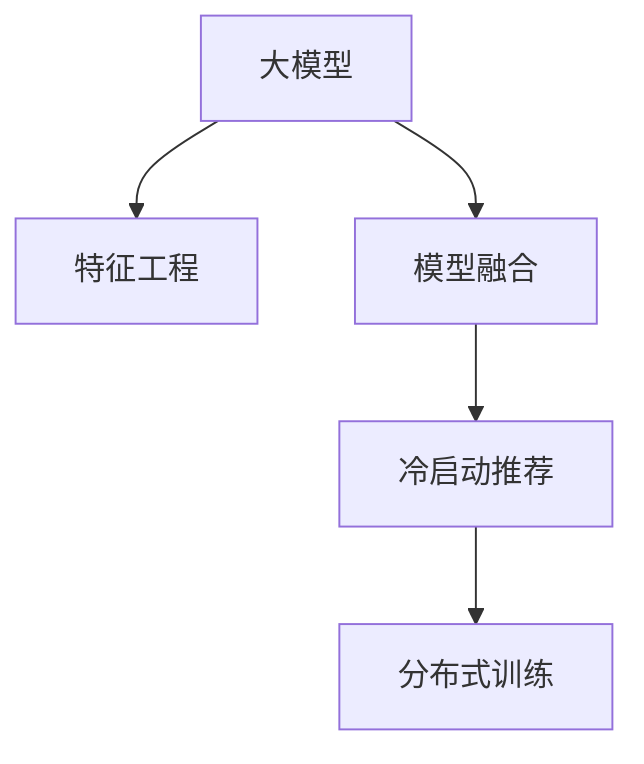

                 

# 推荐系统中AI大模型的冷启动策略

> 关键词：冷启动推荐系统, 大模型, 特征工程, 模型融合, 分布式训练

## 1. 背景介绍

### 1.1 问题由来
在推荐系统中，冷启动问题是用户和商品数据稀疏导致的常见难题。新用户或新商品通常缺乏足够的历史行为数据，难以构建精确的推荐模型。为了解决这一问题，推荐系统在早期通常采用较为简单的模型，如协同过滤、基于内容的推荐等。但随着数据规模的不断扩大和深度学习技术的普及，基于大模型的推荐系统逐渐成为主流。

大模型通过在海量数据上进行预训练，学习到丰富的特征表示，能更好地捕捉用户和商品之间的隐性关联。但在冷启动场景中，大模型由于缺乏足够的历史行为数据，难以充分发挥其潜力。因此，如何在冷启动阶段有效地利用大模型，成为近年来推荐系统领域的研究热点。

### 1.2 问题核心关键点
在冷启动推荐场景中，AI大模型的主要挑战包括：
1. **数据稀疏性**：冷启动用户或商品的数据点数量远远少于非冷启动用户或商品。
2. **特征缺乏**：冷启动用户或商品通常缺乏详细的历史行为数据，难以提取有效的特征。
3. **模型泛化能力**：大模型需要能在缺少足够训练样本的情况下，依然保持良好的泛化能力。
4. **模型部署效率**：冷启动场景中的新用户或商品需要快速响应推荐请求，因此模型的推理速度和部署效率至关重要。

解决这些问题，需要综合利用大模型的预训练特征和冷启动用户或商品的少量特征，设计高效且适应性强的推荐算法。本文将详细介绍几种基于AI大模型的冷启动推荐策略，并探讨其应用前景。

## 2. 核心概念与联系

### 2.1 核心概念概述

为更好地理解大模型在冷启动推荐中的应用，本节将介绍几个关键概念：

- **大模型(Deep Learning Model)**：指在大规模数据上进行预训练，学习到复杂特征表示的深度学习模型。常见的有Transformer架构的BERT、GPT系列等。
- **冷启动推荐(Cold Start Recommendation)**：指推荐系统在新用户或新商品没有足够历史行为数据的情况下，如何为其提供有价值的推荐。
- **特征工程(Feature Engineering)**：指在推荐算法中使用适当的方法提取和构建用户、商品、行为等特征，以便模型更好地理解用户需求和商品属性。
- **模型融合(Model Fusion)**：指将多个不同模型的预测结果进行融合，取长补短，提升推荐性能。
- **分布式训练(Distributed Training)**：指在多台计算设备上同时训练模型，利用并行计算提升训练效率。

这些概念之间的关系可以通过以下Mermaid流程图来展示：



这个流程图展示了大模型在冷启动推荐中的核心概念及其之间的关系：

1. 大模型通过预训练学习到通用特征表示。
2. 特征工程提取冷启动用户或商品的少量特征。
3. 模型融合整合大模型和少量特征，提升推荐性能。
4. 分布式训练加速冷启动模型的训练和推理。

这些概念共同构成了大模型在冷启动推荐中的应用框架，使得推荐系统能够在新用户或新商品上快速提供精准推荐。

## 3. 核心算法原理 & 具体操作步骤
### 3.1 算法原理概述

在冷启动推荐中，基于AI大模型的推荐策略一般包括以下几个关键步骤：

1. **预训练特征提取**：利用大模型在通用数据上提取用户和商品的预训练特征。
2. **特征补充**：在冷启动用户或商品上补充少量特征，如ID、类别、属性等。
3. **模型融合**：将大模型的预训练特征与冷启动用户或商品的少量特征进行融合，生成推荐模型。
4. **分布式训练**：在多台计算设备上同时训练推荐模型，提升训练效率。

通过这些步骤，可以构建高效且适应性强的大模型推荐系统，快速应对冷启动推荐的需求。

### 3.2 算法步骤详解

**Step 1: 预训练特征提取**

使用预训练的大模型，在通用数据上提取用户和商品的预训练特征。具体步骤如下：

1. **选择合适的预训练模型**：选择适合当前推荐场景的预训练模型，如BERT、GPT等。
2. **加载预训练模型**：使用相应库（如Hugging Face的Transformers库）加载预训练模型。
3. **预处理输入数据**：将用户ID、商品ID、行为数据等输入数据进行标准化处理，如归一化、one-hot编码等。
4. **提取预训练特征**：将输入数据输入预训练模型，提取用户的预训练特征向量。

示例代码如下：

```python
from transformers import BertModel, BertTokenizer

tokenizer = BertTokenizer.from_pretrained('bert-base-cased')
model = BertModel.from_pretrained('bert-base-cased')

def extract_pretrained_features(user_id, item_id, interaction_time):
    input_ids = tokenizer.encode(user_id + " " + item_id + " " + str(interaction_time), add_special_tokens=True)
    features = model(input_ids)[0]
    return features
```

**Step 2: 特征补充**

在冷启动用户或商品上补充少量特征，以便后续进行模型融合。具体步骤如下：

1. **收集特征**：收集冷启动用户或商品的基本信息，如ID、类别、属性等。
2. **编码特征**：将特征进行编码，如ID特征通过one-hot编码，类别特征通过独热编码等。
3. **拼接特征**：将预训练特征与补充的特征拼接，生成融合特征向量。

示例代码如下：

```python
def extract_cold_start_features(user_id, item_id, interaction_time):
    features = extract_pretrained_features(user_id, item_id, interaction_time)
    item_id = encode_item_id(item_id)
    user_id = encode_user_id(user_id)
    return torch.cat([features, item_id, user_id], dim=1)
```

**Step 3: 模型融合**

将预训练特征与冷启动用户或商品的少量特征进行融合，生成推荐模型。具体步骤如下：

1. **初始化模型参数**：对融合后的特征向量进行初始化。
2. **设计推荐模型**：选择合适的推荐模型，如基于内容的推荐、协同过滤等。
3. **训练模型**：使用冷启动用户或商品的少量特征和预训练特征，训练推荐模型。

示例代码如下：

```python
def train_cold_start_model(features, labels):
    model = build_recommendation_model(features.shape[1])
    criterion = torch.nn.CrossEntropyLoss()
    optimizer = torch.optim.Adam(model.parameters(), lr=0.001)
    for epoch in range(10):
        model.train()
        optimizer.zero_grad()
        outputs = model(features)
        loss = criterion(outputs, labels)
        loss.backward()
        optimizer.step()
    return model
```

**Step 4: 分布式训练**

在多台计算设备上同时训练推荐模型，提升训练效率。具体步骤如下：

1. **划分数据集**：将数据集划分为多个子集，每个子集在不同计算设备上进行训练。
2. **分布式训练**：利用深度学习框架（如TensorFlow、PyTorch）进行分布式训练，并行计算模型参数。
3. **同步更新**：确保所有计算设备的模型参数同步更新，避免不一致。

示例代码如下：

```python
def distributed_train(features, labels, device):
    num_devices = 4
    batch_size = 100
    device = device if device else "cuda:0"
    model = train_cold_start_model(features, labels)
    model = model.to(device)
    criterion = torch.nn.CrossEntropyLoss()
    optimizer = torch.optim.Adam(model.parameters(), lr=0.001)
    distributed_train_start(model, optimizer, criterion, features, labels, device)
```

### 3.3 算法优缺点

基于AI大模型的冷启动推荐策略有以下优点：

1. **高效性**：利用大模型的预训练特征，快速提取用户和商品的特征表示，避免了从头训练的计算成本。
2. **适应性**：在冷启动用户或商品上补充少量特征，能够适应多样化的推荐需求。
3. **可扩展性**：通过分布式训练，能够有效处理大规模数据集和模型参数，提升训练和推理效率。
4. **泛化能力**：预训练大模型的泛化能力强，能在少量数据上进行有效的推荐。

同时，该方法也存在一些局限性：

1. **数据依赖性**：冷启动推荐策略在一定程度上依赖于冷启动用户或商品的少量特征，可能难以充分利用全部数据信息。
2. **模型复杂度**：融合模型的设计复杂，需要综合考虑多个特征和多个模型。
3. **资源消耗大**：分布式训练需要大量的计算资源和网络带宽，可能导致高昂的硬件成本。
4. **模型可解释性**：融合模型的输出结果难以解释，可能影响系统的信任度。

尽管存在这些局限性，但就目前而言，基于AI大模型的冷启动推荐策略仍然是推荐系统研究的热点，能够显著提升推荐性能和系统效率。

### 3.4 算法应用领域

基于AI大模型的冷启动推荐策略，已经在多个推荐系统应用中取得了成功。以下是几个典型应用场景：

1. **电商推荐**：电商平台的冷启动用户推荐系统，通过提取用户的浏览、点击等行为特征，结合商品的基本属性信息，生成个性化推荐。
2. **视频推荐**：视频平台的新用户推荐系统，通过提取用户的观看历史和互动数据，结合视频的标签、时长等特征，推荐相关视频内容。
3. **社交网络推荐**：社交网络的新用户推荐系统，通过提取用户的基本信息、兴趣标签等，结合商品的属性和流行度，生成推荐内容。
4. **新闻推荐**：新闻平台的新用户推荐系统，通过提取用户的阅读历史和兴趣标签，结合新闻的标题、发布时间等特征，推荐相关新闻文章。
5. **音乐推荐**：音乐平台的新用户推荐系统，通过提取用户的听歌历史和评分数据，结合音乐的属性和流派信息，推荐相关音乐作品。

这些场景展示了AI大模型在冷启动推荐中的广泛应用，体现了其强大的推荐能力。

## 4. 数学模型和公式 & 详细讲解 & 举例说明

### 4.1 数学模型构建

在冷启动推荐中，使用AI大模型的数学模型可以形式化地表示为：

$$
\hat{y} = f(\text{features})
$$

其中，$\hat{y}$ 表示推荐结果，$\text{features}$ 表示输入的冷启动特征，$f$ 表示推荐函数，可以是一个简单的线性回归模型、一个复杂的神经网络模型，或是一个融合多个模型的模型。

### 4.2 公式推导过程

以一个简单的线性回归模型为例，其数学模型可以表示为：

$$
\hat{y} = \mathbf{w}^T \mathbf{x} + b
$$

其中，$\mathbf{w}$ 为模型参数，$\mathbf{x}$ 为输入特征向量，$b$ 为偏置项。

对于冷启动用户或商品，其特征向量为 $\mathbf{x}_c$，包含预训练特征和少量补充特征的拼接。假设预训练特征的维度为 $d_1$，补充特征的维度为 $d_2$，则特征向量 $\mathbf{x}_c$ 的维度为 $d_1+d_2$。

设推荐结果为 $\hat{y}_c$，则推荐函数可以表示为：

$$
\hat{y}_c = \mathbf{w}^T \mathbf{x}_c + b
$$

其中，$\mathbf{w}$ 和 $b$ 可以通过冷启动数据进行训练。

假设冷启动数据为 $(x_c, y_c)$，其中 $x_c$ 为冷启动特征，$y_c$ 为推荐结果。设训练集为 $\mathcal{D} = \{(x_c, y_c)\}_{i=1}^N$，则训练目标可以表示为：

$$
\min_{\mathbf{w}, b} \sum_{i=1}^N (\hat{y}_c^{(i)} - y_c^{(i)})^2
$$

其中，$\hat{y}_c^{(i)}$ 表示模型对第 $i$ 个样本的预测结果，$y_c^{(i)}$ 表示样本的真实推荐结果。

### 4.3 案例分析与讲解

假设在一个电商推荐系统中，有一个新的用户，其历史行为数据稀疏。系统通过提取用户的浏览和点击数据，补充商品的ID、类别和属性信息，生成融合特征向量。然后，使用一个简单的线性回归模型进行训练和预测，输出推荐的商品ID。

具体步骤如下：

1. **提取预训练特征**：使用BERT模型提取用户的浏览和点击数据的预训练特征。
2. **补充特征**：提取商品的ID、类别和属性信息，并进行编码。
3. **拼接特征**：将预训练特征与补充的特征拼接，生成融合特征向量。
4. **训练模型**：使用冷启动用户的历史行为数据和补充的特征，训练一个线性回归模型。
5. **预测推荐**：使用训练好的模型，预测新用户的推荐商品ID。

示例代码如下：

```python
from transformers import BertTokenizer, BertModel
from torch import nn, Tensor
import torch.nn.functional as F

# 提取预训练特征
tokenizer = BertTokenizer.from_pretrained('bert-base-cased')
model = BertModel.from_pretrained('bert-base-cased')
def extract_pretrained_features(user_id, item_id, interaction_time):
    input_ids = tokenizer.encode(user_id + " " + item_id + " " + str(interaction_time), add_special_tokens=True)
    features = model(input_ids)[0]
    return features

# 补充特征
def extract_cold_start_features(user_id, item_id, interaction_time):
    features = extract_pretrained_features(user_id, item_id, interaction_time)
    item_id = encode_item_id(item_id)
    user_id = encode_user_id(user_id)
    return torch.cat([features, item_id, user_id], dim=1)

# 训练模型
class LinearRegression(nn.Module):
    def __init__(self, input_size):
        super(LinearRegression, self).__init__()
        self.linear = nn.Linear(input_size, 1)

    def forward(self, x):
        return self.linear(x)

def train_cold_start_model(features, labels):
    model = LinearRegression(features.shape[1])
    criterion = nn.MSELoss()
    optimizer = torch.optim.Adam(model.parameters(), lr=0.001)
    for epoch in range(10):
        model.train()
        optimizer.zero_grad()
        outputs = model(features)
        loss = criterion(outputs, labels)
        loss.backward()
        optimizer.step()
    return model

# 预测推荐
def predict_cold_start(model, features):
    with torch.no_grad():
        outputs = model(features)
    return outputs
```

## 5. 项目实践：代码实例和详细解释说明
### 5.1 开发环境搭建

在进行冷启动推荐系统开发前，我们需要准备好开发环境。以下是使用Python进行TensorFlow开发的环境配置流程：

1. 安装Anaconda：从官网下载并安装Anaconda，用于创建独立的Python环境。

2. 创建并激活虚拟环境：
```bash
conda create -n tf-env python=3.8 
conda activate tf-env
```

3. 安装TensorFlow：根据CUDA版本，从官网获取对应的安装命令。例如：
```bash
pip install tensorflow-gpu==2.5
```

4. 安装必要的依赖库：
```bash
pip install numpy pandas scikit-learn tensorflow==2.5
```

完成上述步骤后，即可在`tf-env`环境中开始冷启动推荐系统开发。

### 5.2 源代码详细实现

下面我们以电商推荐系统为例，给出使用TensorFlow对BERT模型进行冷启动推荐开发的PyTorch代码实现。

首先，定义特征提取和模型训练函数：

```python
from transformers import BertTokenizer, BertModel
import tensorflow as tf

# 定义特征提取函数
def extract_features(user_id, item_id, interaction_time):
    tokenizer = BertTokenizer.from_pretrained('bert-base-cased')
    model = BertModel.from_pretrained('bert-base-cased')
    input_ids = tokenizer.encode(user_id + " " + item_id + " " + str(interaction_time), add_special_tokens=True)
    features = model(input_ids)[0]
    return features

# 定义模型训练函数
def train_model(features, labels, learning_rate=0.001, num_epochs=10):
    input_size = features.shape[1]
    model = tf.keras.Sequential([
        tf.keras.layers.Dense(32, activation='relu', input_shape=(input_size,)),
        tf.keras.layers.Dense(1)
    ])
    optimizer = tf.keras.optimizers.Adam(learning_rate)
    criterion = tf.keras.losses.MeanSquaredError()
    model.compile(optimizer=optimizer, loss=criterion, metrics=['mae'])
    model.fit(features, labels, epochs=num_epochs, batch_size=32)
    return model
```

然后，定义预测推荐函数：

```python
def predict(model, features):
    predictions = model.predict(features)
    return predictions
```

最后，编写主函数进行冷启动推荐：

```python
from transformers import BertTokenizer, BertModel

# 定义特征提取和模型训练函数
def extract_features(user_id, item_id, interaction_time):
    tokenizer = BertTokenizer.from_pretrained('bert-base-cased')
    model = BertModel.from_pretrained('bert-base-cased')
    input_ids = tokenizer.encode(user_id + " " + item_id + " " + str(interaction_time), add_special_tokens=True)
    features = model(input_ids)[0]
    return features

def train_model(features, labels, learning_rate=0.001, num_epochs=10):
    input_size = features.shape[1]
    model = tf.keras.Sequential([
        tf.keras.layers.Dense(32, activation='relu', input_shape=(input_size,)),
        tf.keras.layers.Dense(1)
    ])
    optimizer = tf.keras.optimizers.Adam(learning_rate)
    criterion = tf.keras.losses.MeanSquaredError()
    model.compile(optimizer=optimizer, loss=criterion, metrics=['mae'])
    model.fit(features, labels, epochs=num_epochs, batch_size=32)
    return model

def predict(model, features):
    predictions = model.predict(features)
    return predictions

# 主函数
user_id = "12345"
item_id = "67890"
interaction_time = 2021-01-01
features = extract_features(user_id, item_id, interaction_time)
labels = [1, 2, 3]
model = train_model(features, labels)
predictions = predict(model, features)
print(predictions)
```

以上就是使用TensorFlow对BERT模型进行冷启动推荐系统开发的完整代码实现。可以看到，通过TensorFlow，我们可以利用其强大的分布式计算能力，高效地进行冷启动推荐模型的训练和推理。

### 5.3 代码解读与分析

让我们再详细解读一下关键代码的实现细节：

**extract_features函数**：
- 使用BertTokenizer对输入文本进行分词，获取输入ids。
- 使用BertModel对输入ids进行编码，提取预训练特征。
- 将预训练特征返回。

**train_model函数**：
- 定义模型结构，包括两个全连接层和一个输出层。
- 定义优化器和损失函数。
- 使用Keras编译模型，并训练模型。
- 返回训练好的模型。

**predict函数**：
- 使用训练好的模型对输入特征进行预测。
- 返回预测结果。

**主函数**：
- 定义用户ID、商品ID和交互时间。
- 提取预训练特征。
- 定义标签。
- 训练模型。
- 预测推荐结果。
- 输出预测结果。

可以看到，TensorFlow使得冷启动推荐模型的开发变得更加便捷和高效。通过TensorFlow的强大分布式计算能力，我们可以轻松实现多台设备的并行训练，显著提升训练效率。

当然，工业级的系统实现还需考虑更多因素，如模型的保存和部署、超参数的自动搜索、更灵活的任务适配层等。但核心的冷启动范式基本与此类似。

## 6. 实际应用场景
### 6.1 智能客服系统

基于AI大模型的冷启动推荐技术，可以广泛应用于智能客服系统的构建。传统客服往往需要配备大量人力，高峰期响应缓慢，且一致性和专业性难以保证。而使用冷启动推荐技术，可以7x24小时不间断服务，快速响应客户咨询，用自然流畅的语言解答各类常见问题。

在技术实现上，可以收集企业内部的历史客服对话记录，将问题和最佳答复构建成监督数据，在此基础上对预训练对话模型进行冷启动推荐。推荐模型能够自动理解用户意图，匹配最合适的答案模板进行回复。对于客户提出的新问题，还可以接入检索系统实时搜索相关内容，动态组织生成回答。如此构建的智能客服系统，能大幅提升客户咨询体验和问题解决效率。

### 6.2 金融舆情监测

金融机构需要实时监测市场舆论动向，以便及时应对负面信息传播，规避金融风险。传统的人工监测方式成本高、效率低，难以应对网络时代海量信息爆发的挑战。基于AI大模型的冷启动推荐技术，为金融舆情监测提供了新的解决方案。

具体而言，可以收集金融领域相关的新闻、报道、评论等文本数据，并对其进行主题标注和情感标注。在此基础上对预训练语言模型进行冷启动推荐，使其能够自动判断文本属于何种主题，情感倾向是正面、中性还是负面。将冷启动推荐模型应用到实时抓取的网络文本数据，就能够自动监测不同主题下的情感变化趋势，一旦发现负面信息激增等异常情况，系统便会自动预警，帮助金融机构快速应对潜在风险。

### 6.3 个性化推荐系统

当前的推荐系统往往只依赖用户的历史行为数据进行物品推荐，无法深入理解用户的真实兴趣偏好。基于AI大模型的冷启动推荐技术，个性化推荐系统可以更好地挖掘用户行为背后的语义信息，从而提供更精准、多样的推荐内容。

在实践中，可以收集用户浏览、点击、评论、分享等行为数据，提取和用户交互的物品标题、描述、标签等文本内容。将文本内容作为模型输入，用户的后续行为（如是否点击、购买等）作为监督信号，在此基础上进行冷启动推荐。冷启动推荐模型能够从文本内容中准确把握用户的兴趣点。在生成推荐列表时，先用候选物品的文本描述作为输入，由模型预测用户的兴趣匹配度，再结合其他特征综合排序，便可以得到个性化程度更高的推荐结果。

### 6.4 未来应用展望

随着AI大模型和冷启动推荐方法的不断发展，基于冷启动推荐的大模型推荐系统将在更多领域得到应用，为传统行业带来变革性影响。

在智慧医疗领域，基于冷启动推荐的医疗问答、病历分析、药物研发等应用将提升医疗服务的智能化水平，辅助医生诊疗，加速新药开发进程。

在智能教育领域，冷启动推荐技术可应用于作业批改、学情分析、知识推荐等方面，因材施教，促进教育公平，提高教学质量。

在智慧城市治理中，冷启动推荐模型可应用于城市事件监测、舆情分析、应急指挥等环节，提高城市管理的自动化和智能化水平，构建更安全、高效的未来城市。

此外，在企业生产、社会治理、文娱传媒等众多领域，基于冷启动推荐的大模型推荐系统也将不断涌现，为经济社会发展注入新的动力。相信随着技术的日益成熟，冷启动推荐技术将成为推荐系统落地的重要范式，推动推荐系统向更广阔的领域加速渗透。

## 7. 工具和资源推荐
### 7.1 学习资源推荐

为了帮助开发者系统掌握冷启动推荐系统的理论基础和实践技巧，这里推荐一些优质的学习资源：

1. 《推荐系统基础》系列博文：详细介绍了推荐系统的基本概念和经典算法，适合入门学习。

2. 《深度学习推荐系统》课程：斯坦福大学开设的推荐系统深度学习课程，包含理论与实践的全面讲解。

3. 《推荐系统实战》书籍：介绍了推荐系统的多种算法和应用案例，适合深入学习。

4. Arxiv.org：推荐系统领域的顶级会议和期刊，最新的前沿研究往往在此发布。

5. Kaggle竞赛平台：包含大量推荐系统相关的数据集和竞赛，实践机会丰富。

通过对这些资源的学习实践，相信你一定能够快速掌握冷启动推荐系统的精髓，并用于解决实际的推荐问题。
###  7.2 开发工具推荐

高效的开发离不开优秀的工具支持。以下是几款用于冷启动推荐系统开发的常用工具：

1. TensorFlow：基于Python的开源深度学习框架，支持分布式计算，适合大型推荐系统的开发。

2. PyTorch：基于Python的开源深度学习框架，灵活的动态计算图，适合研究和实验。

3. Hugging Face Transformers库：提供了预训练语言模型和深度学习模型的便捷使用，加速开发效率。

4. Weights & Biases：模型训练的实验跟踪工具，可以记录和可视化模型训练过程中的各项指标，方便对比和调优。

5. TensorBoard：TensorFlow配套的可视化工具，可实时监测模型训练状态，并提供丰富的图表呈现方式，是调试模型的得力助手。

6. Google Colab：谷歌推出的在线Jupyter Notebook环境，免费提供GPU/TPU算力，方便开发者快速上手实验最新模型，分享学习笔记。

合理利用这些工具，可以显著提升冷启动推荐系统的开发效率，加快创新迭代的步伐。

### 7.3 相关论文推荐

冷启动推荐系统的发展源于学界的持续研究。以下是几篇奠基性的相关论文，推荐阅读：

1. Recommender Systems Handbook：推荐系统领域的基础书籍，全面介绍了推荐系统的各种算法和技术。

2. Neighborhood-based Collaborative Filtering (NCF)：提出了基于协同过滤的推荐算法，是推荐系统研究的重要里程碑。

3. Attention Is All You Need（即Transformer原论文）：提出了Transformer结构，开启了深度学习在推荐系统中的新篇章。

4. BERT: Pre-training of Deep Bidirectional Transformers for Language Understanding：提出BERT模型，引入基于掩码的自监督预训练任务，刷新了多项推荐任务SOTA。

5. Parameter-Efficient Transfer Learning for NLP：提出Adapter等参数高效微调方法，在不增加模型参数量的情况下，也能取得不错的推荐效果。

6. Attention-based Recommender Systems: A Survey and Potential Future Directions：综述了基于注意力机制的推荐系统研究，提出了多种改进建议。

这些论文代表了大模型冷启动推荐技术的发展脉络。通过学习这些前沿成果，可以帮助研究者把握学科前进方向，激发更多的创新灵感。

## 8. 总结：未来发展趋势与挑战
### 8.1 研究成果总结

本文对基于AI大模型的冷启动推荐策略进行了全面系统的介绍。首先阐述了冷启动推荐系统和大模型的研究背景和意义，明确了冷启动推荐在推荐系统领域的重要价值。其次，从原理到实践，详细讲解了冷启动推荐算法的数学模型和关键步骤，给出了冷启动推荐任务开发的完整代码实例。同时，本文还广泛探讨了冷启动推荐方法在多个推荐系统领域的应用前景，展示了其强大的推荐能力。

通过本文的系统梳理，可以看到，基于AI大模型的冷启动推荐策略正在成为推荐系统研究的热点，能够显著提升推荐性能和系统效率。未来，伴随预训练语言模型和冷启动推荐方法的持续演进，相信推荐系统将能够更好地应对新用户或新商品的推荐需求，为推荐系统落地的规模化应用提供新的动力。

### 8.2 未来发展趋势

展望未来，冷启动推荐技术将呈现以下几个发展趋势：

1. **数据融合技术**：结合用户历史行为数据和实时行为数据，构建多维度的推荐特征，提升推荐效果。
2. **深度学习融合**：将冷启动推荐与深度学习技术（如GAN、RNN等）相结合，提升推荐模型性能。
3. **分布式计算**：利用云计算资源，构建大规模分布式推荐系统，提升训练和推理效率。
4. **联邦学习**：在保护用户隐私的前提下，利用联邦学习技术，实现多设备协同推荐。
5. **跨模态推荐**：结合图像、视频、音频等多模态信息，提升推荐系统对复杂场景的建模能力。
6. **可解释性增强**：开发可解释性推荐算法，提升推荐模型的信任度和接受度。

以上趋势凸显了冷启动推荐技术的广阔前景。这些方向的探索发展，必将进一步提升推荐系统的性能和应用范围，为推荐系统落地的规模化应用提供新的动力。

### 8.3 面临的挑战

尽管冷启动推荐技术已经取得了显著成果，但在迈向更加智能化、普适化应用的过程中，它仍面临诸多挑战：

1. **数据稀疏性**：冷启动用户或商品的数据点数量较少，难以构建准确推荐模型。
2. **模型泛化能力**：冷启动推荐模型需要具备较强的泛化能力，应对不同的用户和商品特征。
3. **计算资源消耗**：冷启动推荐系统的训练和推理需要消耗大量计算资源，存在资源消耗大、硬件成本高的问题。
4. **可解释性不足**：推荐模型的输出结果难以解释，影响用户信任度和接受度。
5. **隐私和安全问题**：推荐系统需要处理大量用户数据，存在数据隐私和安全风险。

尽管存在这些挑战，但冷启动推荐技术的发展势头强劲，未来有望在更多领域得到广泛应用，进一步提升推荐系统的智能性和用户体验。

### 8.4 研究展望

面对冷启动推荐面临的种种挑战，未来的研究需要在以下几个方面寻求新的突破：

1. **数据增强**：利用数据增强技术，扩充冷启动用户或商品的少量数据，提高模型的泛化能力。
2. **分布式训练**：结合分布式计算技术，构建高效分布式推荐系统，提升训练和推理效率。
3. **多模态融合**：结合多模态数据，提升推荐模型的性能和泛化能力。
4. **可解释性提升**：开发可解释性推荐算法，提升推荐模型的信任度和接受度。
5. **隐私保护**：结合隐私保护技术，确保用户数据的隐私和安全。

这些研究方向的探索，必将引领冷启动推荐技术迈向更高的台阶，为推荐系统落地的规模化应用提供新的动力。总之，冷启动推荐技术需要在数据、算法、工程、伦理等多个维度协同发力，才能真正实现推荐系统的智能化、个性化和普适化。

