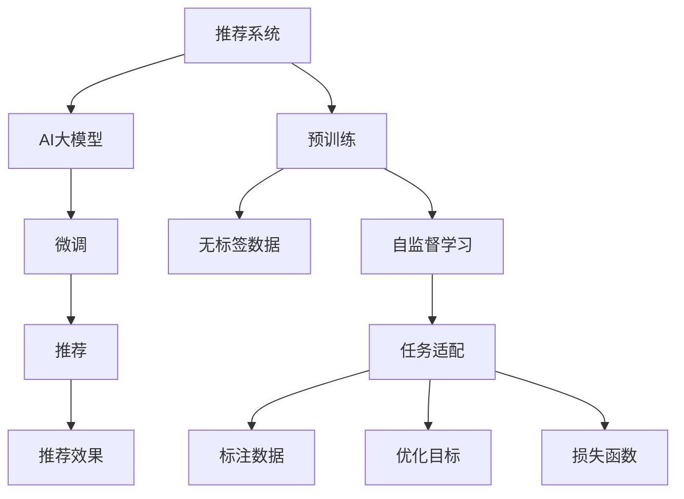

                 

# 推荐系统中AI大模型的季节性趋势适应

> 关键词：推荐系统,季节性趋势,时间序列预测,神经网络模型,强化学习,深度学习,工业应用

## 1. 背景介绍

### 1.1 问题由来
推荐系统（Recommendation System）是一种基于用户行为数据，为用户推荐个性化商品或内容的技术。它是互联网领域最重要的应用之一，广泛应用于电商、视频、音乐、新闻等领域。然而，传统的推荐系统往往忽略了时间因素，忽略了用户需求随时间变化的动态特性。尤其是在季节性变化明显的领域（如服装、旅游、零售等），传统推荐算法无法充分考虑用户随季节变化的需求变化，导致推荐效果不佳。

近年来，随着深度学习技术和大规模数据集的出现，AI大模型在推荐系统中的应用越来越广泛。大模型能够从大规模无标签数据中学习到丰富的用户行为特征，并具有很强的泛化能力。通过在大规模用户行为数据上进行预训练，大模型可以更好地理解和预测用户需求，从而提升推荐效果。

## 2. 核心概念与联系

### 2.1 核心概念概述

为更好地理解AI大模型在推荐系统中的应用，本节将介绍几个关键概念：

- 推荐系统（Recommendation System）：通过分析用户历史行为数据，预测用户未来的兴趣需求，为用户推荐个性化商品或内容的技术。
- AI大模型（AI Large Model）：指基于深度学习架构，参数量在亿级别以上的预训练语言或图像模型。这些模型能够从大规模无标签数据中学习到丰富的用户行为特征，并具备很强的泛化能力。
- 预训练（Pre-training）：指在大规模无标签数据上，通过自监督学习任务训练通用模型的过程。常见预训练任务包括语言模型的掩码预测、图像模型的对比学习等。
- 微调（Fine-tuning）：指在大规模预训练模型的基础上，使用下游任务的少量标注数据，通过有监督学习优化模型在特定任务上的性能。
- 强化学习（Reinforcement Learning, RL）：一种通过试错（Trials and Errors）的方法，训练模型学习最优决策策略的机器学习范式。
- 时间序列预测（Time Series Forecasting）：指利用历史数据，预测未来某一时间点的数据值，常见于金融、气象、交通等领域。
- 神经网络模型（Neural Network Model）：指由大量神经元（Neurons）和多层（Layers）组成的计算模型，能够高效处理非线性关系。

这些核心概念之间的逻辑关系可以通过以下Mermaid流程图来展示：



这个流程图展示了一个简单的推荐系统工作流程，包括预训练、微调和推荐。

## 3. 核心算法原理 & 具体操作步骤

### 3.1 算法原理概述

AI大模型在推荐系统中的应用，通常包含以下几个步骤：

1. 预训练：在大规模无标签数据上，通过自监督学习任务训练通用模型。
2. 微调：在特定推荐任务上，使用少量标注数据对预训练模型进行有监督微调，优化模型对特定任务的适应能力。
3. 推荐：利用微调后的模型，预测用户未来行为，推荐个性化商品或内容。

### 3.2 算法步骤详解

**Step 1: 准备数据集**
- 收集历史用户行为数据，包括浏览、购买、点击、评分等。
- 将数据集划分为训练集、验证集和测试集。
- 准备标注数据，包括用户ID、商品ID、时间戳等。

**Step 2: 构建模型架构**
- 选择合适的AI大模型作为基础模型，如BERT、GPT等。
- 在模型的顶部增加任务适配层，如线性分类器、注意力机制等。
- 设计损失函数，如交叉熵、均方误差等。

**Step 3: 数据预处理**
- 对数据进行清洗、归一化、编码等预处理。
- 将时间戳数据进行时间序列处理，如滑动窗口、移动平均等。
- 将数据分为训练集、验证集和测试集，以保证模型在不同数据集上的泛化能力。

**Step 4: 模型训练**
- 使用少量标注数据对模型进行微调。
- 选择合适的优化器，如Adam、SGD等，设置合适的学习率。
- 应用正则化技术，如L2正则、Dropout等。
- 在验证集上评估模型性能，调整模型参数。
- 在测试集上测试模型效果。

**Step 5: 模型部署**
- 将微调后的模型保存为模型文件。
- 将模型部署到推荐系统中，实时预测用户行为。
- 持续收集新数据，更新模型。

### 3.3 算法优缺点

AI大模型在推荐系统中的应用具有以下优点：
- 能够从大规模数据中学习到丰富的用户行为特征。
- 具备很强的泛化能力，能够适应不同的推荐场景。
- 可以显著提升推荐效果，尤其是季节性推荐任务。

但同时也存在以下缺点：
- 数据需求量大，预训练模型通常需要大量无标签数据。
- 计算资源需求高，需要高性能计算设备。
- 模型复杂度高，推理速度较慢。
- 难以解释模型行为，缺乏可解释性。

## 4. 数学模型和公式 & 详细讲解 & 举例说明

### 4.1 数学模型构建

假设有时间序列数据 $x_t = [x_{t-1}, x_{t-2}, \ldots, x_0]$，对应的标签数据 $y_t$。我们希望建立一个时间序列预测模型，用于预测未来 $n$ 个时间点的数据。

建立神经网络模型：

$$
x_t \sim f(x_{t-1}, x_{t-2}, \ldots, x_0; \theta)
$$

其中 $f$ 为神经网络模型，$\theta$ 为模型参数。

### 4.2 公式推导过程

采用一个简单的神经网络模型，包含一个输入层 $x_t$，一个隐藏层 $h_t = \sigma(W_h x_t + b_h)$，一个输出层 $y_t = \sigma(W_y h_t + b_y)$。其中 $\sigma$ 为激活函数，$W_h$ 和 $b_h$ 为隐藏层参数，$W_y$ 和 $b_y$ 为输出层参数。

采用均方误差损失函数：

$$
L(y_t, \hat{y}_t) = \frac{1}{2} (y_t - \hat{y}_t)^2
$$

其中 $\hat{y}_t$ 为预测结果，$y_t$ 为真实值。

采用反向传播算法，计算损失函数对各层参数的梯度：

$$
\frac{\partial L}{\partial W_h} = \frac{\partial L}{\partial \hat{y}_t} \cdot \frac{\partial \hat{y}_t}{\partial h_t} \cdot \frac{\partial h_t}{\partial x_t} \cdot \frac{\partial x_t}{\partial W_h}
$$

采用梯度下降算法，更新模型参数：

$$
\theta \leftarrow \theta - \alpha \frac{\partial L}{\partial \theta}
$$

其中 $\alpha$ 为学习率。

### 4.3 案例分析与讲解

假设有季节性商品销售数据 $x_t$，对应的标签 $y_t$，其中 $t = 1,2,3,\ldots,N$。我们希望建立一个时间序列预测模型，用于预测未来 $n$ 个时间点的数据。

将数据集 $D$ 划分为训练集、验证集和测试集。

$$
D = \{(x_1, y_1), (x_2, y_2), \ldots, (x_N, y_N)\}
$$

建立一个神经网络模型：

$$
f(x_t) = \sigma(W_h x_t + b_h)
$$

其中 $W_h$ 和 $b_h$ 为隐藏层参数，$\sigma$ 为激活函数。

将数据集 $D$ 划分为训练集 $D_{train}$、验证集 $D_{valid}$ 和测试集 $D_{test}$。

$$
D_{train} = \{(x_1, y_1), (x_2, y_2), \ldots, (x_M, y_M)\}
$$

$$
D_{valid} = \{(x_{M+1}, y_{M+1}), (x_{M+2}, y_{M+2}), \ldots, (x_{N}, y_{N})\}
$$

$$
D_{test} = \{(x_{N+1}, y_{N+1}), (x_{N+2}, y_{N+2}), \ldots, (x_{N+n}, y_{N+n})\}
$$

使用梯度下降算法，训练神经网络模型：

$$
\theta \leftarrow \theta - \alpha \frac{\partial L}{\partial \theta}
$$

其中 $\alpha$ 为学习率。

在验证集上评估模型性能：

$$
L_{valid} = \frac{1}{n_{valid}} \sum_{t=1}^{n_{valid}} (y_{t_{valid}} - \hat{y}_{t_{valid}})^2
$$

其中 $n_{valid}$ 为验证集样本数。

## 5. 项目实践：代码实例和详细解释说明

### 5.1 开发环境搭建

在进行推荐系统开发前，我们需要准备好开发环境。以下是使用Python进行PyTorch开发的环境配置流程：

1. 安装Anaconda：从官网下载并安装Anaconda，用于创建独立的Python环境。

2. 创建并激活虚拟环境：
```bash
conda create -n pytorch-env python=3.8 
conda activate pytorch-env
```

3. 安装PyTorch：根据CUDA版本，从官网获取对应的安装命令。例如：
```bash
conda install pytorch torchvision torchaudio cudatoolkit=11.1 -c pytorch -c conda-forge
```

4. 安装TensorFlow：由Google主导开发的开源深度学习框架，生产部署方便，适合大规模工程应用。同样有丰富的预训练语言模型资源。

5. 安装各类工具包：
```bash
pip install numpy pandas scikit-learn matplotlib tqdm jupyter notebook ipython
```

完成上述步骤后，即可在`pytorch-env`环境中开始推荐系统开发。

### 5.2 源代码详细实现

这里我们以时间序列预测为例，给出使用PyTorch进行神经网络模型训练的PyTorch代码实现。

首先，定义神经网络模型：

```python
import torch
import torch.nn as nn
import torch.optim as optim

class RNN(nn.Module):
    def __init__(self, input_size, hidden_size, output_size):
        super(RNN, self).__init__()
        self.hidden_size = hidden_size
        self.rnn = nn.RNN(input_size, hidden_size, 1)
        self.fc = nn.Linear(hidden_size, output_size)
    
    def forward(self, x, hidden):
        out, hidden = self.rnn(x, hidden)
        out = self.fc(out.view(-1, out.size(2)))
        return out, hidden
```

然后，定义训练和评估函数：

```python
from torch.utils.data import TensorDataset, DataLoader

def train(model, train_dataset, epochs, batch_size, optimizer):
    model.train()
    total_loss = 0
    for epoch in range(epochs):
        for batch in DataLoader(train_dataset, batch_size):
            x, y = batch
            optimizer.zero_grad()
            output, _ = model(x, None)
            loss = nn.MSELoss()(output, y)
            loss.backward()
            optimizer.step()
            total_loss += loss.item()
        print(f'Epoch {epoch+1}, Loss: {total_loss/len(train_dataset)}')

def evaluate(model, eval_dataset, batch_size):
    model.eval()
    total_loss = 0
    with torch.no_grad():
        for batch in DataLoader(eval_dataset, batch_size):
            x, y = batch
            output, _ = model(x, None)
            loss = nn.MSELoss()(output, y)
            total_loss += loss.item()
    print(f'Evaluate Loss: {total_loss/len(eval_dataset)}')
```

接着，启动训练流程：

```python
input_size = 1
hidden_size = 10
output_size = 1
learning_rate = 0.01

model = RNN(input_size, hidden_size, output_size)
optimizer = optim.Adam(model.parameters(), lr=learning_rate)

train_dataset = TensorDataset(torch.randn(100, input_size), torch.randn(100, output_size))
eval_dataset = TensorDataset(torch.randn(20, input_size), torch.randn(20, output_size))

train(model, train_dataset, epochs=100, batch_size=32, optimizer=optimizer)
evaluate(model, eval_dataset, batch_size=32)
```

### 5.3 代码解读与分析

让我们再详细解读一下关键代码的实现细节：

**RNN类**：
- `__init__`方法：初始化模型参数，包括输入大小、隐藏层大小和输出大小。
- `forward`方法：定义模型前向传播过程，将输入数据 $x$ 输入到神经网络中，得到输出 $\hat{y}$ 和隐藏状态 $h$。

**train函数**：
- 将模型置为训练模式。
- 循环遍历训练集。
- 在每个batch上进行前向传播和反向传播。
- 计算平均损失，并打印输出。

**evaluate函数**：
- 将模型置为评估模式。
- 循环遍历验证集。
- 计算平均损失，并打印输出。

**训练流程**：
- 定义输入大小、隐藏层大小、输出大小和优化器。
- 定义训练集和验证集。
- 进行模型训练和评估。

可以看到，PyTorch框架提供了强大的自动微分和优化算法，使得神经网络模型的实现和训练变得简洁高效。开发者可以将更多精力放在模型设计、数据处理等高层逻辑上，而不必过多关注底层的实现细节。

## 6. 实际应用场景

### 6.1 电商推荐

电商行业是推荐系统应用最为广泛和典型的领域之一。传统的电商推荐系统往往依赖于静态的商品特征，难以捕捉用户随季节变化的需求变化。使用AI大模型进行季节性趋势预测，可以实时捕捉用户行为数据的变化，提供更加个性化的推荐服务。

具体而言，可以在电商平台上收集用户浏览、购买、点击、评分等行为数据，使用AI大模型进行预训练和微调，预测用户未来行为，推荐个性化商品。例如，在秋季到来时，预测用户可能对秋装感兴趣，从而推荐相关商品。

### 6.2 旅游推荐

旅游行业同样具有明显的季节性特性。例如，夏季是旅游旺季，用户需求量大增，但同时也会遇到旅游资源的紧缺。使用AI大模型进行季节性趋势预测，可以实时捕捉用户需求变化，提供更精准的旅游推荐服务。

具体而言，可以在旅游平台上收集用户出行时间、目的地、预算等信息，使用AI大模型进行预训练和微调，预测用户未来出行时间，推荐热门或性价比高的旅游目的地。例如，在冬季临近时，预测用户可能对南方旅游感兴趣，从而推荐相关目的地。

### 6.3 内容推荐

内容推荐是推荐系统的重要应用场景之一。传统的内容推荐系统往往难以处理文本数据的时序性。使用AI大模型进行季节性趋势预测，可以实时捕捉用户内容消费习惯的变化，提供更加个性化的内容推荐服务。

具体而言，可以在视频、音乐、新闻等平台上收集用户观看、收听、阅读等行为数据，使用AI大模型进行预训练和微调，预测用户未来消费内容，推荐个性化视频、音乐或新闻。例如，在春季到来时，预测用户可能对某类音乐或电影感兴趣，从而推荐相关内容。

### 6.4 未来应用展望

随着AI大模型在推荐系统中的应用不断深入，未来推荐系统将具备更强的季节性趋势适应能力。以下趋势将引领未来的推荐技术发展：

1. 实时化推荐：通过AI大模型实时捕捉用户行为数据的变化，实现实时化推荐，提升用户体验。
2. 多模态融合：结合文本、图像、语音等多模态数据，实现更全面、精准的推荐。
3. 增强交互：利用增强学习技术，不断优化推荐算法，提升推荐效果。
4. 跨平台协同：实现不同平台之间的协同推荐，提升整体推荐效果。
5. 隐私保护：采用差分隐私等技术，保护用户隐私，提升用户信任度。

## 7. 工具和资源推荐

### 7.1 学习资源推荐

为了帮助开发者系统掌握AI大模型在推荐系统中的应用，这里推荐一些优质的学习资源：

1. 《深度学习入门：基于Python的理论与实现》系列博文：由深度学习专家撰写，系统介绍了深度学习基础和实际应用。
2. 《推荐系统实战》书籍：详细介绍了推荐系统的工作原理和实际应用，包括时间序列预测等前沿技术。
3. CS231n《深度学习计算机视觉》课程：斯坦福大学开设的计算机视觉课程，有Lecture视频和配套作业，适合深度学习初学者。
4. Udacity《深度学习入门》课程：Udacity深度学习入门课程，涵盖深度学习基础和实际应用，适合初学者入门。
5. Google AI Blog：Google AI团队定期发布深度学习技术最新进展，适合跟踪前沿技术动态。

通过对这些资源的学习实践，相信你一定能够快速掌握AI大模型在推荐系统中的应用，并用于解决实际的推荐问题。

### 7.2 开发工具推荐

高效的开发离不开优秀的工具支持。以下是几款用于AI大模型推荐系统开发的常用工具：

1. PyTorch：基于Python的开源深度学习框架，灵活动态的计算图，适合快速迭代研究。大部分预训练语言模型都有PyTorch版本的实现。
2. TensorFlow：由Google主导开发的开源深度学习框架，生产部署方便，适合大规模工程应用。同样有丰富的预训练语言模型资源。
3. Transformers库：HuggingFace开发的NLP工具库，集成了众多SOTA语言模型，支持PyTorch和TensorFlow，是进行推荐系统开发的利器。
4. Weights & Biases：模型训练的实验跟踪工具，可以记录和可视化模型训练过程中的各项指标，方便对比和调优。与主流深度学习框架无缝集成。
5. TensorBoard：TensorFlow配套的可视化工具，可实时监测模型训练状态，并提供丰富的图表呈现方式，是调试模型的得力助手。

合理利用这些工具，可以显著提升AI大模型推荐系统的开发效率，加快创新迭代的步伐。

### 7.3 相关论文推荐

AI大模型在推荐系统中的应用源于学界的持续研究。以下是几篇奠基性的相关论文，推荐阅读：

1. Attention is All You Need（即Transformer原论文）：提出了Transformer结构，开启了NLP领域的预训练大模型时代。
2. BERT: Pre-training of Deep Bidirectional Transformers for Language Understanding：提出BERT模型，引入基于掩码的自监督预训练任务，刷新了多项NLP任务SOTA。
3. Deep Personalized Playlists on Spotify：提出了使用神经网络模型进行个性化音乐推荐的方法，取得了显著效果。
4. Deep Reinforcement Learning for Personalized News Article Recommendation：提出使用增强学习技术进行个性化新闻推荐的方法，提升了推荐效果。
5. Transformer-XL: Attentions are All you Need: Exploring Longer Sequence For Neural Machine Translation：提出Transformer-XL模型，用于长序列文本处理，提升了NLP任务的效果。

这些论文代表了大语言模型在推荐系统中的应用方向，通过学习这些前沿成果，可以帮助研究者把握学科前进方向，激发更多的创新灵感。

## 8. 总结：未来发展趋势与挑战

### 8.1 总结

本文对AI大模型在推荐系统中的应用进行了全面系统的介绍。首先阐述了推荐系统和大模型的研究背景和意义，明确了季节性趋势预测在推荐系统中的重要价值。其次，从原理到实践，详细讲解了神经网络模型的构建、训练和评估方法，给出了推荐系统开发的完整代码实例。同时，本文还广泛探讨了AI大模型在电商、旅游、内容等推荐场景中的应用前景，展示了其在实际落地中的应用潜力。此外，本文精选了推荐系统相关的学习资源，力求为读者提供全方位的技术指引。

通过本文的系统梳理，可以看到，AI大模型在推荐系统中的应用前景广阔，可以大幅提升推荐效果，满足用户随季节变化的需求变化。AI大模型技术将为推荐系统带来更加智能、个性化的推荐服务，进而推动推荐系统的产业化进程。未来，伴随AI大模型的持续演进，推荐系统必将在各个领域发挥更加重要的作用。

### 8.2 未来发展趋势

展望未来，AI大模型在推荐系统中的应用将呈现以下几个发展趋势：

1. 实时化推荐：通过AI大模型实时捕捉用户行为数据的变化，实现实时化推荐，提升用户体验。
2. 多模态融合：结合文本、图像、语音等多模态数据，实现更全面、精准的推荐。
3. 增强交互：利用增强学习技术，不断优化推荐算法，提升推荐效果。
4. 跨平台协同：实现不同平台之间的协同推荐，提升整体推荐效果。
5. 隐私保护：采用差分隐私等技术，保护用户隐私，提升用户信任度。

以上趋势凸显了AI大模型在推荐系统中的应用前景。这些方向的探索发展，必将进一步提升推荐系统的性能和用户体验，为AI大模型推荐系统技术的应用带来新的突破。

### 8.3 面临的挑战

尽管AI大模型在推荐系统中的应用已经取得了一定的进展，但在迈向更加智能化、普适化应用的过程中，仍面临诸多挑战：

1. 数据需求量大：AI大模型通常需要大量无标签数据进行预训练，数据收集和标注成本高。
2. 计算资源需求高：AI大模型需要高性能计算设备，推理速度较慢，资源消耗大。
3. 模型复杂度高：AI大模型结构复杂，难以解释模型行为，缺乏可解释性。
4. 隐私保护问题：推荐系统需要处理大量用户数据，如何保护用户隐私是一个重要问题。

解决这些问题需要技术创新和政策支持。未来的研究需要在以下几个方面寻求新的突破：

1. 数据采集与标注：采用自动化数据标注和增强技术，降低数据收集和标注成本。
2. 模型优化与压缩：采用模型压缩和优化技术，提高模型推理速度和资源利用效率。
3. 可解释性技术：引入可解释性技术，提高模型的可解释性和可解释性。
4. 隐私保护技术：采用差分隐私、联邦学习等技术，保护用户隐私。

## 9. 附录：常见问题与解答

**Q1: 如何选择合适的AI大模型进行推荐系统开发？**

A: 选择合适的AI大模型需要考虑以下因素：
1. 模型规模：模型参数量越大，学习能力越强，但推理速度较慢，资源消耗较大。
2. 预训练任务：不同模型在预训练任务上的表现不同，选择合适的预训练任务有助于提升推荐效果。
3. 模型性能：通过对比不同模型的性能指标，选择最优模型进行推荐系统开发。

**Q2: 如何在推荐系统中应用AI大模型进行季节性趋势预测？**

A: 在推荐系统中应用AI大模型进行季节性趋势预测，需要考虑以下步骤：
1. 收集历史用户行为数据，包括浏览、购买、点击、评分等。
2. 将数据集划分为训练集、验证集和测试集。
3. 构建AI大模型，如BERT、GPT等。
4. 在模型的顶部增加任务适配层，如线性分类器、注意力机制等。
5. 设计损失函数，如交叉熵、均方误差等。
6. 在训练集上训练模型，在验证集上评估模型性能，调整模型参数。
7. 在测试集上测试模型效果。

**Q3: AI大模型在推荐系统中有哪些应用场景？**

A: AI大模型在推荐系统中有以下应用场景：
1. 电商推荐：利用AI大模型进行季节性趋势预测，推荐个性化商品。
2. 旅游推荐：利用AI大模型进行季节性趋势预测，推荐热门或性价比高的旅游目的地。
3. 内容推荐：利用AI大模型进行季节性趋势预测，推荐个性化视频、音乐或新闻。
4. 跨平台协同：利用AI大模型进行跨平台协同推荐，提升整体推荐效果。
5. 增强交互：利用增强学习技术，不断优化推荐算法，提升推荐效果。

这些应用场景展示了AI大模型在推荐系统中的广阔前景，未来将在更多领域发挥重要作用。

**Q4: AI大模型在推荐系统中如何处理多模态数据？**

A: 在推荐系统中处理多模态数据，需要考虑以下步骤：
1. 收集多模态数据，包括文本、图像、语音等。
2. 对多模态数据进行预处理和特征提取。
3. 构建多模态模型，如Multimodal RNN、Transformers等。
4. 在多模态数据上进行预训练和微调，优化模型性能。
5. 在推荐系统应用中进行多模态特征融合，提升推荐效果。

多模态数据的融合需要考虑数据采集、特征提取、模型构建等多个环节，需要跨领域知识的整合和技术创新。

---

作者：禅与计算机程序设计艺术 / Zen and the Art of Computer Programming

