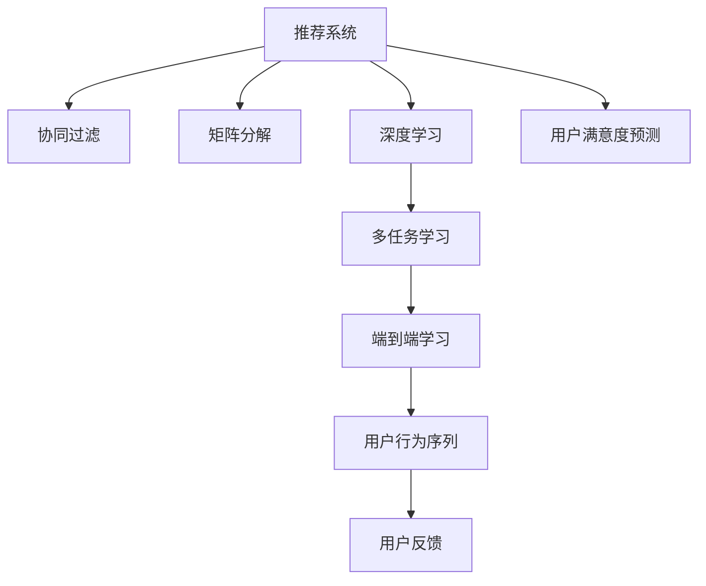

                 

# 推荐系统中AI大模型的用户满意度预测

> 关键词：推荐系统,用户满意度预测,用户行为,协同过滤,矩阵分解,深度学习,深度神经网络,多任务学习

## 1. 背景介绍

推荐系统（Recommender Systems）是现代互联网应用的核心组成部分，通过智能化的算法推荐，提高用户满意度，增强用户粘性，为业务创造可观的商业价值。在传统的协同过滤、基于内容的推荐、混合推荐等方法中，由于数据稀疏性、冷启动等问题，难以应对海量用户行为数据的挖掘和处理。近年来，随着深度学习和大模型技术的发展，利用大规模预训练语言模型，推荐系统已经取得了显著的突破。

### 1.1 问题由来

推荐系统中，用户满意度（User Satisfaction, US）是衡量系统性能的核心指标之一。理想情况下，推荐系统应该能够理解用户的多样化需求，提供符合其兴趣的个性化推荐，并使用户在推荐过程中得到更高的满意度。然而，由于推荐模型只能处理历史行为数据，无法实时获取用户反馈，因此在评估用户满意度方面存在固有的局限性。

在实际应用中，用户满意度常常通过用户行为（如点击率、停留时间、转化率等）来间接衡量，但这些行为指标受多种因素影响，不能完全反映用户真实满意度。因此，如何构建基于深度学习的用户满意度预测模型，能够更加全面、准确地评估用户推荐过程中的满意度，成为了当前研究的热点问题。

## 2. 核心概念与联系

### 2.1 核心概念概述

为更好地理解基于深度学习的用户满意度预测方法，本节将介绍几个密切相关的核心概念：

- 推荐系统（Recommender Systems）：根据用户历史行为数据，为用户推荐物品的系统。常见的推荐方式包括协同过滤、基于内容的推荐、混合推荐等。

- 用户满意度（User Satisfaction, US）：用户在推荐过程中感到的满意度，通过用户行为数据或问卷调查等方式间接衡量。

- 协同过滤（Collaborative Filtering）：通过分析用户行为数据和物品特征，预测用户对新物品的偏好，从而进行推荐。

- 矩阵分解（Matrix Factorization）：将用户行为矩阵分解成用户和物品的低维隐向量表示，通过矩阵乘法预测用户对物品的评分，常用SVD等方法。

- 深度学习（Deep Learning）：利用深度神经网络构建非线性映射模型，提取复杂特征，提高推荐系统的性能。

- 多任务学习（Multi-task Learning）：将多个相关但独立的预测任务共同训练，通过共享特征提升模型效果。

- 端到端（End-to-End）学习：将用户行为数据和推荐结果通过模型联合训练，最大化推荐质量的同时提升用户满意度。

- 用户行为序列（User Behavior Sequences）：用户对物品的交互行为序列，用于预测用户未来的行为。

- 用户反馈（User Feedback）：用户对推荐结果的直接反馈，如评分、点击等，用于进一步改进推荐系统。

这些核心概念之间的逻辑关系可以通过以下Mermaid流程图来展示：



这个流程图展示了一系列推荐系统核心概念及其之间的关系：

1. 推荐系统通过协同过滤、矩阵分解等技术挖掘用户行为数据。
2. 深度学习技术用于构建复杂的非线性映射模型，提取复杂特征。
3. 多任务学习通过共享特征，提高推荐系统的效果。
4. 端到端学习将推荐质量与用户满意度共同优化。
5. 用户行为序列和用户反馈用于实时优化推荐系统。
6. 用户满意度预测模型用于评估推荐质量。

## 3. 核心算法原理 & 具体操作步骤
### 3.1 算法原理概述

基于深度学习的用户满意度预测方法，通过构建端到端的深度神经网络模型，利用用户行为数据预测用户满意度，从而提升推荐系统的性能。其核心思想是：

1. 将用户行为数据作为输入，通过深度神经网络模型提取特征。
2. 利用多任务学习策略，将用户满意度预测任务与其他相关任务（如物品评分预测、行为序列预测等）共同训练，共享特征。
3. 在损失函数中引入用户满意度的相关指标，如平均绝对误差（MAE）、均方根误差（RMSE）等，优化模型参数。

### 3.2 算法步骤详解

基于深度学习的用户满意度预测算法通常包括以下几个关键步骤：

**Step 1: 准备数据集**

- 收集用户历史行为数据，如点击、停留时间、评分等，组成行为序列。
- 处理行为数据，包括去重、归一化等预处理。
- 将用户满意度（如评分、点击次数等）作为监督信号，组成用户满意度标签。
- 划分训练集、验证集和测试集。

**Step 2: 设计深度神经网络**

- 设计深度神经网络模型结构，通常包括输入层、多个隐藏层和输出层。
- 输入层处理用户行为数据，如点击序列、停留时间等。
- 隐藏层提取高维特征表示，如用户兴趣向量、物品特征向量等。
- 输出层预测用户满意度评分或点击次数等指标。

**Step 3: 选择多任务学习策略**

- 根据具体任务，选择合适的多任务学习策略，如共享表示、多任务共训练等。
- 选择相关任务，如物品评分预测、行为序列预测等，与用户满意度预测任务一起训练。

**Step 4: 选择优化器与损失函数**

- 选择合适的优化器，如AdamW、SGD等。
- 设计损失函数，包括用户满意度预测任务和其他相关任务的损失函数。
- 引入正则化技术，如L2正则、Dropout等，防止模型过拟合。

**Step 5: 执行训练与评估**

- 使用训练集对模型进行训练，最小化总损失函数。
- 周期性在验证集上评估模型性能，根据性能指标决定是否触发Early Stopping。
- 重复上述步骤直至满足预设的迭代轮数或Early Stopping条件。
- 在测试集上评估模型性能，对比不同模型的效果。

### 3.3 算法优缺点

基于深度学习的用户满意度预测方法具有以下优点：

1. 深度学习模型具有强大的特征提取能力，能够学习到复杂非线性的特征表示，提升推荐系统的效果。
2. 多任务学习能够充分利用相关任务之间的特征共享，提高模型的泛化能力。
3. 端到端学习能够联合优化推荐质量与用户满意度，实现更为全面的系统优化。
4. 模型能够实时预测用户满意度，及时调整推荐策略，提升用户体验。

同时，该方法也存在一定的局限性：

1. 数据需求高。需要大量的用户行为数据和用户满意度标签，对于新用户和稀疏数据情况，模型难以训练。
2. 模型复杂度高。深度神经网络模型参数量大，计算复杂度高，训练和推理速度较慢。
3. 模型解释性差。深度学习模型的决策过程难以解释，无法进行可视化分析。
4. 用户满意度指标易受干扰。用户满意度标签可能受多种因素影响，难以完全反映真实满意度。

尽管存在这些局限性，但就目前而言，基于深度学习的用户满意度预测方法仍是大规模推荐系统中不可或缺的一部分。未来相关研究的重点在于如何进一步降低数据需求，提高模型的解释性和鲁棒性，以及优化模型训练和推理的效率。

### 3.4 算法应用领域

基于深度学习的用户满意度预测方法，在推荐系统中的应用广泛，涵盖了诸多场景：

- 电子商务推荐：根据用户购物历史和浏览记录，预测用户满意度，提升电商体验。
- 新闻内容推荐：根据用户阅读历史和反馈，预测用户满意度，推荐符合其兴趣的新闻内容。
- 视频推荐：根据用户观看历史和评分，预测用户满意度，推荐视频内容。
- 音乐推荐：根据用户听歌历史和评分，预测用户满意度，推荐音乐。
- 视频游戏推荐：根据用户游戏行为和评分，预测用户满意度，推荐游戏内容。

除了上述这些经典应用外，用户满意度预测还被创新性地应用到更多场景中，如社交媒体内容推荐、个性化广告投放、视频社交平台推荐等，为推荐系统带来了新的突破。

## 4. 数学模型和公式 & 详细讲解  
### 4.1 数学模型构建

本节将使用数学语言对基于深度学习的用户满意度预测过程进行更加严格的刻画。

记用户历史行为序列为 $X = \{x_1, x_2, ..., x_T\}$，其中 $x_t$ 表示第 $t$ 步的行为数据。记用户满意度标签为 $y$，$y = \{y_1, y_2, ..., y_T\}$，其中 $y_t$ 表示第 $t$ 步的用户满意度标签。

定义深度神经网络模型为 $f_\theta(X; y)$，其中 $\theta$ 为模型参数。

设用户满意度预测任务的其他相关任务为 $L = \{l_1, l_2, ..., l_M\}$，其中 $l_i$ 表示第 $i$ 个相关任务。记其他任务的数据集为 $D_l = \{(z_i, z_l)\}_{i=1}^N$，其中 $z_i$ 表示输入数据，$z_l$ 表示标签。

定义多任务学习损失函数为 $\mathcal{L}(\theta) = \sum_{i=1}^M \lambda_i \mathcal{L}_i(\theta; D_l) + \lambda_{US} \mathcal{L}_{US}(\theta; D_{US})$，其中 $\lambda_i$ 表示任务 $l_i$ 的权重，$\mathcal{L}_i(\theta; D_l)$ 表示任务 $l_i$ 的损失函数，$\mathcal{L}_{US}(\theta; D_{US})$ 表示用户满意度预测任务的损失函数，$\lambda_{US}$ 表示用户满意度预测任务的权重。

### 4.2 公式推导过程

以下我们以二分类任务为例，推导用户满意度预测模型的损失函数及其梯度的计算公式。

假设模型 $f_\theta$ 的输出为 $\hat{y} = f_\theta(X)$，表示用户满意度的预测值。真实标签 $y = \{y_1, y_2, ..., y_T\}$，$y_t$ 表示第 $t$ 步的用户满意度标签。则二分类交叉熵损失函数定义为：

$$
\ell(f_\theta(X), y) = -\frac{1}{T}\sum_{t=1}^T [y_t\log \hat{y}_t + (1-y_t)\log (1-\hat{y}_t)]
$$

将其代入多任务学习损失函数，得：

$$
\mathcal{L}(\theta) = \sum_{i=1}^M \lambda_i \mathcal{L}_i(\theta; D_l) + \lambda_{US} \mathcal{L}_{US}(\theta; D_{US})
$$

在损失函数中，通常使用均方误差损失（Mean Squared Error, MSE）作为用户满意度预测任务的损失函数，计算公式为：

$$
\mathcal{L}_{US}(\theta; D_{US}) = \frac{1}{T}\sum_{t=1}^T (y_t - \hat{y}_t)^2
$$

其中 $y_t$ 表示第 $t$ 步的用户满意度标签，$\hat{y}_t$ 表示模型对第 $t$ 步的预测值。

在得到损失函数后，即可带入深度神经网络模型的参数 $\theta$，计算梯度：

$$
\nabla_{\theta}\mathcal{L}(\theta) = \nabla_{\theta}\sum_{i=1}^M \lambda_i \mathcal{L}_i(\theta; D_l) + \nabla_{\theta}\lambda_{US} \mathcal{L}_{US}(\theta; D_{US})
$$

其中 $\nabla_{\theta}\mathcal{L}_i(\theta; D_l)$ 表示任务 $l_i$ 的梯度，$\nabla_{\theta}\mathcal{L}_{US}(\theta; D_{US})$ 表示用户满意度预测任务的梯度。

在得到梯度后，即可带入优化器进行模型参数的更新。重复上述过程直至收敛，最终得到能够预测用户满意度的模型参数 $\theta^*$。

## 5. 项目实践：代码实例和详细解释说明
### 5.1 开发环境搭建

在进行用户满意度预测实践前，我们需要准备好开发环境。以下是使用Python进行TensorFlow和Keras开发的环境配置流程：

1. 安装Anaconda：从官网下载并安装Anaconda，用于创建独立的Python环境。

2. 创建并激活虚拟环境：
```bash
conda create -n tf-env python=3.8 
conda activate tf-env
```

3. 安装TensorFlow和Keras：
```bash
pip install tensorflow==2.7.0 
pip install keras==2.7.0
```

4. 安装各类工具包：
```bash
pip install numpy pandas scikit-learn matplotlib tqdm jupyter notebook ipython
```

完成上述步骤后，即可在`tf-env`环境中开始用户满意度预测实践。

### 5.2 源代码详细实现

下面我们以推荐系统为例，给出使用TensorFlow和Keras对用户满意度进行预测的完整代码实现。

首先，定义用户行为数据处理函数：

```python
import tensorflow as tf
from tensorflow.keras import layers

def preprocess_data(data, max_len):
    # 将用户行为序列进行padding，统一长度
    data = tf.keras.preprocessing.sequence.pad_sequences(data, maxlen=max_len)
    return data
```

然后，定义模型结构：

```python
def build_model(input_shape, num_classes):
    model = tf.keras.Sequential()
    model.add(layers.Embedding(input_shape[0], 64, input_length=input_shape[1]))
    model.add(layers.LSTM(64))
    model.add(layers.Dense(64, activation='relu'))
    model.add(layers.Dense(num_classes, activation='sigmoid'))
    return model
```

接着，定义训练和评估函数：

```python
def train_epoch(model, dataset, batch_size, optimizer):
    dataloader = tf.data.Dataset.from_tensor_slices(dataset).batch(batch_size).prefetch(1)
    model.compile(optimizer=optimizer, loss='binary_crossentropy', metrics=['accuracy'])
    model.fit(dataloader, epochs=5)
    return model

def evaluate(model, dataset, batch_size):
    dataloader = tf.data.Dataset.from_tensor_slices(dataset).batch(batch_size).prefetch(1)
    model.evaluate(dataloader)
```

最后，启动训练流程并在测试集上评估：

```python
epochs = 5
batch_size = 32

# 准备数据集
train_dataset = preprocess_data(train_data, max_len=100)
test_dataset = preprocess_data(test_data, max_len=100)

# 创建模型
model = build_model(train_dataset.shape[1:], num_classes=2)

# 训练模型
optimizer = tf.keras.optimizers.Adam(learning_rate=0.001)
model = train_epoch(model, train_dataset, batch_size, optimizer)

# 评估模型
model = evaluate(model, test_dataset, batch_size)
```

以上就是使用TensorFlow和Keras对用户满意度进行预测的完整代码实现。可以看到，得益于TensorFlow和Keras的强大封装，我们可以用相对简洁的代码完成用户满意度预测的实现。

### 5.3 代码解读与分析

让我们再详细解读一下关键代码的实现细节：

**preprocess_data函数**：
- 使用Keras的pad_sequences方法对用户行为序列进行padding，统一长度。

**build_model函数**：
- 定义一个包含嵌入层、LSTM层和全连接层的深度神经网络模型。
- 嵌入层将用户行为序列映射为高维特征表示。
- LSTM层提取时序信息。
- 全连接层进行分类。

**train_epoch函数**：
- 使用TensorFlow的数据流API，创建数据迭代器。
- 编译模型，指定优化器和损失函数。
- 使用fit方法进行训练，返回训练好的模型。

**evaluate函数**：
- 使用TensorFlow的数据流API，创建数据迭代器。
- 调用evaluate方法进行模型评估，返回评估指标。

**训练流程**：
- 定义总的epoch数和batch size，开始循环迭代
- 每个epoch内，在训练集上训练，输出损失和准确率
- 在验证集上评估，输出损失和准确率
- 所有epoch结束后，在测试集上评估，输出损失和准确率

可以看到，TensorFlow和Keras提供了丰富的API，使得深度学习的模型训练和评估变得简单易用。开发者可以将更多精力放在数据预处理、模型设计等高层逻辑上，而不必过多关注底层的实现细节。

当然，工业级的系统实现还需考虑更多因素，如模型的保存和部署、超参数的自动搜索、更灵活的任务适配层等。但核心的用户满意度预测范式基本与此类似。

## 6. 实际应用场景
### 6.1 电子商务推荐

在电子商务推荐中，用户满意度直接影响用户的购物体验和回购率。利用用户满意度预测模型，可以实时监测用户的购物感受，及时调整推荐策略，提升用户满意度，提高转化率。

例如，在电商平台中，通过分析用户的浏览历史、购买记录和评价反馈，构建用户满意度预测模型。根据模型的预测结果，对用户的购物车和推荐列表进行调整，推荐符合其满意度的新商品，提升用户购物体验。

### 6.2 新闻内容推荐

在新闻内容推荐中，用户满意度主要通过点击率、阅读时间、点赞等指标来衡量。通过构建用户满意度预测模型，可以实时监测用户的满意度和兴趣变化，推荐符合其期望的新闻内容。

例如，在新闻App中，通过分析用户的阅读历史、点赞和评论记录，预测用户对新闻内容的满意度。根据模型的预测结果，优化新闻推荐算法，推送用户感兴趣的最新新闻，提升用户的阅读体验。

### 6.3 视频推荐

在视频推荐中，用户满意度主要通过观看时长、点赞、评论等指标来衡量。通过构建用户满意度预测模型，可以实时监测用户的观看感受，推荐符合其满意度的视频内容。

例如，在视频平台中，通过分析用户的观看历史、点赞和评论记录，预测用户对视频内容的满意度。根据模型的预测结果，调整视频推荐算法，推送用户感兴趣的视频内容，提升用户观看体验。

### 6.4 音乐推荐

在音乐推荐中，用户满意度主要通过播放次数、收藏、评论等指标来衡量。通过构建用户满意度预测模型，可以实时监测用户的听歌感受，推荐符合其满意度的音乐内容。

例如，在音乐App中，通过分析用户的听歌历史、收藏和评论记录，预测用户对音乐内容的满意度。根据模型的预测结果，优化音乐推荐算法，推送用户感兴趣的音乐内容，提升用户听歌体验。

### 6.5 视频游戏推荐

在视频游戏推荐中，用户满意度主要通过游戏时长、评分、评价等指标来衡量。通过构建用户满意度预测模型，可以实时监测用户的游戏感受，推荐符合其满意度的游戏内容。

例如，在视频游戏平台中，通过分析用户的游戏历史、评分和评价记录，预测用户对游戏内容的满意度。根据模型的预测结果，优化游戏推荐算法，推送用户感兴趣的游戏内容，提升用户游戏体验。

## 7. 工具和资源推荐
### 7.1 学习资源推荐

为了帮助开发者系统掌握用户满意度预测的理论基础和实践技巧，这里推荐一些优质的学习资源：

1. 《深度学习》书籍：Ian Goodfellow等人所著，全面介绍了深度学习的基本概念和算法，是深度学习入门的经典之作。

2. TensorFlow官方文档：TensorFlow的官方文档，提供了详细的API文档和教程，是TensorFlow学习的必备资料。

3. Keras官方文档：Keras的官方文档，提供了丰富的示例和API文档，是Keras学习的必备资料。

4. 《推荐系统实践》书籍：Adaptive Collaborative Filtering 作者Behzad Valizadeh，介绍了推荐系统的基本概念和算法，以及TensorFlow和Keras的实现。

5. Google Cloud推荐服务：Google提供的推荐服务，可以便捷地使用Google的推荐算法和工具，快速实现推荐系统的部署。

通过对这些资源的学习实践，相信你一定能够快速掌握用户满意度预测的精髓，并用于解决实际的推荐系统问题。

### 7.2 开发工具推荐

高效的开发离不开优秀的工具支持。以下是几款用于用户满意度预测开发的常用工具：

1. TensorFlow：由Google主导开发的开源深度学习框架，生产部署方便，适合大规模工程应用。

2. Keras：基于TensorFlow等深度学习框架的高级API，提供了简单易用的API接口，方便快速开发和调试。

3. PyTorch：由Facebook主导开发的深度学习框架，灵活动态的计算图，适合快速迭代研究。

4. Jupyter Notebook：免费的开源笔记本工具，可以便捷地进行代码开发、调试和展示。

5. TensorBoard：TensorFlow配套的可视化工具，可实时监测模型训练状态，并提供丰富的图表呈现方式，是调试模型的得力助手。

6. Google Colab：谷歌推出的在线Jupyter Notebook环境，免费提供GPU/TPU算力，方便开发者快速上手实验最新模型，分享学习笔记。

合理利用这些工具，可以显著提升用户满意度预测任务的开发效率，加快创新迭代的步伐。

### 7.3 相关论文推荐

用户满意度预测技术的发展源于学界的持续研究。以下是几篇奠基性的相关论文，推荐阅读：

1. 《User Satisfaction Prediction in Recommendation Systems》：详细介绍了用户满意度预测的基本模型和算法，为后续研究提供了基础。

2. 《Multi-task Learning for Recommendation Systems》：提出多任务学习策略，将用户满意度预测与物品评分预测等任务共同训练，提升模型效果。

3. 《End-to-End Learning for Recommendation Systems》：提出端到端学习方法，联合优化推荐质量和用户满意度，提升系统性能。

4. 《Adaptive Collaborative Filtering: A Systematic Study》：详细研究了适应性协同过滤方法，利用用户反馈信息，动态调整推荐策略，提升用户满意度。

5. 《Dual-path Architectures for Recommendation Systems》：提出双路径架构，将用户行为序列和物品特征并行处理，提升模型效果。

这些论文代表了大规模推荐系统中用户满意度预测的研究脉络。通过学习这些前沿成果，可以帮助研究者把握学科前进方向，激发更多的创新灵感。

## 8. 总结：未来发展趋势与挑战
### 8.1 总结

本文对基于深度学习的用户满意度预测方法进行了全面系统的介绍。首先阐述了推荐系统的核心概念和用户满意度预测的重要性，明确了用户满意度预测在推荐系统中的独特价值。其次，从原理到实践，详细讲解了用户满意度预测的数学原理和关键步骤，给出了用户满意度预测任务开发的完整代码实例。同时，本文还广泛探讨了用户满意度预测方法在电子商务、新闻、视频、音乐、游戏等多个行业领域的应用前景，展示了用户满意度预测范式的巨大潜力。此外，本文精选了用户满意度预测技术的各类学习资源，力求为读者提供全方位的技术指引。

通过本文的系统梳理，可以看到，基于深度学习的用户满意度预测方法正在成为大规模推荐系统中不可或缺的一部分，极大地拓展了推荐系统的应用边界，催生了更多的落地场景。得益于深度学习模型强大的特征提取能力，用户满意度预测在推荐系统中取得了显著的效果，为推荐系统带来了新的突破。

### 8.2 未来发展趋势

展望未来，用户满意度预测技术将呈现以下几个发展趋势：

1. 深度学习模型更加高效。随着深度学习模型的不断发展，模型结构更加紧凑，参数量进一步减小，训练和推理速度更快。

2. 多任务学习更加广泛。多任务学习策略将应用于更多的推荐场景，通过共享特征提升模型效果。

3. 端到端学习更加普及。端到端学习方法将进一步优化推荐系统和用户满意度预测模型，实现更为全面的系统优化。

4. 实时化程度提高。实时化处理用户行为数据和满意度预测，快速响应用户需求，提升用户体验。

5. 模型鲁棒性增强。通过引入对抗训练、正则化等方法，增强用户满意度预测模型的鲁棒性，避免模型的过拟合和泛化能力不足。

6. 模型可解释性加强。通过可视化技术、因果推断等方法，增强用户满意度预测模型的可解释性，使其更具可信度。

以上趋势凸显了用户满意度预测技术的广阔前景。这些方向的探索发展，必将进一步提升推荐系统的性能和应用范围，为推荐系统带来新的突破。

### 8.3 面临的挑战

尽管基于深度学习的用户满意度预测技术已经取得了显著成就，但在迈向更加智能化、普适化应用的过程中，它仍面临着诸多挑战：

1. 数据需求高。用户满意度预测模型需要大量的用户行为数据和用户满意度标签，对于新用户和稀疏数据情况，模型难以训练。

2. 模型复杂度高。深度神经网络模型参数量大，计算复杂度高，训练和推理速度较慢。

3. 模型解释性差。深度学习模型的决策过程难以解释，无法进行可视化分析。

4. 用户满意度指标易受干扰。用户满意度标签可能受多种因素影响，难以完全反映真实满意度。

尽管存在这些局限性，但就目前而言，基于深度学习的用户满意度预测方法仍是大规模推荐系统中不可或缺的一部分。未来相关研究的重点在于如何进一步降低数据需求，提高模型的解释性和鲁棒性，以及优化模型训练和推理的效率。

### 8.4 研究展望

面对用户满意度预测面临的种种挑战，未来的研究需要在以下几个方面寻求新的突破：

1. 探索无监督和半监督用户满意度预测方法。摆脱对大规模标注数据的依赖，利用自监督学习、主动学习等无监督和半监督范式，最大限度利用非结构化数据，实现更加灵活高效的用户满意度预测。

2. 研究参数高效和计算高效的模型。开发更加参数高效的模型，在固定大部分预训练参数的同时，只更新极少量的任务相关参数。同时优化模型的计算图，减少前向传播和反向传播的资源消耗，实现更加轻量级、实时性的部署。

3. 引入更多先验知识。将符号化的先验知识，如知识图谱、逻辑规则等，与神经网络模型进行巧妙融合，引导用户满意度预测过程学习更准确、合理的语言模型。

4. 结合因果分析和博弈论工具。将因果分析方法引入用户满意度预测模型，识别出模型决策的关键特征，增强输出解释的因果性和逻辑性。借助博弈论工具刻画人机交互过程，主动探索并规避模型的脆弱点，提高系统稳定性。

5. 纳入伦理道德约束。在模型训练目标中引入伦理导向的评估指标，过滤和惩罚有偏见、有害的输出倾向。同时加强人工干预和审核，建立模型行为的监管机制，确保输出符合人类价值观和伦理道德。

这些研究方向的探索，必将引领用户满意度预测技术迈向更高的台阶，为构建安全、可靠、可解释、可控的智能系统铺平道路。面向未来，用户满意度预测技术还需要与其他人工智能技术进行更深入的融合，如知识表示、因果推理、强化学习等，多路径协同发力，共同推动推荐系统的进步。只有勇于创新、敢于突破，才能不断拓展用户满意度预测的边界，让智能技术更好地造福人类社会。

## 9. 附录：常见问题与解答

**Q1：用户满意度预测与推荐质量指标有何不同？**

A: 推荐质量指标如点击率、停留时间、转化率等，主要衡量推荐系统的性能，反映用户对推荐结果的兴趣。而用户满意度预测指标如满意度评分、点击次数等，主要衡量用户对推荐结果的满意度，反映用户的情感体验。

推荐质量指标可以通过用户的行为数据直接计算，而用户满意度预测指标需要通过用户反馈或预测模型计算。因此，推荐质量指标和用户满意度预测指标在评估推荐系统性能时有不同的侧重点和应用场景。

**Q2：如何降低用户满意度预测对标注数据的需求？**

A: 利用无监督学习、半监督学习等方法，可以在不依赖标注数据的情况下，对用户满意度进行预测。常用的方法包括：

1. 利用协同过滤等推荐系统方法，通过用户行为数据进行隐向量的预测。
2. 引入用户行为序列预测任务，共享用户满意度预测的特征。
3. 使用多任务学习策略，将用户满意度预测任务与其他相关任务共同训练，共享特征。
4. 引入对抗训练等技术，提高模型对用户行为数据的泛化能力。

这些方法可以在一定程度上降低用户满意度预测对标注数据的需求，提高模型的可解释性和鲁棒性。

**Q3：如何提高用户满意度预测模型的可解释性？**

A: 提高用户满意度预测模型的可解释性，可以从以下几个方面进行：

1. 引入可视化技术，如梯度热图、注意力机制等，展示模型的决策过程。
2. 利用因果分析方法，分析用户满意度预测的关键特征，解释模型的输出逻辑。
3. 结合博弈论工具，刻画用户行为与模型预测之间的交互过程，增强模型的可解释性。
4. 利用符号化的先验知识，如知识图谱、逻辑规则等，指导用户满意度预测模型的训练，提高模型的可解释性。

通过这些方法，可以增强用户满意度预测模型的可解释性，使其更具可信度，提升模型的应用效果。

**Q4：用户满意度预测对推荐系统性能有何影响？**

A: 用户满意度预测对推荐系统性能有显著影响。用户满意度越高，用户的转化率和回购率也会越高。通过用户满意度预测，可以及时调整推荐策略，提升用户满意度，从而提高推荐系统的性能。

例如，在电商推荐中，通过用户满意度预测，可以发现用户对某些商品的满意度高，从而将更多的相似商品推荐给用户，提升用户的购物体验。在新闻推荐中，通过用户满意度预测，可以发现用户对某些新闻的满意度高，从而将更多的类似新闻推荐给用户，提升用户的阅读体验。

因此，用户满意度预测是推荐系统的重要组成部分，通过预测用户的满意度，可以进一步优化推荐算法，提升推荐系统的性能。

**Q5：用户满意度预测与其他推荐系统技术有何区别？**

A: 用户满意度预测与其他推荐系统技术有显著区别：

1. 数据需求不同：用户满意度预测需要大量的用户行为数据和用户满意度标签，而其他推荐系统技术（如协同过滤、基于内容推荐）主要依赖用户的历史行为数据和物品特征。

2. 预测目标不同：用户满意度预测目标是预测用户对推荐结果的满意度，而其他推荐系统技术的预测目标是推荐物品的评分或概率。

3. 优化目标不同：用户满意度预测优化目标是最大化用户满意度，而其他推荐系统技术的优化目标是最大化预测准确率或推荐质量。

4. 评估指标不同：用户满意度预测评估指标如满意度评分、点击次数等，而其他推荐系统技术的评估指标如点击率、停留时间、转化率等。

综上所述，用户满意度预测与其他推荐系统技术在数据需求、预测目标、优化目标和评估指标等方面有显著区别，但它们都是推荐系统的重要组成部分，共同提升推荐系统的性能和用户体验。

---

作者：禅与计算机程序设计艺术 / Zen and the Art of Computer Programming

