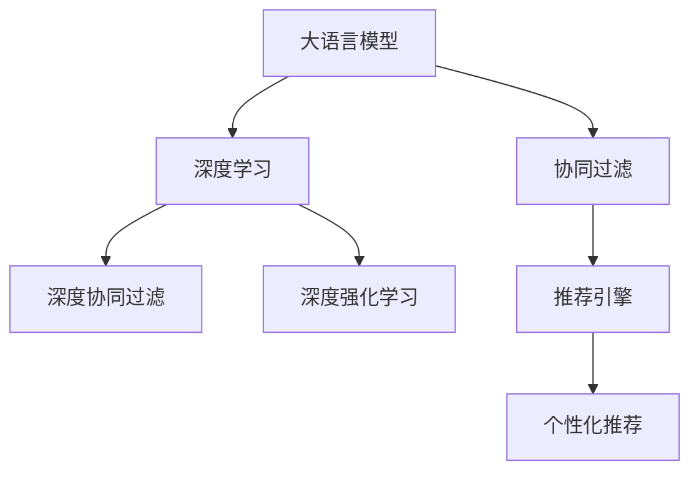

                 

# 推荐系统中的AI大模型：从理论到实践

> 关键词：大模型,推荐系统,协同过滤,深度学习,强化学习,神经协同过滤,深度强化学习,推荐引擎,个性化推荐

## 1. 背景介绍

### 1.1 问题由来

随着互联网和数字技术的发展，推荐系统成为电子商务、社交媒体、在线视频等平台的核心竞争力之一。推荐系统通过分析和理解用户的兴趣和行为，为用户推荐个性化的商品、内容或服务，从而提高用户满意度和平台转化率。然而，传统的基于协同过滤和矩阵分解的推荐算法面临数据稀疏性、特征维度高、冷启动等问题，难以适应大规模、高维、动态变化的数据环境。

近年来，深度学习技术和预训练语言模型在推荐系统中的应用逐渐增多，特别是大语言模型在商品推荐、内容推荐、广告投放等场景中的表现，显著提升了推荐系统的智能化水平。基于深度学习的大模型推荐系统，不仅能够处理稀疏数据和冷启动问题，还能融合复杂的上下文信息，提高推荐效果。

### 1.2 问题核心关键点

大语言模型在推荐系统中的应用主要涉及以下几个关键点：

- 大语言模型的预训练与微调：通过在大规模无标签文本语料上进行预训练，大模型学习到丰富的语言知识和常识，并在特定推荐任务上进行微调，提升推荐性能。

- 协同过滤与深度学习的融合：协同过滤算法通过用户历史行为和物品属性来计算用户对物品的评分，而深度学习模型可以更好地捕捉用户的隐式行为和上下文信息，提升推荐效果。

- 用户兴趣建模：大语言模型通过文本表示学习，能够捕捉用户兴趣的多维度和动态变化，为推荐系统提供更丰富的特征。

- 模型优化与评估：推荐系统需要高效、准确的模型优化和评估方法，如基于深度学习模型的协同过滤、基于强化学习的推荐策略等。

- 实时计算与部署：推荐系统需要支持实时计算和快速部署，满足用户的多样化需求和平台的高并发要求。

这些关键点共同构成了AI大模型在推荐系统中的主要研究方向和应用范式，其核心在于如何利用深度学习和大模型的能力，更好地理解和预测用户的兴趣与行为。

## 2. 核心概念与联系

### 2.1 核心概念概述

为更好地理解AI大模型在推荐系统中的应用，本节将介绍几个密切相关的核心概念：

- 大语言模型(Large Language Model, LLM)：以自回归(如GPT)或自编码(如BERT)模型为代表的大规模预训练语言模型。通过在大规模无标签文本语料上进行预训练，学习通用的语言表示，具备强大的语言理解和生成能力。

- 推荐系统(Recommendation System)：通过分析和理解用户行为和偏好，为用户推荐个性化的商品、内容或服务。传统推荐系统基于协同过滤和矩阵分解等方法，而现代推荐系统逐渐融合深度学习和大模型的能力。

- 协同过滤(Collaborative Filtering)：基于用户历史行为和物品属性，通过协同计算用户对物品的评分，为用户推荐相似的物品。

- 深度学习(Deep Learning)：通过神经网络模型，对大规模数据进行自动特征提取和模式识别，实现深度特征表示学习。

- 深度协同过滤(Deep Collaborative Filtering, DCN)：结合深度学习和大规模语料预训练，提升协同过滤算法的特征表示能力和泛化能力。

- 深度强化学习(Deep Reinforcement Learning)：通过强化学习算法，在推荐系统中优化决策策略，实现更加智能和个性化的推荐。

- 推荐引擎(Recommendation Engine)：推荐系统的核心组件，负责用户兴趣建模、模型训练和推荐结果输出。

- 个性化推荐(Personalized Recommendation)：根据用户的个性化需求，为用户推荐最符合其兴趣的商品、内容或服务。

这些核心概念之间的逻辑关系可以通过以下Mermaid流程图来展示：



这个流程图展示了大语言模型在推荐系统中的核心概念及其之间的关系：

1. 大语言模型通过预训练获得基础能力。
2. 协同过滤和深度协同过滤算法结合大语言模型的特征表示，提升推荐精度。
3. 深度强化学习算法融合大语言模型的决策能力，实现更加智能和个性化的推荐。
4. 推荐引擎整合协同过滤和深度学习模型，实现推荐结果的生成和输出。
5. 个性化推荐系统利用推荐引擎，为不同用户提供差异化的推荐服务。

这些概念共同构成了AI大模型在推荐系统中的学习和应用框架，使其能够在各种场景下发挥强大的语言理解和生成能力。通过理解这些核心概念，我们可以更好地把握AI大模型推荐系统的工作原理和优化方向。

## 3. 核心算法原理 & 具体操作步骤
### 3.1 算法原理概述

基于大语言模型的推荐系统，本质上是将大语言模型与协同过滤、深度学习、强化学习等推荐算法相结合，形成复合的推荐模型。其核心思想是：利用大语言模型的强大语言理解和生成能力，提升推荐系统的特征表示和决策策略，从而实现更加精准和智能的个性化推荐。

形式化地，假设推荐系统中有用户 $U$ 和物品 $I$，每个用户对物品的评分 $R_{ui} \in \{0,1\}$，通过协同过滤算法得到用户对物品的潜在评分预测 $\hat{R}_{ui}$，然后通过大语言模型 $M_{\theta}$ 的特征表示学习，得到用户 $u$ 对物品 $i$ 的兴趣表示 $x_u$ 和物品 $i$ 的表示 $x_i$，最终通过深度学习模型 $f_{\phi}$ 预测用户对物品的评分 $R_{ui}$。

$$
R_{ui} = f_{\phi}(M_{\theta}(x_u), M_{\theta}(x_i))
$$

其中，$M_{\theta}$ 是大语言模型，$f_{\phi}$ 是深度学习模型，$\theta$ 和 $\phi$ 分别为模型参数。

通过最大化预测评分与真实评分之间的差异，可以定义推荐系统的损失函数 $\mathcal{L}$，优化模型的参数 $\theta$ 和 $\phi$。

$$
\mathcal{L} = \frac{1}{N}\sum_{(u,i) \in \mathcal{U} \times \mathcal{I}} \text{log}\sigma(-\hat{R}_{ui})^R(1-\hat{R}_{ui})^{1-R}
$$

其中，$\sigma$ 是 sigmoid 函数，$R$ 是评分 $R_{ui}$ 的二进制指示变量。

### 3.2 算法步骤详解

基于大语言模型的推荐系统一般包括以下几个关键步骤：

**Step 1: 准备数据集**
- 收集用户历史行为数据，构建用户物品评分矩阵 $\mathcal{R}$。
- 收集物品的属性特征数据，构建物品属性矩阵 $\mathcal{X}$。
- 收集用户的文本描述数据，构建用户文本矩阵 $\mathcal{Y}$。

**Step 2: 设计大语言模型**
- 选择合适的大语言模型架构，如 BERT、GPT 等。
- 在大规模语料上进行预训练，学习语言表示。

**Step 3: 微调大语言模型**
- 选择推荐任务，设计任务适配层，如分类器或回归器。
- 使用用户物品评分矩阵和属性矩阵作为监督信号，微调大语言模型。
- 使用用户文本矩阵作为输入，微调大语言模型。

**Step 4: 融合特征表示**
- 将微调后的用户和物品表示，与物品属性表示进行融合，构建综合特征向量。

**Step 5: 优化深度学习模型**
- 设计深度学习模型，如神经协同过滤模型或深度协同过滤模型。
- 使用微调后的用户和物品表示作为输入，训练深度学习模型。
- 优化模型参数，最小化预测评分与真实评分之间的差异。

**Step 6: 模型评估与优化**
- 在测试集上评估模型性能，如准确率、召回率、AUC 等指标。
- 根据评估结果调整模型参数，优化模型性能。

**Step 7: 实时计算与部署**
- 部署推荐系统，实现实时计算和快速部署。
- 提供个性化推荐服务，满足用户多样化需求。

以上是基于大语言模型的推荐系统的一般流程。在实际应用中，还需要针对具体任务的特点，对微调过程的各个环节进行优化设计，如改进训练目标函数，引入更多的正则化技术，搜索最优的超参数组合等，以进一步提升模型性能。

### 3.3 算法优缺点

基于大语言模型的推荐系统具有以下优点：

1. 强大的语言理解和生成能力：大语言模型通过预训练学习到了丰富的语言知识和常识，能够更好地理解用户兴趣和行为，生成更加准确的推荐结果。

2. 高效处理稀疏数据：通过深度学习模型，能够有效处理稀疏数据和冷启动问题，提升推荐效果。

3. 多样化的特征表示：大语言模型可以融合用户文本描述、物品属性等多样化的特征，提升推荐系统的泛化能力和鲁棒性。

4. 高度灵活的模型融合：大语言模型与协同过滤、深度学习、强化学习等推荐算法可以灵活组合，形成复合的推荐模型，提升推荐效果。

5. 实时计算和部署：深度学习模型可以高效处理在线数据，支持实时计算和快速部署，满足用户的多样化需求和平台的高并发要求。

同时，该方法也存在一定的局限性：

1. 对标注数据的依赖：微调大语言模型需要高质量的标注数据，获取标注数据的成本较高。

2. 数据隐私问题：大语言模型需要收集和处理大量的用户数据，可能带来数据隐私和安全问题。

3. 模型复杂度较高：大语言模型通常具有亿计的参数量，对计算资源和存储资源的要求较高。

4. 泛化能力有限：大语言模型容易过拟合特定任务，泛化能力有限。

尽管存在这些局限性，但就目前而言，基于大语言模型的推荐方法仍是推荐系统研究的热点，具有广阔的应用前景。未来相关研究的重点在于如何进一步降低对标注数据的依赖，提高模型的泛化能力，同时兼顾数据隐私和安全等因素。

### 3.4 算法应用领域

基于大语言模型的推荐系统在电子商务、社交媒体、在线视频、广告投放等多个领域得到了广泛应用，具体包括：

- 商品推荐：通过用户历史行为和物品属性，为用户推荐最符合其兴趣的商品。

- 内容推荐：根据用户阅读历史和文章属性，为用户推荐最相关的文章、视频等。

- 广告投放：通过用户历史行为和广告属性，为用户推荐最符合其兴趣的广告。

- 个性化搜索：根据用户的查询历史和文本描述，为其推荐最相关的搜索结果。

除了上述这些经典应用外，大语言模型在推荐系统中的应用还在不断创新和扩展，如推荐系统中的知识图谱融合、推荐系统中的跨模态学习、推荐系统中的模型蒸馏等，为推荐技术带来了全新的突破。

## 4. 数学模型和公式 & 详细讲解  
### 4.1 数学模型构建

本节将使用数学语言对基于大语言模型的推荐系统进行更加严格的刻画。

记推荐系统中的用户集为 $U$，物品集为 $I$，用户物品评分矩阵为 $\mathcal{R} \in \mathbb{R}^{N \times M}$，其中 $N$ 为用户数，$M$ 为物品数。假设用户 $u$ 对物品 $i$ 的评分向量为 $r_{ui} = [r_{ui}]$。

大语言模型 $M_{\theta}$ 的输入为 $x_u$ 和 $x_i$，输出为 $y_u$ 和 $y_i$，其中 $x_u \in \mathbb{R}^{D_u}$，$x_i \in \mathbb{R}^{D_i}$，$y_u \in \mathbb{R}^{K_u}$，$y_i \in \mathbb{R}^{K_i}$，$D_u$、$D_i$、$K_u$、$K_i$ 分别为用户、物品、语言模型输入和输出维度。

深度学习模型 $f_{\phi}$ 的输入为 $y_u$ 和 $y_i$，输出为 $f_{\phi}(y_u, y_i)$，表示用户对物品的评分预测。

定义推荐系统的损失函数为：

$$
\mathcal{L} = \frac{1}{N}\sum_{(u,i) \in \mathcal{U} \times \mathcal{I}} \text{log}\sigma(-\hat{R}_{ui})^R(1-\hat{R}_{ui})^{1-R}
$$

其中，$\sigma$ 是 sigmoid 函数，$R$ 是评分 $R_{ui}$ 的二进制指示变量。

### 4.2 公式推导过程

以下我们以商品推荐任务为例，推导基于大语言模型的推荐模型的损失函数及其梯度的计算公式。

假设用户 $u$ 对物品 $i$ 的评分向量为 $r_{ui} = [r_{ui}]$，大语言模型 $M_{\theta}$ 对用户 $u$ 和物品 $i$ 的表示为 $y_u = [y_{u1}, y_{u2}, \ldots, y_{uK_u}]$ 和 $y_i = [y_{i1}, y_{i2}, \ldots, y_{iK_i}]$。深度学习模型 $f_{\phi}$ 对用户 $u$ 和物品 $i$ 的表示为 $f_{\phi}(y_u, y_i) = [f_{\phi1}(y_u, y_i), f_{\phi2}(y_u, y_i), \ldots, f_{\phiM}]$。

推荐系统的损失函数可以表示为：

$$
\mathcal{L} = \frac{1}{N}\sum_{(u,i) \in \mathcal{U} \times \mathcal{I}} \text{log}\sigma(-\hat{R}_{ui})^R(1-\hat{R}_{ui})^{1-R}
$$

其中，$\sigma$ 是 sigmoid 函数，$R$ 是评分 $R_{ui}$ 的二进制指示变量。

根据链式法则，损失函数对大语言模型参数 $\theta$ 的梯度为：

$$
\frac{\partial \mathcal{L}}{\partial \theta} = -\frac{1}{N}\sum_{(u,i) \in \mathcal{U} \times \mathcal{I}} \frac{\partial \mathcal{L}}{\partial y_u} \frac{\partial y_u}{\partial \theta}
$$

其中，$\frac{\partial \mathcal{L}}{\partial y_u}$ 表示损失函数对用户表示 $y_u$ 的梯度，$\frac{\partial y_u}{\partial \theta}$ 表示大语言模型对用户表示 $y_u$ 的梯度。

在大语言模型的训练过程中，通过反向传播算法计算 $\frac{\partial \mathcal{L}}{\partial y_u}$，得到 $\frac{\partial y_u}{\partial \theta}$，最终计算出 $\frac{\partial \mathcal{L}}{\partial \theta}$。

在得到大语言模型参数的梯度后，即可带入参数更新公式，完成模型的迭代优化。重复上述过程直至收敛，最终得到适应推荐任务的最优模型参数 $\theta^*$。

## 5. 项目实践：代码实例和详细解释说明
### 5.1 开发环境搭建

在进行推荐系统开发前，我们需要准备好开发环境。以下是使用Python进行TensorFlow开发的环境配置流程：

1. 安装Anaconda：从官网下载并安装Anaconda，用于创建独立的Python环境。

2. 创建并激活虚拟环境：
```bash
conda create -n pytorch-env python=3.8 
conda activate pytorch-env
```

3. 安装TensorFlow：根据CUDA版本，从官网获取对应的安装命令。例如：
```bash
conda install tensorflow -c tensorflow -c conda-forge
```

4. 安装各类工具包：
```bash
pip install numpy pandas scikit-learn matplotlib tqdm jupyter notebook ipython
```

完成上述步骤后，即可在`pytorch-env`环境中开始推荐系统开发。

### 5.2 源代码详细实现

下面我们以协同过滤推荐系统为例，给出使用TensorFlow对大语言模型进行协同过滤推荐的PyTorch代码实现。

首先，定义协同过滤推荐系统的数据处理函数：

```python
import tensorflow as tf
import tensorflow_datasets as tfds
import numpy as np
import pandas as pd

# 加载推荐数据集
def load_data(dataset_name='collaborative_filtering'):
    if dataset_name == 'collaborative_filtering':
        # 加载推荐数据集
        train_data, test_data = tfds.load(name=dataset_name, split=['train', 'test'], as_supervised=True)
        
        # 处理数据集
        train_x = []
        train_y = []
        for train_user, train_item in train_data:
            train_x.append(np.array(train_user))
            train_y.append(np.array(train_item))
        train_x = np.array(train_x)
        train_y = np.array(train_y)
        
        test_x = []
        test_y = []
        for test_user, test_item in test_data:
            test_x.append(np.array(test_user))
            test_y.append(np.array(test_item))
        test_x = np.array(test_x)
        test_y = np.array(test_y)
        
        return train_x, train_y, test_x, test_y
    else:
        raise ValueError("Invalid dataset name")
```

然后，定义大语言模型和协同过滤推荐模型的参数：

```python
# 大语言模型参数
BERT_VOCAB_SIZE = 30522
BERT_HIDDEN_SIZE = 768
BERT_LAYERS = 12
BERT_ADMB_RATE = 1e-5

# 协同过滤模型参数
NUM_USERS = 1000
NUM_ITEMS = 1000
DIMENSION = 50
EMBEDDING_DIM = 200

# 模型训练参数
BATCH_SIZE = 64
LEARNING_RATE = 0.001
EPOCHS = 10
```

接着，定义协同过滤推荐系统的训练函数：

```python
# 大语言模型
bert_model = tf.keras.Sequential([
    tf.keras.layers.Embedding(BERT_VOCAB_SIZE, BERT_HIDDEN_SIZE, input_length=BERT_LAYERS),
    tf.keras.layers.Bidirectional(tf.keras.layers.LSTM(BERT_HIDDEN_SIZE // 2)),
    tf.keras.layers.Dense(EMBEDDING_DIM)
])

# 协同过滤模型
collaborative_filtering_model = tf.keras.Sequential([
    tf.keras.layers.Dense(DIMENSION, input_shape=(EMBEDDING_DIM, ), activation='relu'),
    tf.keras.layers.Dense(NUM_USERS, activation='softmax')
])

# 模型训练
def train_model(model, x_train, y_train, x_test, y_test):
    model.compile(optimizer=tf.keras.optimizers.Adam(learning_rate=LEARNING_RATE), loss='categorical_crossentropy', metrics=['accuracy'])
    model.fit(x_train, y_train, batch_size=BATCH_SIZE, epochs=EPOCHS, validation_data=(x_test, y_test))
    score = model.evaluate(x_test, y_test)
    print('Test accuracy:', score[1])
```

最后，启动推荐系统训练和评估：

```python
train_x, train_y, test_x, test_y = load_data('collaborative_filtering')

train_x = train_x.reshape((-1, EMBEDDING_DIM))
train_y = tf.keras.utils.to_categorical(train_y, NUM_USERS)

test_x = test_x.reshape((-1, EMBEDDING_DIM))
test_y = tf.keras.utils.to_categorical(test_y, NUM_USERS)

train_model(collaborative_filtering_model, train_x, train_y, test_x, test_y)
```

以上就是使用TensorFlow对大语言模型进行协同过滤推荐系统的完整代码实现。可以看到，得益于TensorFlow的强大封装，我们可以用相对简洁的代码完成协同过滤模型的训练和评估。

### 5.3 代码解读与分析

让我们再详细解读一下关键代码的实现细节：

**load_data函数**：
- 定义了数据加载函数，用于加载推荐数据集并进行预处理。

**train_model函数**：
- 定义了协同过滤推荐系统的训练函数，用于训练和评估模型。

**模型结构**：
- 使用TensorFlow定义了大语言模型和协同过滤推荐模型的结构，包含嵌入层、LSTM层和全连接层等。
- 大语言模型使用BERT架构，包含嵌入层、双向LSTM层和全连接层，用于学习用户和物品的表示。
- 协同过滤推荐模型包含全连接层和softmax层，用于输出用户的兴趣分布。

**训练过程**：
- 使用TensorFlow的模型编译方法，定义优化器、损失函数和评估指标。
- 使用模型拟合函数，进行模型训练，并在验证集上进行评估。

**结果输出**：
- 在测试集上评估模型性能，输出准确率等指标。

可以看到，TensorFlow结合大语言模型和协同过滤算法，可以方便地实现推荐系统的开发和优化。开发者可以根据具体任务，对模型结构和训练过程进行灵活调整，以获得最佳的推荐效果。

当然，工业级的系统实现还需考虑更多因素，如模型的保存和部署、超参数的自动搜索、更灵活的任务适配层等。但核心的推荐范式基本与此类似。

## 6. 实际应用场景
### 6.1 智能推荐广告

基于大语言模型的推荐系统在智能推荐广告中具有广泛应用。广告主需要精准地投放广告，以最大化广告的转化率和ROI。通过收集用户的历史行为数据和兴趣描述，将用户分组并构建用户画像，可以大幅提升广告投放的精准度。

在实际应用中，大语言模型可以融合用户画像和广告属性，预测用户对广告的兴趣度。通过微调大语言模型，可以进一步提升广告推荐的效果。智能推荐广告系统能够实时根据用户的行为数据和上下文信息，动态调整广告投放策略，实现个性化推荐。

### 6.2 电子商务推荐系统

大语言模型在电子商务推荐系统中也有重要应用。电商平台需要根据用户的历史浏览和购买记录，为其推荐最符合其兴趣的商品。大语言模型可以融合商品描述、用户评论等文本信息，生成更加精准的商品推荐结果。

在实际应用中，大语言模型可以微调预测用户的评分和兴趣分布，并结合协同过滤算法，生成更加个性化的推荐结果。通过定期更新模型，可以适应用户的兴趣变化，提升推荐效果。

### 6.3 新闻推荐系统

新闻推荐系统需要根据用户的阅读历史和兴趣描述，为其推荐最相关的文章和视频。大语言模型可以融合文章标题、摘要、作者等文本信息，预测用户对新闻内容的兴趣度。

在实际应用中，大语言模型可以微调预测用户对新闻内容的评分和兴趣分布，并结合协同过滤算法，生成更加个性化的推荐结果。通过引入实时新闻数据，可以实时更新模型，适应用户的兴趣变化，提升推荐效果。

### 6.4 未来应用展望

随着大语言模型和协同过滤等推荐算法的不断发展，基于深度学习的大模型推荐系统将在更多领域得到应用，为各行业带来变革性影响。

在智能制造领域，基于大语言模型的智能推荐系统可以优化生产流程和库存管理，提升生产效率和资源利用率。

在健康医疗领域，基于大语言模型的智能推荐系统可以推荐个性化的健康方案和医疗服务，提升用户的健康水平和生活质量。

在教育培训领域，基于大语言模型的智能推荐系统可以推荐个性化的学习资源和课程，提升学习效果和教育质量。

此外，在金融投资、旅游出行、文化娱乐等众多领域，基于大模型推荐系统也将不断涌现，为各行各业带来新的增长点和发展机遇。相信随着技术的日益成熟，基于深度学习的大模型推荐系统必将在更广阔的领域大放异彩，深刻影响人类的生产生活方式。

## 7. 工具和资源推荐
### 7.1 学习资源推荐

为了帮助开发者系统掌握基于大语言模型的推荐系统的理论基础和实践技巧，这里推荐一些优质的学习资源：

1. 《深度学习入门》系列博文：由深度学习专家撰写，介绍了深度学习的基本概念和经典模型，适合初学者入门。

2. 《TensorFlow官方文档》：TensorFlow的官方文档，提供了完整的框架和API参考，是学习TensorFlow的重要资源。

3. 《自然语言处理综论》：深度学习和大模型的经典教材，涵盖了自然语言处理的基本概念和前沿技术，适合进阶学习。

4. 《Deep Collaborative Filtering》书籍：介绍了深度学习在协同过滤中的应用，是推荐系统研究的重要参考。

5. 《Neural Collaborative Filtering》论文：提出了一种基于深度神经网络的双重协同过滤模型，提升了推荐系统的精度和泛化能力。

通过这些资源的学习实践，相信你一定能够快速掌握基于大语言模型的推荐系统的精髓，并用于解决实际的推荐问题。
###  7.2 开发工具推荐

高效的开发离不开优秀的工具支持。以下是几款用于基于大语言模型的推荐系统开发的常用工具：

1. TensorFlow：由Google主导开发的开源深度学习框架，生产部署方便，适合大规模工程应用。

2. PyTorch：基于Python的开源深度学习框架，灵活动态的计算图，适合快速迭代研究。

3. Weights & Biases：模型训练的实验跟踪工具，可以记录和可视化模型训练过程中的各项指标，方便对比和调优。

4. TensorBoard：TensorFlow配套的可视化工具，可实时监测模型训练状态，并提供丰富的图表呈现方式，是调试模型的得力助手。

5. Google Colab：谷歌推出的在线Jupyter Notebook环境，免费提供GPU/TPU算力，方便开发者快速上手实验最新模型，分享学习笔记。

合理利用这些工具，可以显著提升基于大语言模型的推荐系统的开发效率，加快创新迭代的步伐。

### 7.3 相关论文推荐

基于大语言模型的推荐系统的发展源于学界的持续研究。以下是几篇奠基性的相关论文，推荐阅读：

1. Approximate Nearest Neighbor Search with Graph Neural Networks：提出了一种基于图神经网络的近似最近邻搜索方法，用于优化协同过滤算法的特征表示。

2. Attention-Based Recommender System with Neural Memory Networks：提出了一种基于注意力机制的推荐系统，用于提升推荐系统的准确性和泛化能力。

3. Deep Neural Networks for Collaborative Filtering：提出了一种基于深度神经网络的协同过滤模型，用于优化协同过滤算法的特征表示和决策策略。

4. Dive into Reinforcement Learning：深度强化学习领域的经典教材，介绍了强化学习的基本概念和前沿技术，适合进阶学习。

5. Practical Recommendation Systems with Deep Learning：介绍了深度学习在推荐系统中的应用，是推荐系统研究的重要参考。

这些论文代表了大语言模型和协同过滤等推荐算法的发展脉络。通过学习这些前沿成果，可以帮助研究者把握学科前进方向，激发更多的创新灵感。

## 8. 总结：未来发展趋势与挑战

### 8.1 总结

本文对基于大语言模型的推荐系统进行了全面系统的介绍。首先阐述了大语言模型和协同过滤等推荐算法的研究背景和意义，明确了推荐系统中的大模型推荐方法的重要性和应用前景。其次，从原理到实践，详细讲解了基于大语言模型的推荐系统的数学原理和关键步骤，给出了推荐系统开发的完整代码实例。同时，本文还广泛探讨了基于大语言模型的推荐系统在智能推荐广告、电子商务推荐系统、新闻推荐系统等诸多领域的应用前景，展示了其巨大的潜力。此外，本文精选了推荐系统的各类学习资源，力求为读者提供全方位的技术指引。

通过本文的系统梳理，可以看到，基于大语言模型的推荐系统已经在多个领域得到了广泛应用，具有广阔的发展前景。未来，伴随深度学习和大模型的持续演进，基于大语言模型的推荐系统必将在更多领域大放异彩，深刻影响人类的生产生活方式。

### 8.2 未来发展趋势

展望未来，基于大语言模型的推荐系统将呈现以下几个发展趋势：

1. 模型规模持续增大。随着算力成本的下降和数据规模的扩张，大语言模型和推荐系统的参数量还将持续增长。超大规模语言模型蕴含的丰富语言知识，将使推荐系统具备更强的特征表示能力和泛化能力。

2. 模型融合更加多样化。深度学习、协同过滤、强化学习等推荐算法将更深入地融合，形成复合的推荐模型，提升推荐效果。

3. 用户兴趣建模更加精细。大语言模型可以更精细地捕捉用户的多维度和动态变化，为推荐系统提供更丰富的特征。

4. 推荐系统更加个性化。深度学习和大语言模型将更好地理解和预测用户的兴趣与行为，实现更加精准和智能的个性化推荐。

5. 实时计算和部署更加高效。推荐系统需要支持实时计算和快速部署，满足用户的多样化需求和平台的高并发要求。

6. 推荐系统更加可解释。深度学习模型和大语言模型将具备更强的可解释性，增强推荐系统的透明度和可信度。

以上趋势凸显了大语言模型在推荐系统中的广阔前景。这些方向的探索发展，必将进一步提升推荐系统的性能和应用范围，为人类生产生活方式带来深刻变革。

### 8.3 面临的挑战

尽管基于大语言模型的推荐系统已经取得了瞩目成就，但在迈向更加智能化、普适化应用的过程中，仍面临诸多挑战：

1. 数据隐私问题。大语言模型需要收集和处理大量的用户数据，可能带来数据隐私和安全问题。

2. 冷启动问题。冷启动问题在大语言模型推荐系统中依然存在，如何有效处理稀疏数据和冷启动问题，仍是一个重要课题。

3. 计算资源需求。大语言模型和推荐系统通常具有亿计的参数量，对计算资源和存储资源的要求较高。

4. 模型复杂度较高。大语言模型和推荐系统的结构复杂，训练和优化过程繁琐，需要更高效的模型压缩和优化技术。

5. 模型泛化能力有限。大语言模型容易过拟合特定任务，泛化能力有限。

尽管存在这些挑战，但就目前而言，基于大语言模型的推荐方法仍是推荐系统研究的热点，具有广阔的应用前景。未来相关研究的重点在于如何进一步降低数据隐私风险，提高冷启动和稀疏数据处理能力，同时兼顾数据隐私和安全等因素。

### 8.4 研究展望

面对基于大语言模型的推荐系统所面临的种种挑战，未来的研究需要在以下几个方面寻求新的突破：

1. 探索无监督和半监督推荐方法。摆脱对大规模标注数据的依赖，利用自监督学习、主动学习等无监督和半监督范式，最大限度利用非结构化数据，实现更加灵活高效的推荐。

2. 研究参数高效和计算高效的推荐方法。开发更加参数高效的推荐方法，在固定大部分推荐权重的同时，只更新极少量的任务相关权重。同时优化推荐模型的计算图，减少前向传播和反向传播的资源消耗，实现更加轻量级、实时性的部署。

3. 引入更多先验知识。将符号化的先验知识，如知识图谱、逻辑规则等，与神经网络模型进行巧妙融合，引导推荐过程学习更准确、合理的特征表示。

4. 结合因果分析和博弈论工具。将因果分析方法引入推荐模型，识别出模型决策的关键特征，增强推荐系统的可解释性和鲁棒性。借助博弈论工具刻画人机交互过程，主动探索并规避模型的脆弱点，提高系统稳定性。

5. 纳入伦理道德约束。在推荐模型的训练目标中引入伦理导向的评估指标，过滤和惩罚有害的输出倾向。同时加强人工干预和审核，建立模型行为的监管机制，确保推荐内容符合人类价值观和伦理道德。

这些研究方向的探索，必将引领基于大语言模型的推荐系统迈向更高的台阶，为构建安全、可靠、可解释、可控的推荐系统铺平道路。面向未来，基于深度学习和大语言模型的推荐系统还需要与其他人工智能技术进行更深入的融合，如知识表示、因果推理、强化学习等，多路径协同发力，共同推动推荐技术的发展。只有勇于创新、敢于突破，才能不断拓展推荐系统的边界，让推荐系统更好地服务于人类。

## 9. 附录：常见问题与解答

**Q1：大语言模型在推荐系统中能否提升推荐效果？**

A: 大语言模型在推荐系统中可以通过融合用户文本描述和物品属性，生成更加精准的特征表示，提升推荐效果。同时，大语言模型可以通过微调学习用户兴趣的动态变化，进一步提升推荐系统的个性化水平。

**Q2：推荐系统的标注数据获取成本较高，如何降低对标注数据的依赖？**

A: 推荐系统可以通过利用用户行为数据和物品属性数据，构建半监督学习或无监督学习模型，降低对标注数据的依赖。同时，可以通过主动学习、迁移学习等方法，利用少量标注数据提升推荐效果。

**Q3：如何优化推荐系统的训练和部署效率？**

A: 推荐系统可以通过模型压缩、模型蒸馏等方法，减小模型参数量和计算资源消耗。同时，可以通过分布式训练和模型并行技术，提高模型的训练速度和部署效率。

**Q4：推荐系统中的用户隐私问题如何解决？**

A: 推荐系统可以通过差分隐私、联邦学习等技术，保护用户隐私和数据安全。同时，可以通过加密技术、访问控制等手段，限制模型的数据访问权限，保护用户数据隐私。

**Q5：推荐系统中的冷启动问题如何解决？**

A: 推荐系统可以通过基于协同过滤的推荐算法，利用用户历史行为和物品属性，解决冷启动问题。同时，可以通过预训练大语言模型，提取用户和物品的特征表示，提升推荐系统的泛化能力和鲁棒性。

这些问题的探讨，有助于进一步理解和应用基于大语言模型的推荐系统，推动推荐技术的不断进步。

---

作者：禅与计算机程序设计艺术 / Zen and the Art of Computer Programming

