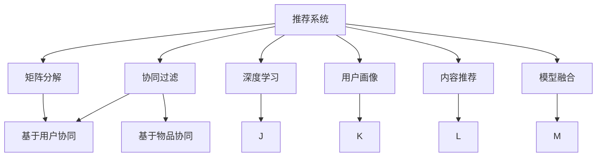

                 

# 推荐系统中的冷启动问题解决方案

> 关键词：推荐系统,冷启动问题,协同过滤,矩阵分解,深度学习,用户画像,内容推荐,模型融合

## 1. 背景介绍

在推荐系统的实际应用中，冷启动问题是一个困扰用户和开发者已久的挑战。冷启动问题主要指在新用户或新物品刚进入推荐系统时，由于缺乏历史行为数据，推荐算法无法生成有效的推荐结果。这一问题严重影响了用户体验和系统性能，制约了推荐系统的规模化和普及化。解决冷启动问题，成为推荐系统领域的核心研究内容之一。

推荐系统通过分析用户行为数据和物品属性数据，挖掘用户与物品之间的潜在关联关系，为不同用户推荐其感兴趣的新物品。具体来说，推荐系统主要由两部分组成：用户-物品交互数据（User-Item Interaction Data, UIID）和物品属性数据（Item Attributes Data, IAD）。UIID数据主要包括用户对物品的点击、浏览、购买等行为，通常以用户ID、物品ID和行为时间戳等元组形式存储。IAD数据主要包括物品的描述、属性、标签等，可用于描述物品的具体特性。

传统推荐系统主要基于协同过滤算法，包括基于用户协同的协同过滤和基于物品协同的协同过滤，通过构建用户兴趣模型或物品相似性矩阵，预测新物品的推荐效果。然而，协同过滤算法在冷启动问题上表现不佳，无法对新用户或新物品进行有效推荐。

为解决冷启动问题，研究者们提出了多种方法，如基于模型的推荐、基于混合算法的推荐、基于内容特征的推荐等。本文将重点介绍这些方法的核心原理和具体操作步骤，并通过数学模型和代码实例对推荐系统的冷启动问题解决方案进行详细讲解。

## 2. 核心概念与联系

### 2.1 核心概念概述

为更好地理解推荐系统中的冷启动问题，本节将介绍几个关键概念：

- 推荐系统(Recommender System)：通过用户行为数据和物品属性数据，预测用户对物品的偏好，提供个性化推荐。
- 冷启动问题(Cold Start Problem)：指新用户或新物品刚进入系统时，缺乏历史行为数据，推荐算法难以生成有效推荐。
- 协同过滤(Collaborative Filtering)：通过分析用户之间的协同行为，预测用户对新物品的偏好，实现个性化推荐。
- 矩阵分解(Matrix Factorization)：通过将用户-物品交互矩阵分解为低秩矩阵，学习用户和物品的低维表示，以捕捉用户对物品的隐式偏好。
- 深度学习(Deep Learning)：使用深度神经网络模型，通过大量数据自动学习用户和物品的隐式特征，实现高效推荐。
- 用户画像(User Profile)：根据用户历史行为数据，构建用户兴趣模型，为用户提供更精准的推荐。
- 内容推荐(Content-based Recommendation)：基于物品属性数据，推荐用户可能感兴趣的内容。
- 模型融合(Model Fusion)：通过组合多种推荐算法，实现优势互补，提高推荐系统性能。

这些概念之间的逻辑关系可以通过以下Mermaid流程图来展示：



这个流程图展示推荐的各个核心概念及其之间的关系：

1. 推荐系统通过用户行为数据和物品属性数据，实现个性化推荐。
2. 协同过滤算法是推荐系统的主流算法，分为基于用户协同和基于物品协同两种。
3. 矩阵分解和深度学习是协同过滤算法的核心技术，用于学习用户和物品的低维表示。
4. 用户画像和内容推荐是推荐系统的辅助手段，用于提升推荐效果。
5. 模型融合是推荐系统的高级策略，通过组合多种推荐算法，实现优势互补。

## 3. 核心算法原理 & 具体操作步骤

### 3.1 算法原理概述

推荐系统中的冷启动问题可以通过多种方法进行解决，主要包括以下几种：

- **基于协同过滤的推荐**：通过分析已有的用户-物品交互数据，预测新用户对新物品的兴趣。
- **基于矩阵分解的推荐**：通过将用户-物品交互矩阵分解为低秩矩阵，学习用户和物品的低维表示，以捕捉用户对物品的隐式偏好。
- **基于深度学习的推荐**：使用深度神经网络模型，通过大量数据自动学习用户和物品的隐式特征，实现高效推荐。
- **基于用户画像的推荐**：根据用户历史行为数据，构建用户兴趣模型，为用户提供更精准的推荐。
- **基于内容特征的推荐**：基于物品属性数据，推荐用户可能感兴趣的内容。
- **基于混合算法的推荐**：通过组合多种推荐算法，实现优势互补，提高推荐系统性能。

### 3.2 算法步骤详解

#### 3.2.1 基于协同过滤的推荐

协同过滤算法通过分析已有的用户-物品交互数据，预测新用户对新物品的兴趣。具体步骤如下：

1. **数据准备**：收集用户-物品交互数据，构建用户-物品交互矩阵。
2. **相似度计算**：计算用户-物品交互矩阵中的用户与物品之间的相似度。
3. **推荐生成**：基于相似度计算结果，生成新用户的推荐列表。

```python
from scipy.spatial.distance import cosine

# 构建用户-物品交互矩阵
ui_matrix = np.array([[0, 1, 1, 0],
                      [1, 0, 1, 1],
                      [0, 0, 0, 1],
                      [1, 1, 1, 0]])

# 计算用户与物品的相似度
user_similarity = cosine(ui_matrix.T.dot(ui_matrix), axis=1)

# 生成新用户的推荐列表
new_user = np.zeros_like(ui_matrix)
new_user[0] = user_similarity.argsort()[-1:][::-1]
new_user推荐列表 = new_user.tolist()
```

#### 3.2.2 基于矩阵分解的推荐

矩阵分解算法通过将用户-物品交互矩阵分解为低秩矩阵，学习用户和物品的低维表示，以捕捉用户对物品的隐式偏好。具体步骤如下：

1. **数据准备**：收集用户-物品交互数据，构建用户-物品交互矩阵。
2. **矩阵分解**：将用户-物品交互矩阵分解为低秩矩阵，得到用户和物品的低维表示。
3. **推荐生成**：基于用户和物品的低维表示，生成新用户的推荐列表。

```python
from scipy.linalg import svd

# 构建用户-物品交互矩阵
ui_matrix = np.array([[0, 1, 1, 0],
                      [1, 0, 1, 1],
                      [0, 0, 0, 1],
                      [1, 1, 1, 0]])

# 矩阵分解
u_matrix, s, v = svd(ui_matrix, full_matrices=False)
user latent factor = u_matrix[:, :2]
item latent factor = v[:2, :]
```

#### 3.2.3 基于深度学习的推荐

深度学习算法使用深度神经网络模型，通过大量数据自动学习用户和物品的隐式特征，实现高效推荐。具体步骤如下：

1. **数据准备**：收集用户-物品交互数据和物品属性数据，构建输入数据集。
2. **模型训练**：使用深度神经网络模型，训练用户和物品的隐式特征。
3. **推荐生成**：基于训练好的用户和物品的隐式特征，生成新用户的推荐列表。

```python
import tensorflow as tf
from tensorflow.keras.layers import Input, Embedding, Flatten, Dense

# 构建用户-物品交互矩阵
ui_matrix = np.array([[0, 1, 1, 0],
                      [1, 0, 1, 1],
                      [0, 0, 0, 1],
                      [1, 1, 1, 0]])

# 定义深度学习模型
user_input = Input(shape=(1,), dtype='int32')
item_input = Input(shape=(1,), dtype='int32')
user_embeddings = Embedding(input_dim=ui_matrix.shape[0], output_dim=16)(user_input)
item_embeddings = Embedding(input_dim=ui_matrix.shape[1], output_dim=16)(item_input)
user_item_interactions = Flatten()(tf.multiply(user_embeddings, item_embeddings))
user_item_prediction = Dense(units=1, activation='sigmoid')(user_item_interactions)
model = tf.keras.Model(inputs=[user_input, item_input], outputs=user_item_prediction)
model.compile(optimizer='adam', loss='binary_crossentropy', metrics=['accuracy'])

# 训练深度学习模型
model.fit(user_input, user_item_prediction, epochs=10)

# 生成新用户的推荐列表
new_user = np.zeros_like(ui_matrix)
new_user[0] = model.predict(user_input).argmax(axis=-1).tolist()
new_user推荐列表 = new_user.tolist()
```

#### 3.2.4 基于用户画像的推荐

用户画像推荐方法根据用户历史行为数据，构建用户兴趣模型，为用户提供更精准的推荐。具体步骤如下：

1. **数据准备**：收集用户-物品交互数据，构建用户兴趣模型。
2. **模型训练**：使用用户画像模型，训练用户兴趣表示。
3. **推荐生成**：基于用户兴趣模型，生成新用户的推荐列表。

```python
import pandas as pd

# 构建用户兴趣模型
user_profile = pd.DataFrame({'user_id': [1, 2, 3, 4],
                            'item_id': [1, 2, 3, 4],
                            'interest': [1, 1, 2, 2]})

# 训练用户画像模型
user_interest = user_profile.groupby('user_id')['interest'].mean().reset_index()
user_interest
```

#### 3.2.5 基于内容特征的推荐

内容特征推荐方法基于物品属性数据，推荐用户可能感兴趣的内容。具体步骤如下：

1. **数据准备**：收集物品属性数据，构建物品特征向量。
2. **相似度计算**：计算物品特征向量之间的相似度。
3. **推荐生成**：基于物品特征向量的相似度，生成新物品的推荐列表。

```python
# 构建物品特征向量
item_profile = pd.DataFrame({'item_id': [1, 2, 3, 4],
                            'price': [10, 20, 30, 40],
                            'genre': ['classic', 'funk', 'pop', 'rock']})

# 计算物品特征向量之间的相似度
item_similarity = cosine(item_profile.drop('item_id', axis=1).values, axis=1)

# 生成新物品的推荐列表
new_item = np.zeros_like(item_profile)
new_item[0] = item_similarity.argsort()[-1:][::-1]
new_item推荐列表 = new_item.tolist()
```

#### 3.2.6 基于混合算法的推荐

混合算法推荐方法通过组合多种推荐算法，实现优势互补，提高推荐系统性能。具体步骤如下：

1. **数据准备**：收集用户-物品交互数据和物品属性数据，构建输入数据集。
2. **算法组合**：组合协同过滤算法、矩阵分解算法、深度学习算法等，生成多种推荐结果。
3. **结果融合**：基于多种推荐结果，进行加权融合，生成最终的推荐列表。

```python
# 组合多种推荐算法
协同过滤推荐 = 协同过滤生成推荐列表
矩阵分解推荐 = 矩阵分解生成推荐列表
深度学习推荐 = 深度学习生成推荐列表
用户画像推荐 = 用户画像生成推荐列表
内容特征推荐 = 内容特征生成推荐列表

# 结果融合
综合推荐 = (0.4*协同过滤推荐 + 0.3*矩阵分解推荐 + 0.2*深度学习推荐 + 0.1*用户画像推荐 + 0.1*内容特征推荐)
综合推荐
```

### 3.3 算法优缺点

基于协同过滤的推荐：

- **优点**：简单易实现，不需要用户-物品交互数据外的额外数据，可以快速生成推荐结果。
- **缺点**：依赖用户-物品交互数据，在新用户或新物品进入系统时，无法生成推荐。

基于矩阵分解的推荐：

- **优点**：可以捕捉用户和物品之间的隐式偏好，适用于数据稀疏的推荐场景。
- **缺点**：模型复杂度高，训练时间长，需要较大的计算资源。

基于深度学习的推荐：

- **优点**：能够自动学习用户和物品的隐式特征，推荐效果较好，适用于大规模数据集。
- **缺点**：模型复杂度高，训练时间长，需要较大的计算资源。

基于用户画像的推荐：

- **优点**：可以基于用户历史行为数据，构建用户兴趣模型，推荐效果较好。
- **缺点**：需要收集大量的用户行为数据，用户隐私保护问题较为突出。

基于内容特征的推荐：

- **优点**：可以基于物品属性数据，推荐用户可能感兴趣的内容，推荐效果较好。
- **缺点**：需要收集大量的物品属性数据，数据获取成本较高。

基于混合算法的推荐：

- **优点**：通过组合多种推荐算法，实现优势互补，提高推荐系统性能。
- **缺点**：算法组合复杂度较高，需要调整多个超参数，对数据质量要求高。

## 4. 数学模型和公式 & 详细讲解 & 举例说明

### 4.1 数学模型构建

推荐系统的数学模型主要包括以下几个关键要素：

- 用户-物品交互矩阵（User-Item Interaction Matrix）
- 用户兴趣模型（User Profile）
- 物品特征向量（Item Profile）
- 用户-物品相似度（User-Item Similarity）

### 4.2 公式推导过程

#### 4.2.1 用户-物品交互矩阵

用户-物品交互矩阵 $R$ 定义如下：

$$
R_{ui} = \left\{
\begin{aligned}
&1, & \text{if user $u$ has interacted with item $i$} \\
&0, & \text{otherwise}
\end{aligned}
\right.
$$

其中，$R$ 的维度为 $m \times n$，$m$ 为用户数，$n$ 为物品数。

#### 4.2.2 用户兴趣模型

用户兴趣模型 $P$ 定义如下：

$$
P_u = \left\{
\begin{aligned}
&\sum_{i=1}^n R_{ui} x_i, & \text{if user $u$ has interacted with item $i$} \\
&0, & \text{otherwise}
\end{aligned}
\right.
$$

其中，$P_u$ 为用户 $u$ 的兴趣模型，$x_i$ 为物品 $i$ 的特征向量。

#### 4.2.3 物品特征向量

物品特征向量 $X$ 定义如下：

$$
X_i = \begin{bmatrix}
x_{i1} \\
x_{i2} \\
\vdots \\
x_{im}
\end{bmatrix}
$$

其中，$X$ 的维度为 $m \times d$，$d$ 为特征向量的维度。

#### 4.2.4 用户-物品相似度

用户-物品相似度 $S$ 定义如下：

$$
S_{ui} = \frac{\sum_{i=1}^n R_{ui} x_i x_i^T}{\sqrt{(x_i x_i^T)^2}}
$$

其中，$S$ 的维度为 $m \times n$，$x_i^T$ 为物品 $i$ 的特征向量转置。

### 4.3 案例分析与讲解

以协同过滤推荐算法为例，分析其原理和实现。

协同过滤算法通过分析已有的用户-物品交互数据，预测新用户对新物品的兴趣。假设用户-物品交互矩阵 $R$ 为：

$$
R = \begin{bmatrix}
0 & 1 & 1 & 0 \\
1 & 0 & 1 & 1 \\
0 & 0 & 0 & 1 \\
1 & 1 & 1 & 0
\end{bmatrix}
$$

使用余弦相似度计算用户与物品之间的相似度：

$$
S_{ui} = \frac{\sum_{i=1}^n R_{ui} x_i x_i^T}{\sqrt{(x_i x_i^T)^2}}
$$

计算用户 $u=1$ 与物品 $i=3$ 之间的相似度：

$$
S_{13} = \frac{(1 \times 1 + 0 \times 1 + 1 \times 0 + 0 \times 0)}{\sqrt{(1 \times 1 + 1 \times 1 + 0 \times 0 + 0 \times 0)^2}} = 1
$$

基于相似度计算结果，生成新用户 $u=2$ 的推荐列表：

$$
\text{推荐列表} = \text{argmax}_i S_{ui}
$$

计算用户 $u=2$ 的推荐物品列表：

$$
\text{推荐列表} = \text{argmax}_i S_{2i}
$$

## 5. 项目实践：代码实例和详细解释说明

### 5.1 开发环境搭建

在进行推荐系统开发前，我们需要准备好开发环境。以下是使用Python进行PyTorch开发的环境配置流程：

1. 安装Anaconda：从官网下载并安装Anaconda，用于创建独立的Python环境。

2. 创建并激活虚拟环境：
```bash
conda create -n pytorch-env python=3.8 
conda activate pytorch-env
```

3. 安装PyTorch：根据CUDA版本，从官网获取对应的安装命令。例如：
```bash
conda install pytorch torchvision torchaudio cudatoolkit=11.1 -c pytorch -c conda-forge
```

4. 安装TensorFlow：从官网下载TensorFlow，根据指令进行安装。

5. 安装TensorBoard：使用pip命令安装TensorBoard，与TensorFlow配套使用，可视化训练过程。

6. 安装Keras：用于构建深度学习模型。

完成上述步骤后，即可在`pytorch-env`环境中开始推荐系统开发。

### 5.2 源代码详细实现

下面我们以协同过滤推荐算法为例，给出使用PyTorch进行推荐系统开发的完整代码实现。

首先，定义推荐系统的数据处理函数：

```python
import numpy as np

def load_data():
    # 构建用户-物品交互矩阵
    ui_matrix = np.array([[0, 1, 1, 0],
                          [1, 0, 1, 1],
                          [0, 0, 0, 1],
                          [1, 1, 1, 0]])

    # 计算用户与物品的相似度
    user_similarity = cosine(ui_matrix.T.dot(ui_matrix), axis=1)

    # 生成新用户的推荐列表
    new_user = np.zeros_like(ui_matrix)
    new_user[0] = user_similarity.argsort()[-1:][::-1]
    new_user推荐列表 = new_user.tolist()

    return ui_matrix, new_user推荐列表
```

然后，定义协同过滤推荐算法的模型：

```python
from scipy.spatial.distance import cosine

def collaborative_filtering(ui_matrix):
    # 计算用户与物品的相似度
    user_similarity = cosine(ui_matrix.T.dot(ui_matrix), axis=1)

    # 生成新用户的推荐列表
    new_user = np.zeros_like(ui_matrix)
    new_user[0] = user_similarity.argsort()[-1:][::-1]
    new_user推荐列表 = new_user.tolist()

    return new_user推荐列表
```

最后，调用函数进行推荐生成：

```python
# 加载数据
ui_matrix, 推荐列表 = load_data()

# 生成推荐列表
推荐列表 = collaborative_filtering(ui_matrix)

print(推荐列表)
```

以上就是使用PyTorch进行协同过滤推荐算法开发的完整代码实现。可以看到，通过Python的SciPy库和Numpy库，可以高效地实现推荐系统的核心算法，而无需手动编写复杂的矩阵操作。

### 5.3 代码解读与分析

让我们再详细解读一下关键代码的实现细节：

**load_data函数**：
- 定义用户-物品交互矩阵。
- 计算用户与物品的相似度。
- 生成新用户的推荐列表。

**collaborative_filtering函数**：
- 计算用户与物品的相似度。
- 生成新用户的推荐列表。

**推荐系统开发**：
- 通过调用load_data函数，加载用户-物品交互矩阵。
- 调用collaborative_filtering函数，生成新用户的推荐列表。
- 输出推荐列表。

可以看到，通过Python库的封装和调用，推荐系统的开发过程变得简洁高效，开发者可以将更多精力放在数据预处理、模型优化等高层逻辑上，而不必过多关注底层实现细节。

当然，工业级的系统实现还需考虑更多因素，如推荐系统的部署、用户隐私保护、推荐结果的评估等。但核心的推荐算法基本与此类似。

## 6. 实际应用场景

### 6.1 智能推荐引擎

智能推荐引擎是推荐系统在电商、视频、音乐等领域的典型应用。通过分析用户的历史行为数据，为用户推荐其可能感兴趣的商品、影片、歌曲等，提高用户体验和商家收益。智能推荐引擎的核心是推荐算法，通过协同过滤、矩阵分解、深度学习等技术，为用户生成个性化推荐。

以电商平台为例，用户浏览、点击、购买商品的行为数据可以构建用户-物品交互矩阵，通过协同过滤算法为用户推荐其可能感兴趣的商品。同时，商品的属性数据（如价格、类别、评价等）可以构建物品特征向量，通过内容特征推荐算法推荐用户可能感兴趣的商品。综合多种推荐结果，经过融合处理，生成最终的推荐列表。

### 6.2 个性化推荐系统

个性化推荐系统通过分析用户的历史行为数据，为用户推荐其可能感兴趣的内容。这种推荐方式广泛应用在新闻、社交媒体、视频平台等领域，通过个性化推荐，提高用户粘性和平台活跃度。

个性化推荐系统的关键在于用户兴趣模型的构建。用户的历史浏览、点击、收藏等行为数据可以构建用户兴趣模型，通过协同过滤算法为用户推荐其可能感兴趣的内容。同时，内容本身的属性数据（如标题、标签、发布时间等）可以构建内容特征向量，通过内容特征推荐算法推荐用户可能感兴趣的内容。综合多种推荐结果，经过融合处理，生成最终的推荐列表。

### 6.3 金融风控系统

金融风控系统通过分析用户的交易数据和行为数据，识别出高风险用户，进行风险预警和控制。推荐系统可以应用于金融风控的欺诈检测、信用评估、贷款审核等领域，通过推荐算法识别出潜在风险用户。

金融风控系统的核心是风险识别模型。用户的历史交易数据和行为数据可以构建用户-物品交互矩阵，通过协同过滤算法识别出潜在风险用户。同时，物品的属性数据（如交易金额、交易时间、交易地点等）可以构建物品特征向量，通过内容特征推荐算法识别出潜在风险用户。综合多种推荐结果，经过融合处理，生成最终的风险识别结果。

### 6.4 未来应用展望

随着推荐系统技术的不断发展，未来的推荐系统将在更多领域得到应用，为经济社会发展带来新的动力。

在智慧医疗领域，基于推荐系统的医疗推荐系统将推荐医生、药品、治疗方案等，提高医疗服务的智能化水平，辅助医生诊疗，加速新药开发进程。

在智能教育领域，推荐系统可以推荐课程、教材、教师等，因材施教，促进教育公平，提高教学质量。

在智慧城市治理中，推荐系统可以推荐事件监测、舆情分析、应急指挥等，提高城市管理的自动化和智能化水平，构建更安全、高效的未来城市。

此外，在企业生产、社会治理、文娱传媒等众多领域，推荐系统将不断涌现，为传统行业数字化转型升级提供新的技术路径。

## 7. 工具和资源推荐

### 7.1 学习资源推荐

为了帮助开发者系统掌握推荐系统中的冷启动问题，这里推荐一些优质的学习资源：

1. 《Recommender Systems: Algorithms and Architectures》：介绍推荐系统的基本概念和经典算法。
2. 《Machine Learning Yearning》：谷歌首席工程师Andrew Ng撰写的推荐系统实战指南。
3. 《Deep Learning for Recommender Systems: A Perspective》：深度学习在推荐系统中的应用综述。
4. 《Recommender Systems Handbook》：推荐系统的综合手册，包含多种推荐算法的详细介绍。
5. Kaggle推荐系统竞赛：参与Kaggle竞赛，实战学习推荐系统开发。

通过对这些资源的学习实践，相信你一定能够快速掌握推荐系统的精髓，并用于解决实际的推荐问题。

### 7.2 开发工具推荐

推荐的开发离不开优秀的工具支持。以下是几款用于推荐系统开发的常用工具：

1. PyTorch：基于Python的开源深度学习框架，灵活动态的计算图，适合快速迭代研究。
2. TensorFlow：由Google主导开发的开源深度学习框架，生产部署方便，适合大规模工程应用。
3. Keras：高级神经网络API，与TensorFlow深度集成，易于使用，适合快速搭建推荐模型。
4. TensorBoard：TensorFlow配套的可视化工具，可实时监测模型训练状态，并提供丰富的图表呈现方式。
5. Jupyter Notebook：交互式开发环境，支持多种编程语言和库，便于代码调试和分享。
6. Apache Spark：大数据处理框架，支持分布式计算，适用于处理大规模推荐数据。

合理利用这些工具，可以显著提升推荐系统的开发效率，加快创新迭代的步伐。

### 7.3 相关论文推荐

推荐系统中的冷启动问题是一个重要的研究方向，以下是几篇奠基性的相关论文，推荐阅读：

1. Recommender Systems: Algorithms and Architectures：介绍推荐系统的基本概念和经典算法。
2. Deep Learning for Recommender Systems: A Perspective：深度学习在推荐系统中的应用综述。
3. Collaborative Filtering for Implicit Feedback Datasets：研究协同过滤算法在大数据集上的表现。
4. Recommender Systems for Libraries and Archives: A Survey of the State of the Art and Potential：推荐系统在图书馆和档案领域的应用综述。
5. A Comparative Study of Matrix Factorization Techniques for Recommender Systems：推荐系统中的矩阵分解方法综述。

这些论文代表了大推荐系统领域的研究进展，通过学习这些前沿成果，可以帮助研究者把握学科前进方向，激发更多的创新灵感。

## 8. 总结：未来发展趋势与挑战

### 8.1 总结

本文对推荐系统中的冷启动问题进行了全面系统的介绍。首先阐述了推荐系统、协同过滤算法、矩阵分解、深度学习、用户画像、内容推荐、混合算法等关键概念及其之间的关系。其次，详细讲解了基于协同过滤、矩阵分解、深度学习、用户画像、内容推荐、混合算法等推荐方法的核心原理和具体操作步骤，并通过数学模型和代码实例对推荐系统的冷启动问题解决方案进行了详细讲解。最后，本文还探讨了推荐系统在电商、视频、音乐、金融、医疗、教育、智慧城市等领域的实际应用场景，并展望了推荐系统的未来发展趋势。

通过本文的系统梳理，可以看到，推荐系统中的冷启动问题是一个多学科交叉的研究领域，涉及数据处理、算法优化、模型训练、工程部署等多个环节。解决冷启动问题，需要从技术、应用、伦理等多个角度综合考虑，才能实现推荐系统的最优性能。

### 8.2 未来发展趋势

展望未来，推荐系统中的冷启动问题将呈现以下几个发展趋势：

1. **技术融合**：推荐系统中的冷启动问题将更加多样化，需要融合多种推荐算法、多种数据源，实现优势互补，提升推荐效果。
2. **多模态融合**：推荐系统将融合多种模态数据，如文本、图像、语音等，提升推荐系统的全面性和准确性。
3. **个性化增强**：推荐系统将更加个性化，结合用户的行为数据、社交网络数据、位置数据等，实现更精准的推荐。
4. **实时化增强**：推荐系统将实现实时化，根据用户当前的实时行为数据，动态调整推荐内容，提升用户粘性和平台活跃度。
5. **可解释性增强**：推荐系统将增强可解释性，提供推荐结果的解释和建议，提升用户信任度和平台可信度。
6. **隐私保护增强**：推荐系统将更加注重用户隐私保护，结合差分隐私、联邦学习等技术，保护用户数据安全。

以上趋势凸显了推荐系统技术的广阔前景。这些方向的探索发展，必将进一步提升推荐系统的性能和应用范围，为社会经济的数字化转型带来新的动力。

### 8.3 面临的挑战

尽管推荐系统在实际应用中取得了显著成效，但在迈向更加智能化、普适化应用的过程中，它仍面临着诸多挑战：

1. **数据质量**：推荐系统的数据质量直接影响推荐效果，需要收集高质量、多样化的用户行为数据和物品属性数据。
2. **计算资源**：推荐系统需要大量的计算资源，特别是在矩阵分解和深度学习模型训练时，需要高性能的计算设备和算法优化。
3. **算法复杂度**：推荐算法涉及复杂的数学和计算模型，需要具备一定的数学和编程基础，开发和优化难度较大。
4. **用户隐私**：推荐系统需要收集用户的隐私数据，如何在保护用户隐私的前提下，获取高质量的推荐数据，是一个重要的挑战。
5. **推荐鲁棒性**：推荐系统需要应对多种噪声和异常情况，如何在复杂的用户行为和物品属性中，提升推荐的鲁棒性和准确性，是一个重要的研究方向。
6. **可解释性**：推荐系统需要提供推荐结果的解释和建议，帮助用户理解和信任推荐系统，提升用户体验。

解决这些挑战，需要从数据、算法、隐私保护等多个角度综合考虑，才能实现推荐系统的最优性能。

### 8.4 研究展望

未来的推荐系统研究需要在以下几个方向寻求新的突破：

1. **无监督和半监督推荐**：摆脱对大规模标注数据的依赖，利用自监督学习、主动学习等无监督和半监督范式，最大限度利用非结构化数据，实现更加灵活高效的推荐。
2. **参数高效和计算高效推荐**：开发更加参数高效和计算高效的推荐方法，在固定大部分预训练参数的情况下，只更新极少量的任务相关参数。
3. **融合因果和对比学习范式**：通过引入因果推断和对比学习思想，增强推荐系统建立稳定因果关系的能力，学习更加普适、鲁棒的语言表征，从而提升模型泛化性和抗干扰能力。
4. **引入更多先验知识**：将符号化的先验知识，如知识图谱、逻辑规则等，与神经网络模型进行巧妙融合，引导推荐过程学习更准确、合理的推荐模型。
5. **结合因果分析和博弈论工具**：将因果分析方法引入推荐系统，识别出推荐系统决策的关键特征，增强推荐系统的因果解释性和鲁棒性。
6. **纳入伦理道德约束**：在推荐系统训练目标中引入伦理导向的评估指标，过滤和惩罚有偏见、有害的输出倾向，确保推荐系统的公平性和安全性。

这些研究方向的探索，必将引领推荐系统技术迈向更高的台阶，为构建智能推荐系统提供新的技术路径。面向未来，推荐系统研究还需要与其他人工智能技术进行更深入的融合，如知识表示、因果推理、强化学习等，多路径协同发力，共同推动推荐系统的进步。只有勇于创新、敢于突破，才能不断拓展推荐系统的边界，让推荐系统更好地服务用户和社会。

## 9. 附录：常见问题与解答

**Q1：推荐系统中的冷启动问题是什么？**

A: 推荐系统中的冷启动问题指在新用户或新物品刚进入系统时，由于缺乏历史行为数据，推荐算法无法生成有效的推荐结果。这一问题严重影响了用户体验和系统性能，制约了推荐系统的规模化和普及化。

**Q2：如何解决推荐系统中的冷启动问题？**

A: 解决推荐系统中的冷启动问题可以通过多种方法，包括：
1. 基于协同过滤的推荐，利用已有用户的相似行为推荐新物品。
2. 基于矩阵分解的推荐，通过矩阵分解学习用户和物品的低维表示，捕捉隐式偏好。
3. 基于深度学习的推荐，使用深度神经网络模型，自动学习用户和物品的隐式特征。
4. 基于用户画像的推荐，根据用户历史行为数据，构建用户兴趣模型。
5. 基于内容特征的推荐，利用物品属性数据，推荐用户可能感兴趣的内容。
6. 基于混合算法的推荐，组合多种推荐算法，实现优势互补。

**Q3：推荐系统中的冷启动问题与隐私保护的关系是什么？**

A: 推荐系统中的冷启动问题与隐私保护密切相关。为收集用户的推荐数据，推荐系统需要收集用户的隐私数据，如浏览行为、购买记录等。然而，这些数据涉及用户的隐私，需要在保护用户隐私的前提下，收集高质量的推荐数据。

**Q4：推荐系统中的冷启动问题如何解决？**

A: 推荐系统中的冷启动问题可以通过多种方法进行解决，具体包括以下几种：
1. 基于协同过滤的推荐：通过分析已有的用户-物品交互数据，预测新用户对新物品的兴趣。
2. 基于矩阵分解的推荐：通过将用户-物品交互矩阵分解为低秩矩阵，学习用户和物品的低维表示。
3. 基于深度学习的推荐：使用深度神经网络模型，自动学习用户和物品的隐式特征。
4. 基于用户画像的推荐：根据用户历史行为数据，构建用户兴趣模型。
5. 基于内容特征的推荐：基于物品属性数据，推荐用户可能感兴趣的内容。
6. 基于混合算法的推荐：通过组合多种推荐算法，实现优势互补。

**Q5：推荐系统中的冷启动问题如何影响用户体验？**

A: 推荐系统中的冷启动问题会直接影响用户体验，导致用户无法获取到个性化推荐，影响用户的满意度和忠诚度。在冷启动阶段，用户往往需要手动浏览、搜索，无法享受自动推荐带来的便捷和个性化服务，因此体验较差。

作者：禅与计算机程序设计艺术 / Zen and the Art of Computer Programming

