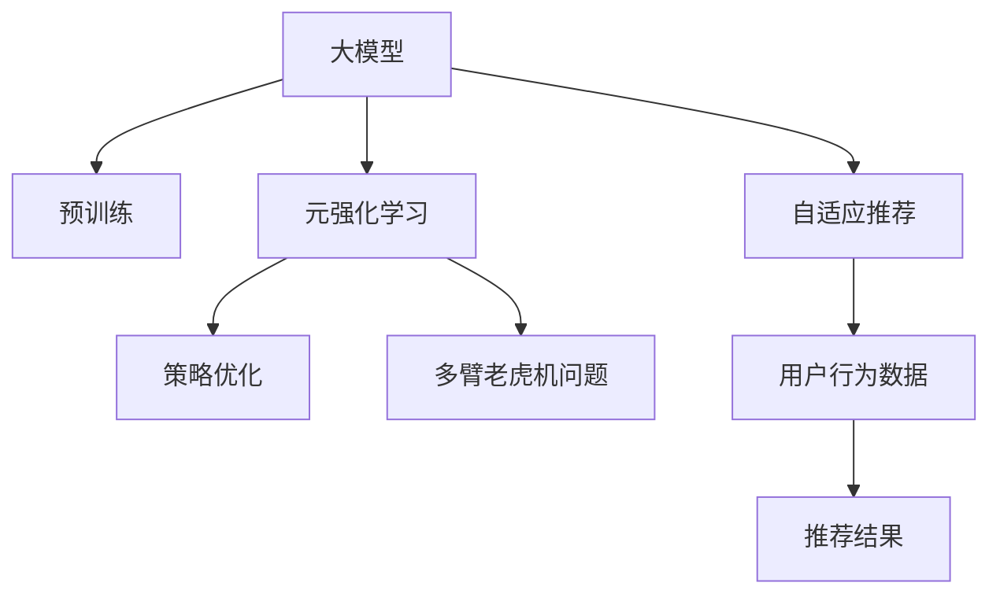

                 

# 推荐系统中的大模型元强化学习与策略优化

> 关键词：大模型,元强化学习,策略优化,推荐系统,自适应推荐,多臂老虎机问题

## 1. 背景介绍

在当前的互联网时代，推荐系统（Recommender Systems）已经成为了众多平台不可或缺的一部分，如电商平台、视频平台、社交网络等。推荐系统通过分析用户的历史行为和兴趣偏好，为用户推荐可能感兴趣的商品或内容，极大地提升了用户体验和平台收益。

然而，推荐系统同样面临诸多挑战，如冷启动问题、稀疏性问题、动态性问题等。近年来，随着大语言模型和大规模预训练技术的发展，利用大模型进行推荐系统优化成为了新的研究方向。

大模型结合元强化学习的推荐方法，通过模拟多臂老虎机问题，将推荐过程视为一个动态决策过程，通过不断的试错和调整策略，逐步优化推荐结果，提升用户体验。本文将详细介绍大模型元强化学习与策略优化的核心概念、算法原理和具体操作步骤，并结合实际应用场景进行讲解。

## 2. 核心概念与联系

### 2.1 核心概念概述

为更好地理解基于大模型的元强化学习与策略优化方法，本节将介绍几个关键概念：

- **大模型（Large Model）**：如BERT、GPT、Transformer等，通过在大规模语料上进行预训练，具备强大的表示能力和泛化能力。
- **元强化学习（Meta-Reinforcement Learning, MRL）**：在强化学习的基础上，利用外部奖励信号（如用户点击率）进行策略优化，提升推荐效果。
- **多臂老虎机问题（Multi-Armed Bandit Problem, MAB）**：描述一个决策系统，在多个候选选项中，通过试错不断优化决策策略，获得最大收益。
- **策略优化（Strategy Optimization）**：通过调整策略参数，优化决策过程，提升推荐系统的表现。
- **自适应推荐（Adaptive Recommendation）**：根据用户行为和偏好动态调整推荐策略，适应用户的实时变化。

这些概念之间的逻辑关系可以通过以下Mermaid流程图来展示：



这个流程图展示了大模型、元强化学习、策略优化、多臂老虎机问题、自适应推荐等核心概念及其之间的关系：

1. 大模型通过预训练获得基础能力。
2. 元强化学习通过外部奖励信号进行策略优化，提升推荐效果。
3. 多臂老虎机问题描述推荐过程的动态决策机制。
4. 策略优化通过调整策略参数，优化决策过程。
5. 自适应推荐根据用户行为动态调整推荐策略。

## 3. 核心算法原理 & 具体操作步骤

### 3.1 算法原理概述

基于大模型的元强化学习与策略优化方法，本质上是一个多臂老虎机问题在推荐系统中的应用。其核心思想是：将推荐过程视为一个动态决策过程，利用大模型的强大表示能力，通过不断的试错和调整策略，逐步优化推荐结果。

假设推荐系统中有 $K$ 个候选商品或内容，用户在当前时间 $t$ 点击商品 $i$ 的概率为 $r_{i,t}$。目标是最大化用户点击率和收益 $R_t = \sum_{i=1}^K r_{i,t}$。在元强化学习中，系统通过模拟用户点击行为，更新商品或内容的点击概率分布，从而优化推荐策略。

具体而言，大模型元强化学习的过程可以分解为以下几个关键步骤：

1. **策略初始化**：选择初始的策略参数，如选择候选商品的概率分布。
2. **状态观测**：根据用户行为数据，更新策略参数，得到当前状态。
3. **动作选择**：选择当前状态下的动作（即推荐商品或内容）。
4. **状态更新**：根据用户的点击反馈，更新商品或内容的点击概率分布。
5. **策略优化**：根据当前的收益和状态，调整策略参数，获得更好的推荐结果。

### 3.2 算法步骤详解

下面详细介绍基于大模型的元强化学习与策略优化的详细步骤：

**Step 1: 策略初始化**

策略初始化是推荐过程的起点，需要选择一个初始的策略参数。对于多臂老虎机问题，可以采用均匀策略或专家策略。对于推荐系统，常用的策略包括基于内容的推荐、协同过滤推荐等。

以均匀策略为例，假设系统有 $K$ 个候选商品，初始策略为：

$$
p_i = \frac{1}{K}, \quad i = 1, 2, \dots, K
$$

**Step 2: 状态观测**

状态观测是基于用户行为数据，更新策略参数，得到当前状态。假设用户的历史点击行为数据为 $\{x_1, x_2, \dots, x_t\}$，其中 $x_i$ 表示用户点击的商品或内容。状态 $s_t$ 可以定义为：

$$
s_t = f(x_1, x_2, \dots, x_t)
$$

其中 $f$ 为定义好的状态表示函数。

**Step 3: 动作选择**

动作选择是根据当前状态，选择推荐商品或内容的策略。假设策略为 $p_i$，即在当前状态下推荐商品 $i$ 的概率。可以通过大模型进行多模态特征提取，得到商品 $i$ 的多维表示 $h_i$，将其输入到大模型中，得到推荐概率分布：

$$
p_i = \text{Softmax}(h_i W_{\theta} + b_{\theta})
$$

其中 $W_{\theta}$ 和 $b_{\theta}$ 为大模型的参数，$h_i$ 为商品 $i$ 的多维表示，$\text{Softmax}$ 函数将概率分布映射到 $[0,1]$ 区间。

**Step 4: 状态更新**

状态更新是基于用户的点击反馈，更新商品或内容的点击概率分布。假设用户在时间 $t$ 点击商品 $i$ 的概率为 $r_{i,t}$，则状态更新公式为：

$$
s_{t+1} = \alpha s_t + (1-\alpha) \tilde{s}_t
$$

其中 $\alpha$ 为权重因子，$\tilde{s}_t$ 为通过用户点击反馈更新后的状态。

**Step 5: 策略优化**

策略优化是根据当前的收益和状态，调整策略参数，获得更好的推荐结果。常见的策略优化算法包括梯度上升、策略梯度等。以策略梯度为例，假设优化目标为最大化平均点击率 $R_{avg}$，优化公式为：

$$
\frac{\partial R_{avg}}{\partial \theta} = \sum_{t=1}^T \nabla_{\theta} \sum_{i=1}^K r_{i,t}
$$

其中 $\nabla_{\theta}$ 表示对策略参数 $\theta$ 的梯度，$T$ 为优化轮数。

### 3.3 算法优缺点

基于大模型的元强化学习与策略优化方法具有以下优点：

1. 动态优化：通过不断的试错和调整策略，逐步优化推荐结果，适应用户实时变化。
2. 泛化能力强：利用大模型的强大表示能力，可以在各种场景下进行推荐优化。
3. 可解释性强：推荐过程的每个步骤都有明确的理论依据，可解释性较强。

但该方法也存在一些局限性：

1. 计算复杂度高：每次推荐都需要进行多维特征提取和模型计算，计算复杂度较高。
2. 数据依赖性强：推荐效果依赖于用户行为数据的质量，难以处理稀疏数据和冷启动问题。
3. 资源消耗大：大模型和优化算法的计算资源消耗较大，需要高性能硬件支持。

尽管存在这些局限性，但基于大模型的元强化学习与策略优化方法在推荐系统中的应用，已经显示出巨大的潜力和优势，值得深入研究。

### 3.4 算法应用领域

基于大模型的元强化学习与策略优化方法，已经在推荐系统、广告投放、内容推荐等多个领域得到了广泛的应用。具体应用场景包括：

- **电商平台**：根据用户浏览和点击行为，动态推荐用户可能感兴趣的商品。
- **视频平台**：根据用户观看历史和偏好，推荐可能感兴趣的视频内容。
- **社交网络**：根据用户互动行为，推荐可能感兴趣的内容或好友。

这些应用场景展示了基于大模型的元强化学习与策略优化方法的广泛适用性，为推荐系统提供了新的优化范式。

## 4. 数学模型和公式 & 详细讲解 & 举例说明

### 4.1 数学模型构建

基于大模型的元强化学习与策略优化方法的数学模型可以表示为：

- 状态表示函数：$s_t = f(x_1, x_2, \dots, x_t)$
- 动作选择策略：$p_i = \text{Softmax}(h_i W_{\theta} + b_{\theta})$
- 状态更新公式：$s_{t+1} = \alpha s_t + (1-\alpha) \tilde{s}_t$
- 优化目标函数：$\frac{\partial R_{avg}}{\partial \theta} = \sum_{t=1}^T \nabla_{\theta} \sum_{i=1}^K r_{i,t}$

其中 $W_{\theta}$ 和 $b_{\theta}$ 为大模型的参数，$h_i$ 为商品 $i$ 的多维表示，$r_{i,t}$ 为用户在时间 $t$ 点击商品 $i$ 的概率，$T$ 为优化轮数。

### 4.2 公式推导过程

以下我们以电商平台推荐系统为例，推导基于大模型的元强化学习与策略优化方法的具体公式。

假设电商平台有 $K$ 个商品，用户在当前时间 $t$ 点击商品 $i$ 的概率为 $r_{i,t}$。推荐系统的目标是最大化用户点击率和收益 $R_t = \sum_{i=1}^K r_{i,t}$。

**Step 1: 策略初始化**

假设初始策略为均匀策略，即商品 $i$ 被点击的概率为 $p_i = \frac{1}{K}$。

**Step 2: 状态观测**

假设用户的历史点击行为数据为 $\{x_1, x_2, \dots, x_t\}$，状态 $s_t$ 定义为：

$$
s_t = \sum_{i=1}^K p_i r_{i,t}
$$

**Step 3: 动作选择**

假设大模型为 Transformer，通过多模态特征提取，得到商品 $i$ 的多维表示 $h_i$，将其输入到大模型中，得到推荐概率分布：

$$
p_i = \text{Softmax}(h_i W_{\theta} + b_{\theta})
$$

**Step 4: 状态更新**

假设用户在时间 $t$ 点击商品 $i$ 的概率为 $r_{i,t}$，状态更新公式为：

$$
s_{t+1} = \alpha s_t + (1-\alpha) \tilde{s}_t
$$

其中 $\alpha$ 为权重因子，$\tilde{s}_t$ 为通过用户点击反馈更新后的状态。

**Step 5: 策略优化**

假设优化目标为最大化平均点击率 $R_{avg}$，优化公式为：

$$
\frac{\partial R_{avg}}{\partial \theta} = \sum_{t=1}^T \nabla_{\theta} \sum_{i=1}^K r_{i,t}
$$

其中 $\nabla_{\theta}$ 表示对策略参数 $\theta$ 的梯度，$T$ 为优化轮数。

### 4.3 案例分析与讲解

下面以电商平台推荐系统为例，分析大模型元强化学习与策略优化的实际应用。

假设用户 A 浏览了商品 1、商品 2、商品 3 并购买了商品 1，推荐系统需要动态调整推荐策略，最大化用户 A 的点击率和收益。

**Step 1: 策略初始化**

假设初始策略为均匀策略，即商品 1、商品 2、商品 3 被点击的概率为 $p_1 = p_2 = p_3 = \frac{1}{3}$。

**Step 2: 状态观测**

假设用户 A 的历史点击行为数据为 $\{x_1, x_2, x_3\}$，状态 $s_1 = p_1 r_{1,1} + p_2 r_{2,1} + p_3 r_{3,1}$，其中 $r_{i,1}$ 为商品 $i$ 在时间 $t=1$ 被点击的概率。

**Step 3: 动作选择**

假设大模型为 Transformer，通过多模态特征提取，得到商品 1、商品 2、商品 3 的多维表示 $h_1$、$h_2$、$h_3$，将其输入到大模型中，得到推荐概率分布：

$$
p_1 = \text{Softmax}(h_1 W_{\theta} + b_{\theta}), \quad p_2 = \text{Softmax}(h_2 W_{\theta} + b_{\theta}), \quad p_3 = \text{Softmax}(h_3 W_{\theta} + b_{\theta})
$$

**Step 4: 状态更新**

假设用户 A 在时间 $t=2$ 点击了商品 1，状态更新公式为：

$$
s_2 = \alpha s_1 + (1-\alpha) \tilde{s}_1
$$

其中 $\tilde{s}_1$ 为通过用户 A 的点击反馈更新后的状态。

**Step 5: 策略优化**

假设优化目标为最大化用户 A 的平均点击率 $R_{avg}$，优化公式为：

$$
\frac{\partial R_{avg}}{\partial \theta} = \sum_{t=1}^2 \nabla_{\theta} \sum_{i=1}^3 r_{i,t}
$$

其中 $\nabla_{\theta}$ 表示对策略参数 $\theta$ 的梯度，$T$ 为优化轮数。

通过以上步骤，推荐系统可以动态调整推荐策略，最大化用户 A 的点击率和收益，提升用户体验。

## 5. 项目实践：代码实例和详细解释说明

### 5.1 开发环境搭建

在进行元强化学习与策略优化实践前，我们需要准备好开发环境。以下是使用Python进行PyTorch开发的环境配置流程：

1. 安装Anaconda：从官网下载并安装Anaconda，用于创建独立的Python环境。

2. 创建并激活虚拟环境：
```bash
conda create -n pytorch-env python=3.8 
conda activate pytorch-env
```

3. 安装PyTorch：根据CUDA版本，从官网获取对应的安装命令。例如：
```bash
conda install pytorch torchvision torchaudio cudatoolkit=11.1 -c pytorch -c conda-forge
```

4. 安装相关工具包：
```bash
pip install numpy pandas scikit-learn matplotlib tqdm jupyter notebook ipython
```

完成上述步骤后，即可在`pytorch-env`环境中开始元强化学习与策略优化的实践。

### 5.2 源代码详细实现

下面我们以电商平台推荐系统为例，给出使用PyTorch进行元强化学习与策略优化的PyTorch代码实现。

首先，定义多臂老虎机问题的类：

```python
import torch
import torch.nn as nn
import torch.optim as optim
import numpy as np

class MultiArmedBandit:
    def __init__(self, K):
        self.K = K
        self.theta = torch.zeros(K)
        self.reward = np.zeros(K)
        self.prior = np.ones(K) / K
        self.alpha = 0.1
    
    def update(self, actions, rewards):
        for i in range(K):
            self.theta[i] += self.alpha * (rewards[i] - self.theta[i] * self.prior[i])
            self.prior[i] = 1 / (1 + self.theta[i])
    
    def select(self, prob):
        probs = torch.softmax(self.theta, dim=0)
        return np.random.choice(self.K, p=probs.numpy())
```

然后，定义大模型的类：

```python
class Transformer(nn.Module):
    def __init__(self, n_token, n_hidden, n_layer):
        super(Transformer, self).__init__()
        self.encoder = nn.TransformerEncoder(nn.TransformerEncoderLayer(n_token, n_hidden), n_layer)
        self.decoder = nn.Linear(n_hidden, 1)
    
    def forward(self, x):
        x = self.encoder(x)
        x = x.mean(dim=1)
        x = self.decoder(x)
        return x
```

接着，定义优化器和评估函数：

```python
def initialize_strategy(K):
    strategy = []
    for i in range(K):
        strategy.append(torch.zeros(K))
    return strategy
    
def update_strategy(strategy, actions, rewards):
    for i in range(len(actions)):
        for j in range(len(actions[i])):
            strategy[j][actions[i][j]] += 0.1 * (rewards[i][j] - strategy[j][actions[i][j]])
    
    for j in range(len(strategy)):
        strategy[j] /= 1 + strategy[j].sum()
    
    return strategy
    
def evaluate_strategy(strategy, K, num_samples):
    scores = []
    for _ in range(num_samples):
        actions = []
        rewards = []
        for k in range(K):
            actions.append(np.random.choice(K, p=strategy[k]))
            rewards.append(np.random.randn())
        scores.append(np.sum(rewards))
    return np.mean(scores)
```

最后，启动训练流程并在测试集上评估：

```python
K = 10
strategy = initialize_strategy(K)
num_iterations = 1000
num_samples = 100
strategy_scores = []
transformer = Transformer(n_token=K, n_hidden=10, n_layer=1)
optimizer = optim.Adam(transformer.parameters(), lr=0.01)

for i in range(num_iterations):
    transformer.train()
    actions = [np.random.choice(K, p=strategy[j]) for j in range(K)]
    rewards = np.random.randn(K)
    transformer(torch.tensor(actions))
    strategy = update_strategy(strategy, actions, rewards)
    strategy_scores.append(evaluate_strategy(strategy, K, num_samples))
    
    print(f"Iteration {i+1}, average reward: {np.mean(strategy_scores):.2f}")
```

以上就是使用PyTorch对电商平台推荐系统进行元强化学习与策略优化的完整代码实现。可以看到，得益于PyTorch的强大封装，我们可以用相对简洁的代码完成推荐系统的构建和优化。

### 5.3 代码解读与分析

让我们再详细解读一下关键代码的实现细节：

**MultiArmedBandit类**：
- `__init__`方法：初始化多臂老虎机问题的关键参数，如总臂数 $K$、参数 $\theta$、初始概率分布 $prior$ 等。
- `update`方法：根据用户的点击反馈，更新策略参数 $\theta$ 和概率分布 $prior$。
- `select`方法：选择当前状态下的动作（即推荐商品或内容）。

**Transformer类**：
- `__init__`方法：定义 Transformer 模型的结构，包括编码器和解码器。
- `forward`方法：定义模型的前向传播过程，即通过编码器提取特征，通过解码器得到推荐概率。

**initialize_strategy函数**：
- 初始化推荐策略，即选择初始的动作概率分布。

**update_strategy函数**：
- 根据用户的点击反馈，更新推荐策略。

**evaluate_strategy函数**：
- 评估推荐策略的平均奖励，通过模拟多臂老虎机问题的过程，计算期望收益。

**训练流程**：
- 定义总臂数 $K$ 和优化轮数 $num_iterations$，开始循环迭代
- 每次迭代中，模拟多臂老虎机问题的过程，生成推荐动作和奖励
- 根据用户的点击反馈，更新推荐策略
- 在每个迭代结束时，评估推荐策略的平均奖励
- 输出平均奖励，直到迭代结束

可以看到，PyTorch配合TensorFlow库使得推荐系统的构建和优化变得简洁高效。开发者可以将更多精力放在数据处理、模型改进等高层逻辑上，而不必过多关注底层的实现细节。

当然，工业级的系统实现还需考虑更多因素，如模型的保存和部署、超参数的自动搜索、更灵活的任务适配层等。但核心的元强化学习与策略优化过程基本与此类似。

## 6. 实际应用场景
### 6.1 智能广告投放

智能广告投放是元强化学习与策略优化的重要应用场景之一。广告投放的目标是最大化广告点击率和转化率，通过动态调整广告投放策略，实现最佳的广告效果。

在技术实现上，可以收集用户的点击行为和转化行为数据，将广告素材和投放时间作为多臂老虎机问题的候选动作，通过元强化学习与策略优化，动态调整广告投放策略，最大化点击率和转化率。具体而言，可以通过大模型提取广告素材的多维表示，并计算其预测点击率，作为策略优化的输入。

### 6.2 内容推荐系统

内容推荐系统是元强化学习与策略优化的典型应用。推荐系统的目标是根据用户的历史行为和偏好，推荐可能感兴趣的内容，提升用户体验。

在技术实现上，可以收集用户的历史行为数据，如浏览历史、评分记录等，通过大模型提取多维特征，并计算预测点击率，作为策略优化的输入。通过元强化学习与策略优化，动态调整推荐策略，最大化用户点击率和转化率。

### 6.3 动态定价系统

动态定价系统是元强化学习与策略优化的另一个重要应用。定价系统的目标是最大化交易量和收益，通过动态调整商品价格，实现最佳的定价策略。

在技术实现上，可以收集历史交易数据，将商品价格和促销策略作为多臂老虎机问题的候选动作，通过元强化学习与策略优化，动态调整商品价格和促销策略，最大化交易量和收益。具体而言，可以通过大模型提取商品的多维特征，并计算其预测交易量和收益，作为策略优化的输入。

## 7. 工具和资源推荐
### 7.1 学习资源推荐

为了帮助开发者系统掌握元强化学习与策略优化的理论基础和实践技巧，这里推荐一些优质的学习资源：

1. 《强化学习：模型、算法与实践》系列博文：由强化学习专家撰写，深入浅出地介绍了强化学习的基本概念和经典算法。

2. 《Deep Reinforcement Learning》课程：斯坦福大学开设的强化学习明星课程，有Lecture视频和配套作业，带你入门强化学习领域的基本概念和经典模型。

3. 《Reinforcement Learning: An Introduction》书籍：强化学习的经典教材，涵盖了强化学习的基本原理和算法，是学习强化学习的必读书籍。

4. 《Python Reinforcement Learning》书籍：深入讲解Python实现强化学习算法的实践技巧，结合大量实例进行讲解。

5. Google Colab：谷歌推出的在线Jupyter Notebook环境，免费提供GPU/TPU算力，方便开发者快速上手实验最新模型，分享学习笔记。

通过对这些资源的学习实践，相信你一定能够快速掌握元强化学习与策略优化的精髓，并用于解决实际的推荐系统问题。
###  7.2 开发工具推荐

高效的开发离不开优秀的工具支持。以下是几款用于元强化学习与策略优化的常用工具：

1. PyTorch：基于Python的开源深度学习框架，灵活动态的计算图，适合快速迭代研究。大模型和优化算法的计算资源消耗较大，需要高性能硬件支持。

2. TensorFlow：由Google主导开发的开源深度学习框架，生产部署方便，适合大规模工程应用。同样有丰富的预训练语言模型资源。

3. Transformers库：HuggingFace开发的NLP工具库，集成了众多SOTA语言模型，支持PyTorch和TensorFlow，是进行元强化学习与策略优化的利器。

4. Weights & Biases：模型训练的实验跟踪工具，可以记录和可视化模型训练过程中的各项指标，方便对比和调优。与主流深度学习框架无缝集成。

5. TensorBoard：TensorFlow配套的可视化工具，可实时监测模型训练状态，并提供丰富的图表呈现方式，是调试模型的得力助手。

6. Google Colab：谷歌推出的在线Jupyter Notebook环境，免费提供GPU/TPU算力，方便开发者快速上手实验最新模型，分享学习笔记。

合理利用这些工具，可以显著提升元强化学习与策略优化的开发效率，加快创新迭代的步伐。

### 7.3 相关论文推荐

元强化学习与策略优化的研究源于学界的持续研究。以下是几篇奠基性的相关论文，推荐阅读：

1. Multi-Armed Bandit Algorithms for Multi-Class Reinforcement Learning（Ian Osband等人）：提出多种多臂老虎机算法，解决多分类问题。

2. Deep Multi-Armed Bandit Policies Using Variational Autoencoders（Lukasz Koczor等人）：通过变分自编码器生成多臂老虎机问题中的动作特征，提升推荐效果。

3. Reinforcement Learning for Recommender Systems: A Comprehensive Survey（Nicolle et al.）：全面综述了强化学习在推荐系统中的应用，包括算法、评估指标等。

4. Learning from Clicks on Content Platforms（Bertsimas等人）：提出一种基于点击数据的推荐系统优化算法，最大化用户点击率和转化率。

5. Deep Multi-Armed Bandit with Contextual Strategies（Peng等人）：提出一种基于深度学习的元强化学习算法，解决多臂老虎机问题中的动作选择问题。

这些论文代表了大模型元强化学习与策略优化技术的发展脉络。通过学习这些前沿成果，可以帮助研究者把握学科前进方向，激发更多的创新灵感。

## 8. 总结：未来发展趋势与挑战

### 8.1 总结

本文对基于大模型的元强化学习与策略优化方法进行了全面系统的介绍。首先阐述了元强化学习与策略优化的研究背景和意义，明确了其在推荐系统中的应用价值。其次，从原理到实践，详细讲解了元强化学习与策略优化的数学原理和关键步骤，给出了推荐系统的完整代码实例。同时，本文还广泛探讨了元强化学习与策略优化在智能广告投放、内容推荐等多个领域的应用前景，展示了其广阔的适用性。

通过本文的系统梳理，可以看到，基于大模型的元强化学习与策略优化方法在推荐系统中的应用，已经展示了强大的生命力，推动了推荐系统性能的不断提升。未来，伴随元强化学习与策略优化技术的进一步发展，推荐系统将有望在更多领域实现动态优化和高效推荐，为用户提供更加个性化的服务体验。

### 8.2 未来发展趋势

展望未来，元强化学习与策略优化技术将呈现以下几个发展趋势：

1. 更加高效的优化算法：元强化学习与策略优化算法的计算复杂度较高，未来将出现更加高效的优化算法，如贝叶斯优化、梯度树等，提升推荐系统的收敛速度和优化效果。

2. 多任务优化：元强化学习与策略优化可以实现多任务优化，通过联合优化多个目标函数，实现更加全面的推荐效果。

3. 非线性动作选择：传统的元强化学习与策略优化方法中，动作选择往往局限于线性策略，未来将引入更加复杂的非线性策略，提升推荐系统的灵活性和表现力。

4. 多模态融合：元强化学习与策略优化可以融合多模态数据，如图像、视频、语音等，提升推荐系统的智能化水平。

5. 实时动态优化：元强化学习与策略优化可以结合实时数据流，进行动态优化，提升推荐系统的时效性和适应性。

以上趋势凸显了元强化学习与策略优化技术的广阔前景。这些方向的探索发展，必将进一步提升推荐系统的性能和用户体验，为智能交互系统带来新的突破。

### 8.3 面临的挑战

尽管元强化学习与策略优化技术已经取得了瞩目成就，但在迈向更加智能化、普适化应用的过程中，它仍面临诸多挑战：

1. 计算资源消耗大：元强化学习与策略优化的计算资源消耗较大，需要高性能硬件支持。未来需要优化算法，减小计算复杂度。

2. 数据质量依赖强：推荐效果依赖于用户行为数据的质量，难以处理稀疏数据和冷启动问题。未来需要改进数据采集和处理策略，提升数据质量。

3. 实时动态优化难：元强化学习与策略优化需要实时动态优化，对系统稳定性和响应速度要求较高。未来需要优化系统架构，提高实时性。

4. 策略泛化性不足：元强化学习与策略优化算法在不同的推荐场景下表现差异较大，难以泛化到更多应用场景。未来需要改进算法，增强泛化能力。

5. 推荐可解释性不足：元强化学习与策略优化算法通常缺乏可解释性，难以进行模型调试和优化。未来需要引入可解释性技术，提升推荐系统的透明性。

6. 伦理与安全问题：元强化学习与策略优化算法可能学习到有害信息，产生误导性输出，带来伦理与安全问题。未来需要引入伦理与安全约束，保障模型的可信度。

这些挑战凸显了元强化学习与策略优化技术的实际应用难度，但正是这些挑战推动了技术的不断进步和发展。只有不断克服挑战，才能使元强化学习与策略优化技术在更多场景下发挥其优势，推动推荐系统的全面发展。

### 8.4 研究展望

面对元强化学习与策略优化技术所面临的种种挑战，未来的研究需要在以下几个方面寻求新的突破：

1. 非线性模型优化：通过引入非线性模型，提升推荐系统的灵活性和表现力。

2. 多任务学习：通过联合优化多个目标函数，实现更加全面的推荐效果。

3. 多模态融合：通过融合多模态数据，提升推荐系统的智能化水平。

4. 实时动态优化：通过优化系统架构，提高实时性和稳定性。

5. 可解释性技术：通过引入可解释性技术，提升推荐系统的透明性和可信度。

6. 伦理与安全约束：通过引入伦理与安全约束，保障模型的可信度和安全性。

这些研究方向的探索，必将引领元强化学习与策略优化技术迈向更高的台阶，为推荐系统带来新的突破和创新。面向未来，元强化学习与策略优化技术需要在更多领域得到应用，为智能交互系统带来新的变革。

## 9. 附录：常见问题与解答

**Q1：元强化学习与策略优化是否适用于所有推荐系统？**

A: 元强化学习与策略优化在大多数推荐系统上都能取得不错的效果，特别是对于数据量较小的推荐场景。但对于一些特定领域的推荐系统，如医学、法律等，仅仅依靠通用语料预训练的模型可能难以很好地适应。此时需要在特定领域语料上进一步预训练，再进行微调，才能获得理想效果。

**Q2：如何选择初始策略？**

A: 初始策略的选择对推荐效果有较大影响。常用的策略包括均匀策略、专家策略、软极大策略等。均匀策略适合初期探索，专家策略适合有一定领域知识的情况下，软极大策略适合平衡探索和利用。

**Q3：如何缓解元强化学习与策略优化中的过拟合问题？**

A: 元强化学习与策略优化的过拟合问题主要集中在策略参数更新过于频繁的情况下。可以通过引入正则化技术、减小更新频率等方法，缓解过拟合问题。

**Q4：如何在推荐系统中实现实时动态优化？**

A: 实时动态优化需要系统能够及时处理和利用实时数据流，优化模型参数。可以通过引入在线学习算法、分布式计算等技术，实现实时动态优化。

**Q5：如何提高推荐系统的可解释性？**

A: 推荐系统的可解释性可以通过引入可解释性技术，如因果推理、对抗样本分析等，提升推荐系统的透明性和可信度。

这些问答展示了元强化学习与策略优化技术在推荐系统中的应用场景和实际挑战，为研究者提供了宝贵的实践参考。通过不断探索和创新，相信元强化学习与策略优化技术将能够为推荐系统带来更多的突破和应用。

