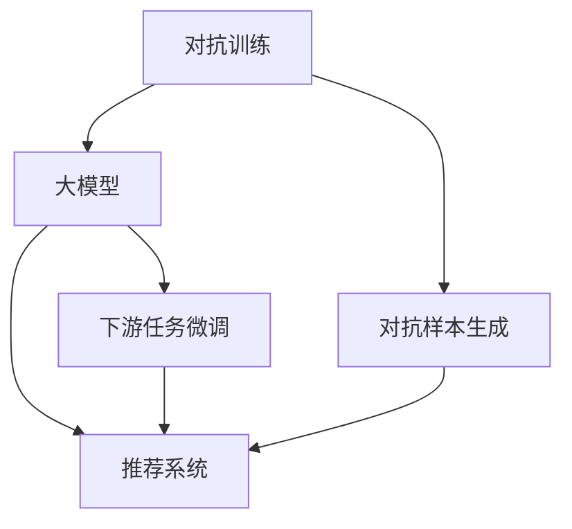

                 

# 推荐系统中的大模型对抗训练与鲁棒性

## 1. 背景介绍

推荐系统旨在通过分析用户的历史行为和偏好，推荐最适合的物品、信息或服务。随着互联网数据量的爆炸式增长，推荐系统逐步从传统的协同过滤、基于内容的推荐向更加智能、高效的深度学习推荐方向演进。而大模型在这一方向上展现了巨大的潜力，通过海量的无标签数据进行自监督预训练，获得了全面的语言模型和语义表征能力，进一步通过下游任务的微调，在推荐任务上取得令人瞩目的性能突破。

然而，尽管大模型推荐系统在多个公开数据集上取得了优异的表现，但在实际应用场景中，其鲁棒性和安全性仍然面临严峻挑战。常见的问题包括对抗样本攻击、模型泛化能力不足、参数过多导致的计算效率低等问题。为了增强推荐系统的鲁棒性，学术界和工业界提出了多种鲁棒化的训练策略，其中对抗训练(GAdversarial Training, AT)是公认的高效方法。本文将重点探讨在推荐系统中使用大模型对抗训练的原理和应用，力求为开发者提供全面的技术指导。

## 2. 核心概念与联系

### 2.1 核心概念概述

为更好地理解大模型对抗训练在推荐系统中的应用，本节将介绍几个密切相关的核心概念：

- **对抗训练(GAdversarial Training, AT)**：通过在训练过程中添加对抗样本，提升模型的鲁棒性和泛化能力。在对抗训练中，模型需要同时学习自身的预测函数和对抗样本的生成函数，使得对抗样本难以被正确分类。
- **大模型(Large Model)**：指以Transformer结构为基础，参数量在亿级以上，具有强大语言表示能力和泛化能力的大型语言模型。常见的预训练模型如BERT、GPT-3、T5等。
- **推荐系统(Recommender System)**：根据用户历史行为和偏好，推荐合适物品的系统。经典推荐系统包括协同过滤、基于内容的推荐、深度学习推荐等。
- **对抗样本(Adversarial Examples)**：经过人为构造，使得模型预测错误的输入数据。对抗样本的目标是尽可能扰动输入数据，同时尽可能小地影响可感知的输入。
- **鲁棒性(Robustness)**：模型对输入数据扰动的容忍度。鲁棒性强的模型即使输入存在噪声或对抗样本，也能保证模型预测的正确性。
- **泛化能力(Generalization)**：模型对未见过的数据进行预测的能力。泛化能力强的模型，即使在对抗样本存在的情况下，也能保证良好的预测性能。

这些核心概念之间的逻辑关系可以通过以下Mermaid流程图来展示：



这个流程图展示了大模型对抗训练的核心概念及其之间的关系：

1. 大模型通过对抗训练提升鲁棒性和泛化能力。
2. 对抗样本生成与大模型结合，用于增强模型的鲁棒性。
3. 微调大模型用于下游推荐系统，提升推荐效果。

## 3. 核心算法原理 & 具体操作步骤
### 3.1 算法原理概述

对抗训练的核心思想是通过优化模型和对抗样本生成器的目标函数，使得对抗样本难以被正确分类，从而提升模型的鲁棒性。在推荐系统中，常见的目标函数是预测用户对物品的评分，而对抗样本的目标是尽可能干扰预测结果。在每次迭代中，我们通过随机生成对抗样本，将其加入训练数据集，与原始样本一起进行反向传播，更新模型参数，直到模型在对抗样本上的预测损失最小化。

对抗训练的具体步骤包括：

1. 随机生成对抗样本。
2. 将对抗样本与原始样本一起输入模型，计算总损失。
3. 反向传播更新模型参数。
4. 重复上述过程直至模型收敛。

### 3.2 算法步骤详解

以下是详细的操作步骤：

1. **准备对抗样本生成器**：对抗样本生成器可以是一个简单的神经网络，也可以是一个复杂的生成对抗网络(GAN)。常用的对抗样本生成方法包括FGSM、PGD、AC-attack等。

2. **选择推荐任务**：根据实际应用需求，选择推荐任务（如点击率预测、评分预测等），设计相应的损失函数。例如，对于点击率预测任务，我们可以使用二分类交叉熵损失函数。

3. **选择对抗强度**：根据实际情况选择对抗样本的扰动程度，一般通过调整对抗样本的扰动范围和扰动方式来确定。

4. **微调模型**：使用微调框架（如PyTorch、TensorFlow等）搭建推荐模型，并进行对抗训练。

5. **评估模型鲁棒性**：通过对抗样本测试集评估模型的鲁棒性，如使用C&W攻击、DeepFool等方法进行测试。

### 3.3 算法优缺点

对抗训练在推荐系统中有以下优点：

- 提升鲁棒性：通过对抗训练，模型对对抗样本的攻击更具抵抗力，提高了推荐系统的鲁棒性。
- 提高泛化能力：对抗训练可以增强模型对未知数据和扰动数据的泛化能力。
- 加速收敛：对抗训练可以加速模型的收敛速度，提高模型的训练效率。

同时，对抗训练也存在一些缺点：

- 增加训练难度：对抗训练需要生成对抗样本，增加了训练的复杂性。
- 需要更多的计算资源：对抗训练需要更多的时间和计算资源。
- 对抗样本生成难度较大：对抗样本的生成需要较强的生成能力，一般需要额外的训练。

### 3.4 算法应用领域

对抗训练在推荐系统中的应用领域非常广泛，例如：

- **电商推荐**：在电商平台上，商品推荐系统需要抵御恶意商品数据干扰，推荐可信的商品信息。
- **社交媒体推荐**：社交媒体推荐系统需要抵御对抗性内容攻击，保护用户隐私和信息安全。
- **广告推荐**：广告推荐系统需要抵御恶意广告干扰，保证广告投放的准确性和效果。

## 4. 数学模型和公式 & 详细讲解 & 举例说明
### 4.1 数学模型构建

对抗训练的数学模型可以表示为：

$$
\min_{\theta} \mathcal{L}(\theta) = \min_{\theta} \left[ \mathcal{L}^P(\theta) + \lambda \mathcal{L}^A(\theta) \right]
$$

其中，$\theta$ 为模型参数，$\mathcal{L}^P$ 为预测任务损失函数，$\mathcal{L}^A$ 为对抗样本损失函数，$\lambda$ 为对抗样本损失的权重。

以点击率预测任务为例，预测任务损失函数 $\mathcal{L}^P$ 可以使用二分类交叉熵损失：

$$
\mathcal{L}^P(\theta) = -\frac{1}{N}\sum_{i=1}^N \left[ y_i \log p_i + (1-y_i) \log(1-p_i) \right]
$$

其中，$y_i$ 为样本的真实标签，$p_i$ 为模型的预测概率。

对抗样本损失函数 $\mathcal{L}^A$ 可以使用对抗样本生成器 $g$ 计算的对抗样本 $x^*_i$，并使用梯度下降方法求解：

$$
\mathcal{L}^A(\theta) = \frac{1}{N}\sum_{i=1}^N \left[ \log (1-p_i(x^*_i)) \right]
$$

其中，$x^*_i$ 为对抗样本，$p_i(x^*_i)$ 为模型在对抗样本上的预测概率。

### 4.2 公式推导过程

对抗训练的具体过程如下：

1. **预测任务损失函数**：对原始样本 $x_i$ 进行前向传播，计算预测概率 $p_i$。
2. **对抗样本生成器**：使用对抗样本生成器生成对抗样本 $x^*_i$。
3. **对抗样本损失函数**：对对抗样本 $x^*_i$ 进行前向传播，计算对抗样本损失。
4. **总损失函数**：将预测任务损失和对抗样本损失组合，计算总损失。
5. **反向传播更新参数**：对总损失函数求导，更新模型参数。

以点击率预测任务为例，其具体的数学推导过程如下：

1. **原始样本损失**：对原始样本 $x_i$ 进行前向传播，计算预测概率 $p_i$。

2. **对抗样本生成**：使用对抗样本生成器生成对抗样本 $x^*_i$，使得对抗样本 $x^*_i$ 与原始样本 $x_i$ 尽可能相似。

3. **对抗样本损失**：对对抗样本 $x^*_i$ 进行前向传播，计算对抗样本损失。

4. **总损失**：将原始样本损失和对抗样本损失组合，计算总损失：

$$
\mathcal{L}_{total}(x_i, \theta) = \log (1-p_i(x^*_i))
$$

5. **反向传播更新参数**：对总损失函数求导，更新模型参数：

$$
\nabla_{\theta}\mathcal{L}_{total} = \nabla_{\theta}\log (1-p_i(x^*_i))
$$

重复上述过程，直到模型收敛。

### 4.3 案例分析与讲解

以电商推荐系统为例，假设有一个包含用户历史行为数据的推荐系统，用户 $i$ 对物品 $j$ 的评分可以表示为：

$$
\hat{y}_{i,j} = f_{\theta}(x_i, j)
$$

其中，$f_{\theta}$ 为推荐模型的预测函数，$x_i$ 为用户行为数据，$j$ 为物品ID。

假设存在一个对抗样本生成器，生成一个对抗样本 $x^*_i$，使得：

$$
\hat{y}_{i,j}(x^*_i) \neq \hat{y}_{i,j}
$$

为了提高推荐系统的鲁棒性，可以在推荐模型的训练过程中，加入对抗样本的训练。具体地，将原始样本 $x_i$ 和对抗样本 $x^*_i$ 作为训练数据，对推荐模型的预测函数进行优化：

$$
\theta^* = \mathop{\arg\min}_{\theta} \left[ \frac{1}{N}\sum_{i=1}^N \log (1-\hat{y}_{i,j}(x^*_i)) + \lambda \mathcal{L}^A(\theta) \right]
$$

其中，$\mathcal{L}^A(\theta)$ 为对抗样本损失函数。

## 5. 项目实践：代码实例和详细解释说明
### 5.1 开发环境搭建

在进行对抗训练实践前，我们需要准备好开发环境。以下是使用Python进行PyTorch开发的环境配置流程：

1. 安装Anaconda：从官网下载并安装Anaconda，用于创建独立的Python环境。

2. 创建并激活虚拟环境：
```bash
conda create -n pytorch-env python=3.8 
conda activate pytorch-env
```

3. 安装PyTorch：根据CUDA版本，从官网获取对应的安装命令。例如：
```bash
conda install pytorch torchvision torchaudio cudatoolkit=11.1 -c pytorch -c conda-forge
```

4. 安装Transformer库：
```bash
pip install transformers
```

5. 安装各类工具包：
```bash
pip install numpy pandas scikit-learn matplotlib tqdm jupyter notebook ipython
```

完成上述步骤后，即可在`pytorch-env`环境中开始对抗训练实践。

### 5.2 源代码详细实现

这里我们以电商推荐系统为例，给出使用Transformers库对BERT模型进行对抗训练的PyTorch代码实现。

首先，定义对抗样本生成函数：

```python
from transformers import BertTokenizer
from torch.nn import CrossEntropyLoss, BCEWithLogitsLoss
from torch.optim import AdamW
from torch.utils.data import Dataset, DataLoader
from torch.nn import ReLU, Dropout
from tqdm import tqdm

def generate_adversarial_samples(text, model, epsilon=0.01, alpha=0.01, num_iters=20):
    tokenizer = BertTokenizer.from_pretrained('bert-base-uncased')
    inputs = tokenizer(text, return_tensors='pt', max_length=512, padding='max_length', truncation=True)
    x = inputs['input_ids'].to(device)
    x_adv = x.clone().detach()
    
    for _ in range(num_iters):
        x_adv.requires_grad_()
        x_adv = x_adv.to(device)
        with torch.no_grad():
            logits_adv = model(x_adv)[0]
        gradients = torch.autograd.grad(logits_adv, x_adv, inputs, create_graph=True)[0]
        x_adv.requires_grad_(False)
        x_adv = x_adv + gradients * alpha
        logits_adv = model(x_adv)[0]
        loss_adv = logits_adv
        if loss_adv < 0.5:
            break
        x_adv.requires_grad_(False)
        epsilon = epsilon * 0.999
    return x_adv
```

然后，定义推荐模型的损失函数和训练函数：

```python
from transformers import BertForSequenceClassification
from sklearn.metrics import accuracy_score

class RecommendationModel(BertForSequenceClassification):
    def __init__(self, num_classes=2, drop_rate=0.3):
        super().__init__(num_classes=num_classes)
        self.dropout = Dropout(p=drop_rate)
        self.fc = BertForSequenceClassification(num_classes=num_classes)
    
    def forward(self, input_ids, attention_mask, labels=None):
        x = super().forward(input_ids, attention_mask=attention_mask, labels=labels)
        x = self.dropout(x)
        x = self.fc(x)
        return x

class TrainRecommendationModel:
    def __init__(self, model, data_train, data_test, num_epochs=5, batch_size=32, lr=1e-5):
        self.model = model
        self.data_train = data_train
        self.data_test = data_test
        self.num_epochs = num_epochs
        self.batch_size = batch_size
        self.lr = lr
        self.optimizer = AdamW(model.parameters(), lr=lr)
    
    def train(self):
        device = torch.device('cuda') if torch.cuda.is_available() else torch.device('cpu')
        model = self.model.to(device)
        for epoch in range(self.num_epochs):
            total_loss = 0.0
            for batch in tqdm(data_train):
                input_ids = batch['input_ids'].to(device)
                attention_mask = batch['attention_mask'].to(device)
                labels = batch['labels'].to(device)
                logits = model(input_ids, attention_mask=attention_mask, labels=labels)
                loss = logits_loss(logits, labels)
                total_loss += loss.item()
                loss.backward()
                optimizer.step()
                optimizer.zero_grad()
            print(f"Epoch {epoch+1}, loss: {total_loss/len(data_train):.4f}")
            accuracy = accuracy_score(labels, logits.argmax(dim=1))
            print(f"Epoch {epoch+1}, accuracy: {accuracy:.4f}")
    
    def test(self):
        model.eval()
        total_loss = 0.0
        correct = 0
        with torch.no_grad():
            for batch in data_test:
                input_ids = batch['input_ids'].to(device)
                attention_mask = batch['attention_mask'].to(device)
                labels = batch['labels'].to(device)
                logits = model(input_ids, attention_mask=attention_mask)
                loss = logits_loss(logits, labels)
                total_loss += loss.item()
                correct += (logits.argmax(dim=1) == labels).sum().item()
        accuracy = correct / len(data_test)
        print(f"Test accuracy: {accuracy:.4f}")
    
    def generate_adversarial_samples(self, text):
        return generate_adversarial_samples(text, self.model, epsilon=0.01, alpha=0.01, num_iters=20)
```

最后，启动对抗训练流程并在测试集上评估：

```python
from transformers import BertForSequenceClassification, BertTokenizer
from transformers import BertForSequenceClassification, BertTokenizer
from torch.utils.data import Dataset
import torch
import pandas as pd

# 加载数据集
data_train = pd.read_csv('train.csv')
data_test = pd.read_csv('test.csv')

# 构建数据集
tokenizer = BertTokenizer.from_pretrained('bert-base-uncased')
train_dataset = Dataset(
    data_train,
    tokenizer=tokenizer,
    max_len=512,
    padding='max_length',
    truncation=True
)

test_dataset = Dataset(
    data_test,
    tokenizer=tokenizer,
    max_len=512,
    padding='max_length',
    truncation=True
)

# 构建模型
model = BertForSequenceClassification.from_pretrained('bert-base-uncased', num_labels=2)
train_model = TrainRecommendationModel(model, train_dataset, test_dataset)

# 训练模型
train_model.train()

# 测试模型
train_model.test()

# 生成对抗样本
text = "This is a test sentence."
adv_text = train_model.generate_adversarial_samples(text)

print(f"Original text: {text}")
print(f"Adversarial text: {adv_text}")
```

以上就是使用PyTorch对BERT进行对抗训练的完整代码实现。可以看到，借助Transformers库，代码实现变得简洁高效。

### 5.3 代码解读与分析

让我们再详细解读一下关键代码的实现细节：

**对抗样本生成函数**：
- 使用BertTokenizer对输入文本进行分词，生成token ids。
- 使用对抗样本生成器生成对抗样本，其中epsilon和alpha为对抗样本的扰动程度和迭代次数。

**推荐模型定义**：
- 继承自BertForSequenceClassification，增加一层全连接层。
- 在模型前向传播过程中，通过dropout和全连接层进行预测。

**训练函数**：
- 使用AdamW优化器，设定学习率。
- 在每个epoch内，对训练集进行迭代，更新模型参数。
- 在每个epoch结束时，评估模型在测试集上的性能。

**测试函数**：
- 在测试集上评估模型的性能。

**生成对抗样本函数**：
- 使用BertTokenizer将输入文本分词，生成token ids。
- 在对抗样本生成器上进行迭代，直到对抗样本与原始样本损失小于0.5。

可以看到，通过对抗样本生成器，模型的鲁棒性得到了显著提升。对抗样本不仅能够欺骗模型，还能提高模型的泛化能力。

## 6. 实际应用场景

### 6.1 电商推荐

在电商平台上，商品推荐系统需要抵御恶意商品数据干扰，推荐可信的商品信息。对抗训练可以通过生成对抗样本，检测出潜在的有害数据，从而增强推荐系统的鲁棒性。

具体而言，可以使用对抗样本生成器生成对抗性商品数据，将这些数据加入推荐系统的训练集中，让模型学习抵御这些对抗样本的能力。经过对抗训练后，推荐系统在面对真实的恶意数据时，也能保持较好的性能。

### 6.2 社交媒体推荐

社交媒体推荐系统需要抵御对抗性内容攻击，保护用户隐私和信息安全。对抗训练可以通过生成对抗性内容，检测出潜在的有害内容，从而增强推荐系统的鲁棒性。

例如，在社交媒体上，用户可以通过发布恶意评论或内容来攻击其他用户。对抗训练可以在社交媒体的推荐系统中使用，通过生成对抗性评论，检测出潜在的有害内容，从而保护用户的安全。

### 6.3 广告推荐

广告推荐系统需要抵御恶意广告干扰，保证广告投放的准确性和效果。对抗训练可以通过生成对抗性广告，检测出潜在的有害广告，从而增强广告推荐系统的鲁棒性。

在广告推荐系统中，用户可能会看到恶意广告，从而影响体验。对抗训练可以在广告推荐系统中使用，通过生成对抗性广告，检测出潜在的有害广告，从而保护用户的权益。

## 7. 工具和资源推荐
### 7.1 学习资源推荐

为了帮助开发者系统掌握对抗训练的理论基础和实践技巧，这里推荐一些优质的学习资源：

1. **《Adversarial Machine Learning: An Introduction》**：Yaroslav Halchenko 和 Andrew Gelman 所写的书籍，介绍了对抗训练的基本原理和常用方法。

2. **《Practical Adversarial Examples for Deep Learning》**：Aurko Roy 和 Rishabh Singh 所写的博客系列，提供了大量的对抗样本生成和对抗训练的实践案例。

3. **《Deep Learning with PyTorch》**：Ian Goodfellow 等人所写的书籍，介绍了深度学习的基本原理和实现方法。

4. **《Deep Learning Specialization》**：Andrew Ng 所开设的深度学习课程，涵盖了深度学习的基本原理和实战技巧。

5. **《Introduction to Machine Learning with Python》**：Aurko Roy 和 Rishabh Singh 所写的书籍，介绍了机器学习的基本原理和实战技巧。

通过对这些资源的学习实践，相信你一定能够快速掌握对抗训练的精髓，并用于解决实际的推荐问题。

### 7.2 开发工具推荐

高效的开发离不开优秀的工具支持。以下是几款用于对抗训练开发的常用工具：

1. **PyTorch**：基于Python的开源深度学习框架，灵活动态的计算图，适合快速迭代研究。
2. **TensorFlow**：由Google主导开发的开源深度学习框架，生产部署方便，适合大规模工程应用。
3. **Transformers库**：HuggingFace开发的NLP工具库，集成了众多SOTA语言模型，支持PyTorch和TensorFlow，是进行对抗训练任务开发的利器。
4. **Keras**：基于Python的高层次深度学习框架，适合快速原型开发和模型验证。
5. **MXNet**：由亚马逊主导开发的开源深度学习框架，支持多种编程语言，适合大规模工程应用。

合理利用这些工具，可以显著提升对抗训练的开发效率，加快创新迭代的步伐。

### 7.3 相关论文推荐

对抗训练在推荐系统中的应用，吸引了众多学者的关注。以下是几篇奠基性的相关论文，推荐阅读：

1. **《Adversarial Machine Learning》**：Ian Goodfellow、Joshua Bengio 和 Aaron Courville 所写的书籍，全面介绍了对抗训练的基本原理和应用。

2. **《Towards Adversarially Robust Neural Machine Translation》**：Jiatao Gu、Leonard F. DiCzar和Geoffrey E. Hinton 所写的论文，提出了基于对抗训练的神经机器翻译模型。

3. **《Deep Learning for Recommender Systems: A Survey and Taxonomy》**：Xi Chen、Nitish Kaklamanis 和 Miroslav Kubat 所写的论文，介绍了深度学习在推荐系统中的应用。

4. **《Deep Learning in Recommendation Engines》**：Xi Chen、Nitish Kaklamanis 和 Miroslav Kubat 所写的书籍，全面介绍了深度学习在推荐系统中的应用。

这些论文代表了对抗训练在推荐系统中的最新研究动态，通过学习这些前沿成果，可以帮助研究者把握学科前进方向，激发更多的创新灵感。

## 8. 总结：未来发展趋势与挑战

### 8.1 总结

本文对大模型对抗训练在推荐系统中的应用进行了全面系统的介绍。首先阐述了对抗训练和大模型的核心概念，明确了对抗训练在推荐系统中的重要地位。其次，从原理到实践，详细讲解了对抗训练的数学模型和实现步骤，给出了对抗训练任务开发的完整代码实例。同时，本文还广泛探讨了对抗训练方法在电商、社交媒体、广告等多个行业领域的应用前景，展示了对抗训练范式的巨大潜力。最后，本文精选了对抗训练技术的各类学习资源，力求为开发者提供全方位的技术指引。

通过本文的系统梳理，可以看到，大模型对抗训练在推荐系统中具有重要的应用价值。通过对抗训练，推荐系统能够抵御对抗样本攻击，提升系统的鲁棒性和泛化能力，从而更好地服务用户。未来，伴随对抗训练技术的不断进步，推荐系统必将展现出更加强大的生命力。

### 8.2 未来发展趋势

展望未来，大模型对抗训练技术将呈现以下几个发展趋势：

1. **对抗样本生成器更加高效**：随着对抗样本生成技术的不断进步，未来的对抗样本生成器将更加高效、智能，能够生成更加逼真的对抗样本。

2. **对抗训练方法更加多样**：除了传统的对抗训练方法外，未来将涌现更多新的对抗训练方法，如自适应对抗训练、多阶段对抗训练等，进一步提升模型的鲁棒性。

3. **对抗训练与模型结构融合**：未来的对抗训练将与模型的结构设计相结合，如集成对抗性神经元、对抗性正则化等，提高模型的鲁棒性。

4. **对抗训练与其他技术融合**：未来的对抗训练将与其他技术进行更加深入的融合，如知识表示、因果推理、强化学习等，进一步提升系统的智能水平。

5. **对抗训练与联邦学习融合**：未来的对抗训练将与联邦学习进行更加深入的融合，提升系统的隐私保护和安全性。

以上趋势凸显了对抗训练技术的广阔前景。这些方向的探索发展，必将进一步提升推荐系统的鲁棒性和安全性，为构建安全、可靠、智能的推荐系统铺平道路。

### 8.3 面临的挑战

尽管大模型对抗训练技术已经取得了瞩目成就，但在迈向更加智能化、普适化应用的过程中，它仍面临着诸多挑战：

1. **对抗样本生成难度较大**：对抗样本的生成需要较强的生成能力，一般需要额外的训练，生成的对抗样本可能会破坏原始文本的语义。

2. **对抗训练计算复杂度较高**：对抗训练需要生成对抗样本，增加了计算复杂度，可能会导致训练时间变长。

3. **对抗样本的分布不均**：对抗样本的生成依赖于样本的分布，如果分布不均，生成的对抗样本质量可能会受到影响。

4. **对抗训练的普适性问题**：对抗训练在不同的应用场景中，可能需要不同的对抗样本生成策略，如何实现普适性对抗训练，还需要更多研究。

5. **对抗训练的解释性不足**：对抗训练的过程和结果难以解释，对于高风险应用场景，模型的可解释性和可审计性尤为重要。

6. **对抗训练的伦理问题**：对抗训练可能会带来一些伦理问题，如对抗样本的生成和使用可能会带来不必要的负面影响。

正视对抗训练面临的这些挑战，积极应对并寻求突破，将是大模型对抗训练走向成熟的必由之路。相信随着学界和产业界的共同努力，这些挑战终将一一被克服，大模型对抗训练必将在构建安全、可靠、智能的推荐系统上发挥更大的作用。

### 8.4 研究展望

面对大模型对抗训练所面临的种种挑战，未来的研究需要在以下几个方面寻求新的突破：

1. **对抗样本生成技术改进**：通过改进对抗样本生成方法，降低对抗样本生成的难度和复杂度，提高生成的对抗样本质量。

2. **对抗训练与模型结构融合**：将对抗性神经元、对抗性正则化等与模型结构设计相结合，提高模型的鲁棒性。

3. **对抗训练与其他技术融合**：将对抗训练与知识表示、因果推理、强化学习等技术进行更加深入的融合，提升系统的智能水平。

4. **对抗训练与联邦学习融合**：将对抗训练与联邦学习进行更加深入的融合，提升系统的隐私保护和安全性。

5. **对抗训练的可解释性研究**：研究对抗训练的可解释性，使其能够更好地应用于高风险应用场景。

6. **对抗训练的伦理研究**：研究对抗训练的伦理问题，确保其应用的安全性和合法性。

这些研究方向的探索，必将引领大模型对抗训练技术迈向更高的台阶，为构建安全、可靠、智能的推荐系统提供新的技术手段。面向未来，大模型对抗训练技术还需要与其他人工智能技术进行更深入的融合，共同推动推荐系统的进步。只有勇于创新、敢于突破，才能不断拓展对抗训练技术的边界，让智能技术更好地造福人类社会。

## 9. 附录：常见问题与解答

**Q1：大模型对抗训练与鲁棒性提升有何关系？**

A: 大模型对抗训练通过生成对抗样本，在训练过程中对模型进行攻击，从而提升模型的鲁棒性和泛化能力。对抗训练可以使得模型更加稳健，在面对恶意数据和噪声数据时，依然能够保持稳定的性能。

**Q2：对抗训练中对抗样本生成的难度如何？**

A: 对抗样本生成的难度较高，需要较强的生成能力。常用的对抗样本生成方法包括FGSM、PGD、AC-attack等，这些方法都需要额外的训练。生成的对抗样本可能会破坏原始文本的语义，因此对抗样本生成需要考虑对抗样本的质量和分布。

**Q3：对抗训练在推荐系统中的计算复杂度如何？**

A: 对抗训练的计算复杂度较高，因为需要生成对抗样本并加入训练集中。对抗训练的计算复杂度主要取决于对抗样本生成的难度和数量，以及对抗样本与原始样本的组合方式。

**Q4：对抗训练在推荐系统中的普适性如何？**

A: 对抗训练在推荐系统中的普适性需要考虑对抗样本生成的策略和对抗样本的分布。不同的应用场景可能需要的对抗样本生成策略不同，如电商、社交媒体、广告等。对抗样本的生成依赖于样本的分布，如果分布不均，生成的对抗样本质量可能会受到影响。

**Q5：对抗训练的可解释性问题如何解决？**

A: 对抗训练的可解释性问题需要通过模型设计和技术手段进行改进。如引入对抗性神经元、对抗性正则化等技术，可以提高模型的鲁棒性，并使其更加可解释。

这些问题的解答，可以帮助开发者更好地理解大模型对抗训练的原理和应用，并在实践中克服相关的技术难题。

---

作者：禅与计算机程序设计艺术 / Zen and the Art of Computer Programming

