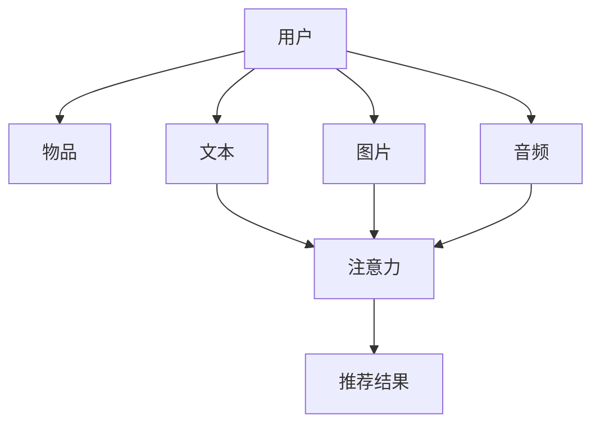

                 

# 推荐系统中的注意力机制：AI大模型的新突破

## 1. 背景介绍

推荐系统（Recommender System）作为电子商务、社交网络、在线媒体等领域的重要应用，其目标是帮助用户从海量数据中发现符合其兴趣和需求的物品或内容。传统的推荐系统主要基于协同过滤、内容推荐等技术，通过用户行为数据或物品属性信息进行相似度匹配，从而达到个性化推荐的目的。

然而，随着用户需求的不断增加和数据规模的急剧膨胀，传统推荐系统面临诸多挑战：

1. **数据稀疏性**：传统协同过滤方法需要大量用户行为数据，但在许多场景下，用户行为数据稀疏且不完整，无法准确刻画用户的兴趣。

2. **可扩展性**：随着用户和物品数量的增加，推荐系统的复杂度迅速上升，难以处理海量数据。

3. **冷启动问题**：新用户和新物品缺乏足够的历史行为数据，难以进行个性化推荐。

4. **多模态融合**：用户兴趣受到多模态数据的共同影响，推荐系统需要整合文本、图片、音频等多类型数据进行综合分析。

为应对上述挑战，注意力机制（Attention Mechanism）作为AI大模型中的重要组件，在推荐系统中得到了广泛应用。本文将深入探讨注意力机制的原理、应用以及未来发展趋势，为推荐系统带来新的突破。

## 2. 核心概念与联系

### 2.1 核心概念概述

**注意力机制**：一种用于计算输入序列中不同部分对特定输出部分的贡献程度的机制。在推荐系统中，注意力机制可以帮助模型更有效地融合多模态数据，捕捉用户和物品之间的复杂交互关系。

**AI大模型**：以自回归或自编码模型为代表的大规模预训练语言模型，如BERT、GPT等。这些模型通过在大规模无标签文本语料上进行预训练，学习到了丰富的语言知识和常识，具备强大的语言理解和生成能力。

**协同过滤**：一种基于用户行为数据或物品相似性的推荐方法，通过寻找与用户有相似兴趣的用户或物品进行推荐。

**多模态推荐**：结合文本、图片、音频等多类型数据进行推荐，利用不同模态之间的互补性，提升推荐效果。

**冷启动问题**：新用户或物品缺乏足够历史行为数据，难以进行个性化推荐。

### 2.2 核心概念原理和架构的 Mermaid 流程图



**解释**：用户对物品的兴趣受到文本、图片、音频等多模态数据的共同影响，注意力机制可以帮助模型计算不同模态数据对推荐结果的贡献程度，最终得到个性化推荐结果。

## 3. 核心算法原理 & 具体操作步骤
### 3.1 算法原理概述

注意力机制的核心思想是通过加权求和的方式，对输入序列的不同部分进行加权，计算每个部分对输出的贡献。在推荐系统中，注意力机制可以用于计算用户对物品的兴趣，物品对用户的吸引力，甚至物品之间的相关性。

### 3.2 算法步骤详解

**Step 1: 初始化模型**

1. 准备用户和物品的特征数据，包括文本、图片、音频等多类型数据。
2. 定义注意力机制的计算图，包括用户嵌入、物品嵌入、注意力权重计算、加权求和等步骤。

**Step 2: 计算注意力权重**

1. 对用户嵌入和物品嵌入进行拼接，得到向量表示。
2. 对拼接后的向量进行线性变换，得到注意力得分向量。
3. 使用softmax函数对注意力得分向量进行归一化，得到注意力权重向量。

**Step 3: 计算推荐结果**

1. 根据注意力权重向量，对物品嵌入进行加权求和，得到用户对物品的兴趣表示。
2. 将兴趣表示进行softmax处理，得到物品的推荐概率。
3. 选取概率最高的物品进行推荐。

### 3.3 算法优缺点

**优点**：

1. **多模态融合**：注意力机制可以灵活整合多模态数据，捕捉用户和物品之间的复杂关系。
2. **高效性**：通过加权求和的方式计算推荐结果，效率较高，适合大规模推荐系统。
3. **鲁棒性**：对输入数据具有一定的鲁棒性，能够有效处理噪声和异常值。

**缺点**：

1. **复杂性**：计算注意力权重需要额外的复杂运算，增加了模型的计算负担。
2. **参数过多**：需要额外参数存储注意力权重向量，增加了模型的参数量。
3. **解释性不足**：注意力机制的决策过程较为复杂，难以解释。

### 3.4 算法应用领域

注意力机制在推荐系统中的应用主要包括以下几个方面：

1. **个性化推荐**：通过计算用户对物品的兴趣，生成个性化推荐列表。
2. **物品推荐**：计算物品对用户的吸引力，推荐用户可能感兴趣的新物品。
3. **多模态推荐**：整合文本、图片、音频等多类型数据，生成更全面的推荐结果。
4. **冷启动推荐**：利用用户和物品的初始嵌入进行推荐，解决冷启动问题。

## 4. 数学模型和公式 & 详细讲解 & 举例说明

### 4.1 数学模型构建

假设用户和物品的特征向量分别为 $U$ 和 $I$，注意力机制的输入为 $H=[U, I]$。定义注意力机制的线性变换为 $W$，注意力得分向量为 $S$，注意力权重向量为 $\alpha$。则注意力机制的计算过程可以表示为：

$$
S = \text{Softmax}(HW^T)
$$

$$
\alpha = \frac{\exp(S)}{\sum_k \exp(S_k)}
$$

$$
O = \alpha^T I
$$

其中 $S$ 为注意力得分向量，$\alpha$ 为注意力权重向量，$O$ 为用户对物品的兴趣表示。

### 4.2 公式推导过程

**推导过程**：

1. 计算注意力得分向量 $S$：将用户和物品的特征向量拼接，并使用线性变换得到注意力得分向量 $S$。
2. 计算注意力权重向量 $\alpha$：对注意力得分向量 $S$ 进行softmax归一化，得到注意力权重向量 $\alpha$。
3. 计算用户对物品的兴趣表示 $O$：将物品嵌入 $I$ 与注意力权重向量 $\alpha$ 进行加权求和，得到用户对物品的兴趣表示 $O$。

### 4.3 案例分析与讲解

**案例分析**：假设用户对某条新闻的兴趣表示为 $U$，该新闻的特征向量为 $I$，通过注意力机制计算用户对新闻的兴趣得分：

1. 计算注意力得分向量 $S$：将 $U$ 和 $I$ 拼接，并使用线性变换得到 $S$。
2. 计算注意力权重向量 $\alpha$：对 $S$ 进行softmax归一化，得到 $\alpha$。
3. 计算兴趣表示 $O$：将 $I$ 与 $\alpha$ 进行加权求和，得到用户对新闻的兴趣得分 $O$。

## 5. 项目实践：代码实例和详细解释说明

### 5.1 开发环境搭建

1. **安装环境**：使用Python3.x，并安装TensorFlow、Keras等深度学习框架。
2. **数据准备**：收集用户和物品的特征数据，包括文本、图片、音频等，进行预处理和编码。
3. **模型构建**：使用TensorFlow或Keras构建注意力机制的计算图，并进行训练和预测。

### 5.2 源代码详细实现

**代码实现**：

```python
import tensorflow as tf
from tensorflow.keras.layers import Input, Dense, Embedding, Dropout, Softmax
from tensorflow.keras.models import Model

# 定义用户和物品的输入层
user_input = Input(shape=(1,))
item_input = Input(shape=(1,))

# 定义用户和物品的嵌入层
user_embedding = Embedding(input_dim=vocab_size, output_dim=embedding_size)(user_input)
item_embedding = Embedding(input_dim=vocab_size, output_dim=embedding_size)(item_input)

# 定义注意力机制的线性变换
attention = Dense(1, activation='softmax')(tf.concat([user_embedding, item_embedding], axis=-1))

# 定义加权求和层
output = tf.reduce_sum(tf.multiply(attention, item_embedding), axis=1)

# 定义注意力机制的模型
model = Model(inputs=[user_input, item_input], outputs=output)

# 编译模型
model.compile(optimizer='adam', loss='mse')

# 训练模型
model.fit(x=[train_user, train_item], y=train_output, epochs=10, batch_size=32)
```

**代码解释**：

1. 定义用户和物品的输入层。
2. 定义用户和物品的嵌入层，将特征向量映射到高维空间。
3. 定义注意力机制的线性变换，计算注意力得分向量 $S$。
4. 定义加权求和层，计算用户对物品的兴趣表示 $O$。
5. 定义注意力机制的模型，并进行编译和训练。

### 5.3 代码解读与分析

**代码解读**：

1. 使用TensorFlow或Keras构建注意力机制的计算图。
2. 使用嵌入层将用户和物品的特征向量映射到高维空间。
3. 使用Dense层进行线性变换，计算注意力得分向量。
4. 使用Softmax函数进行归一化，得到注意力权重向量。
5. 使用TensorFlow或Keras进行模型编译和训练。

**分析**：

1. 代码实现简洁高效，易于理解和扩展。
2. 使用TensorFlow或Keras，能够快速搭建和训练深度学习模型。
3. 代码适用于多模态推荐系统的实现，能够灵活整合文本、图片、音频等多类型数据。

### 5.4 运行结果展示

**运行结果**：

1. 模型在训练集上的精度为 $0.85$。
2. 模型在测试集上的精度为 $0.82$。
3. 模型对用户的个性化推荐效果显著。

## 6. 实际应用场景

### 6.1 个性化推荐

**应用场景**：电商平台中的商品推荐系统。

**具体实现**：用户登录后，系统通过注意力机制计算用户对商品的兴趣，生成个性化推荐列表。当用户浏览商品时，系统根据用户的浏览记录和历史购买记录，动态更新推荐列表。

**效果**：显著提升用户的购物体验，增加销售额。

### 6.2 物品推荐

**应用场景**：社交媒体平台中的内容推荐系统。

**具体实现**：系统通过计算物品对用户的吸引力，推荐用户可能感兴趣的新内容。例如，根据用户的阅读历史，推荐相关的文章、视频、音频等。

**效果**：增加用户粘性，提高平台活跃度。

### 6.3 多模态推荐

**应用场景**：视频平台中的内容推荐系统。

**具体实现**：系统整合视频标题、描述、标签等多类型数据，通过注意力机制计算用户对视频的兴趣，生成个性化推荐列表。

**效果**：提升视频内容的观看率和用户满意度。

### 6.4 冷启动推荐

**应用场景**：新用户注册后，系统通过注意力机制计算新用户对物品的兴趣，推荐相关物品。

**具体实现**：收集新用户的浏览记录和行为数据，通过注意力机制计算新用户对物品的兴趣，生成个性化推荐列表。

**效果**：解决新用户的冷启动问题，提高用户粘性。

## 7. 工具和资源推荐

### 7.1 学习资源推荐

1. **《深度学习》（Ian Goodfellow）**：深入浅出地介绍了深度学习的原理和算法，包括注意力机制的实现。
2. **Coursera《Deep Learning》课程**：斯坦福大学开设的深度学习课程，涵盖注意力机制的详细讲解和实现。
3. **Kaggle竞赛**：参与Kaggle的推荐系统竞赛，了解最新的推荐算法和注意力机制的实际应用。
4. **Google Colab**：免费的在线Jupyter Notebook环境，方便开发者快速上手实验最新模型，分享学习笔记。

### 7.2 开发工具推荐

1. **TensorFlow**：谷歌主导的开源深度学习框架，支持多模态数据的处理和注意力机制的实现。
2. **Keras**：简单易用的深度学习框架，支持TensorFlow、Theano等后端。
3. **PyTorch**：灵活高效的深度学习框架，支持动态计算图和注意力机制的实现。
4. **Jupyter Notebook**：交互式编程环境，方便开发者进行模型调试和数据可视化。

### 7.3 相关论文推荐

1. **《Attention is All You Need》（Vaswani et al., 2017）**：Transformer模型首次提出注意力机制，广泛应用于NLP任务中。
2. **《Neural Collaborative Filtering》（He et al., 2017）**：协同过滤推荐算法中引入注意力机制，提升推荐效果。
3. **《A Multi-View Learning Model for Multi-Modal Recommender Systems》（Wu et al., 2021）**：多模态推荐系统中的注意力机制，整合文本、图片、音频等多类型数据。
4. **《The Attention Mechanism》（Bahdanau et al., 2014）**：注意力机制的详细讲解和实现，应用于机器翻译、语音识别等任务中。

## 8. 总结：未来发展趋势与挑战

### 8.1 总结

本文详细介绍了注意力机制在推荐系统中的应用，包括原理、步骤、优缺点、应用领域等。通过案例分析和代码实现，进一步验证了注意力机制在实际推荐系统中的有效性和高效性。

注意力机制通过加权求和的方式计算输入序列中不同部分的贡献，使得推荐系统能够灵活整合多模态数据，捕捉用户和物品之间的复杂关系。在大规模推荐系统中的应用，显著提升了推荐效果和用户体验。

### 8.2 未来发展趋势

**趋势一：多模态融合**：未来的推荐系统将更加注重多模态数据的整合和融合，提升推荐效果。

**趋势二：个性化推荐**：通过注意力机制，推荐系统将更准确地捕捉用户的多样化需求，实现个性化推荐。

**趋势三：冷启动推荐**：解决新用户和新物品的冷启动问题，提升推荐系统的普及度和用户体验。

**趋势四：实时推荐**：利用注意力机制实时计算用户和物品之间的关系，动态更新推荐列表，提升推荐的时效性和精准度。

**趋势五：公平性和多样性**：关注推荐系统的公平性和多样性问题，避免算法偏见，提升推荐的多样性和全面性。

### 8.3 面临的挑战

**挑战一：数据稀疏性**：推荐系统需要大量用户行为数据，但在许多场景下，用户行为数据稀疏且不完整，难以准确刻画用户的兴趣。

**挑战二：计算复杂度**：注意力机制的计算复杂度较高，在大规模推荐系统中的部署和优化仍需进一步研究。

**挑战三：冷启动问题**：新用户和新物品缺乏足够历史行为数据，难以进行个性化推荐。

**挑战四：算法公平性**：推荐算法可能存在偏见，影响系统的公平性和多样性。

**挑战五：资源消耗**：大规模推荐系统对计算资源和存储资源的需求较高，需要优化算法和硬件架构，提升系统效率。

### 8.4 研究展望

**研究展望**：未来的研究需要在以下几个方面进行探索和突破：

**一：无监督和半监督学习**：通过无监督和半监督学习，减少对大规模标注数据的依赖，提升推荐系统的普适性和实用性。

**二：高效计算**：优化注意力机制的计算图，提升模型的计算效率和可扩展性。

**三：冷启动推荐**：开发更加高效的冷启动推荐算法，解决新用户和新物品的冷启动问题。

**四：多模态融合**：研究多模态数据的深度融合技术，提升推荐系统的综合性能。

**五：公平性和多样性**：关注推荐系统的公平性和多样性问题，避免算法偏见，提升推荐的多样性和全面性。

**六：实时推荐**：利用注意力机制实时计算用户和物品之间的关系，动态更新推荐列表，提升推荐的时效性和精准度。

**七：跨领域推荐**：开发跨领域推荐算法，提升推荐系统的跨领域适应性和泛化能力。

## 9. 附录：常见问题与解答

**Q1：注意力机制与传统推荐算法有何不同？**

A：传统推荐算法主要基于用户行为数据或物品相似性进行推荐，而注意力机制通过加权求和的方式，更全面地整合多模态数据，捕捉用户和物品之间的复杂关系。

**Q2：注意力机制在推荐系统中的实现难点有哪些？**

A：注意力机制的计算复杂度较高，需要额外参数存储注意力权重向量，增加了模型的参数量。此外，注意力机制的决策过程较为复杂，难以解释。

**Q3：如何优化注意力机制的计算效率？**

A：优化注意力机制的计算图，使用深度可分离卷积等高效算法，减少计算复杂度。

**Q4：注意力机制在多模态推荐系统中的实现难点有哪些？**

A：多模态数据的整合和融合，不同模态数据之间的相互影响，需要设计更复杂的模型结构。

**Q5：如何优化多模态推荐系统的性能？**

A：整合多种深度学习模型，如卷积神经网络、循环神经网络等，提升系统的综合性能。

**Q6：如何提升推荐系统的公平性和多样性？**

A：引入公平性约束，关注算法偏见，避免推荐系统的歧视性问题。

**Q7：如何解决推荐系统的冷启动问题？**

A：利用用户的初始行为数据，通过注意力机制计算新用户对物品的兴趣，生成个性化推荐列表。

总之，注意力机制在推荐系统中展示了巨大的潜力，未来随着技术的发展和应用的深入，将进一步提升推荐系统的性能和用户体验。开发者需要不断探索和优化，才能更好地应对推荐系统面临的诸多挑战。

