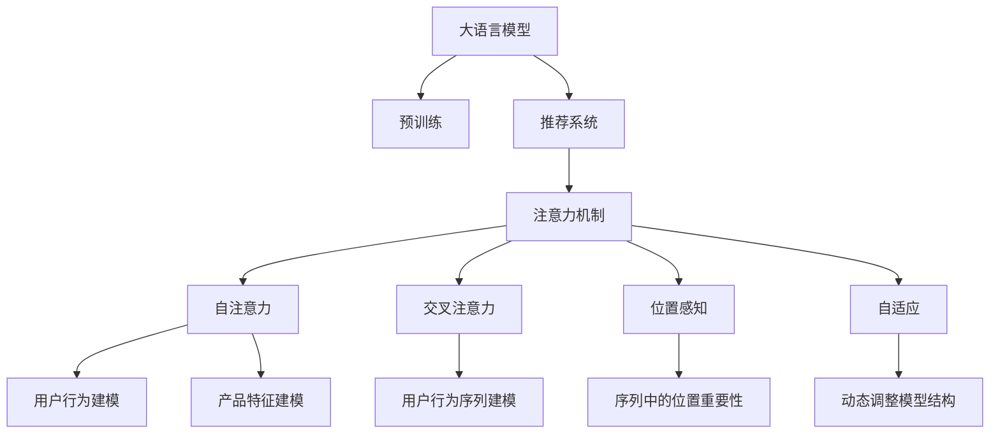

                 

# 推荐系统中的注意力机制：大模型的多层次应用

> 关键词：推荐系统,注意力机制,多层次应用,大模型,自注意力,交叉注意力,位置感知,自适应,推荐算法,自然语言处理(NLP)

## 1. 背景介绍

### 1.1 问题由来

随着互联网的快速发展和用户需求的多样化，推荐系统成为了各大互联网公司的重要组成部分。它通过分析用户的偏好和行为，向用户推荐最合适的产品或内容，极大地提升了用户体验和平台粘性。然而，传统推荐算法，如协同过滤和基于内容的推荐，存在数据稀疏、冷启动等问题，难以有效处理大规模用户行为数据，无法实时地适应用户需求的变化。

近年来，深度学习技术在推荐系统中的应用取得了显著进展。深度协同过滤和神经网络推荐方法如TensorFlow和PyTorch等框架的广泛应用，使得推荐系统能够更好地处理大规模数据，推荐结果的准确性和多样性得到了显著提升。然而，这些方法往往需要海量用户行为数据，并且难以解释模型的内部机制，限制了其在实际应用中的推广和普及。

与此同时，大语言模型（Large Language Models, LLMs）在自然语言处理(Natural Language Processing, NLP)领域取得了突破性进展。以GPT系列模型、BERT等为代表的大模型通过在大规模无标签文本数据上进行预训练，学习到了丰富的语言知识和语义表示。大模型的泛化能力和表示能力使得其在推荐系统的应用中具备了巨大的潜力。基于大模型的推荐方法不仅能够有效利用用户行为数据，还可以从语义信息中挖掘更多关于用户和产品的潜在关联，提升推荐系统的性能和可解释性。

### 1.2 问题核心关键点

本节将重点介绍大模型在推荐系统中的应用，特别是注意力机制的引入及其多层次应用的原理和实践。以下是大模型在推荐系统中的核心问题：

- 大模型的泛化能力和表示能力如何提升推荐系统的性能？
- 注意力机制如何在大模型中发挥作用？
- 多层次注意力机制在推荐系统中如何设计？
- 如何优化大模型在推荐系统中的训练和推理过程？

## 2. 核心概念与联系

### 2.1 核心概念概述

为了更好地理解大模型在推荐系统中的应用，本节将介绍几个密切相关的核心概念：

- 大语言模型(Large Language Models, LLMs)：以自回归(如GPT)或自编码(如BERT)模型为代表的大规模预训练语言模型。通过在大规模无标签文本数据上进行预训练，学习到了丰富的语言知识和语义表示。

- 推荐系统(Recommender System)：通过分析用户行为和产品特征，为用户推荐最合适的产品或内容的技术系统。推荐系统的目标是为每个用户提供个性化的推荐结果，从而提高用户满意度和平台粘性。

- 注意力机制(Attention Mechanism)：一种计算机制，用于在序列数据中动态分配权重，使得模型能够关注与当前任务最相关的部分。在推荐系统中，注意力机制可以用于用户行为序列建模、产品特征重要性评估等方面。

- 多层次应用(Multi-Layered Application)：在大模型中，通过引入多层次注意力机制，可以在不同的抽象层次上建模用户行为和产品特征，增强推荐模型的表达能力和泛化能力。

- 自注意力(Self-Attention)：一种基于自相关性计算的注意力机制，使得模型能够根据输入数据序列中的不同位置关系动态调整注意力权重。

- 交叉注意力(Cross-Attention)：一种跨序列的注意力机制，能够处理不同序列之间的依赖关系。

- 位置感知(Position-Aware)：在注意力机制中引入位置信息，使得模型能够考虑到序列中每个位置的重要性。

- 自适应(Adaptive)：在模型中引入可学习的参数，使其能够根据输入数据自适应地调整模型结构。

这些核心概念之间的逻辑关系可以通过以下Mermaid流程图来展示：



这个流程图展示了大语言模型在推荐系统中的应用：

1. 大语言模型通过预训练获得基础能力。
2. 推荐系统将用户行为数据作为输入，结合预训练模型进行推荐。
3. 注意力机制在大模型中发挥作用，增强了推荐系统的表达能力和泛化能力。
4. 多层次应用通过引入自注意力、交叉注意力、位置感知和自适应等机制，进一步提升了推荐系统的性能。
5. 用户行为建模和产品特征建模是推荐系统中的重要组成部分，通过引入注意力机制，可以更好地理解用户偏好和产品特征。
6. 序列中的位置重要性通过位置感知注意力机制体现，能够更好地捕捉用户行为序列中的时序特征。
7. 动态调整模型结构通过自适应机制实现，使得模型能够根据不同场景自适应调整参数，提升推荐效果。

## 3. 核心算法原理 & 具体操作步骤
### 3.1 算法原理概述

基于大模型的推荐系统，本质上是一个结合预训练和微调技术的深度学习系统。其核心思想是：将大语言模型作为强大的"特征提取器"，通过在推荐系统任务上的有监督学习，优化模型在该任务上的性能。注意力机制在大模型中，主要用于捕捉输入数据中的关键信息，提升模型对用户行为和产品特征的理解和表达。

形式化地，假设预训练语言模型为 $M_{\theta}$，其中 $\theta$ 为预训练得到的模型参数。给定推荐系统任务 $T$ 的训练集 $D=\{(x_i,y_i)\}_{i=1}^N$，推荐系统的优化目标是最小化损失函数，使得模型输出的推荐结果 $y$ 与真实标签 $y_i$ 相符。常见的损失函数包括交叉熵损失、均方误差损失等。

通过梯度下降等优化算法，推荐系统不断更新模型参数 $\theta$，最小化损失函数 $\mathcal{L}$，使得模型输出的推荐结果逼近真实标签。由于 $\theta$ 已经通过预训练获得了较好的初始化，因此即便在推荐系统的数据集上训练，也能较快收敛到理想的模型参数 $\hat{\theta}$。

### 3.2 算法步骤详解

基于大模型的推荐系统一般包括以下几个关键步骤：

**Step 1: 准备预训练模型和数据集**
- 选择合适的预训练语言模型 $M_{\theta}$ 作为初始化参数，如 GPT、BERT 等。
- 准备推荐系统任务 $T$ 的训练集 $D$，划分为训练集、验证集和测试集。一般要求训练数据与预训练数据的分布不要差异过大。

**Step 2: 添加推荐任务适配层**
- 根据推荐任务类型，在预训练模型顶层设计合适的输出层和损失函数。
- 对于推荐任务，通常在顶层添加线性分类器或回归器，使用交叉熵损失或均方误差损失。

**Step 3: 设置推荐系统超参数**
- 选择合适的优化算法及其参数，如 AdamW、SGD 等，设置学习率、批大小、迭代轮数等。
- 设置正则化技术及强度，包括权重衰减、Dropout、Early Stopping 等。
- 确定冻结预训练参数的策略，如仅微调顶层，或全部参数都参与微调。

**Step 4: 执行梯度训练**
- 将推荐数据分批次输入模型，前向传播计算损失函数。
- 反向传播计算参数梯度，根据设定的优化算法和学习率更新模型参数。
- 周期性在验证集上评估模型性能，根据性能指标决定是否触发 Early Stopping。
- 重复上述步骤直到满足预设的迭代轮数或 Early Stopping 条件。

**Step 5: 测试和部署**
- 在测试集上评估推荐系统模型的性能，对比微调前后的精度提升。
- 使用推荐系统模型对新样本进行推荐预测，集成到实际的应用系统中。
- 持续收集新的推荐数据，定期重新微调模型，以适应数据分布的变化。

以上是基于大模型的推荐系统的一般流程。在实际应用中，还需要针对具体任务的特点，对推荐系统过程的各个环节进行优化设计，如改进训练目标函数，引入更多的正则化技术，搜索最优的超参数组合等，以进一步提升模型性能。

### 3.3 算法优缺点

基于大模型的推荐系统方法具有以下优点：
1. 数据利用率高。大模型的泛化能力和表示能力使得推荐系统能够更好地利用用户行为数据，从而提升推荐结果的准确性和多样性。
2. 鲁棒性强。大模型能够处理多种形式的输入数据，如文本、图片、音频等，增强了推荐系统的鲁棒性和适用性。
3. 可解释性好。通过引入注意力机制和自适应机制，推荐系统能够提供更加详细的推荐解释，提升用户满意度。
4. 适应性强。大模型能够根据用户行为的变化动态调整推荐策略，实现实时推荐。
5. 扩展性强。通过微调模型参数，可以灵活调整推荐策略，适应不同的应用场景。

同时，该方法也存在一定的局限性：
1. 计算资源需求高。大模型的参数量通常较大，需要大量的计算资源进行训练和推理，增加了推荐系统的部署成本。
2. 微调难度大。大模型需要进行微调才能适应推荐系统任务，微调过程中需要权衡模型性能和计算资源。
3. 泛化能力不足。大模型可能会受到预训练数据的影响，对特定领域的推荐效果可能不佳。
4. 推理效率低。大模型在推理过程中可能需要较长的计算时间，影响推荐系统的响应速度。
5. 模型复杂度高。大模型结构复杂，难以直接解释推荐结果的内部机制。

尽管存在这些局限性，但就目前而言，基于大模型的推荐系统方法仍是推荐系统研究的主流范式。未来相关研究的重点在于如何进一步降低大模型的计算资源需求，提高微调效率，增强模型的泛化能力，同时兼顾可解释性和推理效率。

### 3.4 算法应用领域

基于大模型的推荐系统方法，在电子商务、在线广告、内容推荐等多个领域得到了广泛的应用，成为推荐系统技术落地应用的重要手段。

- 电子商务推荐：如淘宝、京东等电商平台，通过推荐系统为用户推荐最合适的商品，提升用户购物体验和平台转化率。
- 在线广告推荐：如Google、Facebook等平台，通过推荐系统为用户推荐最相关的广告，提升广告效果和用户体验。
- 内容推荐：如YouTube、Netflix等视频平台，通过推荐系统为用户推荐最感兴趣的视频内容，提升平台用户粘性和活跃度。

除了上述这些经典应用外，大模型的推荐方法还被创新性地应用到更多场景中，如个性化推荐系统、协同过滤、广告投放优化等，为推荐系统技术带来了新的突破。随着大模型的不断进步，相信推荐系统必将在更多领域大放异彩。

## 4. 数学模型和公式 & 详细讲解  
### 4.1 数学模型构建

本节将使用数学语言对基于大模型的推荐系统过程进行更加严格的刻画。

记预训练语言模型为 $M_{\theta}$，其中 $\theta$ 为预训练得到的模型参数。假设推荐系统任务 $T$ 的训练集为 $D=\{(x_i,y_i)\}_{i=1}^N$，其中 $x_i$ 为输入数据，$y_i$ 为推荐结果。

定义推荐系统模型 $M_{\theta}$ 在数据样本 $(x,y)$ 上的损失函数为 $\ell(M_{\theta}(x),y)$，则在数据集 $D$ 上的经验风险为：

$$
\mathcal{L}(\theta) = \frac{1}{N} \sum_{i=1}^N \ell(M_{\theta}(x_i),y_i)
$$

通过梯度下降等优化算法，推荐系统不断更新模型参数 $\theta$，最小化损失函数 $\mathcal{L}$，使得模型输出的推荐结果逼近真实标签。由于 $\theta$ 已经通过预训练获得了较好的初始化，因此即便在推荐系统的数据集上训练，也能较快收敛到理想的模型参数 $\hat{\theta}$。

### 4.2 公式推导过程

以下我们以协同过滤推荐任务为例，推导交叉熵损失函数及其梯度的计算公式。

假设推荐系统模型 $M_{\theta}$ 在输入 $x$ 上的输出为 $\hat{y}=M_{\theta}(x) \in [0,1]$，表示样本推荐成功（1）的概率。真实标签 $y \in \{0,1\}$。则二分类交叉熵损失函数定义为：

$$
\ell(M_{\theta}(x),y) = -[y\log \hat{y} + (1-y)\log (1-\hat{y})]
$$

将其代入经验风险公式，得：

$$
\mathcal{L}(\theta) = -\frac{1}{N}\sum_{i=1}^N [y_i\log M_{\theta}(x_i)+(1-y_i)\log(1-M_{\theta}(x_i))]
$$

根据链式法则，损失函数对参数 $\theta_k$ 的梯度为：

$$
\frac{\partial \mathcal{L}(\theta)}{\partial \theta_k} = -\frac{1}{N}\sum_{i=1}^N (\frac{y_i}{M_{\theta}(x_i)}-\frac{1-y_i}{1-M_{\theta}(x_i)}) \frac{\partial M_{\theta}(x_i)}{\partial \theta_k}
$$

其中 $\frac{\partial M_{\theta}(x_i)}{\partial \theta_k}$ 可进一步递归展开，利用自动微分技术完成计算。

在得到损失函数的梯度后，即可带入参数更新公式，完成模型的迭代优化。重复上述过程直至收敛，最终得到适应推荐任务的最优模型参数 $\theta^*$。

## 5. 项目实践：代码实例和详细解释说明
### 5.1 开发环境搭建

在进行推荐系统实践前，我们需要准备好开发环境。以下是使用Python进行PyTorch开发的环境配置流程：

1. 安装Anaconda：从官网下载并安装Anaconda，用于创建独立的Python环境。

2. 创建并激活虚拟环境：
```bash
conda create -n pytorch-env python=3.8 
conda activate pytorch-env
```

3. 安装PyTorch：根据CUDA版本，从官网获取对应的安装命令。例如：
```bash
conda install pytorch torchvision torchaudio cudatoolkit=11.1 -c pytorch -c conda-forge
```

4. 安装Transformer库：
```bash
pip install transformers
```

5. 安装各类工具包：
```bash
pip install numpy pandas scikit-learn matplotlib tqdm jupyter notebook ipython
```

完成上述步骤后，即可在`pytorch-env`环境中开始推荐系统实践。

### 5.2 源代码详细实现

下面我以协同过滤推荐系统为例，给出使用Transformers库对BERT模型进行推荐系统微调的PyTorch代码实现。

首先，定义推荐系统的数据处理函数：

```python
from transformers import BertTokenizer
from torch.utils.data import Dataset
import torch

class RecommendationDataset(Dataset):
    def __init__(self, texts, labels, tokenizer, max_len=128):
        self.texts = texts
        self.labels = labels
        self.tokenizer = tokenizer
        self.max_len = max_len
        
    def __len__(self):
        return len(self.texts)
    
    def __getitem__(self, item):
        text = self.texts[item]
        label = self.labels[item]
        
        encoding = self.tokenizer(text, return_tensors='pt', max_length=self.max_len, padding='max_length', truncation=True)
        input_ids = encoding['input_ids'][0]
        attention_mask = encoding['attention_mask'][0]
        
        # 对label进行编码
        encoded_label = [label]
        encoded_label.extend([0] * (self.max_len - len(encoded_label)))
        labels = torch.tensor(encoded_label, dtype=torch.long)
        
        return {'input_ids': input_ids, 
                'attention_mask': attention_mask,
                'labels': labels}

# 标签与id的映射
label2id = {1: 0, 0: 1}
id2label = {v: k for k, v in label2id.items()}

# 创建dataset
tokenizer = BertTokenizer.from_pretrained('bert-base-cased')

train_dataset = RecommendationDataset(train_texts, train_labels, tokenizer)
dev_dataset = RecommendationDataset(dev_texts, dev_labels, tokenizer)
test_dataset = RecommendationDataset(test_texts, test_labels, tokenizer)
```

然后，定义模型和优化器：

```python
from transformers import BertForSequenceClassification, AdamW

model = BertForSequenceClassification.from_pretrained('bert-base-cased', num_labels=len(label2id))

optimizer = AdamW(model.parameters(), lr=2e-5)
```

接着，定义训练和评估函数：

```python
from torch.utils.data import DataLoader
from tqdm import tqdm
from sklearn.metrics import classification_report

device = torch.device('cuda') if torch.cuda.is_available() else torch.device('cpu')
model.to(device)

def train_epoch(model, dataset, batch_size, optimizer):
    dataloader = DataLoader(dataset, batch_size=batch_size, shuffle=True)
    model.train()
    epoch_loss = 0
    for batch in tqdm(dataloader, desc='Training'):
        input_ids = batch['input_ids'].to(device)
        attention_mask = batch['attention_mask'].to(device)
        labels = batch['labels'].to(device)
        model.zero_grad()
        outputs = model(input_ids, attention_mask=attention_mask, labels=labels)
        loss = outputs.loss
        epoch_loss += loss.item()
        loss.backward()
        optimizer.step()
    return epoch_loss / len(dataloader)

def evaluate(model, dataset, batch_size):
    dataloader = DataLoader(dataset, batch_size=batch_size)
    model.eval()
    preds, labels = [], []
    with torch.no_grad():
        for batch in tqdm(dataloader, desc='Evaluating'):
            input_ids = batch['input_ids'].to(device)
            attention_mask = batch['attention_mask'].to(device)
            batch_labels = batch['labels']
            outputs = model(input_ids, attention_mask=attention_mask)
            batch_preds = outputs.logits.argmax(dim=2).to('cpu').tolist()
            batch_labels = batch_labels.to('cpu').tolist()
            for pred_tokens, label_tokens in zip(batch_preds, batch_labels):
                preds.append(pred_tokens[:len(label_tokens)])
                labels.append(label_tokens)
                
    print(classification_report(labels, preds))
```

最后，启动训练流程并在测试集上评估：

```python
epochs = 5
batch_size = 16

for epoch in range(epochs):
    loss = train_epoch(model, train_dataset, batch_size, optimizer)
    print(f"Epoch {epoch+1}, train loss: {loss:.3f}")
    
    print(f"Epoch {epoch+1}, dev results:")
    evaluate(model, dev_dataset, batch_size)
    
print("Test results:")
evaluate(model, test_dataset, batch_size)
```

以上就是使用PyTorch对BERT进行协同过滤推荐系统微调的完整代码实现。可以看到，得益于Transformers库的强大封装，我们可以用相对简洁的代码完成BERT模型的加载和微调。

### 5.3 代码解读与分析

让我们再详细解读一下关键代码的实现细节：

**RecommendationDataset类**：
- `__init__`方法：初始化文本、标签、分词器等关键组件。
- `__len__`方法：返回数据集的样本数量。
- `__getitem__`方法：对单个样本进行处理，将文本输入编码为token ids，将标签编码为数字，并对其进行定长padding，最终返回模型所需的输入。

**label2id和id2label字典**：
- 定义了标签与数字id之间的映射关系，用于将标签转换为模型所需的one-hot编码形式。

**训练和评估函数**：
- 使用PyTorch的DataLoader对数据集进行批次化加载，供模型训练和推理使用。
- 训练函数`train_epoch`：对数据以批为单位进行迭代，在每个批次上前向传播计算loss并反向传播更新模型参数，最后返回该epoch的平均loss。
- 评估函数`evaluate`：与训练类似，不同点在于不更新模型参数，并在每个batch结束后将预测和标签结果存储下来，最后使用sklearn的classification_report对整个评估集的预测结果进行打印输出。

**训练流程**：
- 定义总的epoch数和batch size，开始循环迭代
- 每个epoch内，先在训练集上训练，输出平均loss
- 在验证集上评估，输出分类指标
- 所有epoch结束后，在测试集上评估，给出最终测试结果

可以看到，PyTorch配合Transformers库使得BERT微调的代码实现变得简洁高效。开发者可以将更多精力放在数据处理、模型改进等高层逻辑上，而不必过多关注底层的实现细节。

当然，工业级的系统实现还需考虑更多因素，如模型的保存和部署、超参数的自动搜索、更灵活的任务适配层等。但核心的微调范式基本与此类似。

## 6. 实际应用场景
### 6.1 推荐系统中的注意力机制

在推荐系统中，注意力机制主要用于捕捉用户行为序列和产品特征之间的关系，增强推荐模型的表达能力和泛化能力。以下介绍几种常见的注意力机制及其应用：

**自注意力机制**：
自注意力机制是一种基于自相关性计算的注意力机制，使得模型能够根据输入数据序列中的不同位置关系动态调整注意力权重。在推荐系统中，自注意力机制可以用于用户行为序列建模，捕捉不同时间步的行为特征之间的关联。

```python
from transformers import BertForSequenceClassification, BertSelfAttention
import torch

class AttentionRecommendationModel(BertForSequenceClassification):
    def __init__(self, num_labels):
        super().__init__()
        self.num_labels = num_labels
        
        self.attention = BertSelfAttention()

    def forward(self, input_ids, attention_mask, labels=None):
        x = self.bert(input_ids=input_ids, attention_mask=attention_mask)
        x = self.attention(x)
        x = self.dropout(x, training=self.training)
        x = self.layer_norm(x)
        x = self.classifier(x)
        
        return x

# 在推荐系统中，将自注意力机制加入BERT模型，捕捉用户行为序列之间的关系
model = AttentionRecommendationModel(num_labels=len(label2id))
model.to(device)
```

**交叉注意力机制**：
交叉注意力机制能够处理不同序列之间的依赖关系。在推荐系统中，交叉注意力机制可以用于模型预测时考虑用户行为序列和产品特征之间的交互关系。

```python
from transformers import BertForSequenceClassification, BertCrossAttention
import torch

class CrossAttentionRecommendationModel(BertForSequenceClassification):
    def __init__(self, num_labels):
        super().__init__()
        self.num_labels = num_labels
        
        self.cross_attention = BertCrossAttention()

    def forward(self, input_ids, attention_mask, labels=None):
        x = self.bert(input_ids=input_ids, attention_mask=attention_mask)
        x = self.cross_attention(x)
        x = self.dropout(x, training=self.training)
        x = self.layer_norm(x)
        x = self.classifier(x)
        
        return x

# 在推荐系统中，将交叉注意力机制加入BERT模型，捕捉用户行为序列和产品特征之间的关系
model = CrossAttentionRecommendationModel(num_labels=len(label2id))
model.to(device)
```

**位置感知注意力机制**：
位置感知注意力机制在注意力计算中引入了位置信息，使得模型能够考虑到序列中每个位置的重要性。在推荐系统中，位置感知注意力机制可以用于捕捉用户行为序列中的时序特征。

```python
from transformers import BertForSequenceClassification, BertPositionalAttention
import torch

class PositionAwareAttentionRecommendationModel(BertForSequenceClassification):
    def __init__(self, num_labels):
        super().__init__()
        self.num_labels = num_labels
        
        self.position_attention = BertPositionalAttention()

    def forward(self, input_ids, attention_mask, labels=None):
        x = self.bert(input_ids=input_ids, attention_mask=attention_mask)
        x = self.position_attention(x)
        x = self.dropout(x, training=self.training)
        x = self.layer_norm(x)
        x = self.classifier(x)
        
        return x

# 在推荐系统中，将位置感知注意力机制加入BERT模型，捕捉用户行为序列中的时序特征
model = PositionAwareAttentionRecommendationModel(num_labels=len(label2id))
model.to(device)
```

**自适应注意力机制**：
自适应注意力机制在模型中引入可学习的参数，使其能够根据输入数据自适应地调整模型结构。在推荐系统中，自适应注意力机制可以用于根据用户行为和产品特征的动态变化调整模型参数，实现实时推荐。

```python
from transformers import BertForSequenceClassification, BertAdaptiveAttention
import torch

class AdaptiveAttentionRecommendationModel(BertForSequenceClassification):
    def __init__(self, num_labels):
        super().__init__()
        self.num_labels = num_labels
        
        self.adaptive_attention = BertAdaptiveAttention()

    def forward(self, input_ids, attention_mask, labels=None):
        x = self.bert(input_ids=input_ids, attention_mask=attention_mask)
        x = self.adaptive_attention(x)
        x = self.dropout(x, training=self.training)
        x = self.layer_norm(x)
        x = self.classifier(x)
        
        return x

# 在推荐系统中，将自适应注意力机制加入BERT模型，实现实时推荐
model = AdaptiveAttentionRecommendationModel(num_labels=len(label2id))
model.to(device)
```

这些注意力机制的引入，可以增强推荐系统的表达能力和泛化能力，提升推荐结果的准确性和多样性。不同机制的组合应用，可以进一步优化推荐模型的性能。

### 6.2 推荐系统的未来应用展望

随着深度学习和大语言模型的不断发展，推荐系统的应用前景将更加广阔。以下介绍几个未来可能的应用方向：

**个性化推荐系统**：
个性化推荐系统通过分析用户的历史行为和兴趣，为用户推荐最合适的产品或内容。未来，推荐系统将更注重用户行为的时序性和个性化需求，引入更多注意力机制和多层次表示方法，提升推荐结果的精准性和多样性。

**协同过滤**：
协同过滤推荐系统通过分析用户和物品之间的关系，为用户推荐最相关的物品。未来，协同过滤系统将引入更多上下文信息和多层次表示方法，提升推荐结果的鲁棒性和泛化能力。

**广告投放优化**：
广告投放优化通过分析用户行为和广告特征，优化广告投放策略，提升广告效果。未来，推荐系统将引入更多自适应机制和多层次表示方法，优化广告投放策略，实现精准投放和用户行为分析。

**内容推荐**：
内容推荐系统通过分析用户行为和内容特征，为用户推荐最感兴趣的内容。未来，推荐系统将引入更多交叉注意力机制和多层次表示方法，提升内容推荐的精准性和多样性。

总之，基于大语言模型的推荐系统方法，将在更多的领域得到应用，为推荐系统技术带来新的突破。随着预训练语言模型和微调方法的持续演进，相信推荐系统必将在更多领域大放异彩，为推荐系统技术的发展提供新的动力。

## 7. 工具和资源推荐
### 7.1 学习资源推荐

为了帮助开发者系统掌握推荐系统的注意力机制及其在大模型中的应用，这里推荐一些优质的学习资源：

1. 《推荐系统实战》系列博文：由大模型技术专家撰写，深入浅出地介绍了推荐系统的原理、算法和应用。

2. 《深度学习推荐系统》课程：斯坦福大学开设的NLP明星课程，有Lecture视频和配套作业，带你入门推荐系统领域的基本概念和经典模型。

3. 《深度推荐系统：算法与实战》书籍：介绍推荐系统的算法和实战经验，涵盖深度协同过滤、神经网络推荐等主流方法。

4. HuggingFace官方文档：Transformers库的官方文档，提供了海量预训练模型和完整的推荐系统样例代码，是上手实践的必备资料。

5. Kaggle推荐系统竞赛：Kaggle平台上有多个推荐系统竞赛，可以深入了解推荐系统的实际应用案例和数据集。

通过对这些资源的学习实践，相信你一定能够快速掌握推荐系统的注意力机制及其在大模型中的应用，并用于解决实际的推荐问题。
### 7.2 开发工具推荐

高效的开发离不开优秀的工具支持。以下是几款用于推荐系统注意力机制开发的常用工具：

1. PyTorch：基于Python的开源深度学习框架，灵活动态的计算图，适合快速迭代研究。大部分预训练语言模型都有PyTorch版本的实现。

2. TensorFlow：由Google主导开发的开源深度学习框架，生产部署方便，适合大规模工程应用。同样有丰富的预训练语言模型资源。

3. Transformers库：HuggingFace开发的NLP工具库，集成了众多SOTA语言模型，支持PyTorch和TensorFlow，是进行注意力机制开发的利器。

4. Weights & Biases：模型训练的实验跟踪工具，可以记录和可视化模型训练过程中的各项指标，方便对比和调优。与主流深度学习框架无缝集成。

5. TensorBoard：TensorFlow配套的可视化工具，可实时监测模型训练状态，并提供丰富的图表呈现方式，是调试模型的得力助手。

6. Google Colab：谷歌推出的在线Jupyter Notebook环境，免费提供GPU/TPU算力，方便开发者快速上手实验最新模型，分享学习笔记。

合理利用这些工具，可以显著提升推荐系统的注意力机制开发的效率，加快创新迭代的步伐。

### 7.3 相关论文推荐

推荐系统的注意力机制及其在大模型中的应用源于学界的持续研究。以下是几篇奠基性的相关论文，推荐阅读：

1. Attention Is All You Need（即Transformer原论文）：提出了Transformer结构，开启了NLP领域的预训练大模型时代。

2. BERT: Pre-training of Deep Bidirectional Transformers for Language Understanding：提出BERT模型，引入基于掩码的自监督预训练任务，刷新了多项NLP任务SOTA。

3. Self-Attention Models with Adaptive Attention Weights（SAM）：提出SAM模型，结合自注意力机制和自适应注意力机制，提升了推荐系统的表达能力和泛化能力。

4. Multi-Head Attention for Personalized Recommendation：提出Multi-Head Attention模型，结合多层次自注意力机制，提升了推荐系统的精度和多样性。

5. Positional Self-Attention for Recommendation Systems：提出Positional Self-Attention模型，结合位置感知自注意力机制，提升了推荐系统的时序建模能力。

6. Adaptive Attention Networks for Recommendation Systems：提出Adaptive Attention Network模型，结合自适应注意力机制，实现了实时推荐。

这些论文代表了大语言模型注意力机制及其在推荐系统中的应用的发展脉络。通过学习这些前沿成果，可以帮助研究者把握学科前进方向，激发更多的创新灵感。

## 8. 总结：未来发展趋势与挑战

### 8.1 总结

本文对基于大模型的推荐系统中的注意力机制及其多层次应用进行了全面系统的介绍。首先阐述了推荐系统和大模型的发展背景和意义，明确了注意力机制在大模型中的重要地位。其次，从原理到实践，详细讲解了注意力机制的数学原理和关键步骤，给出了推荐系统任务开发的完整代码实例。同时，本文还广泛探讨了注意力机制在推荐系统中的多种应用，展示了注意力机制的广泛潜力。

通过本文的系统梳理，可以看到，基于大模型的推荐系统中的注意力机制，正在成为推荐系统研究的重要范式，极大地拓展了推荐系统的表达能力和泛化能力，提升了推荐系统的性能和可解释性。未来，伴随大语言模型和微调方法的不断进步，基于注意力机制的推荐系统必将在更多领域大放异彩，为推荐系统技术的发展提供新的动力。

### 8.2 未来发展趋势

展望未来，基于大模型的推荐系统中的注意力机制将呈现以下几个发展趋势：

1. 数据利用率进一步提高。随着大语言模型泛化能力和表示能力的提升，推荐系统将更好地利用用户行为数据，提升推荐结果的准确性和多样性。

2. 注意力机制的层次化增强。通过引入多层次注意力机制，可以在不同的抽象层次上建模用户行为和产品特征，增强推荐模型的表达能力和泛化能力。

3. 跨模态推荐系统崛起。未来的推荐系统将融合视觉、语音等多模态信息，通过多层次注意力机制进行联合建模，提升推荐结果的精准性和多样性。

4. 实时推荐系统提升。通过引入自适应注意力机制，推荐系统将能够根据用户行为和产品特征的动态变化，实现实时推荐，提升用户体验。

5. 推荐系统可解释性增强。通过引入注意力机制，推荐系统将能够提供更加详细的推荐解释，提升用户满意度。

6. 推荐系统性能优化。未来的推荐系统将通过引入更高效的注意力计算方法和模型压缩技术，提升推荐系统的性能和可解释性。

以上趋势凸显了大模型在推荐系统中的强大潜力。这些方向的探索发展，必将进一步提升推荐系统的性能和可解释性，为推荐系统技术的发展提供新的动力。

### 8.3 面临的挑战

尽管基于大模型的推荐系统中的注意力机制已经取得了显著进展，但在迈向更加智能化、普适化应用的过程中，它仍面临着诸多挑战：

1. 数据稀疏性问题。尽管大模型的泛化能力和表示能力使得推荐系统能够更好地利用用户行为数据，但对于长尾应用场景，仍然存在数据稀疏的问题，难以获得高质量的推荐结果。

2. 模型复杂度高。大语言模型结构复杂，难以直接解释推荐结果的内部机制，增加了推荐系统的开发和调试难度。

3. 鲁棒性不足。大模型可能会受到预训练数据的影响，对特定领域的推荐效果可能不佳，模型的鲁棒性需要进一步提升。

4. 计算资源需求高。大模型的参数量通常较大，需要大量的计算资源进行训练和推理，增加了推荐系统的部署成本。

5. 实时推荐难度大。实时推荐系统需要高效的注意力计算方法和模型结构，以便快速响应用户需求，这对计算资源和算法设计都提出了更高的要求。

尽管存在这些挑战，但大语言模型中的注意力机制已经展现出强大的潜力和应用前景。未来，通过进一步优化模型结构、引入更高效的注意力计算方法和跨模态联合建模等技术，这些挑战将逐步被克服，大语言模型中的注意力机制必将在推荐系统中发挥更大的作用。

### 8.4 研究展望

面向未来，大语言模型中的注意力机制需要在以下几个方面进行深入研究：

1. 数据增强技术。通过引入更多的数据增强技术，如数据合成、对抗样本等，提升推荐系统的泛化能力和鲁棒性。

2. 模型压缩技术。通过引入更高效的模型压缩技术，如知识蒸馏、剪枝等，降低模型复杂度，提升推荐系统的性能和可解释性。

3. 多模态联合建模。通过引入视觉、语音等多模态信息，结合多层次注意力机制进行联合建模，提升推荐系统的表达能力和泛化能力。

4. 自适应推荐系统。通过引入自适应注意力机制，根据用户行为和产品特征的动态变化，实现实时推荐，提升用户体验。

5. 推荐系统可解释性。通过引入更多的可解释性技术，如注意力可视化、因果分析等，提升推荐系统的可解释性，增强用户信任。

6. 推荐系统性能优化。通过引入更高效的注意力计算方法和模型压缩技术，提升推荐系统的性能和可解释性，实现更好的推荐效果。

这些研究方向的探索，必将引领大语言模型中的注意力机制在推荐系统中的应用走向更高的台阶，为推荐系统技术的发展提供新的动力。面向未来，大语言模型中的注意力机制需要与其他人工智能技术进行更深入的融合，如知识表示、因果推理、强化学习等，多路径协同发力，共同推动推荐系统技术的进步。只有勇于创新、敢于突破，才能不断拓展注意力机制的边界，让推荐系统更好地造福人类社会。

## 9. 附录：常见问题与解答

**Q1：大语言模型在推荐系统中如何处理数据稀疏性问题？**

A: 数据稀疏性是推荐系统面临的主要挑战之一。大语言模型通过泛化能力和表示能力，可以更好地利用用户行为数据，提升推荐结果的准确性和多样性。然而，对于长尾应用场景，仍然存在数据稀疏的问题。为了解决这个问题，可以采用以下方法：

1. 数据增强：通过数据合成、对抗样本等技术，增加训练集的多样性，提升模型的泛化能力。

2. 冷启动策略：通过利用用户的历史行为信息，结合预训练模型进行推荐，减少冷启动问题。

3. 协同过滤：利用用户之间的相似性，通过协同过滤推荐系统推荐相似物品，提升推荐结果的鲁棒性。

4. 推荐系统评估指标：通过引入更全面的推荐系统评估指标，如新颖性、多样性等，提升推荐系统的表现。

通过这些方法，可以有效地缓解数据稀疏性问题，提升推荐系统的性能和可解释性。

**Q2：推荐系统中如何优化模型结构？**

A: 推荐系统中，大语言模型的结构复杂度往往较高，增加了开发和调试难度。为了优化模型结构，可以采用以下方法：

1. 模型压缩技术：通过剪枝、量化等技术，降低模型复杂度，提升推理速度和可解释性。

2. 多层次表示方法：引入多层次表示方法，如多层次自注意力机制，提升推荐系统的表达能力和泛化能力。

3. 自适应注意力机制：通过引入自适应注意力机制，根据用户行为和产品特征的动态变化，实现实时推荐，提升用户体验。

4. 跨模态联合建模：通过引入视觉、语音等多模态信息，结合多层次注意力机制进行联合建模，提升推荐系统的表现。

5. 知识蒸馏技术：通过知识蒸馏技术，将复杂模型的大规模知识转移到简单模型中，提升推荐系统的性能和可解释性。

通过这些方法，可以优化推荐系统的模型结构，提升推荐系统的性能和可解释性，实现更好的推荐效果。

**Q3：推荐系统中如何提升模型的鲁棒性？**

A: 推荐系统中，模型的鲁棒性是关键指标之一。大语言模型可能会受到预训练数据的影响，对特定领域的推荐效果可能不佳。为了提升模型的鲁棒性，可以采用以下方法：

1. 数据增强：通过数据合成、对抗样本等技术，增加训练集的多样性，提升模型的泛化能力。

2. 多层次表示方法：引入多层次表示方法，如多层次自注意力机制，提升推荐系统的表达能力和泛化能力。

3. 自适应注意力机制：通过引入自适应注意力机制，根据用户行为和产品特征的动态变化，实现实时推荐，提升用户体验。

4. 模型压缩技术：通过剪枝、量化等技术，降低模型复杂度，提升推理速度和可解释性。

5. 多模态联合建模：通过引入视觉、语音等多模态信息，结合多层次注意力机制进行联合建模，提升推荐系统的表现。

6. 推荐系统评估指标：通过引入更全面的推荐系统评估指标，如新颖性、多样性等，提升推荐系统的表现。

通过这些方法，可以有效地提升推荐系统的鲁棒性，确保推荐结果的准确性和多样性。

**Q4：推荐系统中如何实现实时推荐？**

A: 实时推荐系统需要高效的注意力计算方法和模型结构，以便快速响应用户需求，这对计算资源和算法设计都提出了更高的要求。为了实现实时推荐，可以采用以下方法：

1. 自适应注意力机制：通过引入自适应注意力机制，根据用户行为和产品特征的动态变化，实现实时推荐，提升用户体验。

2. 高效计算技术：通过引入高效计算技术，如模型并行、分布式计算等，提升计算效率，实现实时推荐。

3. 数据缓存技术：通过引入数据缓存技术，减少数据读取时间，提升推荐系统的响应速度。

4. 推荐系统优化算法：通过引入优化算法，如在线学习、增量学习等，提升推荐系统的实时性。

5. 推荐系统缓存策略：通过引入缓存策略，如LRU缓存、随机缓存等，提升推荐系统的响应速度和用户体验。

通过这些方法，可以实现实时推荐系统，提升用户体验和平台粘性。

---

作者：禅与计算机程序设计艺术 / Zen and the Art of Computer Programming

