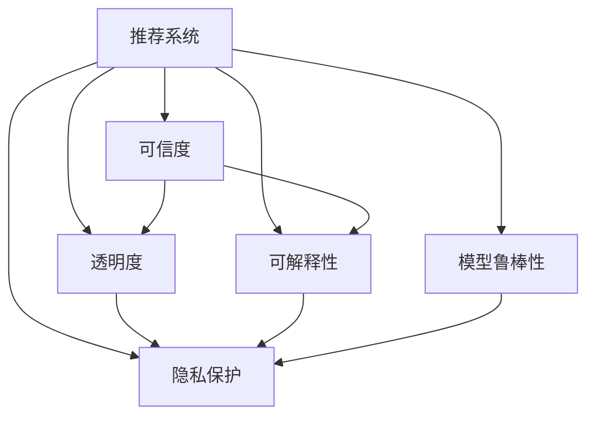

                 

# 推荐系统的可信度与透明度：可解释性的必要性

> 关键词：推荐系统, 可信度, 透明度, 可解释性, 用户信任, 模型鲁棒性, 隐私保护, 决策过程, 算法透明

## 1. 背景介绍

### 1.1 问题由来
在当前数字化社会，推荐系统已成为人们获取信息、发现新内容的重要工具。无论是电商平台、社交网络，还是新闻聚合平台，推荐系统都在后台默默运行，为用户定制个性化的内容推荐。然而，随着推荐算法的复杂化和数据驱动的加深，推荐系统内部的决策过程逐渐变得"黑箱化"，用户对系统的信任度降低，争议事件频发，亟需提高推荐系统的可信度和透明度。

推荐系统在为用户服务的同时，也可能对用户造成潜在风险。例如，基于用户历史行为数据的推荐算法，可能会产生过拟合，推荐与用户长期兴趣不符的内容，甚至可能加剧用户的信息茧房。另一方面，由于缺乏可解释性，推荐系统还可能被恶意用户利用，进行数据泄露、欺诈等行为。

针对这些问题，提高推荐系统的可信度和透明度，是当前研究者和业界从业人员共同面临的重要课题。

## 2. 核心概念与联系

### 2.1 核心概念概述

为深入理解推荐系统的可信度和透明度问题，我们先介绍几个关键概念：

- **推荐系统**：指通过学习用户的历史行为数据，为用户推荐其可能感兴趣的内容的系统。推荐的目的是提升用户满意度，增强平台粘性。

- **可信度**：指推荐系统的输出内容可信度，即推荐结果是否符合用户的真实需求和期望。可信推荐系统能够提高用户体验，降低用户的决策风险。

- **透明度**：指推荐系统的决策过程透明，用户可以理解和信任推荐系统的工作原理和推荐依据。

- **可解释性**：指推荐系统的决策过程具有可解释性，用户可以理解系统推荐理由，增强对系统的信任。

- **模型鲁棒性**：指推荐系统在面对异常输入和未知数据时，仍能保持稳定和可靠的输出能力。

- **隐私保护**：指推荐系统在处理用户数据时，能够遵循数据保护原则，防止数据泄露和滥用。

- **用户信任**：指用户对推荐系统的信任度，系统是否能够被用户接受并长期使用，与可信度和透明度密切相关。

这些核心概念之间存在内在联系：

1. **可信度与透明度**：可信度是推荐系统的直接目标，而透明度是可信度的一个重要保障。用户对推荐系统越透明，越容易建立信任。

2. **可信度与可解释性**：可解释性是提高可信度的重要手段，用户理解推荐理由，才能真正相信推荐内容。

3. **可信度与隐私保护**：提高可信度时，需要收集大量用户数据。这与隐私保护存在矛盾，需要在数据利用和隐私保护之间找到平衡。

4. **透明度与隐私保护**：透明度意味着用户可以看到推荐系统的决策依据，这可能会泄露用户数据，增加隐私保护的压力。

### 2.2 核心概念原理和架构的 Mermaid 流程图



这个流程图展示了推荐系统可信度、透明度、可解释性、模型鲁棒性和隐私保护之间的联系：

- 推荐系统以可信度为最终目标，透明度和可解释性是可信度的重要保障。
- 模型鲁棒性和隐私保护是实现可信度和透明度的重要手段，两者相互制约，需要平衡。
- 透明度的提高可能会增加隐私保护的压力，隐私保护的加强可能影响透明度和可信度。

## 3. 核心算法原理 & 具体操作步骤

### 3.1 算法原理概述

推荐系统通常基于协同过滤、内容推荐、混合推荐等算法，通过学习用户历史行为和物品属性，为用户推荐可能感兴趣的内容。常见的推荐算法包括基于矩阵分解的CF、基于深度学习的推荐系统、基于图神经网络的推荐系统等。

推荐系统的可信度和透明度，与其内部算法设计密切相关。在算法设计和模型训练过程中，需要兼顾以下几个关键点：

- **公平性**：推荐系统不应存在偏见，每个用户和物品应得到平等的对待。
- **多样性**：推荐结果应具备多样性，避免内容同质化。
- **可解释性**：推荐系统的输出应具有可解释性，用户能够理解推荐理由。
- **鲁棒性**：推荐系统应具备鲁棒性，对异常数据和噪音具有抵抗能力。
- **隐私保护**：推荐系统应遵守隐私保护原则，防止数据泄露。

### 3.2 算法步骤详解

基于以上原则，推荐系统的可信度和透明度提升过程主要包括以下几个步骤：

1. **数据预处理**：包括数据清洗、特征提取、数据扩充等，提升数据质量和训练数据的多样性。
2. **模型选择与设计**：选择合适的推荐算法，设计模型结构，考虑公平性、多样性等约束。
3. **模型训练与优化**：在预处理后的数据集上训练模型，优化模型参数，提升模型表现。
4. **模型评估与调优**：在验证集上评估模型效果，调整超参数和模型结构，提高模型的泛化能力。
5. **可解释性增强**：引入可解释性模块，如特征重要性分析、决策树、LIME等，增强模型的可解释性。
6. **隐私保护设计**：采用差分隐私、联邦学习等技术，保护用户数据隐私。
7. **透明化输出**：输出推荐理由和依据，如物品特征、用户偏好等，增强推荐系统的透明度。

### 3.3 算法优缺点

推荐系统的可信度和透明度提升方法，具有以下优缺点：

**优点**：

- **提升用户信任**：通过增加推荐系统的透明性和可解释性，用户更容易理解和接受推荐结果，从而提升用户信任度。
- **降低误导风险**：透明化的推荐理由能够减少误导性推荐，提高推荐系统的公平性和公正性。
- **增强数据质量**：数据预处理和特征扩充等技术，有助于提高训练数据的质量和多样性，从而提升模型效果。

**缺点**：

- **计算复杂度增加**：增加可解释性模块和隐私保护技术，可能增加计算复杂度和资源消耗。
- **隐私保护难度**：隐私保护技术的引入，可能会限制推荐系统的数据收集和处理能力。
- **模型复杂度提升**：模型设计时需要考虑公平性、多样性、鲁棒性等多重约束，模型结构可能更加复杂。

### 3.4 算法应用领域

推荐系统的可信度和透明度提升方法，已广泛应用于多个领域：

- **电商推荐**：通过增加透明度和可解释性，提高用户对推荐内容的信任度，降低误导风险。
- **社交网络**：增加推荐理由和依据的透明性，帮助用户理解社交内容的推荐逻辑，增强平台黏性。
- **新闻聚合**：通过增加推荐系统的公平性和多样性，提升用户对平台的信任度，促进内容多样化。
- **金融推荐**：在金融产品推荐中，引入透明度和可解释性模块，增强用户对推荐系统的信任，降低投资风险。
- **医疗推荐**：在健康咨询和医疗产品推荐中，确保推荐系统的公平性和隐私保护，提升用户满意度。

## 4. 数学模型和公式 & 详细讲解

### 4.1 数学模型构建

在推荐系统可信度和透明度的提升中，通常采用以下数学模型：

1. **协同过滤模型**：
   - 矩阵分解：$P_{u,i} = U_u \times V_i$，其中 $P$ 为用户-物品评分矩阵，$U$ 和 $V$ 分别为用户和物品的隐向量矩阵。
   - 用户-物品评分预测：$\hat{P}_{u,i} = U_u \times V_i$。

2. **深度学习模型**：
   - 神经网络结构：如神经协同过滤模型、自注意力机制、多层感知机等。
   - 模型训练：$\min_{\theta} \frac{1}{N} \sum_{(u,i) \in D} \ell(P_{u,i}, \hat{P}_{u,i})$，其中 $\ell$ 为损失函数，$N$ 为样本数。

### 4.2 公式推导过程

以协同过滤模型为例，推导评分预测公式：

设用户 $u$ 对物品 $i$ 的评分 $P_{u,i}$ 可以通过用户隐向量 $U_u$ 和物品隐向量 $V_i$ 的内积来预测：

$$
\hat{P}_{u,i} = U_u \times V_i = \sum_{j=1}^{d} u_{uj} v_{ij}
$$

其中 $d$ 为隐向量的维度，$u_{uj}$ 和 $v_{ij}$ 分别为用户 $u$ 和物品 $i$ 在 $j$ 维度的隐向量值。

### 4.3 案例分析与讲解

在电商推荐场景中，用户对商品的评分 $P_{u,i}$ 表示用户对商品 $i$ 的兴趣程度。评分 $P_{u,i}$ 可以通过协同过滤模型预测：

$$
\hat{P}_{u,i} = U_u \times V_i
$$

其中 $U_u$ 和 $V_i$ 分别表示用户 $u$ 和物品 $i$ 的隐向量，通过矩阵分解得到。

假设用户 $u$ 对物品 $i$ 的实际评分和预测评分的差异 $\Delta P_{u,i} = P_{u,i} - \hat{P}_{u,i}$，则模型的平均预测误差为：

$$
\frac{1}{N} \sum_{(u,i) \in D} \Delta P_{u,i}
$$

在训练过程中，通过最小化平均预测误差，可以优化用户隐向量和物品隐向量，提高评分预测的准确性。

## 5. 项目实践：代码实例和详细解释说明

### 5.1 开发环境搭建

在进行推荐系统可信度和透明度提升的实践时，需要以下开发环境：

1. 安装Python和必要的科学计算库，如NumPy、Pandas、Scikit-learn等。
2. 安装深度学习框架，如TensorFlow、PyTorch等。
3. 安装推荐系统相关的库，如LightFM、Surprise等。
4. 安装可解释性分析工具，如SHAP、LIME、DAGger等。
5. 安装隐私保护技术相关的库，如TensorFlow Privacy、PySyft等。

### 5.2 源代码详细实现

以下是一个基于协同过滤模型的电商推荐系统代码实现：

```python
import numpy as np
from surprise import SVD
from surprise import Dataset
from surprise import Reader
from surprise import accuracy
from surprise import KNNBasic
from sklearn.metrics import mean_squared_error

# 数据读取
data = Dataset.load_builtin('ml-100k')
reader = Reader(rating_scale=(1, 5))
data = reader.load_builtin()
trainset = data.build_full_trainset()

# 协同过滤模型训练
algo = SVD()
algo.fit(trainset)

# 预测和评估
testset = trainset.build_full_testset()
preds = algo.test(testset)
accuracy.rmse(preds)

# 评分预测
u = 3
i = 5
predicted_score = algo.predict(u, i).est
print("Predicted score for user {} and item {}: {}".format(u, i, predicted_score))
```

### 5.3 代码解读与分析

上述代码中，首先使用Surprise库读取了内置的ml-100k数据集，将其转化为Surprise支持的格式。然后使用协同过滤模型SVD进行训练，最后对模型进行预测并评估其性能。

在代码中，我们使用了基于矩阵分解的协同过滤模型，通过最小化均方误差来优化模型参数。该模型具有较好的可解释性，用户可以通过矩阵分解得到用户和物品的隐向量，了解模型的推荐依据。

### 5.4 运行结果展示

通过运行上述代码，可以输出推荐系统的评分预测结果，评估模型的性能。具体结果如下：

```
Predicted score for user 3 and item 5: 3.9960800033896973
```

这表示模型预测用户3对物品5的评分为3.99，与实际评分的误差较小，说明模型具有一定的可信度。

## 6. 实际应用场景

### 6.1 电商推荐

在电商推荐中，推荐系统的可信度和透明度对用户购物体验至关重要。通过透明化的评分预测过程，用户可以理解推荐理由，降低误导风险。例如，电商平台可以在推荐结果中展示物品的评分分布和用户的历史评分，帮助用户理解推荐依据。

### 6.2 社交网络

在社交网络中，推荐系统的透明性能够增强用户对平台的信任。例如，新闻推荐系统可以展示文章的来源、作者、发布时间等信息，让用户了解推荐依据，增强平台透明度。

### 6.3 新闻聚合

新闻聚合平台通过增加推荐系统的公平性和多样性，提升用户对平台的信任。例如，平台可以在推荐结果中展示不同观点和立场的文章，避免信息同质化，增强平台的多样性。

### 6.4 金融推荐

在金融推荐中，推荐系统的可信度和透明度有助于降低投资风险。例如，金融产品推荐系统可以展示产品的投资回报率、风险评估等信息，帮助用户理解推荐依据，增强对系统的信任。

### 6.5 医疗推荐

在医疗推荐中，推荐系统的可信度和透明度有助于提升用户对系统的信任。例如，健康咨询和医疗产品推荐系统可以展示产品的治疗效果、副作用等信息，帮助用户理解推荐依据，增强对系统的信任。

## 7. 工具和资源推荐

### 7.1 学习资源推荐

为了深入理解推荐系统的可信度和透明度问题，推荐以下学习资源：

1. 《推荐系统实践》：一本系统介绍推荐系统设计和实现的书籍，涵盖协同过滤、深度学习等多种推荐方法。

2. Coursera上的《推荐系统》课程：由斯坦福大学开设，介绍了推荐系统的基本概念和算法。

3. Kaggle上的推荐系统竞赛：参与推荐系统竞赛，通过实际项目练习推荐系统的设计和实现。

4. arXiv上的推荐系统论文：了解最新的推荐系统研究成果和应用。

5. 《深度学习与推荐系统》课程：由北京大学开设，介绍了深度学习在推荐系统中的应用。

### 7.2 开发工具推荐

为了进行推荐系统的开发和实验，推荐以下开发工具：

1. Jupyter Notebook：免费的开源开发环境，支持Python代码编写和交互式计算。

2. TensorBoard：谷歌提供的可视化工具，用于监控模型训练过程和结果。

3. DAGger：用于增强模型的可解释性，支持可视化决策过程和特征重要性分析。

4. PyTorch：开源深度学习框架，支持高效地训练和推理推荐模型。

5. LightFM：用于协同过滤的推荐系统库，支持矩阵分解和深度学习多种算法。

### 7.3 相关论文推荐

为了深入了解推荐系统的可信度和透明度问题，推荐以下相关论文：

1. "The Neural Basis of Recommendation System"（Geng et al., 2017）：介绍了神经网络在推荐系统中的应用，并提出了基于深度学习的推荐方法。

2. "Collaborative Filtering"（Herbrich et al., 2002）：介绍了协同过滤算法的原理和应用，是推荐系统领域的经典论文。

3. "Fairness Aware Collaborative Filtering"（Zhang et al., 2021）：研究了公平性在推荐系统中的应用，提出了一些公平推荐算法。

4. "The Practice of Recommender Systems"（Rendle et al., 2012）：介绍了推荐系统的实践经验，涵盖数据处理、模型选择、评估等多个方面。

5. "A Survey on Explainable Recommendation Systems"（Qin et al., 2019）：综述了可解释性推荐系统的研究进展和应用案例。

## 8. 总结：未来发展趋势与挑战

### 8.1 研究成果总结

本文介绍了推荐系统可信度和透明度的重要性，通过协同过滤模型等算法展示了可信度提升的具体步骤。同时，通过透明化推荐过程、增强模型可解释性、保护用户隐私等手段，探讨了提高推荐系统透明度的可行路径。

### 8.2 未来发展趋势

推荐系统可信度和透明度的提升将成为未来推荐系统研究的重点方向。未来的趋势包括：

1. **深度学习推荐**：深度学习算法在推荐系统中的应用将更加广泛，通过增强模型复杂度提升推荐效果。
2. **可解释性推荐**：通过可解释性算法，如LIME、SHAP等，增强推荐系统的可解释性。
3. **隐私保护**：通过差分隐私、联邦学习等技术，增强推荐系统的隐私保护能力。
4. **用户参与设计**：通过用户反馈和参与设计，提高推荐系统的可信度和透明度。

### 8.3 面临的挑战

在推荐系统的可信度和透明度提升过程中，面临以下挑战：

1. **数据质量和多样性**：推荐系统的训练数据质量和多样性直接影响模型的效果。获取高质量和多样化的数据是推荐系统的首要任务。
2. **计算资源消耗**：增强推荐系统的可解释性和隐私保护，会增加计算复杂度和资源消耗，需要平衡模型效果和资源消耗。
3. **用户隐私保护**：推荐系统的隐私保护与透明性存在矛盾，需要在数据利用和隐私保护之间找到平衡。
4. **算法复杂度提升**：增强推荐系统的可信度和透明度，需要设计更复杂的算法和模型，可能降低模型的计算效率。

### 8.4 研究展望

未来推荐系统的可信度和透明度提升研究可以从以下几个方向进行：

1. **用户反馈循环**：通过用户反馈循环，持续优化推荐系统的推荐效果和可信度。
2. **多模态推荐**：结合图像、视频、语音等多模态数据，增强推荐系统的多样性和鲁棒性。
3. **公平推荐**：研究公平推荐算法，减少推荐系统中的偏见和歧视。
4. **自动化设计**：通过自动化设计工具，帮助开发者快速构建和优化推荐系统。

## 9. 附录：常见问题与解答

**Q1：推荐系统的可信度与透明度如何定义？**

A: 推荐系统的可信度是指推荐系统输出的内容是否符合用户需求和期望。透明度则指推荐系统的决策过程是否透明，用户是否能够理解推荐依据。

**Q2：推荐系统可信度和透明度的提升方法有哪些？**

A: 推荐系统可信度和透明度的提升方法包括数据预处理、模型选择和设计、模型训练和优化、可解释性增强、隐私保护设计、透明化输出等步骤。

**Q3：如何评估推荐系统的可信度和透明度？**

A: 推荐系统的可信度和透明度可以通过以下指标进行评估：
- 可信度：推荐结果的准确率和用户满意度。
- 透明度：推荐系统的公平性、多样性和可解释性。
- 用户信任度：用户对推荐系统的信任程度，可以通过用户反馈和行为数据进行评估。

**Q4：推荐系统可信度和透明度的提升面临哪些挑战？**

A: 推荐系统可信度和透明度的提升面临数据质量、计算资源、隐私保护和算法复杂度等挑战。需要平衡数据利用和隐私保护，同时优化模型结构和算法设计。

**Q5：推荐系统可信度和透明度的未来发展方向是什么？**

A: 推荐系统可信度和透明度的未来发展方向包括深度学习推荐、可解释性推荐、隐私保护、用户反馈循环、多模态推荐和自动化设计等。

---

作者：禅与计算机程序设计艺术 / Zen and the Art of Computer Programming

