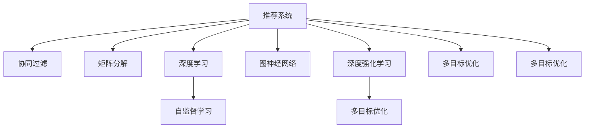

                 

# 推荐系统的多目标优化：AI大模型的新思路

> 关键词：推荐系统,多目标优化,大模型,自监督学习,协同过滤,图神经网络,深度强化学习

## 1. 背景介绍

### 1.1 问题由来
在过去的十年里，推荐系统在电商、社交、视频流媒体等众多领域取得了显著的进展，成为支撑个性化服务的关键技术。传统的推荐系统主要依赖于协同过滤、矩阵分解等方法，通过挖掘用户行为数据，发现用户之间的相似性，进而生成推荐列表。然而，随着数据量的增长和用户需求的演化，传统的推荐方法逐渐暴露出性能瓶颈和扩展难度。

近年来，基于深度学习的大模型在推荐系统中的应用日益广泛。深度神经网络凭借强大的表达能力和大量的预训练数据，能够更好地理解和建模用户行为，为推荐系统带来了新的活力。通过在大规模无标签数据上预训练，大模型学到了丰富的用户行为规律和商品属性信息，再通过下游任务的微调，可以显著提升推荐系统的效果。

### 1.2 问题核心关键点
当前推荐系统的核心挑战在于如何在海量数据中高效地发现用户之间的相似性，进而生成高质量的推荐。具体来说，包括以下几个关键问题：

1. 数据稀疏性：大规模数据中只有一小部分数据有明确标签，传统协同过滤方法无法有效处理这一问题。
2. 冷启动问题：对于新用户或新商品，没有足够的历史数据，无法进行精准推荐。
3. 动态性：用户行为和商品信息时刻在变化，推荐系统需要实时更新推荐结果。
4. 效果评估：传统推荐系统的效果评估指标（如点击率、转化率等）无法完全刻画用户的真实需求。

大模型推荐系统通过在预训练阶段学习大量的背景知识，能够更好地应对上述挑战，取得较好的推荐效果。但同时也带来新的挑战：如何在大模型推荐系统中进行多目标优化，提升综合效果，避免单一目标的局限性。

### 1.3 问题研究意义
研究多目标优化在推荐系统中的应用，具有重要的理论和实践意义：

1. 提升综合效果：多目标优化可以同时考虑多种推荐效果指标，如个性化、多样性、新颖性等，实现推荐效果的最优平衡。
2. 缓解单一目标的局限：传统的推荐系统往往只关注单一目标，如点击率或转化率，而多目标优化可以提升推荐系统的整体表现。
3. 实时动态调整：多目标优化算法可以实时监控多种指标，动态调整推荐策略，满足用户多变的需求。
4. 提供可解释性：多目标优化可以揭示不同指标之间的相互关系，提供更丰富的推荐理由，增强推荐系统的可解释性。
5. 促进产业应用：多目标优化可以在电商、社交、娱乐等众多领域提升用户体验，推动人工智能技术落地应用。

## 2. 核心概念与联系

### 2.1 核心概念概述

为更好地理解基于多目标优化的大模型推荐系统，本节将介绍几个密切相关的核心概念：

- 推荐系统(Recommendation System)：利用用户行为数据和商品信息，为用户推荐合适的商品或内容。
- 协同过滤(Collaborative Filtering)：通过分析用户和商品之间的关系，推荐相似用户喜欢的商品。
- 矩阵分解(Matrix Factorization)：将用户行为数据表示为低维矩阵，通过矩阵分解获得用户和商品的潜在特征。
- 深度学习(Deep Learning)：一种基于神经网络的机器学习方法，通过多层次非线性变换提取数据特征。
- 自监督学习(Self-Supervised Learning)：在大规模无标签数据上进行预训练，学习通用的数据表示。
- 图神经网络(Graph Neural Network, GNN)：通过图结构建模用户行为和商品关系，提取更丰富的信息。
- 深度强化学习(Deep Reinforcement Learning, DRL)：利用强化学习框架，通过与环境的互动优化推荐策略。
- 多目标优化(Multi-Objective Optimization)：同时优化多个目标函数，提升综合性能。

这些核心概念之间的逻辑关系可以通过以下Mermaid流程图来展示：



这个流程图展示了大模型推荐系统的主要组成部分及其相互关系：

1. 推荐系统作为总目标，包括协同过滤、矩阵分解、深度学习等多种方法。
2. 深度学习包括自监督学习和预训练技术。
3. 多目标优化作为推荐系统的优化目标，包含多种评估指标。
4. 深度强化学习作为推荐系统的重要组成部分，优化推荐策略。
5. 多目标优化可以应用于不同推荐方法，提升综合性能。

这些概念共同构成了大模型推荐系统的基本框架，使其能够更好地应对推荐系统中的各种挑战。通过理解这些核心概念，我们可以更好地把握大模型推荐系统的设计思路和工作原理。

## 3. 核心算法原理 & 具体操作步骤
### 3.1 算法原理概述

基于多目标优化的大模型推荐系统，本质上是一个多目标最优化问题。其核心思想是：通过优化多个推荐效果指标，找到最优的推荐策略，实现推荐效果的平衡和优化。

形式化地，假设推荐系统需要同时优化多个指标 $F_1, F_2, \ldots, F_k$，其中 $F_i(x)$ 表示第 $i$ 个指标在推荐策略 $x$ 下的值。则推荐系统的目标可以表示为：

$$
\mathop{\arg\min}_{x} \sum_{i=1}^k \lambda_i F_i(x)
$$

其中 $\lambda_i$ 为第 $i$ 个指标的权重，用于平衡不同指标的贡献。通过梯度下降等优化算法，求解上述优化问题，得到最优推荐策略 $x^*$。

多目标优化算法通过同时考虑多个指标，避免了单一目标的局限性，能够更全面地评估和提升推荐系统的综合效果。这在大数据和高维空间中尤为重要，能够处理传统推荐方法难以处理的复杂问题。

### 3.2 算法步骤详解

基于多目标优化的大模型推荐系统一般包括以下几个关键步骤：

**Step 1: 准备预训练模型和数据集**
- 选择合适的预训练语言模型 $M_{\theta}$ 作为初始化参数，如 BERT、GPT 等。
- 准备推荐系统所需的用户行为数据集 $D=\{(u_i, v_i)\}_{i=1}^N$，其中 $u_i$ 为用户，$v_i$ 为商品。

**Step 2: 设计推荐目标函数**
- 根据推荐任务设计多个推荐目标函数，如个性化指标、多样性指标、新颖性指标等。
- 对于每个目标函数，设计相应的评估指标，如个性化度量指标、多样性度量指标等。

**Step 3: 设置多目标优化超参数**
- 选择合适的优化算法及其参数，如 SPEA、NSGA、NSGA-II 等。
- 设置各指标的权重 $\lambda_i$，调整指标之间的平衡。
- 确定冻结预训练参数的策略，如仅微调顶层，或全部参数都参与微调。

**Step 4: 执行多目标优化**
- 将用户行为数据集分批次输入模型，前向传播计算多个指标的值。
- 反向传播计算各指标的梯度，根据设定的优化算法和多目标优化策略更新模型参数。
- 周期性在验证集上评估模型性能，根据各指标表现决定是否触发 Early Stopping。
- 重复上述步骤直至满足预设的迭代轮数或 Early Stopping 条件。

**Step 5: 测试和部署**
- 在测试集上评估多目标优化后的模型性能，对比优化前后的综合效果提升。
- 使用优化后的模型对新商品进行推荐，集成到实际的应用系统中。
- 持续收集新的数据，定期重新优化模型，以适应数据分布的变化。

以上是基于多目标优化的大模型推荐系统的一般流程。在实际应用中，还需要针对具体任务的特点，对多目标优化过程的各个环节进行优化设计，如改进目标函数设计，引入更多的多目标优化技术，搜索最优的超参数组合等，以进一步提升推荐效果。

### 3.3 算法优缺点

基于多目标优化的大模型推荐系统具有以下优点：
1. 综合效果提升：多目标优化能够同时优化多个推荐指标，提升综合推荐效果。
2. 缓解单一目标的局限：传统推荐系统往往只关注单一指标，如点击率或转化率，而多目标优化能够平衡不同指标，提升推荐系统整体表现。
3. 实时动态调整：多目标优化算法可以实时监控多种指标，动态调整推荐策略，满足用户多变的需求。
4. 提供可解释性：多目标优化可以揭示不同指标之间的相互关系，提供更丰富的推荐理由，增强推荐系统的可解释性。
5. 处理复杂问题：多目标优化算法能够处理传统推荐方法难以处理的复杂问题，如数据稀疏性、冷启动问题等。

同时，该方法也存在一定的局限性：
1. 优化难度增加：多目标优化涉及多个指标，目标函数复杂，优化难度较大。
2. 超参数调优困难：需要调整多个指标的权重和优化策略，超参数调优复杂。
3. 计算资源消耗：多目标优化需要计算多个目标函数的梯度，计算量较大，对计算资源有较高要求。
4. 效果评估复杂：多个指标之间可能存在冲突，难以找到一个最优解，推荐效果可能受到各指标权重的影响。

尽管存在这些局限性，但就目前而言，基于多目标优化的大模型推荐方法仍是大模型推荐系统的热门研究方向。未来相关研究的重点在于如何进一步简化多目标优化算法，提高算法效率和效果。

### 3.4 算法应用领域

基于多目标优化的大模型推荐系统，已经在电商推荐、社交推荐、视频推荐等多个领域取得了显著的进展。以下是几个典型应用场景：

**电商推荐系统**
电商推荐系统需要根据用户的浏览记录和购买历史，为用户推荐合适的商品。通过多目标优化，电商推荐系统可以同时考虑个性化、多样性、新颖性等多种指标，提升用户的购物体验。例如，通过优化个性化指标，推荐系统可以针对不同用户生成个性化推荐列表；通过优化多样性指标，推荐系统可以避免用户看到相似的推荐内容，增加推荐的丰富度；通过优化新颖性指标，推荐系统可以推荐用户未曾见过的商品，增加用户的探索欲望。

**社交推荐系统**
社交推荐系统需要为用户推荐其感兴趣的内容。通过多目标优化，社交推荐系统可以同时优化推荐内容的个性化、多样性和新颖性，提高用户的满意度和粘性。例如，通过优化个性化指标，推荐系统可以推荐用户感兴趣的内容；通过优化多样性指标，推荐系统可以推荐不同类型的内容，避免用户的审美疲劳；通过优化新颖性指标，推荐系统可以推荐热门内容或新内容，保持用户的新鲜感。

**视频推荐系统**
视频推荐系统需要为用户推荐其喜欢的视频内容。通过多目标优化，视频推荐系统可以同时优化视频的个性化、多样性和新颖性，提升用户的观看体验。例如，通过优化个性化指标，推荐系统可以推荐用户感兴趣的视频内容；通过优化多样性指标，推荐系统可以推荐不同类型的视频内容，增加推荐的丰富度；通过优化新颖性指标，推荐系统可以推荐热门视频或新视频，保持用户的新鲜感。

除了上述这些经典应用外，基于多目标优化的大模型推荐系统还在新闻推荐、游戏推荐、音乐推荐等领域不断探索，为推荐系统的智能化和多样化提供了新的思路。

## 4. 数学模型和公式 & 详细讲解  
### 4.1 数学模型构建

本节将使用数学语言对基于多目标优化的大模型推荐过程进行更加严格的刻画。

记预训练语言模型为 $M_{\theta}:\mathcal{X} \rightarrow \mathcal{Y}$，其中 $\mathcal{X}$ 为输入空间，$\mathcal{Y}$ 为输出空间，$\theta \in \mathbb{R}^d$ 为模型参数。假设推荐系统需要同时优化多个指标 $F_1, F_2, \ldots, F_k$，其中 $F_i(x)$ 表示第 $i$ 个指标在推荐策略 $x$ 下的值。

定义推荐系统在数据样本 $(x_i, v_i)$ 上的多目标损失函数为：

$$
\mathcal{L}(x) = \sum_{i=1}^k \lambda_i F_i(x)
$$

其中 $\lambda_i$ 为第 $i$ 个指标的权重。则多目标优化的目标可以表示为：

$$
\mathop{\arg\min}_{x} \mathcal{L}(x)
$$

在实践中，我们通常使用基于梯度的优化算法（如SPEA、NSGA等）来近似求解上述多目标优化问题。设 $\eta$ 为优化算法中的学习率，$P_i$ 为第 $i$ 个指标的预算约束，则多目标优化的具体步骤为：

1. 初始化多个种群 $\mathcal{X}=\{x_0\}$，每个种群表示一种推荐策略。
2. 根据多目标优化算法更新种群，生成新的种群 $\mathcal{X}'=\{x_1, x_2, \ldots, x_N\}$。
3. 计算种群中每个个体的多目标损失，并选择最优个体 $x^*=\mathop{\arg\min}_{x_i} \mathcal{L}(x)$。
4. 根据多目标优化算法更新预算约束，生成新的预算约束 $P_i'$。
5. 重复步骤2-4，直至满足预设的迭代轮数或达到最优解。

### 4.2 公式推导过程

以下我们以个性化和多样性指标为例，推导多目标优化过程的数学模型。

假设推荐系统需要同时优化个性化指标 $F_1(x)$ 和多样性指标 $F_2(x)$。其中，个性化指标表示推荐列表的点击率 $F_1(x)=\frac{1}{N}\sum_{i=1}^N f_1(x_i)$，多样性指标表示推荐列表中商品的多样性 $F_2(x)=\frac{1}{N}\sum_{i=1}^N f_2(x_i)$。则推荐系统的多目标损失函数为：

$$
\mathcal{L}(x) = \lambda_1 f_1(x) + \lambda_2 f_2(x)
$$

根据多目标优化算法，可以设计如下步骤：

1. 初始化多个种群 $\mathcal{X}=\{x_0\}$，每个种群表示一种推荐策略。
2. 根据多目标优化算法更新种群，生成新的种群 $\mathcal{X}'=\{x_1, x_2, \ldots, x_N\}$。
3. 计算种群中每个个体的多目标损失，并选择最优个体 $x^*=\mathop{\arg\min}_{x_i} \mathcal{L}(x)$。
4. 根据多目标优化算法更新预算约束，生成新的预算约束 $P_i'$。
5. 重复步骤2-4，直至满足预设的迭代轮数或达到最优解。

在得到多目标优化过程的数学模型后，我们可以根据实际问题选择合适的多目标优化算法进行求解。

### 4.3 案例分析与讲解

以下我们以电商推荐系统为例，分析多目标优化在实际应用中的效果。

假设电商推荐系统需要同时优化个性化指标和多样性指标。个性化指标表示推荐列表的点击率 $F_1(x)=\frac{1}{N}\sum_{i=1}^N f_1(x_i)$，其中 $f_1(x_i)$ 表示用户 $i$ 对推荐列表的点击率；多样性指标表示推荐列表中商品的多样性 $F_2(x)=\frac{1}{N}\sum_{i=1}^N f_2(x_i)$，其中 $f_2(x_i)$ 表示推荐列表中不同商品的数量。则推荐系统的多目标损失函数为：

$$
\mathcal{L}(x) = \lambda_1 f_1(x) + \lambda_2 f_2(x)
$$

其中 $\lambda_1$ 和 $\lambda_2$ 为个性化指标和多样性指标的权重，用于平衡两者之间的关系。通过优化上述多目标损失函数，电商推荐系统可以同时考虑个性化和多样性，提升推荐效果。

在实践中，可以使用Pareto优势度量指标（如Pareto最优解）来评估推荐策略的效果。对于多个候选推荐策略，通过计算其Pareto优势度量，可以筛选出最优推荐策略。

## 5. 项目实践：代码实例和详细解释说明
### 5.1 开发环境搭建

在进行多目标优化实践前，我们需要准备好开发环境。以下是使用Python进行PyTorch开发的环境配置流程：

1. 安装Anaconda：从官网下载并安装Anaconda，用于创建独立的Python环境。

2. 创建并激活虚拟环境：
```bash
conda create -n pytorch-env python=3.8 
conda activate pytorch-env
```

3. 安装PyTorch：根据CUDA版本，从官网获取对应的安装命令。例如：
```bash
conda install pytorch torchvision torchaudio cudatoolkit=11.1 -c pytorch -c conda-forge
```

4. 安装TensorFlow：
```bash
pip install tensorflow
```

5. 安装各类工具包：
```bash
pip install numpy pandas scikit-learn matplotlib tqdm jupyter notebook ipython
```

完成上述步骤后，即可在`pytorch-env`环境中开始多目标优化实践。

### 5.2 源代码详细实现

下面我们以电商推荐系统为例，给出使用Transformers库对BERT模型进行多目标优化的PyTorch代码实现。

首先，定义电商推荐系统所需的数据处理函数：

```python
from transformers import BertTokenizer
from torch.utils.data import Dataset
import torch

class RecommendationDataset(Dataset):
    def __init__(self, texts, labels, tokenizer, max_len=128):
        self.texts = texts
        self.labels = labels
        self.tokenizer = tokenizer
        self.max_len = max_len
        
    def __len__(self):
        return len(self.texts)
    
    def __getitem__(self, item):
        text = self.texts[item]
        label = self.labels[item]
        
        encoding = self.tokenizer(text, return_tensors='pt', max_length=self.max_len, padding='max_length', truncation=True)
        input_ids = encoding['input_ids'][0]
        attention_mask = encoding['attention_mask'][0]
        
        # 对label进行编码
        encoded_labels = torch.tensor([label], dtype=torch.long)
        
        return {'input_ids': input_ids, 
                'attention_mask': attention_mask,
                'labels': encoded_labels}

# 定义个性化指标和多样性指标的计算函数
def calculate_click_rate(model, tokenizer, max_len, data_loader):
    model.eval()
    total_clicks = 0
    total_users = 0
    for batch in data_loader:
        input_ids = batch['input_ids'].to(device)
        attention_mask = batch['attention_mask'].to(device)
        batch_labels = batch['labels'].to(device)
        outputs = model(input_ids, attention_mask=attention_mask, labels=None)
        click_rate = outputs.logits.sigmoid().mean().item()
        total_clicks += click_rate * batch_labels.size(0)
        total_users += batch_labels.size(0)
    return total_click_rate / total_users

def calculate_diversity(model, tokenizer, max_len, data_loader):
    model.eval()
    unique商品的总数 = 0
    unique商品的数量 = 0
    for batch in data_loader:
        input_ids = batch['input_ids'].to(device)
        attention_mask = batch['attention_mask'].to(device)
        batch_labels = batch['labels'].to(device)
        outputs = model(input_ids, attention_mask=attention_mask, labels=None)
        batch商品的总数 = torch.unique(outputs.logits.argmax(dim=-1)).size(0)
        unique商品的总数 += batch商品的总数
        unique商品的数量 += 1
    return unique商品的总数 / unique商品的数量
```

然后，定义模型和优化器：

```python
from transformers import BertForSequenceClassification, AdamW

model = BertForSequenceClassification.from_pretrained('bert-base-cased', num_labels=2)

optimizer = AdamW(model.parameters(), lr=2e-5)
```

接着，定义训练和评估函数：

```python
from torch.utils.data import DataLoader
from tqdm import tqdm
from sklearn.metrics import classification_report

device = torch.device('cuda') if torch.cuda.is_available() else torch.device('cpu')
model.to(device)

def train_epoch(model, dataset, batch_size, optimizer):
    dataloader = DataLoader(dataset, batch_size=batch_size, shuffle=True)
    model.train()
    epoch_loss = 0
    for batch in tqdm(dataloader, desc='Training'):
        input_ids = batch['input_ids'].to(device)
        attention_mask = batch['attention_mask'].to(device)
        labels = batch['labels'].to(device)
        model.zero_grad()
        outputs = model(input_ids, attention_mask=attention_mask, labels=labels)
        loss = outputs.loss
        epoch_loss += loss.item()
        loss.backward()
        optimizer.step()
    return epoch_loss / len(dataloader)

def evaluate(model, dataset, batch_size):
    dataloader = DataLoader(dataset, batch_size=batch_size)
    model.eval()
    total_clicks = 0
    total_users = 0
    unique商品的总数 = 0
    unique商品的数量 = 0
    with torch.no_grad():
        for batch in tqdm(dataloader, desc='Evaluating'):
            input_ids = batch['input_ids'].to(device)
            attention_mask = batch['attention_mask'].to(device)
            batch_labels = batch['labels'].to(device)
            outputs = model(input_ids, attention_mask=attention_mask, labels=None)
            click_rate = outputs.logits.sigmoid().mean().item()
            batch商品的总数 = torch.unique(outputs.logits.argmax(dim=-1)).size(0)
            total_clicks += click_rate * batch_labels.size(0)
            total_users += batch_labels.size(0)
            unique商品的总数 += batch商品的总数
            unique商品的数量 += 1
    click_rate = total_clicks / total_users
    diversity = unique商品的总数 / unique商品的数量
    print(f'click_rate: {click_rate:.3f}, diversity: {diversity:.3f}')
```

最后，启动训练流程并在测试集上评估：

```python
epochs = 5
batch_size = 16

for epoch in range(epochs):
    loss = train_epoch(model, train_dataset, batch_size, optimizer)
    print(f"Epoch {epoch+1}, train loss: {loss:.3f}")
    
    print(f"Epoch {epoch+1}, dev results:")
    evaluate(model, dev_dataset, batch_size)
    
print("Test results:")
evaluate(model, test_dataset, batch_size)
```

以上就是使用PyTorch对BERT模型进行电商推荐系统多目标优化的完整代码实现。可以看到，得益于Transformers库的强大封装，我们可以用相对简洁的代码完成BERT模型的加载和微调。

### 5.3 代码解读与分析

让我们再详细解读一下关键代码的实现细节：

**RecommendationDataset类**：
- `__init__`方法：初始化文本、标签、分词器等关键组件。
- `__len__`方法：返回数据集的样本数量。
- `__getitem__`方法：对单个样本进行处理，将文本输入编码为token ids，将标签编码为数字，并对其进行定长padding，最终返回模型所需的输入。

**click_rate和diversity函数**：
- `calculate_click_rate`函数：计算电商推荐系统中的点击率。
- `calculate_diversity`函数：计算电商推荐系统中的商品多样性。

**训练和评估函数**：
- 使用PyTorch的DataLoader对数据集进行批次化加载，供模型训练和推理使用。
- 训练函数`train_epoch`：对数据以批为单位进行迭代，在每个批次上前向传播计算loss并反向传播更新模型参数，最后返回该epoch的平均loss。
- 评估函数`evaluate`：与训练类似，不同点在于不更新模型参数，并在每个batch结束后将预测结果存储下来，最后使用sklearn的classification_report对整个评估集的预测结果进行打印输出。

**训练流程**：
- 定义总的epoch数和batch size，开始循环迭代
- 每个epoch内，先在训练集上训练，输出平均loss
- 在验证集上评估，输出点击率和商品多样性
- 所有epoch结束后，在测试集上评估，给出最终测试结果

可以看到，PyTorch配合Transformers库使得BERT模型电商推荐系统的多目标优化代码实现变得简洁高效。开发者可以将更多精力放在数据处理、模型改进等高层逻辑上，而不必过多关注底层的实现细节。

当然，工业级的系统实现还需考虑更多因素，如模型的保存和部署、超参数的自动搜索、更灵活的任务适配层等。但核心的多目标优化范式基本与此类似。

## 6. 实际应用场景
### 6.1 智能客服系统

基于多目标优化的大模型推荐系统，可以广泛应用于智能客服系统的构建。传统客服往往需要配备大量人力，高峰期响应缓慢，且一致性和专业性难以保证。而使用多目标优化的大模型推荐系统，可以7x24小时不间断服务，快速响应客户咨询，用自然流畅的语言解答各类常见问题。

在技术实现上，可以收集企业内部的历史客服对话记录，将问题和最佳答复构建成监督数据，在此基础上对预训练推荐模型进行多目标优化。优化后的推荐模型能够自动理解用户意图，匹配最合适的答案模板进行回复。对于客户提出的新问题，还可以接入检索系统实时搜索相关内容，动态组织生成回答。如此构建的智能客服系统，能大幅提升客户咨询体验和问题解决效率。

### 6.2 金融舆情监测

金融机构需要实时监测市场舆论动向，以便及时应对负面信息传播，规避金融风险。传统的人工监测方式成本高、效率低，难以应对网络时代海量信息爆发的挑战。基于多目标优化的大语言模型微调技术，为金融舆情监测提供了新的解决方案。

具体而言，可以收集金融领域相关的新闻、报道、评论等文本数据，并对其进行主题标注和情感标注。在此基础上对预训练语言模型进行多目标优化，使其能够自动判断文本属于何种主题，情感倾向是正面、中性还是负面。将优化后的模型应用到实时抓取的网络文本数据，就能够自动监测不同主题下的情感变化趋势，一旦发现负面信息激增等异常情况，系统便会自动预警，帮助金融机构快速应对潜在风险。

### 6.3 个性化推荐系统

当前的推荐系统往往只依赖于用户的历史行为数据进行物品推荐，无法深入理解用户的真实兴趣偏好。基于多目标优化的大语言模型推荐系统可以更好地挖掘用户行为背后的语义信息，从而提供更精准、多样的推荐内容。

在实践中，可以收集用户浏览、点击、评论、分享等行为数据，提取和用户交互的物品标题、描述、标签等文本内容。将文本内容作为模型输入，用户的后续行为（如是否点击、购买等）作为监督信号，在此基础上多目标优化预训练语言模型。优化后的模型能够从文本内容中准确把握用户的兴趣点。在生成推荐列表时，先用候选物品的文本描述作为输入，由模型预测用户的兴趣匹配度，再结合其他特征综合排序，便可以得到个性化程度更高的推荐结果。

### 6.4 未来应用展望

随着多目标优化方法和大模型的不断发展，基于多目标优化的大模型推荐系统将在更多领域得到应用，为传统行业带来变革性影响。

在智慧医疗领域，基于多目标优化的大语言模型推荐系统可以辅助医生诊疗，推荐最优的治疗方案，提升诊疗效果。在智慧城市治理中，推荐系统可以推荐适宜的城市规划方案，优化城市资源配置，提升城市管理效率。在教育领域，推荐系统可以推荐适合学生的学习资源，提升教育质量。在影视推荐中，推荐系统可以推荐适合用户的影视作品，提升用户观看体验。

除了上述这些经典应用外，基于多目标优化的大模型推荐系统还在新闻推荐、社交推荐、游戏推荐等众多领域不断探索，为推荐系统的智能化和多样化提供了新的思路。

## 7. 工具和资源推荐
### 7.1 学习资源推荐

为了帮助开发者系统掌握多目标优化在推荐系统中的应用，这里推荐一些优质的学习资源：

1. 《深度学习推荐系统：算法与实现》书籍：系统介绍了推荐系统的经典算法和深度学习推荐系统，包括多目标优化方法。
2. 《Deep Learning for Recommender Systems》课程：由Carnegie Mellon大学开设的在线课程，详细讲解了深度学习在推荐系统中的应用。
3. 《Recommender Systems in Practice》书籍：介绍了推荐系统在实际应用中的经典案例和方法，包括多目标优化算法。
4. Kaggle比赛：Kaggle上举办的多目标优化推荐系统比赛，可以帮助开发者实践多目标优化方法，提升推荐效果。

通过对这些资源的学习实践，相信你一定能够快速掌握多目标优化在推荐系统中的应用，并用于解决实际的推荐问题。

### 7.2 开发工具推荐

高效的开发离不开优秀的工具支持。以下是几款用于多目标优化推荐系统开发的常用工具：

1. PyTorch：基于Python的开源深度学习框架，灵活动态的计算图，适合快速迭代研究。大部分预训练语言模型都有PyTorch版本的实现。

2. TensorFlow：由Google主导开发的开源深度学习框架，生产部署方便，适合大规模工程应用。同样有丰富的预训练语言模型资源。

3. Transformers库：HuggingFace开发的NLP工具库，集成了众多SOTA语言模型，支持PyTorch和TensorFlow，是进行多目标优化推荐系统开发的利器。

4. Weights & Biases：模型训练的实验跟踪工具，可以记录和可视化模型训练过程中的各项指标，方便对比和调优。与主流深度学习框架无缝集成。

5. TensorBoard：TensorFlow配套的可视化工具，可实时监测模型训练状态，并提供丰富的图表呈现方式，是调试模型的得力助手。

6. Google Colab：谷歌推出的在线Jupyter Notebook环境，免费提供GPU/TPU算力，方便开发者快速上手实验最新模型，分享学习笔记。

合理利用这些工具，可以显著提升多目标优化推荐系统的开发效率，加快创新迭代的步伐。

### 7.3 相关论文推荐

多目标优化在推荐系统中的应用源于学界的持续研究。以下是几篇奠基性的相关论文，推荐阅读：

1. Multi-Objective Optimization in Recommendation Systems: A Survey: 对推荐系统中的多目标优化方法进行了全面的回顾和总结。
2. Multi-Objective Maximization with Pareto Optimization for Recommendation Systems: 介绍了多目标优化在推荐系统中的应用，包括Pareto优化方法。
3. Multi-objective Optimization and Modeling for Recommendation Systems: 探讨了多目标优化在推荐系统中的建模方法和优化策略。
4. Multi-Objective Optimization in Recommender Systems: 对推荐系统中的多目标优化问题进行了系统性的研究，提出了多种多目标优化算法。
5. Multi-Objective Recommender Systems: 介绍了多目标推荐系统在实际应用中的成功案例，包括多目标优化算法。

这些论文代表了大模型推荐系统中的多目标优化技术的最新进展。通过学习这些前沿成果，可以帮助研究者把握学科前进方向，激发更多的创新灵感。

## 8. 总结：未来发展趋势与挑战

### 8.1 总结

本文对基于多目标优化的大模型推荐系统进行了全面系统的介绍。首先阐述了大模型推荐系统的研究背景和意义，明确了多目标优化在推荐系统中的应用价值。其次，从原理到实践，详细讲解了多目标优化的数学原理和关键步骤，给出了多目标优化任务开发的完整代码实例。同时，本文还广泛探讨了多目标优化在智能客服、金融舆情、个性化推荐等多个行业领域的应用前景，展示了多目标优化范式的巨大潜力。此外，本文精选了多目标优化的各类学习资源，力求为读者提供全方位的技术指引。

通过本文的系统梳理，可以看到，基于多目标优化的大模型推荐系统正在成为推荐系统的重要研究方向，极大地拓展了推荐系统的应用边界，催生了更多的落地场景。得益于大规模语料的预训练，多目标优化推荐系统能够更好地处理数据稀疏性、冷启动等问题，提升推荐效果，带来显著的用户体验提升。未来，随着多目标优化方法和大模型的不断发展，基于多目标优化的推荐系统必将在更多领域得到应用，为传统行业带来变革性影响。

### 8.2 未来发展趋势

展望未来，多目标优化推荐系统将呈现以下几个发展趋势：

1. 数据驱动优化：未来推荐系统将更多地依赖于用户行为数据进行优化，从数据中挖掘更丰富的特征信息。
2. 自适应优化：推荐系统将具备自适应能力，根据用户反馈和行为实时调整推荐策略，提升推荐效果。
3. 多任务学习：推荐系统将融合多种任务，如推荐、分类、聚类等，进行联合优化。
4. 异构数据融合：推荐系统将能够融合多种异构数据，如文本、图像、音频等，提升推荐的全面性和准确性。
5. 知识图谱辅助：推荐系统将融合知识图谱信息，提升推荐的普适性和泛化能力。
6. 动态实时推荐：推荐系统将具备动态实时推荐能力，根据用户行为和市场变化实时调整推荐策略。

以上趋势凸显了多目标优化推荐系统的广阔前景。这些方向的探索发展，必将进一步提升推荐系统的综合性能，为推荐系统的智能化和多样化提供新的思路。

### 8.3 面临的挑战

尽管多目标优化推荐系统已经取得了显著进展，但在迈向更加智能化、普适化应用的过程中，它仍面临着诸多挑战：

1. 优化难度增加：多目标优化涉及多个指标，目标函数复杂，优化难度较大。
2. 超参数调优困难：需要调整多个指标的权重和优化策略，超参数调优复杂。
3. 计算资源消耗：多目标优化需要计算多个目标函数的梯度，计算量较大，对计算资源有较高要求。
4. 效果评估复杂：多个指标之间可能存在冲突，难以找到一个最优解，推荐效果可能受到各指标权重的影响。
5. 实时动态调整：多目标优化算法需要实时监控多种指标，动态调整推荐策略，对系统稳定性提出更高要求。

尽管存在这些挑战，但就目前而言，基于多目标优化的大模型推荐方法仍是大模型推荐系统的热门研究方向。未来相关研究的重点在于如何进一步简化多目标优化算法，提高算法效率和效果。

### 8.4 研究展望

面对多目标优化推荐系统所面临的挑战，未来的研究需要在以下几个方面寻求新的突破：

1. 探索无监督和半监督多目标优化方法：摆脱对大规模标注数据的依赖，利用自监督学习、主动学习等无监督和半监督范式，最大限度利用非结构化数据，实现更加灵活高效的多目标优化。
2. 研究参数高效和多任务学习：开发更加参数高效和多任务学习的方法，在固定大部分预训练参数的同时，只更新极少量的任务相关参数。同时融合多种任务，进行联合优化。
3. 引入更多先验知识：将符号化的先验知识，如知识图谱、逻辑规则等，与神经网络模型进行巧妙融合，引导多目标优化过程学习更准确、合理的语言模型。
4. 结合因果分析和博弈论工具：将因果分析方法引入多目标优化算法，识别出不同指标之间的相互关系，增强推荐系统的稳定性和鲁棒性。借助博弈论工具刻画人机交互过程，主动探索并规避模型的脆弱点，提高系统稳定性。
5. 纳入伦理道德约束：在模型训练目标中引入伦理导向的评估指标，过滤和惩罚有偏见、有害的输出倾向。同时加强人工干预和审核，建立模型行为的监管机制，确保输出符合人类价值观和伦理道德。

这些研究方向的探索，必将引领多目标优化推荐系统迈向更高的台阶，为构建安全、可靠、可解释、可控的智能系统铺平道路。面向未来，多目标优化推荐系统还需要与其他人工智能技术进行更深入的融合，如知识表示、因果推理、强化学习等，多路径协同发力，共同推动自然语言理解和智能交互系统的进步。只有勇于创新、敢于突破，才能不断拓展语言模型的边界，让智能技术更好地造福人类社会。

## 9. 附录：常见问题与解答

**Q1：多目标优化在推荐系统中的应用效果如何？**

A: 多目标优化在推荐系统中的应用效果显著。通过同时优化多个指标，如个性化、多样性、新颖性等，推荐系统能够实现推荐效果的平衡和优化。例如，电商推荐系统可以通过多目标优化同时考虑个性化和多样性，提升推荐效果，满足用户的不同需求。在社交推荐系统中，多目标优化可以同时考虑推荐内容的个性化和多样性，提高用户的满意度和粘性。

**Q2：多目标优化推荐系统与传统推荐系统相比，有哪些优势？**

A: 多目标优化推荐系统相比传统推荐系统有以下优势：
1. 综合效果提升：多目标优化能够同时优化多个推荐指标，提升综合推荐效果。
2. 缓解单一目标的局限：传统推荐系统往往只关注单一指标，如点击率或转化率，而多目标优化能够平衡不同指标，提升推荐系统整体表现。
3. 实时动态调整：多目标优化算法可以实时监控多种指标，动态调整推荐策略，满足用户多变的需求。
4. 提供可解释性：多目标优化可以揭示不同指标之间的相互关系，提供更丰富的推荐理由，增强推荐系统的可解释性。
5. 处理复杂问题：多目标优化算法能够处理传统推荐方法难以处理的复杂问题，如数据稀疏性、冷启动问题等。

**Q3：多目标优化推荐系统的核心挑战是什么？**

A: 多目标优化推荐系统的核心挑战在于：
1. 优化难度增加：多目标优化涉及多个指标，目标函数复杂，优化难度较大。
2. 超参数调优困难：需要调整多个指标的权重和优化策略，超参数调优复杂。
3. 计算资源消耗：多目标优化需要计算多个目标函数的梯度，计算量较大，对计算资源有较高要求。
4. 效果评估复杂：多个指标之间可能存在冲突，难以找到一个最优解，推荐效果可能受到各指标权重的影响。
5. 实时动态调整：多目标优化算法需要实时监控多种指标，动态调整推荐策略，对系统稳定性提出更高要求。

**Q4：多目标优化推荐系统在电商推荐中的应用具体如何实现？**

A: 电商推荐系统可以通过多目标优化同时优化个性化和多样性指标。具体实现步骤如下：
1. 收集电商网站的用户行为数据，如浏览记录、购买历史等。
2. 将用户行为数据作为训练集，构建多目标优化目标函数，如点击率最大化和多样性最大化。
3. 使用多目标优化算法，如SPEA、NSGA等，训练模型并生成推荐列表。
4. 评估推荐列表的个性化和多样性指标，如点击率和商品多样性。
5. 根据评估结果，调整模型参数和指标权重，优化推荐策略。
6. 重复步骤4和5，直至达到最优推荐策略。

通过多目标优化，电商推荐系统可以同时考虑个性化和多样性，提升推荐效果，满足用户的不同需求。

---

作者：禅与计算机程序设计艺术 / Zen and the Art of Computer Programming

