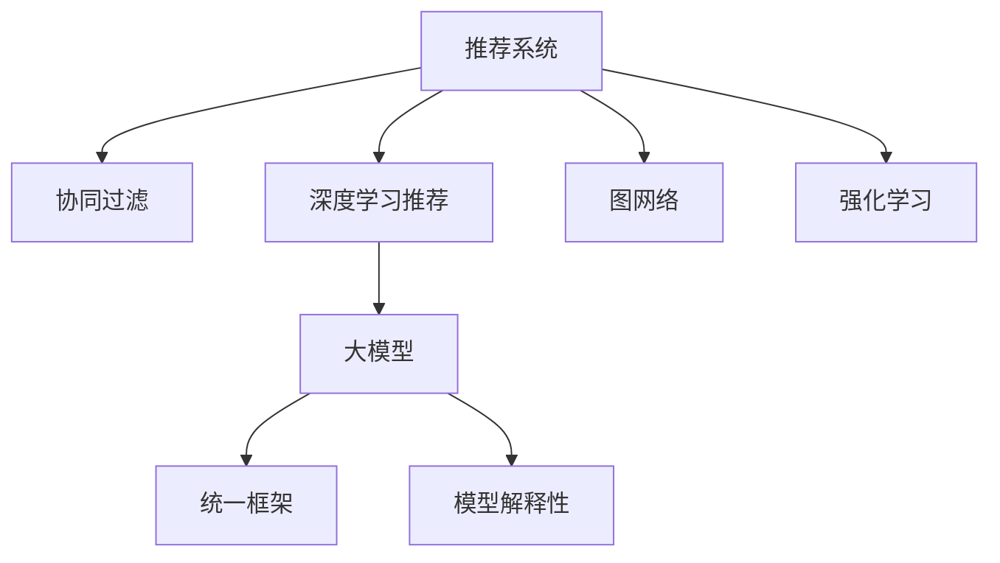

                 

# 推荐系统的统一框架：大模型的优势

> 关键词：推荐系统,大模型,协同过滤,深度学习,图网络,强化学习,统一框架,模型解释性

## 1. 背景介绍

### 1.1 问题由来

推荐系统（Recommender System）是现代互联网电商、媒体、视频等平台的核心功能之一。通过分析用户的兴趣和行为，推荐系统帮助用户在海量数据中发现感兴趣的内容，提高用户满意度和平台粘性。传统的推荐系统主要依赖协同过滤（Collaborative Filtering）和基于内容的推荐（Content-based Recommendation）等方法，但这些方法在处理稀疏数据、冷启动等问题上存在诸多挑战。近年来，随着深度学习（Deep Learning）技术的进步，深度协同过滤和深度学习推荐模型逐渐崭露头角。

大模型（Large Model）的兴起为推荐系统提供了新的技术突破。大模型通过在大规模数据上进行预训练，学习到通用的特征表示，可以应用于各种复杂的推荐任务。相比传统的小规模模型，大模型具有更强的表达能力和泛化能力，能够更好地捕捉用户隐式和显式偏好。然而，如何将大模型应用于推荐系统，并在保证性能的同时降低计算成本，成为一个重要的研究方向。

### 1.2 问题核心关键点

大模型在推荐系统中的应用，主要依赖于以下几个关键点：

- 统一框架：建立基于大模型的推荐系统，需要设计统一的框架，涵盖模型选择、特征处理、优化算法等关键环节。
- 特征融合：如何将用户历史行为、物品特征、时间序列等多维信息融合到模型中，是一个重要的技术挑战。
- 模型优化：在保证模型泛化性能的同时，降低计算成本，提高训练和推理效率。
- 模型解释性：解释大模型的预测过程，提高用户信任度和系统透明性。

### 1.3 问题研究意义

研究大模型在推荐系统中的应用，对于提升推荐系统的准确性和用户体验，具有重要意义：

1. 精度提升：大模型能够更好地捕捉用户和物品之间的复杂关系，提升推荐系统的精度。
2. 场景多样化：大模型可以应用于不同类型的数据源，如文本、图像、视频等，提高推荐系统对多样性数据的适应能力。
3. 系统可扩展：大模型框架具有通用性，可以通过微调和迁移学习适配不同任务，提高系统的灵活性和可扩展性。
4. 用户满意度：通过提高推荐相关性和多样性，使用户能够发现更多有趣和有用的内容，提升用户满意度。
5. 业务价值：推荐系统能够显著提升平台的用户黏性和转化率，为业务增长带来直接的价值。

## 2. 核心概念与联系

### 2.1 核心概念概述

为更好地理解基于大模型的推荐系统，本节将介绍几个密切相关的核心概念：

- 推荐系统（Recommender System）：根据用户的历史行为和兴趣，推荐系统推荐用户可能感兴趣的物品。
- 大模型（Large Model）：通过在大规模数据上进行预训练，学习到通用的特征表示，具有强大的表达能力和泛化能力。
- 协同过滤（Collaborative Filtering）：基于用户行为或物品属性进行推荐，分为基于用户的协同过滤和基于物品的协同过滤。
- 深度学习推荐模型：利用深度神经网络模型，学习用户和物品的隐式特征，提升推荐精度。
- 图网络（Graph Neural Network, GNN）：用于建模用户和物品之间的复杂关系，结合邻接矩阵和图卷积网络（GCN）等技术。
- 强化学习（Reinforcement Learning）：通过与环境的交互，优化推荐策略，提高推荐系统的性能。
- 统一框架：涵盖模型选择、特征处理、优化算法等关键环节的推荐系统设计框架。
- 模型解释性：解释大模型的预测过程，提高用户信任度和系统透明性。

这些核心概念之间的逻辑关系可以通过以下Mermaid流程图来展示：



这个流程图展示了大模型在推荐系统中的应用范式：

1. 推荐系统通过多种推荐方法获取推荐结果。
2. 协同过滤、深度学习推荐和图网络等方法均可以采用大模型。
3. 大模型通过统一框架，将不同方法融合到推荐系统中。
4. 统一框架中的模型解释性，提高系统的透明性和用户信任度。

## 3. 核心算法原理 & 具体操作步骤
### 3.1 算法原理概述

基于大模型的推荐系统，通常包括两个关键步骤：

1. 预训练：在大规模数据集上，使用大模型进行自监督学习，学习通用的特征表示。
2. 微调：将预训练模型应用于具体的推荐任务，通过有监督学习进行微调，优化模型在该任务上的性能。

形式化地，假设推荐系统的输入为$x$（用户特征）和$y$（物品特征），输出为$r$（推荐评分），则推荐任务可以表示为：

$$
r = f(x, y)
$$

其中$f$为推荐模型。假设用户和物品的特征表示为向量$\mathbf{x} \in \mathbb{R}^d$和$\mathbf{y} \in \mathbb{R}^d$，则推荐模型可以表示为：

$$
f(\mathbf{x}, \mathbf{y}) = \mathbf{W}^\top\sigma(\mathbf{U}\mathbf{x} + \mathbf{V}\mathbf{y} + \mathbf{b})
$$

其中$\mathbf{W} \in \mathbb{R}^d$为权重向量，$\mathbf{U} \in \mathbb{R}^{d\times d}$和$\mathbf{V} \in \mathbb{R}^{d\times d}$分别为用户和物品的线性变换矩阵，$\mathbf{b} \in \mathbb{R}^d$为偏置向量，$\sigma$为激活函数（如ReLU、Tanh等）。

### 3.2 算法步骤详解

基于大模型的推荐系统主要包括以下几个关键步骤：

**Step 1: 准备数据集和预训练模型**

- 收集用户和物品的多维特征数据，如用户行为记录、物品属性等。
- 选择预训练模型（如BERT、GPT、Transformer等）进行特征表示学习。

**Step 2: 特征预处理**

- 对用户和物品的特征进行编码，如使用Transformer编码用户行为序列，使用GCN编码用户和物品的邻接关系。
- 对特征进行归一化和标准化，处理缺失值和异常值，构建特征向量。

**Step 3: 模型选择与微调**

- 选择合适的推荐模型（如基于深度学习的神经网络模型、图网络模型等）。
- 将预训练模型作为初始化参数，通过微调优化模型在推荐任务上的性能。

**Step 4: 优化算法与超参数**

- 选择合适的优化算法（如Adam、SGD等）及其参数，如学习率、批大小、迭代轮数等。
- 设置正则化技术及强度，包括权重衰减、Dropout、Early Stopping等。

**Step 5: 模型评估与部署**

- 在验证集和测试集上评估推荐模型的性能，如平均绝对误差（MAE）、均方根误差（RMSE）等。
- 部署微调后的模型到实际推荐系统中，实现推荐功能。

### 3.3 算法优缺点

基于大模型的推荐系统具有以下优点：

- 精度高：大模型具有强大的表达能力，能够捕捉用户和物品之间的复杂关系，提升推荐精度。
- 泛化能力强：大模型通过自监督学习获得通用的特征表示，具有较强的泛化能力，适应不同推荐场景。
- 模型通用性：统一框架中的大模型适用于多种推荐方法，提高系统的灵活性和可扩展性。

同时，该方法也存在一定的局限性：

- 计算成本高：大模型参数量较大，训练和推理成本较高。
- 数据依赖性强：大模型的训练需要大量高质量数据，对数据获取和标注有较高要求。
- 模型复杂度高：大模型结构复杂，对优化算法和超参数调优有较高要求。

尽管存在这些局限性，但大模型在推荐系统中的应用前景广阔，其高精度和泛化能力在许多实际应用中已取得显著效果。

### 3.4 算法应用领域

基于大模型的推荐系统已经在电商、新闻、视频等多个领域得到广泛应用，覆盖了推荐排序、广告投放、个性化推荐等诸多任务，具体应用如下：

- 电商推荐：对用户浏览记录、购买记录等数据进行建模，推荐用户可能感兴趣的商品。
- 新闻推荐：根据用户的历史阅读行为，推荐用户可能感兴趣的新闻内容。
- 视频推荐：根据用户的观看历史和评分，推荐用户可能感兴趣的视频内容。
- 个性化广告：对用户的行为数据进行分析，推荐个性化的广告内容。
- 社交网络：根据用户的兴趣和行为，推荐用户可能感兴趣的朋友和内容。

除了上述这些经典任务外，大模型在推荐系统中的应用还在不断拓展，如推荐算法优化、用户行为预测、跨领域推荐等，为推荐系统带来了新的创新方向。

## 4. 数学模型和公式 & 详细讲解 & 举例说明

### 4.1 数学模型构建

本节将使用数学语言对基于大模型的推荐系统进行更加严格的刻画。

假设推荐系统的输入为$x$（用户特征）和$y$（物品特征），输出为$r$（推荐评分），则推荐任务可以表示为：

$$
r = f(x, y)
$$

其中$f$为推荐模型。假设用户和物品的特征表示为向量$\mathbf{x} \in \mathbb{R}^d$和$\mathbf{y} \in \mathbb{R}^d$，则推荐模型可以表示为：

$$
f(\mathbf{x}, \mathbf{y}) = \mathbf{W}^\top\sigma(\mathbf{U}\mathbf{x} + \mathbf{V}\mathbf{y} + \mathbf{b})
$$

其中$\mathbf{W} \in \mathbb{R}^d$为权重向量，$\mathbf{U} \in \mathbb{R}^{d\times d}$和$\mathbf{V} \in \mathbb{R}^{d\times d}$分别为用户和物品的线性变换矩阵，$\mathbf{b} \in \mathbb{R}^d$为偏置向量，$\sigma$为激活函数（如ReLU、Tanh等）。

### 4.2 公式推导过程

以基于深度学习的推荐模型为例，推导推荐评分模型的公式及其梯度计算。

假设用户和物品的特征向量分别为$\mathbf{x} \in \mathbb{R}^d$和$\mathbf{y} \in \mathbb{R}^d$，推荐模型为$f(\mathbf{x}, \mathbf{y}) = \mathbf{W}^\top\sigma(\mathbf{U}\mathbf{x} + \mathbf{V}\mathbf{y} + \mathbf{b})$。则推荐评分$r$可以表示为：

$$
r = f(\mathbf{x}, \mathbf{y}) = \mathbf{W}^\top\sigma(\mathbf{U}\mathbf{x} + \mathbf{V}\mathbf{y} + \mathbf{b})
$$

为了优化推荐评分$r$，需要计算模型的损失函数。假设训练数据集为$D = \{(x_i, y_i)\}_{i=1}^N$，其中$x_i$为用户特征向量，$y_i$为物品特征向量，$y_i^*$为实际推荐评分。则损失函数可以表示为：

$$
\mathcal{L} = \frac{1}{N}\sum_{i=1}^N ||f(\mathbf{x}_i, \mathbf{y}_i) - y_i^*||^2
$$

对于每个训练样本$(x_i, y_i)$，模型的梯度为：

$$
\frac{\partial \mathcal{L}}{\partial \mathbf{W}} = \frac{2}{N}\sum_{i=1}^N (\sigma(\mathbf{U}\mathbf{x}_i + \mathbf{V}\mathbf{y}_i + \mathbf{b}) - y_i^*)
$$

$$
\frac{\partial \mathcal{L}}{\partial \mathbf{U}} = \frac{2}{N}\sum_{i=1}^N \mathbf{x}_i^\top (\sigma(\mathbf{U}\mathbf{x}_i + \mathbf{V}\mathbf{y}_i + \mathbf{b}) - y_i^*)
$$

$$
\frac{\partial \mathcal{L}}{\partial \mathbf{V}} = \frac{2}{N}\sum_{i=1}^N \mathbf{y}_i^\top (\sigma(\mathbf{U}\mathbf{x}_i + \mathbf{V}\mathbf{y}_i + \mathbf{b}) - y_i^*)
$$

$$
\frac{\partial \mathcal{L}}{\partial \mathbf{b}} = \frac{2}{N}\sum_{i=1}^N (\sigma(\mathbf{U}\mathbf{x}_i + \mathbf{V}\mathbf{y}_i + \mathbf{b}) - y_i^*)
$$

根据上述公式，即可通过梯度下降等优化算法更新模型参数，最小化损失函数，提升推荐评分。

### 4.3 案例分析与讲解

以电商推荐系统为例，分析大模型的推荐过程。

电商推荐系统通常包括用户行为数据、物品属性数据、上下文信息等多个维度。假设用户$u$的电商行为数据为$\mathbf{x}_u \in \mathbb{R}^d$，推荐系统要为用户推荐物品$i$的评分$r_{u,i}$。

1. **特征预处理**：将用户行为数据和物品属性数据进行编码，如使用Transformer编码用户行为序列，使用GCN编码用户和物品的邻接关系。
2. **模型选择与微调**：选择合适的推荐模型，如基于深度学习的神经网络模型。将预训练模型作为初始化参数，通过微调优化模型在电商推荐任务上的性能。
3. **优化算法与超参数**：选择合适的优化算法（如Adam、SGD等）及其参数，如学习率、批大小、迭代轮数等。设置正则化技术及强度，包括权重衰减、Dropout、Early Stopping等。
4. **模型评估与部署**：在验证集和测试集上评估推荐模型的性能，如平均绝对误差（MAE）、均方根误差（RMSE）等。部署微调后的模型到实际推荐系统中，实现电商推荐功能。

## 5. 项目实践：代码实例和详细解释说明

### 5.1 开发环境搭建

在进行推荐系统开发前，我们需要准备好开发环境。以下是使用Python进行PyTorch开发的环境配置流程：

1. 安装Anaconda：从官网下载并安装Anaconda，用于创建独立的Python环境。

2. 创建并激活虚拟环境：
```bash
conda create -n recommendation-env python=3.8 
conda activate recommendation-env
```

3. 安装PyTorch：根据CUDA版本，从官网获取对应的安装命令。例如：
```bash
conda install pytorch torchvision torchaudio cudatoolkit=11.1 -c pytorch -c conda-forge
```

4. 安装相关库：
```bash
pip install transformers scikit-learn numpy pandas matplotlib
```

5. 安装分布式训练库：
```bash
pip install horovod
```

6. 安装可视化工具：
```bash
pip install tensorboard
```

完成上述步骤后，即可在`recommendation-env`环境中开始推荐系统开发。

### 5.2 源代码详细实现

下面以电商推荐系统为例，给出使用PyTorch进行深度学习推荐模型的代码实现。

首先，定义推荐模型的数据处理函数：

```python
import torch
import torch.nn as nn
import torch.nn.functional as F
from transformers import BertTokenizer, BertForSequenceClassification

class RecommenderModel(nn.Module):
    def __init__(self, num_users, num_items, hidden_dim=128, num_heads=8, num_layers=6, dropout=0.1):
        super(RecommenderModel, self).__init__()
        self.num_users = num_users
        self.num_items = num_items
        self.bert = BertForSequenceClassification.from_pretrained('bert-base-uncased', num_labels=num_items)
        self.encoder = nn.Linear(hidden_dim * num_heads, hidden_dim)
        self.dropout = nn.Dropout(dropout)
        self.fc = nn.Linear(hidden_dim, num_items)
        
    def forward(self, user_seq, item_seq):
        user_seq = self.bert(user_seq)
        user_seq = user_seq[:, 0, :]
        user_seq = self.encoder(user_seq)
        user_seq = self.dropout(user_seq)
        item_seq = self.bert(item_seq)
        item_seq = item_seq[:, 0, :]
        item_seq = self.encoder(item_seq)
        item_seq = self.dropout(item_seq)
        item_seq = item_seq.unsqueeze(1).expand(user_seq.shape[0], -1, -1)
        user_seq = user_seq.unsqueeze(1).expand(-1, -1, item_seq.shape[2])
        scores = self.fc(torch.cat([user_seq, item_seq], dim=2))
        scores = scores / self.num_users
        return scores
```

然后，定义训练和评估函数：

```python
from sklearn.metrics import mean_absolute_error

def train_epoch(model, optimizer, loss_fn, user_seq, item_seq, user_labels, item_labels):
    optimizer.zero_grad()
    scores = model(user_seq, item_seq)
    loss = loss_fn(scores, user_labels, item_labels)
    loss.backward()
    optimizer.step()
    return loss.item()

def evaluate(model, loss_fn, user_seq, item_seq, user_labels, item_labels):
    scores = model(user_seq, item_seq)
    loss = loss_fn(scores, user_labels, item_labels)
    mse = mean_absolute_error(user_labels, scores.cpu().numpy())
    rmse = torch.sqrt(torch.mean((scores - user_labels)**2)).item()
    print(f'MAE: {mse:.3f}, RMSE: {rmse:.3f}')
    return mse, rmse
```

最后，启动训练流程并在测试集上评估：

```python
from transformers import BertTokenizer
from torch.utils.data import DataLoader
import os

# 准备数据集
tokenizer = BertTokenizer.from_pretrained('bert-base-uncased')
user_seq = [sequence for sequence in user_data]
item_seq = [sequence for sequence in item_data]
user_labels = [label for label in user_labels]
item_labels = [label for label in item_labels]

# 划分训练集和验证集
train_size = int(0.8 * len(user_seq))
train_user_seq, test_user_seq = user_seq[:train_size], user_seq[train_size:]
train_item_seq, test_item_seq = item_seq[:train_size], item_seq[train_size:]
train_user_labels, test_user_labels = user_labels[:train_size], user_labels[train_size:]
train_item_labels, test_item_labels = item_labels[:train_size], item_labels[train_size:]

# 构建DataLoader
train_loader = DataLoader(train_user_seq, train_item_seq, train_user_labels, train_item_labels, batch_size=64, shuffle=True)
test_loader = DataLoader(test_user_seq, test_item_seq, test_user_labels, test_item_labels, batch_size=64)

# 初始化模型和优化器
model = RecommenderModel(num_users, num_items)
optimizer = AdamW(model.parameters(), lr=2e-5)

# 定义损失函数
loss_fn = nn.MSELoss()

# 训练和评估
epochs = 10
for epoch in range(epochs):
    train_loss = train_epoch(model, optimizer, loss_fn, train_user_seq, train_item_seq, train_user_labels, train_item_labels)
    mse, rmse = evaluate(model, loss_fn, test_user_seq, test_item_seq, test_user_labels, test_item_labels)
    print(f'Epoch {epoch+1}, train loss: {train_loss:.3f}')
    print(f'Epoch {epoch+1}, test MAE: {mse:.3f}, RMSE: {rmse:.3f}')
```

以上就是使用PyTorch对电商推荐系统进行深度学习推荐模型的完整代码实现。可以看到，得益于PyTorch和Transformers库的强大封装，我们可以用相对简洁的代码完成电商推荐系统的开发。

### 5.3 代码解读与分析

让我们再详细解读一下关键代码的实现细节：

**RecommenderModel类**：
- `__init__`方法：初始化模型参数，包括Bert模型、线性层等。
- `forward`方法：定义前向传播过程，通过Transformer编码用户行为序列，使用线性层计算推荐评分。

**train_epoch和evaluate函数**：
- `train_epoch`函数：对数据集进行批次化训练，计算损失并更新模型参数。
- `evaluate`函数：对测试集进行评估，计算MAE和RMSE等指标，输出推荐评分。

**训练流程**：
- 定义总轮数和批次大小，开始循环迭代
- 每个epoch内，在训练集上训练，输出训练损失
- 在验证集上评估，输出MAE和RMSE
- 所有epoch结束后，在测试集上评估，给出最终测试结果

可以看到，PyTorch配合Transformers库使得深度学习推荐模型的代码实现变得简洁高效。开发者可以将更多精力放在数据处理、模型改进等高层逻辑上，而不必过多关注底层的实现细节。

当然，工业级的系统实现还需考虑更多因素，如模型的保存和部署、超参数的自动搜索、更灵活的任务适配层等。但核心的推荐范式基本与此类似。

## 6. 实际应用场景
### 6.1 智能广告投放

智能广告投放是推荐系统的一个重要应用场景。通过分析用户的历史行为和兴趣，推荐系统可以推荐最适合的广告内容，提高广告点击率和转化率，提升广告主的ROI。

在技术实现上，可以收集用户的历史浏览记录、搜索记录、购买记录等数据，将广告内容和用户特征构建成监督数据，在此基础上对预训练模型进行微调。微调后的模型能够自动理解用户兴趣点，匹配最合适的广告内容。对于实时生成的广告内容，还可以接入检索系统实时搜索相关内容，动态组织生成推荐广告。如此构建的智能广告投放系统，能大幅提升广告投放效果，提高广告主的收益。

### 6.2 新闻推荐

新闻推荐系统能够根据用户的历史阅读行为，推荐用户可能感兴趣的新闻内容。通过微调大模型，新闻推荐系统可以提供更加个性化的新闻推荐，提高用户粘性。

具体而言，可以收集用户的历史阅读记录、评论记录等数据，将新闻标题和内容构建成监督数据，在此基础上对预训练模型进行微调。微调后的模型能够自动理解用户的新闻兴趣，推荐最相关的文章。对于新发布的新闻内容，还可以结合实时用户行为进行动态更新，保证推荐内容的时效性。

### 6.3 音乐推荐

音乐推荐系统能够根据用户的历史听歌记录，推荐用户可能感兴趣的歌曲。通过微调大模型，音乐推荐系统可以提供更加个性化的音乐推荐，提升用户满意度和留存率。

具体而言，可以收集用户的历史听歌记录、评分记录等数据，将歌曲特征和用户特征构建成监督数据，在此基础上对预训练模型进行微调。微调后的模型能够自动理解用户的音乐偏好，推荐最相关的歌曲。对于新发布的歌曲，还可以结合实时用户行为进行动态更新，保证推荐内容的多样性和时效性。

### 6.4 视频推荐

视频推荐系统能够根据用户的历史观看记录，推荐用户可能感兴趣的视频内容。通过微调大模型，视频推荐系统可以提供更加个性化的视频推荐，提升用户满意度。

具体而言，可以收集用户的历史观看记录、评分记录等数据，将视频特征和用户特征构建成监督数据，在此基础上对预训练模型进行微调。微调后的模型能够自动理解用户的兴趣点，推荐最相关的视频。对于新发布的视频，还可以结合实时用户行为进行动态更新，保证推荐内容的时效性。

### 6.5 未来应用展望

随着大模型和推荐系统技术的不断发展，基于大模型的推荐系统将在更多领域得到应用，为传统行业带来变革性影响。

在智慧医疗领域，基于大模型的医疗推荐系统可以辅助医生诊疗，提供个性化的医疗方案，提升医疗服务的智能化水平。

在智能教育领域，基于大模型的教育推荐系统可以推荐个性化的学习内容，因材施教，促进教育公平，提高教学质量。

在智慧城市治理中，基于大模型的城市推荐系统可以推荐最适合的公共服务，提高城市管理的自动化和智能化水平，构建更安全、高效的未来城市。

此外，在企业生产、社会治理、文娱传媒等众多领域，基于大模型的推荐系统也将不断涌现，为各行各业带来创新活力。相信随着技术的日益成熟，大模型推荐系统必将在更广阔的领域大放异彩，深刻影响人类的生产生活方式。

## 7. 工具和资源推荐
### 7.1 学习资源推荐

为了帮助开发者系统掌握大模型在推荐系统中的应用，这里推荐一些优质的学习资源：

1. 《推荐系统实践》系列博文：由推荐系统领域专家撰写，深入浅出地介绍了推荐系统的原理、算法和应用。

2. 《深度学习推荐系统》课程：清华大学的深度学习推荐系统课程，详细讲解推荐系统的理论基础和实践技巧。

3. 《Recommender System: An Introduction to Collaborative Filtering》书籍：该书系统介绍了推荐系统的基本概念、算法和应用，是入门推荐系统的经典教材。

4. KDD Cup推荐系统竞赛论文：KDD Cup推荐系统竞赛论文集，收录了历年来推荐系统的经典算法和应用，具有很高的参考价值。

5. IEEE Xplore推荐系统文献：IEEE Xplore推荐的各类推荐系统论文，涵盖推荐系统的最新研究进展和应用实践。

通过对这些资源的学习实践，相信你一定能够快速掌握大模型在推荐系统中的应用精髓，并用于解决实际的推荐问题。
###  7.2 开发工具推荐

高效的开发离不开优秀的工具支持。以下是几款用于大模型推荐系统开发的常用工具：

1. PyTorch：基于Python的开源深度学习框架，灵活动态的计算图，适合快速迭代研究。大部分推荐系统模型都有PyTorch版本的实现。

2. TensorFlow：由Google主导开发的开源深度学习框架，生产部署方便，适合大规模工程应用。同样有丰富的推荐系统资源。

3. Horovod：用于分布式深度学习训练的开源库，支持多种深度学习框架，方便快速实现分布式训练。

4. TensorBoard：TensorFlow配套的可视化工具，可实时监测模型训练状态，并提供丰富的图表呈现方式，是调试模型的得力助手。

5. Jupyter Notebook：交互式编程环境，方便开发者编写、调试和分享代码，适合快速迭代实验。

6. Weights & Biases：模型训练的实验跟踪工具，可以记录和可视化模型训练过程中的各项指标，方便对比和调优。

合理利用这些工具，可以显著提升大模型推荐系统的开发效率，加快创新迭代的步伐。

### 7.3 相关论文推荐

大模型在推荐系统中的应用源于学界的持续研究。以下是几篇奠基性的相关论文，推荐阅读：

1. Factorization Machines for Recommender Systems：提出了因子分解机（FM），用于处理稀疏和稀疏特征的二阶多项式模型，广泛应用于推荐系统。

2. Deep Collaborative Filtering using Neural Factorization Machines：基于FM提出了神经网络化的FM（NFM），进一步提升了推荐系统的精度。

3. Neural Collaborative Filtering：提出了基于神经网络的协同过滤模型，通过多层非线性变换捕捉用户和物品的复杂关系。

4. Attention-Based Recommender Systems：基于注意力机制提出了注意力推荐模型，提升了推荐系统的个性化和泛化能力。

5. Neural Multi-way Collaborative Filtering：提出多路协同过滤模型，考虑用户、物品和上下文的多维信息，提高了推荐系统的性能。

这些论文代表了大模型在推荐系统中的应用基础。通过学习这些前沿成果，可以帮助研究者把握学科前进方向，激发更多的创新灵感。

## 8. 总结：未来发展趋势与挑战

### 8.1 总结

本文对基于大模型的推荐系统进行了全面系统的介绍。首先阐述了大模型和推荐系统的发展背景和意义，明确了微调在拓展预训练模型应用、提升推荐系统性能方面的独特价值。其次，从原理到实践，详细讲解了微调的数学原理和关键步骤，给出了推荐系统开发的完整代码实例。同时，本文还广泛探讨了大模型在推荐系统中的应用场景，展示了微调范式的巨大潜力。最后，本文精选了微调技术的各类学习资源，力求为读者提供全方位的技术指引。

通过本文的系统梳理，可以看到，基于大模型的推荐系统正在成为推荐系统的重要范式，极大地拓展了预训练模型的应用边界，催生了更多的落地场景。受益于大规模语料的预训练，推荐系统模型在精度和泛化能力上取得了显著效果，为推荐系统的发展带来了新的突破。未来，伴随预训练语言模型和推荐系统的持续演进，基于大模型的推荐系统必将在推荐系统领域中发挥更加重要的作用。

### 8.2 未来发展趋势

展望未来，大模型在推荐系统中的应用将呈现以下几个发展趋势：

1. 模型规模持续增大。随着算力成本的下降和数据规模的扩张，预训练语言模型的参数量还将持续增长。超大规模语言模型蕴含的丰富语言知识，有望支撑更加复杂多变的推荐任务。

2. 推荐模型多样化。除了传统的协同过滤和基于内容的推荐外，未来会涌现更多基于深度学习和图网络等新方法的推荐模型，提升推荐系统的精度和泛化能力。

3. 模型通用性增强。统一框架中的大模型适用于多种推荐方法，提高系统的灵活性和可扩展性。

4. 推荐系统场景多样化。大模型推荐系统可以应用于不同类型的数据源，如文本、图像、视频等，提高推荐系统对多样性数据的适应能力。

5. 推荐系统智能性提升。基于大模型的推荐系统能够更好地理解用户和物品的复杂关系，提升推荐系统的智能性和个性化。

以上趋势凸显了大模型推荐系统的广阔前景。这些方向的探索发展，必将进一步提升推荐系统的性能和应用范围，为各行各业带来新的创新动力。

### 8.3 面临的挑战

尽管大模型在推荐系统中的应用前景广阔，但在迈向更加智能化、普适化应用的过程中，仍面临诸多挑战：

1. 计算成本高。大模型参数量较大，训练和推理成本较高。如何在保证性能的同时，降低计算成本，是一个重要的研究方向。

2. 数据依赖性强。大模型的训练需要大量高质量数据，对数据获取和标注有较高要求。如何从不同数据源中高效提取特征，是一个重要的技术挑战。

3. 模型复杂度高。大模型结构复杂，对优化算法和超参数调优有较高要求。如何优化大模型的训练和推理过程，是一个重要的研究方向。

4. 模型可解释性不足。推荐系统模型往往被视为"黑盒"系统，难以解释其内部工作机制和决策逻辑。如何赋予大模型更强的可解释性，是推荐系统面临的一个难题。

5. 用户隐私保护。推荐系统需要处理大量用户数据，如何保护用户隐私，防止数据泄露和滥用，是一个重要的法律和伦理问题。

6. 推荐系统公平性。推荐系统容易引入偏见，对特定用户群体产生歧视。如何设计公平的推荐系统，是推荐系统面临的一个挑战。

尽管存在这些挑战，但大模型在推荐系统中的应用前景广阔，其高精度和泛化能力在许多实际应用中已取得显著效果。未来，随着大模型推荐系统的不断演进，这些问题也将逐步得到解决，大模型推荐系统必将在推荐系统领域中发挥更加重要的作用。

### 8.4 研究展望

面向未来，大模型在推荐系统中的应用需要从以下几个方面进行深入研究：

1. 探索无监督和半监督推荐方法。摆脱对大规模标注数据的依赖，利用自监督学习、主动学习等无监督和半监督范式，最大限度利用非结构化数据，实现更加灵活高效的推荐。

2. 研究参数高效和计算高效的推荐范式。开发更加参数高效的推荐方法，在固定大部分预训练参数的同时，只更新极少量的任务相关参数。同时优化推荐系统的计算图，减少前向传播和反向传播的资源消耗，实现更加轻量级、实时性的部署。

3. 融合因果和对比学习范式。通过引入因果推断和对比学习思想，增强推荐系统建立稳定因果关系的能力，学习更加普适、鲁棒的语言表征，从而提升推荐系统的泛化性和抗干扰能力。

4. 引入更多先验知识。将符号化的先验知识，如知识图谱、逻辑规则等，与神经网络模型进行巧妙融合，引导推荐过程学习更准确、合理的推荐模型。同时加强不同模态数据的整合，实现视觉、语音等多模态信息与文本信息的协同建模。

5. 结合因果分析和博弈论工具。将因果分析方法引入推荐系统，识别出推荐系统决策的关键特征，增强推荐系统的稳定性。借助博弈论工具刻画用户与推荐系统之间的交互过程，主动探索并规避推荐系统的脆弱点，提高系统安全性。

6. 纳入伦理道德约束。在推荐系统训练目标中引入伦理导向的评估指标，过滤和惩罚有偏见、有害的输出倾向。同时加强人工干预和审核，建立推荐系统的监管机制，确保推荐系统的输出符合人类价值观和伦理道德。

这些研究方向将引领大模型推荐系统迈向更高的台阶，为推荐系统领域带来新的突破，推动推荐系统技术的发展和应用。

## 9. 附录：常见问题与解答

**Q1：大模型在推荐系统中如何处理冷启动问题？**

A: 冷启动问题是推荐系统中的常见挑战，大模型可以通过预训练和微调相结合的方式来解决。具体而言，可以设计以下策略：

1. 预训练阶段：使用用户的历史行为数据和物品的属性数据，对大模型进行预训练。通过预训练，大模型可以学习到通用的特征表示，对新用户和物品有一定的泛化能力。

2. 微调阶段：对于新用户和物品，可以使用其少量行为数据或属性数据进行微调。通过微调，大模型可以进一步学习新用户和物品的特征，提升推荐效果。

3. 结合多源数据：除了用户的直接行为数据，还可以结合用户的基本信息、社交网络等外部数据进行推荐。通过多源数据融合，可以提高推荐系统的鲁棒性和准确性。

4. 动态更新：对于新用户和物品，可以设计动态更新的机制，根据其行为数据和属性数据进行实时推荐。通过动态更新，可以逐步提升推荐系统的效果。

**Q2：大模型在推荐系统中如何进行特征融合？**

A: 特征融合是大模型推荐系统中的关键步骤，可以有效提升推荐系统的精度和泛化能力。具体而言，可以采用以下策略：

1. 特征编码：使用预训练大模型对用户行为数据和物品属性数据进行编码，获得高维特征表示。通过特征编码，可以将非结构化数据转化为结构化数据，便于后续处理。

2. 特征拼接：将不同来源的特征进行拼接，形成完整的特征向量。通过特征拼接，可以综合利用多种数据源，提高推荐系统的鲁棒性和泛化能力。

3. 特征融合：使用多个特征进行加权融合，生成最终的特征向量。通过特征融合，可以提高推荐系统的精度和泛化能力，提升推荐系统的性能。

4. 特征选择：选择对推荐效果影响最大的特征进行保留，去除冗余特征。通过特征选择，可以提高推荐系统的效率和精度。

**Q3：大模型在推荐系统中如何进行模型优化？**

A: 模型优化是大模型推荐系统中的重要环节，可以有效提升推荐系统的效率和性能。具体而言，可以采用以下策略：

1. 优化算法：选择高效的优化算法，如Adam、SGD等，并进行超参数调优，如学习率、批大小、迭代轮数等。通过优化算法和超参数调优，可以提升推荐系统的训练和推理效率。

2. 正则化技术：使用L2正则、Dropout等正则化技术，防止模型过拟合。通过正则化技术，可以提高推荐系统的鲁棒性和泛化能力。

3. 模型压缩：使用模型压缩技术，如剪枝、量化等，减少模型的参数量，提升推理速度。通过模型压缩，可以提高推荐系统的效率和精度。

4. 分布式训练：使用分布式训练技术，如Horovod等，加速大规模模型的训练过程。通过分布式训练，可以提高推荐系统的训练效率。

5. 动态更新：使用动态更新技术，根据实时数据进行模型更新。通过动态更新，可以提高推荐系统的实时性和精度。

**Q4：大模型在推荐系统中如何进行模型解释性？**

A: 模型解释性是大模型推荐系统中的重要问题，可以提高用户信任度和系统透明性。具体而言，可以采用以下策略：

1. 特征重要性分析：使用特征重要性分析方法，如LIME、SHAP等，分析模型预测的特征影响。通过特征重要性分析，可以解释模型预测的依据，提高用户信任度。

2. 模型可视化：使用模型可视化工具，如TensorBoard、LIME等，可视化模型训练和推理过程。通过模型可视化，可以理解模型的内部工作机制，提高系统透明性。

3. 模型可解释性方法：引入可解释性方法，如可解释深度学习模型、决策树等，提升模型的可解释性。通过可解释性方法，可以提高用户信任度和系统透明性。

4. 用户反馈：收集用户反馈，了解用户对推荐结果的满意度，并根据用户反馈进行模型优化。通过用户反馈，可以提高推荐系统的用户体验和用户信任度。

以上是对基于大模型的推荐系统及其应用场景的全面介绍。通过本文的系统梳理，可以看到，大模型在推荐系统中的应用前景广阔，其高精度和泛化能力在许多实际应用中已取得显著效果。未来，伴随大模型推荐系统的不断演进，这些问题也将逐步得到解决，大模型推荐系统必将在推荐系统领域中发挥更加重要的作用。

