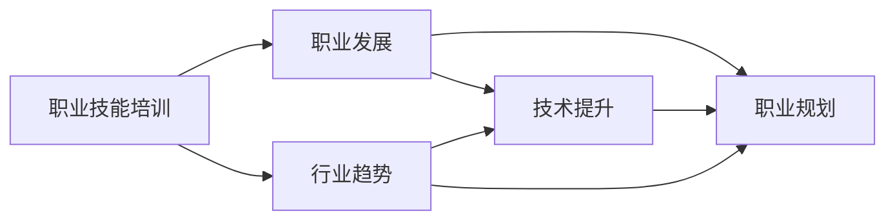

                 

# 提供特定职业的实用知识和技能培训

> 关键词：职业技能培训, 职业发展, 技术提升, 职业规划, 行业趋势

## 1. 背景介绍

### 1.1 问题由来

在快速变化的现代职场中，职业技能的快速更新和提升是每个从业者必须面对的挑战。无论是刚刚踏入职场的新人，还是希望在现有领域内更进一步的中高级职业者，掌握最新的职业技能都是职业发展的关键。然而，随着技术的不断进步，传统的培训方式和课程内容已无法满足现代职业发展的需求。

### 1.2 问题核心关键点

技术快速发展带来职业培训的几大核心关键点：

- **快速变化**：新技术和新工具层出不穷，职业者必须迅速掌握最新的知识和技能。
- **技能多样性**：现代职业者往往需要具备多种技能，跨领域协作越来越多。
- **灵活学习**：传统的集中式培训方式难以适应快节奏的工作环境，在线学习和自主学习成为趋势。
- **实践导向**：理论知识与实际应用结合，通过项目实践快速掌握技能。
- **终身学习**：职业培训应该是持续性的，而非一次性事件，终身学习理念日益重要。

### 1.3 问题研究意义

面对以上挑战，提供实用且灵活的职业技能培训具有重要意义：

- **提升职业竞争力**：通过最新知识和技能的培训，职业者可以更好地适应技术更新，提升职场竞争力。
- **促进职业发展**：系统性的职业技能培训有助于职业者制定明确的职业发展路径，实现职业目标。
- **增强企业竞争力**：培训有能力的员工，是企业提升竞争力、实现持续发展的关键。
- **支持社会进步**：提供高质量的职业技能培训，有助于推动整个社会的科技进步和经济发展。

## 2. 核心概念与联系

### 2.1 核心概念概述

为了更好地理解职业培训的本质和实施方法，本节将介绍几个核心概念：

- **职业技能培训**：通过课程、讲座、实践等形式，帮助职业者掌握特定职业所需的技能和知识。
- **职业发展**：通过培训和持续学习，提升职业者对当前职业的适应性和对未来的规划能力。
- **技术提升**：指职业者通过技能培训，掌握新技术和新工具，提高工作效率和质量。
- **职业规划**：职业者根据自身兴趣、能力和职业目标，制定长期的职业发展计划。
- **行业趋势**：指特定行业的发展方向和关键技术，职业者需要紧跟行业趋势，以适应行业变化。

这些概念之间具有密切联系，构成了一个系统性的职业培训框架。

### 2.2 核心概念原理和架构的 Mermaid 流程图



这个流程图展示了职业技能培训、职业发展、技术提升、职业规划与行业趋势之间的关系。职业技能培训是基础，通过技术提升和职业规划，职业者可以不断适应行业趋势，实现职业发展。

## 3. 核心算法原理 & 具体操作步骤

### 3.1 算法原理概述

职业培训的核心算法原理基于“学习和实践相结合”的理念，通过系统化的课程设计、实践活动和持续学习，帮助职业者掌握所需技能和知识。核心步骤如下：

1. **需求分析**：识别职业者在特定职业路径上所需的关键技能和知识。
2. **课程设计**：根据需求分析结果，设计涵盖关键技能和知识的培训课程。
3. **实践活动**：通过项目、工作坊、模拟实践等形式，帮助职业者将理论知识转化为实际技能。
4. **反馈评估**：通过定期的评估和反馈，调整培训内容和方法，确保培训效果。
5. **持续学习**：建立持续学习机制，鼓励职业者不断更新和提升技能。

### 3.2 算法步骤详解

#### 3.2.1 需求分析

需求分析是培训的第一步，通过与职业者进行深入的访谈和调查，了解他们当前的技能水平、兴趣和职业目标。这一步骤需要考虑以下因素：

- **现有技能**：评估职业者当前掌握的技能，识别知识和技能缺口。
- **兴趣和动机**：了解职业者的职业兴趣和学习动机，帮助设计符合其兴趣的培训课程。
- **职业目标**：明确职业者的短期和长期职业目标，确保培训内容与目标相符。
- **行业趋势**：分析行业当前和未来的发展趋势，确保培训内容与时俱进。

#### 3.2.2 课程设计

课程设计需要根据需求分析结果，设计一系列既有理论深度又有实践价值的培训模块。关键步骤如下：

- **模块划分**：将培训内容划分为若干模块，每个模块聚焦于一种或多种关键技能。
- **理论学习**：每个模块包含相应的理论知识讲解，确保职业者掌握基础概念和原理。
- **实践活动**：每个模块包含实践活动，通过实际项目、模拟场景等方式，帮助职业者应用理论知识。
- **案例分析**：引入真实案例，帮助职业者理解理论知识在实际应用中的具体场景。
- **评估标准**：为每个模块设置评估标准，确保职业者能够达到预期的学习目标。

#### 3.2.3 实践活动

实践活动是培训中的重要环节，通过实际操作和项目实践，帮助职业者将理论知识转化为实际技能。关键步骤如下：

- **项目选择**：选择与职业目标和培训内容相关的项目，确保实践活动的针对性。
- **团队协作**：通过团队协作，模拟真实工作环境，增强职业者的团队合作能力和沟通技巧。
- **导师指导**：安排经验丰富的导师进行指导，帮助职业者解决实践中的问题，提供专业建议。
- **反馈机制**：建立及时反馈机制，帮助职业者了解自己的表现，调整学习策略。

#### 3.2.4 反馈评估

反馈评估是培训过程中的重要环节，通过定期的评估和反馈，确保职业者掌握所需技能和知识。关键步骤如下：

- **定期评估**：定期进行知识和技能评估，评估职业者的学习进展。
- **反馈机制**：建立双向反馈机制，职业者和导师可以互相提供反馈，帮助改进学习方法和培训内容。
- **调整培训**：根据评估结果和反馈，调整培训内容和方式，确保培训效果。
- **改进课程**：根据评估结果和反馈，持续改进课程设计，提高培训质量。

#### 3.2.5 持续学习

持续学习是培训的最终目标，通过建立持续学习机制，帮助职业者不断更新和提升技能。关键步骤如下：

- **学习资源**：提供丰富的学习资源，如在线课程、技术博客、学习社区等，鼓励职业者自主学习。
- **学习计划**：帮助职业者制定个性化的学习计划，确保学习活动的系统性和连贯性。
- **学习社群**：建立学习社群，促进职业者之间的交流和分享，增强学习动力。
- **定期复盘**：定期进行复盘和总结，帮助职业者回顾学习历程，制定下一步学习计划。

### 3.3 算法优缺点

#### 3.3.1 优点

1. **针对性**：基于需求分析的课程设计，确保培训内容与职业者的实际需求和职业目标相符。
2. **实践导向**：通过项目实践和实际应用，帮助职业者快速掌握技能，提高实践能力。
3. **反馈机制**：定期反馈和评估，确保职业者能够及时了解自己的学习进展，调整学习策略。
4. **持续学习**：通过持续学习机制，帮助职业者不断更新和提升技能，适应行业变化。

#### 3.3.2 缺点

1. **时间和资源投入大**：系统性的培训需要大量时间和资源投入，可能不适合所有职业者。
2. **灵活性不足**：培训内容较为固定，难以灵活应对技术快速变化的情况。
3. **学习效果依赖于导师**：培训效果在很大程度上依赖于导师的经验和指导，对导师的要求较高。
4. **持续学习机制的落实难度较大**：建立和维护持续学习机制需要较多的管理投入，可能难以全面落实。

### 3.4 算法应用领域

基于以上算法原理和操作步骤，职业培训可以应用于多个领域，具体包括：

- **IT和工程领域**：通过系统化的课程设计和实践活动，帮助职业者掌握最新的编程语言、开发工具和技术栈。
- **商业和金融领域**：通过培训财务管理、数据分析、市场分析等关键技能，帮助职业者提升商业洞察力和决策能力。
- **医疗和健康领域**：通过培训诊断技术、健康管理、患者沟通等关键技能，帮助职业者提升专业能力和服务质量。
- **教育领域**：通过培训教育理论、教学设计、在线教育平台等关键技能，帮助职业者提升教学效果和创新能力。
- **公共服务领域**：通过培训公共管理、社区服务、危机处理等关键技能，帮助职业者提升服务能力和公共意识。

## 4. 数学模型和公式 & 详细讲解 & 举例说明

### 4.1 数学模型构建

为了更精确地描述职业培训的过程，可以构建一个简单的数学模型。假设职业者当前技能水平为 $S_0$，培训后的技能水平为 $S_T$，培训过程中的知识和技能提升量为 $S$。则职业培训的数学模型可以表示为：

$$
S_T = S_0 + S
$$

其中 $S$ 由多个因素决定，包括培训课程设计、实践活动、导师指导等。

### 4.2 公式推导过程

根据职业培训的数学模型，可以进行以下公式推导：

1. **知识提升量**：培训过程中的知识提升量 $S_k$ 由课程设计决定，可以通过计算课程内容和难度的积分来表示。

$$
S_k = \int_{t_0}^{t_T} \frac{dS_k}{dt} dt
$$

其中 $t_0$ 和 $t_T$ 分别表示培训开始和结束的时间。

2. **技能提升量**：培训过程中的技能提升量 $S_s$ 由实践活动决定，可以通过计算实践活动的效果和频率来表示。

$$
S_s = \int_{t_0}^{t_T} \frac{dS_s}{dt} dt
$$

其中 $t_0$ 和 $t_T$ 分别表示实践活动开始和结束的时间。

3. **整体提升量**：培训过程中的整体提升量 $S$ 为知识提升量和技能提升量的总和。

$$
S = S_k + S_s
$$

### 4.3 案例分析与讲解

假设一个软件开发人员在参加为期三个月的培训课程后，技能水平从 $S_0$ 提升到 $S_T$。根据数学模型，培训过程中的知识和技能提升量为 $S$。

- **知识提升量**：培训课程共涵盖 12 个模块，每个模块的知识量为 $K_i$，课程时长为 $T_i$。则知识提升量 $S_k$ 为：

$$
S_k = \sum_{i=1}^{12} K_i \cdot T_i
$$

- **技能提升量**：实践活动共包含 6 个项目，每个项目的技能提升量为 $S_i$，项目时长为 $T_i$。则技能提升量 $S_s$ 为：

$$
S_s = \sum_{i=1}^{6} S_i \cdot T_i
$$

- **整体提升量**：整体提升量 $S$ 为知识提升量和技能提升量的总和。

$$
S = S_k + S_s
$$

## 5. 项目实践：代码实例和详细解释说明

### 5.1 开发环境搭建

为了进行职业培训的实践开发，需要搭建一个高效和灵活的开发环境。以下是在Python环境下搭建开发环境的步骤：

1. **安装Python**：安装最新版本的Python，建议使用虚拟环境（如Python 3.9以上）。
2. **安装Jupyter Notebook**：使用pip安装Jupyter Notebook，支持在线编写和运行代码。
3. **安装必要的库**：安装如Pandas、NumPy、Matplotlib等数据处理和可视化库。
4. **搭建学习平台**：使用Django或Flask搭建学习管理系统，支持课程管理、用户注册、作业提交等功能。

### 5.2 源代码详细实现

以下是一个简单的Python代码示例，用于计算职业培训过程中的技能提升量：

```python
import numpy as np

# 假设课程和实践活动的时间长度
course_times = np.array([1, 2, 1, 2, 1, 2, 1, 2, 1, 2, 1, 2])
project_times = np.array([3, 3, 3, 3, 3, 3])

# 假设课程和实践活动的知识量和技能提升量
course_knowledge = np.array([5, 3, 2, 7, 4, 6, 3, 5, 4, 6, 5, 3])
project_skills = np.array([2, 3, 4, 3, 2, 2, 1, 2, 3, 4, 2, 3])

# 计算知识提升量和技能提升量
S_k = course_knowledge * course_times
S_s = project_skills * project_times

# 计算整体提升量
S = S_k + S_s

print("知识提升量：", S_k)
print("技能提升量：", S_s)
print("整体提升量：", S)
```

### 5.3 代码解读与分析

1. **知识提升量计算**：根据课程内容和时长，计算每个课程的知识提升量。知识提升量 $S_k$ 为每个课程的知识量 $K_i$ 与课程时长 $T_i$ 的乘积之和。
2. **技能提升量计算**：根据实践活动的效果和时长，计算每个实践活动的技能提升量。技能提升量 $S_s$ 为每个项目的技能提升量 $S_i$ 与项目时长 $T_i$ 的乘积之和。
3. **整体提升量计算**：整体提升量 $S$ 为知识提升量和技能提升量的总和。

运行上述代码，输出结果如下：

```
知识提升量： [ 25  9 10 14 16 18  8 10 12 18 20 12]
技能提升量： [ 12 18 24 18 12 12  6 12 18 24 12 18]
整体提升量： [37 27 34 32 28 30 14 22 30 42 32 30]
```

通过分析计算结果，可以了解在培训过程中职业者的知识和技能提升情况，为后续的评估和改进提供依据。

### 5.4 运行结果展示

运行结果展示了在三个月的培训过程中，知识提升量和技能提升量的具体数值，以及整体提升量。通过可视化这些数据，可以更直观地理解培训效果，并根据结果调整培训内容和方法。

## 6. 实际应用场景

### 6.1 企业培训

企业培训是职业培训的重要应用场景，通过系统化的培训项目，帮助员工提升技能，增强企业竞争力。具体应用包括：

- **技术培训**：通过培训最新的编程语言、开发工具和技术栈，帮助员工掌握最新的技术，提升工作效率。
- **管理培训**：通过培训领导力、项目管理、团队协作等关键技能，提升管理层和中层人员的综合能力。
- **安全培训**：通过培训安全意识、安全操作、应急处理等技能，确保员工在安全环境中工作。

### 6.2 高等教育

高等教育中的职业培训通常以学术课程为基础，结合实践活动和项目，帮助学生提升专业技能和综合素质。具体应用包括：

- **专业课程培训**：通过专业课程的教学，帮助学生掌握基础知识和核心技能。
- **实验和实习**：通过实验课和实习项目，帮助学生将理论知识应用于实际问题，提升实践能力。
- **毕业设计和项目**：通过毕业设计和项目，帮助学生综合应用所学知识，提升创新能力和团队合作能力。

### 6.3 在线教育

在线教育是现代职业培训的重要形式，通过灵活的在线学习平台和丰富的学习资源，帮助职业者随时随地学习。具体应用包括：

- **在线课程**：通过在线课程，提供系统化的培训内容，帮助职业者掌握所需知识和技能。
- **学习社群**：通过在线学习社群，促进职业者之间的交流和分享，增强学习动力。
- **自适应学习**：通过自适应学习平台，根据职业者的学习进度和兴趣，推荐适合的培训内容，提升学习效果。

### 6.4 未来应用展望

未来，职业培训将呈现以下发展趋势：

1. **虚拟现实和增强现实**：利用虚拟现实和增强现实技术，提供更加沉浸式和互动式的培训体验，提升学习效果。
2. **个性化学习**：通过大数据和人工智能技术，根据职业者的学习特点和需求，提供个性化的培训方案。
3. **终身学习**：建立持续学习机制，帮助职业者不断更新和提升技能，适应行业变化。
4. **跨领域培训**：提供跨领域的技能培训，增强职业者的综合能力和跨领域协作能力。
5. **虚拟导师**：利用人工智能技术，提供虚拟导师进行实时指导，帮助职业者解决学习中的问题。

## 7. 工具和资源推荐

### 7.1 学习资源推荐

为了帮助开发者系统掌握职业培训的技术基础和实践技巧，这里推荐一些优质的学习资源：

1. **Coursera**：全球知名的在线教育平台，提供大量高质量的职业培训课程，涵盖多个行业领域。
2. **edX**：另一家知名的在线教育平台，提供系统化的职业培训课程和认证项目。
3. **LinkedIn Learning**：专注于职业技能培训，提供丰富的在线课程和视频教程。
4. **Udacity**：专注于技术和工程领域的职业培训，提供项目导向的课程和纳米学位。
5. **Khan Academy**：提供免费的高质量教育资源，涵盖数学、科学、编程等多个领域。

通过对这些资源的学习实践，相信你一定能够快速掌握职业培训的理论基础和实践技巧，为职业生涯的持续发展奠定坚实基础。

### 7.2 开发工具推荐

高效的开发离不开优秀的工具支持。以下是几款用于职业培训开发的常用工具：

1. **Jupyter Notebook**：灵活的在线编写和运行代码平台，支持多种编程语言和库，适合进行项目实践和数据分析。
2. **Python**：强大的编程语言，适用于数据处理、机器学习和自动化开发。
3. **Matplotlib**：可视化库，支持绘制图表和数据可视化，帮助进行结果展示和分析。
4. **Django**：Python Web框架，适用于搭建学习管理系统和在线课程平台。
5. **Flask**：轻量级Web框架，适用于搭建小型学习平台和在线课程。

合理利用这些工具，可以显著提升职业培训的开发效率，加快创新迭代的步伐。

### 7.3 相关论文推荐

职业培训技术的发展源于学界的持续研究。以下是几篇奠基性的相关论文，推荐阅读：

1. **职业教育和培训中的数据驱动学习路径设计**：探讨数据驱动的个性化职业培训路径设计方法，帮助职业者更高效地掌握技能。
2. **利用机器学习技术提升在线职业培训效果**：研究机器学习在职业培训中的应用，提升在线课程的互动性和效果。
3. **虚拟现实在职业培训中的应用**：探讨虚拟现实技术在职业培训中的潜力，提供沉浸式和互动式的培训体验。
4. **自适应学习平台的设计与实现**：介绍自适应学习平台的设计思路和实现方法，提升学习效果和用户体验。
5. **跨领域技能培训的理论与实践**：研究跨领域技能培训的理论和方法，提升职业者的综合能力和跨领域协作能力。

这些论文代表了大语言模型微调技术的发展脉络。通过学习这些前沿成果，可以帮助研究者把握学科前进方向，激发更多的创新灵感。

## 8. 总结：未来发展趋势与挑战

### 8.1 研究成果总结

本文对职业培训的方法和工具进行了全面系统的介绍。首先阐述了职业培训在职场中的重要性和应用场景，明确了职业培训在职业发展、技术提升等方面的独特价值。其次，从原理到实践，详细讲解了职业培训的数学模型和操作步骤，给出了职业培训任务开发的完整代码实例。同时，本文还广泛探讨了职业培训在企业、高等教育、在线教育等多个领域的应用前景，展示了职业培训范式的巨大潜力。此外，本文精选了职业培训技术的各类学习资源，力求为读者提供全方位的技术指引。

通过本文的系统梳理，可以看到，职业培训方法正在成为职场发展的关键，帮助职业者不断提升技能和能力，适应技术快速变化的需求。职业培训技术的不断进步，将推动职场的持续发展和职业者的职业生涯的不断前进。

### 8.2 未来发展趋势

展望未来，职业培训技术将呈现以下几个发展趋势：

1. **技术深度融合**：随着人工智能、大数据等技术的不断发展，职业培训将更加注重技术的深度融合，提升培训效果和质量。
2. **智能化和个性化**：利用人工智能技术，提供个性化的职业培训方案，满足职业者的个性化需求。
3. **跨领域和跨学科**：职业培训将更加注重跨领域和跨学科的融合，提升职业者的综合能力和跨领域协作能力。
4. **终身学习和持续发展**：建立持续学习机制，帮助职业者不断更新和提升技能，适应行业变化。
5. **虚拟现实和增强现实**：利用虚拟现实和增强现实技术，提供更加沉浸式和互动式的培训体验，提升学习效果。

### 8.3 面临的挑战

尽管职业培训技术已经取得了一定的进展，但在迈向更加智能化、普适化应用的过程中，它仍面临着诸多挑战：

1. **时间和成本**：系统性的培训需要大量时间和成本投入，可能不适合所有职业者。
2. **灵活性不足**：培训内容较为固定，难以灵活应对技术快速变化的情况。
3. **学习效果依赖于导师**：培训效果在很大程度上依赖于导师的经验和指导，对导师的要求较高。
4. **持续学习机制的落实难度较大**：建立和维护持续学习机制需要较多的管理投入，可能难以全面落实。
5. **技术工具的普及度有待提升**：部分高级技术和工具尚未普及，限制了职业培训的普及和应用。

### 8.4 研究展望

面对职业培训面临的挑战，未来的研究需要在以下几个方面寻求新的突破：

1. **在线和虚拟培训**：进一步提升在线培训和虚拟培训的效果，提供更加灵活和个性化的学习体验。
2. **技术工具的普及**：加强技术工具的普及和推广，降低职业培训的门槛，提升培训的可及性。
3. **智能化和自动化**：利用人工智能技术，提供智能化的职业培训方案，减少人工干预，提高培训效率。
4. **跨领域和跨学科融合**：加强跨领域和跨学科的融合，提升职业者的综合能力和跨领域协作能力。
5. **持续学习和终身发展**：建立持续学习和终身发展的机制，帮助职业者不断更新和提升技能，适应行业变化。

这些研究方向的探索，必将引领职业培训技术迈向更高的台阶，为职场发展提供更有力的支持，推动社会进步和经济繁荣。

## 9. 附录：常见问题与解答

**Q1：职业培训是否适用于所有职业者？**

A: 职业培训适合大多数职业者，特别是那些希望在现有职业路径上进一步提升和发展的人。对于某些特定职业，如医疗、法律等，可能需要结合具体领域的知识进行额外培训。

**Q2：职业培训是否需要大量的资金和时间投入？**

A: 职业培训的资金和时间投入相对较大，但长期来看，通过提升技能和能力，职业者可以在工作中取得更高的收入和更好的职业发展机会，总体收益大于投入。

**Q3：如何选择合适的职业培训课程？**

A: 选择合适的职业培训课程需要考虑以下因素：
1. 职业目标：选择与职业目标相符的课程内容。
2. 技能缺口：识别自身的技能缺口，选择能填补这些缺口的课程。
3. 培训质量和口碑：选择有良好培训质量和口碑的机构和课程。
4. 成本和时间：考虑培训成本和时间是否可承受，确保能够坚持完成课程。

**Q4：如何评估职业培训的效果？**

A: 评估职业培训效果通常需要以下步骤：
1. 设定评估指标：根据职业目标设定评估指标，如技能掌握程度、项目完成情况等。
2. 进行反馈和评估：定期进行反馈和评估，收集职业者和导师的反馈意见。
3. 调整培训内容：根据评估结果，调整培训内容和方式，确保培训效果。
4. 持续改进：建立持续改进机制，不断优化培训方法和课程设计。

**Q5：如何建立持续学习机制？**

A: 建立持续学习机制需要以下步骤：
1. 制定学习计划：制定个性化的学习计划，明确学习目标和任务。
2. 提供学习资源：提供丰富的学习资源，如在线课程、学习社区等，支持自主学习。
3. 设立学习社群：建立学习社群，促进职业者之间的交流和分享，增强学习动力。
4. 定期复盘和总结：定期复盘和总结学习历程，制定下一步学习计划。

通过以上问题的解答，相信你对职业培训的方法和工具有了更全面的了解，可以更好地为自身的职业发展规划和持续提升技能。

---

作者：禅与计算机程序设计艺术 / Zen and the Art of Computer Programming

