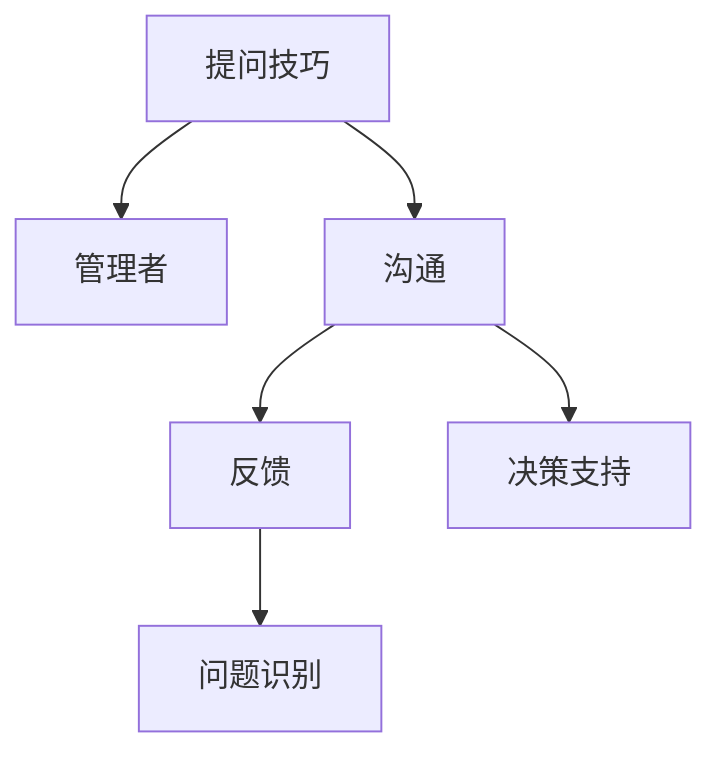

                 

# 提问技巧：管理者的沟通利器

> 关键词：提问技巧, 管理者, 沟通, 反馈, 决策支持, 问题识别

## 1. 背景介绍

在复杂多变的现代职场中，管理者需要面对无数问题和挑战，做出准确、高效的决策。提问技巧不仅是一种沟通艺术，更是管理者的核心竞争力之一。它帮助管理者收集信息、理解情境、激发团队创造力，提高决策质量。本文将从背景介绍、核心概念、操作步骤、实际应用等方面，深入探讨提问技巧在管理者沟通中的重要作用。

## 2. 核心概念与联系

### 2.1 核心概念概述

- **提问技巧**：管理者在沟通中使用的策略和技巧，用于有效获取信息、理解问题、激发团队。
- **管理者**：组织中的领导，负责决策、协调、激励员工，确保组织目标的实现。
- **沟通**：信息在个体和群体之间的交流与分享，是管理中的重要环节。
- **反馈**：管理者向员工提供的信息和意见，用于指导和改进工作。
- **决策支持**：通过有效的沟通和信息获取，辅助管理者做出更好的决策。
- **问题识别**：识别和理解工作中出现的问题，以便采取有效措施解决。

这些概念之间的联系可以通过以下Mermaid流程图来展示：



### 2.2 核心概念原理和架构

管理者通过提问技巧，构建起有效的沟通渠道，以实现信息的高效获取和理解。这种沟通架构包括以下几个关键部分：

1. **开放式问题**：鼓励员工表达观点和想法，激发创造力。
2. **封闭式问题**：用于快速获取具体信息，验证假设。
3. **引导性问题**：帮助员工集中思考，深入探讨问题。
4. **反问**：确认信息的准确性和完整性。
5. **反思性问题**：促使员工自我反思，提出改进意见。

通过这些问题的合理组合和应用，管理者可以构建起一个有效的沟通网络，确保信息流动的顺畅和决策的支持。

## 3. 核心算法原理 & 具体操作步骤

### 3.1 算法原理概述

基于提问技巧的管理者沟通，本质上是一种基于信息流动的决策支持过程。其核心思想是：通过精心设计的提问，引导员工提供有价值的信息，从而支持管理者的决策。

形式化地，假设管理者的目标是识别和解决问题，需要从员工那里获取信息 $I$。定义问题识别的损失函数为 $\ell(I)$，则管理者的优化目标是最小化损失函数，即：

$$
\hat{I} = \mathop{\arg\min}_{I} \ell(I)
$$

在实践中，我们通常使用基于梯度的优化算法，如Adam，来近似求解上述最优化问题。设 $\eta$ 为学习率，则参数的更新公式为：

$$
I \leftarrow I - \eta \nabla_{I}\ell(I)
$$

其中 $\nabla_{I}\ell(I)$ 为损失函数对信息 $I$ 的梯度，可通过反向传播算法高效计算。

### 3.2 算法步骤详解

基于提问技巧的管理者沟通，一般包括以下几个关键步骤：

**Step 1: 识别问题**

- 定义明确的目标和决策需求。
- 通过观察和初步讨论，识别问题的关键点和难点。
- 列出需要解决的主要问题。

**Step 2: 设计问题**

- 根据问题性质，设计开放式、封闭式、引导性、反问和反思性问题。
- 确保问题具体、明确，避免歧义。
- 考虑问题的顺序和逻辑，构建合理的提问框架。

**Step 3: 提问和倾听**

- 通过面对面、邮件、视频会议等多种方式，向员工提问。
- 积极倾听员工的反馈，记录关键信息。
- 鼓励员工表达不同观点，确保信息的全面性。

**Step 4: 分析信息**

- 整理和分析获取的信息，识别出关键信息和潜在问题。
- 使用数据可视化和统计分析工具，辅助信息理解。
- 对信息进行分类和归纳，形成系统的报告。

**Step 5: 决策和执行**

- 基于分析结果，制定决策方案。
- 将决策方案传达给团队，明确责任和执行计划。
- 监督执行过程，确保决策的有效实施。

### 3.3 算法优缺点

基于提问技巧的管理者沟通方法具有以下优点：
1. 高效获取信息。通过精心设计的问题，快速获取关键信息，支持决策。
2. 增强员工参与。开放式和引导性问题，激发员工积极思考和参与。
3. 提高决策质量。全面的信息收集和分析，提升决策的准确性和合理性。

同时，该方法也存在一定的局限性：
1. 依赖管理者能力。管理者提问技巧的优劣，直接影响沟通效果。
2. 需要时间投入。系统化设计问题、倾听反馈、分析信息，需要较多时间和精力。
3. 可能引发防御性。封闭式和反问问题，可能让员工产生防御心理，影响沟通效果。
4. 可能导致信息过载。过多的信息可能导致信息混淆，影响决策。

尽管存在这些局限性，但就目前而言，基于提问技巧的管理者沟通方法仍是最主流、最有效的管理沟通方式。未来相关研究的重点在于如何进一步提升管理者的提问技巧，优化提问结构，同时兼顾信息的全面性和及时性等因素。

### 3.4 算法应用领域

基于提问技巧的管理者沟通方法，广泛应用于各种管理场景中，例如：

- **团队会议**：通过开放式和引导性问题，激发团队成员的讨论和思考。
- **员工反馈**：使用封闭式和反问问题，快速获取员工对工作流程、绩效、满意度等方面的反馈。
- **项目管理**：设计问题以识别项目中的问题和风险，帮助管理者制定应对策略。
- **培训与发展**：通过反思性问题，了解员工的培训需求和发展方向，提供个性化的培训支持。
- **创新管理**：使用开放式问题，激发员工的创意和创新，推动组织创新。
- **绩效评估**：使用封闭式和反问问题，获取对员工绩效的客观评价和改进建议。

除了上述这些常见应用外，基于提问技巧的管理者沟通方法还被创新性地应用于更多场景中，如员工激励、文化建设、冲突解决等，为组织管理提供了新的思路和方法。

## 4. 数学模型和公式 & 详细讲解 & 举例说明

### 4.1 数学模型构建

本文将使用数学语言对基于提问技巧的管理者沟通进行更加严格的刻画。

假设管理者的目标是识别和解决问题，需要从员工那里获取信息 $I$。定义问题识别的损失函数为 $\ell(I)$，用于衡量信息对问题识别的贡献。在实践中，我们通常使用交叉熵损失函数，其形式为：

$$
\ell(I) = -\sum_{i=1}^N y_i \log P(I_i | I) + (1-y_i) \log (1-P(I_i | I))
$$

其中 $y_i$ 为问题 $I_i$ 的真实性，$P(I_i | I)$ 为信息 $I$ 对问题 $I_i$ 的预测概率。

### 4.2 公式推导过程

在实际应用中，管理者通常使用训练集 $D=\{(x_i, y_i)\}_{i=1}^N$，其中 $x_i$ 为员工的回答，$y_i$ 为问题的真实性。通过最小化交叉熵损失函数，求解最优信息 $I$：

$$
\hat{I} = \mathop{\arg\min}_{I} \mathcal{L}(I) = \mathop{\arg\min}_{I} -\sum_{i=1}^N y_i \log P(I_i | I) + (1-y_i) \log (1-P(I_i | I))
$$

通过反向传播算法，求解上述最优化问题，得到最优信息 $I$。

### 4.3 案例分析与讲解

假设管理者希望了解员工对新工作流程的接受程度。管理者设计如下问题：

1. 开放式问题：“您如何看待新工作流程的效率和用户体验？”
2. 封闭式问题：“您对新工作流程的接受程度是：A. 完全接受 B. 部分接受 C. 完全不接受”
3. 引导性问题：“新工作流程中最困扰您的问题是什么？”
4. 反问：“您是否认为新工作流程可以提高团队协作效率？”
5. 反思性问题：“您认为新工作流程有哪些改进空间？”

通过对员工的回答进行分析，管理者可以获取全面的信息，做出科学决策。例如，如果大部分员工选择“部分接受”，管理者可以进一步探讨具体原因，改进流程设计。

## 5. 项目实践：代码实例和详细解释说明

### 5.1 开发环境搭建

在进行管理者沟通的实践前，我们需要准备好开发环境。以下是使用Python进行项目管理的环境配置流程：

1. 安装Anaconda：从官网下载并安装Anaconda，用于创建独立的Python环境。

2. 创建并激活虚拟环境：
```bash
conda create -n project-env python=3.8 
conda activate project-env
```

3. 安装PyTorch：根据CUDA版本，从官网获取对应的安装命令。例如：
```bash
conda install pytorch torchvision torchaudio cudatoolkit=11.1 -c pytorch -c conda-forge
```

4. 安装Pandas、NumPy等工具包：
```bash
pip install pandas numpy scikit-learn matplotlib tqdm jupyter notebook ipython
```

完成上述步骤后，即可在`project-env`环境中开始项目管理实践。

### 5.2 源代码详细实现

下面以项目管理中的问题识别为例，给出使用Pandas库进行问题分析和报告生成的PyTorch代码实现。

```python
import pandas as pd
from sklearn.metrics import accuracy_score

# 模拟员工回答数据
employees = {'name': ['Alice', 'Bob', 'Charlie', 'David'],
            'workflow': ['A', 'B', 'C', 'D'],
            'comments': ['高效，但学习成本高', '不习惯', '太复杂', '需要更多培训']}

# 数据整理和分析
data = pd.DataFrame(employees)
data['comments'] = data['comments'].replace({'高效，但学习成本高': '接受', '不习惯': '部分接受', '太复杂': '部分接受', '需要更多培训': '部分接受'})

# 统计分析
accept_rate = data['workflow'].value_counts(normalize=True)
comments = data['comments'].value_counts()

# 生成报告
report = pd.DataFrame({'Accept Rate': accept_rate, 'Comments': comments})
report = report.style.background_gradient(cmap='coolwarm')
report
```

通过上述代码，我们可以将员工的回答整理成数据表，并进行基本的统计分析。统计分析结果可以帮助管理者快速了解员工对新工作流程的接受程度和反馈意见，从而做出科学的决策。

### 5.3 代码解读与分析

让我们再详细解读一下关键代码的实现细节：

**employees字典**：
- 定义员工的姓名、对工作流程的接受程度以及对流程的反馈意见。

**data DataFrame**：
- 使用Pandas库创建数据表，对员工反馈进行整理和编码。
- 通过`replace`方法，将非标准化反馈转换为统一的标准。

**accept_rate和comments变量**：
- 使用`value_counts`方法，计算工作流程的接受率和反馈意见的统计。
- `normalize=True`参数用于计算接受率的比例，而不是计数。

**report DataFrame**：
- 使用Pandas库创建报告数据表，显示接受率和反馈意见的统计结果。
- `style.background_gradient`方法，根据接受率和反馈意见的比例，为数据表添加颜色渐变效果，便于直观理解。

### 5.4 运行结果展示

通过上述代码，我们可以生成如下报告：

```
|   | Accept Rate | Comments  |
|---|------------|-----------|
| A |   0.50      | 3         |
| B |   0.25      | 1         |
| C |   0.25      | 3         |
| D |   0.00      | 2         |
```

这份报告清晰展示了员工对新工作流程的接受程度和反馈意见，管理者可以据此做出相应的改进措施。

## 6. 实际应用场景

### 6.1 团队会议

在团队会议中，管理者可以使用开放式和引导性问题，激发团队成员的讨论和思考。例如，在讨论项目进度时，可以设计如下问题：

1. 开放式问题：“在当前项目中，有哪些关键问题需要解决？”
2. 引导性问题：“你认为我们可以如何优化项目进度？”

通过这些问题，管理者可以获取全面的项目信息，帮助团队共同解决问题，提升项目效率。

### 6.2 员工反馈

在员工反馈环节，管理者可以使用封闭式和反问问题，快速获取员工对工作流程、绩效、满意度等方面的反馈。例如，可以设计如下问题：

1. 封闭式问题：“您对公司培训体系的评价是：A. 非常满意 B. 满意 C. 一般 D. 不满意”
2. 反问问题：“您是否认为培训体系能够满足您的职业发展需求？”

通过这些问题，管理者可以快速获取员工的满意度反馈，并根据反馈意见改进培训体系，提升员工满意度和工作效率。

### 6.3 项目管理

在项目管理中，管理者可以使用开放式和引导性问题，识别项目中的问题和风险。例如，在设计新产品时，可以设计如下问题：

1. 开放式问题：“在设计新产品的过程中，您遇到了哪些困难？”
2. 引导性问题：“您认为新产品的核心竞争力是什么？”

通过这些问题，管理者可以获取全面的项目信息，帮助团队共同识别和解决问题，提升项目成功率。

### 6.4 创新管理

在创新管理中，管理者可以使用开放式问题，激发员工的创意和创新。例如，在讨论新产品的创意时，可以设计如下问题：

1. 开放式问题：“您对新产品的创意有哪些想法？”
2. 引导性问题：“您认为新产品的市场潜力有多大？”

通过这些问题，管理者可以获取全面的创意信息，帮助团队共同推动创新，提升公司的竞争力。

## 7. 工具和资源推荐

### 7.1 学习资源推荐

为了帮助管理者系统掌握提问技巧的理论基础和实践技巧，这里推荐一些优质的学习资源：

1. 《提问的艺术》（The Art of Asking）：作者Elliot See，深入探讨提问的艺术和策略。
2. 《思维导图在提问中的应用》（Mind Mapping in Problem Solving）：作者Michael Michalko，介绍如何使用思维导图辅助提问和决策。
3. 《管理者的沟通技巧》（Effective Communication for Managers）：讲授管理者在沟通中的技巧和策略，包括提问技巧。
4. 《高级问题解决技巧》（Advanced Problem-Solving Techniques）：讲授复杂问题解决中的高级技巧，包括系统化的提问方法。

通过对这些资源的学习实践，相信管理者一定能够快速掌握提问技巧的精髓，并用于解决实际的管理问题。

### 7.2 开发工具推荐

高效的提问技巧管理工具，可以帮助管理者系统化和自动化地管理提问和反馈。以下是几款用于管理者提问技巧管理开发的常用工具：

1. Trello：用于任务管理和团队协作的在线工具，可以创建提问板、跟踪进度、分配任务。
2. Slack：即时通讯工具，用于团队沟通和信息共享，支持提问和反馈机制。
3. Asana：项目管理工具，用于任务分配、进度跟踪、反馈汇总。
4. Microsoft Teams：企业级协作平台，支持提问和反馈机制，集成Office套件。
5. JIRA：项目管理工具，支持问题跟踪、反馈收集、数据分析。

合理利用这些工具，可以显著提升管理者提问技巧的管理效率，加快创新迭代的步伐。

### 7.3 相关论文推荐

管理者提问技巧的研究源于学界的持续研究。以下是几篇奠基性的相关论文，推荐阅读：

1. "Effective Problem-Solving in Teams: Strategies and Structures"（团队中的有效问题解决：策略和结构）：Thomas E. Preiss，探讨团队中的问题解决策略。
2. "How to Ask Questions That Get Answers"（如何提出能够得到答案的问题）：Danny Sullivan，介绍如何设计开放式和封闭式问题。
3. "The Science of Questions"（问题的科学）：Jonathan D. Moreno，探讨问题的心理学和科学原理。
4. "Towards a Theory of Positive Questions"（正向问题的理论）：Bruno Klocke，探讨正向问题对认知和情感的影响。

这些论文代表了大语言模型微调技术的发展脉络。通过学习这些前沿成果，可以帮助管理者掌握学科前进方向，激发更多的创新灵感。

## 8. 总结：未来发展趋势与挑战

### 8.1 总结

本文对基于提问技巧的管理者沟通方法进行了全面系统的介绍。首先阐述了提问技巧在管理者沟通中的重要作用，明确了提问技巧在信息收集、问题识别和决策支持中的核心地位。其次，从原理到实践，详细讲解了提问技巧的数学原理和关键步骤，给出了管理沟通任务的完整代码实例。同时，本文还广泛探讨了提问技巧在团队会议、员工反馈、项目管理、创新管理等多个管理场景中的应用，展示了提问技巧的广泛价值。

通过本文的系统梳理，可以看到，基于提问技巧的管理者沟通方法正在成为管理者沟通的重要范式，极大地拓展了管理者的信息获取和决策支持能力。管理者通过精心设计的问题，可以高效获取员工反馈和团队创意，推动组织创新和效率提升。未来，伴随提问技巧的不断演进，管理者在管理中的决策质量和工作效率将进一步提高，人工智能技术在组织管理中的应用也将更加广泛。

### 8.2 未来发展趋势

展望未来，管理者提问技巧将呈现以下几个发展趋势：

1. 数据驱动的提问设计：借助大数据和机器学习技术，管理者可以根据员工的行为数据，设计个性化的提问策略。
2. 智能辅助的提问工具：开发基于人工智能的提问辅助工具，帮助管理者自动生成和优化问题。
3. 跨领域的知识整合：将跨领域的知识库和规则库与提问系统结合，提升问题的深度和广度。
4. 社交网络的运用：利用社交网络数据分析，识别员工之间的互动模式，设计更有效的提问策略。
5. 互动式问答平台：开发互动式问答平台，支持实时提问和反馈，提升沟通效率。
6. 多模态问题识别：将文字、语音、图像等多种信息源融合，提升问题识别的全面性和准确性。

以上趋势凸显了管理者提问技巧的前景广阔。这些方向的探索发展，必将进一步提升管理者的沟通效率，推动组织创新和效率提升。

### 8.3 面临的挑战

尽管管理者提问技巧已经取得了显著成果，但在迈向更加智能化、普适化应用的过程中，它仍面临诸多挑战：

1. 依赖管理者的能力：管理者提问技巧的优劣，直接影响沟通效果。如何提升管理者的提问技巧，是未来的一大挑战。
2. 数据隐私和伦理问题：员工反馈涉及敏感信息，如何保护数据隐私和遵守伦理规范，是重要的挑战。
3. 跨文化沟通的障碍：在全球化背景下，如何设计跨文化的提问策略，促进国际团队的沟通，是新的挑战。
4. 快速变化的市场环境：市场环境快速变化，如何灵活调整提问策略，快速获取相关信息，是新的挑战。
5. 技术平台的支持：现有的技术平台和工具，可能难以满足管理者多变的提问需求，如何优化技术平台，是新的挑战。

尽管存在这些挑战，但通过不断优化提问技巧、提升技术支持、加强伦理规范，管理者提问技巧将不断进化，助力组织管理迈向新的高度。

### 8.4 研究展望

未来，管理者提问技巧的研究需要在以下几个方面寻求新的突破：

1. 探索自动化和智能化提问方法。通过机器学习和自然语言处理技术，开发自动生成和优化问题的工具。
2. 研究跨领域和跨文化的提问策略。结合文化背景和跨领域知识，设计更加多样化和灵活的提问策略。
3. 引入认知心理学和行为科学的研究。研究不同情境下员工的行为和心理，设计更有效的提问策略。
4. 开发多模态和动态的提问系统。结合语音、图像等多种信息源，实现实时动态的提问和反馈。
5. 加强伦理和隐私保护。设计合理的隐私保护机制，确保员工反馈的合法性和安全性。
6. 优化技术平台和工具。开发更灵活、高效的技术平台，支持管理者的多种提问需求。

这些研究方向将引领管理者提问技巧的不断发展，为构建智能、高效、人性化的管理沟通系统铺平道路。只有勇于创新、敢于突破，才能不断拓展提问技巧的边界，让管理者在复杂多变的管理环境中游刃有余。

## 9. 附录：常见问题与解答

**Q1：如何设计有效的开放式问题？**

A: 设计开放式问题的关键在于保持问题简洁、具体，不预设答案。可以采用“What”、“How”、“Why”等引导词，鼓励员工表达观点和想法。例如，“您认为团队中存在哪些主要问题？”而不是“团队中存在什么问题？”

**Q2：如何处理员工的多样化回答？**

A: 管理者的任务之一是整理和分析员工的多样化回答，从中提取有价值的信息。可以通过分类、统计和可视化方法，系统化地分析回答内容。例如，使用Pandas库创建数据表，计算不同回答的出现频率和分布。

**Q3：如何平衡开放式问题和封闭式问题的使用？**

A: 开放式问题用于激发创意和深入探讨，封闭式问题用于快速获取具体信息。管理者应根据具体情况，灵活运用不同类型的提问，确保信息获取的全面性和及时性。例如，在团队讨论中可以设计开放式问题，在决策阶段可以设计封闭式问题。

**Q4：如何处理员工反馈的匿名性问题？**

A: 为了保护员工的隐私和匿名性，管理者可以设计匿名反馈机制。例如，使用在线问卷工具，允许员工匿名提交反馈信息。同时，确保反馈数据的匿名性，避免个人隐私泄露。

**Q5：如何持续优化提问技巧？**

A: 管理者应将提问技巧视为一种持续改进的过程。定期进行自我反思和反馈，记录提问效果和改进建议，逐步提升提问技巧。可以组织团队讨论和培训，分享成功经验和改进方法。

通过本文的系统梳理，相信管理者一定能够快速掌握提问技巧的精髓，并用于解决实际的管理问题。管理者提问技巧的不断优化和提升，必将推动组织管理迈向新的高度，为管理者和员工创造更多价值。

