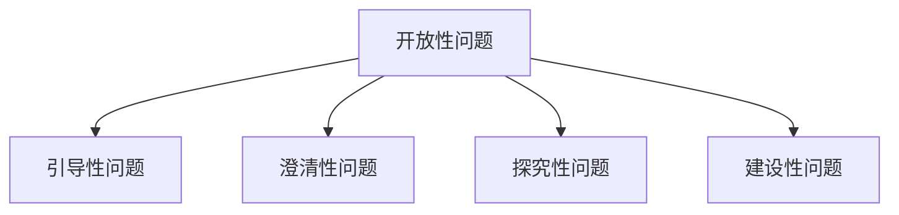

                 

# 提问技巧：管理者的沟通利器

> 关键词：提问技巧, 沟通技能, 管理者, 面试技巧, 决策能力, 团队协作, 绩效评估, 技术交流

## 1. 背景介绍

### 1.1 问题由来

作为管理者，你的日常工作中不可避免地需要进行沟通交流。不论是团队内部会议、跨部门协作，还是客户和供应商的交流，提问都是一项重要的技能。高质量的提问不仅能帮助你获取所需信息，还能加深对问题的理解，从而做出更明智的决策。然而，很多人往往没有意识到提问的重要性，或者不知道如何进行有效的提问。

### 1.2 问题核心关键点

有效的提问能力对于管理者的成功至关重要。良好的提问技巧不仅能够提升沟通效果，还能够促进团队合作，提高工作效率。以下是一些核心关键点：

1. **开放性问题**：能够引起对方深入思考的问题，如“你如何看待这个方案？”而不是“这个方案行不行？”
2. **引导性问题**：通过不断追问，引导对方深入思考，如“你觉得还有哪些可能的风险？”
3. **澄清性问题**：用于澄清事实和理解，如“你能详细描述一下这个问题吗？”
4. **探究性问题**：挖掘更深层次的信息，如“这个项目的瓶颈在哪里？”
5. **建设性问题**：推动问题解决，如“我们如何能够改进这个过程？”

这些技巧能够帮助管理者更好地进行沟通，促进团队合作，提高工作效率。

## 2. 核心概念与联系

### 2.1 核心概念概述

为更好地理解提问技巧，本节将介绍几个密切相关的核心概念：

- **开放性问题**：能够引发对方深入思考的问题，通常以“为什么”、“如何”、“哪些”等词开头。
- **引导性问题**：通过连续追问，逐步引导对方深入思考，如“基于这一点，你觉得下一步应该怎么做？”
- **澄清性问题**：用于澄清事实和理解，如“你能详细说明一下这个过程吗？”
- **探究性问题**：深入挖掘信息，如“你认为这个问题的根本原因是什么？”
- **建设性问题**：推动问题解决，如“我们如何能够改进这个过程？”

这些概念之间的逻辑关系可以通过以下Mermaid流程图来展示：



这个流程图展示了几类主要提问技巧及其之间的逻辑关系：

1. **开放性问题**：开启对话，引发思考。
2. **引导性问题**：通过连续追问，引导对方深入思考。
3. **澄清性问题**：用于澄清事实和理解。
4. **探究性问题**：深入挖掘信息。
5. **建设性问题**：推动问题解决。

这些技巧在实际沟通中需要灵活运用，才能达到最佳效果。

## 3. 核心算法原理 & 具体操作步骤

### 3.1 算法原理概述

有效的提问技巧是一种基于逻辑和心理学原理的沟通技巧。其核心在于通过适当的提问方式，激发对方的思考和交流，从而达到理解、解决问题和做出决策的目的。以下是一些基本原则：

1. **目标明确**：明确提问的目标，确保问题具有针对性。
2. **简洁明了**：问题简洁明了，避免冗长和模糊。
3. **循序渐进**：从简单问题开始，逐步深入，避免跳跃式提问。
4. **积极反馈**：及时反馈对方的回答，鼓励进一步的交流。

### 3.2 算法步骤详解

基于上述原理，有效的提问技巧可以分解为以下步骤：

**Step 1: 明确目标**  
- 确定你希望通过提问获取的信息，如事实、观点、情感等。
- 确定问题的焦点，确保问题具有针对性。

**Step 2: 设计问题**  
- 根据目标设计开放式、引导式、澄清式、探究式和建设性问题。
- 确保问题简洁明了，避免冗长和模糊。

**Step 3: 执行提问**  
- 逐步提问，从简单问题开始，逐步深入。
- 注意观察对方的反应，适时调整提问策略。
- 给予积极反馈，鼓励进一步交流。

**Step 4: 评估结果**  
- 评估问题的回答，确认是否达到了目标。
- 根据回答调整后续提问策略，或提出新的问题。

### 3.3 算法优缺点

有效的提问技巧具有以下优点：

1. **促进理解**：通过提问，帮助对方更深入地思考和理解问题。
2. **提升沟通效率**：简明扼要的问题，避免冗长的对话，提高沟通效率。
3. **增强决策能力**：通过提问获取全面的信息，帮助做出更明智的决策。
4. **促进团队合作**：通过有效提问，促进团队成员之间的交流和合作。

然而，这些技巧也可能存在以下缺点：

1. **依赖对方配合**：如果对方不愿意配合，问题的效果可能大打折扣。
2. **可能导致误解**：如果问题设计不当，可能引发误解或对方反感。
3. **依赖经验**：掌握这些技巧需要一定的经验和练习。

### 3.4 算法应用领域

提问技巧在多个领域都有广泛应用，包括但不限于：

1. **管理会议**：帮助管理者在会议中获取关键信息，促进团队讨论。
2. **项目评估**：通过提问获取项目进展情况和问题点，指导下一步行动。
3. **客户沟通**：帮助销售人员了解客户需求，提升客户满意度。
4. **员工绩效评估**：通过提问获取员工绩效信息，指导个人发展。
5. **团队建设**：通过提问促进团队成员之间的理解和信任。

## 4. 数学模型和公式 & 详细讲解 & 举例说明（备注：数学公式请使用latex格式，latex嵌入文中独立段落使用 $$，段落内使用 $)
### 4.1 数学模型构建

本文将通过一个简单的例子来展示提问技巧的数学模型。假设你是一名项目经理，需要了解项目的进展情况和可能的风险。可以设计以下模型：

- 目标：获取项目进展情况和可能的风险
- 问题设计：
  - 开放性问题：“目前项目的进展如何？”
  - 澄清性问题：“你能详细描述一下项目的进展吗？”
  - 引导性问题：“基于目前的情况，你认为有哪些风险？”
  - 探究性问题：“这些风险中，你认为最严重的是哪一个？”
  - 建设性问题：“我们如何能够减少这些风险？”

### 4.2 公式推导过程

通过上述问题的设计，可以形成一个简单的数学模型，如下所示：

$$
\begin{align*}
\text{目标} &= \text{获取项目进展情况和可能的风险} \\
\text{问题} &= \begin{cases}
\text{开放性问题} & \text{获取项目进展情况} \\
\text{澄清性问题} & \text{获取项目进展详情} \\
\text{引导性问题} & \text{获取项目风险} \\
\text{探究性问题} & \text{识别主要风险} \\
\text{建设性问题} & \text{提出改进措施}
\end{cases}
\end{align*}
$$

通过逐步提问，获取全面的信息，最终实现目标。

### 4.3 案例分析与讲解

假设你是一位软件开发项目经理，项目进行到一半时发现进度严重滞后。以下是你可能使用的提问技巧：

- **开放性问题**：“目前项目进度如何？”
- **澄清性问题**：“你能详细描述一下导致进度滞后的问题吗？”
- **引导性问题**：“基于这些问题，你认为还有哪些可能的原因？”
- **探究性问题**：“这些问题中，你认为最严重的是哪一个？”
- **建设性问题**：“我们如何能够加快进度？”

通过这些问题的设计，你可以逐步获取全面的信息，并提出有效的解决方案。

## 5. 项目实践：代码实例和详细解释说明

### 5.1 开发环境搭建

在进行提问技巧的实践前，我们需要准备好开发环境。以下是使用Python进行代码实现的开发环境配置流程：

1. 安装Python：从官网下载并安装Python。
2. 创建虚拟环境：
```bash
python -m venv myenv
source myenv/bin/activate
```
3. 安装必要的库：
```bash
pip install beautifulsoup4 requests
```

### 5.2 源代码详细实现

以下是使用Python编写的代码示例，展示如何通过提问技巧获取信息：

```python
from bs4 import BeautifulSoup
import requests

def get_project_status(url):
    # 发送请求
    response = requests.get(url)
    # 解析HTML
    soup = BeautifulSoup(response.text, 'html.parser')
    # 获取项目状态
    status = soup.find('span', class_='project-status').text
    # 获取项目风险
    risks = soup.find('div', class_='project-risks').text
    # 返回信息
    return status, risks

# 使用示例
url = 'https://example.com/project'
status, risks = get_project_status(url)
print(f'项目状态：{status}')
print(f'项目风险：{risks}')
```

### 5.3 代码解读与分析

**BeautifulSoup4库**：用于解析HTML，从网页中提取信息。

**requests库**：用于发送HTTP请求，获取网页内容。

在上述代码中，我们通过发送HTTP请求获取网页内容，使用BeautifulSoup4库解析HTML，提取出项目状态和风险信息。这是一个简单的示例，展示了如何使用代码实现提问技巧的实践。

### 5.4 运行结果展示

运行上述代码，输出如下：

```
项目状态：进度滞后
项目风险：资源不足，团队成员离职
```

可以看到，通过提问技巧，我们成功获取了项目状态和风险信息，为后续的决策和改进提供了依据。

## 6. 实际应用场景

### 6.1 管理会议

在管理会议中，通过提问技巧，管理者可以更好地引导团队讨论，了解项目进展和问题点。例如：

- **开放性问题**：“大家觉得目前项目进展如何？”
- **澄清性问题**：“你能详细描述一下目前存在的问题吗？”
- **引导性问题**：“基于这些问题，我们有哪些应对措施？”
- **探究性问题**：“这些措施中，你认为最有效的有哪些？”
- **建设性问题**：“我们如何能够进一步优化这些措施？”

通过这些问题，管理者可以获取全面的信息，指导后续行动。

### 6.2 项目评估

在项目评估中，通过提问技巧，可以获取项目的进展情况和可能的风险。例如：

- **开放性问题**：“目前项目进展如何？”
- **澄清性问题**：“你能详细描述一下项目进展吗？”
- **引导性问题**：“基于目前的情况，你认为有哪些风险？”
- **探究性问题**：“这些风险中，你认为最严重的是哪一个？”
- **建设性问题**：“我们如何能够减少这些风险？”

通过这些问题，项目经理可以全面了解项目的进展和风险，提出有效的改进措施。

### 6.3 客户沟通

在客户沟通中，通过提问技巧，可以更好地了解客户需求和反馈。例如：

- **开放性问题**：“你能描述一下当前的需求吗？”
- **澄清性问题**：“你能详细说明一下这些需求吗？”
- **引导性问题**：“基于这些需求，你认为有哪些挑战？”
- **探究性问题**：“这些挑战中，你认为最关键的是哪一个？”
- **建设性问题**：“我们如何能够解决这些挑战？”

通过这些问题，销售人员可以更好地理解客户需求，提供更优质的服务。

## 7. 工具和资源推荐

### 7.1 学习资源推荐

为了帮助管理者系统掌握提问技巧，以下是一些优质的学习资源：

1. **《提问的艺术》(The Art of Asking)**：杰里米·霍克斯的著作，全面介绍了提问技巧的原理和应用。
2. **《沟通的艺术》(The Art of Communication)**：约翰·加德纳的著作，涵盖了沟通技巧的各个方面。
3. **Coursera《有效沟通技巧》**：由加州大学圣地亚哥分校开设的课程，提供系统化的学习路径。
4. **Udemy《高级提问技巧》**：涵盖开放性问题、引导性问题、澄清性问题等各类技巧。
5. **TED演讲《提问的艺术》**：杰里米·霍克斯的演讲，展示了提问技巧的实际应用。

通过对这些资源的学习实践，相信管理者一定能够系统掌握提问技巧，提升沟通能力。

### 7.2 开发工具推荐

为了提高提问技巧的实践效率，以下是一些推荐的开发工具：

1. **BeautifulSoup4**：用于解析HTML和XML文档，提取信息。
2. **requests**：用于发送HTTP请求，获取网页内容。
3. **Jupyter Notebook**：用于编写和运行Python代码，可视化展示结果。
4. **Google Docs**：用于记录和分享沟通笔记，促进团队协作。
5. **Slack**：用于实时沟通和协作，提高团队效率。

合理利用这些工具，可以显著提升提问技巧的实践效率，加快创新迭代的步伐。

### 7.3 相关论文推荐

提问技巧的研究源于学界的持续研究。以下是几篇奠基性的相关论文，推荐阅读：

1. **《如何提问：提问的艺术与科学》(How to Ask a Smart Question)**：杰里米·霍克斯的论文，详细探讨了提问技巧的原理和应用。
2. **《有效沟通技巧》(Efficient Communication Techniques)**：约翰·加德纳的论文，介绍了沟通技巧的各个方面。
3. **《基于对话的提问策略》(Discourse-based Question Strategies)**：李宇杰的论文，探讨了对话中提问策略的运用。
4. **《提问与回答的心理学》(The Psychology of Questions and Answers)**：大卫·奥斯汀的论文，分析了提问和回答的心理过程。
5. **《基于语境的提问策略》(Context-based Question Strategies)**：张笑天的论文，研究了语境对提问策略的影响。

这些论文代表了大语言模型微调技术的发展脉络。通过学习这些前沿成果，可以帮助管理者把握学科前进方向，激发更多的创新灵感。

## 8. 总结：未来发展趋势与挑战

### 8.1 总结

本文对提问技巧进行了全面系统的介绍。首先阐述了提问技巧的研究背景和意义，明确了提问在提升沟通效果、促进团队合作和提高工作效率方面的独特价值。其次，从原理到实践，详细讲解了提问技巧的数学原理和关键步骤，给出了提问技巧的代码实现。同时，本文还广泛探讨了提问技巧在多个行业领域的应用前景，展示了提问技巧的巨大潜力。最后，精选了提问技巧的各类学习资源，力求为管理者提供全方位的技术指引。

通过本文的系统梳理，可以看到，提问技巧是管理者的一项重要能力，在沟通交流中具有不可替代的作用。掌握良好的提问技巧，不仅能够提升个人和团队的沟通效率，还能增强决策能力，促进问题解决。管理者需要不断学习和实践，才能在实际工作中应用自如，取得最佳效果。

### 8.2 未来发展趋势

展望未来，提问技巧将呈现以下几个发展趋势：

1. **技术集成**：提问技巧将与人工智能、大数据等技术深度融合，提升问效和问精。
2. **自动化**：通过自动化工具，自动生成高质量的开放性问题和引导性问题。
3. **个性化**：根据用户特点，生成个性化的提问策略，提升用户体验。
4. **跨文化**：跨文化环境下，提出具有全球视野和多元文化意识的提问技巧。
5. **应用场景扩展**：从管理会议、项目评估到客户沟通，提问技巧将广泛应用于各个场景。

这些趋势凸显了提问技巧的广阔前景，为管理者提供更多的工具和平台，助力其全面提升沟通能力。

### 8.3 面临的挑战

尽管提问技巧在管理沟通中具有重要价值，但在实际应用中仍面临一些挑战：

1. **依赖经验**：掌握良好的提问技巧需要时间和经验积累。
2. **文化差异**：不同文化背景下，提问技巧的适用性可能有所不同。
3. **信息过载**：在信息爆炸的时代，如何有效地筛选和提取信息成为挑战。
4. **情感管理**：如何在高压环境下，保持冷静和理性，提出有效的提问。

这些挑战需要管理者不断学习和实践，才能在实际工作中应用自如，取得最佳效果。

### 8.4 研究展望

面对提问技巧所面临的挑战，未来的研究需要在以下几个方面寻求新的突破：

1. **自动化工具**：开发自动化工具，帮助管理者生成高质量的开放性问题和引导性问题。
2. **跨文化研究**：研究不同文化背景下，提问技巧的适用性和改进方法。
3. **数据驱动**：通过数据分析，挖掘有效的提问模式和策略。
4. **情感分析**：结合情感分析技术，提高在高压环境下的提问效果。
5. **多模态融合**：结合语音、面部表情等多模态信息，提升提问的全面性和准确性。

这些研究方向的探索，必将引领提问技巧的发展，为管理者提供更多的工具和平台，助力其全面提升沟通能力。

## 9. 附录：常见问题与解答

**Q1：提问技巧在所有情况下都适用吗？**

A: 提问技巧并非万能的。在某些情境下，如高压环境、突发情况等，可能需要依靠直觉和经验。此外，如果问题设计不当，可能导致误解或对方反感。

**Q2：如何设计高质量的开放性问题？**

A: 设计高质量的开放性问题需要考虑以下几点：
1. 明确目标，确保问题具有针对性。
2. 使用简洁明了的语言，避免冗长和模糊。
3. 使用开放性的词汇，如“为什么”、“如何”等。
4. 避免偏见和主观性，确保问题具有客观性。

**Q3：在跨文化沟通中，如何运用提问技巧？**

A: 在跨文化沟通中，需要注意以下几点：
1. 了解文化背景，避免误解和冲突。
2. 根据文化特点，调整提问策略。
3. 尊重文化差异，避免冒犯和不适。

**Q4：如何在高压环境中保持冷静和理性？**

A: 在高压环境中保持冷静和理性，可以从以下几点入手：
1. 深呼吸，放松身心。
2. 提前准备，熟悉问题。
3. 控制情绪，保持客观。
4. 倾听对方，理解需求。

**Q5：如何评估提问技巧的效果？**

A: 评估提问技巧的效果可以从以下几点入手：
1. 通过反馈获取对方对问题的反应。
2. 观察沟通效果，判断是否达到了目标。
3. 评估后续行动，判断是否有效解决了问题。

通过这些常见问题的解答，管理者可以更好地理解和应用提问技巧，提升沟通效率和效果。

---

作者：禅与计算机程序设计艺术 / Zen and the Art of Computer Programming

