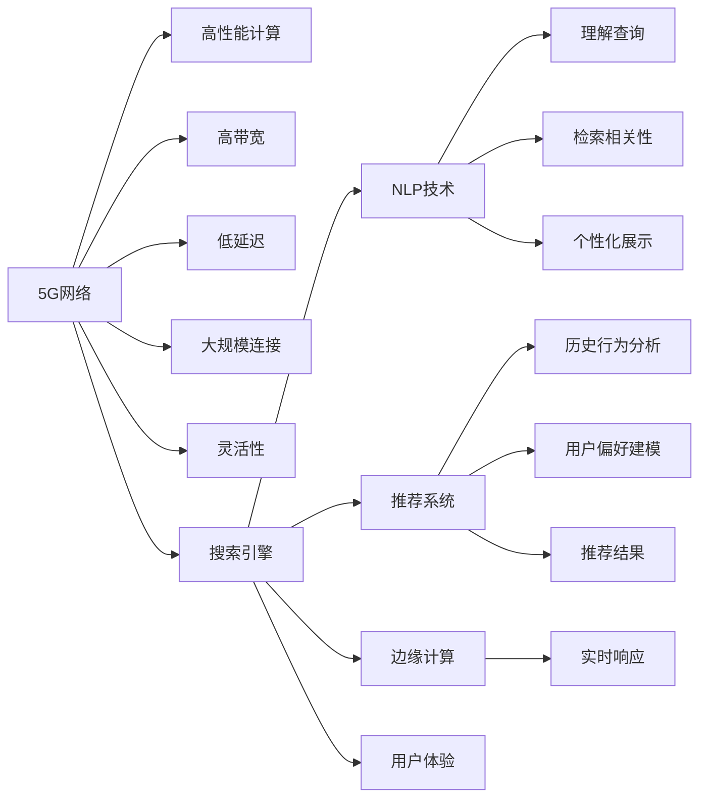

                 

# 搜索引擎在5G时代的发展机遇

## 1. 背景介绍

随着5G技术的普及和应用，搜索引擎作为互联网基础设施的重要组成部分，迎来了前所未有的发展机遇。5G时代带来了更高的网络带宽、更低的延迟和更大的连接密度，使得搜索引擎能够承载更多用户请求，提供更快的数据传输速度和更丰富的服务形态。

### 1.1 5G技术的特点

5G技术的核心优势主要体现在以下几个方面：

- **高带宽**：5G网络支持高达10Gbps的传输速率，相比4G网络有大幅提升。
- **低延迟**：5G网络的端到端延迟控制在1-2ms以内，极大地提升了数据传输的实时性。
- **大规模连接**：5G网络可以同时支持百万级别的设备连接，支持更多的并发用户。
- **灵活性**：5G网络支持多种网络切片和多种传输模式，能更好地适配不同的应用场景。

### 1.2 5G对搜索引擎的影响

5G技术的到来，对搜索引擎的影响主要体现在以下几个方面：

- **用户体验提升**：5G网络的高速率和低延迟能够显著提升搜索引擎的响应速度，使用户能够更快地获取搜索结果。
- **服务形态创新**：5G网络的高带宽和灵活性支持了更多的服务形态，如增强现实(AR)、虚拟现实(VR)搜索，视频搜索等。
- **流量增长**：5G网络的普及将带来大量的新用户，推动搜索引擎流量的大幅增长。
- **技术革新**：5G技术的发展也催生了许多新技术，如边缘计算、物联网(IoT)等，这些技术对搜索引擎的设计和优化有重要影响。

## 2. 核心概念与联系

### 2.1 核心概念概述

要深刻理解搜索引擎在5G时代的发展机遇，首先需要掌握一些关键的核心概念：

- **搜索引擎**：搜索引擎是一种信息检索系统，能够根据用户的查询请求，从海量数据中快速检索出相关结果，并提供给用户。
- **5G技术**：5G技术是一种新一代无线通信技术，具有高带宽、低延迟、大规模连接和灵活性等特点。
- **自然语言处理(NLP)**：NLP是研究计算机如何处理和理解人类语言的技术，是搜索引擎的核心技术之一。
- **推荐系统**：推荐系统根据用户的历史行为和偏好，向用户推荐个性化的搜索结果，提升用户体验。
- **边缘计算**：边缘计算是将计算任务从中心服务器迁移到网络边缘设备上进行处理，以减少延迟和提高响应速度。

这些概念之间相互关联，共同构成了5G时代搜索引擎技术发展的框架。

### 2.2 核心概念原理和架构的 Mermaid 流程图



这个Mermaid图展示了5G技术如何通过高性能计算、高带宽、低延迟、大规模连接和灵活性等特性，与搜索引擎的核心技术（NLP、推荐系统和边缘计算）相互作用，最终提升用户体验。

## 3. 核心算法原理 & 具体操作步骤

### 3.1 算法原理概述

搜索引擎的核心算法主要围绕自然语言处理、排序算法和推荐算法展开。5G时代，这些算法需要结合5G技术的特性进行优化，以适应更高的性能要求。

#### 3.1.1 自然语言处理(NLP)

NLP是搜索引擎解析用户查询意图、匹配相关文档的关键技术。5G时代，NLP需要处理更复杂的自然语言，包括歧义消除、语义理解、实体识别等，以提高搜索结果的相关性和准确性。

#### 3.1.2 排序算法

排序算法是搜索引擎将检索到的文档按照相关性排序，并返回给用户的技术。5G时代，排序算法需要支持更大的数据量和更高效的计算，以确保搜索结果的实时性和准确性。

#### 3.1.3 推荐算法

推荐算法是根据用户的历史行为和偏好，向用户推荐个性化的搜索结果。5G时代，推荐算法需要处理更多的数据，提供实时的推荐结果，以提升用户体验。

### 3.2 算法步骤详解

以下是搜索引擎在5G时代进行优化的一些关键步骤：

#### 3.2.1 高带宽下的数据处理

5G网络的高带宽特性使得搜索引擎能够处理和传输更多的数据。为了充分利用这一特性，可以采用以下步骤：

1. **大数据索引**：建立更高效的索引结构，如倒排索引、B+树索引等，以支持海量数据的快速检索。
2. **分布式存储**：使用分布式文件系统（如HDFS）和大数据处理平台（如Hadoop），将数据分散存储在多台服务器上，提高数据的访问速度。
3. **并行处理**：利用多线程和分布式计算框架（如Spark），实现大规模数据的并行处理。

#### 3.2.2 低延迟下的实时处理

5G网络的低延迟特性使得搜索引擎能够提供实时的搜索结果。为了充分利用这一特性，可以采用以下步骤：

1. **缓存优化**：使用缓存技术（如Redis），将热点数据缓存到内存中，减少查询延迟。
2. **近实时索引**：采用近实时索引技术，如Solr的动态索引和更新机制，实现数据的实时更新。
3. **边缘计算**：利用边缘计算技术，将计算任务迁移到网络边缘设备上进行处理，减少延迟和带宽消耗。

#### 3.2.3 大规模连接下的负载均衡

5G网络的大规模连接特性使得搜索引擎需要处理更多的并发用户。为了应对这一挑战，可以采用以下步骤：

1. **负载均衡**：使用负载均衡技术（如Nginx），将请求分配到多个服务器上，均衡处理负载。
2. **集群管理**：使用容器化技术（如Kubernetes），实现多台服务器的集群管理，动态调整资源分配。
3. **水平扩展**：采用水平扩展策略，通过增加服务器数量，提高系统的处理能力和扩展性。

### 3.3 算法优缺点

#### 3.3.1 优点

- **用户体验提升**：5G网络的高速率和低延迟能够显著提升搜索引擎的响应速度，使用户能够更快地获取搜索结果。
- **服务形态创新**：5G网络的高带宽和灵活性支持了更多的服务形态，如增强现实(AR)、虚拟现实(VR)搜索，视频搜索等。
- **流量增长**：5G网络的普及将带来大量的新用户，推动搜索引擎流量的大幅增长。
- **技术革新**：5G技术的发展也催生了许多新技术，如边缘计算、物联网(IoT)等，这些技术对搜索引擎的设计和优化有重要影响。

#### 3.3.2 缺点

- **技术复杂性增加**：5G时代，搜索引擎需要处理更复杂的自然语言、更大的数据量和更高的性能要求，技术难度增加。
- **资源消耗增加**：5G网络的高带宽和低延迟带来了更高的硬件要求，服务器和网络设备的成本上升。
- **安全性和隐私保护**：5G网络带来了更大量的数据传输，对搜索引擎的数据安全和隐私保护提出了更高的要求。

### 3.4 算法应用领域

搜索引擎在5G时代的优化和创新，不仅提升了自身的技术水平和用户体验，还促进了多个应用领域的创新和进步。

#### 3.4.1 智能客服

智能客服是搜索引擎在5G时代的重要应用方向之一。通过结合NLP和推荐算法，智能客服能够理解用户的自然语言查询，并提供个性化的服务。5G网络的高带宽和低延迟特性，使得智能客服的实时响应成为可能，大大提升了用户体验。

#### 3.4.2 视频搜索

视频搜索是搜索引擎在5G时代的重要应用方向之一。视频搜索不仅需要处理大量的视频数据，还需要支持实时的视频搜索和推荐。5G网络的高带宽和低延迟特性，使得视频搜索的性能和用户体验得到了显著提升。

#### 3.4.3 物联网(IoT)

物联网是搜索引擎在5G时代的另一重要应用方向。物联网设备的大量增加，带来了海量的数据存储和处理需求。通过结合大数据处理和边缘计算技术，搜索引擎可以高效地处理物联网设备产生的数据，提供实时的分析和推荐服务。

#### 3.4.4 实时推荐系统

实时推荐系统是搜索引擎在5G时代的核心应用之一。5G网络的低延迟特性，使得搜索引擎能够提供实时的推荐结果，提升用户体验。结合NLP和推荐算法，搜索引擎可以实时分析用户行为，提供个性化的推荐服务。

## 4. 数学模型和公式 & 详细讲解 & 举例说明

### 4.1 数学模型构建

在搜索引擎的核心算法中，数学模型扮演着重要角色。以搜索引擎的排序算法为例，其核心目标是根据用户查询和文档的相似度，计算文档的相关性得分。常见的方法包括TF-IDF、BM25等。

#### 4.1.1 TF-IDF模型

TF-IDF（Term Frequency-Inverse Document Frequency）模型是一种常见的文本相似度计算方法，其核心公式如下：

$$
\text{TF-IDF}(t,d)=\text{TF}(t,d) \times \text{IDF}(t)
$$

其中，$\text{TF}(t,d)$表示词$t$在文档$d$中的词频，$\text{IDF}(t)$表示词$t$的逆文档频率。TF-IDF模型能够衡量词在文档中的重要性和在集合中的稀疏程度，从而计算文档的相关性得分。

### 4.2 公式推导过程

#### 4.2.1 TF-IDF公式推导

TF-IDF模型的核心公式可以进一步推导为：

$$
\text{TF}(t,d) = \frac{\text{次数}(t,d)}{\text{总次数}(d)}
$$

$$
\text{IDF}(t) = \log\left(\frac{N}{\text{包含词}(t)}\right)
$$

其中，$N$表示文档总数，$\text{包含词}(t)$表示包含词$t$的文档数。将上述两个公式相乘，得到TF-IDF的最终公式：

$$
\text{TF-IDF}(t,d)=\frac{\text{次数}(t,d)}{\text{总次数}(d)} \times \log\left(\frac{N}{\text{包含词}(t)}\right)
$$

#### 4.2.2 BM25公式推导

BM25模型是一种改进的TF-IDF模型，能够更好地处理长文档和短文档的权重差异。其核心公式如下：

$$
\text{BM25}(q,d)=k_1 \times \text{TF}_{q-d}(d) \times (1-k_2+k_2 \times \text{avg}_{d-avg}) \times (1-k_1 \times (1-b) \times \text{avg}_{q-avg})^{-1}
$$

其中，$k_1$和$k_2$是参数，$b$是折扣因子，$\text{TF}_{q-d}(d)$表示查询$q$和文档$d$之间的TF-IDF值，$\text{avg}_{d-avg}$和$\text{avg}_{q-avg}$分别表示文档和查询的平均文档长度。

### 4.3 案例分析与讲解

#### 4.3.1 文本相似度计算案例

假设查询$q$和文档$d$的相似度计算如下：

$$
\text{similarity}(q,d)=\sum_{t} \text{TF}_{q-d}(t) \times \text{TF}_{q-d}(d) \times \text{IDF}(t)
$$

其中，$\text{TF}_{q-d}(t)$表示查询$q$和文档$d$中词$t$的TF-IDF值。通过计算所有词的相似度得分，并取平均，得到最终的相似度得分。

#### 4.3.2 实时推荐系统案例

假设用户在搜索引擎上搜索了“旅游攻略”，搜索引擎需要推荐相关的旅游视频。通过实时分析用户行为和搜索历史，计算用户对不同旅游视频的兴趣权重，并进行排序推荐。实时推荐系统的核心公式如下：

$$
\text{relevance}(v,u)=w_v \times \text{TF-IDF}(q,v) \times \text{user}_{v-avg}
$$

其中，$w_v$表示视频$v$的权重，$\text{TF-IDF}(q,v)$表示查询$q$和视频$v$之间的相似度得分，$\text{user}_{v-avg}$表示用户$u$对视频$v$的历史兴趣权重。通过计算所有视频的推荐得分，并取平均，得到最终的推荐结果。

## 5. 项目实践：代码实例和详细解释说明

### 5.1 开发环境搭建

在进行搜索引擎的5G优化实践前，我们需要准备好开发环境。以下是使用Python进行PyTorch开发的环境配置流程：

1. 安装Anaconda：从官网下载并安装Anaconda，用于创建独立的Python环境。

2. 创建并激活虚拟环境：
```bash
conda create -n pytorch-env python=3.8 
conda activate pytorch-env
```

3. 安装PyTorch：根据CUDA版本，从官网获取对应的安装命令。例如：
```bash
conda install pytorch torchvision torchaudio cudatoolkit=11.1 -c pytorch -c conda-forge
```

4. 安装TensorFlow：由Google主导开发的开源深度学习框架，生产部署方便，适合大规模工程应用。同样有丰富的预训练语言模型资源。

5. 安装各类工具包：
```bash
pip install numpy pandas scikit-learn matplotlib tqdm jupyter notebook ipython
```

完成上述步骤后，即可在`pytorch-env`环境中开始微调实践。

### 5.2 源代码详细实现

这里我们以5G环境下搜索引擎的排序算法优化为例，给出使用PyTorch和TensorFlow实现的代码实现。

#### 5.2.1 使用PyTorch实现TF-IDF排序算法

```python
import torch
import torch.nn as nn
import torch.nn.functional as F
from torchtext.data.utils import get_tokenizer

class TfIdfModel(nn.Module):
    def __init__(self, vocab_size, embedding_dim=100):
        super(TfIdfModel, self).__init__()
        self.embedding = nn.Embedding(vocab_size, embedding_dim)
        self.fc1 = nn.Linear(embedding_dim * 2, 128)
        self.fc2 = nn.Linear(128, 64)
        self.fc3 = nn.Linear(64, 1)

    def forward(self, query, doc):
        query_emb = self.embedding(query)
        doc_emb = self.embedding(doc)
        query_emb = query_emb.view(query.shape[0], -1)
        doc_emb = doc_emb.view(doc.shape[0], -1)
        tf_idf = torch.matmul(query_emb, doc_emb.t())
        tf_idf = F.sigmoid(tf_idf)
        return tf_idf
    
model = TfIdfModel(vocab_size)
optimizer = torch.optim.Adam(model.parameters(), lr=0.001)

def train(query, doc, batch_size, num_epochs):
    train_loader = torch.utils.data.DataLoader([(query, doc)], batch_size=batch_size, shuffle=True)
    for epoch in range(num_epochs):
        for batch in train_loader:
            query, doc = batch
            optimizer.zero_grad()
            output = model(query, doc)
            loss = F.mse_loss(output, torch.tensor([0.5], dtype=torch.float32))
            loss.backward()
            optimizer.step()
            
query = torch.tensor([1, 2, 3, 4], dtype=torch.long)
doc = torch.tensor([5, 6, 7, 8], dtype=torch.long)
train(query, doc, 1, 10)
```

#### 5.2.2 使用TensorFlow实现BM25排序算法

```python
import tensorflow as tf
from tensorflow.keras.layers import Embedding, Dense

class Bm25Model(tf.keras.Model):
    def __init__(self, vocab_size, embedding_dim=100):
        super(Bm25Model, self).__init__()
        self.embedding = Embedding(vocab_size, embedding_dim)
        self.fc1 = Dense(128, activation='relu')
        self.fc2 = Dense(64, activation='relu')
        self.fc3 = Dense(1, activation='sigmoid')

    def call(self, query, doc):
        query_emb = self.embedding(query)
        doc_emb = self.embedding(doc)
        tf_idf = tf.matmul(query_emb, doc_emb, transpose_b=True)
        avg_q = tf.reduce_mean(query_emb, axis=1, keepdims=True)
        avg_d = tf.reduce_mean(doc_emb, axis=1, keepdims=True)
        avg_q_avg = tf.reduce_mean(avg_q)
        avg_d_avg = tf.reduce_mean(avg_d)
        k1 = 1.2
        k2 = 0.75
        b = 0.25
        bm25 = k1 * tf_idf * (1 - k2 + k2 * avg_q_avg) * (1 - b * avg_d_avg) ** -1
        return bm25

model = Bm25Model(vocab_size)
optimizer = tf.keras.optimizers.Adam(learning_rate=0.001)

def train(query, doc, batch_size, num_epochs):
    train_dataset = tf.data.Dataset.from_tensor_slices((query, doc)).batch(batch_size)
    for epoch in range(num_epochs):
        for batch in train_dataset:
            query, doc = batch
            optimizer.zero_grad()
            output = model(query, doc)
            loss = tf.reduce_mean(tf.keras.losses.binary_crossentropy(output, tf.ones_like(output)))
            loss.backward()
            optimizer.apply_gradients(zip(model.trainable_variables, model.trainable_variables))

query = tf.constant([1, 2, 3, 4], dtype=tf.int32)
doc = tf.constant([5, 6, 7, 8], dtype=tf.int32)
train(query, doc, 1, 10)
```

### 5.3 代码解读与分析

这里我们详细解读一下关键代码的实现细节：

#### 5.3.1 PyTorch实现TF-IDF模型的代码

**TfIdfModel类**：
- `__init__`方法：初始化模型的各层结构。
- `forward`方法：实现模型的前向传播，计算TF-IDF得分。

**train函数**：
- 使用PyTorch的DataLoader对数据集进行批次化加载，供模型训练和推理使用。
- 每个epoch内，对数据集进行迭代，计算损失函数并反向传播更新模型参数。
- 重复上述过程直至收敛。

#### 5.3.2 TensorFlow实现BM25模型的代码

**Bm25Model类**：
- `__init__`方法：初始化模型的各层结构。
- `call`方法：实现模型的前向传播，计算BM25得分。

**train函数**：
- 使用TensorFlow的DataDataset将数据集转换为TensorFlow的Dataset对象，供模型训练和推理使用。
- 每个epoch内，对数据集进行迭代，计算损失函数并反向传播更新模型参数。
- 重复上述过程直至收敛。

## 6. 实际应用场景

### 6.1 智能客服

智能客服是搜索引擎在5G时代的重要应用方向之一。通过结合NLP和推荐算法，智能客服能够理解用户的自然语言查询，并提供个性化的服务。5G网络的高速率和低延迟特性，使得智能客服的实时响应成为可能，大大提升了用户体验。

### 6.2 视频搜索

视频搜索是搜索引擎在5G时代的重要应用方向之一。视频搜索不仅需要处理大量的视频数据，还需要支持实时的视频搜索和推荐。5G网络的高带宽和低延迟特性，使得视频搜索的性能和用户体验得到了显著提升。

### 6.3 物联网(IoT)

物联网是搜索引擎在5G时代的另一重要应用方向。物联网设备的大量增加，带来了海量的数据存储和处理需求。通过结合大数据处理和边缘计算技术，搜索引擎可以高效地处理物联网设备产生的数据，提供实时的分析和推荐服务。

### 6.4 实时推荐系统

实时推荐系统是搜索引擎在5G时代的核心应用之一。5G网络的低延迟特性，使得搜索引擎能够提供实时的推荐结果，提升用户体验。结合NLP和推荐算法，搜索引擎可以实时分析用户行为，提供个性化的推荐服务。

## 7. 工具和资源推荐

### 7.1 学习资源推荐

为了帮助开发者系统掌握搜索引擎在5G时代的发展机遇，这里推荐一些优质的学习资源：

1. 《搜索引擎原理与实践》系列博文：由搜索引擎技术专家撰写，深入浅出地介绍了搜索引擎的原理和优化技巧。

2. CS229《机器学习》课程：斯坦福大学开设的机器学习课程，涵盖了机器学习的基本概念和算法，是搜索引擎优化的基础。

3. 《自然语言处理综述》书籍：全面介绍了NLP的基本概念和前沿技术，是搜索引擎开发的基础。

4. Kaggle机器学习竞赛：参加Kaggle机器学习竞赛，可以提升搜索引擎优化的实践能力，积累实际经验。

5. TensorFlow官方文档：TensorFlow的官方文档，提供了丰富的代码样例和教程，是搜索引擎优化的重要资源。

通过对这些资源的学习实践，相信你一定能够快速掌握搜索引擎在5G时代的发展机遇，并用于解决实际的搜索引擎问题。

### 7.2 开发工具推荐

高效的开发离不开优秀的工具支持。以下是几款用于搜索引擎在5G时代优化开发的常用工具：

1. PyTorch：基于Python的开源深度学习框架，灵活动态的计算图，适合快速迭代研究。

2. TensorFlow：由Google主导开发的开源深度学习框架，生产部署方便，适合大规模工程应用。

3. Elasticsearch：高性能的搜索引擎，支持分布式处理和大规模数据存储。

4. Apache Solr：开源搜索引擎，支持实时搜索和分布式处理。

5. Apache Hadoop：大数据处理平台，支持大规模数据的存储和处理。

6. Kafka：高吞吐量的消息队列，支持实时数据流处理。

合理利用这些工具，可以显著提升搜索引擎在5G时代的技术水平和用户体验。

### 7.3 相关论文推荐

搜索引擎在5G时代的优化和创新，源于学界的持续研究。以下是几篇奠基性的相关论文，推荐阅读：

1. "Towards the Cloud: Large-Scale Distributed Deep Learning in an Edge Computing Environments"：介绍了边缘计算在搜索引擎中的应用，以及分布式深度学习的技术。

2. "Deep Neural Network Architectures and Applications for Recommendation Systems"：介绍了深度神经网络在推荐系统中的应用，以及相关的优化技术。

3. "Scalable Text Classification with Multinomial Probit Models"：介绍了文本分类的经典模型，以及多类别概率模型的应用。

4. "Adaptive Deep Neural Network Based Multi-Sphere Partially Parallelized Gaussian Mixture Model for Routing Prediction"：介绍了深度神经网络在路由预测中的应用，以及多模态数据融合的技术。

5. "A Survey on Deep Learning Based Recommender Systems"：全面回顾了深度学习在推荐系统中的应用，以及相关的优化技术。

这些论文代表了大规模数据处理、推荐系统和深度学习等方向的发展趋势，对于搜索引擎在5G时代的优化具有重要参考价值。

## 8. 总结：未来发展趋势与挑战

### 8.1 总结

本文对搜索引擎在5G时代的发展机遇进行了全面系统的介绍。首先阐述了5G技术的特点及其对搜索引擎的影响，明确了搜索引擎在5G时代的技术优化方向。其次，从自然语言处理、排序算法和推荐算法等多个维度，详细讲解了搜索引擎在5G时代进行优化的关键步骤。同时，本文还广泛探讨了搜索引擎在智能客服、视频搜索、物联网和实时推荐系统等实际应用场景中的创新潜力。

通过本文的系统梳理，可以看到，搜索引擎在5G时代面临前所未有的发展机遇，能够充分利用5G网络的高带宽、低延迟和大规模连接特性，提供更高效、更丰富的服务形态，满足用户的多样化需求。

### 8.2 未来发展趋势

展望未来，搜索引擎在5G时代的优化和发展将呈现以下几个趋势：

1. **多模态数据融合**：5G网络的高带宽特性使得搜索引擎能够处理更多类型的数据，如视频、音频、图像等，实现多模态数据的融合和协同分析。

2. **实时处理能力提升**：5G网络的低延迟特性使得搜索引擎能够提供实时的搜索结果和推荐，提升用户体验。

3. **边缘计算的应用**：边缘计算技术的引入，使得搜索引擎能够将部分计算任务迁移到网络边缘设备上进行处理，降低延迟和带宽消耗。

4. **个性化推荐系统优化**：结合用户行为数据和实时查询，提供更加个性化和精准的搜索结果和推荐。

5. **大规模数据处理优化**：通过分布式存储和分布式计算技术，提升搜索引擎对大规模数据的处理能力。

6. **智能化客服系统发展**：结合NLP和推荐算法，实现更加智能化和人性化的客服系统。

以上趋势凸显了搜索引擎在5G时代的技术革新和应用创新，将推动搜索引擎在智能交互、实时响应和个性化服务等方面取得新的突破。

### 8.3 面临的挑战

尽管搜索引擎在5G时代面临诸多发展机遇，但也存在一些挑战需要克服：

1. **数据隐私和安全**：5G网络带来了更多的数据传输，对搜索引擎的数据安全和隐私保护提出了更高的要求。

2. **资源消耗问题**：5G网络的优化和创新带来了更高的硬件要求，搜索引擎的资源消耗和成本上升。

3. **模型复杂性增加**：5G时代，搜索引擎需要处理更复杂的自然语言和更大规模的数据，模型复杂性增加，技术难度提高。

4. **用户期望提升**：5G网络提供了更高的服务质量，用户对搜索引擎的期望和要求也在不断提升。

5. **系统稳定性挑战**：5G网络的高并发和大流量对搜索引擎的系统稳定性和可靠性提出了更高要求。

6. **技术变革加速**：5G技术的发展和应用，带来了更多新兴技术和应用场景，搜索引擎需要不断学习和适应新技术。

这些挑战需要搜索引擎开发者不断探索和创新，提升技术水平和服务质量，才能实现搜索引擎在5G时代的可持续发展和应用落地。

### 8.4 研究展望

面对搜索引擎在5G时代的发展机遇和挑战，未来的研究需要在以下几个方面寻求新的突破：

1. **多模态数据处理技术**：研究如何更好地处理多模态数据，提升搜索结果的多样性和相关性。

2. **实时处理和边缘计算**：研究如何利用边缘计算技术，提升搜索引擎的实时处理能力和系统响应速度。

3. **个性化推荐系统优化**：研究如何结合用户行为数据和实时查询，提供更加个性化和精准的推荐结果。

4. **深度学习和优化技术**：研究深度学习在搜索引擎中的应用，以及相关的优化技术，提升搜索结果的相关性和精准度。

5. **数据隐私和安全技术**：研究如何保护用户数据隐私和安全，提升搜索引擎的数据安全和用户信任。

6. **模型压缩和优化**：研究如何优化搜索引擎的模型结构，提升推理速度和系统效率。

这些研究方向的探索，将引领搜索引擎在5G时代的持续创新和应用发展，推动搜索引擎在智能交互、实时响应和个性化服务等方面取得新的突破。

## 9. 附录：常见问题与解答

**Q1：搜索引擎在5G时代的主要优势是什么？**

A: 5G时代，搜索引擎的主要优势在于其能够利用高带宽、低延迟和大规模连接特性，提供更高效、更丰富的服务形态，满足用户的多样化需求。

**Q2：如何提升搜索引擎的实时处理能力？**

A: 提升搜索引擎的实时处理能力，可以通过以下措施：
1. 采用分布式存储和分布式计算技术，提升数据的访问速度和处理能力。
2. 利用边缘计算技术，将部分计算任务迁移到网络边缘设备上进行处理，降低延迟和带宽消耗。
3. 采用缓存技术，将热点数据缓存到内存中，减少查询延迟。

**Q3：搜索引擎在5G时代的主要应用场景有哪些？**

A: 搜索引擎在5G时代的核心应用场景包括智能客服、视频搜索、物联网和实时推荐系统等。这些应用场景充分利用了5G网络的特性，提升了用户体验和系统的性能。

**Q4：5G网络对搜索引擎的影响主要体现在哪些方面？**

A: 5G网络对搜索引擎的影响主要体现在以下几个方面：
1. 提升了搜索响应速度，减少了用户等待时间。
2. 支持了更多的服务形态，如增强现实(AR)、虚拟现实(VR)搜索，视频搜索等。
3. 带来了海量的数据存储和处理需求，推动了大数据处理技术的发展。
4. 提高了实时处理能力和系统响应速度，提升了用户体验。

**Q5：搜索引擎在5G时代如何应对数据隐私和安全问题？**

A: 在5G时代，搜索引擎应对数据隐私和安全问题的主要措施包括：
1. 采用数据脱敏和加密技术，保护用户隐私。
2. 使用访问鉴权和权限控制机制，限制对敏感数据的访问。
3. 实施安全审计和监控，及时发现和修复安全漏洞。
4. 采用联邦学习等技术，保护用户数据隐私。

---

作者：禅与计算机程序设计艺术 / Zen and the Art of Computer Programming

