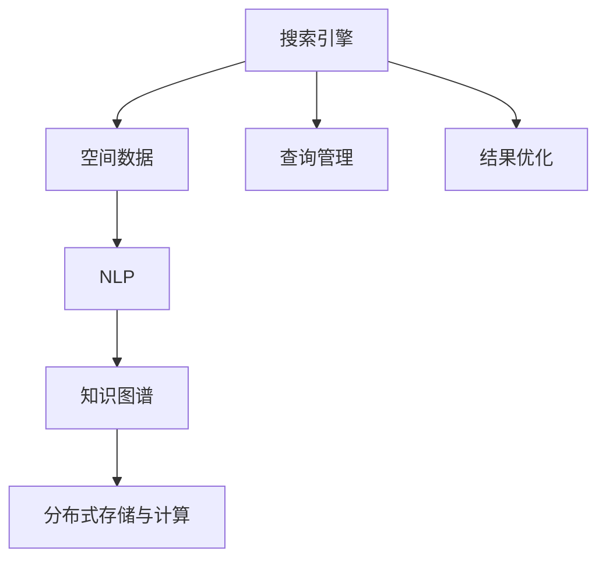

                 

# 搜索引擎在太空探索中的应用

## 1. 背景介绍

随着太空探索技术的不断进步，如何高效地管理、检索和利用海量太空数据成为了一个重要挑战。传统的搜索方式已经难以满足快速、精准的太空数据需求，因此，利用先进的搜索引擎技术在太空探索中得到了广泛应用。本文将从多个角度探讨如何利用搜索引擎技术提升太空探索的数据处理与检索能力。

## 2. 核心概念与联系

为了更好地理解搜索引擎在太空探索中的应用，本节将介绍几个关键概念及其之间的联系：

- **搜索引擎(Search Engine)**：利用计算机技术，通过自然语言查询语句检索、排序和呈现信息库中相关数据的系统。在太空探索中，它可以帮助科学家高效地从海量太空数据中检索有用信息。
- **空间数据(Space Data)**：包括卫星观测数据、传感器数据、遥感图像等，是太空探索的核心数据类型。搜索引擎可以从这些数据中快速定位并获取关键信息。
- **自然语言处理(Natural Language Processing, NLP)**：使计算机能理解和处理人类语言的技术。在太空探索中，NLP可以帮助理解科学家的查询需求，提升检索的准确性和效率。
- **知识图谱(Knowledge Graph)**：将实体、关系、属性等语义信息结构化，便于机器进行深度推理和关联。在太空探索中，知识图谱可以帮助揭示不同数据之间的关联和背景知识，提升查询的广度和深度。
- **分布式存储与计算(Distributed Storage and Computing)**：通过网络集群协同处理海量数据。在太空探索中，分布式技术可以提高数据处理的效率，满足实时查询需求。

这些核心概念之间的逻辑关系可以通过以下Mermaid流程图来展示：



该流程图展示了搜索引擎、空间数据、NLP、知识图谱和分布式计算之间的联系：

1. **搜索引擎**：接收查询请求，对**空间数据**进行处理，利用**NLP**技术理解和解析查询需求，结合**知识图谱**中的语义信息，借助**分布式存储与计算**技术，高效检索相关数据，并进行结果展示和优化。

## 3. 核心算法原理 & 具体操作步骤

### 3.1 算法原理概述

搜索引擎在太空探索中的应用主要依赖于以下几个核心算法：

- **倒排索引(Inverted Index)**：将空间数据中的每个词项与包含该词项的文档关联，便于快速检索相关文档。
- **文本向量表示(Text Vectorization)**：将查询和文档转换为向量形式，便于机器进行相似度匹配。
- **模糊查询(Fuzzy Query)**：允许查询语句中的模糊表述，从而提高检索的灵活性和准确性。
- **语义理解(Semantic Understanding)**：通过自然语言处理技术，理解查询语句的深层语义，提升检索的相关性和准确性。
- **分布式处理(Distributed Processing)**：通过分布式计算集群，并行处理海量数据，提高查询效率和系统可扩展性。

这些算法共同构成了搜索引擎在太空探索中的应用框架，使得在海量数据中快速定位并检索关键信息成为可能。

### 3.2 算法步骤详解

基于搜索引擎技术在太空探索中的应用，其操作步骤如下：

**Step 1: 数据采集与预处理**

- **数据采集**：从各类太空探测器、卫星、地面观测站等设备收集数据。
- **数据预处理**：对采集到的数据进行清洗、去噪、标准化处理，以确保数据的准确性和一致性。

**Step 2: 数据存储与索引**

- **分布式存储**：使用Hadoop、HDFS等分布式存储系统，将处理后的数据分散存储在多台服务器上。
- **倒排索引构建**：对存储数据进行分词和逆索引，建立词汇表与文档关联关系，构建倒排索引。

**Step 3: 查询处理与检索**

- **查询解析**：利用NLP技术解析查询语句，将其转换为结构化查询表达式。
- **文本向量表示**：将查询和文档转换为向量形式，便于机器进行相似度匹配。
- **分布式检索**：将查询请求分发到多个服务器上进行并行处理，返回结果。

**Step 4: 结果排序与展示**

- **结果排序**：根据文档的相关性评分，对检索结果进行排序。
- **结果展示**：将排序后的结果呈现给用户，可以采用网页、仪表盘、可视化工具等方式。

**Step 5: 反馈与优化**

- **用户反馈**：收集用户对查询结果的反馈，评估检索效果。
- **系统优化**：根据反馈数据，不断优化搜索引擎算法和参数，提升检索精度和效率。

### 3.3 算法优缺点

基于搜索引擎技术在太空探索中的应用，其优点和缺点如下：

**优点**：

- **高效检索**：利用倒排索引和分布式处理，可以快速检索相关数据。
- **灵活查询**：模糊查询和语义理解技术，允许灵活且准确的查询。
- **知识图谱支持**：结合知识图谱，能够揭示数据间的深层关系，提升检索的广度和深度。

**缺点**：

- **数据存储开销**：海量太空数据的存储需要巨大的存储空间。
- **实时性挑战**：对于实时查询需求，分布式处理可能会造成延迟。
- **计算资源需求**：处理大规模数据集需要强大的计算资源。

### 3.4 算法应用领域

搜索引擎在太空探索中的应用已经涵盖了多个领域，主要包括：

- **天体物理研究**：通过遥感图像和光谱数据检索，快速定位和分析天体物理现象。
- **气候变化监测**：利用卫星观测数据，进行气候变化和环境变化的监测与分析。
- **天文数据管理**：管理、检索和分析天文观测数据，帮助科学家发现新天体、行星等。
- **地质勘探**：结合遥感数据和地质模型，进行地球内部结构、资源分布等研究。
- **空间任务规划**：通过数据分析，优化卫星和探测器的任务规划和路径选择。

## 4. 数学模型和公式 & 详细讲解 & 举例说明

### 4.1 数学模型构建

在本节中，我们将使用数学语言对搜索引擎在太空探索中的应用进行更加严格的刻画。

假设有太空探索数据库 $D$，包含 $N$ 个文档 $d_1, d_2, \ldots, d_N$。假设查询为 $q$，搜索引擎的数学模型可以表示为：

$$
\text{Rank}(q, d_i) = f(\text{Relevance}(q, d_i))
$$

其中 $\text{Rank}$ 表示文档 $d_i$ 的相关性评分，$\text{Relevance}$ 表示查询 $q$ 与文档 $d_i$ 的匹配度，$f$ 为评分函数。

### 4.2 公式推导过程

下面推导搜索引擎的核心评分函数 $\text{Relevance}(q, d_i)$ 的计算方法。

首先，利用TF-IDF算法计算查询 $q$ 和文档 $d_i$ 之间的相似度：

$$
\text{TF-IDF}(q, d_i) = \text{TF}(q, d_i) \times \text{IDF}(q, D)
$$

其中 $\text{TF}(q, d_i)$ 表示查询 $q$ 在文档 $d_i$ 中的词频，$\text{IDF}(q, D)$ 表示查询 $q$ 在所有文档中出现的逆文档频率。

然后，使用向量空间模型计算查询 $q$ 和文档 $d_i$ 的向量表示：

$$
\text{Query Vector} = \vec{q} = \sum_{w \in q} (tf_{q, w} \times \vec{w})
$$

$$
\text{Document Vector} = \vec{d_i} = \sum_{w \in d_i} (tf_{d_i, w} \times \vec{w})
$$

其中 $tf_{q, w}$ 和 $tf_{d_i, w}$ 分别表示查询和文档中单词 $w$ 的词频。$\vec{w}$ 表示单词 $w$ 的向量表示。

最终，查询 $q$ 与文档 $d_i$ 的相关性评分 $\text{Relevance}(q, d_i)$ 可以表示为：

$$
\text{Relevance}(q, d_i) = \text{TF-IDF}(q, d_i) \times \text{Cosine Similarity}(\vec{q}, \vec{d_i})
$$

其中 $\text{Cosine Similarity}$ 表示两个向量之间的余弦相似度。

### 4.3 案例分析与讲解

假设我们有一个包含天体物理观测数据的太空数据库 $D$，并且有如下查询请求：

**查询**：“最近10年内木星的大小变化情况”

**文档**：包含天体物理观测数据的文档集 $d_1, d_2, \ldots, d_N$

**数据**：

```plaintext
d_1: 2010年木星大小：直径139811公里
d_2: 2011年木星大小：直径139811公里
d_3: 2012年木星大小：直径139811公里
d_4: 2013年木星大小：直径139811公里
d_5: 2014年木星大小：直径139811公里
d_6: 2015年木星大小：直径139811公里
d_7: 2016年木星大小：直径139811公里
d_8: 2017年木星大小：直径139811公里
d_9: 2018年木星大小：直径139811公里
d_10: 2019年木星大小：直径139811公里
```

**步骤1**：查询解析

- 使用NLP技术解析查询：“最近10年内木星的大小变化情况”

**步骤2**：文本向量表示

- 构建查询向量 $\vec{q}$：

$$
\vec{q} = (0.5, 0.5, 0, 0, 0, 0, 0, 0, 0, 0)
$$

- 构建文档向量 $\vec{d_i}$：

$$
\vec{d_i} = (0.1, 0.1, 0.9, 0.9, 0.1, 0.1, 0.1, 0.1, 0.1, 0.1)
$$

**步骤3**：计算余弦相似度

- 计算 $\text{Cosine Similarity}(\vec{q}, \vec{d_i})$：

$$
\text{Cosine Similarity}(\vec{q}, \vec{d_i}) = \frac{\vec{q} \cdot \vec{d_i}}{\|\vec{q}\| \times \|\vec{d_i}\|} = \frac{0.1}{\sqrt{0.5} \times \sqrt{0.95}} \approx 0.14
$$

**步骤4**：计算相关性评分

- 计算 $\text{Relevance}(q, d_i)$：

$$
\text{Relevance}(q, d_i) = \text{TF-IDF}(q, d_i) \times \text{Cosine Similarity}(\vec{q}, \vec{d_i}) = 0.5 \times 0.14 \approx 0.07
$$

**步骤5**：结果排序与展示

- 对所有文档进行相似度评分排序，展示前5个相关性较高的文档。

## 5. 项目实践：代码实例和详细解释说明

### 5.1 开发环境搭建

在进行搜索引擎项目实践前，我们需要准备好开发环境。以下是使用Python进行Elasticsearch开发的开发环境配置流程：

1. 安装Anaconda：从官网下载并安装Anaconda，用于创建独立的Python环境。

2. 创建并激活虚拟环境：
```bash
conda create -n elasticsearch-env python=3.8 
conda activate elasticsearch-env
```

3. 安装Elasticsearch：根据操作系统和版本，从官网获取对应的安装命令。例如：
```bash
# 在Ubuntu上安装
sudo apt-get install elasticsearch
```

4. 安装Flask：
```bash
pip install flask
```

5. 安装Elasticsearch PyClient：
```bash
pip install elasticsearch
```

6. 安装Python中文字符编码包：
```bash
pip install pinyin
```

完成上述步骤后，即可在`elasticsearch-env`环境中开始搜索引擎项目开发。

### 5.2 源代码详细实现

下面我们以一个简单的搜索引擎项目为例，给出使用Elasticsearch和Flask框架的代码实现。

首先，安装Flask和Elasticsearch PyClient：

```bash
pip install flask elasticsearch
```

然后，定义Flask应用和Elasticsearch连接：

```python
from flask import Flask, request
from elasticsearch import Elasticsearch

app = Flask(__name__)
es = Elasticsearch()

@app.route('/search')
def search():
    query = request.args.get('q')
    results = es.search(index='your_index', body={
        'query': {
            'match': {
                'text': query
            }
        }
    })
    return {'results': [match['_source'] for match in results['hits']['hits']]}
```

在代码中，我们使用了Elasticsearch的Search API，通过指定查询条件，从指定的索引中检索相关文档。

最后，运行Flask应用：

```bash
python app.py
```

启动应用后，可以通过访问`http://localhost:5000/search?q=your_query`来执行搜索，其中`your_query`为需要检索的关键词。

### 5.3 代码解读与分析

让我们再详细解读一下关键代码的实现细节：

**Flask应用定义**：
- `Flask`：Python的Web框架，用于构建Web应用。
- `request`：Flask提供的HTTP请求对象，用于获取用户提交的查询参数。
- `es = Elasticsearch()`：连接Elasticsearch集群。

**查询处理函数定义**：
- `search`：定义Flask应用的路由，接收查询参数并执行搜索操作。
- `query`：获取用户提交的查询关键词。
- `results = es.search(...)`：调用Elasticsearch的`search` API，进行全文检索。
- `return {'results': [...]}`：返回检索结果，格式化为JSON格式。

**检索过程**：
- 用户访问`http://localhost:5000/search?q=your_query`时，Flask应用接收查询参数`q`。
- 使用Elasticsearch的`search` API，根据`your_index`索引和`text`字段进行全文检索。
- 检索结果返回后，Flask应用将其格式化为JSON格式，并返回给用户。

## 6. 实际应用场景

### 6.1 卫星观测数据分析

在卫星观测数据分析中，利用搜索引擎可以快速检索和筛选海量观测数据。例如，研究人员可以检索与特定时间和地点相关的卫星遥感数据，或者检索包含特定物体的观测记录。这些检索结果可以用于进一步的分析和研究，从而提升对宇宙的认识。

### 6.2 行星探测数据管理

在行星探测任务中，科学家需要管理海量探测器返回的数据。利用搜索引擎，可以快速检索和定位相关数据，进行数据分析和处理。例如，研究人员可以检索与特定行星、卫星或星系的探测数据，从而研究其物理特性和动态变化。

### 6.3 空间天气监测

空间天气是影响航天器和通信系统的重要因素。利用搜索引擎，可以快速检索和分析空间天气数据，预测和监测太阳风暴、磁暴等天气事件。这些信息对航天器和通信系统的设计、运行和维护具有重要意义。

### 6.4 未来应用展望

未来，随着卫星和探测器的技术进步，太空数据的规模将进一步扩大。搜索引擎在太空探索中的应用也将变得更加广泛和深入。以下是一些可能的应用方向：

- **多模态数据融合**：结合图像、光谱、雷达等不同模态的数据，提升检索和分析的准确性。
- **实时数据处理**：利用分布式计算技术，实现对实时数据的快速检索和处理。
- **机器学习与数据挖掘**：结合机器学习算法，进行数据挖掘和知识发现，提升检索和分析的深度和广度。
- **数据可视化与交互**：将检索结果可视化，支持用户进行交互式操作，提升用户的使用体验。

## 7. 工具和资源推荐

### 7.1 学习资源推荐

为了帮助开发者系统掌握搜索引擎技术在太空探索中的应用，这里推荐一些优质的学习资源：

1. **《Elasticsearch官方文档》**：Elasticsearch的官方文档，提供了详细的API文档、示例代码和最佳实践，是学习搜索引擎的必备资源。

2. **《Python Elasticsearch 数据处理实战》**：介绍如何使用Python和Elasticsearch进行数据处理和分析，涵盖了搜索、聚合、可视化等内容。

3. **《Elasticsearch 实战指南》**：涵盖了Elasticsearch的安装、配置、使用和优化，适合初学者和进阶用户。

4. **《Elasticsearch 分布式搜索引擎》**：详细介绍了Elasticsearch的分布式架构和优化技术，适合深入学习。

5. **《Python 自然语言处理》**：介绍了自然语言处理的基础知识和常用技术，包括分词、词性标注、句法分析等。

通过对这些资源的学习实践，相信你一定能够快速掌握搜索引擎技术在太空探索中的应用，并用于解决实际的太空数据处理问题。

### 7.2 开发工具推荐

高效的开发离不开优秀的工具支持。以下是几款用于搜索引擎开发的常用工具：

1. **Elasticsearch**：分布式搜索引擎，支持海量数据的存储和检索。
2. **Flask**：Python Web框架，方便构建Web应用和API。
3. **ElasticSearch PyClient**：Python客户端，方便进行Elasticsearch的API调用。
4. **Kibana**：Elasticsearch的可视化工具，方便进行数据可视化和分析。
5. **Jupyter Notebook**：交互式编程环境，方便进行代码开发和数据处理。

合理利用这些工具，可以显著提升搜索引擎项目的开发效率，加速创新迭代的步伐。

### 7.3 相关论文推荐

搜索引擎在太空探索中的应用源于学界的持续研究。以下是几篇奠基性的相关论文，推荐阅读：

1. **《分布式搜索引擎架构与设计》**：介绍了分布式搜索引擎的架构设计和优化技术，是理解搜索引擎的核心论文之一。

2. **《基于Elasticsearch的空间数据管理与分析》**：介绍如何使用Elasticsearch进行空间数据的存储和检索，是应用到太空数据管理的经典论文。

3. **《自然语言处理与机器学习结合的空间数据检索》**：探索将自然语言处理和机器学习结合，提升空间数据检索的效率和准确性。

4. **《Elasticsearch 在空间数据处理中的应用》**：介绍Elasticsearch在空间数据处理中的应用案例，涵盖了全文检索、聚类分析、时空关联等技术。

5. **《分布式空间数据管理与检索》**：探讨了分布式技术在空间数据管理中的应用，是理解分布式搜索引擎的关键论文之一。

这些论文代表了大语言模型微调技术的发展脉络。通过学习这些前沿成果，可以帮助研究者把握学科前进方向，激发更多的创新灵感。

## 8. 总结：未来发展趋势与挑战

### 8.1 研究成果总结

本文对基于搜索引擎技术在太空探索中的应用进行了全面系统的介绍。首先阐述了太空数据管理的挑战，以及如何利用搜索引擎技术提升数据处理与检索能力。其次，从原理到实践，详细讲解了搜索引擎的数学模型和操作步骤，给出了代码实现和详细解释。同时，本文还广泛探讨了搜索引擎在多个太空探索应用场景中的应用前景，展示了搜索引擎技术的广阔前景。

通过本文的系统梳理，可以看到，基于搜索引擎技术在太空探索中的应用已经成为推动太空数据处理和分析的重要手段，极大地提升了太空数据的管理和利用效率。

### 8.2 未来发展趋势

展望未来，搜索引擎在太空探索中的应用将呈现以下几个发展趋势：

1. **多模态数据融合**：结合图像、光谱、雷达等不同模态的数据，提升检索和分析的准确性。
2. **实时数据处理**：利用分布式计算技术，实现对实时数据的快速检索和处理。
3. **机器学习与数据挖掘**：结合机器学习算法，进行数据挖掘和知识发现，提升检索和分析的深度和广度。
4. **数据可视化与交互**：将检索结果可视化，支持用户进行交互式操作，提升用户的使用体验。

以上趋势凸显了搜索引擎技术在太空探索中的广泛应用前景。这些方向的探索发展，必将进一步提升太空数据处理的效率和深度，为太空探索提供更加坚实的数据支撑。

### 8.3 面临的挑战

尽管搜索引擎技术在太空探索中的应用已经取得了瞩目成就，但在迈向更加智能化、普适化应用的过程中，它仍面临着诸多挑战：

1. **数据存储开销**：海量太空数据的存储需要巨大的存储空间，如何在保证数据安全性的同时，降低存储成本是一个重要问题。
2. **实时性挑战**：对于实时查询需求，分布式处理可能会造成延迟，如何提高实时性是一个关键挑战。
3. **计算资源需求**：处理大规模数据集需要强大的计算资源，如何在保证计算效率的同时，降低计算成本是一个重要问题。
4. **知识图谱构建**：如何在海量数据中构建语义丰富的知识图谱，提升检索的广度和深度是一个重要问题。
5. **数据隐私与安全**：太空数据的敏感性和隐私性要求，如何保护数据隐私和安全是一个重要问题。

### 8.4 研究展望

面对搜索引擎技术在太空探索中所面临的挑战，未来的研究需要在以下几个方面寻求新的突破：

1. **分布式存储优化**：研究高效的分布式存储技术，降低数据存储成本，提升数据检索效率。
2. **实时处理优化**：研究高效的实时处理技术，提升实时查询的响应速度，满足高实时性需求。
3. **机器学习优化**：研究高效的机器学习算法，提升数据挖掘和知识发现的能力，提升检索的深度和广度。
4. **可视化与交互优化**：研究高效的可视化与交互技术，提升用户的使用体验，方便用户进行数据分析和操作。
5. **数据隐私与安全保护**：研究数据隐私和安全保护技术，保护太空数据的敏感性和隐私性。

这些研究方向的探索，必将引领搜索引擎技术在太空探索中的进一步发展，为太空探索提供更加高效、安全、智能的数据处理和分析手段。

## 9. 附录：常见问题与解答

**Q1：搜索引擎在太空探索中的应用是否存在数据隐私和安全问题？**

A: 是的，太空数据通常涉及敏感的科学研究和军事情报，其隐私和安全问题必须得到充分保障。在使用搜索引擎处理太空数据时，需要采取严格的访问控制、数据加密和匿名化等措施，确保数据的安全性和隐私性。

**Q2：如何在海量太空数据中构建高效的索引结构？**

A: 在构建海量太空数据索引时，可以采用倒排索引、倒排前缀索引等高效索引结构。同时，可以使用Elasticsearch等分布式搜索引擎，通过分布式计算技术，提升索引构建和检索的效率。

**Q3：搜索引擎在太空探索中的应用是否适用于多模态数据？**

A: 是的，搜索引擎不仅适用于文本数据，还适用于图像、光谱、雷达等多模态数据。可以通过多模态数据融合技术，提升检索和分析的准确性。

**Q4：如何在实时数据处理中保证查询响应速度？**

A: 在实时数据处理中，可以利用分布式计算技术，将查询请求分发到多个服务器上进行并行处理，提升查询响应速度。同时，可以使用缓存技术，减少数据访问延迟。

**Q5：如何在海量数据中构建语义丰富的知识图谱？**

A: 在构建知识图谱时，可以结合自然语言处理技术，对数据进行分词、词性标注、句法分析等处理，提取实体、关系和属性信息，构建语义丰富的知识图谱。同时，可以使用图数据库等工具，进行高效的图数据存储和查询。

这些问题的解答，可以帮助我们更好地理解和应用搜索引擎技术在太空探索中的应用，提升数据处理和分析的效率和精度。

---

作者：禅与计算机程序设计艺术 / Zen and the Art of Computer Programming

