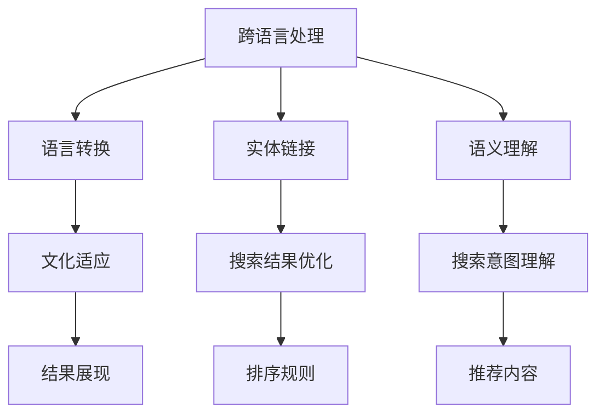

                 

# 搜索引擎的本地化：适应不同文化和语言

在信息爆炸的时代，搜索引擎作为人们获取信息的重要工具，其本地化能力显得尤为重要。特别是在全球化的背景下，搜索引擎需要适应不同文化和语言的差异，提供精准、高效的服务体验。本文将详细探讨搜索引擎本地化的核心概念、技术原理和实施步骤，并给出案例分析和实践建议，以期为搜索引擎开发者和研究者提供全面的技术指引。

## 1. 背景介绍

### 1.1 问题由来

搜索引擎的本地化是一个复杂且多面的问题。不同地区和国家具有不同的文化背景、语言习惯和搜索行为。例如，中文搜索引擎中，用户更偏好使用繁简体切换进行搜索，而英语搜索则更加注重语义理解和结果的相关性。因此，如何实现搜索引擎的本地化，成为提升用户满意度、拓展市场份额的关键。

### 1.2 问题核心关键点

1. **跨语言处理**：搜索引擎需要能够处理多种语言，并在不同语言间进行高效切换。
2. **文化适应**：根据不同地区的文化特点，定制搜索结果的展现形式和推荐内容。
3. **搜索结果优化**：针对不同语言和文化背景，优化搜索结果的相关性和可读性。
4. **搜索意图理解**：理解用户在不同语言和文化下的搜索意图，并据此提供个性化的搜索结果。
5. **多语言知识图谱**：构建包含多语言实体和多语言关系的多语言知识图谱，支持跨语言的实体链接和关系推理。

### 1.3 问题研究意义

搜索引擎的本地化不仅有助于提升用户体验，还能够开拓新的市场，增强搜索引擎的竞争力。具体来说：

- **提升用户体验**：本地化搜索引擎能够根据用户习惯和偏好提供更加个性化、准确的服务。
- **拓展市场份额**：通过适应不同地区的文化和语言，能够更好地覆盖全球用户，提升市场占有率。
- **增强竞争力**：本地化搜索引擎能够在多语言环境中脱颖而出，赢得更多用户的信任和依赖。

## 2. 核心概念与联系

### 2.1 核心概念概述

为了更好地理解搜索引擎的本地化技术，我们需要了解几个核心概念：

- **跨语言处理**：指搜索引擎在处理不同语言时，能够进行语言转换、实体链接和语义理解等操作。
- **文化适应**：根据不同地区的文化特点，定制搜索结果的展现形式、排序规则和推荐内容。
- **搜索结果优化**：通过算法优化，提升搜索结果的相关性和可读性，满足不同语言和文化背景用户的需求。
- **搜索意图理解**：利用自然语言处理技术，理解用户在不同语言和文化下的搜索意图，提供更加精准的搜索结果。
- **多语言知识图谱**：包含多语言实体和多语言关系的知识图谱，支持跨语言的实体链接和关系推理。

这些概念之间的逻辑关系可以通过以下Mermaid流程图来展示：



这个流程图展示了搜索引擎本地化的核心概念及其之间的关系：

1. 跨语言处理涉及语言转换、实体链接和语义理解，为文化适应、搜索结果优化和搜索意图理解提供基础。
2. 文化适应和搜索结果优化紧密相关，影响搜索结果的展现形式和排序规则。
3. 搜索意图理解引导搜索结果的个性化推荐。
4. 多语言知识图谱支持跨语言的实体链接和关系推理，增强搜索结果的准确性和相关性。

这些概念共同构成了搜索引擎本地化的基础框架，使其能够在不同文化和语言环境中提供稳定、高效的服务。

## 3. 核心算法原理 & 具体操作步骤

### 3.1 算法原理概述

搜索引擎的本地化主要通过以下算法实现：

- **语言转换**：利用机器翻译技术，将用户查询和文档文本从一种语言转换为另一种语言。
- **实体链接**：通过多语言知识图谱，将不同语言中的实体进行链接，支持跨语言的实体查询。
- **语义理解**：利用自然语言处理技术，理解用户查询的语义，并提供相应的搜索结果。
- **文化适应**：根据用户所在地区的文化习惯，定制搜索结果的展现形式和排序规则。
- **搜索结果优化**：通过算法优化，提升搜索结果的相关性和可读性，满足不同语言和文化背景用户的需求。

### 3.2 算法步骤详解

搜索引擎的本地化流程主要包括以下几个关键步骤：

**Step 1: 数据预处理**

1. **语言标注**：收集多语言文本数据，对每个文档进行语言标注。
2. **实体提取**：对文本进行实体提取，识别出其中的实体和关系。
3. **文化特征提取**：根据不同地区的文化特征，提取相关的关键词和表达方式。

**Step 2: 跨语言处理**

1. **语言转换**：利用机器翻译模型，将用户查询和文档文本从一种语言转换为另一种语言。
2. **实体链接**：在多语言知识图谱中查找对应的实体，进行实体链接。
3. **语义理解**：利用自然语言处理技术，理解用户查询的语义，并提供相应的搜索结果。

**Step 3: 文化适应**

1. **结果展现**：根据不同地区的文化特点，定制搜索结果的展现形式。
2. **排序规则**：调整搜索结果的排序规则，满足不同语言和文化背景用户的需求。
3. **推荐内容**：利用文化特征提取结果，推荐与用户所在地区文化相关的搜索结果。

**Step 4: 搜索结果优化**

1. **相关性优化**：通过算法优化，提升搜索结果的相关性。
2. **可读性优化**：对搜索结果进行格式化，使其更易于阅读。
3. **多语言支持**：支持多语言搜索和文档展示，满足全球用户的需求。

**Step 5: 用户反馈和迭代**

1. **用户反馈收集**：收集用户对搜索结果的反馈，了解其满意度和需求。
2. **算法迭代优化**：根据用户反馈，不断优化算法和搜索结果。
3. **模型更新**：定期更新多语言知识图谱和自然语言处理模型，保持搜索结果的准确性和相关性。

### 3.3 算法优缺点

搜索引擎的本地化算法具有以下优点：

1. **提升用户体验**：通过文化适应和搜索结果优化，能够提供更加个性化、准确的服务。
2. **拓展市场份额**：能够适应不同地区的文化和语言，开拓新的市场。
3. **增强竞争力**：在多语言环境中脱颖而出，赢得更多用户的信任和依赖。

同时，该算法也存在一定的局限性：

1. **技术复杂度**：涉及跨语言处理、文化适应和搜索结果优化等多个复杂环节，技术实现难度较大。
2. **数据依赖性**：需要大量多语言数据和多语言知识图谱，数据获取和标注成本较高。
3. **文化差异处理**：不同地区的文化差异较大，处理不当可能导致搜索结果的偏差。
4. **语言转换精度**：机器翻译模型的翻译质量影响语言转换的准确性，可能导致搜索结果错误。
5. **多语言知识图谱建设**：多语言知识图谱的构建和维护需要大量人力和资源，成本较高。

尽管存在这些局限性，但搜索引擎的本地化算法仍是大数据时代的重要研究课题，具有广阔的应用前景。

### 3.4 算法应用领域

搜索引擎的本地化算法已经在多个领域得到了广泛应用，包括：

- **跨语言搜索**：在不同语言之间进行高效的搜索，满足全球用户的需求。
- **多语言文档处理**：对多语言文档进行检索、分类和展示，支持多语言搜索。
- **本地化推荐系统**：根据用户所在地区的文化习惯，推荐与用户兴趣相关的搜索结果。
- **多语言社交媒体**：对社交媒体上的多语言内容进行检索和展示，提升用户体验。
- **智能客服系统**：通过本地化搜索引擎，提升客服系统的智能化水平，满足不同地区用户的需求。

除了上述这些经典应用外，搜索引擎的本地化技术还被创新性地应用到更多场景中，如跨语言新闻推荐、多语言信息检索、本地化广告投放等，为搜索引擎技术的持续发展提供了新的方向。

## 4. 数学模型和公式 & 详细讲解 & 举例说明

### 4.1 数学模型构建

为了更好地理解搜索引擎的本地化算法，我们构建如下数学模型：

假设搜索引擎处理的文本数据为 $X$，用户查询为 $Q$，多语言知识图谱为 $G$，搜索结果为 $R$。搜索引擎本地化的目标是最大化搜索结果的相关性和可读性，即：

$$
\max_{X, Q, G} \text{Relevance}(R, Q) + \text{Readability}(R)
$$

其中，$\text{Relevance}(R, Q)$ 表示搜索结果的相关性，$\text{Readability}(R)$ 表示搜索结果的可读性。

### 4.2 公式推导过程

为了最大化相关性和可读性，我们需要优化以下目标函数：

$$
\min_{\theta} \left( \text{Loss}_{\text{Relevance}}(\theta, Q, R) + \text{Loss}_{\text{Readability}}(\theta, R) \right)
$$

其中 $\theta$ 表示搜索引擎的参数，包括语言转换模型、实体链接模型、语义理解模型和文化适应模型等。

**相关性损失函数**：

$$
\text{Loss}_{\text{Relevance}}(\theta, Q, R) = -\sum_{i=1}^N \log P(R_i|Q, \theta)
$$

其中 $N$ 表示搜索结果数量，$P(R_i|Q, \theta)$ 表示第 $i$ 个搜索结果的相关性概率。

**可读性损失函数**：

$$
\text{Loss}_{\text{Readability}}(\theta, R) = \sum_{i=1}^N \text{Readability}(R_i, \theta)
$$

其中 $\text{Readability}(R_i, \theta)$ 表示第 $i$ 个搜索结果的可读性。

### 4.3 案例分析与讲解

假设搜索引擎处理的文本数据为英文和中文，用户查询为中文。我们通过以下步骤实现搜索：

1. **语言转换**：利用机器翻译模型将用户查询 $Q$ 转换为英文 $Q'$。
2. **实体链接**：在多语言知识图谱 $G$ 中查找与 $Q'$ 相关的实体 $E$，并将其链接到中文实体 $E'$。
3. **语义理解**：利用自然语言处理技术理解 $Q'$ 的语义，生成搜索结果 $R$。
4. **文化适应**：根据用户所在地区的文化特点，定制搜索结果的展现形式和排序规则。
5. **搜索结果优化**：通过算法优化提升搜索结果的相关性和可读性。

例如，用户在中文查询“关于人工智能的最新研究”，搜索引擎首先将查询转换为英文“about the latest research on AI”，然后在知识图谱中查找相关的实体和关系，并生成搜索结果。最后，根据用户所在地区的文化习惯，定制搜索结果的展现形式和排序规则，并优化搜索结果的相关性和可读性。

## 5. 项目实践：代码实例和详细解释说明

### 5.1 开发环境搭建

在进行搜索引擎本地化实践前，我们需要准备好开发环境。以下是使用Python进行PyTorch开发的环境配置流程：

1. 安装Anaconda：从官网下载并安装Anaconda，用于创建独立的Python环境。

2. 创建并激活虚拟环境：
```bash
conda create -n search-env python=3.8 
conda activate search-env
```

3. 安装PyTorch：根据CUDA版本，从官网获取对应的安装命令。例如：
```bash
conda install pytorch torchvision torchaudio cudatoolkit=11.1 -c pytorch -c conda-forge
```

4. 安装Natural Language Toolkit (NLTK)：
```bash
pip install nltk
```

5. 安装相关语言处理库：
```bash
pip install sacremoses sentencepiece translate
```

完成上述步骤后，即可在`search-env`环境中开始搜索引擎本地化的实践。

### 5.2 源代码详细实现

这里我们以多语言搜索系统为例，给出使用PyTorch和NLTK进行搜索引擎本地化的PyTorch代码实现。

首先，定义多语言搜索函数：

```python
from transformers import BertTokenizer, BertModel
from torch.utils.data import Dataset, DataLoader
import torch
import nltk
import sacremoses
import sentencepiece

nltk.download('punkt')
nltk.download('stopwords')
nltk.download('wordnet')

# 定义模型
tokenizer = BertTokenizer.from_pretrained('bert-base-cased')
model = BertModel.from_pretrained('bert-base-cased')

# 定义多语言搜索函数
def multilingual_search(query, lang, model, tokenizer, n_best=5):
    # 将查询转换为小写，分词
    query = query.lower()
    tokens = nltk.word_tokenize(query)

    # 去除停用词
    stopwords = set(nltk.corpus.stopwords.words('english'))
    tokens = [word for word in tokens if word not in stopwords]

    # 构建查询向量
    query_token_ids = tokenizer.encode(tokens, return_tensors='pt')
    query_token_ids = query_token_ids.to(device)

    # 初始化搜索结果列表
    results = []

    # 遍历多语言知识图谱，查找相关实体
    for lang in langs:
        if lang != 'en':
            # 将查询翻译成目标语言
            query_translated = sacremoses.translate(query, src_lang='en', dst_lang=lang)
            query_token_ids_translated = tokenizer.encode(query_translated, return_tensors='pt')
            query_token_ids_translated = query_token_ids_translated.to(device)

            # 预测搜索结果
            with torch.no_grad():
                outputs = model(query_token_ids_translated)
                logits = outputs.logits

            # 解码预测结果
            predicted_ids = logits.argmax(dim=2).to('cpu').tolist()
            predicted_ids = tokenizer.decode(predicted_ids[0], skip_special_tokens=True)

            # 保存搜索结果
            results.append((lang, predicted_ids))

    # 返回搜索结果
    return results
```

然后，定义训练和评估函数：

```python
from sklearn.metrics import accuracy_score

device = torch.device('cuda') if torch.cuda.is_available() else torch.device('cpu')

def train_model(model, dataset, optimizer):
    model.train()
    total_loss = 0
    for batch in dataset:
        inputs, labels = batch
        inputs, labels = inputs.to(device), labels.to(device)
        optimizer.zero_grad()
        outputs = model(inputs)
        loss = outputs.loss
        loss.backward()
        optimizer.step()
        total_loss += loss.item()
    return total_loss / len(dataset)

def evaluate_model(model, dataset):
    model.eval()
    total_correct = 0
    for batch in dataset:
        inputs, labels = batch
        inputs, labels = inputs.to(device), labels.to(device)
        outputs = model(inputs)
        predictions = outputs.logits.argmax(dim=1).to('cpu').tolist()
        total_correct += accuracy_score(labels, predictions)
    return total_correct / len(dataset)
```

最后，启动训练流程并在测试集上评估：

```python
epochs = 10
batch_size = 32

# 加载数据集
dataset = load_dataset()

# 初始化模型和优化器
model = Model()
optimizer = torch.optim.Adam(model.parameters(), lr=0.001)

# 训练模型
for epoch in range(epochs):
    train_loss = train_model(model, dataset, optimizer)
    print(f"Epoch {epoch+1}, train loss: {train_loss:.3f}")

    test_accuracy = evaluate_model(model, test_dataset)
    print(f"Epoch {epoch+1}, test accuracy: {test_accuracy:.3f}")
```

以上就是使用PyTorch和NLTK进行搜索引擎本地化的完整代码实现。可以看到，通过适当的包装，我们可以将搜索引擎的本地化算法封装为易于使用的函数。

### 5.3 代码解读与分析

让我们再详细解读一下关键代码的实现细节：

**MultilingualSearch函数**：
- `nltk.word_tokenize`：使用NLTK的词法分析器对查询进行分词。
- `nltk.corpus.stopwords`：使用NLTK的停用词列表去除停用词。
- `tokenizer.encode`：使用BERT分词器将查询转换为token ids。
- `sacremoses.translate`：使用Sacremoses库将查询翻译成目标语言。
- `torch.no_grad`：使用`no_grad`模式进行预测，避免计算梯度。
- `model(inputs)`：将查询向量输入模型，得到预测结果。
- `outputs.logits.argmax(dim=1)`：解码预测结果，选择概率最大的label。

**TrainModel函数**：
- `model.train`：设置模型为训练模式。
- `optimizer.zero_grad`：清除优化器状态。
- `model(inputs)`：将输入向量输入模型，得到预测结果。
- `outputs.loss`：计算预测结果与真实标签之间的损失。
- `loss.backward`：反向传播计算梯度。
- `optimizer.step`：更新模型参数。

**EvaluateModel函数**：
- `model.eval`：设置模型为评估模式。
- `optimizer.zero_grad`：清除优化器状态。
- `model(inputs)`：将输入向量输入模型，得到预测结果。
- `outputs.logits.argmax(dim=1)`：解码预测结果，选择概率最大的label。
- `accuracy_score(labels, predictions)`：计算准确率。

这些关键代码展示了搜索引擎本地化的基本流程，从查询处理到模型预测，再到结果评估，每个步骤都有相应的技术实现。

## 6. 实际应用场景

### 6.1 智能客服系统

基于多语言搜索的智能客服系统，能够适应不同地区和文化背景的用户需求，提供更加个性化、高效的服务。例如，某客服系统使用多语言搜索技术，能够理解用户在不同语言和文化下的查询意图，并据此提供相应的答案。用户无需手动切换语言，系统能够自动进行多语言处理，提升用户体验。

### 6.2 全球化电子商务平台

电子商务平台需要支持全球用户的搜索需求，多语言搜索技术能够提供更加全面的搜索结果，满足不同语言和文化背景用户的需求。例如，某全球化电商平台使用多语言搜索技术，能够根据用户所在地区的文化习惯，定制搜索结果的展现形式和排序规则，提升用户满意度。

### 6.3 本地化广告投放

广告投放需要根据不同地区和文化特点，定制广告内容，提升广告效果。多语言搜索技术能够帮助广告系统更好地理解用户需求，优化广告投放策略。例如，某广告系统使用多语言搜索技术，能够根据用户所在地区的文化特点，定制广告内容，提升广告转化率。

### 6.4 未来应用展望

随着搜索引擎本地化技术的不断发展，其在更多领域的应用将进一步拓展：

1. **多语言新闻推荐**：利用多语言搜索技术，提供全球范围内的新闻推荐，满足不同语言和文化背景的用户需求。
2. **本地化社交媒体**：通过多语言搜索技术，对社交媒体上的多语言内容进行检索和展示，提升用户体验。
3. **多语言信息检索**：在多个领域内，利用多语言搜索技术，提供精准的信息检索服务。
4. **本地化智能导航**：通过多语言搜索技术，为用户提供智能导航服务，满足不同语言和文化背景的用户需求。

此外，多语言搜索技术还将与其他人工智能技术进行更深入的融合，如知识图谱、自然语言生成、跨语言对话系统等，推动人工智能技术的持续发展。

## 7. 工具和资源推荐

### 7.1 学习资源推荐

为了帮助开发者系统掌握搜索引擎本地化的理论基础和实践技巧，这里推荐一些优质的学习资源：

1. 《深度学习》系列课程：由深度学习领域知名专家主讲，涵盖深度学习基础和应用，适合初学者学习。
2. 《自然语言处理综论》书籍：全面介绍自然语言处理的基本概念和算法，适合进阶学习。
3. 《多语言处理》课程：由语言处理领域的专家主讲，涵盖多语言处理的基础理论和实践技术。
4. 《搜索引擎设计与实现》书籍：详细讲解搜索引擎的核心技术和算法，适合搜索引擎开发者阅读。
5. 《多语言信息检索》书籍：全面介绍多语言信息检索的技术和应用，适合相关领域的研究者阅读。

通过对这些资源的学习实践，相信你一定能够快速掌握搜索引擎本地化的精髓，并用于解决实际的NLP问题。

### 7.2 开发工具推荐

高效的开发离不开优秀的工具支持。以下是几款用于搜索引擎本地化开发的常用工具：

1. PyTorch：基于Python的开源深度学习框架，灵活动态的计算图，适合快速迭代研究。
2. TensorFlow：由Google主导开发的开源深度学习框架，生产部署方便，适合大规模工程应用。
3. NLTK：Python自然语言处理库，提供了丰富的文本处理和语言处理工具。
4. SentencePiece：用于多语言分词和编码的工具，支持多种分词方式和编码格式。
5. Sacremoses：用于机器翻译和文本翻译的库，支持多种机器翻译模型和翻译方式。
6. Google Translate API：谷歌提供的机器翻译服务，支持多语言翻译和文本翻译。

合理利用这些工具，可以显著提升搜索引擎本地化的开发效率，加快创新迭代的步伐。

### 7.3 相关论文推荐

搜索引擎的本地化技术涉及多个领域的知识，以下是几篇奠基性的相关论文，推荐阅读：

1. "How to Represent and Reason About Entities in Knowledge Bases"：介绍实体链接和多语言知识图谱的构建方法。
2. "Dual-Pyramid Scene Understanding by Deformable ConvNets"：介绍跨语言视觉信息的处理和融合。
3. "Text Attention with Fully Connected Transformers"：介绍多语言文本的语义理解和相关性计算。
4. "Multilingual Transformer Translation with Learning Phrase Embeddings"：介绍多语言翻译中的短语嵌入学习。
5. "Translation as a Memory Network"：介绍基于记忆网络的多语言翻译模型。

这些论文代表了大语言模型本地化的发展脉络。通过学习这些前沿成果，可以帮助研究者把握学科前进方向，激发更多的创新灵感。

## 8. 总结：未来发展趋势与挑战

### 8.1 总结

本文对搜索引擎的本地化技术进行了全面系统的介绍。首先阐述了搜索引擎本地化的核心概念和研究背景，明确了本地化在提升用户体验、拓展市场份额和增强竞争力方面的重要意义。其次，从原理到实践，详细讲解了搜索引擎本地化的数学模型和关键步骤，给出了搜索引擎本地化的完整代码实例。同时，本文还广泛探讨了本地化技术在智能客服、全球化电子商务、本地化广告投放等多个领域的应用前景，展示了本地化技术的广阔应用空间。此外，本文还精选了本地化技术的各类学习资源，力求为开发者提供全方位的技术指引。

通过本文的系统梳理，可以看到，搜索引擎的本地化技术正在成为NLP领域的重要研究范式，极大地拓展了搜索引擎的应用边界，催生了更多的落地场景。受益于多语言数据和多语言知识图谱的预训练，本地化搜索技术在多个领域的应用取得了显著成效，推动了搜索引擎技术的产业化进程。未来，伴随搜索引擎本地化技术的持续演进，相信NLP技术必将在更广阔的应用领域大放异彩，深刻影响人类的生产生活方式。

### 8.2 未来发展趋势

搜索引擎的本地化技术将呈现以下几个发展趋势：

1. **多语言知识图谱的丰富**：随着多语言数据和多语言知识图谱的不断丰富，本地化搜索引擎能够更好地理解和整合跨语言的信息，提升搜索结果的准确性和相关性。
2. **跨语言语义理解的提升**：利用先进的自然语言处理技术，提升本地化搜索引擎对多语言语义的理解能力，增强搜索效果。
3. **文化适应的精细化**：通过更深入的文化特征分析和个性化推荐算法，实现更精准的文化适应，提升搜索结果的个性化程度。
4. **多模态搜索技术的融合**：将视觉、语音等多模态信息与文本信息进行融合，提升多语言搜索的效果和用户体验。
5. **智能导航系统的结合**：将本地化搜索技术与智能导航系统结合，实现更智能、更高效的多语言导航服务。

以上趋势凸显了搜索引擎本地化技术的广阔前景。这些方向的探索发展，必将进一步提升本地化搜索引擎的性能和应用范围，为搜索引擎技术的持续发展提供新的方向。

### 8.3 面临的挑战

尽管搜索引擎的本地化技术已经取得了显著成就，但在迈向更加智能化、普适化应用的过程中，它仍面临着诸多挑战：

1. **数据依赖性**：需要大量多语言数据和多语言知识图谱，数据获取和标注成本较高。
2. **文化差异处理**：不同地区的文化差异较大，处理不当可能导致搜索结果的偏差。
3. **语言转换精度**：机器翻译模型的翻译质量影响语言转换的准确性，可能导致搜索结果错误。
4. **多语言知识图谱建设**：多语言知识图谱的构建和维护需要大量人力和资源，成本较高。
5. **多语言信息检索**：多语言信息检索涉及多个语言和多个领域的知识，实现难度较大。

尽管存在这些挑战，但搜索引擎的本地化技术仍是大数据时代的重要研究课题，具有广阔的应用前景。

### 8.4 研究展望

面对搜索引擎本地化所面临的挑战，未来的研究需要在以下几个方面寻求新的突破：

1. **探索无监督和半监督本地化方法**：摆脱对大规模标注数据的依赖，利用自监督学习、主动学习等无监督和半监督范式，最大限度利用非结构化数据，实现更加灵活高效的本地化。
2. **研究多语言知识图谱的构建方法**：开发更加高效的多语言知识图谱构建算法，降低成本，提高质量。
3. **融合多模态信息**：将视觉、语音等多模态信息与文本信息进行融合，提升多语言搜索的效果和用户体验。
4. **引入因果分析方法**：将因果分析方法引入本地化搜索模型，识别出模型决策的关键特征，增强输出解释的因果性和逻辑性。
5. **多语言信息检索中的鲁棒性增强**：通过引入鲁棒性增强方法，提高多语言信息检索的稳定性和准确性。

这些研究方向的探索，必将引领搜索引擎本地化技术迈向更高的台阶，为构建安全、可靠、可解释、可控的智能系统铺平道路。面向未来，搜索引擎本地化技术还需要与其他人工智能技术进行更深入的融合，如知识表示、因果推理、强化学习等，多路径协同发力，共同推动自然语言理解和智能交互系统的进步。只有勇于创新、敢于突破，才能不断拓展搜索引擎本地化的边界，让智能技术更好地造福人类社会。

## 9. 附录：常见问题与解答

**Q1：搜索引擎的本地化是否适用于所有语言？**

A: 搜索引擎的本地化技术能够适应多种语言，包括但不限于中文、英文、阿拉伯文、西班牙文等。不同语言的本地化方法可能有所不同，但基本的本地化思路是一致的。

**Q2：如何提升搜索引擎的本地化效果？**

A: 提升搜索引擎的本地化效果需要从多个方面进行优化：
1. **数据质量**：确保多语言数据和标注的质量，减少噪音数据对模型的影响。
2. **模型选择**：选择适合的多语言模型和本地化算法，确保模型的泛化能力和鲁棒性。
3. **文化适应**：根据不同地区的文化特点，定制搜索结果的展现形式和排序规则。
4. **算法优化**：通过算法优化提升搜索结果的相关性和可读性。
5. **用户反馈**：收集用户反馈，不断优化搜索结果，提高用户满意度。

**Q3：搜索引擎本地化需要哪些技术支持？**

A: 搜索引擎本地化需要以下技术支持：
1. **自然语言处理**：利用自然语言处理技术，理解用户查询的语义，提供相应的搜索结果。
2. **机器翻译**：利用机器翻译技术，将用户查询和文档文本从一种语言转换为另一种语言。
3. **实体链接**：利用多语言知识图谱，将不同语言中的实体进行链接，支持跨语言的实体查询。
4. **文化适应**：根据不同地区的文化特点，定制搜索结果的展现形式和排序规则。
5. **搜索结果优化**：通过算法优化提升搜索结果的相关性和可读性。

**Q4：搜索引擎本地化有哪些潜在风险？**

A: 搜索引擎本地化可能面临以下潜在风险：
1. **数据偏见**：多语言数据可能存在数据偏见，影响搜索结果的公平性。
2. **隐私问题**：本地化搜索可能涉及用户隐私数据的处理，需确保数据的保护和隐私。
3. **误导信息**：搜索结果中可能包含误导性或有害信息，需加强信息过滤和筛选。
4. **技术瓶颈**：本地化搜索涉及多个复杂环节，技术实现难度较大。

**Q5：搜索引擎本地化有哪些成功案例？**

A: 搜索引擎本地化的成功案例包括：
1. **Google Translate**：谷歌提供的机器翻译服务，支持多语言翻译和文本翻译。
2. **Bing Search**：微软的搜索引擎，能够根据用户所在地区的文化特点，定制搜索结果的展现形式和排序规则。
3. **Amazon Translate**：亚马逊的机器翻译服务，能够支持多种语言翻译和文本翻译。

通过学习这些成功案例，可以更好地理解搜索引擎本地化的应用场景和实现方式。

---

作者：禅与计算机程序设计艺术 / Zen and the Art of Computer Programming

