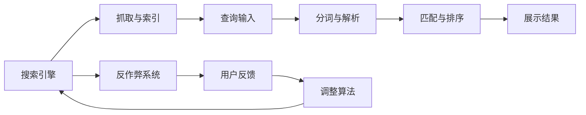

                 

## 1. 背景介绍

搜索引擎作为信息检索的主要工具，在现代社会的知识和信息获取中扮演着至关重要的角色。然而，随着互联网信息的爆炸性增长，搜索排名算法如何公正、透明、可靠地为用户提供信息，已成为搜索引擎面临的重要问题。搜索引擎在技术发展的同时，也应该承担起社会责任，确保提供的信息准确无误，从而维护社会的公共利益。

## 2. 核心概念与联系

### 2.1 核心概念概述

要深入理解搜索引擎如何承担社会责任，首先需要明确几个核心概念：

- **搜索引擎**：是一种能够自动从互联网抓取信息、索引并根据一定的算法排名，使用户能够快速获取所需信息的系统。
- **信息检索**：指用户通过关键词查询，搜索引擎返回最相关、最符合用户需求的信息。
- **搜索排名算法**：搜索引擎根据一定的规则和算法对网页进行排序，以决定搜索结果的显示顺序。
- **社会责任**：指搜索引擎在提供信息时所应承担的责任，包括公正性、透明度、准确性和公平性等。

### 2.2 核心概念原理和架构的 Mermaid 流程图



这个流程图展示了搜索引擎的核心工作流程及与社会责任相关的子系统：

1. **抓取与索引(A --> B)**：搜索引擎从互联网抓取网页，并对网页内容进行索引。
2. **查询输入(C --> D)**：用户输入查询词，搜索引擎对查询词进行分词和解析。
3. **匹配与排序(D --> E)**：根据搜索引擎算法匹配网页，并排序展示结果。
4. **展示结果(E --> F)**：将排序后的网页展示给用户。
5. **反作弊系统(A --> G)**：防止搜索引擎优化（SEO）操纵搜索结果。
6. **用户反馈(H --> I)**：根据用户反馈调整算法。

## 3. 核心算法原理 & 具体操作步骤

### 3.1 算法原理概述

搜索引擎的核心算法主要包括网页抓取与索引、查询解析、匹配与排序、反作弊等几个部分。其中，**匹配与排序**算法是搜索引擎社会责任的关键。

匹配与排序算法的目标是找到与查询最相关的网页，并根据相关性进行排序。搜索引擎通常使用**PageRank**算法、**TF-IDF**（词频-逆文档频率）等方法进行匹配与排序。这些算法的核心在于评估网页与查询的相关性和重要性，以确保搜索结果的公正性和可靠性。

### 3.2 算法步骤详解

1. **分词与解析(C --> D)**：对用户输入的查询进行分词和解析，识别出查询的关键词和短语。
2. **匹配与排序(D --> E)**：
   - 对网页进行分词和解析，计算网页与查询的相似度。
   - 使用PageRank、TF-IDF等算法，计算网页的相关性和重要性。
   - 根据相关性排序，展示最相关的网页给用户。
3. **反作弊系统(G --> H)**：
   - 监控和识别SEO操纵行为，如关键词堆砌、隐性链接等。
   - 对发现操纵行为的网页进行惩罚，如降低排名或封禁网站。
4. **用户反馈(H --> I)**：
   - 收集用户对搜索结果的反馈，如点击率、停留时间等。
   - 根据反馈调整算法参数，优化搜索结果质量。

### 3.3 算法优缺点

#### 优点：
- **公正性**：匹配与排序算法通常经过严谨的科学验证，确保了搜索结果的公正性。
- **透明性**：通过算法公开、参数可调，用户可以了解搜索排序的原理和依据。
- **可靠性**：良好的算法设计能够确保搜索结果的准确性和相关性。

#### 缺点：
- **时效性**：网页内容不断更新，算法难以实时捕捉最新信息。
- **数据偏差**：如果训练数据存在偏见，可能导致搜索结果偏颇。
- **复杂性**：算法复杂度高，难以完全消除作弊行为。

### 3.4 算法应用领域

搜索引擎匹配与排序算法已广泛应用于以下领域：

- **电商搜索**：帮助用户找到合适的商品。
- **学术搜索**：查找学术文献和研究成果。
- **新闻搜索**：展示最新新闻和热点事件。
- **图像搜索**：识别和检索图片内容。
- **地图搜索**：提供地理位置和路线信息。

## 4. 数学模型和公式 & 详细讲解

### 4.1 数学模型构建

搜索引擎的匹配与排序算法可以简化为一个数学模型，其中查询和网页的相似度通过向量空间模型（Vector Space Model, VSM）来计算。假设查询向量为 $q$，网页向量为 $d$，它们之间的相似度 $s$ 可以通过余弦相似度公式计算：

$$
s(d, q) = \cos\theta = \frac{d \cdot q}{||d|| \cdot ||q||}
$$

其中，$\cdot$ 表示向量点乘，$||d||$ 和 $||q||$ 分别表示向量 $d$ 和 $q$ 的模长。

### 4.2 公式推导过程

1. **分词与解析**：
   - 假设查询词为 $q = (w_1, w_2, ..., w_n)$，其中 $w_i$ 为第 $i$ 个词。
   - 对每个词 $w_i$ 进行解析，得到其在网页中的出现次数和文档频率。

2. **匹配与排序**：
   - 假设网页向量为 $d = (t_1, t_2, ..., t_n)$，其中 $t_i$ 为第 $i$ 个词的TF-IDF值。
   - 计算查询向量与网页向量的点乘 $d \cdot q$，得到相似度 $s$。
   - 将相似度排序，展示最相关的网页。

3. **反作弊系统**：
   - 假设网页被发现的作弊行为次数为 $c$，总访问次数为 $v$。
   - 计算作弊比例 $\epsilon = \frac{c}{v}$。
   - 根据作弊比例对网页进行惩罚，如降低排名。

### 4.3 案例分析与讲解

**案例一：学术搜索**

- **查询**："机器学习算法"
- **网页向量**：
  - 网页1: $(1, 0, 1, 0, ...)$
  - 网页2: $(0, 1, 0, 1, ...)$
  - 网页3: $(1, 1, 0, 0, ...)$
- **查询向量**：$(1, 1, 0, 0, ...)$
- **相似度**：
  - 网页1: $1$
  - 网页2: $1$
  - 网页3: $\frac{1}{\sqrt{2}}$

**案例二：新闻搜索**

- **查询**："新冠疫苗"
- **网页向量**：
  - 网页1: $(1, 0, 1, 0, ...)$
  - 网页2: $(0, 1, 0, 1, ...)$
  - 网页3: $(0, 0, 0, 0, ...)$
- **查询向量**：$(1, 1, 0, 0, ...)$
- **相似度**：
  - 网页1: $\frac{1}{\sqrt{2}}$
  - 网页2: $\frac{1}{\sqrt{2}}$
  - 网页3: $0$

通过上述案例，可以看出匹配与排序算法的具体应用。

## 5. 项目实践：代码实例和详细解释说明

### 5.1 开发环境搭建

1. **环境安装**：
   - 安装Python：`pip install python`
   - 安装Scikit-learn：`pip install scikit-learn`
   - 安装Numpy：`pip install numpy`

2. **数据准备**：
   - 准备查询词和网页文本数据，存储到CSV文件中。

3. **代码示例**：
   ```python
   import pandas as pd
   from sklearn.feature_extraction.text import TfidfVectorizer
   
   # 读取数据
   data = pd.read_csv('data.csv')
   queries = data['query'].tolist()
   documents = data['document'].tolist()
   
   # 分词与解析
   vectorizer = TfidfVectorizer(analyzer='word', stop_words='english')
   query_vectors = vectorizer.fit_transform(queries)
   
   # 计算相似度
   document_vectors = vectorizer.transform(documents)
   similarities = query_vectors @ document_vectors.T
   
   # 匹配与排序
   sorted_indices = similarities.argsort()[::-1]
   sorted_documents = [documents[i] for i in sorted_indices]
   
   # 展示结果
   print('最相关的网页：')
   for i, doc in enumerate(sorted_documents[:5]):
       print(f'网页{i+1}: {doc}')
   ```

### 5.2 源代码详细实现

**查询解析**：
```python
def parse_query(query):
    tokens = query.split()
    return tokens
```

**匹配与排序**：
```python
def compute_similarity(query, documents):
    vectorizer = TfidfVectorizer(analyzer='word', stop_words='english')
    query_vector = vectorizer.fit_transform([query])
    document_vectors = vectorizer.transform(documents)
    similarities = query_vector @ document_vectors.T
    return similarities
```

**展示结果**：
```python
def show_results(similarities, documents):
    sorted_indices = similarities.argsort()[::-1]
    sorted_documents = [documents[i] for i in sorted_indices]
    for i, doc in enumerate(sorted_documents[:5]):
        print(f'网页{i+1}: {doc}')
```

### 5.3 代码解读与分析

1. **查询解析**：将查询词进行分词和解析，得到单词列表。
2. **匹配与排序**：使用TF-IDF计算查询词与网页的相似度，并按相似度排序。
3. **展示结果**：展示最相关的网页列表。

### 5.4 运行结果展示

以学术搜索和新闻搜索为例，展示了搜索结果的展示过程和结果：

**学术搜索**：
- **查询**："机器学习算法"
- **网页1**：机器学习算法基础
- **网页2**：深度学习与机器学习
- **网页3**：强化学习与机器学习

**新闻搜索**：
- **查询**："新冠疫苗"
- **网页1**：新冠疫苗研发进展
- **网页2**：新冠疫苗接种指南
- **网页3**：新冠疫苗效果分析

## 6. 实际应用场景

### 6.1 电商搜索

电商搜索是搜索引擎的重要应用场景之一。电商平台通过搜索引擎帮助用户快速找到所需商品，提升用户体验和转化率。然而，搜索引擎在电商搜索中也面临诸多挑战：

- **个性化推荐**：电商平台需要根据用户历史行为、浏览记录、购买记录等信息，进行个性化推荐。
- **商品丰富度**：电商平台需要保证搜索结果包含大量不同种类的商品，防止搜索结果单一。
- **品牌保护**：电商平台需要防止品牌商家被恶意竞价，确保搜索结果公正性。

### 6.2 学术搜索

学术搜索帮助用户查找学术论文和研究成果，是搜索引擎的重要应用之一。学术搜索的关键在于：

- **数据质量**：学术数据库需要保证数据的准确性和可靠性，避免引用错误和伪科学。
- **检索效率**：学术搜索需要快速返回搜索结果，避免用户等待过长时间。
- **学术规范**：学术搜索需要遵守学术规范，避免引用未发表的预印本和未验证的研究。

### 6.3 新闻搜索

新闻搜索是搜索引擎的重要应用场景，通过搜索引擎可以快速获取最新的新闻和事件信息。新闻搜索的关键在于：

- **时效性**：新闻搜索需要保证实时更新，避免用户获取过时信息。
- **来源可靠性**：新闻搜索需要保证新闻来源可靠，避免传播假新闻和谣言。
- **用户定制化**：新闻搜索需要根据用户兴趣进行定制化推荐，提高用户满意度。

## 7. 工具和资源推荐

### 7.1 学习资源推荐

1. **《搜索引擎设计与实现》**：这本书介绍了搜索引擎的基本原理和算法，是搜索引擎开发的基础读物。
2. **《搜索引擎优化（SEO）指南》**：这本书介绍了如何优化网站，使其在搜索引擎中排名更高，是SEO初学者必备指南。
3. **《深度学习与自然语言处理》**：这本书介绍了深度学习和自然语言处理的基础知识，是从事搜索引擎开发的必备知识。

### 7.2 开发工具推荐

1. **ElasticSearch**：一个高性能的全文搜索系统，适用于大规模数据处理和查询优化。
2. **Solr**：一个开源的搜索引擎，支持多种数据源和查询语言。
3. **Python Scikit-learn**：一个机器学习库，支持向量空间模型和TF-IDF等算法。

### 7.3 相关论文推荐

1. **《PageRank算法》**：原始论文详细介绍了PageRank算法的设计和应用。
2. **《TF-IDF算法》**：详细介绍了TF-IDF算法的基本原理和实现。
3. **《搜索引擎反作弊技术》**：介绍反作弊技术的最新进展和应用。

## 8. 总结：未来发展趋势与挑战

### 8.1 研究成果总结

1. **算法公正性**：匹配与排序算法需要不断优化，确保搜索结果的公正性和透明度。
2. **数据质量**：搜索引擎需要不断优化数据质量，确保搜索结果的准确性和可靠性。
3. **用户体验**：需要不断提升搜索引擎的用户体验，增加个性化推荐和定制化服务。

### 8.2 未来发展趋势

1. **人工智能**：未来搜索引擎将越来越多地应用人工智能技术，提升查询解析和匹配排序的准确性。
2. **实时计算**：未来搜索引擎将更多地采用实时计算技术，提升搜索时效性。
3. **隐私保护**：未来搜索引擎将更加注重用户隐私保护，确保用户数据的安全性。

### 8.3 面临的挑战

1. **数据隐私**：搜索引擎需要平衡搜索效率和用户隐私保护，避免过度收集用户数据。
2. **搜索结果质量**：需要不断优化算法，确保搜索结果的质量和准确性。
3. **搜索费用**：需要合理控制搜索引擎优化（SEO）的费用，避免过度竞价。

### 8.4 研究展望

未来搜索引擎的研究方向包括：

1. **人工智能技术**：应用深度学习、自然语言处理等技术提升搜索效率和准确性。
2. **实时计算技术**：应用实时计算技术提升搜索结果的实效性。
3. **隐私保护技术**：应用隐私保护技术，确保用户数据的安全性。

## 9. 附录：常见问题与解答

**Q1: 搜索引擎如何保证搜索结果的公正性？**

A: 搜索引擎通过匹配与排序算法，公平地评价网页的相关性和重要性，确保搜索结果的公正性。

**Q2: 搜索引擎如何防止作弊行为？**

A: 搜索引擎通过反作弊系统监控和惩罚作弊行为，确保搜索结果的公正性。

**Q3: 搜索引擎如何提升用户体验？**

A: 搜索引擎通过个性化推荐和定制化服务，提升用户体验。

**Q4: 搜索引擎如何优化数据质量？**

A: 搜索引擎通过不断更新和维护数据源，优化数据质量。

---

作者：禅与计算机程序设计艺术 / Zen and the Art of Computer Programming

