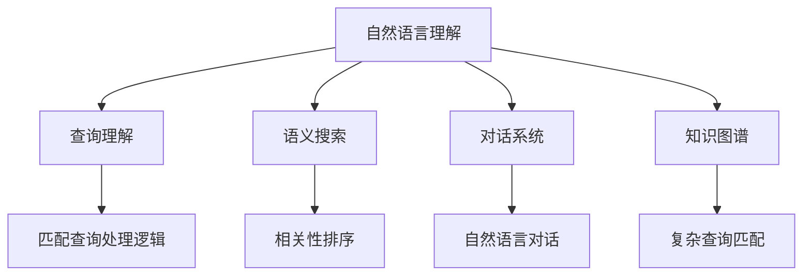

                 

# 搜索引擎的自然语言理解进展

> 关键词：自然语言理解,搜索引擎,查询理解,语义搜索,预训练模型,深度学习,Transformer

## 1. 背景介绍

### 1.1 问题由来
随着互联网的蓬勃发展，搜索引擎已经成为人们获取信息的重要工具。传统的基于关键词匹配的搜索模式，已经无法满足用户对于信息查询精细化和个性化的需求。如何使搜索引擎能够理解用户自然语言的查询意图，从而提供更准确、更个性化的搜索结果，成为了当前搜索引擎研究的核心课题。

### 1.2 问题核心关键点
自然语言理解(Natural Language Understanding, NLU)是搜索引擎获取查询意图的关键技术，主要包含以下几方面：

- **查询理解(Question Understanding, QA)**：分析用户查询语句的语义，理解查询意图。
- **语义搜索(Semantic Search)**：通过理解查询语句的语义，匹配出最相关的搜索结果。
- **对话系统(Chatbot)**：与用户进行自然语言对话，解答用户问题。

自然语言理解技术的进步，使得搜索引擎从基于关键词的简单匹配，向基于语义的智能检索演进，为用户带来了更加智能、个性化的搜索体验。

### 1.3 问题研究意义
自然语言理解技术的进步，对搜索引擎行业乃至整个互联网行业都具有重要意义：

1. **提升用户体验**：自然语言理解使得搜索引擎能够更好地理解用户查询意图，提供更精准、更个性化的搜索结果，显著提升用户满意度。
2. **拓展服务范围**：自然语言理解技术可以应用于对话系统、智能推荐、个性化搜索等多个场景，推动搜索引擎功能和服务的多样化发展。
3. **促进创新应用**：自然语言理解技术的进步，为NLP技术的产业化提供了重要推动力，促进了语音搜索、智能客服、知识图谱等创新应用的开发和应用。
4. **推动行业升级**：自然语言理解技术的普及，将加速搜索引擎行业和其他互联网行业的数字化转型，提升整个行业的服务水平和竞争能力。

## 2. 核心概念与联系

### 2.1 核心概念概述

为更好地理解搜索引擎的自然语言理解技术，本节将介绍几个密切相关的核心概念：

- **自然语言理解(NLU)**：指计算机系统能够理解、解释和生成自然语言的能力，是搜索引擎获取查询意图的核心技术。
- **查询理解(QA)**：指计算机系统能够从用户查询中提取查询意图，匹配相应的查询处理逻辑。
- **语义搜索**：指搜索引擎能够理解查询语句的语义，匹配出最相关的搜索结果。
- **对话系统(Chatbot)**：指计算机系统能够与用户进行自然语言对话，解答用户问题。
- **知识图谱(Knowledge Graph)**：指用于组织和管理知识的一种图结构，通过语义搜索技术支持复杂的查询逻辑。
- **深度学习(Deep Learning)**：指通过构建多层神经网络模型，学习数据的复杂非线性特征。
- **Transformer**：一种用于处理序列数据的神经网络模型，特别适用于NLU任务，具有高效的并行计算能力和优异的性能表现。
- **BERT(Bidirectional Encoder Representations from Transformers)**：一种预训练语言模型，能够学习到丰富的语言知识，广泛应用于自然语言理解任务中。
- **GPT(Generative Pre-trained Transformer)**：一种预训练语言模型，具有很强的生成能力和语言理解能力，广泛应用于文本生成和对话系统中。

这些核心概念之间的逻辑关系可以通过以下Mermaid流程图来展示：



这个流程图展示了大语言模型的核心概念及其之间的关系：

1. 自然语言理解通过查询理解和语义搜索技术，理解用户查询意图。
2. 对话系统通过与用户的自然语言交流，提供即时反馈。
3. 知识图谱通过语义搜索技术，支持复杂的查询逻辑。
4. Transformer和预训练模型（如BERT、GPT）为大语言模型提供了基础计算框架和知识表示。

这些概念共同构成了搜索引擎自然语言理解的技术框架，使其能够更好地理解用户查询，提供精准的搜索结果和优质的用户体验。

## 3. 核心算法原理 & 具体操作步骤
### 3.1 算法原理概述

自然语言理解的核心算法主要是基于深度学习的方法，通过构建多层神经网络模型，学习自然语言的复杂非线性特征。其主要流程包括以下几个步骤：

1. **预训练**：在大规模无标签文本语料上进行预训练，学习语言的通用表示。
2. **微调**：在特定领域的少量标注数据上进行微调，提升模型对特定领域的适应能力。
3. **查询理解**：分析用户查询语句的语义，提取查询意图。
4. **语义搜索**：通过理解查询语句的语义，匹配最相关的搜索结果。
5. **对话系统**：与用户进行自然语言对话，解答用户问题。

### 3.2 算法步骤详解

以基于深度学习的自然语言理解算法为例，其主要步骤如下：

1. **数据准备**：收集大量的自然语言文本数据，进行标注处理，构建训练集和验证集。
2. **模型选择**：选择合适的深度学习模型，如Transformer、BERT等。
3. **预训练**：在无标签文本语料上进行预训练，学习语言的通用表示。
4. **微调**：在特定领域的少量标注数据上进行微调，提升模型对特定领域的适应能力。
5. **查询理解**：分析用户查询语句的语义，提取查询意图。
6. **语义搜索**：通过理解查询语句的语义，匹配最相关的搜索结果。
7. **对话系统**：与用户进行自然语言对话，解答用户问题。

### 3.3 算法优缺点

自然语言理解算法具有以下优点：

1. **精度高**：基于深度学习的自然语言理解算法在语义匹配和意图理解上具有较高的准确率。
2. **灵活性**：可以通过微调提升模型对特定领域的适应能力，适用于各种类型的自然语言查询。
3. **可解释性**：通过分析模型内部的神经网络结构，可以揭示模型的决策过程和逻辑推理。

同时，该算法也存在一定的局限性：

1. **数据依赖性高**：自然语言理解算法的性能很大程度上取决于训练数据的数量和质量，获取高质量标注数据的成本较高。
2. **计算资源需求大**：深度学习模型通常需要较大的计算资源，预训练和微调过程耗费大量时间和计算资源。
3. **鲁棒性不足**：在面对噪声数据和极端情况时，模型的鲁棒性可能不足，容易出现错误理解或误判。
4. **可解释性不足**：尽管模型具有可解释性，但对于复杂查询和长文本的语义理解，仍存在一定的黑盒问题。

尽管存在这些局限性，但就目前而言，基于深度学习的自然语言理解算法仍是最主流的技术范式。未来相关研究的重点在于如何进一步降低数据依赖，提高模型的鲁棒性和可解释性，同时兼顾计算资源的使用效率。

### 3.4 算法应用领域

自然语言理解技术在搜索引擎中的应用非常广泛，涵盖以下多个方面：

- **查询理解**：分析用户查询语句的语义，提取查询意图。
- **语义搜索**：通过理解查询语句的语义，匹配最相关的搜索结果。
- **对话系统**：与用户进行自然语言对话，解答用户问题。
- **智能推荐**：通过理解用户查询，推荐最相关的信息。
- **内容生成**：通过理解用户查询，生成相关的摘要、回答等。
- **知识图谱**：通过语义搜索技术，支持复杂的查询逻辑。

除了上述这些经典应用外，自然语言理解技术还被创新性地应用到更多场景中，如情感分析、信息抽取、问答系统等，为搜索引擎技术带来了全新的突破。随着预训练模型和自然语言理解方法的不断进步，相信搜索引擎的自然语言理解技术必将在更广阔的应用领域大放异彩。

## 4. 数学模型和公式 & 详细讲解  
### 4.1 数学模型构建

自然语言理解模型的构建通常基于以下数学模型：

$$
M = f(X; \theta)
$$

其中，$X$ 为输入的自然语言文本，$\theta$ 为模型的可训练参数，$f$ 为模型函数。

常用的深度学习模型如Transformer、BERT等，都是通过多层神经网络构建的复杂函数，能够处理输入文本并输出语义表示。以Transformer为例，其核心结构为自注意力机制和前馈神经网络，可以高效地处理长文本序列，并输出语义表示。

### 4.2 公式推导过程

以Transformer模型为例，其核心公式包括自注意力机制和前馈神经网络。

**自注意力机制**：

$$
\text{Attention}(Q, K, V) = \frac{\exp(\text{score}(Q, K))}{\sum_j \exp(\text{score}(Q, K_j))}V
$$

其中，$Q, K, V$ 分别为查询、键、值向量，$\text{score}(Q, K)$ 为注意力得分函数。

**前馈神经网络**：

$$
h = \text{GELU}(W_2x + b_2) + b_3
$$

其中，$W_2, b_2, b_3$ 分别为前馈神经网络的权重和偏置，$\text{GELU}$ 为Gaussian Error Linear Unit激活函数。

Transformer模型的核心思想是通过多层自注意力机制和前馈神经网络，学习输入文本的语义表示。其输入为自然语言文本序列，输出为语义表示序列，可以用于查询理解、语义搜索等任务。

### 4.3 案例分析与讲解

以BERT模型为例，其预训练过程主要基于以下两种任务：

1. **掩码语言模型(Masked Language Model, MLM)**：将部分单词用掩码替换，训练模型预测缺失单词。
2. **下一句预测(Next Sentence Prediction, NSP)**：随机选择两个连续的句子，训练模型判断两个句子是否相邻。

BERT的预训练过程通过上述两种任务，学习到丰富的语言知识和语义信息。在微调过程中，可以通过在特定领域的少量标注数据上进行微调，提升模型对特定领域的适应能力。

## 5. 项目实践：代码实例和详细解释说明
### 5.1 开发环境搭建

在进行自然语言理解实践前，我们需要准备好开发环境。以下是使用Python进行PyTorch开发的环境配置流程：

1. 安装Anaconda：从官网下载并安装Anaconda，用于创建独立的Python环境。

2. 创建并激活虚拟环境：
```bash
conda create -n pytorch-env python=3.8 
conda activate pytorch-env
```

3. 安装PyTorch：根据CUDA版本，从官网获取对应的安装命令。例如：
```bash
conda install pytorch torchvision torchaudio cudatoolkit=11.1 -c pytorch -c conda-forge
```

4. 安装Transformers库：
```bash
pip install transformers
```

5. 安装各类工具包：
```bash
pip install numpy pandas scikit-learn matplotlib tqdm jupyter notebook ipython
```

完成上述步骤后，即可在`pytorch-env`环境中开始自然语言理解实践。

### 5.2 源代码详细实现

下面我们以基于BERT模型的查询理解为例，给出使用Transformers库进行自然语言理解任务的PyTorch代码实现。

首先，定义查询理解任务的数据处理函数：

```python
from transformers import BertTokenizer
from torch.utils.data import Dataset
import torch

class QueryUnderstandingDataset(Dataset):
    def __init__(self, queries, answers, tokenizer, max_len=128):
        self.queries = queries
        self.answers = answers
        self.tokenizer = tokenizer
        self.max_len = max_len
        
    def __len__(self):
        return len(self.queries)
    
    def __getitem__(self, item):
        query = self.queries[item]
        answer = self.answers[item]
        
        encoding = self.tokenizer(query, return_tensors='pt', max_length=self.max_len, padding='max_length', truncation=True)
        input_ids = encoding['input_ids'][0]
        attention_mask = encoding['attention_mask'][0]
        
        # 对token-wise的标签进行编码
        answer_labels = [tokenizer.vocab_stoi[token] for token in answer]
        answer_labels.extend([tokenizer.vocab_stoi['[PAD]']] * (self.max_len - len(answer_labels)))
        labels = torch.tensor(answer_labels, dtype=torch.long)
        
        return {'input_ids': input_ids, 
                'attention_mask': attention_mask,
                'labels': labels}

# 定义查询理解模型
model = BertForSequenceClassification.from_pretrained('bert-base-cased', num_labels=2)

# 定义优化器
optimizer = AdamW(model.parameters(), lr=2e-5)

# 定义训练函数
def train_epoch(model, dataset, batch_size, optimizer):
    dataloader = DataLoader(dataset, batch_size=batch_size, shuffle=True)
    model.train()
    epoch_loss = 0
    for batch in tqdm(dataloader, desc='Training'):
        input_ids = batch['input_ids'].to(device)
        attention_mask = batch['attention_mask'].to(device)
        labels = batch['labels'].to(device)
        model.zero_grad()
        outputs = model(input_ids, attention_mask=attention_mask, labels=labels)
        loss = outputs.loss
        epoch_loss += loss.item()
        loss.backward()
        optimizer.step()
    return epoch_loss / len(dataloader)

# 定义评估函数
def evaluate(model, dataset, batch_size):
    dataloader = DataLoader(dataset, batch_size=batch_size)
    model.eval()
    preds, labels = [], []
    with torch.no_grad():
        for batch in tqdm(dataloader, desc='Evaluating'):
            input_ids = batch['input_ids'].to(device)
            attention_mask = batch['attention_mask'].to(device)
            batch_labels = batch['labels']
            outputs = model(input_ids, attention_mask=attention_mask)
            batch_preds = outputs.logits.argmax(dim=2).to('cpu').tolist()
            batch_labels = batch_labels.to('cpu').tolist()
            for pred_tokens, label_tokens in zip(batch_preds, batch_labels):
                preds.append(pred_tokens[:len(label_tokens)])
                labels.append(label_tokens)
                
    print(classification_report(labels, preds))
```

然后，启动训练流程并在测试集上评估：

```python
epochs = 5
batch_size = 16

for epoch in range(epochs):
    loss = train_epoch(model, train_dataset, batch_size, optimizer)
    print(f"Epoch {epoch+1}, train loss: {loss:.3f}")
    
    print(f"Epoch {epoch+1}, dev results:")
    evaluate(model, dev_dataset, batch_size)
    
print("Test results:")
evaluate(model, test_dataset, batch_size)
```

以上就是使用PyTorch对BERT进行查询理解任务的微调的完整代码实现。可以看到，得益于Transformers库的强大封装，我们可以用相对简洁的代码完成BERT模型的加载和微调。

### 5.3 代码解读与分析

让我们再详细解读一下关键代码的实现细节：

**QueryUnderstandingDataset类**：
- `__init__`方法：初始化查询、答案、分词器等关键组件。
- `__len__`方法：返回数据集的样本数量。
- `__getitem__`方法：对单个样本进行处理，将查询输入编码为token ids，将答案编码为数字，并对其进行定长padding，最终返回模型所需的输入。

**训练和评估函数**：
- 使用PyTorch的DataLoader对数据集进行批次化加载，供模型训练和推理使用。
- 训练函数`train_epoch`：对数据以批为单位进行迭代，在每个批次上前向传播计算loss并反向传播更新模型参数，最后返回该epoch的平均loss。
- 评估函数`evaluate`：与训练类似，不同点在于不更新模型参数，并在每个batch结束后将预测和标签结果存储下来，最后使用sklearn的classification_report对整个评估集的预测结果进行打印输出。

**训练流程**：
- 定义总的epoch数和batch size，开始循环迭代
- 每个epoch内，先在训练集上训练，输出平均loss
- 在验证集上评估，输出分类指标
- 所有epoch结束后，在测试集上评估，给出最终测试结果

可以看到，PyTorch配合Transformers库使得BERT微调的代码实现变得简洁高效。开发者可以将更多精力放在数据处理、模型改进等高层逻辑上，而不必过多关注底层的实现细节。

当然，工业级的系统实现还需考虑更多因素，如模型的保存和部署、超参数的自动搜索、更灵活的任务适配层等。但核心的微调范式基本与此类似。

## 6. 实际应用场景
### 6.1 智能客服系统

基于自然语言理解技术的智能客服系统，已经成为提升客户服务质量的重要手段。传统客服往往依赖人力，响应时间长、服务质量不稳定。而智能客服系统，通过理解用户自然语言查询，自动匹配答案，能够提供7x24小时不间断服务，提升客户满意度。

在技术实现上，可以收集企业内部的历史客服对话记录，将问题-答案对作为监督数据，在此基础上对预训练模型进行微调。微调后的模型能够自动理解用户意图，匹配最合适的答案模板进行回复。对于客户提出的新问题，还可以接入检索系统实时搜索相关内容，动态组织生成回答。如此构建的智能客服系统，能大幅提升客户咨询体验和问题解决效率。

### 6.2 金融舆情监测

金融机构需要实时监测市场舆论动向，以便及时应对负面信息传播，规避金融风险。传统的人工监测方式成本高、效率低，难以应对网络时代海量信息爆发的挑战。基于自然语言理解技术的文本分类和情感分析技术，为金融舆情监测提供了新的解决方案。

具体而言，可以收集金融领域相关的新闻、报道、评论等文本数据，并对其进行主题标注和情感标注。在此基础上对预训练语言模型进行微调，使其能够自动判断文本属于何种主题，情感倾向是正面、中性还是负面。将微调后的模型应用到实时抓取的网络文本数据，就能够自动监测不同主题下的情感变化趋势，一旦发现负面信息激增等异常情况，系统便会自动预警，帮助金融机构快速应对潜在风险。

### 6.3 个性化推荐系统

当前的推荐系统往往只依赖用户的历史行为数据进行物品推荐，无法深入理解用户的真实兴趣偏好。基于自然语言理解技术的个性化推荐系统，可以更好地挖掘用户行为背后的语义信息，从而提供更精准、更个性化的推荐内容。

在实践中，可以收集用户浏览、点击、评论、分享等行为数据，提取和用户交互的物品标题、描述、标签等文本内容。将文本内容作为模型输入，用户的后续行为（如是否点击、购买等）作为监督信号，在此基础上微调预训练语言模型。微调后的模型能够从文本内容中准确把握用户的兴趣点。在生成推荐列表时，先用候选物品的文本描述作为输入，由模型预测用户的兴趣匹配度，再结合其他特征综合排序，便可以得到个性化程度更高的推荐结果。

### 6.4 未来应用展望

随着自然语言理解技术的不断进步，基于微调的自然语言理解方法将广泛应用于更多领域，为各行各业带来变革性影响。

在智慧医疗领域，基于自然语言理解技术的问答系统、病历分析、药物研发等应用将提升医疗服务的智能化水平，辅助医生诊疗，加速新药开发进程。

在智能教育领域，自然语言理解技术可以应用于作业批改、学情分析、知识推荐等多个场景，因材施教，促进教育公平，提高教学质量。

在智慧城市治理中，自然语言理解技术可应用于城市事件监测、舆情分析、应急指挥等环节，提高城市管理的自动化和智能化水平，构建更安全、高效的未来城市。

此外，在企业生产、社会治理、文娱传媒等众多领域，基于自然语言理解技术的创新应用也将不断涌现，为经济社会发展注入新的动力。相信随着技术的日益成熟，自然语言理解技术将成为人工智能技术落地应用的重要范式，推动人工智能技术向更广阔的领域加速渗透。

## 7. 工具和资源推荐
### 7.1 学习资源推荐

为了帮助开发者系统掌握自然语言理解的理论基础和实践技巧，这里推荐一些优质的学习资源：

1. 《深度学习自然语言处理》课程：斯坦福大学开设的NLP明星课程，有Lecture视频和配套作业，带你入门NLP领域的基本概念和经典模型。

2. CS224N《自然语言处理与深度学习》课程：斯坦福大学开设的NLP经典课程，深入讲解NLP任务、深度学习模型等核心内容。

3. 《自然语言处理》书籍：清华大学出版社出版的自然语言处理教材，全面介绍了NLP的理论和实践。

4. 《Transformer从原理到实践》系列博文：由大模型技术专家撰写，深入浅出地介绍了Transformer原理、BERT模型、自然语言理解等前沿话题。

5. HuggingFace官方文档：Transformers库的官方文档，提供了海量预训练模型和完整的自然语言理解样例代码，是上手实践的必备资料。

通过对这些资源的学习实践，相信你一定能够快速掌握自然语言理解技术的精髓，并用于解决实际的NLP问题。
###  7.2 开发工具推荐

高效的开发离不开优秀的工具支持。以下是几款用于自然语言理解开发的常用工具：

1. PyTorch：基于Python的开源深度学习框架，灵活动态的计算图，适合快速迭代研究。大部分自然语言理解任务都有PyTorch版本的实现。

2. TensorFlow：由Google主导开发的开源深度学习框架，生产部署方便，适合大规模工程应用。同样有丰富的自然语言理解模型资源。

3. Transformers库：HuggingFace开发的NLP工具库，集成了众多SOTA自然语言理解模型，支持PyTorch和TensorFlow，是进行自然语言理解开发的利器。

4. Weights & Biases：模型训练的实验跟踪工具，可以记录和可视化模型训练过程中的各项指标，方便对比和调优。与主流深度学习框架无缝集成。

5. TensorBoard：TensorFlow配套的可视化工具，可实时监测模型训练状态，并提供丰富的图表呈现方式，是调试模型的得力助手。

6. Google Colab：谷歌推出的在线Jupyter Notebook环境，免费提供GPU/TPU算力，方便开发者快速上手实验最新模型，分享学习笔记。

合理利用这些工具，可以显著提升自然语言理解任务的开发效率，加快创新迭代的步伐。

### 7.3 相关论文推荐

自然语言理解技术的发展源于学界的持续研究。以下是几篇奠基性的相关论文，推荐阅读：

1. Attention is All You Need：提出了Transformer结构，开启了NLP领域的预训练大模型时代。

2. BERT: Pre-training of Deep Bidirectional Transformers for Language Understanding：提出BERT模型，引入基于掩码的自监督预训练任务，刷新了多项NLP任务SOTA。

3. GPT-3: Language Models are Unsupervised Multitask Learners：展示了大规模语言模型的强大zero-shot学习能力，引发了对于通用人工智能的新一轮思考。

4. Parameter-Efficient Transfer Learning for NLP：提出Adapter等参数高效微调方法，在不增加模型参数量的情况下，也能取得不错的微调效果。

5. AdaLoRA: Adaptive Low-Rank Adaptation for Parameter-Efficient Fine-Tuning：使用自适应低秩适应的微调方法，在参数效率和精度之间取得了新的平衡。

这些论文代表了大语言模型自然语言理解的发展脉络。通过学习这些前沿成果，可以帮助研究者把握学科前进方向，激发更多的创新灵感。

## 8. 总结：未来发展趋势与挑战

### 8.1 总结

本文对基于深度学习的自然语言理解技术进行了全面系统的介绍。首先阐述了自然语言理解技术在搜索引擎中的应用背景和核心概念，明确了查询理解、语义搜索、对话系统等关键技术之间的联系。其次，从原理到实践，详细讲解了自然语言理解模型的构建、预训练、微调等关键步骤，给出了自然语言理解任务开发的完整代码实例。同时，本文还广泛探讨了自然语言理解技术在智能客服、金融舆情、个性化推荐等多个行业领域的应用前景，展示了自然语言理解技术的巨大潜力。此外，本文精选了自然语言理解技术的各类学习资源，力求为读者提供全方位的技术指引。

通过本文的系统梳理，可以看到，基于深度学习的自然语言理解技术正在成为搜索引擎行业的重要范式，极大地提升了搜索引擎的智能化水平，为用户带来了更加智能、个性化的搜索体验。自然语言理解技术的进步，对搜索引擎行业乃至整个互联网行业都具有重要意义，未来必将在更广阔的应用领域大放异彩。

### 8.2 未来发展趋势

展望未来，自然语言理解技术将呈现以下几个发展趋势：

1. **模型规模持续增大**：随着算力成本的下降和数据规模的扩张，自然语言理解模型的参数量还将持续增长。超大模型蕴含的丰富语言知识，有望支撑更加复杂多变的自然语言理解任务。

2. **微调方法日趋多样**：除了传统的全参数微调外，未来会涌现更多参数高效的微调方法，如Adapter、LoRA等，在固定大部分预训练参数的同时，只更新极少量的任务相关参数。

3. **持续学习成为常态**：随着数据分布的不断变化，自然语言理解模型也需要持续学习新知识以保持性能。如何在不遗忘原有知识的同时，高效吸收新样本信息，将成为重要的研究课题。

4. **标注样本需求降低**：受启发于提示学习(Prompt-based Learning)的思路，未来的自然语言理解方法将更好地利用大模型的语言理解能力，通过更加巧妙的任务描述，在更少的标注样本上也能实现理想的自然语言理解效果。

5. **多模态自然语言理解崛起**：当前的自然语言理解主要聚焦于文本数据，未来会进一步拓展到图像、视频、语音等多模态数据自然语言理解。多模态信息的融合，将显著提升自然语言理解模型的泛化性和抗干扰能力。

6. **融合因果分析和博弈论工具**：将因果分析方法引入自然语言理解模型，识别出模型决策的关键特征，增强输出解释的因果性和逻辑性。借助博弈论工具刻画人机交互过程，主动探索并规避模型的脆弱点，提高系统稳定性。

7. **结合符号化的先验知识**：将符号化的先验知识，如知识图谱、逻辑规则等，与神经网络模型进行巧妙融合，引导自然语言理解过程学习更准确、合理的语言模型。同时加强不同模态数据的整合，实现视觉、语音等多模态信息与文本信息的协同建模。

以上趋势凸显了自然语言理解技术的广阔前景。这些方向的探索发展，必将进一步提升自然语言理解模型的性能和应用范围，为构建安全、可靠、可解释、可控的智能系统铺平道路。面向未来，自然语言理解技术还需要与其他人工智能技术进行更深入的融合，如知识表示、因果推理、强化学习等，多路径协同发力，共同推动自然语言理解系统的进步。只有勇于创新、敢于突破，才能不断拓展自然语言理解模型的边界，让智能技术更好地造福人类社会。

### 8.3 面临的挑战

尽管自然语言理解技术已经取得了瞩目成就，但在迈向更加智能化、普适化应用的过程中，它仍面临着诸多挑战：

1. **数据依赖性高**：自然语言理解算法的性能很大程度上取决于训练数据的数量和质量，获取高质量标注数据的成本较高。如何进一步降低自然语言理解对标注样本的依赖，将是一大难题。

2. **计算资源需求大**：深度学习模型通常需要较大的计算资源，预训练和微调过程耗费大量时间和计算资源。如何在有限的计算资源下，提高自然语言理解模型的效率，是急需解决的问题。

3. **鲁棒性不足**：在面对噪声数据和极端情况时，模型的鲁棒性可能不足，容易出现错误理解或误判。如何提高自然语言理解模型的鲁棒性，避免灾难性遗忘，还需要更多理论和实践的积累。

4. **可解释性不足**：尽管模型具有可解释性，但对于复杂查询和长文本的语义理解，仍存在一定的黑盒问题。如何赋予自然语言理解模型更强的可解释性，将是亟待攻克的难题。

5. **安全性有待保障**：预训练自然语言理解模型难免会学习到有偏见、有害的信息，通过微调传递到下游任务，产生误导性、歧视性的输出，给实际应用带来安全隐患。如何从数据和算法层面消除模型偏见，避免恶意用途，确保输出的安全性，也将是重要的研究课题。

6. **知识整合能力不足**：现有的自然语言理解模型往往局限于任务内数据，难以灵活吸收和运用更广泛的先验知识。如何让自然语言理解过程更好地与外部知识库、规则库等专家知识结合，形成更加全面、准确的信息整合能力，还有很大的想象空间。

正视自然语言理解面临的这些挑战，积极应对并寻求突破，将是自然语言理解技术迈向成熟的必由之路。相信随着学界和产业界的共同努力，这些挑战终将一一被克服，自然语言理解技术必将在构建安全、可靠、可解释、可控的智能系统上发挥更大作用。

### 8.4 研究展望

面对自然语言理解技术所面临的挑战，未来的研究需要在以下几个方面寻求新的突破：

1. **探索无监督和半监督自然语言理解方法**：摆脱对大规模标注数据的依赖，利用自监督学习、主动学习等无监督和半监督范式，最大限度利用非结构化数据，实现更加灵活高效的自然语言理解。

2. **研究参数高效和计算高效的自然语言理解范式**：开发更加参数高效的自然语言理解方法，在固定大部分预训练参数的同时，只更新极少量的任务相关参数。同时优化自然语言理解模型的计算图，减少前向传播和反向传播的资源消耗，实现更加轻量级、实时性的部署。

3. **融合因果分析和博弈论工具**：将因果分析方法引入自然语言理解模型，识别出模型决策的关键特征，增强输出解释的因果性和逻辑性。借助博弈论工具刻画人机交互过程，主动探索并规避模型的脆弱点，提高系统稳定性。

4. **结合符号化的先验知识**：将符号化的先验知识，如知识图谱、逻辑规则等，与神经网络模型进行巧妙融合，引导自然语言理解过程学习更准确、合理的语言模型。同时加强不同模态数据的整合，实现视觉、语音等多模态信息与文本信息的协同建模。

5. **纳入伦理道德约束**：在模型训练目标中引入伦理导向的评估指标，过滤和惩罚有偏见、有害的输出倾向。同时加强人工干预和审核，建立模型行为的监管机制，确保输出符合人类价值观和伦理道德。

这些研究方向的探索，必将引领自然语言理解技术迈向更高的台阶，为构建安全、可靠、可解释、可控的智能系统铺平道路。面向未来，自然语言理解技术还需要与其他人工智能技术进行更深入的融合，如知识表示、因果推理、强化学习等，多路径协同发力，共同推动自然语言理解系统的进步。只有勇于创新、敢于突破，才能不断拓展自然语言理解模型的边界，让智能技术更好地造福人类社会。

## 9. 附录：常见问题与解答

**Q1：自然语言理解是否适用于所有NLP任务？**

A: 自然语言理解在大多数NLP任务上都能取得不错的效果，特别是对于数据量较小的任务。但对于一些特定领域的任务，如医学、法律等，仅仅依靠通用语料预训练的模型可能难以很好地适应。此时需要在特定领域语料上进一步预训练，再进行微调，才能获得理想效果。此外，对于一些需要时效性、个性化很强的任务，如对话、推荐等，自然语言理解方法也需要针对性的改进优化。

**Q2：如何选择合适的自然语言理解模型？**

A: 选择合适的自然语言理解模型，需要考虑以下因素：

1. **任务适配性**：选择与任务类型和需求相匹配的模型，如问答任务选择BERT、GPT等。
2. **性能表现**：考虑模型在类似任务上的表现，选择在任务上表现较好的模型。
3. **计算资源**：考虑模型的大小和复杂度，评估其在当前计算资源下的性能和效率。
4. **可解释性**：考虑模型的可解释性，选择能够提供详细推理过程和决策依据的模型。

选择合适的自然语言理解模型，可以最大限度地提高任务性能和系统稳定性。

**Q3：自然语言理解算法的精度和鲁棒性如何提升？**

A: 提升自然语言理解算法的精度和鲁棒性，需要从数据、模型、训练、推理等多个环节进行全面优化：

1. **数据增强**：通过回译、近义替换等方式扩充训练集，提高模型泛化能力。
2. **正则化技术**：使用L2正则、Dropout、Early Stopping等技术，防止模型过拟合。
3. **对抗训练**：引入对抗样本，提高模型鲁棒性。
4. **参数高效微调**：只更新少量模型参数，减小过拟合风险。
5. **多模型集成**：训练多个自然语言理解模型，取平均输出，抑制过拟合。

这些技术手段可以有效提高自然语言理解算法的精度和鲁棒性，提升模型的性能和稳定性。

**Q4：自然语言理解算法的计算资源需求如何优化？**

A: 优化自然语言理解算法的计算资源需求，可以从以下几个方面入手：

1. **模型压缩**：采用模型裁剪、量化等技术，减小模型参数和计算量。
2. **硬件加速**：利用GPU、TPU等高性能设备进行加速，提升训练和推理效率。
3. **分布式计算**：采用分布式训练技术，提高训练效率。
4. **缓存优化**：利用缓存技术，减少内存访问次数，提升计算速度。
5. **算法优化**：优化算法和计算图，减少资源消耗。

通过这些技术手段，可以有效降低自然语言理解算法的计算资源需求，提高系统的部署效率。

**Q5：自然语言理解算法在实际应用中需要注意哪些问题？**

A: 自然语言理解算法在实际应用中需要注意以下几个问题：

1. **数据依赖性**：确保训练数据的质量和多样性，防止模型出现过拟合或欠拟合。
2. **鲁棒性**：在面对噪声数据和极端情况时，模型的鲁棒性可能不足，容易出现错误理解或误判。
3. **可解释性**：对于复杂查询和长文本的语义理解，仍存在一定的黑盒问题。
4. **安全性**：预训练自然语言理解模型难免会学习到有偏见、有害的信息，通过微调传递到下游任务，产生误导性、歧视性的输出，给实际应用带来安全隐患。
5. **知识整合能力**：现有的自然语言理解模型往往局限于任务内数据，难以灵活吸收和运用更广泛的先验知识。

合理应对这些问题，可以确保自然语言理解算法在实际应用中的稳定性和安全性。

---

作者：禅与计算机程序设计艺术 / Zen and the Art of Computer Programming

