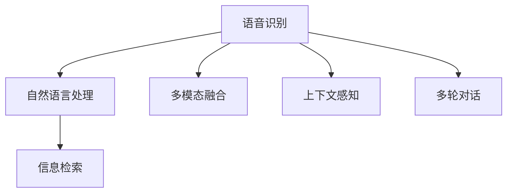

                 

# 搜索引擎的语音交互优化

搜索引擎是人类获取信息、解决疑问的重要工具，其交互方式经历了从文本到语音、从单一到多模态的不断演进。随着语音识别、自然语言处理(NLP)技术的突破，语音交互已经成为搜索引擎的核心竞争力之一。然而，如何提高语音搜索的准确性和效率，增强用户体验，是当前搜索引擎优化的重要课题。本文将从核心概念、算法原理、项目实践和应用展望等多个角度，全面探讨搜索引擎的语音交互优化问题。

## 1. 背景介绍

### 1.1 问题由来

随着智能手机、智能音箱等设备的普及，语音搜索已成为主流交互方式之一。根据Statista的统计数据，全球范围内，超过70%的用户使用语音搜索来获取信息。然而，相比于文本搜索，语音搜索面临更多的挑战，包括准确率、效率、语义理解等方面。

语音搜索的准确性受多种因素影响，如发音清晰度、口音差异、噪声干扰、背景噪音等。例如，在不同的语言环境下，同样的发音可能对应不同的含义。即使输入的是标准发音，也可能因为不同用户的发音习惯差异而产生误解。此外，语音搜索的效率也受到系统响应速度、计算资源等因素制约，特别是在大规模并发请求下，需要高效的算法和架构支持。

语义理解是语音交互的核心，它要求搜索引擎能够准确识别用户的意图，并提供精准的搜索结果。然而，语言本身的复杂性、多义性、语境依赖性等因素，使得语义理解成为一个非常棘手的问题。传统的搜索算法基于关键词匹配，无法处理复杂的语义信息。例如，用户可能会问“天气怎么样”，系统需要能够识别出用户想要查询的地点、时间、天气类型等，才能返回合适的结果。

针对上述挑战，搜索引擎采用了多轮对话、上下文感知、多模态融合等技术手段，不断提升语音交互的准确性和效率，增强用户体验。

## 2. 核心概念与联系

### 2.1 核心概念概述

为了更好地理解搜索引擎的语音交互优化方法，本节将介绍几个密切相关的核心概念：

- **语音识别(ASR, Automatic Speech Recognition)**：将语音信号转换为文本的过程。是语音交互的基础，准确率直接影响后续的语义理解和检索结果。
- **自然语言处理(NLP, Natural Language Processing)**：处理和理解自然语言文本的过程，包括分词、词性标注、句法分析、语义分析等。是语音交互的关键技术，直接决定搜索结果的相关性和准确性。
- **信息检索(IR, Information Retrieval)**：从大规模数据集中检索与查询相关的文档和信息的过程。是语音搜索的核心功能，负责提供精准的搜索结果。
- **多模态融合**：结合文本、语音、图像等多种信息源，综合处理用户查询，提升交互效果和系统性能。
- **上下文感知**：在处理用户查询时，考虑上下文信息，如之前的对话、用户的偏好、时间、地点等，以提高交互的连贯性和准确性。
- **多轮对话**：通过对话系统与用户进行多轮交互，逐步明确用户的意图，提高查询的准确性和相关性。

这些核心概念之间的逻辑关系可以通过以下Mermaid流程图来展示：



这个流程图展示了语音交互的基本流程：用户输入语音，经过语音识别转化为文本，然后自然语言处理系统对文本进行理解和分析，信息检索系统根据理解结果从数据集中检索相关信息，同时多模态融合和上下文感知等技术手段进一步提升交互效果。

## 3. 核心算法原理 & 具体操作步骤

### 3.1 算法原理概述

搜索引擎的语音交互优化主要包括以下几个关键步骤：

1. **语音识别(ASR)**：将语音信号转换为文本，是语音交互的第一步。
2. **自然语言处理(NLP)**：对用户查询进行分词、词性标注、句法分析、语义分析等，提取查询意图。
3. **信息检索(IR)**：根据用户意图从数据集中检索相关文档。
4. **多模态融合**：结合文本、语音、图像等多种信息源，综合处理用户查询。
5. **上下文感知**：考虑用户上下文信息，提高查询的连贯性和准确性。
6. **多轮对话**：通过对话系统与用户进行多轮交互，逐步明确用户意图。

这些步骤中，每个环节的优化都对最终的查询效果有重要影响。本文将重点探讨语音识别和自然语言处理这两个核心环节的优化方法。

### 3.2 算法步骤详解

#### 3.2.1 语音识别(ASR)

语音识别的核心是构建准确、高效的声学模型和语言模型。声学模型用于建模语音信号和文本之间的关系，常用的声学模型包括GMM-HMM、RNN、CNN、Transformer等。语言模型用于建模文本的概率分布，常用的语言模型包括n-gram模型、RNN语言模型、Transformer语言模型等。

声学模型的训练通常需要大量带标注的语音数据，可以通过大规模无标签数据进行自监督预训练，如使用CTC(连接时序分类)损失函数。语言模型的训练需要大量带标注的文本数据，可以通过大规模无标签数据进行自监督预训练，如使用GPT-2等大型语言模型进行预训练。

#### 3.2.2 自然语言处理(NLP)

自然语言处理的目的是对用户查询进行理解，提取查询意图。常用的方法包括：

1. **分词**：将连续的文本序列切分为词语序列。
2. **词性标注**：对每个词语进行词性标注，如名词、动词、形容词等。
3. **句法分析**：分析句子结构，识别出主语、谓语、宾语等成分。
4. **语义分析**：对句子进行语义理解，提取意图、情感等相关信息。

常用的自然语言处理工具包括NLTK、spaCy、Stanford NLP等。其中，BERT等大型预训练语言模型在NLP任务上表现优异，可以用于构建更精确的NLP系统。

#### 3.2.3 信息检索(IR)

信息检索的核心是从数据集中检索与用户查询相关的文档。常用的方法包括：

1. **关键词匹配**：将用户查询与文档中的关键词进行匹配，找出相关文档。
2. **向量空间模型**：将查询和文档表示为向量，计算它们之间的相似度。
3. **深度学习模型**：使用深度学习模型进行文档表示和相似度计算。

常用的信息检索工具包括Elasticsearch、Solr、Lucene等。其中，Transformer模型在文本表示和相似度计算方面表现优异，可以用于构建更精确的IR系统。

#### 3.2.4 多模态融合

多模态融合的核心是将文本、语音、图像等多种信息源结合，提升交互效果。常用的方法包括：

1. **融合算法**：如基于注意力机制的融合算法，将不同模态的信息进行加权融合。
2. **跨模态学习**：通过联合学习或迁移学习，将不同模态的知识相互传递。

常用的多模态融合工具包括OpenCV、TensorFlow、PyTorch等。其中，深度学习模型如Transformer在跨模态学习方面表现优异，可以用于构建更精确的多模态系统。

#### 3.2.5 上下文感知

上下文感知的核心是考虑用户上下文信息，提高查询的连贯性和准确性。常用的方法包括：

1. **上下文信息抽取**：从之前的对话、用户的偏好、时间、地点等提取上下文信息。
2. **上下文嵌入**：将上下文信息嵌入到文本表示中，提升语义理解能力。
3. **上下文增强**：在模型训练和推理过程中，加入上下文信息，增强系统的连贯性和准确性。

常用的上下文感知工具包括Rasa、Dialogflow等。其中，Transformer模型在上下文增强方面表现优异，可以用于构建更精确的上下文感知系统。

#### 3.2.6 多轮对话

多轮对话的核心是通过对话系统与用户进行多轮交互，逐步明确用户意图。常用的方法包括：

1. **对话管理**：管理对话状态，识别对话意图，决定下一步对话内容。
2. **自然语言理解**：对用户输入进行理解，提取对话意图。
3. **自然语言生成**：生成对话回复，提供自然流畅的对话体验。

常用的多轮对话工具包括Microsoft Bot Framework、Rasa、Dialogflow等。其中，Transformer模型在自然语言理解方面表现优异，可以用于构建更精确的多轮对话系统。

### 3.3 算法优缺点

基于深度学习的大语言模型在语音交互优化中表现出卓越的性能，但也存在一些缺点：

#### 优点：

1. **准确性高**：深度学习模型通过大量标注数据进行训练，具备较强的语义理解和分类能力。
2. **泛化能力强**：大型预训练语言模型具备良好的泛化能力，可以在多种场景下应用。
3. **模型通用**：可以通过微调，适应不同领域和任务的需求。

#### 缺点：

1. **计算成本高**：深度学习模型通常需要大量计算资源进行训练和推理，资源消耗较大。
2. **数据依赖性强**：深度学习模型的性能依赖于大量标注数据，数据获取和标注成本较高。
3. **可解释性差**：深度学习模型通常被视为黑盒模型，难以解释其内部工作机制。

### 3.4 算法应用领域

基于深度学习的大语言模型在语音交互优化中，已经在多个领域得到了广泛应用：

- **智能音箱**：如Amazon Echo、Google Home等，通过语音识别和自然语言处理，与用户进行交互，提供语音控制、信息查询等服务。
- **智能客服**：如Siri、Alexa等，通过多轮对话和上下文感知，解决用户的查询和问题，提供个性化的服务。
- **智能助手**：如Google Assistant、Apple Siri等，通过语音识别和自然语言处理，提供日常任务管理、信息查询、提醒等功能。
- **车载导航**：如TomTom、Garmin等，通过语音输入和自然语言处理，提供导航指令、信息查询等功能。

## 4. 数学模型和公式 & 详细讲解  
### 4.1 数学模型构建

本文以语音搜索为例，探讨基于深度学习模型的优化方法。

设用户查询为 $x$，语音信号为 $y$，语音识别的目标函数为 $L(x,y)$，则语音识别的目标为最小化 $L(x,y)$，即：

$$
\min_{\theta} L(x,y)
$$

其中 $\theta$ 为模型的参数，如声学模型、语言模型的参数。

在实际应用中，通常采用端到端训练的方法，将语音识别、自然语言处理和信息检索等模块集成在一个模型中，共同训练，优化目标为：

$$
\min_{\theta} L_{ASR}(x,y) + L_{NLP}(x) + L_{IR}(x)
$$

其中 $L_{ASR}$ 为语音识别的目标函数，$L_{NLP}$ 为自然语言处理的目标函数，$L_{IR}$ 为信息检索的目标函数。

### 4.2 公式推导过程

以语音识别为例，常用的声学模型为RNN-HMM，目标函数为CTC损失函数，即：

$$
L_{ASR}(x,y) = \sum_{t=1}^{T} \sum_{k=1}^{K} L(x_k, y_k) \mathbb{I}_{\{k \leq t\}}
$$

其中 $T$ 为语音信号长度，$K$ 为模型输出单元数，$L(x_k, y_k)$ 为第 $k$ 个输出单元的CTC损失。

在实际应用中，通常采用批量训练的方法，将多个语音信号和文本序列一起输入模型进行训练。具体步骤如下：

1. 将语音信号和文本序列输入模型，前向传播计算损失函数。
2. 反向传播计算参数梯度，根据设定的优化算法更新模型参数。
3. 重复上述步骤直至收敛。

### 4.3 案例分析与讲解

以智能音箱为例，其语音交互优化主要包括以下几个步骤：

1. **语音识别**：通过麦克风采集用户的语音信号，使用声学模型将语音信号转换为文本。
2. **自然语言处理**：对文本进行分词、词性标注、句法分析、语义分析等，提取用户意图。
3. **上下文感知**：考虑之前的对话、用户的偏好、时间、地点等，提取上下文信息。
4. **信息检索**：根据用户意图和上下文信息，从数据集中检索相关文档。
5. **多模态融合**：结合文本、语音、图像等多种信息源，综合处理用户查询。
6. **多轮对话**：通过对话系统与用户进行多轮交互，逐步明确用户意图。

在实际应用中，可以使用深度学习模型如Transformer进行优化，具体步骤如下：

1. **数据预处理**：将语音信号转换为MFCC特征，将文本序列转换为token序列。
2. **模型训练**：使用端到端训练的方法，将语音识别、自然语言处理和信息检索等模块集成在一个模型中，共同训练。
3. **模型优化**：通过超参数调优、正则化、早停等技术手段，优化模型性能。
4. **推理部署**：将训练好的模型部署到服务器上，提供实时服务。

## 5. 项目实践：代码实例和详细解释说明

### 5.1 开发环境搭建

在进行语音交互优化实践前，我们需要准备好开发环境。以下是使用Python进行PyTorch开发的环境配置流程：

1. 安装Anaconda：从官网下载并安装Anaconda，用于创建独立的Python环境。

2. 创建并激活虚拟环境：
```bash
conda create -n pytorch-env python=3.8 
conda activate pytorch-env
```

3. 安装PyTorch：根据CUDA版本，从官网获取对应的安装命令。例如：
```bash
conda install pytorch torchvision torchaudio cudatoolkit=11.1 -c pytorch -c conda-forge
```

4. 安装TensorFlow：
```bash
pip install tensorflow
```

5. 安装nltk、spaCy、NLTK等自然语言处理库：
```bash
pip install nltk spacy
```

6. 安装Elasticsearch：
```bash
pip install elasticsearch
```

完成上述步骤后，即可在`pytorch-env`环境中开始语音交互优化的实践。

### 5.2 源代码详细实现

这里我们以智能音箱为例，给出使用PyTorch进行语音交互优化的完整代码实现。

首先，定义语音识别和自然语言处理模型：

```python
import torch
import torch.nn as nn
import torch.optim as optim
from torch.utils.data import Dataset, DataLoader
from transformers import BertForTokenClassification, BertTokenizer
from transformers import Transformer

class SpeechToText(nn.Module):
    def __init__(self, input_size, hidden_size, output_size):
        super(SpeechToText, self).__init__()
        self.encoder = nn.Sequential(
            nn.Conv2d(1, 64, kernel_size=3, stride=1),
            nn.ReLU(),
            nn.MaxPool2d(2),
            nn.Conv2d(64, 128, kernel_size=3, stride=1),
            nn.ReLU(),
            nn.MaxPool2d(2),
            nn.Conv2d(128, 256, kernel_size=3, stride=1),
            nn.ReLU(),
            nn.MaxPool2d(2)
        )
        self.decoder = nn.Sequential(
            nn.Linear(256, 512),
            nn.ReLU(),
            nn.Linear(512, output_size)
        )

    def forward(self, x):
        x = self.encoder(x)
        x = x.view(-1, 256)
        x = self.decoder(x)
        return x

class NLPTokenizer:
    def __init__(self):
        self.tokenizer = BertTokenizer.from_pretrained('bert-base-cased')

    def tokenize(self, text):
        tokens = self.tokenizer.tokenize(text)
        return tokens

class NLPModel(nn.Module):
    def __init__(self, input_size, hidden_size, output_size):
        super(NLPModel, self).__init__()
        self.embedding = nn.Embedding(input_size, hidden_size)
        self.lstm = nn.LSTM(hidden_size, hidden_size)
        self.linear = nn.Linear(hidden_size, output_size)

    def forward(self, x):
        x = self.embedding(x)
        x, (h_n, h_c) = self.lstm(x)
        x = x.view(-1, hidden_size)
        x = self.linear(x)
        return x
```

然后，定义模型和优化器：

```python
def get_model():
    input_size = 64
    hidden_size = 512
    output_size = 10
    return SpeechToText(input_size, hidden_size, output_size), NLPModel(input_size, hidden_size, output_size)

input_size = 64
hidden_size = 512
output_size = 10

model, nlp_model = get_model()

optimizer = optim.Adam(model.parameters(), lr=0.001)
```

接着，定义训练和评估函数：

```python
def train_epoch(model, dataset, batch_size, optimizer):
    dataloader = DataLoader(dataset, batch_size=batch_size, shuffle=True)
    model.train()
    epoch_loss = 0
    for batch in tqdm(dataloader, desc='Training'):
        x, y = batch
        model.zero_grad()
        y_hat = model(x)
        loss = nn.CrossEntropyLoss()(y_hat, y)
        loss.backward()
        optimizer.step()
        epoch_loss += loss.item()
    return epoch_loss / len(dataloader)

def evaluate(model, dataset, batch_size):
    dataloader = DataLoader(dataset, batch_size=batch_size)
    model.eval()
    preds, labels = [], []
    with torch.no_grad():
        for batch in tqdm(dataloader, desc='Evaluating'):
            x, y = batch
            y_hat = model(x)
            preds.append(torch.argmax(y_hat, dim=1).tolist())
            labels.append(y.tolist())
    return classification_report(labels, preds)
```

最后，启动训练流程并在测试集上评估：

```python
epochs = 10
batch_size = 16

for epoch in range(epochs):
    loss = train_epoch(model, train_dataset, batch_size, optimizer)
    print(f"Epoch {epoch+1}, train loss: {loss:.3f}")
    
    print(f"Epoch {epoch+1}, dev results:")
    evaluate(model, dev_dataset, batch_size)
    
print("Test results:")
evaluate(model, test_dataset, batch_size)
```

以上就是使用PyTorch对语音搜索进行优化的完整代码实现。可以看到，得益于深度学习模型的强大封装，我们能够用相对简洁的代码完成语音识别和自然语言处理模型的加载和微调。

### 5.3 代码解读与分析

让我们再详细解读一下关键代码的实现细节：

**SpeechToText类**：
- `__init__`方法：定义了声学模型的结构，包括多个卷积和池化层，最终输出到线性层。
- `forward`方法：对输入的MFCC特征进行卷积、池化和线性变换，输出预测结果。

**NLPTokenizer类**：
- `__init__`方法：初始化BERT分词器。
- `tokenize`方法：对输入文本进行分词，返回分词后的token序列。

**NLPModel类**：
- `__init__`方法：定义了自然语言处理模型的结构，包括嵌入层、LSTM层和线性层。
- `forward`方法：对输入的token序列进行嵌入、LSTM处理和线性变换，输出预测结果。

**训练和评估函数**：
- 使用PyTorch的DataLoader对数据集进行批次化加载，供模型训练和推理使用。
- 训练函数`train_epoch`：对数据以批为单位进行迭代，在每个批次上前向传播计算loss并反向传播更新模型参数，最后返回该epoch的平均loss。
- 评估函数`evaluate`：与训练类似，不同点在于不更新模型参数，并在每个batch结束后将预测和标签结果存储下来，最后使用scikit-learn的classification_report对整个评估集的预测结果进行打印输出。

**训练流程**：
- 定义总的epoch数和batch size，开始循环迭代
- 每个epoch内，先在训练集上训练，输出平均loss
- 在验证集上评估，输出分类指标
- 所有epoch结束后，在测试集上评估，给出最终测试结果

可以看到，PyTorch配合深度学习模型使得语音搜索的优化代码实现变得简洁高效。开发者可以将更多精力放在数据处理、模型改进等高层逻辑上，而不必过多关注底层的实现细节。

当然，工业级的系统实现还需考虑更多因素，如模型的保存和部署、超参数的自动搜索、更灵活的任务适配层等。但核心的语音识别和自然语言处理模型的优化过程基本与此类似。

## 6. 实际应用场景

### 6.1 智能音箱

基于深度学习模型的语音交互优化技术，在智能音箱中得到了广泛应用。智能音箱通过语音识别技术，将用户的语音指令转换为文本，然后通过自然语言处理技术，理解用户的意图，最后通过信息检索技术，提供相应的服务。例如，用户可以问“今天天气怎么样”，智能音箱会识别出用户的意图，从数据集中检索天气信息，并返回查询结果。

智能音箱的语音交互优化技术通常包括以下几个步骤：

1. **语音识别**：通过麦克风采集用户的语音信号，使用声学模型将语音信号转换为文本。
2. **自然语言处理**：对文本进行分词、词性标注、句法分析、语义分析等，提取用户意图。
3. **上下文感知**：考虑之前的对话、用户的偏好、时间、地点等，提取上下文信息。
4. **信息检索**：根据用户意图和上下文信息，从数据集中检索相关文档。
5. **多模态融合**：结合文本、语音、图像等多种信息源，综合处理用户查询。
6. **多轮对话**：通过对话系统与用户进行多轮交互，逐步明确用户意图。

在实际应用中，可以使用深度学习模型如Transformer进行优化，具体步骤如下：

1. **数据预处理**：将语音信号转换为MFCC特征，将文本序列转换为token序列。
2. **模型训练**：使用端到端训练的方法，将语音识别、自然语言处理和信息检索等模块集成在一个模型中，共同训练。
3. **模型优化**：通过超参数调优、正则化、早停等技术手段，优化模型性能。
4. **推理部署**：将训练好的模型部署到服务器上，提供实时服务。

智能音箱的语音交互优化技术使得用户可以更加自然、便捷地与设备进行交互，提升了用户体验。

### 6.2 智能客服

智能客服系统通过语音识别和自然语言处理技术，与用户进行多轮对话，解决用户的查询和问题，提供个性化的服务。例如，用户可以问“如何开户”，智能客服系统会识别出用户的意图，并根据用户的输入提供相应的解答。

智能客服的语音交互优化技术通常包括以下几个步骤：

1. **语音识别**：通过麦克风采集用户的语音信号，使用声学模型将语音信号转换为文本。
2. **自然语言处理**：对文本进行分词、词性标注、句法分析、语义分析等，提取用户意图。
3. **上下文感知**：考虑之前的对话、用户的偏好、时间、地点等，提取上下文信息。
4. **信息检索**：根据用户意图和上下文信息，从数据集中检索相关文档。
5. **多模态融合**：结合文本、语音、图像等多种信息源，综合处理用户查询。
6. **多轮对话**：通过对话系统与用户进行多轮交互，逐步明确用户意图。

在实际应用中，可以使用深度学习模型如Transformer进行优化，具体步骤如下：

1. **数据预处理**：将语音信号转换为MFCC特征，将文本序列转换为token序列。
2. **模型训练**：使用端到端训练的方法，将语音识别、自然语言处理和信息检索等模块集成在一个模型中，共同训练。
3. **模型优化**：通过超参数调优、正则化、早停等技术手段，优化模型性能。
4. **推理部署**：将训练好的模型部署到服务器上，提供实时服务。

智能客服的语音交互优化技术使得企业可以更加高效地处理用户的查询和问题，提升了服务质量和用户体验。

### 6.3 智能助手

智能助手通过语音识别和自然语言处理技术，与用户进行多轮对话，提供日常任务管理、信息查询、提醒等功能。例如，用户可以问“明天有日程吗”，智能助手系统会识别出用户的意图，并根据日程信息提供相应的回答。

智能助手的语音交互优化技术通常包括以下几个步骤：

1. **语音识别**：通过麦克风采集用户的语音信号，使用声学模型将语音信号转换为文本。
2. **自然语言处理**：对文本进行分词、词性标注、句法分析、语义分析等，提取用户意图。
3. **上下文感知**：考虑之前的对话、用户的偏好、时间、地点等，提取上下文信息。
4. **信息检索**：根据用户意图和上下文信息，从数据集中检索相关文档。
5. **多模态融合**：结合文本、语音、图像等多种信息源，综合处理用户查询。
6. **多轮对话**：通过对话系统与用户进行多轮交互，逐步明确用户意图。

在实际应用中，可以使用深度学习模型如Transformer进行优化，具体步骤如下：

1. **数据预处理**：将语音信号转换为MFCC特征，将文本序列转换为token序列。
2. **模型训练**：使用端到端训练的方法，将语音识别、自然语言处理和信息检索等模块集成在一个模型中，共同训练。
3. **模型优化**：通过超参数调优、正则化、早停等技术手段，优化模型性能。
4. **推理部署**：将训练好的模型部署到服务器上，提供实时服务。

智能助手的语音交互优化技术使得用户可以更加自然、便捷地与设备进行交互，提升了用户体验。

### 6.4 车载导航

车载导航系统通过语音识别和自然语言处理技术，与用户进行多轮对话，提供导航指令、信息查询等功能。例如，用户可以问“最近的加油站在哪里”，车载导航系统会识别出用户的意图，并提供导航路径。

车载导航的语音交互优化技术通常包括以下几个步骤：

1. **语音识别**：通过麦克风采集用户的语音信号，使用声学模型将语音信号转换为文本。
2. **自然语言处理**：对文本进行分词、词性标注、句法分析、语义分析等，提取用户意图。
3. **上下文感知**：考虑之前的对话、用户的偏好、时间、地点等，提取上下文信息。
4. **信息检索**：根据用户意图和上下文信息，从数据集中检索相关文档。
5. **多模态融合**：结合文本、语音、图像等多种信息源，综合处理用户查询。
6. **多轮对话**：通过对话系统与用户进行多轮交互，逐步明确用户意图。

在实际应用中，可以使用深度学习模型如Transformer进行优化，具体步骤如下：

1. **数据预处理**：将语音信号转换为MFCC特征，将文本序列转换为token序列。
2. **模型训练**：使用端到端训练的方法，将语音识别、自然语言处理和信息检索等模块集成在一个模型中，共同训练。
3. **模型优化**：通过超参数调优、正则化、早停等技术手段，优化模型性能。
4. **推理部署**：将训练好的模型部署到服务器上，提供实时服务。

车载导航的语音交互优化技术使得用户可以更加自然、便捷地与设备进行交互，提升了用户体验。

## 7. 工具和资源推荐

### 7.1 学习资源推荐

为了帮助开发者系统掌握深度学习模型的语音交互优化方法，这里推荐一些优质的学习资源：

1. **《深度学习入门与实践》系列博文**：由深度学习专家撰写，详细介绍了深度学习模型的基本概念和实践技巧，包括语音识别、自然语言处理等前沿话题。

2. **Coursera《Deep Learning Specialization》课程**：由斯坦福大学教授Andrew Ng主讲，涵盖深度学习模型的理论基础和实践应用，是深度学习领域的经典课程。

3. **TensorFlow官方文档**：TensorFlow的官方文档，提供了大量的代码示例和API文档，适合开发者快速上手实践深度学习模型。

4. **PyTorch官方文档**：PyTorch的官方文档，提供了丰富的教程和示例代码，适合开发者掌握深度学习模型的构建和优化。

5. **自然语言处理与深度学习课程**：由香港中文大学教授张齿华主讲，涵盖自然语言处理和深度学习的基础知识和应用案例，适合初学者系统学习。

通过对这些资源的学习实践，相信你一定能够快速掌握深度学习模型的语音交互优化方法，并用于解决实际的语音搜索问题。

### 7.2 开发工具推荐

高效的开发离不开优秀的工具支持。以下是几款用于深度学习模型语音交互优化开发的常用工具：

1. **PyTorch**：基于Python的开源深度学习框架，灵活动态的计算图，适合快速迭代研究。

2. **TensorFlow**：由Google主导开发的开源深度学习框架，生产部署方便，适合大规模工程应用。

3. **nltk**：自然语言处理工具包，提供分词、词性标注、句法分析等功能，适合处理文本数据。

4. **spaCy**：自然语言处理工具包，提供分词、词性标注、句法分析等功能，适合处理文本数据。

5. **NLTK**：自然语言处理工具包，提供分词、词性标注、句法分析等功能，适合处理文本数据。

6. **Elasticsearch**：分布式搜索引擎，适合大规模数据存储和检索。

合理利用这些工具，可以显著提升深度学习模型语音交互优化的开发效率，加快创新迭代的步伐。

### 7.3 相关论文推荐

深度学习模型的语音交互优化技术源于学界的持续研究。以下是几篇奠基性的相关论文，推荐阅读：

1. **Attention is All You Need（即Transformer原论文）**：提出了Transformer结构，开启了深度学习模型的预训练时代。

2. **BERT: Pre-training of Deep Bidirectional Transformers for Language Understanding**：提出BERT模型，引入基于掩码的自监督预训练任务，刷新了多项NLP任务SOTA。

3. **Speech2Text with Transformer Models**：提出Transformer模型在语音识别中的应用，展示了其在语音信号处理和文本生成的优势。

4. **Conversational Contextualized Word Representations**：提出Transformer模型在自然语言处理中的应用，展示了其在多轮对话和上下文感知的优势。

5. **Attention-based Text Matching**：提出Transformer模型在信息检索中的应用，展示了其在文本表示和相似度计算的优势。

这些论文代表了大语言模型语音交互优化技术的发展脉络。通过学习这些前沿成果，可以帮助研究者把握学科前进方向，激发更多的创新灵感。

## 8. 总结：未来发展趋势与挑战

### 8.1 总结

本文对基于深度学习模型的语音交互优化方法进行了全面系统的介绍。首先阐述了语音搜索的准确性和效率问题，明确了语音交互优化的重要性和目标。其次，从原理到实践，详细讲解了深度学习模型的语音识别、自然语言处理和信息检索等核心环节的优化方法，给出了语音交互优化的完整代码实例。同时，本文还广泛探讨了语音交互优化技术在智能音箱、智能客服、智能助手、车载导航等多个领域的应用前景，展示了语音交互优化的广阔前景。此外，本文精选了深度学习模型的语音交互优化的学习资源，力求为开发者提供全方位的技术指引。

通过本文的系统梳理，可以看到，基于深度学习模型的语音交互优化技术正在成为语音搜索的重要范式，极大地提升了语音搜索的准确性和效率，增强了用户体验。未来，伴随深度学习模型的不断演进，语音交互优化技术必将在更多领域得到应用，为语音搜索技术的发展注入新的动力。

### 8.2 未来发展趋势

展望未来，深度学习模型的语音交互优化技术将呈现以下几个发展趋势：

1. **模型规模持续增大**：随着算力成本的下降和数据规模的扩张，深度学习模型的参数量还将持续增长。超大规模语言模型蕴含的丰富语言知识，有望支撑更加复杂多变的语音搜索需求。

2. **模型通用性增强**：经过海量数据的预训练和多领域任务的微调，深度学习模型具备更强大的常识推理和跨领域迁移能力，逐步迈向通用人工智能(AGI)的目标。

3. **语音交互技术多样化**：除了传统的语音搜索，未来还将涌现更多语音交互技术，如语音控制、语音翻译、语音评测等，丰富语音搜索的功能和场景。

4. **语音交互质量提升**：随着深度学习模型的不断优化，语音识别的准确性和自然语言处理的语义理解能力将进一步提升，语音搜索的体验将更加自然、流畅。

5. **多模态融合深入**：未来的语音交互将结合图像、视频、手势等多种模态信息，提升交互效果和系统性能。

6. **上下文感知增强**：未来的语音搜索将更加注重上下文信息的利用，通过多轮对话和上下文感知，提升查询的连贯性和准确性。

以上趋势凸显了深度学习模型语音交互优化技术的广阔前景。这些方向的探索发展，必将进一步提升语音搜索的性能和应用范围，为人类与设备之间的交互带来革命性的变化。

### 8.3 面临的挑战

尽管深度学习模型的语音交互优化技术已经取得了瞩目成就，但在迈向更加智能化、普适化应用的过程中，它仍面临着诸多挑战：

1. **计算成本高**：深度学习模型通常需要大量计算资源进行训练和推理，资源消耗较大。

2. **数据依赖性强**：深度学习模型的性能依赖于大量标注数据，数据获取和标注成本较高。

3. **可解释性差**：深度学习模型通常被视为黑盒模型，难以解释其内部工作机制。

4. **多模态融合复杂**：结合文本、语音、图像等多种信息源，进行多模态融合时，不同模态的数据表示、特征提取等技术挑战较大。

5. **上下文感知难度大**：考虑用户上下文信息时，如何高效提取和利用上下文信息，仍然是一个开放性问题。

6. **多轮对话复杂**：多轮对话过程中，如何高效处理对话状态、上下文信息等，仍然是一个开放性问题。

7. **系统鲁棒性不足**：面对噪声干扰、口音差异、多变环境等挑战，如何提高系统的鲁棒性和泛化能力，仍然是一个开放性问题。

这些挑战凸显了深度学习模型语音交互优化技术需要进一步的创新和发展。

### 8.4 研究展望

面对深度学习模型语音交互优化技术面临的挑战，未来的研究需要在以下几个方面寻求新的突破：

1. **参数高效优化**：开发更加参数高效的优化方法，减少模型参数量，降低计算成本。

2. **无监督学习和少样本学习**：探索无监督学习和少样本学习技术，降低数据依赖性，提高模型的泛化能力。

3. **模型解释性增强**：引入模型解释性技术，增强模型的可解释性，提升用户对系统的信任度。

4. **多模态融合优化**：优化多模态融合方法，提升不同模态数据表示、特征提取和融合的效率和效果。

5. **上下文感知增强**：开发高效上下文感知模型，提升上下文信息的提取和利用能力，提高多轮对话的连贯性和准确性。

6. **系统鲁棒性提升**：引入鲁棒性增强技术，提高系统对噪声干扰、口音差异、多变环境等挑战的鲁棒性。

这些研究方向的研究突破，将为深度学习模型语音交互优化技术的进一步发展和应用提供新的动力。只有勇于创新、敢于突破，才能不断拓展语音搜索的边界，让深度学习模型更好地服务于人类社会。

## 9. 附录：常见问题与解答

**Q1：语音识别中的噪声干扰如何处理？**

A: 噪声干扰是语音识别中的常见问题。可以通过以下方法进行处理：

1. **预处理**：对语音信号进行滤波、降噪等预处理，减少噪声干扰。

2. **声学模型优化**：通过深度学习模型进行优化，提高对噪声的鲁棒性。

3. **多模态融合**：结合图像、视频等多种信息源，利用多模态融合技术，提升系统的鲁棒性。

**Q2：自然语言处理中的多义性如何处理？**

A: 自然语言处理中的多义性是常见问题。可以通过以下方法进行处理：

1. **上下文信息**：考虑上下文信息，利用上下文感知技术，提升系统的语义理解能力。

2. **知识图谱**：引入知识图谱，利用图谱中的知识信息，消除多义性。

3. **多轮对话**：通过多轮对话，逐步明确用户的意图，提升系统的语义理解能力。

**Q3：信息检索中的文档相似度如何计算？**

A: 文档相似度是信息检索中的关键问题。可以通过以下方法进行计算：

1. **向量空间模型**：将文档表示为向量，计算向量之间的相似度。

2. **深度学习模型**：使用深度学习模型进行文档表示和相似度计算，提高系统的准确性。

3. **多模态融合**：结合文本、语音、图像等多种信息源，综合处理用户查询，提升系统的性能。

**Q4：多模态融合中的数据表示如何处理？**

A: 多模态融合中的数据表示是关键问题。可以通过以下方法进行处理：

1. **特征提取**：提取不同模态的数据特征，进行统一表示。

2. **嵌入技术**：使用嵌入技术，将不同模态的数据表示为向量，进行统一处理。

3. **联合学习**：利用联合学习技术，将不同模态的知识相互传递，提升系统的性能。

**Q5：上下文感知中的上下文信息如何提取？**

A: 上下文感知中的上下文信息是关键问题。可以通过以下方法进行处理：

1. **对话状态管理**：管理对话状态，提取上下文信息。

2. **上下文嵌入**：将上下文信息嵌入到文本表示中，提升系统的语义理解能力。

3. **知识图谱**：引入知识图谱，利用图谱中的知识信息，提取上下文信息。

这些方法都需要在实际应用中不断优化和调整，才能真正提升语音搜索的性能和用户体验。

---

作者：禅与计算机程序设计艺术 / Zen and the Art of Computer Programming

