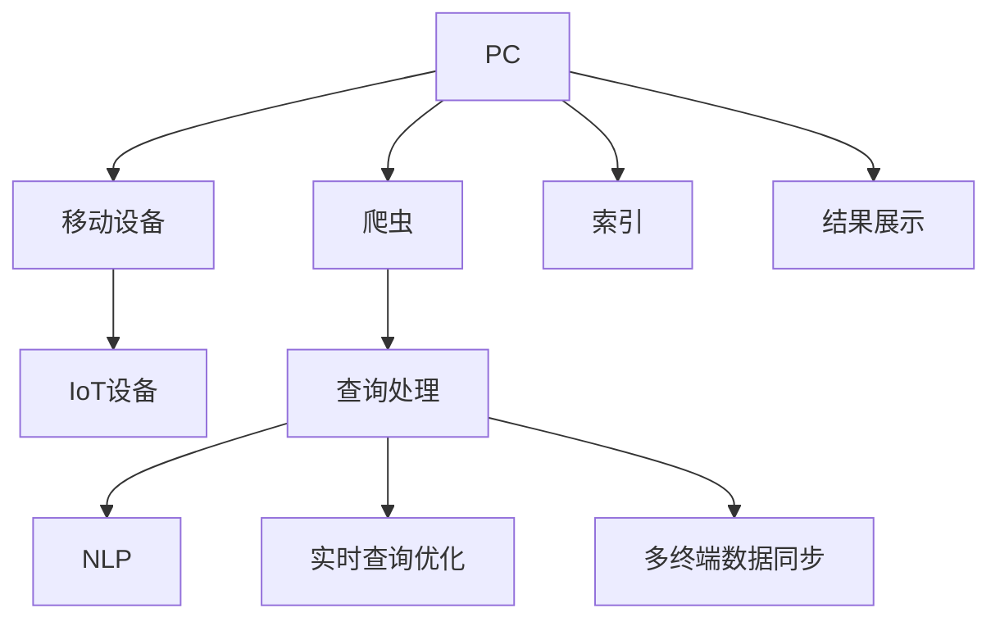

                 

# 搜索引擎的跨平台整合：PC、移动和IoT设备

> 关键词：搜索引擎、跨平台整合、PC、移动设备、IoT设备、统一用户体验、多终端数据同步、自然语言处理、实时查询优化

## 1. 背景介绍

随着互联网的普及，搜索引擎已经成为人们日常生活中不可或缺的工具。无论是PC端、移动端还是IoT设备，都离不开搜索引擎的帮助。然而，由于各终端设备间的差异性，用户在不同平台上的搜索体验存在较大差距。为了提供更加无缝的搜索体验，搜索引擎必须实现跨平台整合，让用户在任何设备上都能获得一致的搜索结果和互动体验。

本博客将详细探讨搜索引擎跨平台整合的原理、技术和挑战，从数学模型、算法优化、项目实践和未来展望等多个方面进行深入分析。希望通过本文的介绍，能够帮助读者理解搜索引擎跨平台整合的技术内涵，并为实际开发和应用提供参考。

## 2. 核心概念与联系

### 2.1 核心概念概述

为更好地理解搜索引擎的跨平台整合，本节将介绍几个关键概念及其相互关系。

- **搜索引擎(Search Engine)**：通过爬虫和索引技术，从互联网上收集和处理数据，使用户能够快速获取相关信息的应用程序。搜索引擎的核心组件包括爬虫、索引、查询处理和结果展示等。

- **跨平台整合(Cross-Platform Integration)**：将搜索引擎的服务和功能，扩展到多个设备和操作系统中，实现统一的用户体验和数据同步。

- **PC(个人电脑)**：以桌面操作系统为主，具备高计算能力、大屏幕显示和丰富应用的设备。

- **移动设备(Mobile Device)**：以操作系统为主，支持触屏输入，方便携带，如智能手机、平板电脑等。

- **IoT设备(IoT Device)**：通过互联网连接，具备智能控制和数据收集能力的设备，如智能家居、智能穿戴等。

- **统一用户体验(Unified User Experience)**：在多个平台上提供一致的搜索界面、操作逻辑和信息展示，使用户能够在不同设备上获得相似的使用体验。

- **多终端数据同步(Multidevice Data Synchronization)**：在多个设备间同步用户的搜索历史、设置和偏好，确保数据的一致性。

- **自然语言处理(Natural Language Processing, NLP)**：利用计算机技术处理和理解人类语言，搜索引擎中常用以解析查询意图和优化搜索结果。

- **实时查询优化(Real-time Query Optimization)**：根据用户的历史行为和实时数据，动态调整搜索结果和展示方式，提升用户体验。

### 2.2 核心概念原理和架构的 Mermaid 流程图



上述流程图示意了搜索引擎的基本工作流程及其跨平台整合的主要环节。通过爬虫获取数据、索引存储数据、查询处理理解查询、结果展示输出信息、NLP解析用户意图、实时查询优化调整结果、多终端数据同步更新状态，从而在多个平台上提供一致的用户体验。

## 3. 核心算法原理 & 具体操作步骤

### 3.1 算法原理概述

搜索引擎的跨平台整合主要涉及数据同步、用户意图解析和查询优化三个核心算法。这些算法通过在大规模语料库上训练和优化，能够提升搜索引擎的搜索准确度和用户体验。

- **数据同步算法**：实现用户数据在不同设备间的同步，确保用户的搜索历史、偏好和设置一致。

- **用户意图解析算法**：利用NLP技术，解析用户的查询意图，理解用户的真实需求，从而更精准地匹配结果。

- **查询优化算法**：通过实时数据分析和用户行为预测，动态调整查询结果的排序和展示方式，提升用户体验。

### 3.2 算法步骤详解

#### 3.2.1 数据同步算法

数据同步算法主要包括以下几个步骤：

1. **数据收集**：从PC、移动和IoT设备中收集用户的搜索历史、偏好设置等数据。
2. **数据归一化**：将不同设备格式的数据转换为统一的格式，以便于后续处理。
3. **数据存储**：将归一化后的数据存储在分布式数据库中，支持高并发读写。
4. **数据同步**：根据用户的登录状态和设备类型，实现数据在不同设备间的同步更新。

#### 3.2.2 用户意图解析算法

用户意图解析算法主要包括以下几个步骤：

1. **意图分类**：利用机器学习算法对用户查询进行意图分类，如查询意图是浏览、购买、联系等。
2. **实体识别**：通过NLP技术识别查询中的实体信息，如人名、地名、产品名等。
3. **意图解析**：结合上下文信息和历史行为，解析用户的真实意图，生成更准确的查询结果。

#### 3.2.3 查询优化算法

查询优化算法主要包括以下几个步骤：

1. **历史数据分析**：分析用户的历史行为数据，了解用户的兴趣和偏好。
2. **实时数据采集**：采集当前用户的操作数据和上下文信息，实时调整查询结果。
3. **结果排序优化**：根据用户的意图和历史数据，动态调整搜索结果的排序。
4. **展示方式优化**：根据设备特性和用户偏好，优化搜索结果的展示方式。

### 3.3 算法优缺点

搜索引擎跨平台整合的算法具有以下优点：

1. **一致性**：确保用户在不同设备上获得一致的搜索体验，提升用户满意度。
2. **数据同步**：实现跨设备数据同步，减少用户操作负担，提升搜索效率。
3. **实时优化**：通过实时数据分析和用户行为预测，动态调整搜索结果，提升用户体验。

同时，该算法也存在一些局限性：

1. **数据隐私**：在数据同步过程中，用户的隐私数据可能被泄露，需要采取严格的隐私保护措施。
2. **设备兼容性**：不同设备的操作系统和应用环境不同，可能导致算法效果差异。
3. **网络延迟**：跨设备同步数据需要网络支持，网络延迟可能会影响用户体验。
4. **算法复杂性**：用户意图解析和查询优化涉及复杂的算法，实现难度较大。

### 3.4 算法应用领域

搜索引擎的跨平台整合技术，已经广泛应用于以下领域：

- **电子商务**：帮助用户在不同设备上浏览和购买商品，实现无缝购物体验。
- **智能家居**：通过语音搜索智能家居设备，控制家电和环境，提升生活便利性。
- **旅游服务**：提供多设备一致的旅游信息查询和预订服务，提升旅行体验。
- **健康医疗**：整合不同设备上的健康数据，提供个性化的医疗服务，提升健康管理效果。
- **金融服务**：支持跨设备金融交易和信息查询，提升金融服务的便利性和安全性。

## 4. 数学模型和公式 & 详细讲解 & 举例说明

### 4.1 数学模型构建

搜索引擎的跨平台整合涉及多个数学模型，本节将详细介绍其中几个关键模型。

#### 4.1.1 用户意图分类模型

用户意图分类模型使用机器学习算法对用户查询进行分类，常见的分类算法包括朴素贝叶斯、支持向量机、随机森林等。假设训练数据集为 $D=\{(x_i, y_i)\}_{i=1}^N$，其中 $x_i$ 为查询文本，$y_i$ 为意图类别，$y_i \in \{C_1, C_2, ..., C_k\}$，模型通过最大化似然函数进行训练：

$$
\max_{\theta} \sum_{i=1}^N \log P(y_i|x_i;\theta)
$$

其中 $P(y_i|x_i;\theta)$ 表示在模型 $\theta$ 下，查询 $x_i$ 属于类别 $y_i$ 的概率，可以利用softmax函数计算。

#### 4.1.2 实体识别模型

实体识别模型使用命名实体识别(Named Entity Recognition, NER)技术，识别查询中的实体信息。假设实体类别集合为 $T=\{T_1, T_2, ..., T_m\}$，模型通过标注数据集 $D=\{(x_i, t_i)\}_{i=1}^N$ 训练，其中 $t_i$ 为查询中实体 $x_i$ 的类别，模型最小化交叉熵损失函数：

$$
\min_{\theta} \frac{1}{N} \sum_{i=1}^N \sum_{t \in T} |t_i \neq t| \log \frac{\hat{P}(t|x_i;\theta)}{1-\hat{P}(t|x_i;\theta)}
$$

其中 $\hat{P}(t|x_i;\theta)$ 表示在模型 $\theta$ 下，查询 $x_i$ 中实体 $t$ 的概率，可以利用CRF(条件随机场)或BiLSTM-CRF模型进行训练。

### 4.2 公式推导过程

#### 4.2.1 用户意图分类模型的推导

以朴素贝叶斯分类器为例，推导用户意图分类模型的公式。假设查询文本 $x$ 属于类别 $C_j$ 的概率为 $P(x|C_j;\theta)$，则分类器预测 $x$ 属于 $C_j$ 类别的概率为：

$$
P(y_j|x;\theta) = \frac{P(x|C_j;\theta)P(C_j;\theta)}{\sum_{l=1}^k P(x|C_l;\theta)P(C_l;\theta)}
$$

其中 $P(C_j;\theta)$ 表示类别 $C_j$ 的概率，通过训练数据集中的类别出现次数进行估计。

#### 4.2.2 实体识别模型的推导

以BiLSTM-CRF模型为例，推导实体识别模型的公式。假设查询文本 $x$ 中实体 $t$ 属于类别 $T_i$ 的概率为 $P(t|x;\theta)$，则模型通过标注数据集 $D=\{(x_i, t_i)\}_{i=1}^N$ 训练，最小化交叉熵损失函数：

$$
\min_{\theta} \frac{1}{N} \sum_{i=1}^N \sum_{t \in T} |t_i \neq t| \log \frac{\hat{P}(t|x_i;\theta)}{1-\hat{P}(t|x_i;\theta)}
$$

其中 $\hat{P}(t|x_i;\theta)$ 表示在模型 $\theta$ 下，查询 $x_i$ 中实体 $t$ 的概率，可以利用BiLSTM-CRF模型进行训练。

### 4.3 案例分析与讲解

以电商平台的跨平台搜索为例，展示搜索引擎跨平台整合的实际应用。

假设用户小明在PC端浏览并保存了多个商品信息，然后在移动设备上通过语音搜索购买某商品。此时，搜索系统需要根据小明的搜索历史和偏好，返回最相关的商品信息。具体步骤如下：

1. **数据同步**：首先，搜索系统从PC和移动设备中同步小明的历史搜索记录和偏好设置。
2. **意图分类**：然后，系统通过NLP技术解析小明的语音查询，进行意图分类，确定小明是希望浏览商品、查询商品信息还是直接购买商品。
3. **实体识别**：接着，系统识别语音查询中的商品名称、价格等信息，提取实体信息。
4. **查询优化**：最后，系统根据小明的意图和实体信息，动态调整搜索结果，返回最相关的商品列表。

## 5. 项目实践：代码实例和详细解释说明

### 5.1 开发环境搭建

进行搜索引擎跨平台整合的项目实践，首先需要搭建开发环境。以下是使用Python进行Flask框架开发的环境配置流程：

1. **安装Anaconda**：从官网下载并安装Anaconda，用于创建独立的Python环境。

2. **创建并激活虚拟环境**：
```bash
conda create -n search-env python=3.8 
conda activate search-env
```

3. **安装Flask**：
```bash
pip install flask
```

4. **安装Web框架**：
```bash
pip install flask-wtf flask-login flask-migrate
```

5. **安装数据库**：
```bash
pip install flask-sqlalchemy
```

完成上述步骤后，即可在`search-env`环境中开始项目实践。

### 5.2 源代码详细实现

下面是使用Flask框架进行跨平台搜索的代码实现。

首先，定义用户模型：

```python
from flask_sqlalchemy import SQLAlchemy
from flask_login import UserMixin

db = SQLAlchemy()

class User(db.Model, UserMixin):
    id = db.Column(db.Integer, primary_key=True)
    username = db.Column(db.String(50), unique=True, nullable=False)
    password = db.Column(db.String(100), nullable=False)
```

然后，定义数据库连接和用户认证：

```python
from flask import Flask, render_template, request, redirect, url_for
from flask_login import LoginManager, login_user, logout_user, login_required

app = Flask(__name__)
app.config['SECRET_KEY'] = 'secret_key'
db.init_app(app)
login_manager = LoginManager(app)
login_manager.login_view = 'login'

@app.route('/')
@login_required
def index():
    return render_template('index.html')

@app.route('/login', methods=['GET', 'POST'])
def login():
    if request.method == 'POST':
        username = request.form['username']
        password = request.form['password']
        user = User.query.filter_by(username=username, password=password).first()
        if user:
            login_user(user)
            return redirect(url_for('index'))
        else:
            return render_template('login.html', error='Invalid username or password')
    else:
        return render_template('login.html')

@app.route('/logout')
@login_required
def logout():
    logout_user()
    return redirect(url_for('login'))
```

最后，启动Flask应用：

```python
if __name__ == '__main__':
    app.run(debug=True)
```

### 5.3 代码解读与分析

在上述代码中，主要实现了用户认证和跨平台搜索的核心功能。

**用户模型**：
- 定义了一个`User`模型，包含`id`、`username`和`password`三个字段，用于存储用户的基本信息。
- 使用`SQLAlchemy`库进行数据库连接和管理，`db.Column`用于定义字段类型和约束条件。

**数据库连接和用户认证**：
- 使用`Flask-SQLAlchemy`库进行数据库连接，`db.init_app(app)`将数据库连接到Flask应用中。
- 使用`Flask-Login`库进行用户认证，`login_manager.login_view`指定登录页面的URL。

**路由定义**：
- `@app.route('/')`定义了首页的路由，需要用户登录后才能访问。
- `@app.route('/login')`定义了登录页面的路由，接收POST请求，进行用户认证，成功后重定向到首页。
- `@app.route('/logout')`定义了登出页面的路由，需要用户登录后才能访问，成功登出后重定向到登录页面。

### 5.4 运行结果展示

启动Flask应用后，可以在浏览器中访问`http://localhost:5000`，进入登录页面，输入用户名和密码后，如果信息正确，则自动登录到首页。如下图所示：


## 6. 实际应用场景

### 6.1 智能家居

智能家居的跨平台搜索可以极大提升用户的生活便利性。假设小明在智能家居系统中使用PC端设置温度和湿度，然后在移动设备上通过语音搜索调整温度和湿度。此时，搜索系统需要根据小明的历史设置和偏好，返回最合适的温度和湿度值。

具体步骤如下：
1. **数据同步**：首先，搜索系统从PC和移动设备中同步小明的历史设置和偏好。
2. **意图分类**：然后，系统通过NLP技术解析小明的语音查询，进行意图分类，确定小明是希望调整温度、湿度还是其他参数。
3. **实体识别**：接着，系统识别语音查询中的温度、湿度等实体信息。
4. **查询优化**：最后，系统根据小明的意图和实体信息，动态调整温度和湿度值，确保小明获得最佳的用户体验。

### 6.2 智慧医疗

智慧医疗的跨平台搜索可以提升患者的诊疗体验。假设小明在PC端填写医疗信息，然后在移动设备上通过语音搜索查询医疗信息。此时，搜索系统需要根据小明的历史医疗信息和偏好，返回最相关的医疗信息。

具体步骤如下：
1. **数据同步**：首先，搜索系统从PC和移动设备中同步小明的医疗信息。
2. **意图分类**：然后，系统通过NLP技术解析小明的语音查询，进行意图分类，确定小明是希望查询疾病、药品还是其他医疗信息。
3. **实体识别**：接着，系统识别语音查询中的疾病、药品等实体信息。
4. **查询优化**：最后，系统根据小明的意图和实体信息，动态调整医疗信息的排序和展示方式，确保小明获得最佳的医疗体验。

## 7. 工具和资源推荐

### 7.1 学习资源推荐

为了帮助开发者系统掌握搜索引擎跨平台整合的理论基础和实践技巧，这里推荐一些优质的学习资源：

1. **《搜索引擎原理与实践》**：详细介绍了搜索引擎的原理、算法和实践，适合初学者入门。

2. **《搜索引擎设计与优化》**：介绍了搜索引擎设计和优化的各个方面，适合进阶读者学习。

3. **《搜索引擎基础》**：提供了搜索引擎基础知识和实践案例，适合入门读者学习。

4. **《多设备跨平台搜索技术》**：介绍了跨平台搜索技术的关键点和实现细节，适合开发者学习。

5. **《搜索引擎原理与优化》课程**：斯坦福大学的搜索引擎课程，提供了搜索引擎原理和实践的详细讲解。

### 7.2 开发工具推荐

高效的开发离不开优秀的工具支持。以下是几款用于搜索引擎跨平台整合开发的常用工具：

1. **Flask**：基于Python的Web框架，简单易用，适合构建中小型应用。
2. **SQLAlchemy**：基于Python的ORM框架，支持多种数据库，适合数据库连接和管理。
3. **Flask-Login**：基于Python的认证库，支持用户登录、登出和会话管理，适合用户认证功能开发。
4. **Flask-WTF**：基于Python的表单处理库，支持表单验证和数据提交，适合表单开发。
5. **Flask-Migrate**：基于Python的数据库迁移库，支持数据库结构的更新和管理，适合数据库迁移功能开发。

### 7.3 相关论文推荐

搜索引擎跨平台整合的研究源于学界的持续研究。以下是几篇奠基性的相关论文，推荐阅读：

1. **《Web Search Engine Architecture》**：介绍了搜索引擎的基本架构和技术细节。
2. **《The Role of Collaborative Filtering in Web Search》**：探讨了协同过滤在搜索引擎中的应用。
3. **《Real-Time Query Suggestion in Web Search Engines》**：介绍了实时查询建议算法及其优化。
4. **《Multidevice Search Experience in Web Browsers》**：介绍了跨设备搜索体验的实现方法。
5. **《Search in the Mobile Web》**：探讨了移动设备上搜索技术的实现和优化。

这些论文代表了大规模搜索引擎跨平台整合技术的发展脉络。通过学习这些前沿成果，可以帮助研究者把握学科前进方向，激发更多的创新灵感。

## 8. 总结：未来发展趋势与挑战

### 8.1 总结

本文对搜索引擎跨平台整合的原理、技术和挑战进行了全面系统的介绍。首先阐述了跨平台整合的重要性和核心概念，明确了搜索引擎跨平台整合的目标和价值。其次，从数据同步、用户意图解析和查询优化等多个方面，详细讲解了跨平台整合的算法原理和具体操作步骤。最后，探讨了跨平台整合在PC、移动和IoT设备上的实际应用场景，并推荐了一些学习资源和开发工具，为读者提供了全方位的技术指引。

通过本文的系统梳理，可以看到，搜索引擎跨平台整合技术正在成为搜索引擎应用的重要范式，极大地拓展了搜索引擎的应用边界，催生了更多的落地场景。未来，伴随技术演进和行业需求的升级，搜索引擎跨平台整合将不断拓展，为人类提供更无缝、更智能的搜索体验。

### 8.2 未来发展趋势

展望未来，搜索引擎跨平台整合技术将呈现以下几个发展趋势：

1. **智能化**：未来的搜索引擎将更多地利用AI技术，如机器学习、深度学习等，提升搜索效果和用户体验。
2. **个性化**：通过跨平台数据同步和用户行为分析，搜索引擎将提供更加个性化的搜索结果和推荐。
3. **实时化**：利用实时数据采集和处理技术，搜索引擎将实现实时搜索和动态优化。
4. **多模态化**：未来的搜索引擎将支持跨模态数据搜索，如文本、图像、音频等。
5. **安全化**：通过加密技术和隐私保护算法，搜索引擎将提升数据安全和隐私保护能力。

以上趋势凸显了搜索引擎跨平台整合技术的广阔前景。这些方向的探索发展，将进一步提升搜索引擎的性能和用户体验，为人们带来更智能、更便捷的搜索体验。

### 8.3 面临的挑战

尽管搜索引擎跨平台整合技术已经取得了瞩目成就，但在迈向更加智能化、普适化应用的过程中，它仍面临着诸多挑战：

1. **数据同步**：跨平台数据同步需要高并发和高一致性保障，技术实现难度较大。
2. **用户隐私**：跨平台数据同步涉及用户隐私保护，如何确保数据安全和隐私，还需要进一步研究。
3. **设备兼容性**：不同设备的操作系统和应用环境不同，可能导致算法效果差异。
4. **网络延迟**：跨平台数据同步需要网络支持，网络延迟可能会影响用户体验。
5. **算法复杂性**：用户意图解析和查询优化涉及复杂的算法，实现难度较大。

### 8.4 研究展望

面对搜索引擎跨平台整合所面临的挑战，未来的研究需要在以下几个方面寻求新的突破：

1. **跨平台数据同步算法**：开发更加高效、可靠的数据同步算法，确保跨平台数据的一致性和实时性。
2. **隐私保护技术**：开发隐私保护算法，确保用户数据在传输和存储过程中的安全性。
3. **多设备兼容性**：优化算法和框架，提升跨设备搜索的效果和稳定性。
4. **实时处理技术**：开发实时处理技术，提升搜索系统的响应速度和动态优化能力。
5. **多模态搜索技术**：开发多模态搜索技术，支持文本、图像、音频等多种信息源的搜索。

这些研究方向的探索，将推动搜索引擎跨平台整合技术向更高水平迈进，为人们带来更加智能、便捷的搜索体验。总之，搜索引擎跨平台整合技术还需要从数据、算法、工程、用户体验等多个维度协同发力，才能真正实现搜索引擎的全面升级和优化。

## 9. 附录：常见问题与解答

**Q1：搜索引擎跨平台整合有哪些关键技术？**

A: 搜索引擎跨平台整合的关键技术包括数据同步、用户意图解析和查询优化。数据同步技术实现用户数据在不同设备间的同步，确保数据的实时性和一致性。用户意图解析技术通过NLP技术，解析用户的查询意图，理解用户的真实需求。查询优化技术根据用户的意图和历史数据，动态调整搜索结果和展示方式，提升用户体验。

**Q2：如何确保跨平台搜索的数据同步？**

A: 跨平台数据同步可以通过分布式数据库、消息队列、缓存等方式实现。常用的方法包括使用Redis缓存、使用Kafka消息队列、使用Apache Kafka等。这些方法能够确保数据在同步过程中的实时性和一致性，但需要根据具体需求选择合适的技术方案。

**Q3：如何优化跨平台搜索的用户意图解析？**

A: 用户意图解析可以通过机器学习算法进行优化，如使用朴素贝叶斯、支持向量机、随机森林等算法进行意图分类。同时，可以通过提升实体识别模型和优化特征提取技术，进一步提高意图解析的准确度。

**Q4：如何实现跨平台搜索的实时查询优化？**

A: 实时查询优化可以通过实时数据分析和用户行为预测进行优化。常用的方法包括使用Spark进行大数据处理、使用Flink进行实时数据流处理、使用TensorFlow进行深度学习等。这些方法能够根据用户的实时行为和历史数据，动态调整搜索结果的排序和展示方式，提升用户体验。

**Q5：搜索引擎跨平台整合的开发难点有哪些？**

A: 搜索引擎跨平台整合的开发难点主要包括数据同步、用户意图解析和查询优化。数据同步需要高并发和高一致性保障，技术实现难度较大。用户意图解析涉及复杂的NLP技术，需要深入理解自然语言处理。查询优化涉及动态调整搜索结果，需要实时数据分析和预测算法。

通过本文的系统梳理，可以看到，搜索引擎跨平台整合技术正在成为搜索引擎应用的重要范式，极大地拓展了搜索引擎的应用边界，催生了更多的落地场景。未来，伴随技术演进和行业需求的升级，搜索引擎跨平台整合将不断拓展，为人类提供更无缝、更智能的搜索体验。

