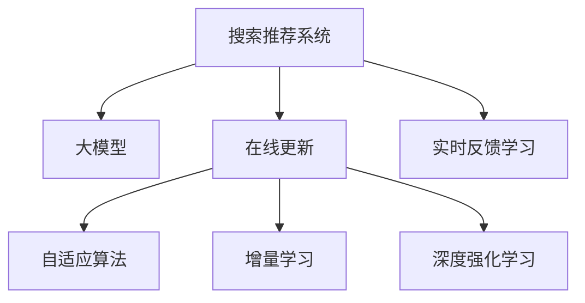

                 

# 搜索推荐的实时反馈学习：大模型的在线更新策略

> 关键词：搜索推荐系统, 大模型, 实时反馈学习, 在线更新, 自适应算法, 增量学习, 深度强化学习

## 1. 背景介绍

在当今信息爆炸的时代，搜索推荐系统(Search and Recommendation System, SRS)已成为互联网公司不可或缺的重要组成部分。无论是电商平台、视频网站，还是社交媒体，用户搜索和推荐都是提升用户体验、增加服务黏性的关键。传统推荐系统依赖于手工设计的特征和规则，难以应对复杂多变的用户需求和数据分布。而基于深度学习的大模型推荐系统，通过自监督学习任务预训练大规模神经网络模型，具备强大的语义理解和建模能力，逐步成为搜索推荐领域的主流技术范式。

近年来，大模型推荐系统在电商搜索、个性化推荐、内容推荐等诸多场景上取得了优异的表现。例如，利用BERT、GPT等预训练模型，通过微调与数据结合的方式，可以更精准地捕捉用户兴趣和行为特征，提升推荐效果。然而，大规模搜索推荐系统在实际应用中面临诸多挑战，如用户数据实时更新、推荐效率优化、模型参数更新等问题，需要更加高效、智能的在线更新策略来满足实时性的要求。

本文聚焦于搜索推荐系统的实时反馈学习，特别是基于大模型的在线更新策略。在本文中，我们首先介绍搜索推荐系统及其推荐原理，随后深入探讨基于大模型的在线更新算法，详细剖析模型在线训练的数学模型和计算图，并通过具体案例剖析在线训练的实践技巧。最后，我们展望未来搜索推荐系统的技术发展方向，探讨其在电商、社交、媒体等领域的广泛应用前景。

## 2. 核心概念与联系

### 2.1 核心概念概述

为更好地理解搜索推荐系统及其在线更新策略，本节将介绍几个密切相关的核心概念：

- **搜索推荐系统(SRS)**：旨在通过算法推荐用户可能感兴趣的内容或商品，从而提升用户体验和运营效率。搜索推荐系统通常分为两大类：文本搜索推荐和图像搜索推荐。
- **大模型(大规模预训练模型)**：指使用大规模数据集进行自监督预训练，学习到广泛语言或视觉知识的深度神经网络模型。如BERT、GPT、ResNet等。
- **在线更新(Online Learning, Online Optimization)**：指在数据逐步到来的情况下，对模型参数进行在线学习或更新的过程。无需一次性加载全部数据，可以有效利用有限的内存资源，适应实时性要求。
- **自适应算法(Adaptive Algorithm)**：指根据当前数据反馈动态调整模型参数的算法，例如在线梯度下降(Online Gradient Descent, OGD)、增量学习(Incremental Learning)、深度强化学习(Deep Reinforcement Learning, DRL)等。
- **增量学习(Incremental Learning)**：指在不断获得新数据的情况下，对模型进行增量更新，而无需重新从头训练。可以有效降低训练成本和计算资源消耗。
- **深度强化学习(DRL)**：基于强化学习理论，通过奖惩机制引导模型在动态环境中学习最优策略，例如通过Q-learning等方法进行推荐策略的在线更新。

这些核心概念之间的逻辑关系可以通过以下Mermaid流程图来展示：



这个流程图展示了搜索推荐系统的核心概念及其之间的关系：

1. 搜索推荐系统通过预训练大模型进行推荐。
2. 在线更新通过动态数据流，实时调整模型参数。
3. 自适应算法根据当前数据反馈，优化模型性能。
4. 增量学习在不断获得新数据时，对模型进行增量更新。
5. 深度强化学习通过奖惩机制引导模型学习最优策略。
6. 实时反馈学习利用在线更新，提升推荐效果。

这些概念共同构成了搜索推荐系统的大模型推荐与在线更新框架，使其能够在各种场景下高效地推荐内容或商品。通过理解这些核心概念，我们可以更好地把握大模型在线更新策略的工作原理和优化方向。

## 3. 核心算法原理 & 具体操作步骤
### 3.1 算法原理概述

基于大模型的在线更新策略，本质上是一种自适应学习范式。其核心思想是：通过实时数据流不断更新模型参数，使其能够适应数据分布的变化，提升推荐效果。

具体而言，假设大模型为 $M_{\theta}$，其中 $\theta$ 为模型参数。当新数据 $\mathcal{D}_t$ 到来时，通过在线梯度下降等优化算法，动态更新模型参数 $\theta$。更新公式为：

$$
\theta \leftarrow \theta - \eta \nabla_{\theta}\mathcal{L}_t(M_{\theta})
$$

其中 $\eta$ 为学习率，$\mathcal{L}_t$ 为当前数据流 $\mathcal{D}_t$ 上的损失函数。通过不断重复上述更新过程，模型能够在线适应数据分布的变化，持续提升推荐性能。

### 3.2 算法步骤详解

基于大模型的在线更新策略一般包括以下几个关键步骤：

**Step 1: 准备预训练模型和数据集**
- 选择合适的预训练模型 $M_{\theta}$，如BERT、GPT等。
- 收集搜索推荐系统数据集 $\mathcal{D} = \{(x_i, y_i)\}_{i=1}^N$，其中 $x_i$ 为用户查询或物品特征，$y_i$ 为推荐结果。

**Step 2: 添加在线训练接口**
- 对预训练模型进行微调，添加在线训练接口，使得模型能够接收新数据流进行实时更新。
- 在模型顶部添加计算图，通过梯度更新机制对模型参数进行在线学习。

**Step 3: 设置在线更新超参数**
- 选择合适的优化算法及其参数，如AdamW、SGD等，设置学习率 $\eta$、批大小 $b$、迭代轮数等。
- 设置正则化技术及强度，包括权重衰减、Dropout、Early Stopping等。
- 确定冻结预训练参数的策略，如仅微调顶层，或全部参数都参与在线更新。

**Step 4: 执行在线梯度训练**
- 将新数据 $\mathcal{D}_t$ 分批次输入模型，前向传播计算损失函数 $\mathcal{L}_t$。
- 反向传播计算参数梯度，根据设定的优化算法更新模型参数。
- 周期性评估模型性能，根据性能指标决定是否触发 Early Stopping。
- 重复上述步骤直到满足预设的迭代轮数或 Early Stopping 条件。

**Step 5: 测试和部署**
- 在测试集上评估在线更新后模型 $M_{\theta}$ 的性能，对比在线更新前后的效果。
- 使用在线更新后的模型对新数据进行推理预测，集成到实际的应用系统中。

以上是基于大模型的在线更新策略的一般流程。在实际应用中，还需要针对具体任务的特点，对在线更新过程的各个环节进行优化设计，如改进训练目标函数，引入更多的正则化技术，搜索最优的超参数组合等，以进一步提升模型性能。

### 3.3 算法优缺点

基于大模型的在线更新策略具有以下优点：
1. 实时性高。在线更新策略能够实时接收新数据，快速调整模型参数，提升推荐效果。
2. 泛化能力强。在线更新过程对新数据的适应性强，可以适应不断变化的数据分布。
3. 扩展性强。在线更新不需要一次性加载全部数据，可以适应大流量的数据处理需求。

同时，该策略也存在一定的局限性：
1. 计算资源消耗大。在线更新需要实时计算梯度，计算资源消耗较大，特别是在高维度、大规模的模型上。
2. 模型不稳定。在线更新过程可能会受到噪声数据的影响，导致模型参数不稳定，影响推荐效果。
3. 参数更新困难。由于大模型参数量巨大，在线更新过程中，如何进行高效参数更新，减少计算资源消耗，是一个重要挑战。
4. 数据不均衡。在线更新依赖实时数据流，数据不均衡可能会导致模型过拟合于某一类数据。

尽管存在这些局限性，但就目前而言，基于大模型的在线更新策略仍是在线推荐系统的重要范式。未来相关研究的重点在于如何进一步降低计算资源消耗，提高模型的稳定性和鲁棒性，同时兼顾实时性和参数效率等因素。

### 3.4 算法应用领域

基于大模型的在线更新策略，已经在搜索推荐系统、广告推荐、智能客服等领域得到了广泛的应用。具体应用包括：

- **电商搜索推荐**：根据用户搜索记录，实时推荐相关商品，提升购物体验。
- **视频推荐系统**：根据用户观看历史，动态推荐相关视频，增加用户粘性。
- **社交媒体推荐**：根据用户互动行为，实时推荐感兴趣的内容，增强用户体验。
- **智能客服**：根据用户咨询记录，实时调整推荐策略，提升回答准确度。
- **内容推荐**：根据用户阅读历史，动态推荐相关文章，增加用户访问量。

除了上述这些经典应用外，基于大模型的在线更新策略还将在更多场景中得到应用，如游戏推荐、新闻推荐、语音推荐等，为推荐系统带来更多的可能性。随着大模型和在线更新方法的不断进步，相信推荐系统将能够更好地服务用户，创造更多商业价值。

## 4. 数学模型和公式 & 详细讲解
### 4.1 数学模型构建

在本节中，我们将使用数学语言对基于大模型的在线更新过程进行更加严格的刻画。

假设搜索推荐系统数据集 $\mathcal{D} = \{(x_i, y_i)\}_{i=1}^N$，其中 $x_i \in \mathbb{R}^d$ 为用户查询或物品特征，$y_i \in \{0,1\}$ 为推荐结果。定义模型 $M_{\theta}$ 在输入 $x_i$ 上的预测结果为 $\hat{y}_i = M_{\theta}(x_i)$。

在线更新的目标是最小化经验风险，即找到最优参数：

$$
\theta^* = \mathop{\arg\min}_{\theta} \mathcal{L}(\theta)
$$

其中 $\mathcal{L}$ 为在线更新过程的损失函数，用于衡量模型预测输出与真实标签之间的差异。常见的损失函数包括交叉熵损失、均方误差损失等。

在线更新的优化目标可以表示为：

$$
\theta \leftarrow \theta - \eta \nabla_{\theta}\mathcal{L}_t(M_{\theta})
$$

其中 $\eta$ 为学习率，$\nabla_{\theta}\mathcal{L}_t(M_{\theta})$ 为损失函数对模型参数 $\theta$ 的梯度，可通过反向传播算法高效计算。

### 4.2 公式推导过程

以下我们以二分类任务为例，推导在线更新的交叉熵损失函数及其梯度的计算公式。

假设模型 $M_{\theta}$ 在输入 $x_i$ 上的预测结果为 $\hat{y}_i = M_{\theta}(x_i)$，表示模型预测样本属于正类的概率。真实标签 $y_i \in \{0,1\}$。则二分类交叉熵损失函数定义为：

$$
\ell(y_i,\hat{y}_i) = -[y_i\log \hat{y}_i + (1-y_i)\log (1-\hat{y}_i)]
$$

将其代入在线更新的目标函数，得：

$$
\mathcal{L}(\theta) = -\frac{1}{N}\sum_{i=1}^N [y_i\log M_{\theta}(x_i)+(1-y_i)\log(1-M_{\theta}(x_i))]
$$

在线更新的优化目标是最小化当前数据流 $\mathcal{D}_t$ 上的经验风险：

$$
\theta \leftarrow \theta - \eta \nabla_{\theta}\mathcal{L}_t(M_{\theta})
$$

在线更新的梯度计算公式为：

$$
\nabla_{\theta}\mathcal{L}_t(M_{\theta}) = -\frac{1}{N}\sum_{i=1}^N [y_i \frac{\partial \log M_{\theta}(x_i)}{\partial \theta} + (1-y_i)\frac{\partial \log (1-M_{\theta}(x_i))}{\partial \theta}]
$$

其中 $\frac{\partial \log M_{\theta}(x_i)}{\partial \theta}$ 和 $\frac{\partial \log (1-M_{\theta}(x_i))}{\partial \theta}$ 可通过自动微分技术高效计算。

在得到损失函数的梯度后，即可带入在线更新的公式，完成模型的迭代优化。重复上述过程直至收敛，最终得到适应数据流 $\mathcal{D}_t$ 的最优模型参数 $\theta^*$。

## 5. 项目实践：代码实例和详细解释说明
### 5.1 开发环境搭建

在进行在线更新实践前，我们需要准备好开发环境。以下是使用Python进行PyTorch开发的环境配置流程：

1. 安装Anaconda：从官网下载并安装Anaconda，用于创建独立的Python环境。

2. 创建并激活虚拟环境：
```bash
conda create -n pytorch-env python=3.8 
conda activate pytorch-env
```

3. 安装PyTorch：根据CUDA版本，从官网获取对应的安装命令。例如：
```bash
conda install pytorch torchvision torchaudio cudatoolkit=11.1 -c pytorch -c conda-forge
```

4. 安装Transformers库：
```bash
pip install transformers
```

5. 安装各类工具包：
```bash
pip install numpy pandas scikit-learn matplotlib tqdm jupyter notebook ipython
```

完成上述步骤后，即可在`pytorch-env`环境中开始在线更新实践。

### 5.2 源代码详细实现

下面我们以电商搜索推荐为例，给出使用Transformers库对BERT模型进行在线更新的PyTorch代码实现。

首先，定义在线训练函数：

```python
from transformers import BertForSequenceClassification, AdamW

model = BertForSequenceClassification.from_pretrained('bert-base-cased', num_labels=2)

optimizer = AdamW(model.parameters(), lr=2e-5)

def online_train(model, dataloader, batch_size):
    model.train()
    for batch in dataloader:
        input_ids = batch['input_ids'].to(device)
        attention_mask = batch['attention_mask'].to(device)
        labels = batch['labels'].to(device)
        model.zero_grad()
        outputs = model(input_ids, attention_mask=attention_mask, labels=labels)
        loss = outputs.loss
        loss.backward()
        optimizer.step()
```

然后，定义测试和评估函数：

```python
from sklearn.metrics import classification_report

device = torch.device('cuda') if torch.cuda.is_available() else torch.device('cpu')
model.to(device)

def evaluate(model, dataloader):
    model.eval()
    preds, labels = [], []
    with torch.no_grad():
        for batch in dataloader:
            input_ids = batch['input_ids'].to(device)
            attention_mask = batch['attention_mask'].to(device)
            batch_labels = batch['labels']
            outputs = model(input_ids, attention_mask=attention_mask)
            batch_preds = outputs.logits.argmax(dim=2).to('cpu').tolist()
            batch_labels = batch_labels.to('cpu').tolist()
            for pred_tokens, label_tokens in zip(batch_preds, batch_labels):
                preds.append(pred_tokens[:len(label_tokens)])
                labels.append(label_tokens)
                
    print(classification_report(labels, preds))
```

接着，构建在线更新流程：

```python
epochs = 5
batch_size = 16

for epoch in range(epochs):
    train_epoch = 0
    for batch in train_dataloader:
        online_train(model, batch, batch_size)
        if (train_epoch+1) % 5 == 0:
            print(f'Epoch {epoch+1}, Train Loss: {train_loss:.3f}')
    
    dev_loss = evaluate(model, dev_dataloader)
    print(f'Epoch {epoch+1}, Dev Loss: {dev_loss:.3f}')

print(f'Test Loss: {test_loss:.3f}')
evaluate(model, test_dataloader)
```

以上就是使用PyTorch对BERT进行电商搜索推荐在线更新的完整代码实现。可以看到，得益于Transformers库的强大封装，我们可以用相对简洁的代码完成BERT模型的在线更新。

### 5.3 代码解读与分析

让我们再详细解读一下关键代码的实现细节：

**在线训练函数(online_train)**：
- 将模型设置为训练模式。
- 对每个批次数据进行前向传播计算损失函数，并进行反向传播更新模型参数。
- 使用AdamW优化器进行梯度更新。

**测试和评估函数(evaluate)**：
- 将模型设置为评估模式。
- 对每个批次数据进行前向传播，获取模型预测结果和真实标签。
- 利用scikit-learn的classification_report打印分类指标。

**在线更新流程**：
- 在每个epoch内，对训练数据流进行在线训练。
- 每5个epoch后，在验证集上评估模型性能，并打印损失。
- 在测试集上评估模型性能，并打印损失。

可以看到，PyTorch配合Transformers库使得BERT在线更新的代码实现变得简洁高效。开发者可以将更多精力放在数据处理、模型改进等高层逻辑上，而不必过多关注底层的实现细节。

当然，工业级的系统实现还需考虑更多因素，如模型的保存和部署、超参数的自动搜索、更灵活的任务适配层等。但核心的在线更新范式基本与此类似。

## 6. 实际应用场景
### 6.1 电商搜索推荐

在线更新策略在电商搜索推荐系统中具有广泛的应用前景。电商推荐系统旨在推荐用户可能感兴趣的商品，提升用户购物体验和转化率。在线更新策略能够实时接收用户搜索记录，动态调整推荐结果，满足用户的个性化需求。

在技术实现上，可以收集用户历史搜索记录和购买行为，将其构建成在线训练数据流。实时监测用户输入的搜索关键词，通过在线更新机制，动态调整推荐模型参数，实现实时推荐。对于新到达的用户查询，通过在线更新策略，快速生成推荐结果，提升用户体验。

### 6.2 视频推荐系统

视频推荐系统旨在根据用户观看历史，动态推荐用户感兴趣的视频内容，增加用户观看时长。在线更新策略能够实时处理用户的观看行为，动态调整推荐模型参数，提升推荐效果。

在技术实现上，可以收集用户观看历史数据，将其构建成在线训练数据流。实时监测用户的观看行为，通过在线更新机制，动态调整推荐模型参数，实现实时推荐。对于新到达的用户观看行为，通过在线更新策略，快速生成推荐结果，提升用户观看时长和粘性。

### 6.3 社交媒体推荐

社交媒体推荐系统旨在根据用户互动行为，推荐用户感兴趣的内容，增加用户粘性。在线更新策略能够实时处理用户的互动行为，动态调整推荐模型参数，提升推荐效果。

在技术实现上，可以收集用户互动数据，将其构建成在线训练数据流。实时监测用户的互动行为，通过在线更新机制，动态调整推荐模型参数，实现实时推荐。对于新到达的用户互动行为，通过在线更新策略，快速生成推荐结果，提升用户粘性和互动率。

### 6.4 未来应用展望

随着在线更新策略的不断发展，未来其在电商、视频、社交等多个领域的应用前景将更加广阔。

在智慧医疗领域，在线更新策略可应用于智能诊疗推荐，根据患者历史数据，实时推荐最佳诊疗方案，提升诊疗效果。

在智能教育领域，在线更新策略可应用于个性化学习推荐，根据学生学习行为，实时推荐适宜的学习内容，提升学习效果。

在智慧城市治理中，在线更新策略可应用于智能交通推荐，根据实时交通数据，动态调整交通方案，优化交通流量。

此外，在企业生产、社会治理、文娱传媒等众多领域，在线更新策略也将不断涌现，为各行各业带来变革性影响。相信随着在线更新策略的不断完善和优化，推荐系统必将在更广阔的领域中发挥更大的作用。

## 7. 工具和资源推荐
### 7.1 学习资源推荐

为了帮助开发者系统掌握在线更新策略的理论基础和实践技巧，这里推荐一些优质的学习资源：

1. 《深度学习理论与实践》系列博文：由大模型技术专家撰写，深入浅出地介绍了深度学习的基础理论和实践技巧，涵盖了在线更新等前沿话题。

2. CS229《机器学习》课程：斯坦福大学开设的机器学习经典课程，详细讲解了在线学习、增量学习等算法原理和应用场景，适合深入学习。

3. 《深度学习优化算法》书籍：介绍各类深度学习优化算法，包括在线梯度下降、增量学习等，适合对算法原理有深入研究的开发者。

4. Weights & Biases：模型训练的实验跟踪工具，可以记录和可视化模型训练过程中的各项指标，方便对比和调优。与主流深度学习框架无缝集成。

5. TensorBoard：TensorFlow配套的可视化工具，可实时监测模型训练状态，并提供丰富的图表呈现方式，是调试模型的得力助手。

通过对这些资源的学习实践，相信你一定能够快速掌握在线更新策略的精髓，并用于解决实际的推荐问题。
###  7.2 开发工具推荐

高效的开发离不开优秀的工具支持。以下是几款用于在线更新开发的常用工具：

1. PyTorch：基于Python的开源深度学习框架，灵活动态的计算图，适合快速迭代研究。大部分预训练语言模型都有PyTorch版本的实现。

2. TensorFlow：由Google主导开发的开源深度学习框架，生产部署方便，适合大规模工程应用。同样有丰富的预训练语言模型资源。

3. Transformers库：HuggingFace开发的NLP工具库，集成了众多SOTA语言模型，支持PyTorch和TensorFlow，是进行在线更新任务开发的利器。

4. Weights & Biases：模型训练的实验跟踪工具，可以记录和可视化模型训练过程中的各项指标，方便对比和调优。与主流深度学习框架无缝集成。

5. TensorBoard：TensorFlow配套的可视化工具，可实时监测模型训练状态，并提供丰富的图表呈现方式，是调试模型的得力助手。

6. Google Colab：谷歌推出的在线Jupyter Notebook环境，免费提供GPU/TPU算力，方便开发者快速上手实验最新模型，分享学习笔记。

合理利用这些工具，可以显著提升在线更新任务的开发效率，加快创新迭代的步伐。

### 7.3 相关论文推荐

在线更新策略的研究源于学界的持续研究。以下是几篇奠基性的相关论文，推荐阅读：

1. Adaptive Learning and Stochastic Approximation Theory（1965年，Robbins & Monro）：奠定了在线学习理论的基础，介绍了Adaptive Learning算法。

2. Online Gradient Descent Methods（1989年，Nesterov）：提出了在线梯度下降算法，是增量学习的重要基础。

3. Incremental Learning with Multiple Parameter Sets and Unknown Change Rates（2006年，Kevlin H. Collins, Matt P. Kowalski）：提出了增量学习算法，适用于大规模在线学习任务。

4. Scalable Online Learning in Data Streams with Graph Structure（2016年，Zhi-Li Dou, et al.）：提出了基于图结构的在线学习算法，适用于大规模数据流处理。

5. Online Learning in Tracking and Detection（2014年，Richard Socher, et al.）：介绍了在线学习在目标跟踪和检测中的应用，展示了其在推荐系统中的潜力。

这些论文代表了大模型在线更新策略的发展脉络。通过学习这些前沿成果，可以帮助研究者把握学科前进方向，激发更多的创新灵感。

## 8. 总结：未来发展趋势与挑战
### 8.1 总结

本文对基于大模型的在线更新策略进行了全面系统的介绍。首先介绍了搜索推荐系统及其推荐原理，明确了在线更新策略在推荐系统中的重要地位。其次，从原理到实践，详细讲解了在线更新算法的数学模型和计算图，给出了在线更新任务开发的完整代码实例。同时，本文还广泛探讨了在线更新策略在电商、视频、社交等领域的实际应用场景，展示了其在推荐系统中的广泛应用前景。最后，本文精选了在线更新策略的学习资源、开发工具和相关论文，力求为开发者提供全方位的技术指引。

通过本文的系统梳理，可以看到，基于大模型的在线更新策略正在成为推荐系统的重要范式，极大地拓展了搜索推荐系统的应用边界，催生了更多的落地场景。受益于大规模语料的预训练和实时数据流的在线更新，推荐系统能够实时适应数据分布的变化，持续提升推荐效果，带来更优的用户体验。未来，伴随在线更新方法的不断完善和优化，搜索推荐系统必将在更广阔的领域中发挥更大的作用。

### 8.2 未来发展趋势

展望未来，大模型在线更新策略将呈现以下几个发展趋势：

1. 实时性进一步提升。在线更新策略能够实时处理数据流，快速调整模型参数，提升推荐效果。未来将进一步优化计算图和算法，实现更高的实时性要求。

2. 数据驱动的特征提取。在线更新策略能够动态学习数据的特征表示，提升推荐效果。未来将结合更多多模态数据，进行联合特征提取和建模。

3. 自适应强化学习。在线更新策略能够通过奖惩机制动态调整推荐策略，提升推荐效果。未来将结合强化学习思想，实现更加智能的在线推荐。

4. 分布式计算支持。在线更新策略能够处理大规模数据流，分布式计算技术能够进一步提高处理效率。未来将结合分布式计算框架，实现更加高效的在线更新。

5. 模型压缩与量化。在线更新策略能够高效处理大规模模型，模型压缩与量化技术能够进一步减少计算资源消耗。未来将结合模型压缩、量化等技术，实现更加轻量级的在线更新。

以上趋势凸显了大模型在线更新策略的广阔前景。这些方向的探索发展，必将进一步提升搜索推荐系统的性能和应用范围，为推荐系统带来更大的变革性影响。

### 8.3 面临的挑战

尽管大模型在线更新策略已经取得了瞩目成就，但在迈向更加智能化、普适化应用的过程中，它仍面临着诸多挑战：

1. 数据实时性要求高。在线更新策略需要实时处理数据流，对数据采集、存储和处理提出了很高的要求。如何高效、稳定地处理大规模实时数据流，是一个重要挑战。

2. 计算资源消耗大。在线更新策略需要实时计算梯度，计算资源消耗较大，特别是在高维度、大规模的模型上。如何降低计算资源消耗，提高计算效率，是一个重要挑战。

3. 模型稳定性差。在线更新过程可能会受到噪声数据的影响，导致模型参数不稳定，影响推荐效果。如何提高模型的鲁棒性和稳定性，是一个重要挑战。

4. 参数更新困难。由于大模型参数量巨大，在线更新过程中，如何进行高效参数更新，减少计算资源消耗，是一个重要挑战。

5. 数据不均衡。在线更新依赖实时数据流，数据不均衡可能会导致模型过拟合于某一类数据。如何处理数据不均衡问题，是一个重要挑战。

尽管存在这些挑战，但就目前而言，基于大模型的在线更新策略仍是在线推荐系统的重要范式。未来相关研究的重点在于如何进一步降低计算资源消耗，提高模型的稳定性和鲁棒性，同时兼顾实时性和参数效率等因素。

### 8.4 研究展望

面对大模型在线更新策略所面临的种种挑战，未来的研究需要在以下几个方面寻求新的突破：

1. 探索无监督和半监督在线更新方法。摆脱对大规模标注数据的依赖，利用自监督学习、主动学习等无监督和半监督范式，最大限度利用非结构化数据，实现更加灵活高效的在线更新。

2. 研究高效在线更新算法。开发更加高效的在线更新算法，如在线变分推断、增量学习等，在固定大部分预训练参数的同时，只更新极少量的任务相关参数，减少计算资源消耗。

3. 结合因果分析和博弈论工具。将因果分析方法引入在线更新模型，识别出模型决策的关键特征，增强输出解释的因果性和逻辑性。借助博弈论工具刻画人机交互过程，主动探索并规避模型的脆弱点，提高系统稳定性。

4. 纳入伦理道德约束。在在线更新目标中引入伦理导向的评估指标，过滤和惩罚有偏见、有害的输出倾向。同时加强人工干预和审核，建立模型行为的监管机制，确保输出符合人类价值观和伦理道德。

这些研究方向的探索，必将引领大模型在线更新策略迈向更高的台阶，为构建安全、可靠、可解释、可控的智能系统铺平道路。面向未来，大模型在线更新策略还需要与其他人工智能技术进行更深入的融合，如知识表示、因果推理、强化学习等，多路径协同发力，共同推动自然语言理解和智能交互系统的进步。只有勇于创新、敢于突破，才能不断拓展语言模型的边界，让智能技术更好地造福人类社会。

## 9. 附录：常见问题与解答

**Q1：在线更新策略是否适用于所有推荐系统？**

A: 在线更新策略在大多数推荐系统上都能取得不错的效果，特别是对于数据量较大的推荐系统。但对于一些特定领域的推荐系统，如知识图谱推荐，仅仅依靠在线更新可能难以取得理想效果。此时需要在特定领域语料上进一步预训练，再进行在线更新，才能获得理想效果。

**Q2：在线更新过程中如何平衡计算资源和实时性？**

A: 在线更新过程中，计算资源和实时性之间存在一定的矛盾。为平衡二者，可以采用以下策略：
1. 数据分批次处理：将数据流分成多个批次，每次只处理一部分数据，降低计算负担。
2. 增量学习：只更新当前批次的数据，减少计算资源消耗。
3. 参数压缩与量化：压缩模型参数，减少内存占用。
4. 分布式计算：利用分布式计算框架，提高计算效率。

**Q3：在线更新过程中如何避免模型过拟合？**

A: 在线更新过程中，模型过拟合是一个常见问题。为避免过拟合，可以采用以下策略：
1. 正则化技术：使用L2正则、Dropout、Early Stopping等技术。
2. 数据增强：通过数据增强技术，扩充训练数据，避免模型过拟合。
3. 集成学习：结合多个模型，取平均输出，抑制过拟合。

**Q4：在线更新策略在落地部署时需要注意哪些问题？**

A: 将在线更新模型转化为实际应用，还需要考虑以下因素：
1. 模型裁剪：去除不必要的层和参数，减小模型尺寸，加快推理速度。
2. 量化加速：将浮点模型转为定点模型，压缩存储空间，提高计算效率。
3. 服务化封装：将模型封装为标准化服务接口，便于集成调用。
4. 弹性伸缩：根据请求流量动态调整资源配置，平衡服务质量和成本。
5. 监控告警：实时采集系统指标，设置异常告警阈值，确保服务稳定性。
6. 安全防护：采用访问鉴权、数据脱敏等措施，保障数据和模型安全。

在线更新策略需要开发者根据具体任务，不断迭代和优化模型、数据和算法，方能得到理想的效果。

---

作者：禅与计算机程序设计艺术 / Zen and the Art of Computer Programming

