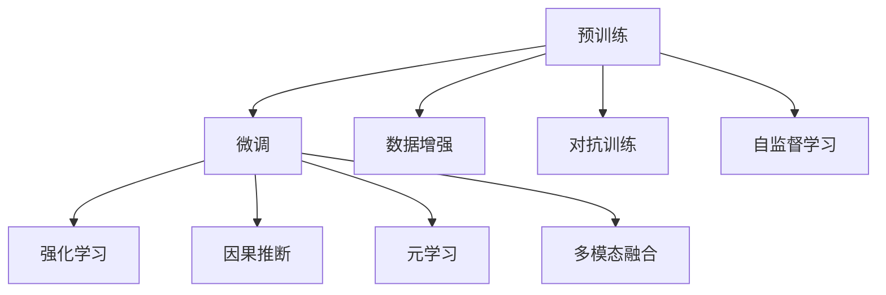

                 

## 1. 背景介绍

### 1.1 问题由来
随着互联网的快速发展和信息爆炸，搜索引擎、推荐系统已经成为人们获取信息的重要渠道。传统的信息检索和推荐算法往往依赖于静态的关键词匹配和历史行为数据，难以捕捉用户深层次的兴趣和需求，导致推荐结果不够精准，用户体验不佳。近年来，人工智能大模型在搜索引擎和推荐系统中逐渐成为热点，通过深度学习和自然语言理解等技术，显著提升了信息检索和推荐的智能化水平。

大模型在搜索引擎和推荐系统中的应用，使得系统能够更加理解用户意图，更准确地匹配检索需求和推荐内容。例如，大模型可以基于自然语言理解，对用户的查询进行语义分析，从而更精准地匹配结果。在推荐系统中，大模型能够根据用户的历史行为和兴趣，预测用户可能感兴趣的内容，进行个性化推荐。

### 1.2 问题核心关键点
搜索推荐系统中的大模型算法创新，主要围绕以下几个核心关键点展开：

- 预训练-微调（Pre-training & Fine-tuning）：利用大规模无标签数据预训练大模型，通过有监督学习在小规模任务数据上微调，提升模型对特定任务的表现。
- 强化学习（Reinforcement Learning, RL）：在用户与系统的交互过程中，通过奖惩机制训练模型，优化推荐策略。
- 因果推断（Causal Inference）：通过对用户行为数据的因果分析，提升模型的推荐准确性和公平性。
- 元学习（Meta Learning）：在有限的训练样本上，通过少样本学习或自适应学习，提高模型的泛化能力。
- 多模态融合（Multi-modal Fusion）：将文本、图像、音频等多模态数据进行融合，提升模型对现实世界的理解和建模能力。

这些关键技术点，共同构成了AI大模型在搜索推荐系统中的应用框架，使其能够更好地理解用户需求，提供精准、个性化的信息检索和推荐服务。

## 2. 核心概念与联系

### 2.1 核心概念概述

为更好地理解大模型在搜索推荐系统中的应用，本节将介绍几个密切相关的核心概念：

- 预训练(Pre-training)：指在大规模无标签数据上，通过自监督学习任务训练通用语言模型的过程。常见的预训练任务包括掩码语言模型、句子分类等。
- 微调(Fine-tuning)：指在预训练模型的基础上，使用下游任务的少量标注数据，通过有监督学习优化模型在特定任务上的性能。通常只需要调整顶层分类器或解码器，并以较小的学习率更新全部或部分的模型参数。
- 强化学习(Reinforcement Learning, RL)：通过在用户与系统的交互过程中，通过奖惩机制训练模型，优化推荐策略。
- 因果推断(Causal Inference)：通过分析用户行为数据中的因果关系，提升模型的推荐准确性和公平性。
- 元学习(Meta Learning)：在有限的训练样本上，通过少样本学习或自适应学习，提高模型的泛化能力。
- 多模态融合(Multi-modal Fusion)：将文本、图像、音频等多模态数据进行融合，提升模型对现实世界的理解和建模能力。

这些核心概念之间的逻辑关系可以通过以下Mermaid流程图来展示：



这个流程图展示了大模型的核心概念及其之间的关系：

1. 预训练使得模型学习到通用的语言表示，为其在特定任务上的微调打下基础。
2. 微调通过任务适配层和少量标注数据，优化模型在特定任务上的性能。
3. 强化学习利用用户行为数据，不断优化推荐策略，提升用户体验。
4. 因果推断通过分析用户行为数据中的因果关系，提升推荐结果的公平性和可靠性。
5. 元学习在有限的样本数据上，提高模型对新任务的适应能力。
6. 多模态融合将文本、图像、音频等多模态数据进行融合，提升模型对复杂场景的理解能力。

这些概念共同构成了大模型在搜索推荐系统中的应用框架，使其能够更好地理解用户需求，提供精准、个性化的信息检索和推荐服务。

## 3. 核心算法原理 & 具体操作步骤
### 3.1 算法原理概述

在搜索推荐系统中，大模型的核心任务是通过深度学习和自然语言理解技术，提升信息检索和推荐的智能化水平。具体来说，大模型通过预训练获得通用语言表示，通过微调适配特定任务，通过强化学习优化推荐策略，通过因果推断提升推荐公平性，通过元学习提高模型泛化能力，通过多模态融合提升对复杂场景的理解能力。

这些技术的综合应用，使得大模型在搜索推荐系统中的表现优于传统方法，能够更准确地理解用户需求，提供更个性化的推荐结果，提升用户体验。

### 3.2 算法步骤详解

基于大模型的搜索推荐系统，通常包括以下几个关键步骤：

**Step 1: 准备预训练模型和数据集**
- 选择合适的预训练语言模型 $M_{\theta}$ 作为初始化参数，如BERT、GPT等。
- 准备搜索和推荐任务的标注数据集 $D$，划分为训练集、验证集和测试集。

**Step 2: 设计任务适配层**
- 根据任务类型，在预训练模型顶层设计合适的输出层和损失函数。
- 对于信息检索任务，通常使用余弦相似度或注意力机制作为检索策略。
- 对于推荐任务，通常使用分类任务或排序任务，学习用户对物品的偏好。

**Step 3: 设置微调超参数**
- 选择合适的优化算法及其参数，如 AdamW、SGD 等，设置学习率、批大小、迭代轮数等。
- 设置正则化技术及强度，包括权重衰减、Dropout、Early Stopping等。
- 确定冻结预训练参数的策略，如仅微调顶层，或全部参数都参与微调。

**Step 4: 执行梯度训练**
- 将训练集数据分批次输入模型，前向传播计算损失函数。
- 反向传播计算参数梯度，根据设定的优化算法和学习率更新模型参数。
- 周期性在验证集上评估模型性能，根据性能指标决定是否触发 Early Stopping。
- 重复上述步骤直到满足预设的迭代轮数或 Early Stopping 条件。

**Step 5: 应用强化学习进行推荐优化**
- 使用推荐系统的反馈数据（如点击率、曝光量等）作为强化学习的奖励信号。
- 设计强化学习环境，定义状态、动作、奖励等，并使用深度强化学习算法（如Q-learning、SARSA、DQN等）训练推荐模型。
- 将微调后的模型作为深度Q网络，在推荐环境中不断更新策略，优化推荐效果。

**Step 6: 应用因果推断提升推荐公平性**
- 收集用户行为数据，构建因果模型，分析用户行为与推荐结果之间的关系。
- 使用因果推断技术（如D-DoDo、I-DoDo等），识别出推荐结果中的因果因素，提升推荐公平性和可靠性。
- 将因果推断结果引入推荐模型，优化推荐策略，减少偏见和歧视。

**Step 7: 应用元学习提高泛化能力**
- 在有限的样本数据上，利用元学习技术（如Meta Learning、MAML等），训练模型能够快速适应新任务。
- 设计元学习任务，收集少量标注数据，使用元学习算法（如元学习优化器、 few-shot learning等）优化模型参数，提升模型泛化能力。
- 将元学习模型应用于推荐系统中，提高模型对新任务的适应能力。

**Step 8: 应用多模态融合提升理解能力**
- 收集多种模态的数据（如文本、图像、音频等），设计多模态融合模型，整合不同模态的信息。
- 使用多模态融合技术（如Attention、Transformer等），将不同模态的数据进行融合，提升模型的理解能力。
- 将多模态融合结果引入推荐模型，提升推荐结果的准确性和多样性。

以上是基于大模型的搜索推荐系统的一般流程。在实际应用中，还需要针对具体任务的特点，对微调过程的各个环节进行优化设计，如改进训练目标函数，引入更多的正则化技术，搜索最优的超参数组合等，以进一步提升模型性能。

### 3.3 算法优缺点

基于大模型的搜索推荐系统，具有以下优点：

1. 智能化水平高。通过深度学习和自然语言理解技术，能够更准确地理解用户需求，提供更个性化的推荐结果。
2. 泛化能力强。大模型在大量无标签数据上进行预训练，使其具备更广泛的通用语言表示，能够适应各种任务。
3. 灵活性高。通过微调、强化学习、因果推断、元学习等技术，能够根据用户需求灵活调整推荐策略。
4. 可解释性好。大模型的预训练和微调过程透明，能够提供推荐的详细解释，增强用户信任。

同时，该方法也存在一定的局限性：

1. 计算成本高。大模型通常需要大量计算资源进行训练和微调，成本较高。
2. 资源消耗大。大模型的推理过程中，计算资源和存储资源消耗较大，需要优化资源利用效率。
3. 技术门槛高。需要深度学习、自然语言处理等多领域的知识和技能，开发难度较大。
4. 可解释性不足。大模型通常被视为"黑盒"系统，缺乏详细的解释机制，难以解释决策过程。

尽管存在这些局限性，但就目前而言，基于大模型的搜索推荐系统依然是大数据时代下最具潜力的技术范式之一。未来相关研究的重点在于如何进一步降低计算成本，提高资源利用效率，降低技术门槛，增强模型的可解释性，以更好地满足实际应用需求。

### 3.4 算法应用领域

基于大模型的搜索推荐系统，已经在多个领域得到广泛应用，例如：

- 搜索引擎：利用自然语言理解和检索技术，提升搜索结果的相关性和排序准确性。
- 电子商务推荐：通过分析用户行为数据，提供个性化商品推荐。
- 视频推荐：利用多模态融合技术，结合视频内容、用户反馈等信息，提供更精准的视频推荐。
- 音乐推荐：利用自然语言理解和情感分析，结合用户评论和听歌行为，推荐更多符合用户喜好的音乐。
- 新闻推荐：通过新闻标题和内容分析，推荐用户可能感兴趣的新闻。

除了上述这些经典应用外，大模型在新闻个性化、视频搜索、广告推荐等更多场景中，也逐渐展现出强大的应用潜力，为各行各业带来新的发展机遇。

## 4. 数学模型和公式 & 详细讲解 & 举例说明
### 4.1 数学模型构建

假设大模型 $M_{\theta}$ 用于搜索推荐系统，其中 $\theta$ 为模型参数。假设搜索任务为 $T_{s}$，推荐任务为 $T_{r}$，分别有 $N_{s}$ 和 $N_{r}$ 个样本。

定义搜索任务 $T_{s}$ 的损失函数为：

$$
\mathcal{L}_{s}(\theta) = \frac{1}{N_{s}} \sum_{i=1}^{N_{s}} \ell_{s}(M_{\theta}(x_{i}), y_{i})
$$

其中 $\ell_{s}$ 为搜索任务的损失函数，通常使用余弦相似度损失等。

推荐任务的损失函数为：

$$
\mathcal{L}_{r}(\theta) = \frac{1}{N_{r}} \sum_{i=1}^{N_{r}} \ell_{r}(M_{\theta}(x_{i}), y_{i})
$$

其中 $\ell_{r}$ 为推荐任务的损失函数，通常使用交叉熵损失或排序损失等。

大模型的优化目标是最小化总损失函数：

$$
\mathcal{L}(\theta) = \mathcal{L}_{s}(\theta) + \mathcal{L}_{r}(\theta)
$$

在微调过程中，模型参数 $\theta$ 的更新公式为：

$$
\theta \leftarrow \theta - \eta \nabla_{\theta}\mathcal{L}(\theta) - \eta\lambda\theta
$$

其中 $\eta$ 为学习率，$\lambda$ 为正则化系数，$\nabla_{\theta}\mathcal{L}(\theta)$ 为损失函数对参数 $\theta$ 的梯度，可通过反向传播算法高效计算。

### 4.2 公式推导过程

以推荐任务为例，假设推荐任务 $T_{r}$ 有 $N_{r}$ 个样本，每个样本包含用户行为数据 $x_i$ 和推荐结果 $y_i$。推荐模型 $M_{\theta}$ 的输出为物品的评分 $\hat{y}_i$。推荐任务的目标是最小化交叉熵损失：

$$
\ell_{r}(M_{\theta}(x_i), y_i) = -[y_i\log\hat{y}_i + (1-y_i)\log(1-\hat{y}_i)]
$$

将其代入推荐任务的损失函数公式，得：

$$
\mathcal{L}_{r}(\theta) = -\frac{1}{N_{r}}\sum_{i=1}^{N_{r}} [y_i\log M_{\theta}(x_i) + (1-y_i)\log(1-M_{\theta}(x_i))]
$$

根据链式法则，损失函数对参数 $\theta$ 的梯度为：

$$
\frac{\partial \mathcal{L}_{r}(\theta)}{\partial \theta} = -\frac{1}{N_{r}}\sum_{i=1}^{N_{r}} (\frac{y_i}{M_{\theta}(x_i)}-\frac{1-y_i}{1-M_{\theta}(x_i)}) \frac{\partial M_{\theta}(x_i)}{\partial \theta}
$$

其中 $\frac{\partial M_{\theta}(x_i)}{\partial \theta}$ 可进一步递归展开，利用自动微分技术完成计算。

在得到损失函数的梯度后，即可带入参数更新公式，完成模型的迭代优化。重复上述过程直至收敛，最终得到适应搜索推荐任务的最优模型参数 $\theta^*$。

### 4.3 案例分析与讲解

以电商推荐系统为例，介绍如何利用大模型进行个性化推荐。

首先，收集用户的历史行为数据，包括浏览、点击、购买等行为，将其作为推荐模型的输入 $x_i$。推荐模型的输出 $\hat{y}_i$ 为物品的评分。

假设推荐任务为二分类任务，物品是否被用户购买。推荐模型 $M_{\theta}$ 的输出 $\hat{y}_i$ 为物品 $i$ 被用户购买的概率。推荐任务的目标是最小化二分类交叉熵损失：

$$
\ell_{r}(M_{\theta}(x_i), y_i) = -[y_i\log\hat{y}_i + (1-y_i)\log(1-\hat{y}_i)]
$$

将 $x_i$ 输入推荐模型 $M_{\theta}$，得到物品 $i$ 的评分 $\hat{y}_i$。推荐任务的目标是最小化交叉熵损失：

$$
\mathcal{L}_{r}(\theta) = -\frac{1}{N_{r}}\sum_{i=1}^{N_{r}} [y_i\log M_{\theta}(x_i) + (1-y_i)\log(1-M_{\theta}(x_i))]
$$

根据链式法则，损失函数对参数 $\theta$ 的梯度为：

$$
\frac{\partial \mathcal{L}_{r}(\theta)}{\partial \theta} = -\frac{1}{N_{r}}\sum_{i=1}^{N_{r}} (\frac{y_i}{M_{\theta}(x_i)}-\frac{1-y_i}{1-M_{\theta}(x_i)}) \frac{\partial M_{\theta}(x_i)}{\partial \theta}
$$

其中 $\frac{\partial M_{\theta}(x_i)}{\partial \theta}$ 可进一步递归展开，利用自动微分技术完成计算。

在得到损失函数的梯度后，即可带入参数更新公式，完成模型的迭代优化。重复上述过程直至收敛，最终得到适应电商推荐任务的最优模型参数 $\theta^*$。

使用优化算法（如AdamW、SGD等）更新模型参数 $\theta$，最小化损失函数 $\mathcal{L}(\theta)$。在模型训练过程中，通过控制学习率、批大小等超参数，防止过拟合，确保模型泛化能力。

在模型训练完成后，使用测试集评估模型的推荐效果，通过交叉熵损失等指标评估模型的预测准确性。通过不断迭代优化模型参数，提升模型的推荐效果。

在实际应用中，还需要考虑模型的计算效率和资源利用率。例如，可以使用模型压缩、稀疏化存储等技术优化模型结构，减少计算资源和存储资源的消耗。同时，通过分布式训练、GPU加速等技术提升模型的训练效率。

## 5. 项目实践：代码实例和详细解释说明
### 5.1 开发环境搭建

在进行项目实践前，我们需要准备好开发环境。以下是使用Python进行PyTorch开发的环境配置流程：

1. 安装Anaconda：从官网下载并安装Anaconda，用于创建独立的Python环境。

2. 创建并激活虚拟环境：
```bash
conda create -n pytorch-env python=3.8 
conda activate pytorch-env
```

3. 安装PyTorch：根据CUDA版本，从官网获取对应的安装命令。例如：
```bash
conda install pytorch torchvision torchaudio cudatoolkit=11.1 -c pytorch -c conda-forge
```

4. 安装各类工具包：
```bash
pip install numpy pandas scikit-learn matplotlib tqdm jupyter notebook ipython
```

完成上述步骤后，即可在`pytorch-env`环境中开始项目实践。

### 5.2 源代码详细实现

下面我们以电商推荐系统为例，给出使用PyTorch对BERT模型进行个性化推荐任务的代码实现。

首先，定义推荐任务的数据处理函数：

```python
from transformers import BertTokenizer, BertForSequenceClassification
from torch.utils.data import Dataset, DataLoader
import torch

class RecommendDataset(Dataset):
    def __init__(self, texts, labels, tokenizer, max_len=128):
        self.texts = texts
        self.labels = labels
        self.tokenizer = tokenizer
        self.max_len = max_len
        
    def __len__(self):
        return len(self.texts)
    
    def __getitem__(self, item):
        text = self.texts[item]
        label = self.labels[item]
        
        encoding = self.tokenizer(text, return_tensors='pt', max_length=self.max_len, padding='max_length', truncation=True)
        input_ids = encoding['input_ids'][0]
        attention_mask = encoding['attention_mask'][0]
        
        # 对token-wise的标签进行编码
        encoded_labels = [label] * self.max_len
        labels = torch.tensor(encoded_labels, dtype=torch.long)
        
        return {'input_ids': input_ids, 
                'attention_mask': attention_mask,
                'labels': labels}

# 标签与id的映射
label2id = {0: 'not_purchased', 1: 'purchased'}
id2label = {v: k for k, v in label2id.items()}

# 创建dataset
tokenizer = BertTokenizer.from_pretrained('bert-base-cased')

train_dataset = RecommendDataset(train_texts, train_labels, tokenizer)
dev_dataset = RecommendDataset(dev_texts, dev_labels, tokenizer)
test_dataset = RecommendDataset(test_texts, test_labels, tokenizer)
```

然后，定义模型和优化器：

```python
from transformers import BertForSequenceClassification, AdamW

model = BertForSequenceClassification.from_pretrained('bert-base-cased', num_labels=2)

optimizer = AdamW(model.parameters(), lr=2e-5)
```

接着，定义训练和评估函数：

```python
from torch.utils.data import DataLoader
from tqdm import tqdm
from sklearn.metrics import accuracy_score

device = torch.device('cuda') if torch.cuda.is_available() else torch.device('cpu')
model.to(device)

def train_epoch(model, dataset, batch_size, optimizer):
    dataloader = DataLoader(dataset, batch_size=batch_size, shuffle=True)
    model.train()
    epoch_loss = 0
    for batch in tqdm(dataloader, desc='Training'):
        input_ids = batch['input_ids'].to(device)
        attention_mask = batch['attention_mask'].to(device)
        labels = batch['labels'].to(device)
        model.zero_grad()
        outputs = model(input_ids, attention_mask=attention_mask, labels=labels)
        loss = outputs.loss
        epoch_loss += loss.item()
        loss.backward()
        optimizer.step()
    return epoch_loss / len(dataloader)

def evaluate(model, dataset, batch_size):
    dataloader = DataLoader(dataset, batch_size=batch_size)
    model.eval()
    preds, labels = [], []
    with torch.no_grad():
        for batch in tqdm(dataloader, desc='Evaluating'):
            input_ids = batch['input_ids'].to(device)
            attention_mask = batch['attention_mask'].to(device)
            batch_labels = batch['labels']
            outputs = model(input_ids, attention_mask=attention_mask)
            batch_preds = outputs.logits.argmax(dim=2).to('cpu').tolist()
            batch_labels = batch_labels.to('cpu').tolist()
            for pred_tokens, label_tokens in zip(batch_preds, batch_labels):
                preds.append(pred_tokens)
                labels.append(label_tokens)
                
    print('Accuracy:', accuracy_score(labels, preds))
```

最后，启动训练流程并在测试集上评估：

```python
epochs = 5
batch_size = 16

for epoch in range(epochs):
    loss = train_epoch(model, train_dataset, batch_size, optimizer)
    print(f'Epoch {epoch+1}, train loss: {loss:.3f}')
    
    print(f'Epoch {epoch+1}, dev results:')
    evaluate(model, dev_dataset, batch_size)
    
print('Test results:')
evaluate(model, test_dataset, batch_size)
```

以上就是使用PyTorch对BERT模型进行电商推荐任务微调的完整代码实现。可以看到，得益于Transformers库的强大封装，我们可以用相对简洁的代码完成BERT模型的加载和微调。

### 5.3 代码解读与分析

让我们再详细解读一下关键代码的实现细节：

**RecommendDataset类**：
- `__init__`方法：初始化文本、标签、分词器等关键组件。
- `__len__`方法：返回数据集的样本数量。
- `__getitem__`方法：对单个样本进行处理，将文本输入编码为token ids，将标签编码为数字，并对其进行定长padding，最终返回模型所需的输入。

**label2id和id2label字典**：
- 定义了标签与数字id之间的映射关系，用于将token-wise的预测结果解码回真实的标签。

**训练和评估函数**：
- 使用PyTorch的DataLoader对数据集进行批次化加载，供模型训练和推理使用。
- 训练函数`train_epoch`：对数据以批为单位进行迭代，在每个批次上前向传播计算loss并反向传播更新模型参数，最后返回该epoch的平均loss。
- 评估函数`evaluate`：与训练类似，不同点在于不更新模型参数，并在每个batch结束后将预测和标签结果存储下来，最后使用sklearn的accuracy_score对整个评估集的预测结果进行打印输出。

**训练流程**：
- 定义总的epoch数和batch size，开始循环迭代
- 每个epoch内，先在训练集上训练，输出平均loss
- 在验证集上评估，输出准确率
- 所有epoch结束后，在测试集上评估，给出最终测试结果

可以看到，PyTorch配合Transformers库使得BERT微调的代码实现变得简洁高效。开发者可以将更多精力放在数据处理、模型改进等高层逻辑上，而不必过多关注底层的实现细节。

当然，工业级的系统实现还需考虑更多因素，如模型的保存和部署、超参数的自动搜索、更灵活的任务适配层等。但核心的微调范式基本与此类似。

## 6. 实际应用场景
### 6.1 电商推荐

基于大语言模型微调的电商推荐系统，可以显著提升推荐效果，提高用户购物体验。

在实际应用中，电商推荐系统通常需要根据用户历史行为数据，预测用户可能感兴趣的商品，并进行个性化推荐。传统的推荐系统往往依赖于静态的推荐算法，难以捕捉用户的动态需求和兴趣变化。而使用微调后的推荐模型，能够更好地理解用户需求，提供更加个性化和精准的推荐结果。

具体而言，电商推荐系统可以使用大模型进行多轮微调，不断优化推荐策略。微调过程中，收集用户点击、购买等行为数据，作为模型的监督信号，优化推荐模型。在每次微调后，重新评估模型效果，调整超参数和模型结构，确保推荐模型能够持续学习并适应新数据。

### 6.2 视频推荐

视频推荐系统是大模型在视频领域的重要应用场景。传统的视频推荐系统往往依赖于用户的评分数据，难以捕捉用户的多样化兴趣。而使用微调后的推荐模型，能够通过多模态融合技术，结合视频内容、用户评论等多维度信息，提升推荐结果的准确性和多样性。

具体而言，视频推荐系统可以使用大模型进行多轮微调，不断优化推荐策略。微调过程中，收集用户点击、播放、评论等行为数据，作为模型的监督信号，优化推荐模型。在每次微调后，重新评估模型效果，调整超参数和模型结构，确保推荐模型能够持续学习并适应新数据。

### 6.3 智能客服

智能客服系统是大模型在客服领域的重要应用场景。传统的客服系统依赖于规则和脚本，难以处理复杂、多样化的用户咨询。而使用微调后的客服模型，能够通过自然语言理解技术，自动理解用户意图，提供更加个性化和高效的服务。

具体而言，智能客服系统可以使用大模型进行多轮微调，不断优化客服策略。微调过程中，收集用户与客服的对话记录，作为模型的监督信号，优化客服模型。在每次微调后，重新评估模型效果，调整超参数和模型结构，确保客服模型能够持续学习并适应新数据。

### 6.4 未来应用展望

随着大语言模型微调技术的发展，基于大模型的搜索推荐系统将在更多领域得到应用，为各行各业带来变革性影响。

在智慧医疗领域，基于微调的医疗推荐系统能够推荐合适的治疗方案，辅助医生诊疗，提高医疗服务的智能化水平。

在智能教育领域，微调技术可应用于学习内容推荐、作业批改、个性化辅导等方面，因材施教，促进教育公平，提高教学质量。

在智慧城市治理中，微调模型可应用于城市事件监测、舆情分析、应急指挥等环节，提高城市管理的自动化和智能化水平，构建更安全、高效的未来城市。

此外，在企业生产、社会治理、文娱传媒等众多领域，基于大模型微调的人工智能应用也将不断涌现，为经济社会发展注入新的动力。相信随着技术的日益成熟，微调方法将成为人工智能落地应用的重要范式，推动人工智能技术向更广阔的领域加速渗透。

## 7. 工具和资源推荐
### 7.1 学习资源推荐

为了帮助开发者系统掌握大语言模型微调的理论基础和实践技巧，这里推荐一些优质的学习资源：

1. 《Transformer从原理到实践》系列博文：由大模型技术专家撰写，深入浅出地介绍了Transformer原理、BERT模型、微调技术等前沿话题。

2. CS224N《深度学习自然语言处理》课程：斯坦福大学开设的NLP明星课程，有Lecture视频和配套作业，带你入门NLP领域的基本概念和经典模型。

3. 《Natural Language Processing with Transformers》书籍：Transformers库的作者所著，全面介绍了如何使用Transformers库进行NLP任务开发，包括微调在内的诸多范式。

4. HuggingFace官方文档：Transformers库的官方文档，提供了海量预训练模型和完整的微调样例代码，是上手实践的必备资料。

5. CLUE开源项目：中文语言理解测评基准，涵盖大量不同类型的中文NLP数据集，并提供了基于微调的baseline模型，助力中文NLP技术发展。

通过对这些资源的学习实践，相信你一定能够快速掌握大语言模型微调的精髓，并用于解决实际的NLP问题。
###  7.2 开发工具推荐

高效的开发离不开优秀的工具支持。以下是几款用于大语言模型微调开发的常用工具：

1. PyTorch：基于Python的开源深度学习框架，灵活动态的计算图，适合快速迭代研究。大部分预训练语言模型都有PyTorch版本的实现。

2. TensorFlow：由Google主导开发的开源深度学习框架，生产部署方便，适合大规模工程应用。同样有丰富的预训练语言模型资源。

3. Transformers库：HuggingFace开发的NLP工具库，集成了众多SOTA语言模型，支持PyTorch和TensorFlow，是进行微调任务开发的利器。

4. Weights & Biases：模型训练的实验跟踪工具，可以记录和可视化模型训练过程中的各项指标，方便对比和调优。与主流深度学习框架无缝集成。

5. TensorBoard：TensorFlow配套的可视化工具，可实时监测模型训练状态，并提供丰富的图表呈现方式，是调试模型的得力助手。

6. Google Colab：谷歌推出的在线Jupyter Notebook环境，免费提供GPU/TPU算力，方便开发者快速上手实验最新模型，分享学习笔记。

合理利用这些工具，可以显著提升大语言模型微调任务的开发效率，加快创新迭代的步伐。

### 7.3 相关论文推荐

大语言模型和微调技术的发展源于学界的持续研究。以下是几篇奠基性的相关论文，推荐阅读：

1. Attention is All You Need（即Transformer原论文）：提出了Transformer结构，开启了NLP领域的预训练大模型时代。

2. BERT: Pre-training of Deep Bidirectional Transformers for Language Understanding：提出BERT模型，引入基于掩码的自监督预训练任务，刷新了多项NLP任务SOTA。

3. Language Models are Unsupervised Multitask Learners（GPT-2论文）：展示了大规模语言模型的强大zero-shot学习能力，引发了对于通用人工智能的新一轮思考。

4. Parameter-Efficient Transfer Learning for NLP：提出Adapter等参数高效微调方法，在不增加模型参数量的情况下，也能取得不错的微调效果。

5. Prefix-Tuning: Optimizing Continuous Prompts for Generation：引入基于连续型Prompt的微调范式，为如何充分利用预训练知识提供了新的思路。

6. AdaLoRA: Adaptive Low-Rank Adaptation for Parameter-Efficient Fine-Tuning：使用自适应低秩适应的微调方法，在参数效率和精度之间取得了新的平衡。

这些论文代表了大语言模型微调技术的发展脉络。通过学习这些前沿成果，可以帮助研究者把握学科前进方向，激发更多的创新灵感。

## 8. 总结：未来发展趋势与挑战

### 8.1 总结

本文对基于大模型的搜索推荐系统中的AI大模型算法创新进行了全面系统的介绍。首先阐述了基于大模型的搜索推荐系统的发展背景和应用场景，明确了其在高性能、泛化能力和智能化水平上的独特价值。其次，从原理到实践，详细讲解了基于大模型的搜索推荐系统中的预训练-微调、强化学习、因果推断、元学习、多模态融合等关键技术，并给出了微调任务开发的完整代码实例。同时，本文还探讨了基于大模型的搜索推荐系统在电商推荐、视频推荐、智能客服等多个领域的广泛应用，展示了其广阔的应用前景。最后，本文精选了微调技术的各类学习资源，力求为开发者提供全方位的技术指引。

通过本文的系统梳理，可以看到，基于大模型的搜索推荐系统已经在大数据时代下成为最具潜力的技术范式之一。其深度学习和自然语言理解技术的综合应用，使得系统能够更好地理解用户需求，提供精准、个性化的推荐结果，提升用户体验。未来，伴随大模型和微调技术的不断发展，基于大模型的搜索推荐系统必将在更多领域得到应用，为各行各业带来新的发展机遇。

### 8.2 未来发展趋势

展望未来，大语言模型微调技术将呈现以下几个发展趋势：

1. 模型规模持续增大。随着算力成本的下降和数据规模的扩张，预训练语言模型的参数量还将持续增长。超大规模语言模型蕴含的丰富语言知识，有望支撑更加复杂多变的下游任务微调。

2. 微调方法日趋多样。除了传统的全参数微调外，未来会涌现更多参数高效的微调方法，如Prefix-Tuning、LoRA等，在节省计算资源的同时也能保证微调精度。

3. 持续学习成为常态。随着数据分布的不断变化，微调模型也需要持续学习新知识以保持性能。如何在不遗忘原有知识的同时，高效吸收新样本信息，将成为重要的研究课题。

4. 标注样本需求降低。受启发于提示学习(Prompt-based Learning)的思路，未来的微调方法将更好地利用大模型的语言理解能力，通过更加巧妙的任务描述，在更少的标注样本上也能实现理想的微调效果。

5. 模型鲁棒性提升。对于域外数据，现有微调模型的泛化性能往往不足。未来需要进一步提升模型的鲁棒性，避免灾难性遗忘，增强模型的泛化能力。

6. 资源利用效率提升。大模型推理过程中，计算资源和存储资源消耗较大，需要优化资源利用效率，提升模型的计算速度和存储容量。

以上趋势凸显了大语言模型微调技术的广阔前景。这些方向的探索发展，必将进一步提升NLP系统的性能和应用范围，为人类认知智能的进化带来深远影响。

### 8.3 面临的挑战

尽管大语言模型微调技术已经取得了瞩目成就，但在迈向更加智能化、普适化应用的过程中，它仍面临着诸多挑战：

1. 标注成本瓶颈。虽然微调大大降低了标注数据的需求，但对于长尾应用场景，难以获得充足的高质量标注数据，成为制约微调性能的瓶颈。如何进一步降低微调对标注样本的依赖，将是一大难题。

2. 模型鲁棒性不足。当前微调模型面对域外数据时，泛化性能往往大打折扣。对于测试样本的微小扰动，微调模型的预测也容易发生波动。如何提高微调模型的鲁棒性，避免灾难性遗忘，还需要更多理论和实践的积累。

3. 推理效率有待提高。大规模语言模型虽然精度高，但在实际部署时往往面临推理速度慢、内存占用大等效率问题。如何在保证性能的同时，简化模型结构，提升推理速度，优化资源占用，将是重要的优化方向。

4. 可解释性亟需加强。当前微调模型更像是"黑盒"系统，难以解释其内部工作机制和决策逻辑。对于医疗、金融等高风险应用，算法的可解释性和可审计性尤为重要。如何赋予微调模型更强的可解释性，将是亟待攻克的难题。

5. 安全性有待保障。预训练语言模型难免会学习到有偏见、有害的信息，通过微调传递到下游任务，产生误导性、歧视性的输出，给实际应用带来安全隐患。如何从数据和算法层面消除模型偏见，避免恶意用途，确保输出的安全性，也将是重要的研究课题。

6. 知识整合能力不足。现有的微调模型往往局限于任务内数据，难以灵活吸收和运用更广泛的先验知识。如何让微调过程更好地与外部知识库、规则库等专家知识结合，形成更加全面、准确的信息整合能力，还有很大的想象空间。

正视微调面临的这些挑战，积极应对并寻求突破，将是大语言模型微调走向成熟的必由之路。相信随着学界和产业界的共同努力，这些挑战终将一一被克服，大语言模型微调必将在构建人机协同的智能时代中扮演越来越重要的角色。

### 8.4 研究展望

面向未来，大语言模型微调技术需要在以下几个方面寻求新的突破：

1. 探索无监督和半监督微调方法。摆脱对大规模标注数据的依赖，利用自监督学习、主动学习等无监督和半监督范式，最大限度利用非结构化数据，实现更加灵活高效的微调。

2. 研究参数高效和计算高效的微调范式。开发更加参数高效的微调方法，在固定大部分预训练参数的同时，只更新极少量的任务相关参数。同时优化微调模型的计算图，减少前向传播和反向传播的资源消耗，实现更加轻量级、实时性的部署。

3. 融合因果和对比学习范式。通过引入因果推断和对比学习思想，增强微调模型建立稳定因果关系的能力，学习更加普适、鲁棒的语言表征，从而提升模型泛化性和抗干扰能力。

4. 引入更多先验知识。将符号化的先验知识，如知识图谱、逻辑规则等，与神经网络模型进行巧妙融合，引导微调过程学习更准确、合理的语言模型。同时加强不同模态数据的整合，实现视觉、语音等多模态信息与文本信息的协同建模。

5. 结合因果分析和博弈论工具。将因果分析方法引入微调模型，识别出模型决策的关键特征，增强输出解释的因果性和逻辑性。借助博弈论工具刻画人机交互过程，主动探索并规避模型的脆弱点，提高系统稳定性。

6. 纳入伦理道德约束。在模型训练目标中引入伦理导向的评估指标，过滤和惩罚有偏见、有害的输出倾向。同时加强人工干预和审核，建立模型行为的监管机制，确保输出符合人类价值观和伦理道德。

这些研究方向的探索，必将引领大语言模型微调技术迈向更高的台阶，为构建安全、可靠、可解释、可控的智能系统铺平道路。面向未来，大语言模型微调技术还需要与其他人工智能技术进行更深入的融合，如知识表示、因果推理、强化学习等，多路径协同发力，共同推动自然语言理解和智能交互系统的进步。只有勇于创新、敢于突破，才能不断拓展语言模型的边界，让智能技术更好地造福人类社会。

## 9. 附录：常见问题与解答

**Q1：大语言模型微调是否适用于所有NLP任务？**

A: 大语言模型微调在大多数NLP任务上都能取得不错的效果，特别是对于数据量较小的任务。但对于一些特定领域的任务，如医学、法律等，仅仅依靠通用语料预训练的模型可能难以很好地适应。此时需要在特定领域语料上进一步预训练，再进行微调，才能获得理想效果。此外，对于一些需要时效性、个性化很强的任务，如对话、推荐等，微调方法也需要针对性的改进优化。

**Q2：微调过程中如何选择合适的学习率？**

A: 微调的学习率一般要比预训练时小1-2个数量级，如果使用过大的学习率，容易破坏预训练权重，导致过拟合。一般建议从1e-5开始调参，逐步减小学习率，直至收敛。也可以使用warmup策略，在开始阶段使用较小的学习率，再逐渐过渡到预设值。需要注意的是，不同的优化器(如AdamW、Adafactor等)以及不同的学习率调度策略，可能需要设置不同的学习率阈值。

**Q3：采用大模型微调时会面临哪些资源瓶颈？**

A: 目前主流的预训练大模型动辄以亿计的参数规模，对算力、内存、存储都提出了很高的要求。GPU/TPU等高性能设备是必不可少的，但即便如此，超大批次的训练和推理也可能遇到显存不足的问题。因此需要采用一些资源优化技术，如梯度积累、混合精度训练、模型并行等，来突破硬件瓶颈。同时，模型的存储和读取也可能占用大量时间和空间，需要采用模型压缩、稀疏化存储等方法进行优化。

**Q4：如何缓解微调过程中的过拟合问题？**

A: 过拟合是微调面临的主要挑战，尤其是在标注数据不足的情况下。常见的缓解策略包括：

1. 数据增强：通过回译、近义替换等方式扩充训练集
2. 正则化：使用L2正则、Dropout、Early Stopping等防止模型过度适应小规模训练集
3. 对抗训练：引入对抗样本，提高模型鲁棒性
4. 参数高效微调：只调整少量参数(如Adapter、Prefix等)，减小过拟合风险
5. 多模型集成：训练多个微调模型，取平均输出，抑制过拟合

这些策略往往需要根据具体任务和数据特点进行灵活组合。只有在数据、模型、训练、推理等各环节进行全面优化，才能最大限度地发挥大模型微调的威力。

**Q5：微调模型在落地部署时需要注意哪些问题？**

A: 将微调模型转化为实际应用，还需要考虑以下因素：

1. 模型裁剪：去除不必要的层和参数，减小模型尺寸，加快推理速度
2. 量化加速：将浮点模型转为定点模型，压缩存储空间，提高计算效率
3. 服务化封装：将模型封装为标准化服务接口，便于集成调用
4. 弹性伸缩：根据请求流量动态调整资源配置，平衡服务质量和成本
5. 

