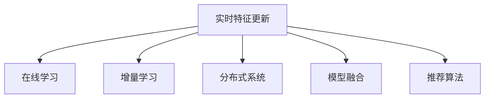

                 

## 1. 背景介绍

### 1.1 问题由来

在当前的数字经济时代，搜索引擎和推荐系统成为各大平台提升用户体验和商业价值的利器。无论是Google、Bing、还是国内的百度、抖音、阿里，搜索推荐技术的优化和创新，都直接决定了平台的用户粘性和收入水平。因此，如何高效、精准地为用户推荐内容，成为了各大公司的核心竞争力。

传统上，搜索推荐系统通常使用静态模型进行推荐。即在预定的间隔时间（如每小时或每天）更新模型，将当前最新的用户行为数据输入到模型中，重新训练得到新的模型，然后用新的模型进行推荐。这种方法在资源有限的情况下表现尚可，但随着数据量的快速增长，以及用户行为的瞬息万变，静态模型已经难以满足实时推荐的需求。

为了解决这个问题，实时特征更新技术应运而生。这种技术通过不断在线更新模型，捕捉用户行为的最新变化，保持推荐模型的动态性和实时性，从而极大提升了推荐效果和用户体验。

### 1.2 问题核心关键点

实时特征更新技术的主要核心点包括：

- **实时性**：模型参数和特征值在线更新，保持推荐内容的即时性。
- **动态性**：能够根据用户行为实时调整推荐策略，提升推荐精准度。
- **稳定性**：在频繁更新过程中，保持推荐系统的稳定性和鲁棒性。
- **可扩展性**：可以应对大规模数据和高并发流量，支持横向扩展。

## 2. 核心概念与联系

### 2.1 核心概念概述

为更好地理解实时特征更新技术，本节将介绍几个密切相关的核心概念：

- **实时特征更新**：指在用户行为数据不断变化的情况下，实时地更新模型参数和特征值，以捕捉用户行为的最新变化。
- **在线学习**：指模型在运行过程中，不断接收新的数据，并在线更新参数的过程。
- **增量学习**：指模型通过更新增量的数据，而非全部历史数据，进行模型更新的一种学习方式。
- **分布式系统**：指将模型的计算和存储分散在多个节点上，以应对大规模数据和高并发流量的需求。
- **模型融合**：指将多个模型进行融合，以提高推荐系统的稳定性和鲁棒性。
- **推荐算法**：包括基于协同过滤、内容过滤、混合过滤等不同策略的推荐算法。

这些核心概念之间的逻辑关系可以通过以下Mermaid流程图来展示：



这个流程图展示了许多实时特征更新技术涉及的概念及其之间的联系：

1. 实时特征更新是整个技术体系的核心，通过实时捕捉用户行为的最新变化，更新模型参数和特征值。
2. 在线学习与增量学习是实时特征更新的主要技术手段，保证模型在运行过程中不断学习新的数据。
3. 分布式系统是实现大规模数据处理和高并发流量的重要技术基础，支持实时特征更新的高效运行。
4. 模型融合通过将多个模型的预测结果进行综合，提升了系统的稳定性和鲁棒性。
5. 推荐算法提供了不同的推荐策略，以适应不同的业务需求和用户场景。

这些概念共同构成了实时特征更新技术的核心框架，使推荐系统能够实现高性能和高质量的推荐。

## 3. 核心算法原理 & 具体操作步骤

### 3.1 算法原理概述

实时特征更新技术的核心思想是：通过在线学习算法，实时地更新模型参数，以捕捉用户行为的最新变化。具体来说，假设推荐系统中的模型为 $M_{\theta}$，其中 $\theta$ 为模型的参数向量。在用户行为数据 $D$ 上，在线学习算法通过更新参数 $\theta$，使得模型的预测结果 $M_{\theta}(x)$ 能够更好地匹配用户的真实行为 $y$。

在线学习算法的一般框架可以表示为：

$$
\theta_{t+1} = \theta_t - \eta \nabla_{\theta} \ell(M_{\theta_t}(x), y)
$$

其中 $\eta$ 为学习率，$\nabla_{\theta} \ell(M_{\theta_t}(x), y)$ 为损失函数对模型参数的梯度，$M_{\theta_t}(x)$ 为模型在时间步 $t$ 对输入 $x$ 的预测结果。

### 3.2 算法步骤详解

实时特征更新算法通常包括以下几个关键步骤：

**Step 1: 特征提取**

在线学习算法的首要任务是提取实时特征，将用户当前的行为数据转化为模型可以利用的特征。这些特征通常包括用户的浏览历史、点击行为、评分记录等。

**Step 2: 模型预测**

将提取的实时特征输入到推荐模型中，得到对用户当前行为的预测结果。在模型预测过程中，可以选择不同的推荐算法进行计算，如基于协同过滤的MF（Matrix Factorization）、基于内容的CB（Collaborative Filtering）、基于混合过滤的PR（Personalized Ranking）等。

**Step 3: 计算损失**

根据用户的行为实际结果，计算预测结果与实际结果之间的差异，得到损失函数值。常见的损失函数包括均方误差、交叉熵等。

**Step 4: 更新参数**

根据损失函数值，计算模型参数的梯度，使用梯度下降等优化算法更新模型参数。更新后的模型将对下一轮用户行为进行预测。

**Step 5: 模型融合**

将多个模型的预测结果进行融合，通过加权平均、投票等方法提高预测的稳定性。融合后的结果用于最终的推荐输出。

**Step 6: 反馈迭代**

实时特征更新是一个迭代过程，在不断接收新的数据并更新模型参数的同时，根据反馈结果不断调整预测策略，优化推荐效果。

### 3.3 算法优缺点

实时特征更新技术具有以下优点：

1. **实时性**：能够及时捕捉用户行为的最新变化，提供即时的推荐服务。
2. **动态性**：能够根据用户行为实时调整推荐策略，提升推荐精准度。
3. **扩展性**：可以应对大规模数据和高并发流量，支持横向扩展。
4. **灵活性**：不同的推荐算法可以灵活组合使用，适应不同业务场景。

同时，该技术也存在一定的局限性：

1. **计算成本高**：实时更新需要频繁计算梯度和更新参数，计算成本较高。
2. **数据偏差**：实时特征的提取和处理可能存在偏差，影响模型效果。
3. **模型鲁棒性**：模型更新过程中，可能会引入噪声和异常值，影响模型鲁棒性。
4. **系统复杂性**：分布式系统和高并发的引入，使得系统设计和实现变得更加复杂。

尽管存在这些局限性，实时特征更新技术仍然是当前推荐系统中的重要趋势，被各大平台广泛应用于实时推荐、个性化推荐等领域。

### 3.4 算法应用领域

实时特征更新技术在推荐系统中具有广泛的应用，包括但不限于以下领域：

- **实时推荐**：在电商、新闻、视频等领域，提供即时性的推荐服务。
- **个性化推荐**：根据用户的历史行为和实时数据，提供个性化的商品、新闻、视频等内容推荐。
- **用户行为分析**：通过实时分析用户行为数据，发现用户兴趣的变化趋势，优化推荐策略。
- **广告推荐**：在广告投放中，实时调整广告投放策略，提高广告效果。
- **内容审核**：通过实时检测用户行为，识别和过滤有害内容，保障用户安全。

除了推荐系统，实时特征更新技术还在金融风险管理、医疗诊断、交通管理等领域得到广泛应用，成为提升系统性能和用户体验的重要手段。

## 4. 数学模型和公式 & 详细讲解  
### 4.1 数学模型构建

本节将使用数学语言对实时特征更新技术进行更加严格的刻画。

假设推荐系统中的模型为 $M_{\theta}$，其中 $\theta$ 为模型的参数向量。给定用户行为数据 $D=\{(x_i,y_i)\}_{i=1}^N$，在线学习算法的目标是最小化经验风险：

$$
\mathcal{L}(\theta) = \frac{1}{N} \sum_{i=1}^N \ell(M_{\theta}(x_i),y_i)
$$

其中 $\ell$ 为损失函数，$x_i$ 为第 $i$ 个用户的实时行为特征，$y_i$ 为用户的行为实际结果。

在线学习算法的优化目标是最小化经验风险：

$$
\theta^* = \mathop{\arg\min}_{\theta} \mathcal{L}(\theta)
$$

在实践中，我们通常使用梯度下降等优化算法来近似求解上述最优化问题。设 $\eta$ 为学习率，则参数的更新公式为：

$$
\theta \leftarrow \theta - \eta \nabla_{\theta}\mathcal{L}(\theta)
$$

其中 $\nabla_{\theta}\mathcal{L}(\theta)$ 为损失函数对参数 $\theta$ 的梯度，可通过反向传播算法高效计算。

### 4.2 公式推导过程

以下我们以均方误差损失为例，推导实时特征更新过程的数学公式。

假设用户行为数据 $D=\{(x_i,y_i)\}_{i=1}^N$，其中 $x_i$ 为第 $i$ 个用户的实时行为特征，$y_i$ 为用户的行为实际结果。设推荐模型为 $M_{\theta}$，其中 $\theta$ 为模型参数。

均方误差损失函数定义为：

$$
\ell(M_{\theta}(x_i),y_i) = \frac{1}{2}(M_{\theta}(x_i) - y_i)^2
$$

则经验风险为：

$$
\mathcal{L}(\theta) = \frac{1}{2N} \sum_{i=1}^N (M_{\theta}(x_i) - y_i)^2
$$

根据梯度下降算法，参数 $\theta$ 的更新公式为：

$$
\theta \leftarrow \theta - \eta \nabla_{\theta}\mathcal{L}(\theta)
$$

将均方误差损失代入，得：

$$
\theta \leftarrow \theta - \eta \sum_{i=1}^N (M_{\theta}(x_i) - y_i)(x_i)
$$

在实践中，我们通常将梯度计算拆分为两个部分：

1. **增量梯度计算**：对每个用户行为数据 $(x_i,y_i)$，计算梯度 $\frac{\partial}{\partial \theta} \ell(M_{\theta}(x_i),y_i)$，并使用增量更新公式：

$$
\theta \leftarrow \theta - \eta \frac{\partial}{\partial \theta} \ell(M_{\theta}(x_i),y_i)
$$

2. **分布式梯度计算**：将用户行为数据 $D$ 均匀分配到多个节点上，每个节点计算本地梯度 $\frac{\partial}{\partial \theta} \ell(M_{\theta}(x_i),y_i)$，并将本地梯度进行聚合，更新全局参数 $\theta$。

将增量梯度计算和分布式梯度计算结合，即可实现实时特征更新算法。

### 4.3 案例分析与讲解

**案例分析**：

假设一个电商平台的实时推荐系统，用户在浏览商品时会产生实时点击行为数据。该系统使用MF算法进行推荐，MF模型的参数向量 $\theta = \{p,q\}$，其中 $p$ 为用户兴趣向量，$q$ 为商品特征向量。

**讲解**：

1. **特征提取**：实时提取用户浏览的商品ID、浏览时间、浏览时长等特征，并转化为MF模型可用的数值型特征。
2. **模型预测**：将提取的特征输入到MF模型中，得到对用户当前行为的预测结果。
3. **计算损失**：根据用户的实际点击行为，计算预测结果与实际行为之间的均方误差损失。
4. **更新参数**：使用梯度下降算法，更新MF模型的参数向量 $\theta$。
5. **模型融合**：将多个MF模型的预测结果进行加权平均，输出最终的推荐结果。

**具体计算过程**：

假设用户浏览了5个商品，MF模型的预测结果与实际点击行为如表1所示。

| 商品ID | 预测结果 | 实际点击 | 均方误差 |
|--------|----------|----------|----------|
| 1      | 0.8      | 0        | 0.2      |
| 2      | 0.9      | 1        | 0.1      |
| 3      | 0.7      | 1        | 0.2      |
| 4      | 0.6      | 0        | 0.4      |
| 5      | 0.5      | 1        | 0.5      |

设MF模型的参数向量为 $\theta = (p,q)$，则均方误差损失为：

$$
\mathcal{L}(\theta) = \frac{1}{5} [(0.8 - 0)^2 + (0.9 - 1)^2 + (0.7 - 1)^2 + (0.6 - 0)^2 + (0.5 - 1)^2]
$$

计算梯度：

$$
\nabla_{\theta}\mathcal{L}(\theta) = \frac{\partial}{\partial p} \mathcal{L}(\theta) \cdot p + \frac{\partial}{\partial q} \mathcal{L}(\theta) \cdot q
$$

其中：

$$
\frac{\partial}{\partial p} \mathcal{L}(\theta) = \frac{1}{5} [2(0.8 - 0) - 2(0.9 - 1) - 2(0.7 - 1) - 2(0.6 - 0) + 2(0.5 - 1)]
$$

$$
\frac{\partial}{\partial q} \mathcal{L}(\theta) = \frac{1}{5} [-2(0.8 - 0)^2 - 2(0.9 - 1)^2 + 2(0.7 - 1)^2 - 2(0.6 - 0)^2 + 2(0.5 - 1)^2]
$$

更新参数：

$$
p \leftarrow p - \eta \cdot \frac{\partial}{\partial p} \mathcal{L}(\theta)
$$

$$
q \leftarrow q - \eta \cdot \frac{\partial}{\partial q} \mathcal{L}(\theta)
$$

## 5. 项目实践：代码实例和详细解释说明

### 5.1 开发环境搭建

在进行实时特征更新实践前，我们需要准备好开发环境。以下是使用Python进行PyTorch开发的环境配置流程：

1. 安装Anaconda：从官网下载并安装Anaconda，用于创建独立的Python环境。

2. 创建并激活虚拟环境：
```bash
conda create -n pytorch-env python=3.8 
conda activate pytorch-env
```

3. 安装PyTorch：根据CUDA版本，从官网获取对应的安装命令。例如：
```bash
conda install pytorch torchvision torchaudio cudatoolkit=11.1 -c pytorch -c conda-forge
```

4. 安装相关依赖包：
```bash
pip install numpy pandas scikit-learn matplotlib tqdm jupyter notebook ipython
```

完成上述步骤后，即可在`pytorch-env`环境中开始实时特征更新实践。

### 5.2 源代码详细实现

下面是使用PyTorch实现实时特征更新的代码实例。

假设我们有一个电商平台，需要实时推荐商品给用户。假设推荐模型为MF模型，MF模型的参数向量为 $\theta = \{p,q\}$。

```python
import torch
import torch.nn as nn
import torch.optim as optim

class MFModel(nn.Module):
    def __init__(self, num_users, num_items, embedding_dim):
        super(MFModel, self).__init__()
        self.p = nn.Embedding(num_users, embedding_dim)
        self.q = nn.Embedding(num_items, embedding_dim)
        
    def forward(self, user_ids, item_ids):
        p = self.p(user_ids)
        q = self.q(item_ids)
        pred = torch.matmul(p, q.t())  # 预测评分
        return pred

# 初始化MF模型
num_users = 1000
num_items = 10000
embedding_dim = 50
mf = MFModel(num_users, num_items, embedding_dim)

# 初始化模型参数
optimizer = optim.Adam(mf.parameters(), lr=0.01)

# 模拟用户点击行为数据
num_samples = 10000
user_ids = torch.randint(0, num_users, (num_samples,))
item_ids = torch.randint(0, num_items, (num_samples,))
clicks = torch.randint(0, 2, (num_samples,))
labels = clicks.view(-1)

# 计算均方误差损失
loss_fn = nn.MSELoss()
loss = loss_fn(mf(user_ids, item_ids), labels)

# 更新MF模型参数
optimizer.zero_grad()
loss.backward()
optimizer.step()

# 输出MF模型参数
mf_p = mf.p.weight.data
mf_q = mf.q.weight.data
print('p:', mf_p)
print('q:', mf_q)
```

### 5.3 代码解读与分析

让我们再详细解读一下关键代码的实现细节：

**MFModel类**：
- `__init__`方法：初始化MF模型的用户和商品嵌入矩阵。
- `forward`方法：计算MF模型对输入数据的预测评分。

**损失函数和优化器**：
- 使用均方误差损失函数计算MF模型的预测评分与实际点击行为之间的误差。
- 使用Adam优化器进行参数更新，学习率为0.01。

**模拟用户点击行为数据**：
- 生成模拟的用户ID、商品ID和点击行为数据。
- 将点击行为数据转化为标签，用于计算损失函数。

**模型更新**：
- 计算MF模型的预测评分，并使用均方误差损失函数计算误差。
- 使用优化器更新MF模型参数。

**输出MF模型参数**：
- 输出MF模型的用户和商品嵌入矩阵。

## 6. 实际应用场景

### 6.1 实时推荐

实时推荐系统可以广泛应用于电商、新闻、视频等领域，提供即时性的推荐服务。例如，淘宝推荐系统在用户浏览商品时，可以实时捕捉用户点击行为，并根据点击行为数据更新推荐模型，实现实时推荐。

具体而言，淘宝推荐系统可以使用实时特征更新技术，捕捉用户浏览商品时的点击行为数据，实时更新MF模型的用户和商品嵌入矩阵，生成实时推荐结果。这使得推荐系统能够及时捕捉用户的最新兴趣，提升推荐效果和用户体验。

### 6.2 个性化推荐

个性化推荐系统可以根据用户的历史行为和实时数据，提供个性化的商品、新闻、视频等内容推荐。例如，Netflix推荐系统可以根据用户的观看历史和实时观看行为，实时更新MF模型的用户和内容嵌入矩阵，生成个性化推荐结果。

具体而言，Netflix推荐系统可以使用实时特征更新技术，捕捉用户的观看历史和实时观看行为，实时更新MF模型的用户和内容嵌入矩阵，生成个性化推荐结果。这使得推荐系统能够根据用户的历史兴趣和实时行为，提供个性化的推荐服务，提升用户的满意度和忠诚度。

### 6.3 用户行为分析

用户行为分析系统可以通过实时分析用户行为数据，发现用户兴趣的变化趋势，优化推荐策略。例如，Amazon用户行为分析系统可以实时捕捉用户的浏览和购买行为，并根据行为数据更新MF模型的用户和商品嵌入矩阵，发现用户的兴趣变化趋势，优化推荐策略。

具体而言，Amazon用户行为分析系统可以使用实时特征更新技术，捕捉用户的浏览和购买行为数据，实时更新MF模型的用户和商品嵌入矩阵，发现用户的兴趣变化趋势，优化推荐策略。这使得用户行为分析系统能够及时捕捉用户的最新兴趣，优化推荐策略，提升推荐效果。

### 6.4 广告推荐

广告推荐系统可以在广告投放中，实时调整广告投放策略，提高广告效果。例如，Google AdWords推荐系统可以实时捕捉用户的搜索行为，并根据行为数据更新MF模型的用户和广告嵌入矩阵，生成广告推荐结果。

具体而言，Google AdWords推荐系统可以使用实时特征更新技术，捕捉用户的搜索行为数据，实时更新MF模型的用户和广告嵌入矩阵，生成广告推荐结果。这使得广告推荐系统能够根据用户的实时行为，实时调整广告投放策略，提高广告效果和转化率。

### 6.5 内容审核

内容审核系统可以通过实时检测用户行为，识别和过滤有害内容，保障用户安全。例如，YouTube内容审核系统可以实时捕捉用户的观看行为和评论行为，并根据行为数据更新MF模型的用户和内容嵌入矩阵，识别有害评论内容，进行过滤。

具体而言，YouTube内容审核系统可以使用实时特征更新技术，捕捉用户的观看行为和评论行为数据，实时更新MF模型的用户和内容嵌入矩阵，识别有害评论内容，进行过滤。这使得内容审核系统能够及时捕捉有害内容，保障用户安全，提升平台的用户体验。

## 7. 工具和资源推荐

### 7.1 学习资源推荐

为了帮助开发者系统掌握实时特征更新技术的理论基础和实践技巧，这里推荐一些优质的学习资源：

1. 《机器学习实战》系列博文：由大模型技术专家撰写，深入浅出地介绍了实时特征更新技术的基本原理和实践技巧。

2. 《深度学习》课程：斯坦福大学开设的深度学习课程，涵盖深度学习的基本概念和经典模型，是入门深度学习的必备资料。

3. 《在线机器学习》书籍：李宏毅博士所著，详细介绍了在线学习算法的基本原理和应用场景，是了解在线学习的经典教材。

4. 《PyTorch官方文档》：PyTorch官方文档，提供了海量预训练模型和完整的微调样例代码，是上手实践的必备资料。

5. Kaggle在线竞赛平台：Kaggle提供大量数据集和机器学习竞赛，是实践实时特征更新技术的绝佳平台。

通过对这些资源的学习实践，相信你一定能够快速掌握实时特征更新技术的精髓，并用于解决实际的推荐系统问题。

### 7.2 开发工具推荐

高效的开发离不开优秀的工具支持。以下是几款用于实时特征更新开发的常用工具：

1. PyTorch：基于Python的开源深度学习框架，灵活动态的计算图，适合快速迭代研究。大部分预训练语言模型都有PyTorch版本的实现。

2. TensorFlow：由Google主导开发的开源深度学习框架，生产部署方便，适合大规模工程应用。同样有丰富的预训练语言模型资源。

3. Weights & Biases：模型训练的实验跟踪工具，可以记录和可视化模型训练过程中的各项指标，方便对比和调优。与主流深度学习框架无缝集成。

4. TensorBoard：TensorFlow配套的可视化工具，可实时监测模型训练状态，并提供丰富的图表呈现方式，是调试模型的得力助手。

5. Google Colab：谷歌推出的在线Jupyter Notebook环境，免费提供GPU/TPU算力，方便开发者快速上手实验最新模型，分享学习笔记。

合理利用这些工具，可以显著提升实时特征更新任务的开发效率，加快创新迭代的步伐。

### 7.3 相关论文推荐

实时特征更新技术的发展源于学界的持续研究。以下是几篇奠基性的相关论文，推荐阅读：

1. 《在线学习：算法与系统》（Online Learning: Algorithms and Systems）：由在线学习领域的权威专家撰写，全面介绍了在线学习的基本原理和经典算法。

2. 《分布式在线学习》（Distributed Online Learning）：介绍分布式在线学习的算法和系统，是实现大规模在线学习的必备参考资料。

3. 《实时特征更新技术》（Real-time Feature Update Techniques）：介绍实时特征更新的基本原理和应用场景，是了解实时特征更新的经典教材。

4. 《深度学习在推荐系统中的应用》（Deep Learning for Recommendation Systems）：介绍深度学习在推荐系统中的应用，涵盖了多种推荐算法和实时特征更新技术。

这些论文代表了大模型微调技术的发展脉络。通过学习这些前沿成果，可以帮助研究者把握学科前进方向，激发更多的创新灵感。

## 8. 总结：未来发展趋势与挑战

### 8.1 总结

本文对实时特征更新技术进行了全面系统的介绍。首先阐述了实时特征更新技术的背景和意义，明确了实时特征更新技术在推荐系统中的重要性。其次，从原理到实践，详细讲解了实时特征更新的数学原理和关键步骤，给出了实时特征更新任务开发的完整代码实例。同时，本文还广泛探讨了实时特征更新技术在推荐系统中的多个应用场景，展示了实时特征更新的广泛应用前景。此外，本文精选了实时特征更新技术的各类学习资源，力求为读者提供全方位的技术指引。

通过本文的系统梳理，可以看到，实时特征更新技术在推荐系统中的应用前景广阔，通过不断更新模型参数和特征值，捕捉用户行为的最新变化，实时推荐系统能够提供即时的推荐服务，个性化推荐系统能够根据用户的历史行为和实时数据，提供个性化的推荐内容，用户行为分析系统能够及时捕捉用户的最新兴趣，优化推荐策略，广告推荐系统能够根据用户的实时行为，实时调整广告投放策略，内容审核系统能够及时捕捉有害内容，保障用户安全。相信随着技术的不断演进，实时特征更新技术必将在推荐系统中发挥更加重要的作用。

### 8.2 未来发展趋势

展望未来，实时特征更新技术将呈现以下几个发展趋势：

1. **分布式计算**：实时特征更新技术的计算开销将随着数据量的增大而不断增加。分布式计算技术将使得实时特征更新技术能够应对大规模数据和高并发流量的挑战，支持横向扩展。

2. **实时数据流处理**：实时特征更新技术将与实时数据流处理技术相结合，实现数据的实时分析和处理，进一步提升推荐系统的实时性和动态性。

3. **多模型融合**：实时特征更新技术将与其他推荐算法相结合，形成多模型融合的推荐系统，提升推荐的稳定性和鲁棒性。

4. **跨领域知识融合**：实时特征更新技术将与跨领域知识图谱、规则库等专家知识相结合，形成更加全面、准确的信息整合能力，提升推荐系统的性能。

5. **用户反馈机制**：实时特征更新技术将引入用户反馈机制，根据用户对推荐结果的反馈，动态调整推荐策略，优化推荐效果。

6. **隐私保护机制**：实时特征更新技术将引入隐私保护机制，如差分隐私、联邦学习等，保障用户数据的隐私和安全。

以上趋势凸显了实时特征更新技术的广阔前景。这些方向的探索发展，必将进一步提升推荐系统的性能和用户体验，为推荐系统的发展注入新的动力。

### 8.3 面临的挑战

尽管实时特征更新技术已经取得了瞩目成就，但在迈向更加智能化、普适化应用的过程中，它仍面临着诸多挑战：

1. **计算成本高**：实时特征更新需要频繁计算梯度和更新参数，计算成本较高。如何在保证实时性的同时，降低计算成本，是一个重要的挑战。

2. **数据偏差**：实时特征的提取和处理可能存在偏差，影响模型效果。如何减少数据偏差，提高模型的鲁棒性，还需要更多理论和实践的积累。

3. **系统复杂性**：实时特征更新技术的系统设计和实现变得更加复杂，如何确保系统的稳定性和可扩展性，是一个重要的问题。

4. **隐私保护**：实时特征更新技术需要实时捕捉用户行为数据，如何保障用户数据的隐私和安全，也是一个重要的挑战。

5. **异构数据处理**：实时特征更新技术需要处理多种异构数据，如何高效处理和融合不同类型的数据，也是一个重要的研究方向。

6. **系统可靠性**：实时特征更新技术需要保证系统的可靠性，避免由于网络抖动、设备故障等原因导致的系统异常。

正视实时特征更新面临的这些挑战，积极应对并寻求突破，将是大模型微调技术走向成熟的必由之路。相信随着学界和产业界的共同努力，这些挑战终将一一被克服，实时特征更新技术必将在推荐系统中发挥更加重要的作用。

### 8.4 研究展望

未来，实时特征更新技术的研究将在以下几个方向上取得新的突破：

1. **自适应学习算法**：开发更加自适应的在线学习算法，能够自动调整学习率和学习策略，进一步提升实时特征更新技术的性能。

2. **增量数据处理方法**：研究更加高效的增量数据处理算法，减少数据处理开销，提升实时特征更新技术的实时性。

3. **模型压缩与优化**：开发更加高效的模型压缩与优化方法，提升实时特征更新技术的计算效率和资源利用率。

4. **多模态数据融合**：研究如何将多模态数据（如文本、图像、音频等）融合到实时特征更新技术中，提升推荐系统的综合性能。

5. **分布式系统优化**：研究更加高效的分布式系统架构，支持实时特征更新技术的横向扩展和弹性伸缩。

6. **模型解释性**：研究如何提升实时特征更新技术的可解释性，使其更加透明、可信。

7. **跨领域知识整合**：研究如何跨领域整合知识图谱、规则库等专家知识，提升实时特征更新技术的泛化能力和鲁棒性。

8. **隐私保护技术**：研究如何引入差分隐私、联邦学习等隐私保护技术，保障用户数据的隐私和安全。

这些研究方向的探索，必将引领实时特征更新技术迈向更高的台阶，为推荐系统的发展提供更加坚实的技术基础。相信随着技术的不断演进，实时特征更新技术必将在推荐系统中发挥更加重要的作用，推动推荐系统的持续创新和发展。

## 9. 附录：常见问题与解答

**Q1：实时特征更新是否适用于所有推荐系统？**

A: 实时特征更新技术在大多数推荐系统中都能取得不错的效果，特别是在实时推荐和个性化推荐场景中。但对于一些静态推荐系统，实时特征更新技术可能并不适用。需要根据具体的推荐场景和业务需求进行评估。

**Q2：实时特征更新对计算资源的需求有哪些？**

A: 实时特征更新需要频繁计算梯度和更新参数，计算成本较高。需要高性能的计算资源，如GPU、TPU等，以支持高效的在线学习。同时，分布式计算和多模型融合也需要相应的硬件和软件支持。

**Q3：实时特征更新在实际应用中需要注意哪些问题？**

A: 实时特征更新在实际应用中需要注意以下问题：
1. 系统设计和实现：需要合理设计系统架构，避免单点故障和性能瓶颈。
2. 数据处理和预处理：需要高效处理和清洗数据，减少数据偏差和噪声。
3. 模型压缩与优化：需要开发高效的模型压缩与优化方法，减少计算开销和内存占用。
4. 隐私保护：需要引入隐私保护技术，保障用户数据的隐私和安全。

**Q4：实时特征更新在推荐系统中的效果如何？**

A: 实时特征更新在推荐系统中的效果非常显著。通过实时更新模型参数和特征值，捕捉用户行为的最新变化，实时推荐系统能够提供即时的推荐服务，个性化推荐系统能够根据用户的历史行为和实时数据，提供个性化的推荐内容，提升推荐效果和用户体验。

**Q5：实时特征更新技术与其他推荐技术如何结合？**

A: 实时特征更新技术可以与其他推荐技术相结合，形成更加全面、准确的推荐系统。例如，可以将实时特征更新技术与协同过滤、内容过滤、混合过滤等推荐算法结合，提高推荐系统的稳定性和鲁棒性。

通过以上系统介绍，我们全面理解了实时特征更新技术的原理、步骤和应用场景。相信通过不断的探索和实践，实时特征更新技术必将在推荐系统中发挥更大的作用，推动推荐系统的持续创新和发展。

---

作者：禅与计算机程序设计艺术 / Zen and the Art of Computer Programming

