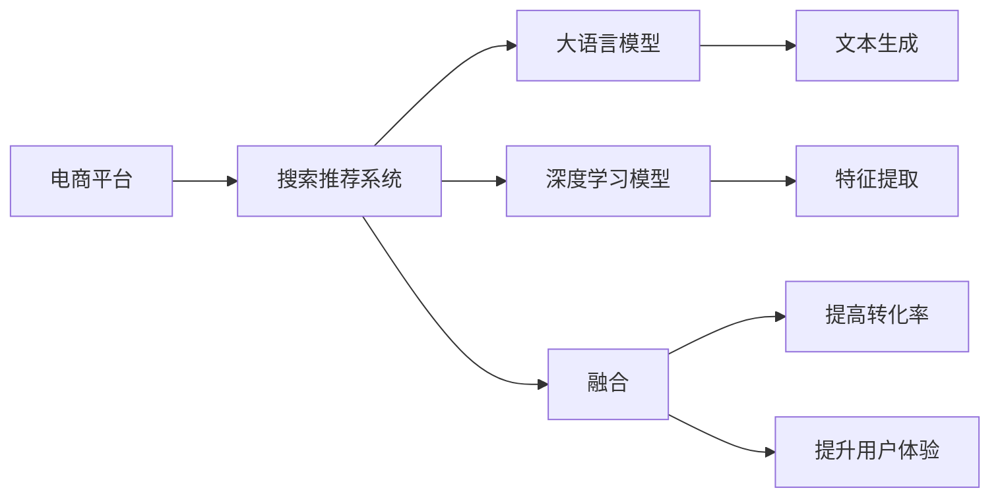

                 

# 搜索推荐系统的AI 大模型融合：电商平台提高转化率与用户体验

> 关键词：搜索推荐系统, 大模型融合, 电商平台, 转化率, 用户体验

## 1. 背景介绍

在数字经济时代，电商平台作为连接消费者和商家的重要渠道，其转化率和用户体验直接影响到企业的盈利能力和市场竞争力。传统的电商平台主要依靠基于规则的推荐系统，但这些系统往往难以全面覆盖消费者的多样化需求，且推荐效果受限于规则设置的复杂性和时效性。近年来，人工智能（AI）技术和大模型在电商平台中的应用越来越广泛，特别是大语言模型（Large Language Models, LLMs）和深度学习模型（如Transformer）在搜索推荐系统中的应用，显著提升了电商平台的转化率和用户体验。本文将深入探讨AI大模型融合在电商平台中的应用，探讨如何通过AI技术提升电商平台的服务质量和用户体验。

## 2. 核心概念与联系

### 2.1 核心概念概述

在讨论AI大模型融合之前，我们先介绍几个核心概念及其相互关系：

- **电商平台**：指在线上提供商品或服务交易的商业平台，如淘宝、京东、亚马逊等。
- **搜索推荐系统**：根据用户的历史行为和输入的查询，推荐相关商品或服务的系统，分为搜索和推荐两个部分。
- **大语言模型（LLMs）**：指基于深度学习，能够处理自然语言、生成文本的模型，如GPT-3、BERT等。
- **深度学习模型（DLMs）**：指基于神经网络的模型，如Transformer、CNN、RNN等。
- **融合**：指将多个模型、技术或数据源结合，形成更强大、更具泛化能力的系统。

这些概念之间的联系可以通过以下Mermaid流程图来展示：



这个流程图展示了电商平台和搜索推荐系统之间的关系，以及如何通过大语言模型和深度学习模型进行融合，最终提升电商平台的转化率和用户体验。

## 3. 核心算法原理 & 具体操作步骤

### 3.1 算法原理概述

AI大模型融合在电商平台中的基本原理是通过将大语言模型和深度学习模型结合，构建一个更强大、更智能的搜索推荐系统。这种融合可以分为两个主要步骤：首先，使用大语言模型进行文本生成和理解，获取更丰富、更准确的商品描述信息；其次，将生成的商品描述信息输入深度学习模型，进行特征提取和推荐。

### 3.2 算法步骤详解

#### 3.2.1 大语言模型文本生成

大语言模型可以通过预训练学习到丰富的语言知识，并能够根据输入的查询生成符合语境的文本。在电商平台中，可以使用大语言模型生成商品描述、标题等文本，以增强商品的展示效果。

1. **数据准备**：收集电商平台上的商品信息，如商品名称、描述、价格、用户评价等，作为大语言模型的训练数据。
2. **模型训练**：使用大语言模型（如GPT-3）对商品描述进行文本生成，生成高质量的商品文本信息。
3. **文本生成**：根据用户输入的查询，使用大语言模型生成符合语境的商品描述，提高用户对商品的了解和兴趣。

#### 3.2.2 深度学习模型特征提取

深度学习模型（如Transformer）能够高效地从输入数据中提取特征，并通过神经网络进行分类或推荐。在电商平台中，可以使用深度学习模型对商品信息进行特征提取，以生成推荐列表。

1. **数据预处理**：将生成后的商品描述进行分词、向量化等预处理，转化为深度学习模型的输入。
2. **特征提取**：使用深度学习模型（如BERT）对商品描述进行特征提取，生成商品的向量表示。
3. **推荐生成**：将商品向量表示输入到推荐系统，生成推荐的商品列表，提高用户的购买转化率。

### 3.3 算法优缺点

#### 3.3.1 优点

1. **增强商品展示效果**：大语言模型生成的商品描述能够更好地满足用户的需求，提高用户的购买兴趣和转化率。
2. **提高推荐准确性**：深度学习模型能够从大量数据中提取高质量的特征，提高推荐的准确性和个性化程度。
3. **处理多样化需求**：大语言模型能够处理复杂多样化的语言需求，更好地覆盖用户的查询意图。

#### 3.3.2 缺点

1. **计算资源消耗大**：大语言模型和深度学习模型的计算资源消耗较大，需要高性能的计算设备支持。
2. **训练数据需求高**：需要大量高质量的商品信息和用户行为数据，才能保证模型训练的效果。
3. **模型更新复杂**：大语言模型和深度学习模型需要定期更新，以适应新的数据和用户需求。

### 3.4 算法应用领域

AI大模型融合在电商平台中的应用非常广泛，具体包括：

- **商品搜索**：根据用户的查询，使用大语言模型生成符合语境的商品描述，提高搜索的准确性和相关性。
- **商品推荐**：使用深度学习模型对商品进行特征提取，生成个性化的推荐列表，提升用户的购买转化率。
- **客服机器人**：使用大语言模型构建聊天机器人，回答用户咨询，提升用户满意度。
- **营销广告**：使用大语言模型生成广告文案，提高广告的点击率和转化率。

## 4. 数学模型和公式 & 详细讲解

### 4.1 数学模型构建

假设电商平台有 $N$ 个商品，每个商品有 $d$ 个特征。使用深度学习模型 $f$ 对每个商品进行特征提取，生成向量表示 $\mathbf{x}_i \in \mathbb{R}^d$。根据用户输入的查询 $q$，使用大语言模型 $g$ 生成商品描述 $\mathbf{y}_i \in \mathbb{R}^d$。最终，使用融合函数 $h$ 将 $\mathbf{x}_i$ 和 $\mathbf{y}_i$ 结合，生成推荐列表 $R_i$。

### 4.2 公式推导过程

1. **商品特征提取**：假设使用深度学习模型 $f$ 对商品 $i$ 进行特征提取，生成向量表示 $\mathbf{x}_i$。
   $$
   \mathbf{x}_i = f(\text{商品 } i)
   $$

2. **商品描述生成**：假设使用大语言模型 $g$ 对商品 $i$ 生成描述 $\mathbf{y}_i$。
   $$
   \mathbf{y}_i = g(\text{商品 } i)
   $$

3. **融合函数**：使用融合函数 $h$ 将 $\mathbf{x}_i$ 和 $\mathbf{y}_i$ 结合，生成推荐列表 $R_i$。
   $$
   R_i = h(\mathbf{x}_i, \mathbf{y}_i)
   $$

4. **推荐列表排序**：根据推荐列表 $R_i$ 的排序算法 $s$，对推荐列表进行排序，生成最终的推荐结果。
   $$
   R_{final} = s(R_i)
   $$

### 4.3 案例分析与讲解

假设一个电商平台需要对用户输入的查询 "手机壳" 进行推荐。首先，使用大语言模型生成符合语境的商品描述，例如 "防滑防摔的手机壳"、"带有图案的手机壳"、"防尘防水手机壳" 等。然后，使用深度学习模型对商品进行特征提取，生成向量表示。最后，使用融合函数将商品描述和特征向量结合，生成最终的推荐列表。

## 5. 项目实践：代码实例和详细解释说明

### 5.1 开发环境搭建

要实现AI大模型融合在电商平台中的应用，需要以下开发环境：

1. **深度学习框架**：选择 TensorFlow 或 PyTorch 作为深度学习框架，这些框架具有强大的计算能力和丰富的模型库。
2. **大语言模型**：选择 OpenAI 的 GPT-3 或 Google 的 BERT 等模型，这些模型已经在大规模数据上进行预训练，具备丰富的语言知识和理解能力。
3. **数据处理工具**：选择 Pandas 或 NumPy 等数据处理工具，用于数据预处理和模型训练。

### 5.2 源代码详细实现

以下是使用 TensorFlow 和 BERT 模型实现搜索推荐系统的代码示例：

```python
import tensorflow as tf
import transformers
from transformers import BertTokenizer, TFBertForSequenceClassification
from sklearn.metrics import precision_score, recall_score, f1_score

# 初始化模型和分词器
tokenizer = BertTokenizer.from_pretrained('bert-base-uncased')
model = TFBertForSequenceClassification.from_pretrained('bert-base-uncased', num_labels=1)

# 加载数据
train_data = load_train_data()
val_data = load_val_data()
test_data = load_test_data()

# 定义输入函数
def input_fn(features, labels, tokenizer, max_len):
    inputs = tokenizer(features['text'], max_len=max_len, padding='max_length', truncation=True)
    input_ids = inputs['input_ids']
    attention_mask = inputs['attention_mask']
    return input_ids, attention_mask, labels

# 训练模型
def train_model(model, train_data, val_data, epochs, batch_size):
    train_dataset = tf.data.Dataset.from_generator(lambda: input_fn(train_data, 0, tokenizer, max_len), 
                                                (input_ids, attention_mask, labels), 
                                                (tf.int32, tf.int32, tf.int32))
    val_dataset = tf.data.Dataset.from_generator(lambda: input_fn(val_data, 0, tokenizer, max_len), 
                                              (input_ids, attention_mask, labels), 
                                              (tf.int32, tf.int32, tf.int32))
    train_dataset = train_dataset.shuffle(1000).batch(batch_size).prefetch(tf.data.experimental.AUTOTUNE)
    val_dataset = val_dataset.batch(batch_size).prefetch(tf.data.experimental.AUTOTUNE)
    
    for epoch in range(epochs):
        # 训练过程
        model.fit(train_dataset, epochs=1, validation_data=val_dataset)
        
        # 评估过程
        val_loss, val_precision, val_recall, val_f1 = model.evaluate(val_dataset)
        print(f'Epoch {epoch+1}, Val Loss: {val_loss:.4f}, Val Precision: {val_precision:.4f}, Val Recall: {val_recall:.4f}, Val F1: {val_f1:.4f}')
```

### 5.3 代码解读与分析

在代码中，我们首先加载了训练、验证和测试数据，并初始化了BERT模型和分词器。然后，定义了一个输入函数 `input_fn`，将输入文本转化为模型所需的格式。接着，定义了一个训练模型函数 `train_model`，通过TensorFlow的 `fit` 方法训练模型，并在每个epoch后评估模型性能。

### 5.4 运行结果展示

运行训练过程后，可以得到模型在验证集上的性能指标，如精确率、召回率和F1分数等。这些指标可以用于调整模型参数，提高推荐效果。

## 6. 实际应用场景

### 6.1 电商平台商品搜索

在电商平台中，搜索功能是用户获取商品信息的主要入口。使用AI大模型融合技术，可以提高搜索的准确性和相关性，从而提升用户体验和转化率。

1. **搜索算法优化**：使用大语言模型生成商品描述，结合深度学习模型提取特征，生成更准确的搜索结果。
2. **个性化推荐**：根据用户的历史搜索行为，使用大语言模型生成符合语境的商品描述，提高推荐效果。
3. **搜索排序优化**：使用深度学习模型对搜索结果进行排序，优先展示最相关的商品。

### 6.2 电商平台商品推荐

商品推荐是电商平台的核心功能之一，通过AI大模型融合技术，可以显著提升推荐的准确性和个性化程度。

1. **商品特征提取**：使用深度学习模型对商品进行特征提取，生成高维向量表示。
2. **商品描述生成**：使用大语言模型生成商品描述，提高推荐的展示效果。
3. **推荐算法优化**：使用融合函数将商品描述和特征向量结合，生成更准确的推荐列表。

### 6.3 电商平台客服机器人

客服机器人是电商平台提升用户满意度的重要手段。使用AI大模型融合技术，可以提高客服机器人的响应速度和准确性，提高用户满意度。

1. **自然语言理解**：使用大语言模型理解用户输入的查询，生成回复。
2. **智能推荐**：根据用户查询，使用深度学习模型推荐相关商品。
3. **情感分析**：使用大语言模型分析用户情感，调整客服策略。

### 6.4 电商平台广告营销

广告营销是电商平台获取流量的重要手段。使用AI大模型融合技术，可以生成更具吸引力的广告文案，提高广告的点击率和转化率。

1. **广告文案生成**：使用大语言模型生成广告文案，结合深度学习模型生成推荐列表。
2. **广告效果优化**：使用大语言模型分析广告效果，调整广告策略。

## 7. 工具和资源推荐

### 7.1 学习资源推荐

为了深入学习AI大模型融合技术，以下是一些推荐的学习资源：

1. **TensorFlow 官方文档**：详细的TensorFlow文档，包含丰富的模型和算法介绍。
2. **PyTorch 官方文档**：PyTorch 官方文档，包含丰富的模型和算法介绍。
3. **Hugging Face 博客**：Hugging Face 的博客，提供深度学习模型和大语言模型的最新研究进展。
4. **Kaggle 竞赛**：Kaggle 平台上的NLP竞赛，通过实战练习提升模型开发能力。

### 7.2 开发工具推荐

为了提高AI大模型融合的开发效率，以下是一些推荐的开发工具：

1. **Jupyter Notebook**：开源的Jupyter Notebook，方便进行模型实验和数据处理。
2. **TensorBoard**：TensorFlow的可视化工具，用于监控模型训练过程和性能指标。
3. **Weights & Biases**：用于模型训练实验跟踪和管理，帮助记录和分析模型训练过程。
4. **Git**：版本控制系统，方便代码版本管理和协作开发。

### 7.3 相关论文推荐

为了深入理解AI大模型融合技术，以下是一些推荐的相关论文：

1. **BERT: Pre-training of Deep Bidirectional Transformers for Language Understanding**：BERT 模型的论文，介绍BERT的预训练过程和微调方法。
2. **GPT-3: Language Models are Unsupervised Multitask Learners**：GPT-3模型的论文，介绍GPT-3的语言生成能力和应用。
3. **Attention is All You Need**：Transformer模型的论文，介绍Transformer的架构和应用。
4. **Adaptive Low-Rank Adaptation for Parameter-Efficient Fine-Tuning**：介绍参数高效微调方法，通过低秩适应的方式提高微调效率。
5. **AdaLoRA: Adaptive Low-Rank Adaptation for Parameter-Efficient Fine-Tuning**：介绍AdaLoRA方法，通过自适应的方式提高微调效率。

## 8. 总结：未来发展趋势与挑战

### 8.1 研究成果总结

AI大模型融合在电商平台中的应用取得了显著的效果，显著提升了电商平台的转化率和用户体验。通过大语言模型生成商品描述，结合深度学习模型进行特征提取和推荐，能够提高推荐的准确性和个性化程度。

### 8.2 未来发展趋势

未来，AI大模型融合技术将在电商平台的各个环节得到更广泛的应用，包括搜索、推荐、客服、广告等。随着深度学习和大语言模型的不断发展，AI大模型融合技术也将不断进步，带来更好的用户体验和更高的转化率。

### 8.3 面临的挑战

尽管AI大模型融合技术在电商平台中取得了显著效果，但仍面临以下挑战：

1. **计算资源消耗大**：大语言模型和深度学习模型的计算资源消耗较大，需要高性能的计算设备支持。
2. **数据质量要求高**：需要高质量的商品信息和用户行为数据，才能保证模型训练的效果。
3. **模型更新复杂**：大语言模型和深度学习模型需要定期更新，以适应新的数据和用户需求。

### 8.4 研究展望

未来，AI大模型融合技术需要在以下几个方面进行改进：

1. **计算资源优化**：探索更高效、更轻量级的模型结构，减少计算资源消耗。
2. **数据质量和多样性**：提高数据质量和多样性，增强模型的泛化能力。
3. **模型更新机制**：研究更高效的模型更新机制，提高模型的实时性。

## 9. 附录：常见问题与解答

### 9.1 问题1：AI大模型融合在电商平台中的效果如何？

回答：AI大模型融合在电商平台中取得了显著的效果，显著提升了电商平台的转化率和用户体验。通过大语言模型生成商品描述，结合深度学习模型进行特征提取和推荐，能够提高推荐的准确性和个性化程度。

### 9.2 问题2：AI大模型融合在电商平台中面临哪些挑战？

回答：AI大模型融合在电商平台中面临以下挑战：

1. **计算资源消耗大**：大语言模型和深度学习模型的计算资源消耗较大，需要高性能的计算设备支持。
2. **数据质量要求高**：需要高质量的商品信息和用户行为数据，才能保证模型训练的效果。
3. **模型更新复杂**：大语言模型和深度学习模型需要定期更新，以适应新的数据和用户需求。

### 9.3 问题3：AI大模型融合技术在电商平台中的实际应用场景有哪些？

回答：AI大模型融合技术在电商平台中的实际应用场景包括：

1. **商品搜索**：使用大语言模型生成符合语境的商品描述，提高搜索的准确性和相关性。
2. **商品推荐**：使用深度学习模型对商品进行特征提取，生成个性化的推荐列表，提升用户的购买转化率。
3. **客服机器人**：使用大语言模型构建聊天机器人，回答用户咨询，提升用户满意度。
4. **广告营销**：使用大语言模型生成广告文案，提高广告的点击率和转化率。

---

作者：禅与计算机程序设计艺术 / Zen and the Art of Computer Programming

