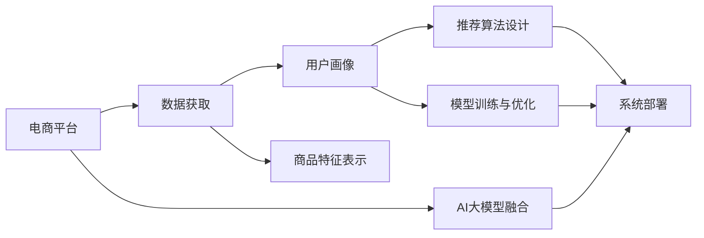

                 

# 搜索推荐系统的AI 大模型融合：电商平台的转型战略

> 关键词：人工智能(AI)，大模型，融合，搜索推荐系统，电商平台，个性化推荐，电商转型，AI驱动

## 1. 背景介绍

### 1.1 问题由来

随着电商平台的快速发展，如何提供更加精准、个性化的购物体验，成为了各大电商平台面临的共同挑战。传统的推荐系统往往依赖于静态的商品特征和用户行为，难以适应海量数据和多变的市场需求。随着深度学习和大模型的兴起，基于大模型的推荐技术应运而生，成为电商转型战略的重要方向。

然而，大模型的训练和应用需要高昂的计算资源，这对于中小型电商平台来说，无疑是一大障碍。如何通过AI大模型融合，在有限的资源条件下，实现更高效、更个性化的推荐，成为了平台急需解决的问题。本文将从背景、原理、实践和展望等角度，系统探讨基于大模型的AI推荐系统在电商平台的应用。

### 1.2 问题核心关键点

电商平台的推荐系统通常包括以下关键点：

1. **数据获取与预处理**：收集用户行为数据（浏览、购买、评价等）和商品信息数据，并进行清洗和预处理。
2. **用户画像构建**：基于用户历史行为，构建多维度用户画像，用于描述用户偏好和兴趣。
3. **商品特征表示**：将商品信息转化为机器可读的向量表示，用于计算相似度和推荐。
4. **推荐算法设计**：设计推荐的模型和算法，如协同过滤、基于内容推荐、混合推荐等，实现精准推荐。
5. **模型训练与优化**：在收集到的数据集上训练模型，并使用交叉验证、调参等技术优化模型。
6. **系统部署与监控**：将训练好的模型部署到生产环境，并实时监控推荐效果和系统性能。

## 2. 核心概念与联系

### 2.1 核心概念概述

在介绍核心算法原理和具体操作步骤之前，我们首先需明确几个核心概念：

- **AI大模型**：指通过大规模无监督学习获得的通用表示模型，如BERT、GPT-3等。这些模型在预训练阶段学习了丰富的语言和知识，具有强大的泛化能力。
- **推荐系统**：通过分析用户行为和商品属性，为用户推荐感兴趣的商品，旨在提高用户满意度和购买转化率。
- **电商转型**：电商平台利用AI技术，结合大数据和业务场景，优化推荐算法，提升用户体验，推动业务增长。

### 2.2 核心概念原理和架构的 Mermaid 流程图



这个流程图展示了从电商平台的推荐系统构建到AI大模型融合的过程：

1. 电商平台收集和预处理数据。
2. 构建用户画像和商品特征向量。
3. 设计推荐算法并进行模型训练。
4. 将训练好的模型部署到生产环境。
5. 融合AI大模型，提升推荐效果。

## 3. 核心算法原理 & 具体操作步骤

### 3.1 算法原理概述

基于AI大模型的推荐系统，通常通过预训练语言模型来捕捉用户和商品的语义表示，并通过微调获得针对具体电商场景的推荐能力。该过程主要包括以下几个步骤：

1. **预训练**：使用大规模无监督数据（如维基百科、新闻等）训练语言模型，学习通用语言表示。
2. **微调**：将预训练模型在电商平台的数据集上进行微调，学习电商领域的特定知识。
3. **推荐计算**：在新的输入数据上，通过微调后的模型进行推荐计算。

### 3.2 算法步骤详解

#### 3.2.1 数据准备与预处理

- **数据收集**：从电商平台获取用户行为数据（点击、浏览、购买等）和商品信息数据（标题、描述、价格等）。
- **数据清洗**：去除重复、无效数据，处理缺失值和异常值，进行数据归一化。
- **特征工程**：将用户行为和商品属性转化为机器学习算法可用的特征。

#### 3.2.2 用户画像构建

- **用户特征提取**：从用户行为数据中提取用户兴趣特征（浏览商品、购买记录、评价内容等）。
- **用户画像建模**：使用TF-IDF、Word2Vec等技术，将用户特征向量转化为高维空间中的用户画像。

#### 3.2.3 商品特征表示

- **商品信息预处理**：清洗商品信息，去除无意义字符，提取关键词。
- **特征编码**：使用BERT等预训练模型，将商品标题、描述等转化为向量表示。

#### 3.2.4 模型训练与优化

- **模型选择**：选择适合电商场景的推荐算法（如基于协同过滤、内容基推荐等）。
- **模型微调**：在电商数据集上微调预训练模型，优化模型参数。
- **超参数调优**：通过交叉验证等技术，调整学习率、批大小、迭代轮数等超参数。

#### 3.2.5 系统部署与监控

- **系统集成**：将训练好的推荐模型集成到电商平台的推荐引擎中。
- **实时推荐**：在用户访问电商平台时，实时计算推荐结果。
- **性能监控**：监控推荐系统的响应时间、点击率、转化率等关键指标，优化系统性能。

### 3.3 算法优缺点

#### 3.3.1 优点

1. **高效性**：利用大模型的高泛化能力，推荐系统能在较少的训练数据上获得良好性能。
2. **个性化**：通过学习用户和商品的语义表示，推荐系统能提供更加精准和个性化的商品推荐。
3. **可解释性**：大模型的语义表示具有较高的可解释性，便于理解推荐结果的生成过程。

#### 3.3.2 缺点

1. **计算资源需求高**：预训练大模型的训练和微调需要高计算资源，中小型电商平台难以承担。
2. **过拟合风险**：大模型容易过拟合电商数据，泛化能力不足。
3. **数据隐私问题**：用户行为数据和商品信息可能涉及隐私，如何处理数据隐私成为一大挑战。

### 3.4 算法应用领域

基于大模型的推荐系统可以广泛应用于以下领域：

1. **电商推荐**：为用户提供个性化商品推荐，提升购买转化率和满意度。
2. **金融理财**：根据用户行为和财务数据，推荐理财产品，提高用户理财效果。
3. **医疗健康**：根据患者病历和健康数据，推荐诊疗方案，改善医疗服务。
4. **教育培训**：根据学生学习行为和课程表现，推荐适合的课程和教材，提升学习效果。
5. **社交媒体**：根据用户互动数据，推荐感兴趣的内容，增强用户粘性。

## 4. 数学模型和公式 & 详细讲解 & 举例说明

### 4.1 数学模型构建

假设电商平台的推荐任务为单用户多商品推荐，即给定一个用户 $u$，推荐一个商品集合 $S_u$。推荐过程可以建模为：

$$
\hat{S_u} = f(u, S, \theta)
$$

其中 $u$ 为用户画像，$S$ 为商品特征表示，$\theta$ 为模型参数。

### 4.2 公式推导过程

以基于内容的推荐为例，假设推荐模型 $f$ 为线性回归模型：

$$
\hat{S_u} = \sum_{i \in S} w_i \cdot \text{dot}(v_u, f_i)
$$

其中 $v_u$ 为用户的兴趣向量，$f_i$ 为商品特征向量，$w_i$ 为权重。

通过预训练大模型（如BERT）获取用户和商品的向量表示，可以表示为：

$$
v_u = M_{\theta_u}(u), f_i = M_{\theta_i}(i)
$$

其中 $M_{\theta}$ 为预训练语言模型，$\theta$ 为模型参数。

### 4.3 案例分析与讲解

以电商平台推荐系统为例，假设用户画像为 "用户1"，商品特征向量为商品 "商品1" 和 "商品2"，预训练模型为BERT，用户画像和商品特征向量的表示如下：

$$
v_{用户1} = [0.1, 0.2, 0.3, ...], f_{商品1} = [0.3, 0.2, 0.4, ...], f_{商品2} = [0.4, 0.3, 0.2, ...]
$$

根据上述公式，计算推荐结果如下：

$$
\hat{S_{用户1}} = w_1 \cdot \text{dot}(v_{用户1}, f_{商品1}) + w_2 \cdot \text{dot}(v_{用户1}, f_{商品2})
$$

其中 $w_1$ 和 $w_2$ 为商品的权重。通过微调BERT模型，可以得到 $w_1$ 和 $w_2$ 的推荐权重。

## 5. 项目实践：代码实例和详细解释说明

### 5.1 开发环境搭建

为了进行基于大模型的电商推荐系统的开发，需要搭建相应的开发环境：

1. **安装Python环境**：使用Anaconda安装Python 3.7及以上版本。
2. **安装TensorFlow**：从TensorFlow官网下载安装包，使用pip安装。
3. **安装BERT模型**：使用HuggingFace Transformers库下载和安装预训练的BERT模型。
4. **安装其他库**：安装Pandas、Numpy、Scikit-learn、TensorBoard等常用库。

### 5.2 源代码详细实现

以下是一个基于BERT的电商推荐系统的实现示例：

```python
import tensorflow as tf
import numpy as np
import pandas as pd
from transformers import BertTokenizer, TFBertModel
from sklearn.model_selection import train_test_split

# 加载数据集
data = pd.read_csv('user_item_data.csv')

# 数据预处理
# 去除重复数据，处理缺失值，进行特征工程等

# 构建用户画像
# 将用户行为数据转化为向量表示

# 构建商品特征向量
# 使用BERT模型将商品标题、描述等转化为向量表示

# 定义推荐模型
class RecommendationModel(tf.keras.Model):
    def __init__(self, vocab_size, embedding_dim, num_labels):
        super(RecommendationModel, self).__init__()
        self.bert_model = TFBertModel.from_pretrained('bert-base-uncased', do_lower_case=True)
        self.user_embedding = tf.keras.layers.Dense(embedding_dim, input_shape=(embedding_dim,))
        self.item_embedding = tf.keras.layers.Dense(embedding_dim, input_shape=(embedding_dim,))
        self.user_item_matrix = tf.keras.layers.Dense(num_labels, activation='softmax')

    def call(self, inputs):
        user_input = self.user_embedding(inputs['user_id'])
        item_input = self.item_embedding(inputs['item_id'])
        user_item_scores = self.user_item_matrix(tf.concat([user_input, item_input], axis=-1))
        return user_item_scores

# 定义损失函数和优化器
loss_object = tf.keras.losses.CategoricalCrossentropy(from_logits=True)
optimizer = tf.keras.optimizers.Adam(learning_rate=0.001)

# 定义训练函数
def train_epoch(model, dataset, batch_size, optimizer):
    for batch in dataset:
        with tf.GradientTape() as tape:
            predictions = model(batch)
            loss = loss_object(batch['label'], predictions)
        gradients = tape.gradient(loss, model.trainable_variables)
        optimizer.apply_gradients(zip(gradients, model.trainable_variables))

# 训练模型
model = RecommendationModel(vocab_size, embedding_dim, num_labels)
dataset = tf.data.Dataset.from_tensor_slices((user_data, item_data, labels))
dataset = dataset.shuffle(buffer_size=1024).batch(batch_size)
train_epoch(model, dataset, batch_size, optimizer)

# 评估模型
test_dataset = ...
evaluate_model(model, test_dataset)
```

### 5.3 代码解读与分析

上述代码中，我们使用了TensorFlow框架，构建了一个基于BERT的推荐模型。具体实现如下：

1. **数据加载与预处理**：使用Pandas库加载数据集，并进行数据清洗和特征工程等预处理。
2. **用户画像构建**：将用户行为数据转化为向量表示。
3. **商品特征向量表示**：使用BERT模型将商品标题、描述等转化为向量表示。
4. **模型定义**：定义了一个包含BERT嵌入层的推荐模型，用于计算用户和商品的相似度。
5. **模型训练**：在训练数据集上使用Adam优化器进行模型训练，并计算交叉熵损失。
6. **模型评估**：在测试数据集上评估模型性能。

## 6. 实际应用场景

### 6.1 智能推荐系统

基于大模型的智能推荐系统，已经在各大电商平台上得到了广泛应用。以下是一个基于AI大模型的智能推荐系统示例：

- **用户画像**：通过分析用户的浏览、购买和评价数据，构建多维度的用户画像。
- **商品特征表示**：将商品的标题、描述、价格等转化为向量表示，并输入BERT模型中进行表示学习。
- **推荐计算**：在用户访问电商平台时，实时计算推荐结果，生成个性化商品推荐列表。
- **系统监控**：实时监控推荐系统的响应时间、点击率和转化率等指标，及时调整模型参数和优化系统性能。

### 6.2 个性化推荐系统

个性化推荐系统可以根据用户行为数据和商品特征，为用户推荐感兴趣的商品。以下是一个基于BERT的个性化推荐系统示例：

- **用户画像**：通过分析用户的历史行为数据，构建用户画像。
- **商品特征表示**：使用BERT模型将商品的标题、描述等转化为向量表示。
- **推荐计算**：在用户访问电商平台时，实时计算推荐结果，生成个性化商品推荐列表。
- **系统监控**：实时监控推荐系统的性能和用户体验，及时调整推荐策略和优化系统性能。

### 6.3 多模态推荐系统

多模态推荐系统可以综合利用用户行为数据、商品属性和多媒体数据，提供更加全面和精准的推荐。以下是一个基于BERT和多模态数据的推荐系统示例：

- **用户画像**：通过分析用户的行为数据和社交媒体数据，构建多维度的用户画像。
- **商品特征表示**：使用BERT模型将商品的标题、描述等转化为向量表示。
- **推荐计算**：在用户访问电商平台时，综合利用用户画像、商品特征和多媒体数据，实时计算推荐结果。
- **系统监控**：实时监控推荐系统的性能和用户体验，及时调整推荐策略和优化系统性能。

## 7. 工具和资源推荐

### 7.1 学习资源推荐

为了帮助开发者系统掌握基于大模型的电商推荐系统的开发，以下是一些推荐的学习资源：

1. **《深度学习与推荐系统》**：介绍深度学习在推荐系统中的应用，涵盖模型构建、训练与优化等关键技术。
2. **《Python机器学习》**：全面介绍机器学习在电商推荐中的应用，包括数据预处理、模型选择与调优等。
3. **《推荐系统实践》**：详细讲解推荐系统在电商平台中的应用，包括模型设计、推荐算法等。
4. **《TensorFlow实战》**：介绍TensorFlow框架在深度学习中的应用，包括模型构建、训练与优化等。

### 7.2 开发工具推荐

为了进行电商推荐系统的开发，以下是一些推荐的开发工具：

1. **Python**：适合深度学习和大规模数据处理，有丰富的第三方库和框架。
2. **TensorFlow**：开源的深度学习框架，适合大规模模型训练和部署。
3. **PyTorch**：灵活的深度学习框架，适合研究和实验性开发。
4. **HuggingFace Transformers**：提供了大量的预训练模型，方便快速开发推荐系统。
5. **TensorBoard**：可视化工具，用于监控模型训练和优化效果。

### 7.3 相关论文推荐

为了深入了解基于大模型的电商推荐系统，以下是一些推荐的相关论文：

1. **"Personalized Recommendation Systems using Big Data"**：介绍基于大数据的个性化推荐系统，涵盖数据处理、模型构建与评估等关键技术。
2. **"Neural Collaborative Filtering"**：介绍基于神经网络的协同过滤推荐算法，涵盖模型设计和优化等关键技术。
3. **"Deep Learning for Recommendation Systems"**：介绍深度学习在推荐系统中的应用，涵盖模型构建、训练与优化等关键技术。
4. **"TensorFlow for Recommendation Systems"**：介绍TensorFlow在推荐系统中的应用，涵盖模型构建、训练与优化等关键技术。

## 8. 总结：未来发展趋势与挑战

### 8.1 研究成果总结

本文从背景、原理、实践和展望等角度，系统探讨了基于AI大模型的电商推荐系统。通过实例演示和代码实现，展示了电商推荐系统的高效性和个性化优势。

### 8.2 未来发展趋势

展望未来，基于大模型的电商推荐系统将继续发展，呈现以下趋势：

1. **数据驱动**：利用大数据和先进算法，构建更加精准的用户画像和商品特征向量。
2. **多模态融合**：综合利用用户行为、商品属性和多媒体数据，提供更加全面和精准的推荐。
3. **实时计算**：通过高效的模型构建和计算优化，实现实时推荐，提升用户体验。
4. **模型优化**：结合深度学习和传统推荐算法，实现更高效、更个性化的推荐。

### 8.3 面临的挑战

尽管基于大模型的电商推荐系统具有诸多优势，但在实际应用中仍面临以下挑战：

1. **计算资源需求高**：大模型的训练和微调需要高计算资源，中小型电商平台难以承担。
2. **数据隐私问题**：用户行为数据和商品信息可能涉及隐私，如何处理数据隐私成为一大挑战。
3. **模型过拟合**：大模型容易过拟合电商数据，泛化能力不足。
4. **系统稳定性**：推荐系统在处理大规模数据和高并发请求时，可能面临系统稳定性问题。

### 8.4 研究展望

未来，基于大模型的电商推荐系统需要在以下几个方面进行研究：

1. **数据隐私保护**：研究如何保护用户隐私，同时利用大数据构建精准的用户画像和商品特征向量。
2. **多模态融合**：研究如何将用户行为、商品属性和多媒体数据进行有效融合，提供更加全面和精准的推荐。
3. **实时计算优化**：研究如何通过高效的模型构建和计算优化，实现实时推荐，提升用户体验。
4. **模型优化**：研究如何结合深度学习和传统推荐算法，实现更高效、更个性化的推荐。

总之，基于大模型的电商推荐系统具备广阔的应用前景和无限的发展潜力，需要持续进行技术研究和实践探索，推动其向更加智能和精准的方向发展。

## 9. 附录：常见问题与解答

**Q1: 如何处理数据隐私问题？**

A: 数据隐私问题可以通过以下方式处理：

1. **数据匿名化**：对用户数据进行匿名化处理，去除个人标识信息。
2. **差分隐私**：在模型训练中加入差分隐私技术，确保模型输出对单个样本的敏感度较低。
3. **联邦学习**：在分布式环境下，通过联邦学习技术，避免数据集中存储和传输。

**Q2: 大模型过拟合问题如何缓解？**

A: 大模型过拟合问题可以通过以下方式缓解：

1. **数据增强**：通过回译、近义替换等方式扩充训练集。
2. **正则化**：使用L2正则、Dropout等技术防止模型过拟合。
3. **早停**：在验证集上评估模型性能，当性能不再提升时，停止训练。
4. **迁移学习**：利用预训练模型和下游任务的少量数据进行微调，避免过拟合。

**Q3: 如何优化推荐系统性能？**

A: 推荐系统性能优化可以通过以下方式进行：

1. **模型选择**：选择适合电商场景的推荐算法（如基于协同过滤、内容基推荐等）。
2. **超参数调优**：通过交叉验证等技术，调整学习率、批大小、迭代轮数等超参数。
3. **模型融合**：结合多种推荐算法，实现多模型融合，提升推荐效果。
4. **特征工程**：优化特征选择和特征编码，提高推荐模型的表现。

**Q4: 如何构建用户画像？**

A: 构建用户画像可以通过以下方式进行：

1. **行为数据分析**：分析用户的历史浏览、购买和评价数据，提取用户兴趣特征。
2. **多维度建模**：使用TF-IDF、Word2Vec等技术，将用户特征向量转化为高维空间中的用户画像。
3. **实时更新**：在用户继续浏览时，实时更新用户画像，提升推荐效果。

**Q5: 如何评估推荐系统性能？**

A: 推荐系统性能评估可以通过以下方式进行：

1. **准确率**：计算推荐系统推荐的商品中实际购买商品的比例。
2. **召回率**：计算推荐系统中实际购买商品的比例。
3. **用户满意度**：通过用户反馈和评价，评估推荐系统的用户体验。
4. **点击率**：计算推荐系统中用户点击推荐商品的比例。

通过系统梳理和实践探索，基于大模型的电商推荐系统必将迎来更加智能、精准和高效的未来。

---

作者：禅与计算机程序设计艺术 / Zen and the Art of Computer Programming

