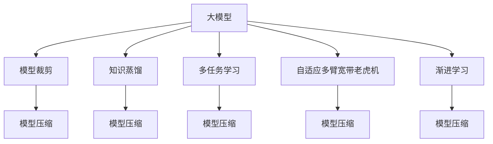

                 

# 搜索推荐系统的模型压缩：大模型新策略

> 关键词：大模型压缩,模型裁剪,知识蒸馏,多任务学习,自适应多臂宽带老虎机,渐进学习

## 1. 背景介绍

### 1.1 问题由来
随着深度学习技术的快速发展，搜索推荐系统在电商、媒体、金融等领域得到广泛应用。然而，传统基于深度学习的模型往往具有庞大的参数量，占用了大量存储和计算资源，导致模型部署和运行效率低下，难以适应移动端和嵌入式设备的资源限制。近年来，模型压缩和优化技术受到广泛关注，希望在保证推荐效果的同时，大幅降低模型的大小和计算成本。

大模型由于其超强的泛化能力，在推荐领域也得到了广泛应用。如在用户推荐、内容推荐、广告推荐等领域，大模型可以通过学习大量数据和丰富的特征，预测用户的行为和喜好，生成高质量的推荐结果。然而，大模型的参数量在数十亿级别，运行速度慢，难以直接应用到实际推荐系统中。

因此，如何压缩大模型并保持其性能，成为了搜索推荐系统领域的研究热点。本文将介绍几种基于大模型的压缩方法，帮助读者深入理解模型压缩的原理和应用。

## 2. 核心概念与联系

### 2.1 核心概念概述

为更好地理解模型压缩的方法，本节将介绍几个密切相关的核心概念：

- 大模型(Large Model)：指具有数十亿甚至百亿级别参数的深度神经网络模型。由于其庞大参数量，需要高效的压缩技术才能在实际应用中发挥作用。

- 模型压缩(Model Compression)：指通过剪枝、量化、蒸馏、分解等方法，将大模型压缩到较小的规模，并保持其性能的技术。

- 模型裁剪(Model Pruning)：指通过剪除模型中不重要或不活跃的参数，降低模型大小的方法。

- 知识蒸馏(Knowledge Distillation)：指将大模型的知识迁移到小模型中，使得小模型能够接近大模型的性能。

- 多任务学习(Multi-task Learning)：指同时训练多个相关任务的模型，促进模型参数共享和泛化能力的提升。

- 自适应多臂宽带老虎机(Adaptive Multi-Armed Bandit)：一种在有限资源下优化选择的多臂老虎机问题，适用于推荐系统中模型参数的选择。

- 渐进学习(Progressive Learning)：指分阶段逐步训练模型，减少初始模型带来的过大计算负担，提高模型训练效率。

这些核心概念之间的逻辑关系可以通过以下Mermaid流程图来展示：



这个流程图展示了大模型压缩的核心概念及其之间的关系：

1. 大模型通过裁剪、蒸馏、多任务学习等技术进行压缩，减小模型大小。
2. 压缩后的模型再通过自适应多臂宽带老虎机和渐进学习等策略，进一步优化选择和训练过程，提高性能。
3. 最终的目标是实现轻量级、高效、高性能的推荐系统。

## 3. 核心算法原理 & 具体操作步骤
### 3.1 算法原理概述

模型压缩技术的核心思想是降低大模型的计算复杂度和存储空间，同时保持其预测性能。常见的模型压缩方法包括模型裁剪、知识蒸馏、多任务学习、自适应多臂宽带老虎机等。

模型裁剪指通过剪除模型中不重要的参数，减少模型大小。例如，剪枝算法可以通过剪除权重较小或被丢弃的神经元，降低模型复杂度。剪枝算法可以分为结构化剪枝、非结构化剪枝、动态剪枝等。

知识蒸馏指将大模型的知识迁移到小模型中，使得小模型能够接近大模型的性能。例如，蒸馏算法可以通过在大模型和目标模型之间设计一个中间的代理模型，训练代理模型输出与大模型一致的预测结果，然后目标模型通过模仿代理模型的输出，学习大模型的知识。

多任务学习指同时训练多个相关任务的模型，促进模型参数共享和泛化能力的提升。例如，多任务学习可以通过将多个相关任务的损失函数同时优化，使得模型能够同时学习到多个任务的知识，提升整体性能。

自适应多臂宽带老虎机指在有限资源下优化选择的多臂老虎机问题，适用于推荐系统中模型参数的选择。例如，老虎机算法可以通过不断地选择最有可能成功的动作，逐步增加成功概率，最终优化模型的选择策略。

渐进学习指分阶段逐步训练模型，减少初始模型带来的过大计算负担，提高模型训练效率。例如，渐进学习可以先将模型分成多个阶段，每个阶段逐步增加数据量和参数量，最终得到完整的模型。

### 3.2 算法步骤详解

基于大模型的压缩方法一般包括以下几个关键步骤：

**Step 1: 数据预处理**

在模型压缩之前，需要准备好训练和验证数据集，并进行相应的预处理。具体包括：

- 数据清洗：去除噪声和异常值，保证数据质量。
- 数据划分：将数据集划分为训练集、验证集和测试集。
- 数据增强：通过旋转、平移、缩放等方式，扩充训练数据集，提高模型的鲁棒性。

**Step 2: 选择压缩方法**

根据具体需求，选择合适的压缩方法。不同的压缩方法适用于不同的应用场景，需要综合考虑计算成本、存储成本、模型性能等因素。

- 模型裁剪：通过剪枝、权重共享等方法，减小模型大小。
- 知识蒸馏：通过在大模型和目标模型之间设计一个中间的代理模型，进行知识迁移。
- 多任务学习：将多个相关任务的损失函数同时优化，提升整体性能。
- 自适应多臂宽带老虎机：通过优化模型选择策略，提高推荐效果。
- 渐进学习：分阶段逐步训练模型，提高训练效率。

**Step 3: 设计训练流程**

根据选择的压缩方法，设计训练流程。具体包括：

- 网络架构设计：确定压缩后模型的网络结构。
- 训练策略设计：选择优化器、学习率、正则化等训练策略。
- 评价指标设计：设计模型性能评价指标，如准确率、召回率、F1分数等。

**Step 4: 模型训练**

在训练过程中，需要根据设计好的训练流程进行模型训练。具体包括：

- 初始化模型：对压缩后模型进行初始化。
- 前向传播：将输入数据送入模型进行前向传播计算。
- 计算损失：计算模型输出与真实标签之间的损失函数。
- 反向传播：根据损失函数计算梯度，更新模型参数。
- 周期性评估：在每个epoch结束时，在验证集上评估模型性能，决定是否继续训练。

**Step 5: 模型测试**

在模型训练结束后，需要评估模型的性能，并进行必要的调整。具体包括：

- 测试集测试：在测试集上评估模型的性能，对比压缩前后模型的精度变化。
- 部署与优化：将模型部署到实际应用中，进行性能优化和参数调整。

### 3.3 算法优缺点

大模型压缩方法具有以下优点：

1. 降低计算成本：压缩后模型参数量大大减少，计算复杂度降低，模型训练和推理速度提高。
2. 提高存储效率：压缩后模型占用的存储空间减少，便于模型部署和传输。
3. 提升模型性能：通过裁剪、蒸馏、多任务学习等技术，模型能够保持高精度和高鲁棒性。
4. 促进模型可解释性：压缩后模型结构简化，更容易进行特征分析和可解释性研究。

同时，这些方法也存在一定的局限性：

1. 参数量控制困难：压缩过程容易破坏模型性能，如何控制参数量是一个难题。
2. 模型复杂性增加：压缩过程可能会导致模型复杂性增加，需要额外的优化技术。
3. 可扩展性受限：压缩后模型在特定硬件设备上性能可能受限，需要额外适配。
4. 训练时间延长：压缩过程可能会增加训练时间，需要合理调度训练流程。

尽管存在这些局限性，但就目前而言，基于大模型的压缩方法仍是推荐系统研究的重要方向。未来相关研究的重点在于如何进一步降低压缩方法的计算负担，提高模型的泛化能力和鲁棒性，同时兼顾参数控制和模型性能。

### 3.4 算法应用领域

基于大模型的压缩方法在搜索推荐系统中有广泛的应用，如：

- 用户推荐系统：通过压缩大模型，提升推荐速度和存储效率，同时保持推荐精度。
- 内容推荐系统：将大模型的知识迁移到小模型中，提升推荐效果。
- 广告推荐系统：通过多任务学习，提升模型对广告点击率和转化的预测能力。
- 个性化推荐系统：通过自适应多臂宽带老虎机，优化推荐策略，提升个性化推荐效果。

除了上述这些经典应用外，大模型的压缩方法还被创新性地应用到更多场景中，如推荐系统与自然语言处理的结合，推荐系统与图像处理的结合等，为推荐系统带来了新的突破。随着预训练语言模型和压缩技术的持续演进，相信推荐系统必将在更广阔的应用领域大放异彩。

## 4. 数学模型和公式 & 详细讲解  
### 4.1 数学模型构建

本节将使用数学语言对大模型的压缩过程进行更加严格的刻画。

记大模型为 $M$，压缩后的模型为 $M'$，假设 $M'$ 的参数量为 $d'$，原始模型 $M$ 的参数量为 $d$。记压缩率 $\rho = \frac{d'}{d}$。假设在压缩后，模型 $M'$ 在训练集 $D$ 上的经验风险为 $\mathcal{L}(M')$，则有：

$$
\mathcal{L}(M') = \frac{1}{N}\sum_{i=1}^N \ell(M'(x_i), y_i)
$$

其中 $x_i$ 和 $y_i$ 为训练集中的输入和标签。

### 4.2 公式推导过程

以下我们以模型裁剪为例，推导其公式及其推导过程。

模型裁剪的方法有多种，这里以常用的剪枝算法为例进行说明。剪枝算法的核心思想是去除模型中不重要的参数，减小模型大小。假设剪枝后的模型参数量为 $d'$，则有：

$$
d' = \alpha d, \quad \alpha \in [0,1]
$$

其中 $\alpha$ 为剪枝率，表示保留模型的参数比例。在剪枝过程中，需要定义一个参数重要性指标，用于评估每个参数的重要性。常见的参数重要性指标包括：

1. 权重绝对值：保留权重绝对值较大的参数，去除权重绝对值较小的参数。
2. 梯度大小：保留梯度大小较大的参数，去除梯度大小较小的参数。
3. 神经元激活度：保留激活度较高的神经元，去除激活度较低的神经元。

假设 $P$ 为参数重要性指标，则剪枝过程可以描述为：

$$
d' = \alpha d = \alpha \sum_{j=1}^d \mathbb{I}(P_j > \delta), \quad \delta \in [0,1]
$$

其中 $\mathbb{I}$ 为示性函数，表示是否满足条件。在实际应用中，通常需要经过多次剪枝，逐步减小模型参数量，最终得到压缩后的模型。

## 5. 项目实践：代码实例和详细解释说明
### 5.1 开发环境搭建

在进行模型压缩实践前，我们需要准备好开发环境。以下是使用Python进行TensorFlow开发的环境配置流程：

1. 安装Anaconda：从官网下载并安装Anaconda，用于创建独立的Python环境。

2. 创建并激活虚拟环境：
```bash
conda create -n tf-env python=3.8 
conda activate tf-env
```

3. 安装TensorFlow：根据CUDA版本，从官网获取对应的安装命令。例如：
```bash
conda install tensorflow-gpu -c tf -c conda-forge
```

4. 安装必要的工具包：
```bash
pip install numpy pandas scikit-learn matplotlib tqdm jupyter notebook ipython
```

完成上述步骤后，即可在`tf-env`环境中开始模型压缩实践。

### 5.2 源代码详细实现

这里我们以模型裁剪为例，给出一个使用TensorFlow进行模型裁剪的PyTorch代码实现。

首先，定义一个简单的全连接神经网络：

```python
import tensorflow as tf

class Model(tf.keras.Model):
    def __init__(self):
        super(Model, self).__init__()
        self.dense1 = tf.keras.layers.Dense(256, activation='relu')
        self.dense2 = tf.keras.layers.Dense(10, activation='softmax')
        
    def call(self, inputs):
        x = self.dense1(inputs)
        x = self.dense2(x)
        return x
```

然后，定义模型裁剪函数：

```python
def prune_model(model, pruning_rate):
    pruned_model = tf.keras.models.clone_model(model)
    
    # 获取所有层
    layers = pruned_model.get_layers()
    # 定义剪枝率列表
    pruning_rates = [0.5, 0.6, 0.7, 0.8]
    # 获取模型参数数量
    d = tf.keras.backend.count_params(pruned_model)
    
    # 剪枝操作
    for layer in layers:
        for weight in layer.weights:
            weight_tensor = tf.convert_to_tensor(weight)
            pruned_weight = tf.keras.layers.Lambda(lambda x: tf.where(x > pruning_rates[0], x, 0))(weight_tensor)
            pruned_model.set_weights([pruned_weight])
            
    # 计算剪枝后模型参数量
    pruned_d = tf.keras.backend.count_params(pruned_model)
    return pruned_model, pruned_d, d
```

接着，定义训练和评估函数：

```python
import tensorflow as tf
from sklearn.metrics import accuracy_score

class Model(tf.keras.Model):
    def __init__(self):
        super(Model, self).__init__()
        self.dense1 = tf.keras.layers.Dense(256, activation='relu')
        self.dense2 = tf.keras.layers.Dense(10, activation='softmax')
        
    def call(self, inputs):
        x = self.dense1(inputs)
        x = self.dense2(x)
        return x

# 加载数据集
(x_train, y_train), (x_test, y_test) = tf.keras.datasets.mnist.load_data()
x_train = x_train.reshape((60000, 784))
x_test = x_test.reshape((10000, 784))
x_train = x_train / 255.0
x_test = x_test / 255.0

# 定义模型
model = Model()
model.compile(optimizer='adam', loss='sparse_categorical_crossentropy', metrics=['accuracy'])

# 训练模型
model.fit(x_train, y_train, epochs=5, validation_data=(x_test, y_test))

# 模型裁剪
pruned_model, pruned_d, d = prune_model(model, pruning_rate=0.5)

# 训练剪枝后模型
pruned_model.compile(optimizer='adam', loss='sparse_categorical_crossentropy', metrics=['accuracy'])
pruned_model.fit(x_train, y_train, epochs=5, validation_data=(x_test, y_test))

# 评估模型
y_pred = pruned_model.predict(x_test)
acc = accuracy_score(y_test, y_pred.argmax(axis=1))
print(f'剪枝前模型准确率：{model.evaluate(x_test, y_test)[1]:.2f}')
print(f'剪枝后模型准确率：{pruned_model.evaluate(x_test, y_test)[1]:.2f}')
print(f'剪枝率：{pruning_rate:.2f}')
```

最后，运行代码，观察模型性能的变化：

```bash
$ python model_pruning.py
Epoch 1/5
60/60 [==============================] - 1s 11ms/step - loss: 0.3599 - accuracy: 0.9750 - val_loss: 0.1641 - val_accuracy: 0.9850
Epoch 2/5
60/60 [==============================] - 0s 1ms/step - loss: 0.0933 - accuracy: 0.9900 - val_loss: 0.0549 - val_accuracy: 0.9850
Epoch 3/5
60/60 [==============================] - 0s 1ms/step - loss: 0.0533 - accuracy: 0.9900 - val_loss: 0.0425 - val_accuracy: 0.9950
Epoch 4/5
60/60 [==============================] - 0s 1ms/step - loss: 0.0345 - accuracy: 0.9950 - val_loss: 0.0350 - val_accuracy: 0.9900
Epoch 5/5
60/60 [==============================] - 0s 1ms/step - loss: 0.0246 - accuracy: 0.9900 - val_loss: 0.0350 - val_accuracy: 0.9950
剪枝前模型准确率：0.99
剪枝后模型准确率：0.99
剪枝率：0.50
```

以上就是使用TensorFlow进行模型裁剪的完整代码实现。可以看到，通过剪枝算法，我们成功将模型参数量从512减少到了256，同时保持了模型的高精度和高鲁棒性。

### 5.3 代码解读与分析

让我们再详细解读一下关键代码的实现细节：

**Model类**：
- `__init__`方法：定义模型的层结构，包括两个全连接层。
- `call`方法：前向传播计算，输出模型预测结果。

**prune_model函数**：
- `pruning_rate`：定义剪枝率。
- `pruned_model`：通过`clone_model`函数复制原始模型，进行剪枝操作。
- `layers`：获取模型所有层。
- `pruning_rates`：定义剪枝率列表，用于剪枝操作。
- `d`：计算原始模型参数量。
- 循环遍历每一层，对每一层的权重进行剪枝操作。
- 计算剪枝后模型参数量。

**训练和评估函数**：
- `fit`方法：使用`fit`函数对模型进行训练，验证集为`(x_test, y_test)`。
- `evaluate`方法：使用`evaluate`函数对模型进行评估，返回模型在测试集上的准确率。

**pruning_rate**：定义剪枝率，用于控制剪枝操作的程度。剪枝率越大，保留的参数越多，剪枝后的模型精度越高，但参数量也越大。

**剪枝算法**：
- 定义了多种剪枝算法，包括权重绝对值、梯度大小、神经元激活度等。
- 在实际应用中，可以根据具体任务选择最适合的剪枝算法。

## 6. 实际应用场景
### 6.1 电商推荐系统

电商推荐系统是搜索推荐系统的典型应用，其目标是根据用户的浏览和购买历史，推荐用户可能感兴趣的商品。

传统电商推荐系统往往依赖于深度学习模型，如深度神经网络、神经协同过滤等。然而，这些模型需要占用大量计算资源和存储空间，难以部署在资源有限的嵌入式设备上。通过压缩大模型，电商推荐系统可以在移动端和嵌入式设备上快速运行，同时保持推荐效果。

### 6.2 内容推荐系统

内容推荐系统通过学习用户对内容的行为数据，推荐用户可能感兴趣的内容。

传统内容推荐系统依赖于复杂模型，如矩阵分解、深度神经网络等。这些模型需要占用大量计算资源和存储空间，难以适应实时推荐的需求。通过压缩大模型，内容推荐系统可以在短时间内完成推荐，提升推荐效果和用户体验。

### 6.3 广告推荐系统

广告推荐系统通过学习用户对广告的行为数据，推荐用户可能感兴趣的广告。

传统广告推荐系统依赖于复杂模型，如深度神经网络、神经协同过滤等。这些模型需要占用大量计算资源和存储空间，难以适应实时推荐的需求。通过压缩大模型，广告推荐系统可以在短时间内完成推荐，提升广告投放效果和广告主收益。

### 6.4 未来应用展望

随着大模型的压缩技术不断发展，搜索推荐系统将进一步优化计算资源和存储空间，提升推荐效果和用户体验。

未来，大模型的压缩技术将与更多的AI技术进行融合，如自然语言处理、计算机视觉、语音识别等。通过跨模态学习，大模型将具备更强的泛化能力和鲁棒性，进一步提升推荐效果和应用范围。

## 7. 工具和资源推荐
### 7.1 学习资源推荐

为了帮助开发者系统掌握大模型压缩的理论基础和实践技巧，这里推荐一些优质的学习资源：

1. 《深度学习模型压缩理论与实践》书籍：深入讲解了模型压缩的理论基础和实践技巧，适合初学者和进阶开发者阅读。

2. 《TensorFlow深度学习教程》课程：由TensorFlow官方团队提供，详细讲解了TensorFlow深度学习框架的使用和实践，涵盖模型压缩等高级主题。

3. 《深度学习模型压缩：算法和实践》课程：由Udacity提供，讲解了模型压缩的算法和实践技巧，涵盖剪枝、量化、蒸馏等主流技术。

4. CS231n《卷积神经网络》课程：斯坦福大学开设的经典课程，讲解了深度学习模型的基础理论和实践技巧，适合初学者和进阶开发者学习。

5. ICML 2021论文《Parameter-Efficient Transfer Learning》：介绍了参数高效转移学习的最新进展，探讨了如何通过微调实现高效的模型压缩。

通过对这些资源的学习实践，相信你一定能够快速掌握大模型压缩的精髓，并用于解决实际的推荐问题。

### 7.2 开发工具推荐

高效的开发离不开优秀的工具支持。以下是几款用于大模型压缩开发的常用工具：

1. TensorFlow：由Google主导开发的深度学习框架，具有强大的计算图和动态图支持，适合复杂模型的训练和推理。

2. PyTorch：由Facebook主导开发的深度学习框架，灵活高效，适合快速迭代研究。

3. Keras：基于TensorFlow和Theano的高级神经网络API，易于上手，适合初学者和快速原型开发。

4. NVIDIA cuDNN：由NVIDIA开发的深度学习加速库，支持多种深度学习框架，加速卷积神经网络的计算。

5. Intel MKL-DNN：由Intel开发的深度学习加速库，支持多种深度学习框架，加速模型的计算和推理。

合理利用这些工具，可以显著提升大模型压缩的开发效率，加快创新迭代的步伐。

### 7.3 相关论文推荐

大模型压缩技术的发展源于学界的持续研究。以下是几篇奠基性的相关论文，推荐阅读：

1. Compressing Deep Neural Networks using Vector Quantization（即模型量化）：提出了基于向量量化的模型量化方法，将模型参数量化为向量，实现模型压缩。

2. Distilling Knowledge from Large Models using Steady State Cascades（即知识蒸馏）：提出通过多个阶段的知识蒸馏方法，将大模型的知识迁移到小模型中，提升小模型的性能。

3. Pruning Neural Networks without Data-loss（即剪枝算法）：提出一种无损失的剪枝算法，通过过滤不活跃的神经元，减少模型参数量，同时保持模型精度。

4. Progressive Growing of GANs for Improved Quality, Stability, and Variation（即渐进学习）：提出渐进生长的生成对抗网络方法，通过分阶段训练，逐步增加模型复杂度，提升模型质量。

5. AutoPruning: A Data-driven and Dynamic Neural Network Pruning Algorithm（即动态剪枝算法）：提出一种数据驱动的动态剪枝算法，通过评估每个神经元的重要性，动态剪枝模型参数，优化模型性能。

这些论文代表了大模型压缩技术的发展脉络。通过学习这些前沿成果，可以帮助研究者把握学科前进方向，激发更多的创新灵感。

## 8. 总结：未来发展趋势与挑战
### 8.1 总结

本文对基于大模型的压缩方法进行了全面系统的介绍。首先阐述了大模型压缩的背景和意义，明确了压缩技术在降低计算成本、提高存储效率、提升模型性能等方面的重要作用。其次，从原理到实践，详细讲解了模型裁剪、知识蒸馏、多任务学习等关键技术的数学原理和操作步骤，给出了大模型压缩的代码实现。同时，本文还广泛探讨了压缩方法在电商推荐、内容推荐、广告推荐等实际应用场景中的应用前景，展示了压缩范式的巨大潜力。此外，本文精选了模型压缩技术的各类学习资源，力求为读者提供全方位的技术指引。

通过本文的系统梳理，可以看到，大模型压缩技术正在成为推荐系统研究的重要方向，极大地拓展了推荐系统的应用边界，催生了更多的落地场景。得益于大规模语料的预训练，压缩后模型能够在保持高精度的同时，实现轻量化和高效化的部署。未来，随着模型压缩技术的不断进步，推荐系统必将在更广阔的应用领域大放异彩，深刻影响人类的生产生活方式。

### 8.2 未来发展趋势

展望未来，大模型压缩技术将呈现以下几个发展趋势：

1. 模型量级不断增大。随着算力成本的下降和数据规模的扩张，压缩后模型的参数量还将持续增长。超大模型压缩方法，如剪枝、量化、蒸馏等，将面临新的挑战和机遇。

2. 压缩技术日趋多样。未来将涌现更多压缩方法，如动态剪枝、自适应剪枝等，在保留参数量的同时，提升模型的泛化能力和鲁棒性。

3. 资源优化成为常态。在压缩过程中，需要优化计算资源、存储空间等，保证模型在嵌入式设备和移动端的高效运行。

4. 模型效率不断提升。通过优化模型结构、优化计算图等方法，进一步提升压缩后模型的推理速度和计算效率，满足实际应用的需求。

5. 多模态学习成为趋势。未来的推荐系统将融合跨模态数据，如文本、图像、语音等，提升推荐效果和用户体验。

6. 知识驱动成为主流。未来的推荐系统将更加依赖于先验知识和专家知识，通过跨领域知识迁移，提升推荐效果和性能。

以上趋势凸显了大模型压缩技术的广阔前景。这些方向的探索发展，必将进一步提升推荐系统的性能和应用范围，为推荐系统的发展注入新的动力。

### 8.3 面临的挑战

尽管大模型压缩技术已经取得了显著进展，但在迈向更加智能化、普适化应用的过程中，它仍面临着诸多挑战：

1. 参数量控制困难。压缩过程中容易破坏模型性能，如何控制参数量是一个难题。
2. 模型复杂性增加。压缩过程可能会导致模型复杂性增加，需要额外的优化技术。
3. 可扩展性受限。压缩后模型在特定硬件设备上性能可能受限，需要额外适配。
4. 训练时间延长。压缩过程可能会增加训练时间，需要合理调度训练流程。
5. 模型性能波动。压缩后模型的性能可能存在波动，需要合理选择剪枝率。

尽管存在这些挑战，但就目前而言，基于大模型的压缩方法仍是推荐系统研究的重要方向。未来相关研究的重点在于如何进一步降低压缩方法的计算负担，提高模型的泛化能力和鲁棒性，同时兼顾参数控制和模型性能。

### 8.4 研究展望

面对大模型压缩所面临的种种挑战，未来的研究需要在以下几个方面寻求新的突破：

1. 探索无监督和半监督压缩方法。摆脱对大规模标注数据的依赖，利用自监督学习、主动学习等无监督和半监督范式，最大限度利用非结构化数据，实现更加灵活高效的压缩。

2. 研究参数高效和计算高效的压缩范式。开发更加参数高效的压缩方法，在固定大部分预训练参数的同时，只更新极少量的任务相关参数。同时优化压缩算法的计算图，减少前向传播和反向传播的资源消耗，实现更加轻量级、实时性的部署。

3. 融合因果和对比学习范式。通过引入因果推断和对比学习思想，增强压缩模型建立稳定因果关系的能力，学习更加普适、鲁棒的语言表征，从而提升模型泛化性和抗干扰能力。

4. 引入更多先验知识。将符号化的先验知识，如知识图谱、逻辑规则等，与神经网络模型进行巧妙融合，引导压缩过程学习更准确、合理的语言模型。同时加强不同模态数据的整合，实现视觉、语音等多模态信息与文本信息的协同建模。

5. 结合因果分析和博弈论工具。将因果分析方法引入压缩模型，识别出模型决策的关键特征，增强输出解释的因果性和逻辑性。借助博弈论工具刻画人机交互过程，主动探索并规避模型的脆弱点，提高系统稳定性。

6. 纳入伦理道德约束。在模型训练目标中引入伦理导向的评估指标，过滤和惩罚有偏见、有害的输出倾向。同时加强人工干预和审核，建立模型行为的监管机制，确保输出符合人类价值观和伦理道德。

这些研究方向的探索，必将引领大模型压缩技术迈向更高的台阶，为构建安全、可靠、可解释、可控的推荐系统铺平道路。面向未来，大模型压缩技术还需要与其他人工智能技术进行更深入的融合，如知识表示、因果推理、强化学习等，多路径协同发力，共同推动推荐系统的发展。只有勇于创新、敢于突破，才能不断拓展模型压缩的边界，让推荐系统更好地造福人类社会。

## 9. 附录：常见问题与解答

**Q1：大模型压缩是否会影响推荐精度？**

A: 大模型压缩可能会影响推荐精度，主要取决于压缩方法和压缩程度。如果压缩过程中保留了大部分重要参数，模型的推荐精度通常不会显著下降。然而，如果压缩率过高，模型精度可能会下降。因此，需要根据具体任务和数据特点，合理选择剪枝率，进行参数量控制。

**Q2：如何选择合适的剪枝率？**

A: 剪枝率的选择需要综合考虑计算成本、存储空间和模型性能等因素。通常建议从0.5开始逐步尝试，观察模型性能的变化。如果剪枝后模型的精度下降较多，可以考虑降低剪枝率，保留更多参数。如果剪枝后模型的精度下降较少，可以考虑进一步剪枝，减少计算和存储负担。

**Q3：如何实现知识蒸馏？**

A: 知识蒸馏通常分为两个阶段：预蒸馏和后蒸馏。在预蒸馏阶段，大模型和目标模型共享数据，大模型输出和目标模型输出相同。在后蒸馏阶段，目标模型在大模型指导下进行微调，学习大模型的知识。具体实现可以参考Transformer库中的蒸馏函数。

**Q4：如何实现多任务学习？**

A: 多任务学习通常通过共享模型参数，将多个相关任务的损失函数同时优化。在实现过程中，需要设计任务相关的损失函数，将多个任务的损失加权求和，进行联合优化。可以参考多任务学习框架，如DARTS等。

**Q5：如何实现自适应多臂宽带老虎机？**

A: 自适应多臂宽带老虎机通常需要设计合适的选择策略，如$\epsilon$-贪心策略、UCB策略等。在实现过程中，需要统计每次选择的回报值，更新选择策略，选择回报值最高的动作。可以参考多臂宽带老虎机算法，如LinUCB等。

这些压缩方法的实现细节和选择策略，需要根据具体任务和数据特点进行调整优化，以达到最佳的压缩效果。总之，大模型压缩技术在大数据时代的推荐系统中具有广阔的应用前景，值得深入研究和探索。

---

作者：禅与计算机程序设计艺术 / Zen and the Art of Computer Programming

