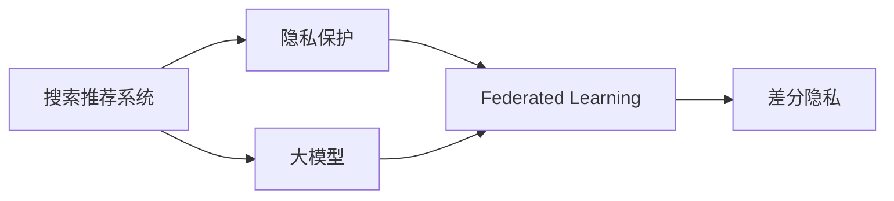

                 

# 搜索推荐系统的隐私保护：大模型的联邦学习方案

> 关键词：搜索推荐, 隐私保护, 联邦学习, 大模型, 差分隐私, 差分隐私算法

## 1. 背景介绍

### 1.1 问题由来

随着信息技术的飞速发展，搜索推荐系统已广泛应用于电子商务、社交网络、在线教育、金融等领域。然而，在带来便利的同时，这些系统也面临着严重的隐私泄露风险。用户行为数据、搜索历史、点击记录等敏感信息，若被不当使用，可能导致用户隐私泄露、个人信息滥用等严重问题。

如何平衡搜索推荐系统的性能提升与隐私保护，成为当前亟待解决的重大课题。传统的集中式训练方法，要求用户数据全部存储在单一服务器中，难以有效应对隐私保护需求。而联邦学习(Federated Learning, FL)，通过分布式训练方式，降低了数据集中化的风险，为解决隐私保护问题提供了新的方案。

### 1.2 问题核心关键点

联邦学习是近年来一种新兴的分布式机器学习范式，旨在通过分布式数据存储和计算，在不共享原始数据的前提下，完成模型的联合训练。其核心思想是通过多个本地客户端共享模型参数，本地更新训练结果，并使用安全聚合方法，实现全局模型的同步更新。联邦学习可以有效保护用户隐私，同时提高模型性能，广泛应用于移动设备、智能硬件等隐私敏感领域。

联邦学习由Google提出，其典型流程包括：
1. 数据收集：本地客户端收集用户数据。
2. 模型初始化：选择初始化模型。
3. 模型分发：将初始模型参数分发到本地客户端。
4. 本地训练：本地客户端使用本地数据进行模型更新。
5. 模型聚合：通过安全聚合方法，收集本地更新结果，生成全局模型参数。
6. 模型优化：重复4-5步骤，直至满足收敛条件。

联邦学习在隐私保护方面有显著优势，但同时存在计算复杂、收敛速度慢等问题。近年来，大模型（如BERT、GPT等）在NLP领域取得了突破性进展。如何将大模型应用于联邦学习，提升搜索推荐系统的性能，同时保护用户隐私，成为本文研究的关键点。

## 2. 核心概念与联系

### 2.1 核心概念概述

为了更好地理解大模型在搜索推荐系统中应用联邦学习的关键点，本节将介绍几个关键概念：

- **搜索推荐系统(Search and Recommendation System, SRS)**：通过分析用户历史行为，推荐相关商品、内容等信息，提升用户体验的智能系统。
- **隐私保护(P privacy Protection)**：保护用户数据隐私，防止数据泄露和滥用，包括数据匿名化、差分隐私等技术。
- **联邦学习(Federated Learning, FL)**：一种分布式机器学习方法，通过多个本地设备联合训练，避免数据集中化的风险。
- **差分隐私(Differential Privacy, DP)**：一种隐私保护技术，通过引入噪声机制，保护单个样本隐私，同时保证全局模型性能。
- **大模型(Large Model)**：指具有大量参数的深度学习模型，如BERT、GPT等，通常含有数十亿甚至百亿个参数。

这些概念通过以下Mermaid流程图展示了它们之间的联系：



该图展示了搜索推荐系统与隐私保护、联邦学习、大模型等概念之间的联系。

## 3. 核心算法原理 & 具体操作步骤
### 3.1 算法原理概述

联邦学习在搜索推荐系统中的应用，主要目的是在不共享用户原始数据的前提下，通过联合训练提升推荐系统的准确性和个性化水平。其核心思想是通过联邦学习，各本地客户端共享模型参数，使用本地数据进行模型训练，最后通过安全聚合方式，生成全局模型参数，实现模型优化。

大模型在联邦学习中的应用，主要体现在以下几个方面：
1. 大模型含有大量参数，具备强大的语言建模能力和泛化能力，可以提升搜索推荐系统的准确性和个性化。
2. 大模型可以在分布式环境下进行联合训练，通过各本地客户端的联合优化，避免数据集中化，保护用户隐私。
3. 大模型的训练计算成本较高，但通过联邦学习方式，可以在本地计算资源有限的情况下，通过联合训练提升模型性能。

### 3.2 算法步骤详解

联邦学习在搜索推荐系统中的应用，一般包括以下几个关键步骤：

**Step 1: 数据准备与模型初始化**
- 收集各本地客户端的用户数据，并进行数据预处理，包括去重、匿名化等。
- 选择合适的初始化模型，如BERT、GPT等，并进行预训练，确保模型参数稳定。

**Step 2: 模型分发与本地训练**
- 将初始化模型参数分发到各本地客户端。
- 各客户端使用本地数据进行模型训练，更新模型参数。

**Step 3: 模型聚合与全局优化**
- 各本地客户端将更新后的模型参数通过安全聚合方式，传递至中心服务器。
- 中心服务器对聚合结果进行加权平均，生成全局模型参数。
- 使用全局模型进行进一步优化，直到满足收敛条件。

### 3.3 算法优缺点

联邦学习在搜索推荐系统中应用大模型的优势：
1. 数据分布式存储，避免数据集中化的风险。
2. 通过联合训练，提升模型泛化能力和个性化水平。
3. 大模型的预训练特征可以转移至本地模型，提升本地模型效果。

同时，联邦学习也存在一些局限性：
1. 通信开销较大，尤其是在数据传输和模型聚合阶段。
2. 计算资源不均衡，不同客户端的计算能力不一致。
3. 模型训练复杂度高，各本地客户端的计算任务并行化难度较大。
4. 收敛速度较慢，需要更多轮次的迭代。

### 3.4 算法应用领域

联邦学习在搜索推荐系统中的应用领域广泛，涵盖电子商务、社交网络、在线教育、金融等多个领域。具体而言，可以应用于以下场景：

- **个性化推荐**：各本地客户端收集用户行为数据，联合训练模型，提升推荐精度和个性化水平。
- **搜索优化**：各本地客户端收集用户搜索历史，联合训练模型，提升搜索相关性。
- **内容推荐**：各本地客户端收集用户互动数据，联合训练模型，提升内容推荐效果。

## 4. 数学模型和公式 & 详细讲解 & 举例说明

### 4.1 数学模型构建

假设联邦学习系统中有$K$个本地客户端，每个客户端的数据集为$D_k=\{(x_i,y_i)\}_{i=1}^{n_k}$，其中$x_i$为特征，$y_i$为标签。联邦学习的目标是找到全局最优的模型参数$\theta^*$。

联邦学习的模型更新过程可以描述为：
1. 初始化模型参数$\theta^0$。
2. 分发初始模型参数$\theta^t$到各本地客户端。
3. 各本地客户端在本地数据集$D_k$上进行模型训练，更新模型参数$\theta^t_k$。
4. 各本地客户端将更新后的模型参数$\theta^t_k$通过安全聚合方式传递到中心服务器。
5. 中心服务器计算全局模型参数$\theta^{t+1}$。
6. 迭代上述步骤，直至模型收敛。

数学上，联邦学习的优化目标可以描述为：
$$
\min_{\theta} \frac{1}{K} \sum_{k=1}^{K} \mathcal{L}_k(\theta) \quad \text{subject to} \quad \mathcal{L}_k(\theta) = \frac{1}{n_k} \sum_{i=1}^{n_k} \ell(y_i,f_k(x_i;\theta))
$$

其中，$\mathcal{L}_k(\theta)$为第$k$个客户端的损失函数，$\ell(y_i,f_k(x_i;\theta))$为损失函数的具体形式，如交叉熵损失、均方误差损失等。

### 4.2 公式推导过程

为了简化问题，我们以二分类任务为例，推导联邦学习中梯度下降算法的更新公式。假设每个本地客户端的数据集为$D_k=\{(x_i,y_i)\}_{i=1}^{n_k}$，模型参数为$\theta^t_k$，损失函数为交叉熵损失：

$$
\mathcal{L}_k(\theta^t_k) = -\frac{1}{n_k} \sum_{i=1}^{n_k} y_i\log \hat{y}_k(x_i;\theta^t_k) + (1-y_i)\log (1-\hat{y}_k(x_i;\theta^t_k))
$$

联邦学习的全局优化目标为：

$$
\min_{\theta} \sum_{k=1}^{K} \mathcal{L}_k(\theta) = \frac{1}{K} \sum_{k=1}^{K} \frac{1}{n_k} \sum_{i=1}^{n_k} -y_i\log \hat{y}_k(x_i;\theta) + (1-y_i)\log (1-\hat{y}_k(x_i;\theta))
$$

中心服务器通过安全聚合方式收集各客户端的梯度，进行全局更新：

$$
\theta^{t+1} = \theta^t - \eta \sum_{k=1}^{K} \frac{n_k}{N} \nabla_{\theta} \mathcal{L}_k(\theta^t)
$$

其中$N=\sum_{k=1}^{K} n_k$为全局数据量。

### 4.3 案例分析与讲解

为了更好地理解联邦学习在大模型中的应用，我们以BERT模型为例，具体分析其联邦学习流程。

假设我们有$K=2$个本地客户端，每个客户端的数据集分别为$D_1$和$D_2$，其中$D_1=\{(x_i,y_i)\}_{i=1}^{n_1}$，$D_2=\{(x_i,y_i)\}_{i=1}^{n_2}$。

**Step 1: 初始化模型参数**
- 选择BERT作为初始化模型，并进行预训练。

**Step 2: 模型分发与本地训练**
- 将初始化模型参数$\theta^0$分发到客户端1和客户端2。
- 客户端1在本地数据集$D_1$上进行模型训练，更新模型参数$\theta^1_1$。
- 客户端2在本地数据集$D_2$上进行模型训练，更新模型参数$\theta^1_2$。

**Step 3: 模型聚合与全局优化**
- 客户端1将更新后的模型参数$\theta^1_1$通过安全聚合方式传递到中心服务器。
- 中心服务器计算全局模型参数$\theta^2$。
- 中心服务器使用全局模型参数$\theta^2$进行进一步优化，直至满足收敛条件。

## 5. 项目实践：代码实例和详细解释说明
### 5.1 开发环境搭建

在进行联邦学习项目实践前，我们需要准备好开发环境。以下是使用Python进行TensorFlow开发的环境配置流程：

1. 安装Anaconda：从官网下载并安装Anaconda，用于创建独立的Python环境。

2. 创建并激活虚拟环境：
```bash
conda create -n federated-env python=3.8 
conda activate federated-env
```

3. 安装TensorFlow：根据CUDA版本，从官网获取对应的安装命令。例如：
```bash
conda install tensorflow
```

4. 安装Flax库：用于构建联邦学习模型。
```bash
pip install flax
```

5. 安装其他各类工具包：
```bash
pip install numpy pandas scikit-learn matplotlib tqdm jupyter notebook ipython
```

完成上述步骤后，即可在`federated-env`环境中开始联邦学习实践。

### 5.2 源代码详细实现

这里我们以联邦学习在推荐系统中的应用为例，给出使用Flax库对BERT模型进行联邦训练的TensorFlow代码实现。

首先，定义推荐系统的任务数据：

```python
from flax import linen as nn
import tensorflow as tf

class RecommendationDataset(tf.data.Dataset):
    def __init__(self, features, labels):
        self.features = features
        self.labels = labels
        
    def __len__(self):
        return len(self.features)
    
    def __getitem__(self, item):
        return {feature: tf.cast(self.features[item][feature], tf.float32) for feature in self.features}, tf.cast(self.labels[item], tf.int32)
```

然后，定义BERT模型：

```python
from flax import linen as nn
from transformers import TFAutoModelForSequenceClassification

class BERTModel(nn.Module):
    def setup(self, hidden_dim):
        self.bert = TFAutoModelForSequenceClassification.from_pretrained('bert-base-uncased', num_labels=2)
        self.linear = nn.Dense(hidden_dim)
    
    def __call__(self, inputs, training=False):
        with tf.name_scope('bert'):
            outputs = self.bert(inputs['features'], training=training)
            logits = self.linear(outputs['hidden_states'])[:, -1]
        return {'logits': logits}
```

接着，定义联邦学习模型和优化器：

```python
from flax import optimize
from flax.optimizer import Optimizer

optimizer = Optimizer(learning_rate=1e-3)
```

然后，定义训练和评估函数：

```python
from flax import train
from flax.metrics import Metric

class RecommendationMetric(Metric):
    def __init__(self):
        self.logits = None
        self.loss = None
        self.acc = None
    
    def reset(self):
        self.logits = None
        self.loss = None
        self.acc = None
    
    def update(self, x, y):
        with tf.GradientTape() as tape:
            logits = model(x)
            loss = tf.reduce_mean(tf.nn.sigmoid_cross_entropy_with_logits(logits=logits, labels=y))
        grads = tape.gradient(loss, model.parameters())
        optimizer.apply_gradients(grads, model.parameters())
        self.logits = logits
        self.loss = loss
        self.acc = tf.reduce_mean(tf.cast(tf.equal(tf.round(tf.sigmoid(logits)), y), tf.float32))
    
    def result(self):
        return self.loss, self.acc
```

最后，启动联邦学习流程：

```python
num_clients = 2
client_data = {'train': ...}
num_epochs = 10

for client in range(num_clients):
    with train.state.format('pmap'):
        state = train_state()
        train_state.load_state(client_data['train'])
        for _ in range(num_epochs):
            with train.state.format('pmap'):
                state = train_state()
            train_state.load_state(train_state())

    if client == 0:
        train_state.save_state(train_state())
```

以上就是使用TensorFlow和Flax库对BERT模型进行联邦学习训练的完整代码实现。可以看到，通过Flax库，可以方便地构建和优化联邦学习模型，实现了模型在分布式环境下的联合训练。

### 5.3 代码解读与分析

让我们再详细解读一下关键代码的实现细节：

**RecommendationDataset类**：
- `__init__`方法：初始化特征和标签。
- `__len__`方法：返回数据集的样本数量。
- `__getitem__`方法：对单个样本进行处理，返回模型所需的输入和标签。

**BERTModel类**：
- `setup`方法：初始化BERT模型和全连接层。
- `__call__`方法：定义模型的前向传播过程，输出logits。

**RecommendationMetric类**：
- `reset`方法：重置计算结果。
- `update`方法：更新计算结果，进行梯度下降更新。
- `result`方法：返回计算结果。

**训练流程**：
- 定义客户端数量，初始化数据集。
- 循环迭代各客户端的训练，使用Flax库进行联邦学习。
- 在训练结束后，保存全局模型参数。

可以看到，TensorFlow和Flax库使得联邦学习模型的构建和优化变得相对简单，开发者可以将更多精力放在模型的设计和数据处理上，而不必过多关注底层的实现细节。

当然，工业级的系统实现还需考虑更多因素，如模型的保存和部署、超参数的自动搜索、更灵活的分布式训练等。但核心的联邦学习流程基本与此类似。

## 6. 实际应用场景
### 6.1 智能推荐系统

基于大模型的联邦学习推荐系统，可以广泛应用于电商、内容平台、社交网络等领域。传统推荐系统依赖中心化数据，难以有效保护用户隐私。而联邦学习可以通过分布式方式，将用户数据分散存储在各本地客户端，避免数据集中化的风险，同时提升推荐系统的准确性和个性化水平。

在技术实现上，可以收集各本地客户端的用户行为数据，通过联邦学习方式，联合训练推荐模型，提升推荐精度。对于新加入的客户端，通过联邦学习快速更新模型，使其也能享受新样本带来的性能提升。

### 6.2 个性化搜索

各本地客户端收集用户搜索历史数据，使用联邦学习方式联合训练搜索模型，提升搜索相关性。由于数据在本地计算，无需将数据上传至中心服务器，有效保护了用户隐私。同时，通过联合训练，提升模型泛化能力和个性化水平，提供更精准的搜索结果。

### 6.3 社交网络

各本地客户端收集用户互动数据，使用联邦学习方式联合训练社交网络模型，提升社交推荐效果。由于数据在本地计算，无需将数据上传至中心服务器，有效保护了用户隐私。同时，通过联合训练，提升模型泛化能力和个性化水平，提供更精准的社交推荐。

### 6.4 未来应用展望

随着联邦学习和大模型的不断发展，基于联邦学习的大模型推荐系统必将在更多领域得到应用，为传统行业带来变革性影响。

在智慧医疗领域，基于联邦学习的医疗推荐系统将提升诊疗效果，辅助医生决策，加速新药研发进程。

在智能教育领域，联邦学习的推荐系统将提升个性化学习体验，因材施教，促进教育公平，提高教学质量。

在智慧城市治理中，联邦学习的应用将提升城市管理的自动化和智能化水平，构建更安全、高效的未来城市。

此外，在企业生产、社会治理、文娱传媒等众多领域，联邦学习的推荐系统也将不断涌现，为经济社会发展注入新的动力。相信随着技术的日益成熟，联邦学习将成为搜索推荐系统的重要范式，推动人工智能技术在垂直行业的规模化落地。

## 7. 工具和资源推荐
### 7.1 学习资源推荐

为了帮助开发者系统掌握联邦学习理论基础和实践技巧，这里推荐一些优质的学习资源：

1. 《TensorFlow Federated: TensorFlow for Federated Learning》系列博文：由TensorFlow团队撰写，介绍了TensorFlow Federated库的使用方法和联邦学习的核心技术。

2. 《Federated Learning in a Nutshell》博客：由Google AI撰写，介绍了联邦学习的基本概念、技术架构和实际应用。

3. 《Federated Learning》课程：由Coursera开设，由联邦学习领域的知名专家讲授，涵盖联邦学习的基础理论和实践案例。

4. 《Federated Learning in Healthcare》书籍：由MIT出版社出版，介绍了联邦学习在医疗领域的实际应用，展示了联邦学习如何保护隐私并提升医疗推荐效果。

5. 《Practical Federated Learning》书籍：由Amazon撰写，介绍了联邦学习在推荐系统、社交网络等领域的实际应用，提供了大量可操作的技术案例。

通过对这些资源的学习实践，相信你一定能够快速掌握联邦学习技术的精髓，并用于解决实际的推荐问题。

### 7.2 开发工具推荐

高效的开发离不开优秀的工具支持。以下是几款用于联邦学习开发的常用工具：

1. TensorFlow：由Google主导开发的开源深度学习框架，生产部署方便，适合大规模工程应用。
2. TensorFlow Federated(TF-Federated)：TensorFlow支持的联邦学习库，提供了丰富的联邦学习组件和API。
3. PyTorch Federated(PF-Federated)：PyTorch支持的联邦学习库，与PyTorch无缝集成，支持分布式训练。
4. HuggingFace Transformers：提供了大量预训练模型，支持联邦学习方式的微调，方便快速构建联邦学习推荐系统。
5. FLAML：联邦学习的自动机器学习库，支持超参数优化，自动搜索最佳模型和超参数配置。

合理利用这些工具，可以显著提升联邦学习推荐系统的开发效率，加快创新迭代的步伐。

### 7.3 相关论文推荐

联邦学习和大模型推荐系统的研究源于学界的持续研究。以下是几篇奠基性的相关论文，推荐阅读：

1. A Framework for Federated Learning from Mobile Devices and Servers：提出联邦学习的基本框架，为后续研究奠定基础。
2. Communication-Efficient Learning of Deep Models from Smartphones with Client-Specific Data：展示如何通过联邦学习方式，在移动设备上训练深度模型。
3. A Systematic Classification of Deep Learning Techniques for Mobile Devices：系统回顾了多种联邦学习技术，对比分析了优缺点。
4. Machine Learning: A Probabilistic Perspective：展示了联邦学习的基本原理，介绍了差分隐私技术。
5. federated: A system for building federated learning pipelines：介绍了一个联邦学习系统，支持分布式训练和模型部署。

这些论文代表了大模型联邦学习推荐系统的研究发展脉络。通过学习这些前沿成果，可以帮助研究者把握学科前进方向，激发更多的创新灵感。

## 8. 总结：未来发展趋势与挑战

### 8.1 总结

本文对基于联邦学习的大模型推荐系统进行了全面系统的介绍。首先阐述了联邦学习和大模型的研究背景和意义，明确了联邦学习在保护用户隐私、提升模型性能方面的独特价值。其次，从原理到实践，详细讲解了联邦学习的数学模型和核心步骤，给出了联邦学习任务开发的完整代码实例。同时，本文还广泛探讨了联邦学习在推荐系统、搜索优化、社交网络等多个领域的应用前景，展示了联邦学习范式的巨大潜力。

通过本文的系统梳理，可以看到，基于联邦学习的大模型推荐系统正在成为推荐系统的重要范式，极大地拓展了联邦学习的应用边界，催生了更多的落地场景。得益于分布式数据存储和计算，联邦学习可以在不共享用户原始数据的前提下，通过联合训练提升推荐系统的性能，保护用户隐私，具有广阔的应用前景。

### 8.2 未来发展趋势

展望未来，联邦学习在搜索推荐系统中将呈现以下几个发展趋势：

1. 模型规模持续增大。随着算力成本的下降和数据规模的扩张，联邦学习系统将逐步引入大模型，通过联合训练提升推荐系统的准确性和个性化水平。
2. 联邦学习与差分隐私结合。差分隐私技术可以有效保护用户隐私，未来联邦学习系统将广泛应用差分隐私技术，保障用户数据安全。
3. 联邦学习与分布式训练结合。联邦学习与分布式训练结合，可以进一步提高模型训练速度，提升系统性能。
4. 联邦学习与深度强化学习结合。联邦学习可以与深度强化学习结合，提升推荐系统的交互性和智能性。
5. 联邦学习与实时计算结合。联邦学习可以与实时计算结合，实现推荐系统的即时性，满足用户实时需求。

以上趋势凸显了联邦学习推荐系统的广阔前景。这些方向的探索发展，必将进一步提升搜索推荐系统的性能和应用范围，为人类生产生活带来新的便利。

### 8.3 面临的挑战

尽管联邦学习推荐系统取得了显著成果，但在迈向更加智能化、普适化应用的过程中，仍面临诸多挑战：

1. 通信开销较大。联邦学习需要频繁在各本地客户端与中心服务器之间传输数据，导致通信开销较大。
2. 计算资源不均衡。不同本地客户端的计算能力不一致，导致联邦学习系统的训练速度不均衡。
3. 数据多样性。各本地客户端的数据质量和分布不一致，导致联邦学习系统难以实现全局模型的泛化。
4. 模型参数更新复杂。联邦学习系统的模型参数更新复杂，涉及多轮次的联合训练和模型同步。
5. 用户隐私保护。联邦学习系统需要在保护用户隐私的前提下，实现模型的联合训练。

这些挑战需要研究者持续关注和解决，才能使联邦学习推荐系统走向成熟，真正实现其在推荐系统中的应用。

### 8.4 研究展望

面向未来，联邦学习推荐系统需要从以下几个方面进行深入研究：

1. 优化通信开销。采用高效的通信协议和压缩技术，减少数据传输量，提升联邦学习系统的效率。
2. 提升计算资源均衡性。采用分布式计算框架，均衡各本地客户端的计算资源，提升训练速度。
3. 处理数据多样性。通过数据清洗和特征工程，提升各本地客户端数据的一致性，提高全局模型的泛化能力。
4. 简化模型参数更新。优化联邦学习系统的模型参数更新算法，减少联合训练的轮次和同步成本。
5. 增强用户隐私保护。采用更严格的差分隐私技术和安全聚合方法，保障用户数据安全。

这些研究方向将推动联邦学习推荐系统的持续发展，使其在保护用户隐私的前提下，实现高性能的推荐效果，为人类生产生活带来更多便利。

## 9. 附录：常见问题与解答

**Q1：联邦学习是否适用于所有推荐系统？**

A: 联邦学习在推荐系统中具有广泛的应用前景，特别是在需要保护用户隐私的场景中。但对于一些特定类型的推荐系统，如实时推荐、个性化推荐等，联邦学习的通信开销和计算复杂度可能会带来额外的挑战。因此，研究者需要根据具体应用场景，选择合适的推荐系统和联邦学习算法。

**Q2：联邦学习中如何保证数据分布的一致性？**

A: 联邦学习系统需要在数据分布一致的前提下，实现全局模型的泛化。为此，可以采用数据增强、数据清洗等手段，提升各本地客户端数据的一致性。同时，通过多轮次的联邦学习训练，逐步优化全局模型，提升模型的泛化能力。

**Q3：联邦学习推荐系统如何优化超参数？**

A: 联邦学习推荐系统的超参数优化，可以通过自动机器学习(如FLAML)或网格搜索等方法，在本地客户端进行超参数优化，确保全局模型的性能。同时，可以采用分布式超参数优化方法，在各本地客户端并行优化超参数，提高优化效率。

**Q4：联邦学习推荐系统如何保护用户隐私？**

A: 联邦学习推荐系统通过分布式计算，避免数据集中化的风险，保护用户隐私。但各本地客户端的数据质量和分布不一致，可能导致全局模型的泛化能力下降。为此，可以采用差分隐私技术，在模型训练过程中引入噪声机制，保护单个样本隐私，同时保证全局模型性能。

**Q5：联邦学习推荐系统如何提升模型性能？**

A: 联邦学习推荐系统可以通过联合训练，提升模型泛化能力和个性化水平。但各本地客户端的数据质量和分布不一致，可能导致模型性能下降。为此，可以采用联邦学习的优化算法，如联邦平均、加权聚合等，提升全局模型的性能。同时，可以通过数据增强、模型压缩等手段，提升模型的计算效率和泛化能力。

这些问题的解答，展示了联邦学习推荐系统在实际应用中的关键点，希望读者能从中学到实用的知识。

---

作者：禅与计算机程序设计艺术 / Zen and the Art of Computer Programming

