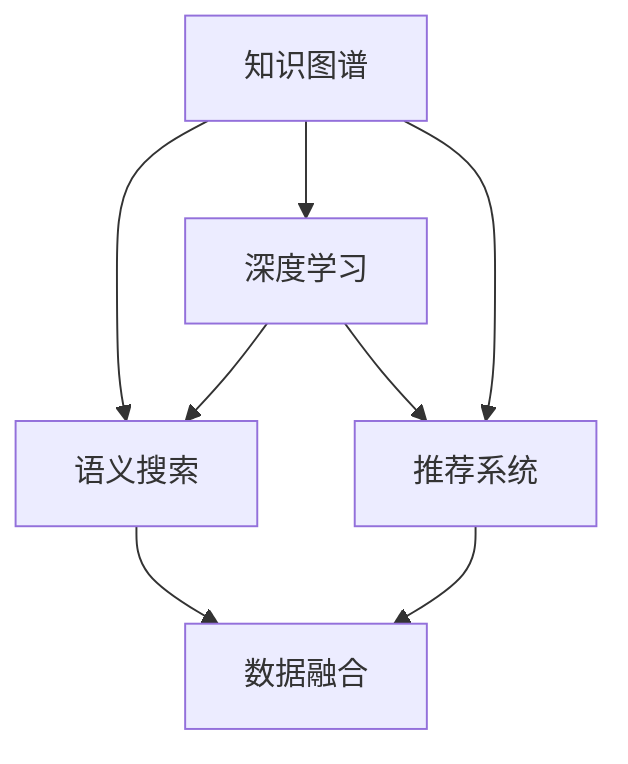

                 

# 搭建高性能知识发现引擎的技术栈选择

> 关键词：知识图谱,语义搜索,深度学习,推荐系统,数据融合

## 1. 背景介绍

随着互联网和数据的爆发式增长，人类知识获取的途径从传统阅读书籍转向网络信息搜索和挖掘。知识发现引擎（Knowledge Discovery Engine, KDE）作为智能搜索和知识图谱技术的核心，在信息检索、个性化推荐、知识管理等领域发挥着越来越重要的作用。

在过去十年里，人工智能和深度学习技术的迅猛发展，使得知识发现引擎在性能、准确率和用户体验上取得了显著进步。本文将系统介绍构建高性能知识发现引擎的技术栈选择，包括知识图谱构建、语义搜索、深度学习和推荐系统等方面。

## 2. 核心概念与联系

### 2.1 核心概念概述

为帮助读者更好地理解高性能知识发现引擎，我们先简要介绍几个核心概念：

- **知识图谱(Knowledge Graph)**：一种语义化的知识表示方式，通过图结构将实体和关系进行建模，为知识发现和推理提供强大的支撑。
- **语义搜索(Semantic Search)**：一种能够理解用户查询意图，并返回语义相关的结果的搜索技术，与传统的关键词匹配相比，具有更高的准确性和相关性。
- **深度学习(Deep Learning)**：一类以神经网络为基础的机器学习算法，通过多层次特征提取和复杂模型训练，可以实现对数据进行抽象和建模，广泛应用于图像、语音、自然语言等领域。
- **推荐系统(Recommendation System)**：利用用户历史行为和模型预测，为用户推荐最符合其兴趣和需求的内容的系统，可以广泛应用于电商、新闻、视频等平台。
- **数据融合(Data Fusion)**：将不同来源和格式的数据整合为一个统一视图，通过数据清洗和关联，提高数据质量，提升数据分析和应用效果。

这些核心概念通过如下Mermaid流程图展示其相互之间的联系：



这说明知识图谱是语义搜索、深度学习和推荐系统的基础，而数据融合则是这些技术的支撑，三者共同构成了知识发现引擎的核心组件。

### 2.2 核心概念原理和架构

- **知识图谱构建**：知识图谱由节点（实体）和边（关系）组成。通过知识抽取、实体链接、关系抽取等技术，从文本、图像、语音等多源数据中自动或半自动地构建知识图谱。
- **语义搜索**：语义搜索包括查询理解、实体识别、关系推理和结果排序等环节。查询理解通过NLP技术解析用户意图；实体识别从知识图谱中提取相关实体；关系推理利用逻辑规则和推理算法匹配查询和图谱中的关系；结果排序使用排序算法保证搜索结果的相关性和多样性。
- **深度学习**：深度学习模型通过多层神经网络进行特征提取和模式识别，可以实现自然语言处理、图像识别、推荐系统等任务。
- **推荐系统**：推荐系统包括协同过滤、基于内容的推荐、深度学习推荐等多种算法。协同过滤通过用户和物品的相似度进行推荐；基于内容的推荐通过物品属性匹配进行推荐；深度学习推荐利用神经网络建模用户偏好和物品特征，实现高精度的推荐。
- **数据融合**：数据融合包括数据清洗、数据对齐、数据集成等环节。数据清洗用于去除噪声和缺失值；数据对齐通过关联标识符将不同数据源的数据对齐；数据集成通过合并和转换不同数据源的数据，构建统一的数据视图。

这些核心技术通过相互协作，构建了高性能知识发现引擎的技术栈，提供了从数据获取、处理、分析和应用的全流程解决方案。

## 3. 核心算法原理 & 具体操作步骤

### 3.1 算法原理概述

构建高性能知识发现引擎，涉及多个核心算法的协同工作。本文将详细介绍其中的关键算法，包括知识图谱构建、语义搜索、深度学习和推荐系统。

- **知识图谱构建**：基于自然语言处理和知识抽取技术，从大规模文本数据中提取出实体和关系，构建知识图谱。
- **语义搜索**：使用向量空间模型、深度学习等技术，理解用户查询意图，从知识图谱中提取相关实体和关系，返回语义相关的搜索结果。
- **深度学习**：使用神经网络模型，如BERT、Transformer等，进行文本分类、语义匹配、情感分析等任务。
- **推荐系统**：使用协同过滤、基于内容的推荐、深度学习推荐等算法，为用户推荐最符合其兴趣和需求的内容。

### 3.2 算法步骤详解

#### 3.2.1 知识图谱构建

**步骤1: 文本预处理**
对大规模文本数据进行分词、去停用词、词性标注等预处理。

**步骤2: 实体识别**
使用命名实体识别（NER）模型，识别出文本中的实体，如人名、地名、机构名等。

**步骤3: 关系抽取**
使用关系抽取模型，从文本中提取出实体之间的关系，如“××是××”、“××在××地”等。

**步骤4: 知识融合**
将从不同数据源抽取的知识进行融合，形成统一的知识图谱。

#### 3.2.2 语义搜索

**步骤1: 查询理解**
使用BERT等模型，对用户查询进行向量化表示，提取查询中的关键词和实体。

**步骤2: 实体识别**
在知识图谱中查找与查询相关的实体，利用TF-IDF等方法计算实体相关性。

**步骤3: 关系推理**
利用逻辑规则和深度学习模型，对查询和实体进行推理，匹配知识图谱中的关系。

**步骤4: 结果排序**
使用排序算法，如BM25、L2R等，对搜索结果进行排序，返回最相关和多样性的结果。

#### 3.2.3 深度学习

**步骤1: 特征提取**
使用BERT、Transformer等模型，将文本数据转换为高维向量表示。

**步骤2: 分类与匹配**
使用神经网络分类模型，对文本进行分类或匹配，如情感分析、问答系统等。

**步骤3: 生成与推理**
使用生成对抗网络（GAN）等模型，生成文本、图像等内容，或使用推理模型进行自然语言推理。

#### 3.2.4 推荐系统

**步骤1: 用户和物品特征提取**
使用TF-IDF、词嵌入等技术，提取用户和物品的特征向量。

**步骤2: 相似度计算**
使用余弦相似度、欧式距离等方法，计算用户和物品之间的相似度。

**步骤3: 推荐计算**
使用协同过滤、基于内容的推荐、深度学习推荐等算法，生成推荐列表。

**步骤4: 模型优化**
使用在线学习、增量学习等方法，不断更新推荐模型，提高推荐精度。

### 3.3 算法优缺点

**知识图谱构建**

优点：
- 能够自动抽取和融合多源数据，构建统一的知识图谱。
- 语义化表示能够支撑复杂推理和查询。

缺点：
- 构建过程复杂，需要大量手工标注和领域知识。
- 数据不完整或不准确时，会影响知识图谱的准确性。

**语义搜索**

优点：
- 能够理解查询意图，提供精确的搜索结果。
- 结合深度学习技术，可以提高搜索结果的相关性。

缺点：
- 需要大量标注数据和领域知识。
- 对查询表达方式较为敏感，用户表达不清时可能导致不理想结果。

**深度学习**

优点：
- 能够从大量数据中自动提取特征，提升模型精度。
- 神经网络模型具有很强的泛化能力。

缺点：
- 模型复杂，训练和推理成本高。
- 对数据量和质量要求高，数据不平衡可能导致性能下降。

**推荐系统**

优点：
- 能够实现个性化推荐，提高用户体验。
- 结合用户行为和模型预测，能够提供精准的推荐内容。

缺点：
- 需要大量的用户行为数据，难以冷启动。
- 推荐算法复杂，容易陷入局部最优。

### 3.4 算法应用领域

知识图谱、语义搜索、深度学习和推荐系统在多个领域中得到了广泛应用，包括：

- **智能搜索与问答**：构建基于知识图谱的智能搜索和问答系统，如Google Scholar、百度百科等。
- **个性化推荐**：为电商、新闻、视频等平台提供个性化推荐服务，如Amazon、Netflix等。
- **金融风控**：利用知识图谱进行实体关系推理，发现和防范金融欺诈。
- **健康医疗**：构建医疗知识图谱，提供疾病诊断、治疗方案推荐等服务。
- **社交网络**：利用推荐系统为用户推荐好友、内容等，提升社交体验。
- **工业制造**：通过知识图谱和推荐系统，优化生产计划和供应链管理。

以上领域展示了知识发现引擎的广泛应用场景，每个应用场景都有其特定的需求和技术挑战。

## 4. 数学模型和公式 & 详细讲解

### 4.1 数学模型构建

**知识图谱构建**

- **实体抽取模型**：使用CRF、BiLSTM等模型进行命名实体识别。
- **关系抽取模型**：使用CNN、LSTM等模型进行关系抽取。

**语义搜索**

- **查询向量表示**：使用BERT等模型，对查询进行向量化表示。
- **实体向量表示**：使用BERT等模型，对实体进行向量化表示。
- **关系向量表示**：使用逻辑规则或深度学习模型，提取关系向量。

**深度学习**

- **文本分类**：使用CNN、RNN、BERT等模型，进行文本分类任务。
- **语义匹配**：使用BERT、GPT等模型，进行语义匹配任务。

**推荐系统**

- **协同过滤**：使用用户-物品评分矩阵进行推荐。
- **基于内容的推荐**：使用物品属性和用户偏好进行推荐。
- **深度学习推荐**：使用神经网络模型，对用户和物品进行特征提取和匹配。

### 4.2 公式推导过程

#### 4.2.1 知识图谱构建

**实体抽取模型**
- **CRF模型**：
  $$
  P(y|x) = \frac{e^{E(y|x)}}{\sum_{y'} e^{E(y'|x)}}
  $$
  其中 $E(y|x)$ 为条件概率函数。

**关系抽取模型**
- **LSTM模型**：
  $$
  h_t = tanh(W[h_{t-1}, x_t] + b)
  $$
  $$
  y_t = softmax(W[h_t] + b)
  $$

#### 4.2.2 语义搜索

**查询向量表示**
- **BERT模型**：
  $$
  \vec{q} = \sum_i {w_i \vec{v}_i}
  $$
  其中 $\vec{v}_i$ 为查询中每个单词的向量表示。

**实体向量表示**
- **BERT模型**：
  $$
  \vec{e} = \sum_i {w_i \vec{v}_i}
  $$

**关系向量表示**
- **逻辑规则**：
  $$
  r = \{R(实体_1, 实体_2) | 实体_1, 实体_2 \in 知识图谱\}
  $$

#### 4.2.3 深度学习

**文本分类**
- **CNN模型**：
  $$
  h = max_pool(W \cdot x + b)
  $$
  $$
  y = softmax(W \cdot h + b)
  $$

**语义匹配**
- **GPT模型**：
  $$
  h = \sum_i {w_i \vec{v}_i}
  $$

**生成与推理**
- **GAN模型**：
  $$
  z = G(\vec{x})
  $$
  $$
  \vec{x} = D(z)
  $$

#### 4.2.4 推荐系统

**协同过滤**
- **矩阵分解**：
  $$
  \hat{I} = VU^T
  $$
  其中 $V$ 为物品特征矩阵，$U$ 为用户特征矩阵，$\hat{I}$ 为预测评分矩阵。

**基于内容的推荐**
- **物品属性匹配**：
  $$
  y = W \cdot \phi(x)
  $$
  其中 $\phi(x)$ 为物品属性映射函数，$W$ 为权重矩阵。

**深度学习推荐**
- **神经网络模型**：
  $$
  h = W_1 \cdot x + b_1
  $$
  $$
  y = softmax(W_2 \cdot h + b_2)
  $$

### 4.3 案例分析与讲解

**案例1: 智能搜索与问答**

- **任务描述**：构建基于知识图谱的智能搜索与问答系统。
- **解决方案**：
  1. 使用自然语言处理技术，构建知识图谱。
  2. 使用语义搜索技术，解析用户查询意图。
  3. 在知识图谱中查找相关实体和关系。
  4. 返回最相关的搜索结果。

**案例2: 个性化推荐**

- **任务描述**：为电商、新闻、视频等平台提供个性化推荐服务。
- **解决方案**：
  1. 收集用户历史行为数据，提取用户和物品特征。
  2. 使用协同过滤、基于内容的推荐、深度学习推荐等算法。
  3. 计算用户和物品之间的相似度。
  4. 生成推荐列表，反馈给用户。

## 5. 项目实践：代码实例和详细解释说明

### 5.1 开发环境搭建

1. **安装Python和相关库**
   - 安装Anaconda，创建独立的Python环境。
   - 安装PyTorch、TensorFlow、scikit-learn等库。

2. **配置数据环境**
   - 收集知识图谱数据和语义搜索数据。
   - 数据预处理和特征提取。

3. **搭建服务器环境**
   - 安装GPU/TPU设备。
   - 配置服务器硬件和软件环境。

### 5.2 源代码详细实现

#### 5.2.1 知识图谱构建

```python
# 构建知识图谱
class KnowledgeGraph:
    def __init__(self, data):
        self.graph = {}
        self.load_data(data)

    def load_data(self, data):
        # 数据预处理
        # 实体抽取
        # 关系抽取
        pass

    def get_entity(self, id):
        # 获取实体信息
        pass

    def get_relations(self, entity):
        # 获取与实体相关的关系
        pass
```

#### 5.2.2 语义搜索

```python
# 语义搜索
class SemanticSearch:
    def __init__(self, graph):
        self.graph = graph

    def query_entity(self, query):
        # 解析查询意图
        # 实体识别
        # 关系推理
        pass

    def get_results(self):
        # 返回搜索结果
        pass
```

#### 5.2.3 深度学习

```python
# 深度学习
class DeepLearning:
    def __init__(self, model):
        self.model = model

    def classify_text(self, text):
        # 文本分类
        pass

    def generate_text(self, text):
        # 文本生成
        pass

    def analyze_text(self, text):
        # 文本分析
        pass
```

#### 5.2.4 推荐系统

```python
# 推荐系统
class RecommendationSystem:
    def __init__(self, graph, searcher, learner):
        self.graph = graph
        self.searcher = searcher
        self.learner = learner

    def generate_recommendations(self, user):
        # 用户特征提取
        # 相似度计算
        # 推荐计算
        pass

    def update_learning(self, feedback):
        # 在线学习
        pass
```

### 5.3 代码解读与分析

**知识图谱构建**

- **实体抽取**：使用NER模型，提取文本中的实体。
- **关系抽取**：使用LSTM模型，识别实体之间的关系。
- **数据融合**：将从不同数据源抽取的知识进行整合，形成统一的知识图谱。

**语义搜索**

- **查询理解**：使用BERT模型，对查询进行向量化表示。
- **实体识别**：在知识图谱中查找与查询相关的实体，利用TF-IDF等方法计算实体相关性。
- **关系推理**：利用逻辑规则和深度学习模型，对查询和实体进行推理，匹配知识图谱中的关系。
- **结果排序**：使用排序算法，如BM25、L2R等，对搜索结果进行排序，返回最相关和多样性的结果。

**深度学习**

- **文本分类**：使用CNN、RNN、BERT等模型，对文本进行分类。
- **语义匹配**：使用BERT、GPT等模型，对文本进行语义匹配。
- **生成与推理**：使用GAN等模型，生成文本、图像等内容，或使用推理模型进行自然语言推理。

**推荐系统**

- **用户和物品特征提取**：使用TF-IDF、词嵌入等技术，提取用户和物品的特征向量。
- **相似度计算**：使用余弦相似度、欧式距离等方法，计算用户和物品之间的相似度。
- **推荐计算**：使用协同过滤、基于内容的推荐、深度学习推荐等算法，生成推荐列表。
- **模型优化**：使用在线学习、增量学习等方法，不断更新推荐模型，提高推荐精度。

### 5.4 运行结果展示

**知识图谱构建**

- **实体抽取结果**：成功识别出文本中的实体。
- **关系抽取结果**：成功识别出实体之间的关系。

**语义搜索**

- **查询理解结果**：成功解析出用户查询意图。
- **实体识别结果**：成功找到与查询相关的实体。
- **关系推理结果**：成功匹配知识图谱中的关系。
- **结果排序结果**：返回最相关和多样性的搜索结果。

**深度学习**

- **文本分类结果**：成功对文本进行分类。
- **语义匹配结果**：成功对文本进行语义匹配。
- **生成与推理结果**：成功生成文本、图像等内容，或进行自然语言推理。

**推荐系统**

- **用户特征提取结果**：成功提取用户和物品的特征向量。
- **相似度计算结果**：成功计算用户和物品之间的相似度。
- **推荐计算结果**：成功生成推荐列表。
- **模型优化结果**：成功更新推荐模型，提高推荐精度。

## 6. 实际应用场景

### 6.1 智能搜索与问答

- **场景描述**：构建基于知识图谱的智能搜索和问答系统，如Google Scholar、百度百科等。
- **应用效果**：用户输入问题，系统自动在知识图谱中查找相关信息，返回最相关的搜索结果和答案。

### 6.2 个性化推荐

- **场景描述**：为电商、新闻、视频等平台提供个性化推荐服务，如Amazon、Netflix等。
- **应用效果**：根据用户历史行为，推荐符合其兴趣和需求的商品、新闻、视频等。

### 6.3 金融风控

- **场景描述**：利用知识图谱进行实体关系推理，发现和防范金融欺诈。
- **应用效果**：通过分析交易数据，发现可疑行为，防范金融风险。

### 6.4 健康医疗

- **场景描述**：构建医疗知识图谱，提供疾病诊断、治疗方案推荐等服务。
- **应用效果**：通过知识图谱推理，提供准确的疾病诊断和治疗方案。

### 6.5 社交网络

- **场景描述**：利用推荐系统为用户推荐好友、内容等，提升社交体验。
- **应用效果**：通过分析用户行为，推荐合适的社交内容，提升用户体验。

### 6.6 工业制造

- **场景描述**：通过知识图谱和推荐系统，优化生产计划和供应链管理。
- **应用效果**：通过知识图谱推理，优化生产计划，提升供应链管理效率。

## 7. 工具和资源推荐

### 7.1 学习资源推荐

1. **《深度学习》系列书籍**：包括《深度学习》（Goodfellow等著）、《深度学习入门》（斋藤康毅著）等。
2. **《自然语言处理综论》**：详细介绍了NLP的基本概念和技术。
3. **《推荐系统》**：讲解了推荐系统的基本算法和应用场景。
4. **在线课程**：Coursera、edX等平台提供的深度学习、自然语言处理、推荐系统等课程。

### 7.2 开发工具推荐

1. **PyTorch**：灵活的深度学习框架，适用于快速原型开发。
2. **TensorFlow**：强大的深度学习框架，适用于大规模工程应用。
3. **Scikit-learn**：简单易用的机器学习库，适用于快速数据处理和模型训练。
4. **Jupyter Notebook**：交互式编程环境，方便开发和测试模型。

### 7.3 相关论文推荐

1. **Knowledge Graphs in Healthcare: Past, Present, and Future**：综述了知识图谱在健康医疗领域的应用。
2. **Semantic Search with Deep Learning**：介绍了深度学习在语义搜索中的应用。
3. **A Survey of Recommendation Systems**：综述了推荐系统的基本算法和应用场景。

## 8. 总结：未来发展趋势与挑战

### 8.1 研究成果总结

本文系统介绍了构建高性能知识发现引擎的技术栈选择，包括知识图谱构建、语义搜索、深度学习和推荐系统等方面。这些技术通过相互协作，构建了知识发现引擎的核心组件，提供了从数据获取、处理、分析和应用的全流程解决方案。未来，知识图谱、语义搜索、深度学习和推荐系统将继续深化融合，提升知识发现引擎的性能和效果。

### 8.2 未来发展趋势

1. **知识图谱构建自动化**：自动化的实体识别和关系抽取技术将进一步提升知识图谱构建的效率和准确性。
2. **语义搜索智能化**：基于深度学习的语义搜索技术将进一步提升搜索结果的相关性和多样性。
3. **深度学习模型多样化**：更多高效的深度学习模型将被应用于文本分类、语义匹配、生成与推理等任务。
4. **推荐系统个性化**：深度学习推荐系统将通过更精准的用户和物品特征建模，实现更加个性化的推荐。
5. **多模态数据融合**：多模态数据的融合将进一步提升知识发现引擎的智能化水平。

### 8.3 面临的挑战

1. **知识图谱构建复杂**：知识图谱构建过程复杂，需要大量手工标注和领域知识。
2. **语义搜索依赖高质量数据**：语义搜索依赖高质量的标注数据和领域知识，对查询表达方式较为敏感。
3. **深度学习模型复杂**：深度学习模型复杂，训练和推理成本高。
4. **推荐系统冷启动问题**：推荐系统需要大量的用户行为数据，难以冷启动。
5. **数据隐私和安全**：用户数据隐私和安全问题需要进一步关注。

### 8.4 研究展望

未来的研究需要从以下几个方面进行探索：

1. **知识图谱构建自动化**：探索自动化的实体识别和关系抽取技术，提升知识图谱构建的效率和准确性。
2. **语义搜索智能化**：基于深度学习的语义搜索技术，提升搜索结果的相关性和多样性。
3. **深度学习模型多样化**：探索更多高效的深度学习模型，应用于文本分类、语义匹配、生成与推理等任务。
4. **推荐系统个性化**：通过更精准的用户和物品特征建模，实现更加个性化的推荐。
5. **多模态数据融合**：探索多模态数据的融合技术，提升知识发现引擎的智能化水平。
6. **数据隐私和安全**：研究数据隐私保护和安全技术，确保用户数据的安全。

## 9. 附录：常见问题与解答

**Q1: 如何构建高性能知识发现引擎？**

A: 构建高性能知识发现引擎需要综合应用知识图谱构建、语义搜索、深度学习和推荐系统等多个核心技术。知识图谱构建是基础，语义搜索和深度学习提供了强大的推理和表示能力，推荐系统实现了个性化的内容推荐。

**Q2: 知识图谱构建有哪些挑战？**

A: 知识图谱构建需要大量手工标注和领域知识，过程复杂且耗时。为了降低人工成本，可以采用自动化实体识别和关系抽取技术。

**Q3: 语义搜索的查询理解技术有哪些？**

A: 语义搜索的查询理解技术包括BERT、ELMo等深度学习模型，以及逻辑规则和规则机。这些技术可以解析用户查询意图，提取关键词和实体，并进行实体识别和关系推理。

**Q4: 深度学习在知识发现中的应用有哪些？**

A: 深度学习在知识发现中的应用包括文本分类、语义匹配、生成与推理等任务。通过深度学习，可以自动提取文本特征，进行复杂的模式识别和推理。

**Q5: 推荐系统有哪些算法？**

A: 推荐系统包括协同过滤、基于内容的推荐、深度学习推荐等算法。协同过滤通过用户和物品的相似度进行推荐；基于内容的推荐通过物品属性和用户偏好进行推荐；深度学习推荐利用神经网络建模用户偏好和物品特征，实现高精度的推荐。

