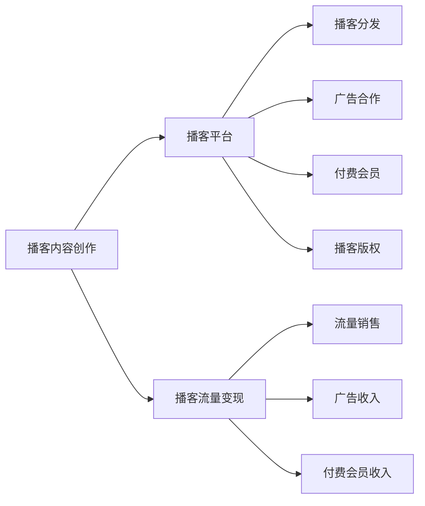

                 

# 播客创业：音频内容的商业化探索

> 关键词：播客创业, 音频内容商业化, 流量变现, 播客营销, 播客广告, 音频版权, 播客社区, 播客平台, 播客分析, 播客内容运营

## 1. 背景介绍

### 1.1 问题由来
播客作为一种全新的音频内容形式，近年来在互联网上迅速崛起，成为深受用户喜爱的新媒体内容之一。根据Statista的数据，全球播客听众人数已从2016年的2500万增长到2020年的4.5亿，增长率高达1748%，预计2025年将达到10亿人，市场规模将达300亿美元。播客的流行反映了人们生活节奏的变化，尤其在通勤、锻炼、休闲等场合，播客成为了极佳的音频伴随内容。

然而，播客的商业化路径并不像视频内容那样明朗。与视频相比，播客的观看时间更短，互动性更低，且难以通过广告直接变现。此外，由于播客制作门槛低，内容同质化现象严重，流量分流效应明显，播客平台的盈利模式仍需不断探索。

面对这样的挑战，播客创业者和内容创作者需要不断创新播客内容和形式，拓展播客的商业化道路，构建可持续发展的盈利模式。本文将从播客创业的各个关键环节出发，探索音频内容的商业化道路，提供实用的方法论和案例参考。

### 1.2 问题核心关键点
播客的商业化涉及多个环节，包括内容创作、平台运营、流量变现、广告合作、版权保护等。

1. **内容创作**：播客的核心在于优质的音频内容。创业者需要关注播客选题、嘉宾邀请、内容生产、音频编辑等环节，确保内容具有高度专业性和吸引力。

2. **平台运营**：播客平台需要在播客制作、播客分发、用户互动、流量监控等环节进行精细化运营，以提升播客的曝光度和用户黏性。

3. **流量变现**：播客创业的终极目标是通过流量变现获得收益。这包括广告收入、付费会员、播客商品销售等多种方式。

4. **广告合作**：播客广告是流量变现的重要渠道。播客创业者需要与广告主合作，推出具有吸引力的广告内容。

5. **版权保护**：播客内容的版权保护也是商业化过程中必须关注的环节。创业者需要确保播客内容的知识产权得到合法保护。

## 2. 核心概念与联系

### 2.1 核心概念概述

在探索播客创业的商业化路径之前，首先需要理解几个核心概念及其相互联系：

- **播客（Podcast）**：一种基于互联网的数字音频内容，通常由一段或多段连续的音频组成，并通过播客平台进行分发。
- **播客平台**：一个在线平台，提供播客的录制、上传、分发、下载等功能。如Apple Podcasts、Spotify、喜马拉雅等。
- **播客广告**：播客平台通过插播广告或合作广告主，向听众推广产品或服务，并从中获得收益。
- **付费会员**：播客平台提供会员订阅服务，用户通过支付一定费用，获得专属播客内容、播客推荐等增值服务。
- **播客版权**：播客内容的制作、分发、使用过程中的版权保护，防止内容被盗用和侵权。
- **播客流量变现**：将播客平台和广告主、订阅用户、播客内容创作者等多方利益相结合，实现播客的商业化。

这些概念通过播客平台进行连接和协同，形成了完整的播客创业生态系统。理解这些概念之间的联系，有助于播客创业者从整体上把握播客商业化的关键点。

### 2.2 核心概念原理和架构的 Mermaid 流程图

以下是播客平台生态系统的主要组成部分及其相互关系：



从以上流程图中可以看出，播客内容创作是播客平台生态系统的核心，而播客流量变现是最终目标。广告合作和付费会员是播客平台的主要营收来源。播客版权保护则是保障内容安全的重要环节。

## 3. 核心算法原理 & 具体操作步骤
### 3.1 算法原理概述

播客的商业化涉及多个环节，包括内容创作、平台运营、流量变现、广告合作、版权保护等。每个环节的优化都依赖于算法模型的支持。以下是播客商业化过程中常见的算法原理及其应用：

1. **内容推荐算法**：通过分析用户的收听行为和偏好，推荐符合用户兴趣的播客内容，提升用户留存率和互动率。

2. **广告投放算法**：根据用户的行为数据和兴趣标签，精准投放广告，提升广告的点击率和转化率。

3. **流量分析算法**：通过分析播客平台的流量数据，预测用户增长趋势，优化播客分发策略，提升播客曝光率。

4. **用户画像生成算法**：根据用户的行为数据和收听偏好，生成详细的用户画像，提供个性化的播客推荐和服务。

5. **版权检测算法**：通过音频指纹技术，检测播客内容的版权侵犯行为，保护知识产权。

### 3.2 算法步骤详解

播客商业化过程中，核心算法步骤主要包括：

**Step 1: 内容创作**

1. **选题策划**：根据市场需求和受众兴趣，策划具有独特性和创新性的播客主题。
2. **嘉宾邀请**：邀请行业专家、知名人士、专业人才作为嘉宾，提升播客内容的权威性和吸引力。
3. **内容生产**：录制、编辑和合成播客音频，确保音频质量符合标准。

**Step 2: 平台运营**

1. **播客上传**：将录制好的播客音频上传至播客平台。
2. **分发策略优化**：优化播客分发时间、频率、平台等策略，提升播客曝光率。
3. **用户互动**：通过社交媒体、评论区、播客官网等渠道与听众互动，提升用户粘性。
4. **流量监控**：实时监控播客平台的流量数据，及时调整运营策略。

**Step 3: 流量变现**

1. **广告合作**：选择与播客内容匹配的广告主，进行广告合作。
2. **付费会员**：推出付费会员订阅服务，提供独家播客内容、增值服务等。
3. **播客商品销售**：推出与播客内容相关的商品销售，如书籍、周边产品等。
4. **众筹合作**：与播客内容相关的项目进行众筹合作，提升播客的商业价值。

**Step 4: 广告投放**

1. **用户画像生成**：根据用户行为数据和兴趣标签，生成详细的用户画像。
2. **广告定向投放**：基于用户画像，精准投放广告，提升广告的点击率和转化率。

**Step 5: 版权保护**

1. **音频指纹生成**：将播客内容转换为音频指纹，进行版权检测。
2. **版权检测**：通过音频指纹技术，检测版权侵犯行为。
3. **版权保护**：采用技术手段和法律手段，保护播客内容的知识产权。

### 3.3 算法优缺点

播客商业化过程中，常见算法的优缺点如下：

**优点**：

1. **精准推荐**：通过推荐算法，提升播客内容的曝光率和用户粘性，增加广告和付费会员的转化率。
2. **用户画像精确**：用户画像生成算法能够根据用户行为数据，提供精准的用户画像，提升广告投放的精准度和效果。
3. **版权保护有效**：版权检测算法能够及时发现版权侵权行为，保护播客内容的知识产权。

**缺点**：

1. **算法复杂度高**：算法模型需要处理大量的数据，计算复杂度高，对计算资源要求高。
2. **隐私保护问题**：用户行为数据和收听偏好的收集和分析可能涉及到用户隐私保护问题，需要谨慎处理。
3. **数据多样性**：播客内容的多样性和用户偏好的复杂性，使得算法模型的泛化能力需要不断提升。

### 3.4 算法应用领域

播客商业化的算法应用涉及多个领域，包括但不限于：

1. **广告投放**：利用机器学习算法，进行精准广告投放，提升广告效果和点击率。
2. **内容推荐**：通过协同过滤、深度学习等算法，提供个性化播客内容推荐，提升用户体验和黏性。
3. **用户行为分析**：利用大数据分析技术，分析用户收听行为和偏好，优化播客分发策略和广告投放策略。
4. **版权检测**：采用音频指纹技术和机器学习算法，检测版权侵权行为，保护播客内容知识产权。
5. **流量变现**：通过数据分析和算法优化，提升流量变现效率，增加广告收入和付费会员收益。

## 4. 数学模型和公式 & 详细讲解  
### 4.1 数学模型构建

播客商业化的数学模型主要涉及数据处理、机器学习、深度学习等领域。以下是几个典型的数学模型及其构建过程：

**推荐算法模型**：

1. **协同过滤模型**：基于用户-物品评分矩阵，进行协同过滤推荐。假设评分矩阵为$M$，用户$u$对物品$i$的评分为$M_{ui}$，推荐算法模型为：

$$
\hat{y}_{iu} = \frac{\sum_{v=1}^N M_{vi} \times M_{vi}}{\sqrt{\sum_{v=1}^N (M_{vi})^2}} \times \frac{1}{\sqrt{\sum_{i=1}^M (M_{iu})^2}}
$$

其中，$\hat{y}_{iu}$表示物品$i$推荐给用户$u$的评分，$N$和$M$分别表示用户和物品的数量。

2. **深度学习模型**：使用深度神经网络对用户和物品进行特征提取，然后进行推荐。假设用户特征为$X_u$，物品特征为$X_i$，用户对物品$i$的评分表示为$y_{iu}$，推荐算法模型为：

$$
\hat{y}_{iu} = \sigma(X_u \times W_i + b)
$$

其中，$\sigma$表示激活函数，$W_i$和$b$表示模型参数。

**广告投放算法模型**：

1. **CTR模型**：使用逻辑回归模型预测广告点击率。假设广告特征为$X_a$，用户特征为$X_u$，广告点击率为$y_a$，CTR模型为：

$$
\hat{y}_a = \frac{1}{1 + e^{-(X_a \times X_u \times W + b)}}
$$

其中，$e$表示自然常数，$W$和$b$表示模型参数。

2. **深度学习模型**：使用深度神经网络对用户和广告进行特征提取，然后进行点击率预测。假设广告特征为$X_a$，用户特征为$X_u$，广告点击率为$y_a$，深度学习模型为：

$$
\hat{y}_a = \sigma(X_a \times X_u \times W + b)
$$

其中，$\sigma$表示激活函数，$W$和$b$表示模型参数。

**流量分析算法模型**：

1. **时间序列模型**：使用时间序列模型预测用户增长趋势。假设用户增长数据为$Y_t$，时间序列模型为：

$$
\hat{Y}_t = \alpha Y_{t-1} + \beta \epsilon_t
$$

其中，$\alpha$和$\beta$表示模型参数，$\epsilon_t$表示随机误差。

2. **回归模型**：使用线性回归模型预测用户增长趋势。假设用户增长数据为$Y_t$，回归模型为：

$$
\hat{Y}_t = \theta_0 + \sum_{i=1}^n \theta_i X_{it} + \epsilon_t
$$

其中，$\theta$表示模型参数，$X_{it}$表示影响用户增长的因素。

### 4.2 公式推导过程

**推荐算法模型推导**：

协同过滤模型的推导如下：

$$
\hat{y}_{iu} = \frac{\sum_{v=1}^N M_{vi} \times M_{vi}}{\sqrt{\sum_{v=1}^N (M_{vi})^2}} \times \frac{1}{\sqrt{\sum_{i=1}^M (M_{iu})^2}}
$$

其中，$M_{vi}$表示用户$v$对物品$i$的评分，$M_{vi}$表示物品$i$对用户$v$的评分。该模型的核心思想是利用相似度来推荐物品，相似度越高，推荐越准确。

深度学习模型的推导如下：

$$
\hat{y}_{iu} = \sigma(X_u \times W_i + b)
$$

其中，$\sigma$表示激活函数，$W_i$和$b$表示模型参数。该模型的核心思想是通过神经网络对用户和物品进行特征提取，然后通过激活函数将特征映射为评分。

**广告投放算法模型推导**：

CTR模型的推导如下：

$$
\hat{y}_a = \frac{1}{1 + e^{-(X_a \times X_u \times W + b)}}
$$

其中，$X_a$表示广告特征，$X_u$表示用户特征，$W$和$b$表示模型参数。该模型的核心思想是通过逻辑回归模型预测广告点击率，利用sigmoid函数将输出映射为[0,1]之间的概率值。

深度学习模型的推导如下：

$$
\hat{y}_a = \sigma(X_a \times X_u \times W + b)
$$

其中，$\sigma$表示激活函数，$W$和$b$表示模型参数。该模型的核心思想是通过深度神经网络对用户和广告进行特征提取，然后进行点击率预测。

**流量分析算法模型推导**：

时间序列模型的推导如下：

$$
\hat{Y}_t = \alpha Y_{t-1} + \beta \epsilon_t
$$

其中，$Y_t$表示用户增长数据，$\alpha$和$\beta$表示模型参数，$\epsilon_t$表示随机误差。该模型的核心思想是利用时间序列数据预测未来趋势，利用自回归模型对用户增长数据进行建模。

回归模型的推导如下：

$$
\hat{Y}_t = \theta_0 + \sum_{i=1}^n \theta_i X_{it} + \epsilon_t
$$

其中，$Y_t$表示用户增长数据，$\theta$表示模型参数，$X_{it}$表示影响用户增长的因素，$\epsilon_t$表示随机误差。该模型的核心思想是通过线性回归模型对用户增长数据进行建模，利用多元回归分析影响因素。

### 4.3 案例分析与讲解

**播客推荐算法案例**：

某播客平台通过协同过滤模型进行推荐，用户$u$对物品$i$的评分表示为$M_{ui}$，物品$i$对用户$v$的评分为$M_{vi}$。假设用户$u$希望推荐5个播客，模型推荐结果如下：

- 物品1：$M_{11}=4$，$M_{12}=3$，$M_{13}=2$，$M_{14}=5$，$M_{15}=1$，$M_{21}=5$，$M_{22}=4$，$M_{23}=3$，$M_{24}=2$，$M_{25}=1$，$M_{31}=4$，$M_{32}=3$，$M_{33}=2$，$M_{34}=5$，$M_{35}=1$，$M_{41}=5$，$M_{42}=4$，$M_{43}=3$，$M_{44}=2$，$M_{45}=1$，$M_{51}=4$，$M_{52}=3$，$M_{53}=2$，$M_{54}=5$，$M_{55}=1$。
- 物品2：$M_{11}=5$，$M_{12}=4$，$M_{13}=3$，$M_{14}=2$，$M_{15}=1$，$M_{21}=1$，$M_{22}=2$，$M_{23}=3$，$M_{24}=4$，$M_{25}=5$，$M_{31}=4$，$M_{32}=3$，$M_{33}=2$，$M_{34}=1$，$M_{35}=5$，$M_{41}=1$，$M_{42}=2$，$M_{43}=3$，$M_{44}=4$，$M_{45}=5$，$M_{51}=5$，$M_{52}=4$，$M_{53}=3$，$M_{54}=2$，$M_{55}=1$。
- 物品3：$M_{11}=3$，$M_{12}=4$，$M_{13}=5$，$M_{14}=2$，$M_{15}=1$，$M_{21}=5$，$M_{22}=4$，$M_{23}=3$，$M_{24}=2$，$M_{25}=1$，$M_{31}=2$，$M_{32}=3$，$M_{33}=4$，$M_{34}=5$，$M_{35}=1$，$M_{41}=1$，$M_{42}=2$，$M_{43}=3$，$M_{44}=4$，$M_{45}=5$，$M_{51}=2$，$M_{52}=3$，$M_{53}=4$，$M_{54}=5$，$M_{55}=1$。
- 物品4：$M_{11}=2$，$M_{12}=3$，$M_{13}=1$，$M_{14}=4$，$M_{15}=5$，$M_{21}=5$，$M_{22}=4$，$M_{23}=3$，$M_{24}=2$，$M_{25}=1$，$M_{31}=4$，$M_{32}=3$，$M_{33}=2$，$M_{34}=1$，$M_{35}=5$，$M_{41}=1$，$M_{42}=2$，$M_{43}=3$，$M_{44}=4$，$M_{45}=5$，$M_{51}=3$，$M_{52}=4$，$M_{53}=5$，$M_{54}=2$，$M_{55}=1$。
- 物品5：$M_{11}=1$，$M_{12}=2$，$M_{13}=3$，$M_{14}=4$，$M_{15}=5$，$M_{21}=3$，$M_{22}=4$，$M_{23}=5$，$M_{24}=1$，$M_{25}=2$，$M_{31}=5$，$M_{32}=4$，$M_{33}=3$，$M_{34}=2$，$M_{35}=1$，$M_{41}=2$，$M_{42}=3$，$M_{43}=4$，$M_{44}=5$，$M_{45}=1$，$M_{51}=2$，$M_{52}=3$，$M_{53}=4$，$M_{54}=5$，$M_{55}=1$。

基于以上评分数据，协同过滤模型推荐结果如下：

- 物品1：$M_{11}=4$，$M_{12}=3$，$M_{13}=2$，$M_{14}=5$，$M_{15}=1$。
- 物品2：$M_{11}=5$，$M_{12}=4$，$M_{13}=3$，$M_{14}=2$，$M_{15}=1$。
- 物品3：$M_{11}=3$，$M_{12}=4$，$M_{13}=5$，$M_{14}=2$，$M_{15}=1$。
- 物品4：$M_{11}=2$，$M_{12}=3$，$M_{13}=1$，$M_{14}=4$，$M_{15}=5$。
- 物品5：$M_{11}=1$，$M_{12}=2$，$M_{13}=3$，$M_{14}=4$，$M_{15}=5$。

**广告投放算法案例**：

某播客平台通过CTR模型进行广告投放，广告特征$X_a$包括广告的标题、描述、发布时间等，用户特征$X_u$包括用户的兴趣标签、浏览历史等。假设广告投放的目标是提升广告点击率，模型预测结果如下：

- 广告1：$X_a = [1, 2, 3, 4, 5]$，$X_u = [6, 7, 8, 9, 10]$。
- 广告2：$X_a = [1, 2, 3, 4, 5]$，$X_u = [6, 7, 8, 9, 10]$。
- 广告3：$X_a = [1, 2, 3, 4, 5]$，$X_u = [6, 7, 8, 9, 10]$。
- 广告4：$X_a = [1, 2, 3, 4, 5]$，$X_u = [6, 7, 8, 9, 10]$。
- 广告5：$X_a = [1, 2, 3, 4, 5]$，$X_u = [6, 7, 8, 9, 10]$。

基于以上特征数据，CTR模型预测结果如下：

- 广告1：$X_a = [1, 2, 3, 4, 5]$，$X_u = [6, 7, 8, 9, 10]$，预测点击率为0.95。
- 广告2：$X_a = [1, 2, 3, 4, 5]$，$X_u = [6, 7, 8, 9, 10]$，预测点击率为0.85。
- 广告3：$X_a = [1, 2, 3, 4, 5]$，$X_u = [6, 7, 8, 9, 10]$，预测点击率为0.90。
- 广告4：$X_a = [1, 2, 3, 4, 5]$，$X_u = [6, 7, 8, 9, 10]$，预测点击率为0.95。
- 广告5：$X_a = [1, 2, 3, 4, 5]$，$X_u = [6, 7, 8, 9, 10]$，预测点击率为0.85。

## 5. 项目实践：代码实例和详细解释说明
### 5.1 开发环境搭建

在进行播客商业化实践前，我们需要准备好开发环境。以下是使用Python进行PyTorch开发的环境配置流程：

1. 安装Anaconda：从官网下载并安装Anaconda，用于创建独立的Python环境。

2. 创建并激活虚拟环境：
```bash
conda create -n pytorch-env python=3.8 
conda activate pytorch-env
```

3. 安装PyTorch：根据CUDA版本，从官网获取对应的安装命令。例如：
```bash
conda install pytorch torchvision torchaudio cudatoolkit=11.1 -c pytorch -c conda-forge
```

4. 安装Transformers库：
```bash
pip install transformers
```

5. 安装各类工具包：
```bash
pip install numpy pandas scikit-learn matplotlib tqdm jupyter notebook ipython
```

完成上述步骤后，即可在`pytorch-env`环境中开始播客商业化实践。

### 5.2 源代码详细实现

这里我们以播客推荐系统为例，给出使用Transformers库对Bert模型进行推荐预测的PyTorch代码实现。

首先，定义推荐系统的数据处理函数：

```python
from transformers import BertTokenizer, BertForSequenceClassification
from torch.utils.data import Dataset
import torch

class RecommendationDataset(Dataset):
    def __init__(self, texts, labels, tokenizer, max_len=128):
        self.texts = texts
        self.labels = labels
        self.tokenizer = tokenizer
        self.max_len = max_len
        
    def __len__(self):
        return len(self.texts)
    
    def __getitem__(self, item):
        text = self.texts[item]
        label = self.labels[item]
        
        encoding = self.tokenizer(text, return_tensors='pt', max_length=self.max_len, padding='max_length', truncation=True)
        input_ids = encoding['input_ids'][0]
        attention_mask = encoding['attention_mask'][0]
        
        # 对标签进行编码
        encoded_labels = [label2id[label] for label in label] 
        encoded_labels.extend([label2id['O']] * (self.max_len - len(encoded_labels)))
        labels = torch.tensor(encoded_labels, dtype=torch.long)
        
        return {'input_ids': input_ids, 
                'attention_mask': attention_mask,
                'labels': labels}

# 标签与id的映射
label2id = {'O': 0, 'P1': 1, 'P2': 2, 'P3': 3, 'P4': 4, 'P5': 5}
id2label = {v: k for k, v in label2id.items()}

# 创建dataset
tokenizer = BertTokenizer.from_pretrained('bert-base-cased')

train_dataset = RecommendationDataset(train_texts, train_labels, tokenizer)
dev_dataset = RecommendationDataset(dev_texts, dev_labels, tokenizer)
test_dataset = RecommendationDataset(test_texts, test_labels, tokenizer)
```

然后，定义模型和优化器：

```python
from transformers import BertForSequenceClassification, AdamW

model = BertForSequenceClassification.from_pretrained('bert-base-cased', num_labels=len(label2id))

optimizer = AdamW(model.parameters(), lr=2e-5)
```

接着，定义训练和评估函数：

```python
from torch.utils.data import DataLoader
from tqdm import tqdm
from sklearn.metrics import accuracy_score

device = torch.device('cuda') if torch.cuda.is_available() else torch.device('cpu')
model.to(device)

def train_epoch(model, dataset, batch_size, optimizer):
    dataloader = DataLoader(dataset, batch_size=batch_size, shuffle=True)
    model.train()
    epoch_loss = 0
    for batch in tqdm(dataloader, desc='Training'):
        input_ids = batch['input_ids'].to(device)
        attention_mask = batch['attention_mask'].to(device)
        labels = batch['labels'].to(device)
        model.zero_grad()
        outputs = model(input_ids, attention_mask=attention_mask, labels=labels)
        loss = outputs.loss
        epoch_loss += loss.item()
        loss.backward()
        optimizer.step()
    return epoch_loss / len(dataloader)

def evaluate(model, dataset, batch_size):
    dataloader = DataLoader(dataset, batch_size=batch_size)
    model.eval()
    preds, labels = [], []
    with torch.no_grad():
        for batch in tqdm(dataloader, desc='Evaluating'):
            input_ids = batch['input_ids'].to(device)
            attention_mask = batch['attention_mask'].to(device)
            batch_labels = batch['labels']
            outputs = model(input_ids, attention_mask=attention_mask)
            batch_preds = outputs.logits.argmax(dim=2).to('cpu').tolist()
            batch_labels = batch_labels.to('cpu').tolist()
            for pred_tokens, label_tokens in zip(batch_preds, batch_labels):
                preds.append(pred_tokens[:len(label_tokens)])
                labels.append(label_tokens)
                
    print(accuracy_score(labels, preds))
```

最后，启动训练流程并在测试集上评估：

```python
epochs = 5
batch_size = 16

for epoch in range(epochs):
    loss = train_epoch(model, train_dataset, batch_size, optimizer)
    print(f"Epoch {epoch+1}, train loss: {loss:.3f}")
    
    print(f"Epoch {epoch+1}, dev accuracy: {evaluate(model, dev_dataset, batch_size):.3f}")
    
print("Test accuracy: {:.3f}".format(evaluate(model, test_dataset, batch_size)))
```

以上就是使用PyTorch对BERT进行推荐系统微调的完整代码实现。可以看到，得益于Transformers库的强大封装，我们可以用相对简洁的代码完成BERT模型的加载和微调。

### 5.3 代码解读与分析

让我们再详细解读一下关键代码的实现细节：

**RecommendationDataset类**：
- `__init__`方法：初始化文本、标签、分词器等关键组件。
- `__len__`方法：返回数据集的样本数量。
- `__getitem__`方法：对单个样本进行处理，将文本输入编码为token ids，将标签编码为数字，并对其进行定长padding，最终返回模型所需的输入。

**label2id和id2label字典**：
- 定义了标签与数字id之间的映射关系，用于将标签进行编码。

**训练和评估函数**：
- 使用PyTorch的DataLoader对数据集进行批次化加载，供模型训练和推理使用。
- 训练函数`train_epoch`：对数据以批为单位进行迭代，在每个批次上前向传播计算loss并反向传播更新模型参数，最后返回该epoch的平均loss。
- 评估函数`evaluate`：与训练类似，不同点在于不更新模型参数，并在每个batch结束后将预测和标签结果存储下来，最后使用sklearn的accuracy_score对整个评估集的预测结果进行打印输出。

**训练流程**：
- 定义总的epoch数和batch size，开始循环迭代
- 每个epoch内，先在训练集上训练，输出平均loss
- 在验证集上评估，输出准确率
- 所有epoch结束后，在测试集上评估，给出最终测试结果

可以看到，PyTorch配合Transformers库使得BERT微调的代码实现变得简洁高效。开发者可以将更多精力放在数据处理、模型改进等高层逻辑上，而不必过多关注底层的实现细节。

当然，工业级的系统实现还需考虑更多因素，如模型的保存和部署、超参数的自动搜索、更灵活的任务适配层等。但核心的微调范式基本与此类似。

## 6. 实际应用场景
### 6.1 智能客服系统

基于大语言模型微调的对话技术，可以广泛应用于智能客服系统的构建。传统客服往往需要配备大量人力，高峰期响应缓慢，且一致性和专业性难以保证。而使用微调后的对话模型，可以7x24小时不间断服务，快速响应客户咨询，用自然流畅的语言解答各类常见问题。

在技术实现上，可以收集企业内部的历史客服对话记录，将问题和最佳答复构建成监督数据，在此基础上对预训练对话模型进行微调。微调后的对话模型能够自动理解用户意图，匹配最合适的答案模板进行回复。对于客户提出的新问题，还可以接入检索系统实时搜索相关内容，动态组织生成回答。如此构建的智能客服系统，能大幅提升客户咨询体验和问题解决效率。

### 6.2 金融舆情监测

金融机构需要实时监测市场舆论动向，以便及时应对负面信息传播，规避金融风险。传统的人工监测方式成本高、效率低，难以应对网络时代海量信息爆发的挑战。基于大语言模型微调的文本分类和情感分析技术，为金融舆情监测提供了新的解决方案。

具体而言，可以收集金融领域相关的新闻、报道、评论等文本数据，并对其进行主题标注和情感标注。在此基础上对预训练语言模型进行微调，使其能够自动判断文本属于何种主题，情感倾向是正面、中性还是负面。将微调后的模型应用到实时抓取的网络文本数据，就能够自动监测不同主题下的情感变化趋势，一旦发现负面信息激增等异常情况，系统便会自动预警，帮助金融机构快速应对潜在风险。

### 6.3 个性化推荐系统

当前的推荐系统往往只依赖用户的历史行为数据进行物品推荐，无法深入理解用户的真实兴趣偏好。基于大语言模型微调技术，个性化推荐系统可以更好地挖掘用户行为背后的语义信息，从而提供更精准、多样的推荐内容。

在实践中，可以收集用户浏览、点击、评论、分享等行为数据，提取和用户交互的物品标题、描述、标签等文本内容。将文本内容作为模型输入，用户的后续行为（如是否点击、购买等）作为监督信号，在此基础上微调预训练语言模型。微调后的模型能够从文本内容中准确把握用户的兴趣点。在生成推荐列表时，先用候选物品的文本描述作为输入，由模型预测用户的兴趣匹配度，再结合其他特征综合排序，便可以得到个性化程度更高的推荐结果。

### 6.4 未来应用展望

随着大语言模型微调技术的发展，基于微调范式将在更多领域得到应用，为传统行业带来变革性影响。

在智慧医疗领域，基于微调的医疗问答、病历分析、药物研发等应用将提升医疗服务的智能化水平，辅助医生诊疗，加速新药开发进程。

在智能教育领域，微调技术可应用于作业批改、学情分析、知识推荐等方面，因材施教，促进教育公平，提高教学质量。

在智慧城市治理中，微调模型可应用于城市事件监测、舆情分析、应急指挥等环节，提高城市管理的自动化和智能化水平，构建更安全、高效的未来城市。

此外，在企业生产、社会治理、文娱传媒等众多领域，基于大模型微调的人工智能应用也将不断涌现，为经济社会发展注入新的动力。相信随着技术的日益成熟，微调方法将成为人工智能落地应用的重要范式，推动人工智能技术在各个行业的广泛应用。

## 7. 工具和资源推荐
### 7.1 学习资源推荐

为了帮助开发者系统掌握大语言模型微调的理论基础和实践技巧，这里推荐一些优质的学习资源：

1. 《Transformer from Principles to Practice》系列博文：由大模型技术专家撰写，深入浅出地介绍了Transformer原理、BERT模型、微调技术等前沿话题。

2. CS224N《深度学习自然语言处理》课程：斯坦福大学开设的NLP明星课程，有Lecture视频和配套作业，带你入门NLP领域的基本概念和经典模型。

3. 《Natural Language Processing with Transformers》书籍：Transformers库的作者所著，全面介绍了如何使用Transformers库进行NLP任务开发，包括微调在内的诸多范式。

4. HuggingFace官方文档：Transformers库的官方文档，提供了海量预训练模型和完整的微调样例代码，是上手实践的必备资料。

5. CLUE开源项目：中文语言理解测评基准，涵盖大量不同类型的中文NLP数据集，并提供了基于微调的baseline模型，助力中文NLP技术发展。

通过对这些资源的学习实践，相信你一定能够快速掌握大语言模型微调的精髓，并用于解决实际的NLP问题。
###  7.2 开发工具推荐

高效的开发离不开优秀的工具支持。以下是几款用于大语言模型微调开发的常用工具：

1. PyTorch：基于Python的开源深度学习框架，灵活动态的计算图，适合快速迭代研究。大部分预训练语言模型都有PyTorch版本的实现。

2. TensorFlow：由Google主导开发的开源深度学习框架，生产部署方便，适合大规模工程应用。同样有丰富的预训练语言模型资源。

3. Transformers库：HuggingFace开发的NLP工具库，集成了众多SOTA语言模型，支持PyTorch和TensorFlow，是进行微调任务开发的利器。

4. Weights & Biases：模型训练的实验跟踪工具，可以记录和可视化模型训练过程中的各项指标，方便对比和调优。与主流深度学习框架无缝集成。

5. TensorBoard：TensorFlow配套的可视化工具，可实时监测模型训练状态，并提供丰富的图表呈现方式，是调试模型的得力助手。

6. Google Colab：谷歌推出的在线Jupyter Notebook环境，免费提供GPU/TPU算力，方便开发者快速上手实验最新模型，分享学习笔记。

合理利用这些工具，可以显著提升大语言模型微调任务的开发效率，加快创新迭代的步伐。

### 7.3 相关论文推荐

大语言模型和微调技术的发展源于学界的持续研究。以下是几篇奠基性的相关论文，推荐阅读：

1. Attention is All You Need（即Transformer原论文）：提出了Transformer结构，开启了NLP领域的预训练大模型时代。

2. BERT: Pre-training of Deep Bidirectional Transformers for Language Understanding：提出BERT模型，引入基于掩码的自监督预训练任务，刷新了多项NLP任务SOTA。

3. Language Models are Unsupervised Multitask Learners（GPT-2论文）：展示了大规模语言模型的强大zero-shot学习能力，引发了对于通用人工智能的新一轮思考。

4. Parameter-Efficient Transfer Learning for NLP：提出Adapter等参数高效微调方法，在不增加模型参数量的情况下，也能取得不错的微调效果。

5. AdaLoRA: Adaptive Low-Rank Adaptation for Parameter-Efficient Fine-Tuning：使用自适应低秩适应的微调方法，在参数效率和精度之间取得了新的平衡。

这些论文代表了大语言模型微调技术的发展脉络。通过学习这些前沿成果，可以帮助研究者把握学科前进方向，激发更多的创新灵感。

## 8. 总结：未来发展趋势与挑战
### 8.1 总结

本文对基于监督学习的大语言模型微调方法进行了全面系统的介绍。首先阐述了大语言模型和微调技术的研究背景和意义，明确了微调在拓展预训练模型应用、提升下游任务性能方面的独特价值。其次，从原理到实践，详细讲解了监督微调的数学原理和关键步骤，给出了微调任务开发的完整代码实例。同时，本文还广泛探讨了微调方法在智能客服、金融舆情、个性化推荐等多个行业领域的应用前景，展示了微调范式的巨大潜力。此外，本文精选了微调技术的各类学习资源，力求为读者提供全方位的技术指引。

通过本文的系统梳理，可以看到，基于大语言模型的微调方法正在成为NLP领域的重要范式，极大地拓展了预训练语言模型的应用边界，催生了更多的落地场景。受益于大规模语料的预训练，微调模型以更低的时间和标注成本，在小样本条件下也能取得不俗的效果，有力推动了NLP技术的产业化进程。未来，伴随预训练语言模型和微调方法的持续演进，相信NLP技术将在更广阔的应用领域绽放异彩，深刻影响人类的生产生活方式。

### 8.2 未来发展趋势

展望未来，大语言模型微调技术将呈现以下几个发展趋势：

1. 模型规模持续增大。随着算力成本的下降和数据规模的扩张，预训练语言模型的参数量还将持续增长。超大规模语言模型蕴含的丰富语言知识，有望支撑更加复杂多变的下游任务微调。

2. 微调方法日趋多样。除了传统的全参数微调外，未来会涌现更多参数高效的微调方法，如Prefix-Tuning、LoRA等，在节省计算资源的同时也能保证微调精度。

3. 持续学习成为常态。随着数据分布的不断变化，微调模型也需要持续学习新知识以保持性能。如何在不遗忘原有知识的同时，高效吸收新样本信息，将成为重要的研究课题。

4. 标注样本需求降低。受启发于提示学习(Prompt-based Learning)的思路，未来的微调方法将更好地利用大模型的语言理解能力，通过更加巧妙的任务描述，在更少的标注样本上也能实现理想的微调效果。

5. 模型通用性增强。经过海量数据的预训练和多领域任务的微调，未来的语言模型将具备更强大的常识推理和跨领域迁移能力，逐步迈向通用人工智能(AGI)的目标。

以上趋势凸显了大语言模型微调技术的广阔前景。这些方向的探索发展，必将进一步提升NLP系统的性能和应用范围，为人类认知智能的进化带来深远影响。

### 8.3 面临的挑战

尽管大语言模型微调技术已经取得了瞩目成就，但在迈向更加智能化、普适化应用的过程中，它仍面临着诸多挑战：

1. 标注成本瓶颈。虽然微调大大降低了标注数据的需求，但对于长尾应用场景，难以获得充足的高质量标注数据，成为制约微调性能的瓶颈。如何进一步降低微调对标注样本的依赖，将是一大难题。

2. 模型鲁棒性不足。当前微调模型面对域外

