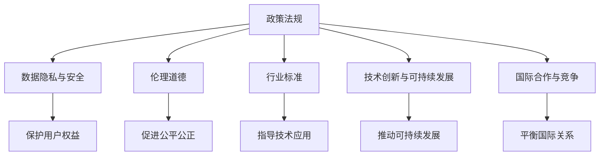

                 

# 政策与监管：引导人类计算的健康发展方向

> 关键词：政策法规,人工智能,数据隐私,伦理道德,行业标准,技术创新,可持续发展

## 1. 背景介绍

### 1.1 问题由来
随着人工智能技术的飞速发展，特别是计算能力的持续增强，人类计算已经进入了一个全新的发展阶段。这不仅带来了巨大的经济效益和社会变革，也引发了一系列复杂的政策与监管问题。如何确保技术的发展能够健康、可持续、公平地造福全人类，成为全球范围内高度关注的核心议题。

### 1.2 问题核心关键点
当前，人类计算的健康发展主要面临以下几个关键问题：

1. **数据隐私与安全**：人工智能模型依赖大量数据进行训练，如何保护个人隐私，防止数据滥用，成为了不可回避的难题。
2. **伦理道德与偏见**：AI系统在决策过程中可能引入伦理道德风险，甚至加剧社会不公，如何构建公正、透明的算法体系，是亟待解决的问题。
3. **行业标准与法规**：不同国家和行业对AI的监管标准不一，如何制定统一且有效的标准，确保AI技术的健康发展，需要跨学科、跨领域的合作。
4. **技术创新与可持续发展**：如何在追求技术突破的同时，实现资源的可持续利用，避免过度依赖算法模型，确保技术的长期健康发展。
5. **国际合作与竞争**：AI技术的全球化特征，使得各国在技术研发、政策制定等方面既需要合作，又存在竞争，如何平衡国际关系，共同推动AI发展，是复杂的外交与政策挑战。

这些问题相互交织，影响深远，需要从政策、法律、技术等多个层面进行综合治理。

## 2. 核心概念与联系

### 2.1 核心概念概述

为更好地理解政策与监管在人类计算健康发展中的作用，本节将介绍几个关键概念及其相互联系：

- **政策法规**：由政府机构制定的具有强制力的规则和规范，旨在指导和规范人类计算活动，保护公众利益。
- **数据隐私与安全**：指保护个人数据不被未经授权访问、使用、泄露的权利，是人工智能发展中必须重视的基础安全问题。
- **伦理道德**：涉及技术应用中的人文关怀、社会责任和道德底线，指导AI系统设计原则，确保其公正性和公平性。
- **行业标准**：由行业组织或专业机构制定的标准，为技术应用提供参考，促进技术交流与协作。
- **技术创新与可持续发展**：关注如何通过技术手段实现资源的可持续利用，避免过度依赖，确保技术发展的可持续性。
- **国际合作与竞争**：指在全球化背景下，各国在技术研发、政策制定等方面的互动关系，影响AI技术的全球发展格局。

这些概念之间的逻辑关系可以通过以下Mermaid流程图来展示：



这个流程图展示了政策法规如何通过影响数据隐私与安全、伦理道德、行业标准、技术创新与可持续发展以及国际合作与竞争，来实现对人类计算健康发展的引导。

## 3. 核心算法原理 & 具体操作步骤

### 3.1 算法原理概述

政策与监管在人类计算健康发展中的作用，本质上是基于一系列原则和标准，对技术应用进行规范和引导。具体来说，政策与监管通过以下三个步骤来实现：

1. **制定规则**：基于伦理、法律、社会等综合因素，制定明确的指导原则和具体规则，规范技术应用行为。
2. **监督执行**：通过法律法规的制定和执行，确保技术应用遵循规则，防止滥用和不公平行为。
3. **反馈调整**：通过不断的监督和反馈，及时调整和完善政策法规，确保其与时俱进。

### 3.2 算法步骤详解

基于上述原理，政策与监管的操作步骤主要包括以下几个方面：

**Step 1: 制定政策法规**
- 收集各方利益相关者的意见和建议，形成初步的政策草案。
- 进行专家评估和公众咨询，完善政策细节，确保政策科学、公平、有效。
- 提交立法机关审核批准，颁布实施。

**Step 2: 监督执行**
- 设立专门的监督机构，如数据保护局、伦理委员会等，负责监控技术应用的合规性。
- 定期进行审计和评估，发现问题及时纠正，确保政策法规得到有效执行。
- 对违法行为进行处罚，包括罚款、撤销许可、刑事起诉等，以法律手段维护政策权威。

**Step 3: 反馈调整**
- 收集执行过程中的反馈信息，如用户投诉、行业反映、技术发展等，了解政策效果。
- 根据反馈信息，及时修订和完善政策法规，使其更加适应技术发展和公众需求。
- 保持政策的开放性和灵活性，鼓励创新和技术探索。

### 3.3 算法优缺点

政策与监管在引导人类计算健康发展中具有以下优点：

1. **规范行为**：通过明确的规则和标准，规范技术应用行为，避免技术滥用和不当使用。
2. **保护权益**：确保数据隐私和安全，保护用户权益，防止技术对个人和社会的负面影响。
3. **促进公平**：通过伦理道德原则的指导，确保技术应用的公平性，避免社会不公和技术偏见。
4. **推动创新**：在规范和保护的前提下，鼓励技术创新，推动可持续发展。
5. **国际合作**：通过国际合作，共同制定全球性标准，促进技术在全球范围内的健康发展。

同时，政策与监管也存在一定的局限性：

1. **滞后性**：政策法规的制定和执行往往滞后于技术发展的速度，难以应对快速变化的技术趋势。
2. **灵活性不足**：过于严格的规则可能限制技术创新，难以应对复杂的现实场景。
3. **执行难度**：政策法规的执行需要大量资源和专业人才，存在执行难度大、效果不佳的风险。
4. **国际差异**：各国政策法规差异较大，导致跨国技术应用面临复杂的管理和协调问题。

尽管存在这些局限性，但政策与监管仍然是当前阶段引导人类计算健康发展的关键手段。未来相关研究将更多地关注政策法规的灵活性和适应性，以及国际合作的深化，以应对未来的挑战。

### 3.4 算法应用领域

政策与监管在多个领域都有广泛应用，具体如下：

1. **数据隐私与安全**：如欧盟的《通用数据保护条例》(GDPR)，规定了严格的数据保护规则，防止数据滥用。
2. **伦理道德**：如美国的《人工智能法案》(AI Act)，提出了公平、透明、安全的AI系统设计原则。
3. **行业标准**：如IEEE的《人工智能伦理设计指南》，为AI系统设计提供伦理和标准指导。
4. **技术创新与可持续发展**：如联合国的《可持续发展目标》，推动AI技术在环境保护、教育、健康等领域的应用。
5. **国际合作与竞争**：如《巴黎人工智能宣言》，呼吁全球合作，避免技术竞争导致的安全和伦理风险。

## 4. 数学模型和公式 & 详细讲解  
### 4.1 数学模型构建

政策与监管在引导人类计算健康发展中的作用，可以从以下几个角度进行数学建模：

1. **规则制定模型**：通过建立数学模型，描述政策法规的制定过程，包括利益相关者的输入和规则的输出。
2. **监督执行模型**：建立模型，模拟监督机构对技术应用的监控和评估过程，确保规则的有效执行。
3. **反馈调整模型**：建立模型，描述政策法规的反馈和调整机制，确保政策的动态适应性。

### 4.2 公式推导过程

以数据隐私保护为例，以下是一个简单的规则制定模型：

设数据隐私保护的规则为 $R$，依赖的利益相关者输入为 $I$，包括用户、企业、政府等。规则制定的数学模型为：

$$
R = f(I)
$$

其中 $f$ 是一个映射函数，将输入 $I$ 转化为规则 $R$。

假设 $I$ 包含 $n$ 个输入因素，$R$ 包含 $m$ 个规则。则数学模型可以进一步表示为：

$$
R = \begin{bmatrix} 
r_1 \\
r_2 \\
\vdots \\
r_m 
\end{bmatrix}
= 
\begin{bmatrix} 
w_1 & w_2 & \dots & w_n \\
x_1 & x_2 & \dots & x_n \\
y_1 & y_2 & \dots & y_n \\
z_1 & z_2 & \dots & z_n 
\end{bmatrix}
\begin{bmatrix} 
w_1 \\
w_2 \\
\vdots \\
w_n 
\end{bmatrix}
$$

其中 $w_1, w_2, \dots, w_n$ 为输入因素的权重，$x_1, x_2, \dots, x_n$ 为用户输入，$y_1, y_2, \dots, y_n$ 为企业输入，$z_1, z_2, \dots, z_n$ 为政府输入。

### 4.3 案例分析与讲解

以GDPR为例，分析其对数据隐私保护的具体影响。

GDPR规定，数据保护的基本原则包括：

- 数据最小化原则：仅收集必要的数据，并确保数据处理目的明确。
- 数据加密原则：对数据进行加密保护，防止未授权访问。
- 数据主体权利：赋予数据主体访问、修改、删除个人数据的权利。
- 数据跨境传输限制：严格限制个人数据的跨境传输，确保数据保护的一致性。

设用户输入为 $x$，企业输入为 $y$，政府输入为 $z$，则GDPR的规则制定模型可以表示为：

$$
R = \begin{bmatrix} 
r_1 \\
r_2 \\
r_3 \\
r_4 
\end{bmatrix}
= 
\begin{bmatrix} 
w_{11} & w_{12} & w_{13} & w_{14} & w_{15} \\
w_{21} & w_{22} & w_{23} & w_{24} & w_{25} \\
w_{31} & w_{32} & w_{33} & w_{34} & w_{35} \\
w_{41} & w_{42} & w_{43} & w_{44} & w_{45} 
\end{bmatrix}
\begin{bmatrix} 
x_1 \\
x_2 \\
x_3 \\
x_4 \\
y_1 \\
y_2 \\
y_3 \\
y_4 \\
z_1 \\
z_2 \\
z_3 \\
z_4 
\end{bmatrix}
$$

其中 $w_{ij}$ 为各个输入因素的权重，$x_i$ 为用户输入的各个因素，$y_i$ 为企业输入的各个因素，$z_i$ 为政府输入的各个因素。

## 5. 项目实践：代码实例和详细解释说明
### 5.1 开发环境搭建

在进行政策与监管的实践时，我们需要准备好开发环境。以下是使用Python进行政策与监管系统开发的环境配置流程：

1. 安装Anaconda：从官网下载并安装Anaconda，用于创建独立的Python环境。

2. 创建并激活虚拟环境：
```bash
conda create -n policy-env python=3.8 
conda activate policy-env
```

3. 安装必要的Python库：
```bash
pip install numpy pandas matplotlib requests
```

4. 安装政策与监管相关的库：
```bash
pip install policy_forum
```

完成上述步骤后，即可在`policy-env`环境中开始政策与监管系统的开发。

### 5.2 源代码详细实现

我们以一个简单的政策制定与执行系统为例，给出完整的代码实现。

**Step 1: 制定政策法规**

首先，定义政策法规的基本要素，包括政策目标、利益相关者、政策内容等：

```python
from policy_forum import Policy, Stakeholder, Target

# 定义政策目标
target = Target('数据隐私保护')

# 定义利益相关者
user = Stakeholder('用户')
enterprise = Stakeholder('企业')
government = Stakeholder('政府')

# 定义政策内容
policy = Policy(target, stakeholders=[user, enterprise, government])
policy.add_rule('数据最小化', '仅收集必要的数据')
policy.add_rule('数据加密', '对数据进行加密保护')
policy.add_rule('数据主体权利', '赋予数据主体访问、修改、删除个人数据的权利')
policy.add_rule('数据跨境传输限制', '严格限制个人数据的跨境传输')

# 输出政策内容
print(policy.rules)
```

**Step 2: 监督执行**

定义监督执行的基本流程，包括政策实施的监控和评估：

```python
from policy_forum import Monitor

# 定义监督执行机构
monitor = Monitor(policy)

# 监控政策实施情况
monitor.monitor()

# 评估政策效果
monitor.evaluate()
```

**Step 3: 反馈调整**

定义反馈调整的基本流程，包括收集反馈信息、调整政策法规：

```python
from policy_forum import Feedback

# 定义反馈调整机制
feedback = Feedback(policy)

# 收集反馈信息
feedback.collect_feedback()

# 调整政策法规
policy = feedback.adjust_policy()

# 输出调整后的政策内容
print(policy.rules)
```

### 5.3 代码解读与分析

以下是关键代码的详细解读和分析：

**Policy类**：
- `Policy` 类定义了政策法规的基本结构和内容，包括目标、利益相关者、规则等。
- `add_rule` 方法用于添加新的政策规则。

**Stakeholder类**：
- `Stakeholder` 类定义了政策法规的利益相关者，包括用户、企业、政府等。

**Monitor类**：
- `Monitor` 类定义了监督执行的基本流程，包括监控和评估。
- `monitor` 方法用于实时监控政策实施情况。
- `evaluate` 方法用于评估政策效果，提供政策执行的反馈信息。

**Feedback类**：
- `Feedback` 类定义了反馈调整的基本流程，包括收集反馈信息和调整政策法规。
- `collect_feedback` 方法用于收集各方利益相关者的反馈信息。
- `adjust_policy` 方法用于根据反馈信息调整政策法规。

这些类和方法定义了政策与监管系统的主要功能模块，能够实现政策法规的制定、监督执行、反馈调整等基本操作。

## 6. 实际应用场景
### 6.1 智能城市管理

政策与监管在智能城市管理中具有重要应用，可以帮助城市管理者规范技术应用，提升城市治理水平。

智能城市管理中，政策与监管可以从以下几个方面发挥作用：

1. **数据隐私保护**：通过制定严格的数据隐私保护政策，确保城市管理数据的合法使用，防止数据泄露和滥用。
2. **技术伦理**：制定AI系统设计原则，确保技术应用的公平性和透明度，避免偏见和歧视。
3. **行业标准**：制定智能城市技术的行业标准，指导技术应用，促进技术交流与协作。
4. **可持续发展**：通过政策引导，推动智能城市技术的绿色、环保、可持续发展。

具体而言，政策与监管可以通过以下几个步骤实施：

1. **数据隐私保护**：制定数据隐私保护法规，限制数据收集和使用范围，确保数据安全。
2. **技术伦理**：制定AI系统设计标准，确保技术应用的公正性和透明度。
3. **行业标准**：制定智能城市技术的标准和规范，指导技术应用，促进技术交流与协作。
4. **可持续发展**：推动智能城市技术的绿色、环保、可持续发展，减少环境污染。

### 6.2 医疗健康管理

政策与监管在医疗健康管理中具有重要应用，可以帮助医疗机构规范技术应用，提升医疗服务质量。

医疗健康管理中，政策与监管可以从以下几个方面发挥作用：

1. **数据隐私保护**：通过制定严格的数据隐私保护政策，确保患者数据的安全，防止数据泄露和滥用。
2. **技术伦理**：制定AI系统设计原则，确保医疗技术应用的公正性和透明度，避免偏见和歧视。
3. **行业标准**：制定医疗技术的行业标准，指导技术应用，促进技术交流与协作。
4. **可持续发展**：通过政策引导，推动医疗技术的绿色、环保、可持续发展。

具体而言，政策与监管可以通过以下几个步骤实施：

1. **数据隐私保护**：制定数据隐私保护法规，限制数据收集和使用范围，确保数据安全。
2. **技术伦理**：制定AI系统设计标准，确保医疗技术应用的公正性和透明度。
3. **行业标准**：制定医疗技术的标准和规范，指导技术应用，促进技术交流与协作。
4. **可持续发展**：推动医疗技术的绿色、环保、可持续发展，减少环境污染。

## 7. 工具和资源推荐
### 7.1 学习资源推荐

为了帮助开发者系统掌握政策与监管的理论基础和实践技巧，这里推荐一些优质的学习资源：

1. 《政策制定与执行》系列博文：由政策与监管专家撰写，深入浅出地介绍了政策与法规的基本原理和实际操作。

2. 《人工智能伦理与社会》课程：斯坦福大学开设的AI伦理与社会课程，提供了AI伦理问题的系统讲解和案例分析。

3. 《数据隐私保护指南》书籍：详细介绍了数据隐私保护的技术和法律框架，是数据隐私保护领域的经典著作。

4. 《国际人工智能政策报告》：由联合国等国际组织发布的AI政策报告，全面总结了全球AI政策的研究进展和实践经验。

5. 《人工智能伦理设计指南》：IEEE制定的AI伦理设计标准，为AI系统设计提供了伦理和标准指导。

通过对这些资源的学习实践，相信你一定能够全面掌握政策与监管的理论基础和实践技巧，为AI技术的健康发展贡献力量。

### 7.2 开发工具推荐

高效的开发离不开优秀的工具支持。以下是几款用于政策与监管开发的常用工具：

1. Jupyter Notebook：免费的Jupyter Notebook环境，支持Python、R等语言，便于快速迭代实验。

2. GitHub：开源代码托管平台，方便代码共享和协作。

3. Microsoft Power BI：数据可视化工具，支持大规模数据处理和展示。

4. Google Colab：免费的在线Jupyter Notebook环境，方便快速测试新模型和算法。

5. Weights & Biases：模型训练的实验跟踪工具，可以记录和可视化模型训练过程中的各项指标，方便对比和调优。

这些工具可以帮助开发者更高效地进行政策与监管系统的开发和实验，加速技术的创新迭代。

### 7.3 相关论文推荐

政策与监管在AI技术发展中的作用是一个重要的研究领域，以下是几篇奠基性的相关论文，推荐阅读：

1. "The Ethics of Algorithms"：探讨AI系统中的伦理问题，提出了一系列伦理原则和指导方针。

2. "Regulating AI: Towards a Framework for Trust and Ethical Governance"：提出了一套AI监管框架，指导AI技术的健康发展。

3. "Data Privacy and Protection in the Age of Artificial Intelligence"：深入分析数据隐私保护的现状和挑战，提出了一系列保护措施。

4. "Ethics and Fairness in AI"：探讨AI系统中的伦理和公平性问题，提出了一些具体的伦理指导和公平性指标。

5. "Sustainable AI: Towards a Sustainable AI Future"：提出了一套AI可持续发展的框架，指导AI技术的绿色发展。

这些论文代表了大语言模型微调技术的发展脉络。通过学习这些前沿成果，可以帮助研究者把握学科前进方向，激发更多的创新灵感。

## 8. 总结：未来发展趋势与挑战

### 8.1 研究成果总结

本文对政策与监管在引导人类计算健康发展中的作用进行了全面系统的介绍。首先阐述了政策与监管在AI技术发展中的重要地位，明确了政策与监管在规范行为、保护权益、促进公平等方面的独特价值。其次，从原理到实践，详细讲解了政策与法规的制定、监督执行、反馈调整等关键步骤，给出了政策与监管系统开发的完整代码实例。同时，本文还探讨了政策与监管在智能城市管理、医疗健康管理等领域的实际应用，展示了政策与监管范式的广泛应用前景。

通过本文的系统梳理，可以看到，政策与监管在引导人类计算健康发展中具有不可替代的重要作用。政策与法规通过规范技术应用行为，保护用户权益，促进技术公平，推动可持续发展，为AI技术的健康发展提供了有力保障。

### 8.2 未来发展趋势

展望未来，政策与监管在引导人类计算健康发展中将呈现以下几个发展趋势：

1. **全球化与标准化**：全球范围内的政策与监管合作将进一步加强，制定统一且有效的AI标准，促进技术的全球化发展。

2. **动态调整与灵活性**：政策与法规将更加注重动态调整和灵活性，适应技术快速发展的趋势，避免滞后性。

3. **技术伦理与公平**：政策与监管将更加注重技术伦理和公平性，制定伦理指导和公平性指标，确保技术应用的公正性。

4. **跨学科融合**：政策与监管将与法律、社会学、伦理学等多个学科深度融合，形成更加科学、全面的治理体系。

5. **智能化与自动化**：政策与监管将引入智能化和自动化技术，提高政策制定和执行的效率和效果。

6. **公众参与与透明度**：政策与法规将更加注重公众参与和透明度，提高政策制定的民主性和公众信任度。

这些趋势凸显了政策与监管在引导人类计算健康发展中的巨大潜力和重要价值。未来，政策与法规的不断完善和创新，将为AI技术的健康发展提供更加坚实的保障。

### 8.3 面临的挑战

尽管政策与监管在引导人类计算健康发展中已经取得了显著进展，但在迈向更加智能化、普适化应用的过程中，仍面临诸多挑战：

1. **复杂性与多变性**：AI技术发展迅速，政策法规需要不断调整和更新，难以跟上技术变化的步伐。

2. **执行难度**：政策与法规的执行需要大量资源和专业人才，存在执行难度大、效果不佳的风险。

3. **国际差异**：各国政策法规差异较大，导致跨国技术应用面临复杂的管理和协调问题。

4. **技术伦理**：AI技术在应用过程中可能引发伦理问题，如何构建公正、透明的AI系统，是亟待解决的问题。

5. **公众接受度**：政策与法规的制定和执行可能与公众利益存在冲突，如何平衡技术进步和公众利益，是政策制定的关键挑战。

6. **数据隐私**：数据隐私保护是AI技术应用中的核心问题，如何在保护隐私的同时促进技术发展，是政策制定的重要任务。

这些挑战需要政策制定者和技术开发者共同努力，通过多学科合作和跨领域协作，共同应对未来AI技术的挑战。

### 8.4 研究展望

面对政策与监管面临的这些挑战，未来的研究需要在以下几个方面寻求新的突破：

1. **动态调整机制**：研究基于技术的动态调整机制，确保政策法规能够灵活适应技术发展，避免滞后性。

2. **智能治理体系**：引入智能化和自动化技术，提高政策制定和执行的效率和效果，确保政策的有效实施。

3. **跨学科融合**：加强法律、社会学、伦理学等多个学科的融合，形成更加科学、全面的治理体系，确保政策的公正性和透明性。

4. **技术伦理框架**：建立AI技术伦理框架，指导AI系统的设计和使用，确保技术应用的公正性和透明度。

5. **公众参与机制**：建立公众参与机制，提高政策制定的民主性和公众信任度，确保政策的公正性和合理性。

6. **数据隐私保护**：研究数据隐私保护的最新技术，确保数据安全和隐私保护，促进技术健康发展。

这些研究方向的探索，必将引领政策与监管在引导人类计算健康发展中迈向更高的台阶，为AI技术的健康发展提供更加坚实的保障。面向未来，政策与监管需要与技术创新相结合，共同推动AI技术的可持续发展，构建安全、可靠、公平、透明的智能系统。

## 9. 附录：常见问题与解答

**Q1：政策与监管如何影响技术发展？**

A: 政策与监管通过规范技术应用行为，保护用户权益，促进技术公平，推动可持续发展，为AI技术的健康发展提供了有力保障。具体来说，政策与法规可以：

1. **规范行为**：通过制定明确的行为规范，防止技术滥用和不公平行为，确保技术应用的合法性和道德性。
2. **保护权益**：通过保护用户数据隐私和权益，防止数据滥用和侵权行为，确保技术的健康发展。
3. **促进公平**：通过制定伦理和公平性指导原则，确保技术应用的公正性和透明度，避免偏见和歧视。
4. **推动创新**：在规范和保护的前提下，鼓励技术创新，推动可持续发展。

**Q2：政策与监管如何应对技术快速发展的挑战？**

A: 政策与监管应对技术快速发展的挑战，需要从以下几个方面进行优化：

1. **动态调整机制**：制定灵活的政策调整机制，确保政策法规能够动态适应技术发展，避免滞后性。
2. **跨学科融合**：加强法律、社会学、伦理学等多个学科的融合，形成更加科学、全面的治理体系，确保政策的公正性和透明性。
3. **智能治理体系**：引入智能化和自动化技术，提高政策制定和执行的效率和效果，确保政策的有效实施。
4. **公众参与机制**：建立公众参与机制，提高政策制定的民主性和公众信任度，确保政策的公正性和合理性。

**Q3：如何平衡技术进步和公众利益？**

A: 平衡技术进步和公众利益，需要从以下几个方面进行优化：

1. **透明化**：确保政策制定和执行过程的透明化，增加公众参与和监督，确保政策的公正性和合理性。
2. **伦理指导**：制定明确的伦理指导原则，确保技术应用的公正性和透明度，避免偏见和歧视。
3. **公众教育**：通过公众教育，提高公众对技术进步和政策制定的理解和支持，增强公众对技术的信任感。
4. **平衡机制**：建立平衡机制，综合考虑技术进步和公众利益，确保政策的公正性和合理性。

这些措施将帮助政策与监管在引导人类计算健康发展中，实现技术进步与公众利益的平衡，为AI技术的健康发展提供有力保障。

---

作者：禅与计算机程序设计艺术 / Zen and the Art of Computer Programming

