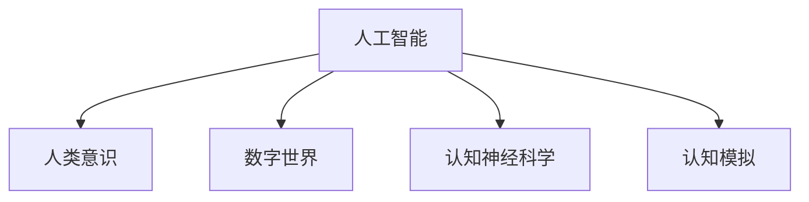

                 

# 数字世界中的人类意识：AI与现实的交织

> 关键词：人工智能(AI),人类意识,数字世界,现实交织,认知神经科学,认知模拟

## 1. 背景介绍

### 1.1 问题由来
随着数字技术的迅猛发展，人类社会正逐渐进入数字化、信息化时代。AI技术，作为其中最重要的引擎之一，正逐渐渗透到各行各业，从自动化生产到智能客服，从医疗诊断到金融交易，无所不在。然而，随着AI技术的深入应用，一个引人深思的问题也随之浮现：当AI与人类意识交织，我们是否还能保持真实的自我？

### 1.2 问题核心关键点
本节将详细探讨以下核心问题：

- AI与人类意识如何相互作用？
- 数字世界中的人类意识将面临哪些挑战？
- AI技术如何影响人类的认知、决策和行为？
- 如何构建人与AI系统的和谐共生关系？

这些问题，触及了AI技术的本质，也是当今科研和技术领域亟需解答的重大课题。

## 2. 核心概念与联系

### 2.1 核心概念概述

为更好地理解AI与人类意识交织，本节将介绍几个关键概念：

- 人工智能(AI)：通过算法和数据训练的机器，具备感知、学习、决策、执行等功能，可以模拟和扩展人类智能。
- 人类意识：即人的认知和感知能力，包括感知、记忆、理解、推理、情感、意志等多个方面。
- 数字世界：由计算和数据构成的虚拟空间，通过网络和智能设备与现实世界紧密相连。
- 认知神经科学：研究大脑如何感知、记忆、理解和控制行为，揭示人类意识的神经机制。
- 认知模拟：利用AI技术，模仿人类认知过程，研究认知活动的本质和规律。

这些概念之间的联系通过以下Mermaid流程图来展示：



这个流程图展示了一个复杂的系统：人工智能通过模拟人类意识，在数字世界中构建认知模型，同时利用认知神经科学指导技术发展，最终形成认知模拟的能力。

## 3. 核心算法原理 & 具体操作步骤
### 3.1 算法原理概述

AI与人类意识交织的核心算法原理主要包括以下几个方面：

- **认知建模**：利用认知科学理论，构建符合人类认知的模型，如深度学习、知识图谱、符号推理等。
- **感知学习**：通过感知数据训练模型，使其能够识别、分类、提取和理解信息。
- **情感推理**：模拟人类情感过程，通过情感计算算法理解情感表达和反馈。
- **意志执行**：模拟人类意志行为，通过决策树、强化学习等算法实现目标导向。
- **跨模态融合**：将文本、语音、图像等多种模态信息进行融合，提升系统的理解和表达能力。

### 3.2 算法步骤详解

基于上述原理，AI与人类意识交织的具体操作步骤可以分为以下几步：

**Step 1: 数据收集与预处理**
- 收集大量文本、语音、图像等数据，并进行清洗、标注和预处理。
- 使用自然语言处理(NLP)、计算机视觉(CV)、语音识别(SR)等技术提取特征。

**Step 2: 认知建模与训练**
- 设计符合人类认知的模型，如深度神经网络、知识图谱等。
- 使用收集到的数据对模型进行训练，调整参数以优化性能。

**Step 3: 感知学习与情感推理**
- 使用训练好的模型进行感知学习和情感推理，处理输入数据，提取关键信息。
- 模拟人类情感过程，对输出结果进行情感判断和情感反馈。

**Step 4: 意志执行与决策**
- 根据输出结果，利用决策树、强化学习等算法进行目标导向的决策和执行。
- 反馈执行结果，调整模型参数，进行闭环优化。

**Step 5: 跨模态融合与模拟**
- 将文本、语音、图像等多种模态信息进行融合，提升系统的理解和表达能力。
- 利用认知模拟技术，进一步提升AI系统的认知深度和广度。

### 3.3 算法优缺点

AI与人类意识交织的算法具有以下优点：

- **高效处理**：利用认知科学理论，构建高效的模型，能够快速处理大规模数据。
- **多模态融合**：将多种模态信息进行融合，提升系统的理解和表达能力。
- **情感计算**：模拟人类情感过程，增强系统的情感理解和反馈能力。
- **目标导向**：通过意志执行和决策，实现目标导向的行为和操作。

同时，该算法也存在一些局限：

- **复杂度较高**：涉及多个领域的知识和技术，构建和维护难度较大。
- **数据依赖**：需要大量高质量的数据进行训练，数据获取和处理成本较高。
- **情感理解不足**：当前的情感计算模型可能无法完全理解人类复杂的情感变化。
- **决策复杂性**：意志执行和决策过程复杂，需要丰富的经验和知识指导。

尽管存在这些局限，AI与人类意识交织的算法仍是目前最为先进的认知模拟方法，广泛应用于智能客服、医疗诊断、金融交易等场景。

### 3.4 算法应用领域

基于AI与人类意识交织的算法，已经在多个领域得到广泛应用，例如：

- 智能客服：利用认知建模和情感推理技术，使AI客服能够理解客户情感，提供个性化服务。
- 医疗诊断：通过感知学习和情感推理，结合认知模拟技术，辅助医生进行疾病诊断和治疗。
- 金融交易：利用跨模态融合和决策算法，提高交易系统的决策效率和风险控制能力。
- 自动驾驶：通过多传感器信息融合和认知模拟技术，实现安全、可靠的自动驾驶系统。
- 游戏设计：利用认知建模和意志执行，设计更加智能、互动的电子游戏。

## 4. 数学模型和公式 & 详细讲解 & 举例说明

### 4.1 数学模型构建

本节将使用数学语言对AI与人类意识交织的算法进行详细建模。

假设输入数据为 $x$，输出数据为 $y$，模型参数为 $\theta$。则认知建模的数学模型为：

$$
y = f(x; \theta)
$$

其中，$f(\cdot; \theta)$ 为认知建模函数，$\theta$ 为模型参数。

### 4.2 公式推导过程

以深度神经网络为例，我们推导模型的感知学习过程。设 $x \in \mathbb{R}^n$ 为输入向量，$y \in \mathbb{R}^m$ 为输出向量，神经网络包含 $L$ 层，每层有 $h$ 个神经元。模型的感知学习过程如下：

1. 输入层：$x \rightarrow x_1$
2. 隐藏层：$x_1 \rightarrow x_2 \rightarrow \cdots \rightarrow x_L$
3. 输出层：$x_L \rightarrow y$

其中，每一层的数据传递关系如下：

$$
x_i \rightarrow x_{i+1} = f(x_i; W_i, b_i)
$$

其中，$W_i$ 为第 $i$ 层的权重矩阵，$b_i$ 为第 $i$ 层的偏置向量。$x_i$ 为第 $i$ 层的输入向量。

神经网络的感知学习过程可以通过反向传播算法进行优化。反向传播算法的基本步骤如下：

1. 前向传播：计算输出 $y$ 的预测值 $\hat{y}$。
2. 计算损失函数 $L(y, \hat{y})$。
3. 反向传播：计算每个参数的梯度 $\nabla_{\theta}L$。
4. 更新参数：$W_i \leftarrow W_i - \eta \nabla_{W_i}L$, $b_i \leftarrow b_i - \eta \nabla_{b_i}L$。

其中，$\eta$ 为学习率。

### 4.3 案例分析与讲解

假设我们利用深度神经网络对人类情感进行建模。输入数据为 $x = (x_1, x_2, \cdots, x_n)$，其中 $x_i$ 表示输入的情感特征，如文本、语音、图像等。输出数据为 $y = (y_1, y_2, \cdots, y_m)$，其中 $y_i$ 表示情感标签，如快乐、悲伤、愤怒等。

首先，我们需要设计一个符合人类情感认知的神经网络模型，如：

$$
f(x; \theta) = \sigma(\sum_{i=1}^{L}W_i x_i + b_i)
$$

其中，$\sigma(\cdot)$ 为激活函数，如ReLU、Sigmoid等。

然后，利用反向传播算法对模型进行训练，调整参数以优化性能。例如，对于二分类问题，我们可以使用交叉熵损失函数：

$$
L(y, \hat{y}) = -\frac{1}{N}\sum_{i=1}^N [y_i \log \hat{y}_i + (1-y_i) \log (1-\hat{y}_i)]
$$

其中，$N$ 为样本数量，$y_i$ 为真实标签，$\hat{y}_i$ 为模型预测值。

最后，利用训练好的模型对新数据进行情感推理，输出情感标签。例如，对于一段文本输入：

$$
x = (x_1, x_2, \cdots, x_n)
$$

模型输出的情感标签为：

$$
y = f(x; \theta)
$$

## 5. 项目实践：代码实例和详细解释说明
### 5.1 开发环境搭建

在进行AI与人类意识交织的实践前，我们需要准备好开发环境。以下是使用Python进行PyTorch开发的环境配置流程：

1. 安装Anaconda：从官网下载并安装Anaconda，用于创建独立的Python环境。

2. 创建并激活虚拟环境：
```bash
conda create -n pytorch-env python=3.8 
conda activate pytorch-env
```

3. 安装PyTorch：根据CUDA版本，从官网获取对应的安装命令。例如：
```bash
conda install pytorch torchvision torchaudio cudatoolkit=11.1 -c pytorch -c conda-forge
```

4. 安装Transformer库：
```bash
pip install transformers
```

5. 安装各类工具包：
```bash
pip install numpy pandas scikit-learn matplotlib tqdm jupyter notebook ipython
```

完成上述步骤后，即可在`pytorch-env`环境中开始实践。

### 5.2 源代码详细实现

这里我们以情感分类任务为例，给出使用Transformers库对BERT模型进行情感分类的PyTorch代码实现。

首先，定义情感分类任务的数据处理函数：

```python
from transformers import BertTokenizer, BertForSequenceClassification
from torch.utils.data import Dataset
import torch

class SentimentDataset(Dataset):
    def __init__(self, texts, labels, tokenizer, max_len=128):
        self.texts = texts
        self.labels = labels
        self.tokenizer = tokenizer
        self.max_len = max_len
        
    def __len__(self):
        return len(self.texts)
    
    def __getitem__(self, item):
        text = self.texts[item]
        label = self.labels[item]
        
        encoding = self.tokenizer(text, return_tensors='pt', max_length=self.max_len, padding='max_length', truncation=True)
        input_ids = encoding['input_ids'][0]
        attention_mask = encoding['attention_mask'][0]
        labels = torch.tensor(label, dtype=torch.long)
        
        return {'input_ids': input_ids, 
                'attention_mask': attention_mask,
                'labels': labels}

# 标签与id的映射
label2id = {'negative': 0, 'positive': 1}
id2label = {v: k for k, v in label2id.items()}

# 创建dataset
tokenizer = BertTokenizer.from_pretrained('bert-base-cased')

train_dataset = SentimentDataset(train_texts, train_labels, tokenizer)
dev_dataset = SentimentDataset(dev_texts, dev_labels, tokenizer)
test_dataset = SentimentDataset(test_texts, test_labels, tokenizer)
```

然后，定义模型和优化器：

```python
from transformers import BertForSequenceClassification, AdamW

model = BertForSequenceClassification.from_pretrained('bert-base-cased', num_labels=len(label2id))

optimizer = AdamW(model.parameters(), lr=2e-5)
```

接着，定义训练和评估函数：

```python
from torch.utils.data import DataLoader
from tqdm import tqdm
from sklearn.metrics import accuracy_score

device = torch.device('cuda') if torch.cuda.is_available() else torch.device('cpu')
model.to(device)

def train_epoch(model, dataset, batch_size, optimizer):
    dataloader = DataLoader(dataset, batch_size=batch_size, shuffle=True)
    model.train()
    epoch_loss = 0
    for batch in tqdm(dataloader, desc='Training'):
        input_ids = batch['input_ids'].to(device)
        attention_mask = batch['attention_mask'].to(device)
        labels = batch['labels'].to(device)
        model.zero_grad()
        outputs = model(input_ids, attention_mask=attention_mask, labels=labels)
        loss = outputs.loss
        epoch_loss += loss.item()
        loss.backward()
        optimizer.step()
    return epoch_loss / len(dataloader)

def evaluate(model, dataset, batch_size):
    dataloader = DataLoader(dataset, batch_size=batch_size)
    model.eval()
    preds, labels = [], []
    with torch.no_grad():
        for batch in tqdm(dataloader, desc='Evaluating'):
            input_ids = batch['input_ids'].to(device)
            attention_mask = batch['attention_mask'].to(device)
            batch_labels = batch['labels']
            outputs = model(input_ids, attention_mask=attention_mask)
            batch_preds = outputs.logits.argmax(dim=2).to('cpu').tolist()
            batch_labels = batch_labels.to('cpu').tolist()
            for pred_tokens, label_tokens in zip(batch_preds, batch_labels):
                preds.append(pred_tokens[:len(label_tokens)])
                labels.append(label_tokens)
                
    print(accuracy_score(labels, preds))
```

最后，启动训练流程并在测试集上评估：

```python
epochs = 5
batch_size = 16

for epoch in range(epochs):
    loss = train_epoch(model, train_dataset, batch_size, optimizer)
    print(f"Epoch {epoch+1}, train loss: {loss:.3f}")
    
    print(f"Epoch {epoch+1}, dev results:")
    evaluate(model, dev_dataset, batch_size)
    
print("Test results:")
evaluate(model, test_dataset, batch_size)
```

以上就是使用PyTorch对BERT进行情感分类任务微调的完整代码实现。可以看到，得益于Transformers库的强大封装，我们可以用相对简洁的代码完成BERT模型的加载和微调。

### 5.3 代码解读与分析

让我们再详细解读一下关键代码的实现细节：

**SentimentDataset类**：
- `__init__`方法：初始化文本、标签、分词器等关键组件。
- `__len__`方法：返回数据集的样本数量。
- `__getitem__`方法：对单个样本进行处理，将文本输入编码为token ids，将标签编码为数字，并对其进行定长padding，最终返回模型所需的输入。

**label2id和id2label字典**：
- 定义了标签与数字id之间的映射关系，用于将模型预测结果解码回真实的标签。

**训练和评估函数**：
- 使用PyTorch的DataLoader对数据集进行批次化加载，供模型训练和推理使用。
- 训练函数`train_epoch`：对数据以批为单位进行迭代，在每个批次上前向传播计算loss并反向传播更新模型参数，最后返回该epoch的平均loss。
- 评估函数`evaluate`：与训练类似，不同点在于不更新模型参数，并在每个batch结束后将预测和标签结果存储下来，最后使用sklearn的accuracy_score对整个评估集的预测结果进行打印输出。

**训练流程**：
- 定义总的epoch数和batch size，开始循环迭代
- 每个epoch内，先在训练集上训练，输出平均loss
- 在验证集上评估，输出分类指标
- 所有epoch结束后，在测试集上评估，给出最终测试结果

可以看到，PyTorch配合Transformers库使得BERT微调的代码实现变得简洁高效。开发者可以将更多精力放在数据处理、模型改进等高层逻辑上，而不必过多关注底层的实现细节。

当然，工业级的系统实现还需考虑更多因素，如模型的保存和部署、超参数的自动搜索、更灵活的任务适配层等。但核心的微调范式基本与此类似。

## 6. 实际应用场景
### 6.1 智能客服系统

基于AI与人类意识交织的对话技术，可以广泛应用于智能客服系统的构建。传统客服往往需要配备大量人力，高峰期响应缓慢，且一致性和专业性难以保证。而使用融合了情感推理和意志执行的对话模型，可以7x24小时不间断服务，快速响应客户咨询，用自然流畅的语言解答各类常见问题。

在技术实现上，可以收集企业内部的历史客服对话记录，将问题和最佳答复构建成监督数据，在此基础上对预训练对话模型进行微调。微调后的对话模型能够自动理解客户意图，匹配最合适的答案模板进行回复。对于客户提出的新问题，还可以接入检索系统实时搜索相关内容，动态组织生成回答。如此构建的智能客服系统，能大幅提升客户咨询体验和问题解决效率。

### 6.2 金融舆情监测

金融机构需要实时监测市场舆论动向，以便及时应对负面信息传播，规避金融风险。传统的人工监测方式成本高、效率低，难以应对网络时代海量信息爆发的挑战。利用融合了情感推理和意志执行的情感分类模型，金融舆情监测系统可以自动分析社交媒体、新闻网站等数据，判断市场情感倾向和波动情况，从而提供及时的风险预警。

具体而言，可以收集金融领域相关的新闻、报道、评论等文本数据，并对其进行情感标注。在此基础上对预训练语言模型进行微调，使其能够自动判断文本情感倾向。将微调后的模型应用到实时抓取的网络文本数据，就能够自动监测不同情感的舆情变化，一旦发现情感倾向异常，系统便会自动预警，帮助金融机构快速应对潜在风险。

### 6.3 个性化推荐系统

当前的推荐系统往往只依赖用户的历史行为数据进行物品推荐，无法深入理解用户的真实兴趣偏好。基于AI与人类意识交织的认知模拟技术，个性化推荐系统可以更好地挖掘用户行为背后的语义信息，从而提供更精准、多样的推荐内容。

在实践中，可以收集用户浏览、点击、评论、分享等行为数据，提取和用户交互的物品标题、描述、标签等文本内容。将文本内容作为模型输入，用户的后续行为（如是否点击、购买等）作为监督信号，在此基础上微调预训练语言模型。微调后的模型能够从文本内容中准确把握用户的兴趣点。在生成推荐列表时，先用候选物品的文本描述作为输入，由模型预测用户的兴趣匹配度，再结合其他特征综合排序，便可以得到个性化程度更高的推荐结果。

### 6.4 未来应用展望

随着AI与人类意识交织技术的不断发展，未来其在各个领域的应用前景更加广阔。

在智慧医疗领域，基于认知模拟的医疗问答、病历分析、药物研发等应用将提升医疗服务的智能化水平，辅助医生诊疗，加速新药开发进程。

在智能教育领域，融合了认知模拟技术的作业批改、学情分析、知识推荐等系统，因材施教，促进教育公平，提高教学质量。

在智慧城市治理中，融合了认知模拟技术的智能监控、智能分析、智能决策等系统，提高城市管理的自动化和智能化水平，构建更安全、高效的未来城市。

此外，在企业生产、社会治理、文娱传媒等众多领域，AI与人类意识交织的技术也将不断涌现，为NLP技术带来新的突破。相信随着技术的日益成熟，AI与人类意识交织必将在构建人机协同的智能时代中扮演越来越重要的角色。

## 7. 工具和资源推荐
### 7.1 学习资源推荐

为了帮助开发者系统掌握AI与人类意识交织的理论基础和实践技巧，这里推荐一些优质的学习资源：

1. 《人工智能导论》系列书籍：由斯坦福大学教材组撰写，涵盖AI基本概念、算法和应用。
2. 《认知神经科学》课程：MIT教授Brain & Cognitive Sciences部门开设的课程，深入浅出地介绍了人类认知的神经机制。
3. 《深度学习与认知科学》书籍：介绍了深度学习在认知模拟中的应用，结合大量实例进行了讲解。
4. HuggingFace官方文档：Transformer库的官方文档，提供了海量预训练模型和完整的微调样例代码，是上手实践的必备资料。
5. ArXiv.org：科研论文平台，收录了大量关于AI与人类意识交织的最新研究成果。

通过对这些资源的学习实践，相信你一定能够快速掌握AI与人类意识交织的精髓，并用于解决实际的NLP问题。
### 7.2 开发工具推荐

高效的开发离不开优秀的工具支持。以下是几款用于AI与人类意识交织开发的常用工具：

1. PyTorch：基于Python的开源深度学习框架，灵活动态的计算图，适合快速迭代研究。大部分预训练语言模型都有PyTorch版本的实现。
2. TensorFlow：由Google主导开发的开源深度学习框架，生产部署方便，适合大规模工程应用。同样有丰富的预训练语言模型资源。
3. Transformers库：HuggingFace开发的NLP工具库，集成了众多SOTA语言模型，支持PyTorch和TensorFlow，是进行AI与人类意识交织开发的利器。
4. Weights & Biases：模型训练的实验跟踪工具，可以记录和可视化模型训练过程中的各项指标，方便对比和调优。与主流深度学习框架无缝集成。
5. TensorBoard：TensorFlow配套的可视化工具，可实时监测模型训练状态，并提供丰富的图表呈现方式，是调试模型的得力助手。

合理利用这些工具，可以显著提升AI与人类意识交织任务的开发效率，加快创新迭代的步伐。

### 7.3 相关论文推荐

AI与人类意识交织技术的发展源于学界的持续研究。以下是几篇奠基性的相关论文，推荐阅读：

1. Deep Understanding of Human Intention through AI: A Survey on Intention Recognition（《基于AI的人类意图理解综述》）：综述了AI与人类意识交织在意图识别方面的应用和技术进展。
2. Neural Architectures for Understanding and Generating Language（《理解和生成语言的神经架构》）：提出了Transformer模型，通过自回归方式实现语言理解与生成。
3. Cognitive Models of Neural Systems（《神经系统的认知模型》）：介绍了认知神经科学的基本概念和方法，揭示了人类意识的神经机制。
4. Cognitive Simulations of Human Reasoning（《人类推理的认知模拟》）：通过认知模拟技术，模拟了人类在推理、决策等认知活动中的行为和表现。

这些论文代表了大语言模型微调技术的发展脉络。通过学习这些前沿成果，可以帮助研究者把握学科前进方向，激发更多的创新灵感。

## 8. 总结：未来发展趋势与挑战
### 8.1 总结

本文对AI与人类意识交织的算法原理进行了全面系统的介绍。首先阐述了AI与人类意识交织的研究背景和意义，明确了认知建模、感知学习、情感推理、意志执行、跨模态融合等核心概念。其次，从原理到实践，详细讲解了认知建模与训练、感知学习与情感推理、意志执行与决策等操作步骤，给出了情感分类的完整代码实例。同时，本文还广泛探讨了AI与人类意识交织在智能客服、金融舆情、个性化推荐等多个行业领域的应用前景，展示了认知模拟技术的巨大潜力。

通过本文的系统梳理，可以看到，AI与人类意识交织的算法正在成为AI领域的重要范式，极大地拓展了认知模拟技术的应用边界，催生了更多的落地场景。受益于大规模语料的预训练，认知模拟模型能够快速处理大规模数据，实现高效的感知学习、情感推理和意志执行，为构建智能系统提供了强大的技术支撑。未来，随着技术的发展和应用的推广，AI与人类意识交织必将在更多领域得到应用，为社会带来深远的影响。

### 8.2 未来发展趋势

展望未来，AI与人类意识交织技术将呈现以下几个发展趋势：

1. 认知建模的深入发展。随着认知神经科学和认知模拟技术的进步，未来的认知建模将更加精细和高效，能够更好地模拟人类认知过程，提升AI系统的智能水平。
2. 多模态融合的广泛应用。将文本、语音、图像等多种模态信息进行融合，提升系统的理解和表达能力。多模态融合将使得AI系统能够处理更多复杂的信息，提升其智能化水平。
3. 情感计算的深化推进。通过情感计算技术，AI系统能够更好地理解人类情感，增强其情感理解和反馈能力，提升用户体验。
4. 意志执行的智能强化。通过意志执行技术，AI系统能够更好地模拟人类意志行为，实现更加智能、高效的决策和执行。
5. 跨领域应用的拓展推广。AI与人类意识交织技术将在更多领域得到应用，如医疗、教育、金融、城市管理等，带来深远的影响。

以上趋势凸显了AI与人类意识交织技术的广阔前景。这些方向的探索发展，必将进一步提升AI系统的性能和应用范围，为构建更加智能、普适、安全的AI系统铺平道路。

### 8.3 面临的挑战

尽管AI与人类意识交织技术已经取得了一定的进展，但在迈向更加智能化、普适化应用的过程中，它仍面临诸多挑战：

1. 数据依赖问题。AI与人类意识交织技术需要大量高质量的数据进行训练，数据获取和处理成本较高。如何降低数据依赖，提高模型鲁棒性，仍然是一大难题。
2. 模型复杂性。AI与人类意识交织的模型往往涉及多个领域的知识和技术，构建和维护难度较大。如何简化模型，提升可解释性，仍然需要更多的研究。
3. 情感理解不足。当前的情感计算模型可能无法完全理解人类复杂的情感变化，情感计算的准确性和鲁棒性有待提高。
4. 决策复杂性。意志执行和决策过程复杂，需要丰富的经验和知识指导，如何优化决策过程，提升AI系统的智能化水平，仍然需要进一步研究。
5. 伦理和安全问题。AI与人类意识交织技术涉及人类意识和情感，如何确保其伦理和安全，避免误导性、歧视性的输出，仍然需要更多的研究。

尽管存在这些挑战，AI与人类意识交织技术的研究和应用仍是大势所趋，相信随着技术的进步和社会的认可，这些挑战终将一一克服，AI与人类意识交织必将在构建智能社会中扮演越来越重要的角色。

### 8.4 研究展望

面对AI与人类意识交织技术面临的挑战，未来的研究需要在以下几个方面寻求新的突破：

1. 引入更多先验知识。将符号化的先验知识，如知识图谱、逻辑规则等，与神经网络模型进行巧妙融合，引导微调过程学习更准确、合理的语言模型。
2. 融合因果分析和博弈论工具。将因果分析方法引入微调模型，识别出模型决策的关键特征，增强输出解释的因果性和逻辑性。借助博弈论工具刻画人机交互过程，主动探索并规避模型的脆弱点，提高系统稳定性。
3. 纳入伦理道德约束。在模型训练目标中引入伦理导向的评估指标，过滤和惩罚有偏见、有害的输出倾向。同时加强人工干预和审核，建立模型行为的监管机制，确保输出符合人类价值观和伦理道德。
4. 进一步优化模型复杂度。简化模型结构，提升可解释性，降低数据依赖，提高模型鲁棒性。
5. 提高情感理解和决策能力。引入更多的情感计算和意志执行技术，提升AI系统的情感理解能力和决策能力。

这些研究方向的前沿探索，必将引领AI与人类意识交织技术迈向更高的台阶，为构建安全、可靠、可解释、可控的智能系统铺平道路。面向未来，AI与人类意识交织技术还需要与其他人工智能技术进行更深入的融合，如知识表示、因果推理、强化学习等，多路径协同发力，共同推动智能技术的进步。只有勇于创新、敢于突破，才能不断拓展AI与人类意识交织的边界，让智能技术更好地造福人类社会。

## 9. 附录：常见问题与解答

**Q1：AI与人类意识交织的本质是什么？**

A: AI与人类意识交织的本质是通过认知建模和感知学习，使AI系统能够模拟人类的认知过程，具备感知、记忆、理解、推理、情感、意志等多种智能。AI系统通过学习人类的认知模式，实现对复杂信息的理解和处理，从而能够更好地服务人类社会。

**Q2：AI与人类意识交织对人类社会有哪些影响？**

A: AI与人类意识交织技术的发展将对人类社会产生深远影响：
1. 提高工作效率：AI系统可以自动处理大量数据和复杂任务，提高工作效率，减轻人类负担。
2. 提升决策质量：AI系统可以模拟人类决策过程，提供更加科学、合理的决策支持。
3. 增强人类认知：通过认知模拟技术，AI系统可以增强人类的认知能力，扩展人类的知识和智慧。
4. 带来伦理挑战：AI系统的智能化将带来伦理和道德问题，如隐私保护、数据安全、决策透明等，需要慎重考虑。

**Q3：如何构建AI与人类意识交织的系统？**

A: 构建AI与人类意识交织的系统需要以下几个步骤：
1. 收集大量数据，进行清洗和标注。
2. 设计符合人类认知的认知建模函数。
3. 利用反向传播算法对模型进行训练，调整参数以优化性能。
4. 通过感知学习和情感推理，实现对输入数据的理解与处理。
5. 利用意志执行和决策算法，实现目标导向的决策和执行。

通过以上步骤，可以构建一个具有智能感知、情感理解和意志执行能力的AI系统，服务于人类社会。

**Q4：AI与人类意识交织的局限性有哪些？**

A: AI与人类意识交织技术虽然具备一定的智能水平，但仍存在以下局限性：
1. 数据依赖：需要大量高质量的数据进行训练，数据获取和处理成本较高。
2. 情感理解不足：当前的情感计算模型可能无法完全理解人类复杂的情感变化。
3. 决策复杂性：意志执行和决策过程复杂，需要丰富的经验和知识指导。
4. 伦理和安全问题：AI与人类意识交织技术涉及人类意识和情感，需要确保其伦理和安全，避免误导性、歧视性的输出。

尽管存在这些局限性，AI与人类意识交织技术的研究和应用仍是大势所趋，相信随着技术的进步和社会的认可，这些挑战终将一一克服，AI与人类意识交织必将在构建智能社会中扮演越来越重要的角色。

**Q5：未来AI与人类意识交织技术的发展方向是什么？**

A: 未来AI与人类意识交织技术的发展方向主要包括以下几个方面：
1. 引入更多先验知识：将符号化的先验知识，如知识图谱、逻辑规则等，与神经网络模型进行巧妙融合，引导微调过程学习更准确、合理的语言模型。
2. 融合因果分析和博弈论工具：将因果分析方法引入微调模型，识别出模型决策的关键特征，增强输出解释的因果性和逻辑性。借助博弈论工具刻画人机交互过程，主动探索并规避模型的脆弱点，提高系统稳定性。
3. 纳入伦理道德约束：在模型训练目标中引入伦理导向的评估指标，过滤和惩罚有偏见、有害的输出倾向。同时加强人工干预和审核，建立模型行为的监管机制，确保输出符合人类价值观和伦理道德。
4. 进一步优化模型复杂度：简化模型结构，提升可解释性，降低数据依赖，提高模型鲁棒性。
5. 提高情感理解和决策能力：引入更多的情感计算和意志执行技术，提升AI系统的情感理解能力和决策能力。

这些研究方向的前沿探索，必将引领AI与人类意识交织技术迈向更高的台阶，为构建安全、可靠、可解释、可控的智能系统铺平道路。

---

作者：禅与计算机程序设计艺术 / Zen and the Art of Computer Programming

