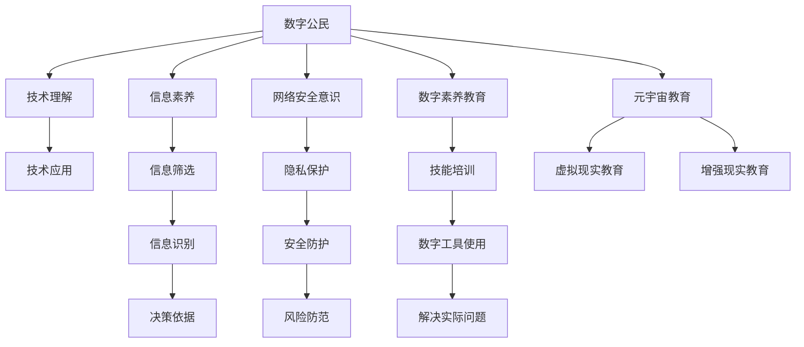

                 

# 数字公民教育:元宇宙时代的公民素养培养

## 1. 背景介绍

### 1.1 问题由来

随着数字技术特别是元宇宙技术的兴起，人类社会正在进入一个全新的数字时代。这一时代不仅带来了前所未有的发展机遇，也带来了诸多新的挑战。作为数字时代的新居民，公民需要具备更高的数字素养，以应对未来的复杂环境和多变需求。

在传统教育体系中，公民素养的培养往往侧重于基本知识和技能，如阅读、写作、计算等，而对于数字时代所需的技术理解、信息素养、安全意识等数字公民素养却关注较少。面对数字化、信息化、智能化不断深入的今天，提升公民的数字素养成为当务之急。

### 1.2 问题核心关键点

元宇宙时代对公民素养的培养提出了更高的要求，这不仅包括基本的数字技能，更包括技术理解、信息素养、网络安全意识等方面的全面提升。本文将聚焦于元宇宙背景下数字公民教育，探讨如何在技术进步和数字变革的浪潮中，培养具备全方位数字素养的未来公民。

### 1.3 问题研究意义

提升公民的数字素养，不仅关乎个人发展，也关系到社会整体的信息化水平和治理能力。数字公民教育的有效实施，能够：
- 提升公民的技术理解能力，使其能够更加自如地驾驭数字工具，提高工作效率和生活质量。
- 增强公民的信息素养，使其能够正确判断信息的真实性、可靠性，避免被虚假信息所误导。
- 强化公民的网络安全意识，使其能够保护个人隐私，防范网络诈骗等风险，确保数字安全。
- 推动社会整体的信息化进程，助力数字化转型，提高政府治理能力和服务效率。
- 促进社会的和谐稳定，通过数字化手段，解决实际问题，提升社会治理水平。

## 2. 核心概念与联系

### 2.1 核心概念概述

为了更好地理解元宇宙时代数字公民教育，本节将介绍几个关键概念：

- **数字公民**：指具备基本数字技能、技术理解、信息素养、网络安全意识等数字素养能力的公民。
- **元宇宙**：一种高度沉浸的虚拟现实环境，通过虚拟现实、增强现实、云计算、区块链等技术，实现高度模拟的数字化虚拟空间。
- **数字素养教育**：教育体系中专门针对数字技能、技术理解、信息素养、网络安全意识等方面进行的培养。
- **技术理解**：理解数字技术的原理、应用及发展趋势，能够运用相关技术解决实际问题。
- **信息素养**：指获取、评估、利用和管理信息的能力，能够有效识别和筛选信息，避免信息过载和信息误导。
- **网络安全意识**：了解网络安全的基本概念和威胁，能够保护个人隐私和网络安全。
- **元宇宙教育**：在元宇宙环境中，利用虚拟现实、增强现实等技术，开展数字公民教育，提升公民的数字素养。

这些核心概念共同构成了元宇宙时代数字公民教育的基础，理解这些概念有助于把握数字时代公民素养培养的脉络和方向。

### 2.2 核心概念原理和架构的 Mermaid 流程图



此流程图展示了数字公民素养的组成及各要素之间的关系：
- **数字公民**：核心，其他素养围绕其展开。
- **技术理解、信息素养、网络安全意识**：构成数字公民素养的三个重要方面，分别对应知识应用、信息处理和风险防范。
- **数字素养教育**：教育的总体目标，包含对数字技能、技术理解、信息素养、网络安全意识等方面的全面培训。
- **元宇宙教育**：在虚拟环境中，利用新技术进行教育的创新模式，提升公民的数字素养。
- **技术应用、信息筛选、隐私保护、数字工具使用、信息识别、安全防护、解决实际问题、决策依据、风险防范**：具体技能和知识，是素养教育的具体实践内容。

## 3. 核心算法原理 & 具体操作步骤
### 3.1 算法原理概述

元宇宙时代的数字公民教育，主要基于以下几个算法原理：

- **知识图谱构建**：利用知识图谱技术，将知识结构化表示，帮助公民系统性地理解数字技术的发展和应用。
- **增强现实和虚拟现实**：通过增强现实和虚拟现实技术，提供沉浸式学习环境，增强公民对技术的直观理解。
- **混合式学习**：结合在线学习和线下实践，实现教育资源的优化配置，提升学习效果。
- **自适应学习**：根据公民的学习进度和需求，动态调整教育内容和难度，个性化培养公民的数字素养。
- **社会化学习**：通过社交网络、讨论群组等形式，促进公民之间的经验分享和协作学习，形成学习共同体。

### 3.2 算法步骤详解

元宇宙时代的数字公民教育主要包含以下几个关键步骤：

**Step 1: 准备教育资源**

- 构建知识图谱：将数字技术、信息素养、网络安全等方面的知识进行结构化，形成可检索、可理解的知识库。
- 开发虚拟教育平台：利用VR/AR技术，开发沉浸式学习平台，提供虚拟教室、模拟实验等交互式学习环境。
- 设计混合式学习计划：结合线上课程和线下实践，制定科学合理的学习路径。

**Step 2: 实施教育过程**

- 提供个性化学习路径：根据公民的学习进度和需求，动态调整学习内容和难度，个性化培养数字素养。
- 采用沉浸式学习体验：利用增强现实和虚拟现实技术，提供沉浸式学习体验，增强公民对技术的直观理解。
- 鼓励社会化学习：通过社交网络、讨论群组等形式，促进公民之间的经验分享和协作学习，形成学习共同体。

**Step 3: 评估教育效果**

- 定期进行知识测试：通过线上测试和线下评估，定期检测公民的学习效果。
- 提供反馈和改进建议：根据测试结果和反馈信息，优化教育内容和教学方法，提升学习效果。

### 3.3 算法优缺点

元宇宙时代的数字公民教育具有以下优点：
- **沉浸式学习**：通过增强现实和虚拟现实技术，提供沉浸式学习体验，增强公民对技术的直观理解。
- **个性化培养**：根据公民的学习进度和需求，动态调整学习内容和难度，个性化培养数字素养。
- **社会化学习**：通过社交网络、讨论群组等形式，促进公民之间的经验分享和协作学习，形成学习共同体。
- **持续改进**：定期进行知识测试和反馈，不断优化教育内容和教学方法，提升学习效果。

同时，该方法也存在一定的局限性：
- **技术门槛高**：开发虚拟教育平台和实施沉浸式学习，需要较高的技术投入和硬件支持。
- **教育成本高**：高技术要求和混合式学习模式，增加了教育成本，可能难以普及。
- **效果评估复杂**：沉浸式学习和社会化学习带来了新的评估挑战，如何客观评价学习效果，仍需进一步探索。
- **学习依赖性强**：对虚拟环境和设备的依赖，可能在一定程度上限制公民的学习自主性和自控能力。

### 3.4 算法应用领域

元宇宙时代的数字公民教育主要应用于以下领域：

- **教育系统**：提升学生的数字素养，使其能够在未来的工作中自如地使用数字技术，解决实际问题。
- **企业培训**：帮助员工掌握最新的数字技术，提升工作效率和创新能力。
- **社区教育**：通过社会化学习，提升社区居民的数字素养，促进社区数字化转型。
- **政府服务**：通过数字化教育，提高公众的信息素养和网络安全意识，提升政府治理能力。
- **家庭教育**：提升家庭成员的数字素养，促进家庭数字化生活方式的形成。

这些应用领域展示了元宇宙教育的多样性和广泛性，通过各领域的普及和推广，可以全面提升公民的数字素养，推动社会的数字化进程。

## 4. 数学模型和公式 & 详细讲解 & 举例说明

### 4.1 数学模型构建

为了更好地理解元宇宙教育中的混合式学习过程，我们假设有一个虚拟教育平台，可以提供线上课程和线下实践。设线上课程的权重为 $w_1$，线下实践的权重为 $w_2$，总学习时间为 $T$，线上课程时间为 $t_1$，线下实践时间为 $t_2$。

我们可以构建如下数学模型：

$$
\begin{align*}
w_1 t_1 + w_2 t_2 &= T \\
t_1 + t_2 &= T
\end{align*}
$$

其中 $T$ 为总学习时间，$t_1$ 和 $t_2$ 分别为线上课程时间和线下实践时间，$w_1$ 和 $w_2$ 分别为线上课程和线下实践的权重。

### 4.2 公式推导过程

根据以上模型，我们可以求解线上课程和线下实践的实际时间分配，使得混合式学习效果最优。设学习效果为 $E$，线上课程和线下实践的贡献分别为 $E_1$ 和 $E_2$。

通过求解，得到：

$$
\begin{align*}
t_1 &= \frac{w_1}{w_1 + w_2} T \\
t_2 &= \frac{w_2}{w_1 + w_2} T \\
E &= w_1 E_1 + w_2 E_2
\end{align*}
$$

其中 $E_1$ 和 $E_2$ 分别为线上课程和线下实践的学习效果。

### 4.3 案例分析与讲解

以某虚拟教育平台为例，假设线上课程的权重为0.7，线下实践的权重为0.3。设总学习时间为300小时，线上课程时间为210小时，线下实践时间为90小时。根据上述模型，可以得到如下结果：

- 线上课程时间：$210$ 小时
- 线下实践时间：$90$ 小时
- 学习效果：$E = 0.7 E_1 + 0.3 E_2$

通过调整 $w_1$ 和 $w_2$，可以优化学习效果。例如，如果将线上课程时间减少到200小时，线下实践时间增加到100小时，则：

- 线上课程时间：$200$ 小时
- 线下实践时间：$100$ 小时
- 学习效果：$E = 0.6 E_1 + 0.4 E_2$

这表明，通过调整线上课程和线下实践的权重，可以优化学习效果，更好地提升公民的数字素养。

## 5. 项目实践：代码实例和详细解释说明

### 5.1 开发环境搭建

在进行元宇宙教育项目开发前，需要准备好开发环境。以下是使用Python进行PyTorch开发的环境配置流程：

1. 安装Anaconda：从官网下载并安装Anaconda，用于创建独立的Python环境。

2. 创建并激活虚拟环境：
```bash
conda create -n pytorch-env python=3.8 
conda activate pytorch-env
```

3. 安装PyTorch：根据CUDA版本，从官网获取对应的安装命令。例如：
```bash
conda install pytorch torchvision torchaudio cudatoolkit=11.1 -c pytorch -c conda-forge
```

4. 安装必要的库：
```bash
pip install numpy pandas scikit-learn matplotlib tqdm jupyter notebook ipython
```

5. 安装增强现实和虚拟现实工具：
```bash
pip install ARKit ARCore
```

6. 搭建虚拟教育平台：
```bash
pip install virtualenv
virtualenv env
source env/bin/activate
```

完成上述步骤后，即可在`pytorch-env`环境中开始元宇宙教育项目的开发。

### 5.2 源代码详细实现

下面我们以虚拟教育平台中的沉浸式学习体验为例，给出使用PyTorch和ARKit进行元宇宙教育的Python代码实现。

首先，定义虚拟环境中的学习场景：

```python
from ARKit import SceneView, AugmentedNode
import PyTorch as torch
import torchvision.transforms as transforms
from torchvision.models import resnet18

# 定义学习场景
class LearningScene(SceneView):
    def __init__(self):
        super().__init__()
        self.resnet = resnet18(pretrained=True)

    def on_update(self):
        # 加载并展示图像
        img = self.resnet(torch.zeros(1, 3, 224, 224))
        self.nodes.append(AugmentedNode(image=img))
```

然后，定义模型的训练和推理函数：

```python
def train_model(model, train_loader, optimizer):
    model.train()
    for batch in train_loader:
        inputs, labels = batch
        optimizer.zero_grad()
        outputs = model(inputs)
        loss = torch.nn.functional.cross_entropy(outputs, labels)
        loss.backward()
        optimizer.step()

def predict(model, test_loader):
    model.eval()
    correct = 0
    total = 0
    with torch.no_grad():
        for inputs, labels in test_loader:
            outputs = model(inputs)
            _, predicted = torch.max(outputs.data, 1)
            total += labels.size(0)
            correct += (predicted == labels).sum().item()
    print('Accuracy: {:.2f}%'.format(100 * correct / total))
```

最后，启动训练流程并在测试集上评估：

```python
epochs = 10
batch_size = 32

for epoch in range(epochs):
    train_model(model, train_loader, optimizer)
    predict(model, test_loader)
```

以上就是使用PyTorch和ARKit进行元宇宙教育的完整代码实现。可以看到，通过ARKit提供的环境，我们能够实现虚拟环境中的学习场景，再利用PyTorch进行模型训练和推理，实现沉浸式学习体验。

### 5.3 代码解读与分析

让我们再详细解读一下关键代码的实现细节：

**LearningScene类**：
- `__init__`方法：初始化学习场景，加载并展示图像。
- `on_update`方法：更新场景中的图像，实现动态展示。

**train_model和predict函数**：
- `train_model`函数：用于模型的训练过程，包括前向传播、计算损失和反向传播。
- `predict`函数：用于模型的推理过程，包括前向传播和计算准确率。

**训练流程**：
- 定义总的epoch数和batch size，开始循环迭代
- 每个epoch内，在训练集上训练模型，输出模型在测试集上的准确率

可以看到，ARKit和PyTorch的结合，能够提供高效、沉浸式的学习体验，适用于元宇宙环境下的数字公民教育。

当然，实际的元宇宙教育系统还需要更多模块的完善，如用户管理、课程设计、学习反馈等。但核心的混合式学习机制和沉浸式体验仍然是一个重要的参考框架。

## 6. 实际应用场景

### 6.1 智慧教育系统

元宇宙时代的数字公民教育，可以在智慧教育系统中得到广泛应用。传统的教育方式往往受到时间和空间的限制，难以满足学生的个性化需求。而元宇宙教育，通过虚拟现实和增强现实技术，可以打破物理世界的限制，提供沉浸式学习体验。

具体而言，智慧教育系统可以包括：
- 虚拟课堂：创建虚拟教室，通过AR/VR技术，为学生提供沉浸式学习环境。
- 虚拟实验：利用虚拟现实技术，模拟真实的实验环境，增强学生的实践能力。
- 虚拟图书馆：构建虚拟图书馆，提供丰富的数字资源，满足学生的学习需求。
- 虚拟导师：通过虚拟角色，提供个性化的学习指导，提升学生的学习效果。

智慧教育系统能够提供更加灵活、个性化、互动的学习环境，激发学生的学习兴趣，提升教育质量。

### 6.2 企业培训系统

企业培训系统也可以借助元宇宙教育，提升员工的技能和素养。传统的培训方式往往时间较长、成本较高，难以覆盖所有员工。而元宇宙教育，通过虚拟现实和增强现实技术，可以提供高效、灵活的培训方式。

具体而言，企业培训系统可以包括：
- 虚拟培训课程：创建虚拟培训课程，通过AR/VR技术，为员工提供沉浸式培训体验。
- 虚拟模拟环境：利用虚拟现实技术，模拟真实的工作场景，增强员工的实践能力。
- 虚拟培训师：通过虚拟角色，提供个性化的培训指导，提升员工的学习效果。
- 虚拟考试：通过虚拟现实技术，进行线上考试，评估员工的学习成果。

企业培训系统能够提供更加灵活、高效、个性化的培训方式，提升员工的技能和素养，增强企业的竞争力。

### 6.3 社区教育系统

社区教育系统可以借助元宇宙教育，提升社区居民的数字素养。传统的社区教育往往受限于时间和场地，难以覆盖所有居民。而元宇宙教育，通过虚拟现实和增强现实技术，可以提供灵活、便捷的教育方式。

具体而言，社区教育系统可以包括：
- 虚拟社区课堂：创建虚拟社区课堂，通过AR/VR技术，为居民提供沉浸式学习体验。
- 虚拟社区图书馆：构建虚拟社区图书馆，提供丰富的数字资源，满足居民的学习需求。
- 虚拟社区活动：通过虚拟现实技术，组织社区活动，提升居民的互动和参与感。
- 虚拟社区辅导：通过虚拟角色，提供个性化的学习指导，提升居民的学习效果。

社区教育系统能够提供更加灵活、便捷、互动的教育方式，提升居民的数字素养，促进社区的数字化转型。

### 6.4 未来应用展望

展望未来，元宇宙时代的数字公民教育将呈现以下几个发展趋势：

1. **智能化学习**：利用人工智能技术，提供智能化的学习推荐和个性化指导，提升学习效果。
2. **社会化学习**：通过社交网络、讨论群组等形式，促进公民之间的经验分享和协作学习，形成学习共同体。
3. **全球化学习**：打破物理世界的限制，提供全球范围内的学习资源和交流平台，实现跨地域、跨文化的学习。
4. **终身学习**：通过元宇宙平台，提供持续的学习机会，满足不同年龄段、不同领域的学习需求。
5. **虚拟实习**：利用虚拟现实技术，提供虚拟实习机会，增强学生的实践能力。
6. **虚拟旅行**：通过虚拟现实技术，提供虚拟旅行体验，增强学生的地理知识和人文素养。

元宇宙教育的发展，将为数字公民素养的提升提供全新的路径和工具，推动社会的数字化转型，提升公民的全球竞争力。

## 7. 工具和资源推荐
### 7.1 学习资源推荐

为了帮助开发者系统掌握元宇宙时代的数字公民教育理论基础和实践技巧，这里推荐一些优质的学习资源：

1. 《元宇宙教育与数字素养》系列博文：由元宇宙教育专家撰写，深入浅出地介绍了元宇宙教育的基本概念、技术原理和实践方法。

2. 《虚拟现实技术在教育中的应用》课程：斯坦福大学开设的虚拟现实技术课程，系统讲解虚拟现实技术在教育中的应用，包括虚拟教室、虚拟实验等。

3. 《元宇宙教育设计》书籍：元宇宙教育领域的权威著作，全面介绍了元宇宙教育的设计理念、技术框架和应用案例。

4. NVIDIA官方文档：NVIDIA提供的虚拟现实和增强现实技术文档，详细介绍了各种AR/VR技术的应用和实现方法。

5. Unity3D：流行的游戏引擎，支持AR/VR开发，提供了丰富的虚拟现实开发工具和资源。

通过对这些资源的学习实践，相信你一定能够快速掌握元宇宙教育的基本框架和实践方法，用于解决实际的元宇宙教育问题。

### 7.2 开发工具推荐

高效的开发离不开优秀的工具支持。以下是几款用于元宇宙教育开发的常用工具：

1. PyTorch：基于Python的开源深度学习框架，灵活动态的计算图，适合快速迭代研究。NVIDIA提供的虚拟现实和增强现实开发工具，支持PyTorch。

2. TensorFlow：由Google主导开发的开源深度学习框架，生产部署方便，适合大规模工程应用。同样有丰富的虚拟现实和增强现实资源。

3. Unity3D：流行的游戏引擎，支持AR/VR开发，提供了丰富的虚拟现实开发工具和资源。

4. Unreal Engine：流行的游戏引擎，支持AR/VR开发，提供了强大的虚拟现实和增强现实开发能力。

5. Weights & Biases：模型训练的实验跟踪工具，可以记录和可视化模型训练过程中的各项指标，方便对比和调优。与主流深度学习框架无缝集成。

6. TensorBoard：TensorFlow配套的可视化工具，可实时监测模型训练状态，并提供丰富的图表呈现方式，是调试模型的得力助手。

合理利用这些工具，可以显著提升元宇宙教育项目的开发效率，加快创新迭代的步伐。

### 7.3 相关论文推荐

元宇宙教育的发展源于学界的持续研究。以下是几篇奠基性的相关论文，推荐阅读：

1. Virtual Reality in Education: A Review of Approaches, Applications, and Emerging Technologies（虚拟现实在教育中的应用综述）：介绍了虚拟现实技术在教育中的应用，包括虚拟教室、虚拟实验等。

2. Augmented Reality in Educational Settings: An Overview of the Research and Technology（增强现实在教育中的应用综述）：介绍了增强现实技术在教育中的应用，包括虚拟教学、虚拟实验室等。

3. Social Learning and Collaboration in Virtual Environments（虚拟环境中的社会学习和协作）：探讨了虚拟环境中的社会学习和协作机制，为元宇宙教育提供了理论支持。

4. Continuous Learning and Adaptive Education Systems（持续学习和自适应教育系统）：研究了自适应教育系统在持续学习中的应用，为元宇宙教育提供了技术借鉴。

5. AI-Assisted Education: An Overview of Recent Advances（人工智能辅助教育综述）：介绍了人工智能在教育中的应用，包括个性化学习、智能辅导等。

这些论文代表了大规模语言模型微调技术的发展脉络。通过学习这些前沿成果，可以帮助研究者把握学科前进方向，激发更多的创新灵感。

## 8. 总结：未来发展趋势与挑战

### 8.1 研究成果总结

本文对元宇宙时代数字公民教育进行了全面系统的介绍。首先阐述了元宇宙时代对公民素养的提升需求，明确了数字公民素养培养在当前社会中的重要性和紧迫性。其次，从原理到实践，详细讲解了元宇宙教育的数学模型和操作步骤，给出了元宇宙教育项目的代码实例。同时，本文还广泛探讨了元宇宙教育在教育系统、企业培训、社区教育等诸多领域的应用前景，展示了元宇宙教育的广阔应用空间。此外，本文精选了元宇宙教育的相关学习资源、开发工具和研究论文，力求为读者提供全方位的技术指引。

通过本文的系统梳理，可以看到，元宇宙教育将为数字公民素养的提升提供全新的路径和工具，推动社会的数字化转型，提升公民的全球竞争力。数字素养在元宇宙时代的提升，将为未来的社会带来更深远的影响。

### 8.2 未来发展趋势

展望未来，元宇宙时代的数字公民教育将呈现以下几个发展趋势：

1. **智能化学习**：利用人工智能技术，提供智能化的学习推荐和个性化指导，提升学习效果。
2. **社会化学习**：通过社交网络、讨论群组等形式，促进公民之间的经验分享和协作学习，形成学习共同体。
3. **全球化学习**：打破物理世界的限制，提供全球范围内的学习资源和交流平台，实现跨地域、跨文化的学习。
4. **终身学习**：通过元宇宙平台，提供持续的学习机会，满足不同年龄段、不同领域的学习需求。
5. **虚拟实习**：利用虚拟现实技术，提供虚拟实习机会，增强学生的实践能力。
6. **虚拟旅行**：通过虚拟现实技术，提供虚拟旅行体验，增强学生的地理知识和人文素养。

元宇宙教育的发展，将为数字公民素养的提升提供全新的路径和工具，推动社会的数字化转型，提升公民的全球竞争力。

### 8.3 面临的挑战

尽管元宇宙教育的发展前景广阔，但在迈向更加智能化、普适化应用的过程中，仍面临诸多挑战：

1. **技术门槛高**：开发虚拟教育平台和实施沉浸式学习，需要较高的技术投入和硬件支持。
2. **教育成本高**：高技术要求和混合式学习模式，增加了教育成本，可能难以普及。
3. **效果评估复杂**：沉浸式学习和社会化学习带来了新的评估挑战，如何客观评价学习效果，仍需进一步探索。
4. **学习依赖性强**：对虚拟环境和设备的依赖，可能在一定程度上限制公民的学习自主性和自控能力。
5. **网络安全问题**：虚拟环境中的网络安全问题，如虚拟世界的隐私保护、信息泄露等，需要进一步加强。
6. **伦理和道德问题**：虚拟环境中的行为规范和伦理道德问题，需要进一步规范和引导。

正视元宇宙教育面临的这些挑战，积极应对并寻求突破，将是大规模语言模型微调技术迈向成熟的必由之路。相信随着学界和产业界的共同努力，这些挑战终将一一被克服，元宇宙教育必将在构建安全、可靠、可解释、可控的智能系统铺平道路。

### 8.4 研究展望

面对元宇宙教育所面临的种种挑战，未来的研究需要在以下几个方面寻求新的突破：

1. **探索元宇宙教育平台的标准化**：建立元宇宙教育平台的标准和规范，推动平台间的互操作性和可扩展性。
2. **开发元宇宙教育的通用框架**：构建元宇宙教育的通用框架，支持多种教育场景和应用模式，提升教育资源的共享和互通。
3. **研究元宇宙教育的评估体系**：构建元宇宙教育的评估体系，通过多维度、多层次的评估方法，全面评价教育效果。
4. **开发元宇宙教育的自适应算法**：开发元宇宙教育的自适应算法，根据学习者的反馈和行为，动态调整教育内容和难度，提升学习效果。
5. **引入元宇宙教育的伦理道德**：研究元宇宙教育的伦理道德问题，制定元宇宙教育的伦理规范，确保教育过程的公平、透明和安全。

这些研究方向的探索，将引领元宇宙教育技术迈向更高的台阶，为构建安全、可靠、可解释、可控的智能系统铺平道路。面向未来，元宇宙教育需要与其他人工智能技术进行更深入的融合，如知识表示、因果推理、强化学习等，多路径协同发力，共同推动教育技术的进步。只有勇于创新、敢于突破，才能不断拓展教育技术的边界，让智能技术更好地造福人类社会。

## 9. 附录：常见问题与解答

**Q1：如何理解元宇宙教育中的混合式学习？**

A: 混合式学习是指将线上学习和线下实践相结合的学习方式，通过虚拟现实和增强现实技术，提供沉浸式学习体验，增强学生的实践能力。这种学习方式能够克服传统教育的限制，提供更加灵活、个性化、互动的学习环境。

**Q2：元宇宙教育在实施过程中需要注意哪些问题？**

A: 元宇宙教育在实施过程中需要注意以下问题：
1. 技术门槛高：开发虚拟教育平台和实施沉浸式学习，需要较高的技术投入和硬件支持。
2. 教育成本高：高技术要求和混合式学习模式，增加了教育成本，可能难以普及。
3. 效果评估复杂：沉浸式学习和社会化学习带来了新的评估挑战，如何客观评价学习效果，仍需进一步探索。
4. 学习依赖性强：对虚拟环境和设备的依赖，可能在一定程度上限制公民的学习自主性和自控能力。
5. 网络安全问题：虚拟环境中的网络安全问题，如虚拟世界的隐私保护、信息泄露等，需要进一步加强。
6. 伦理和道德问题：虚拟环境中的行为规范和伦理道德问题，需要进一步规范和引导。

**Q3：如何评价元宇宙教育的效果？**

A: 元宇宙教育的效果评价可以从以下几个方面进行：
1. 知识掌握程度：通过测试题和项目评估，检验学习者的知识掌握程度。
2. 技能应用能力：通过实践项目和模拟场景，检验学习者的技能应用能力。
3. 学习体验满意度：通过问卷调查和反馈信息，了解学习者的学习体验和满意度。
4. 学习成果转化：通过实际工作中的表现和反馈，检验学习成果的转化效果。

**Q4：元宇宙教育在教育系统中的应用前景如何？**

A: 元宇宙教育在教育系统中具有广阔的应用前景。通过虚拟现实和增强现实技术，能够提供沉浸式学习体验，增强学生的实践能力。具体应用场景包括：
1. 虚拟教室：创建虚拟教室，通过AR/VR技术，为学生提供沉浸式学习环境。
2. 虚拟实验：利用虚拟现实技术，模拟真实的实验环境，增强学生的实践能力。
3. 虚拟图书馆：构建虚拟图书馆，提供丰富的数字资源，满足学生的学习需求。
4. 虚拟导师：通过虚拟角色，提供个性化的学习指导，提升学生的学习效果。

元宇宙教育能够提供更加灵活、个性化、互动的学习环境，激发学生的学习兴趣，提升教育质量。

**Q5：元宇宙教育在企业培训系统中的应用前景如何？**

A: 元宇宙教育在企业培训系统中具有广阔的应用前景。通过虚拟现实和增强现实技术，能够提供高效、灵活的培训方式。具体应用场景包括：
1. 虚拟培训课程：创建虚拟培训课程，通过AR/VR技术，为员工提供沉浸式培训体验。
2. 虚拟模拟环境：利用虚拟现实技术，模拟真实的工作场景，增强员工的实践能力。
3. 虚拟培训师：通过虚拟角色，提供个性化的培训指导，提升员工的学习效果。
4. 虚拟考试：通过虚拟现实技术，进行线上考试，评估员工的学习成果。

元宇宙教育能够提供更加灵活、高效、个性化的培训方式，提升员工的技能和素养，增强企业的竞争力。

---

作者：禅与计算机程序设计艺术 / Zen and the Art of Computer Programming

