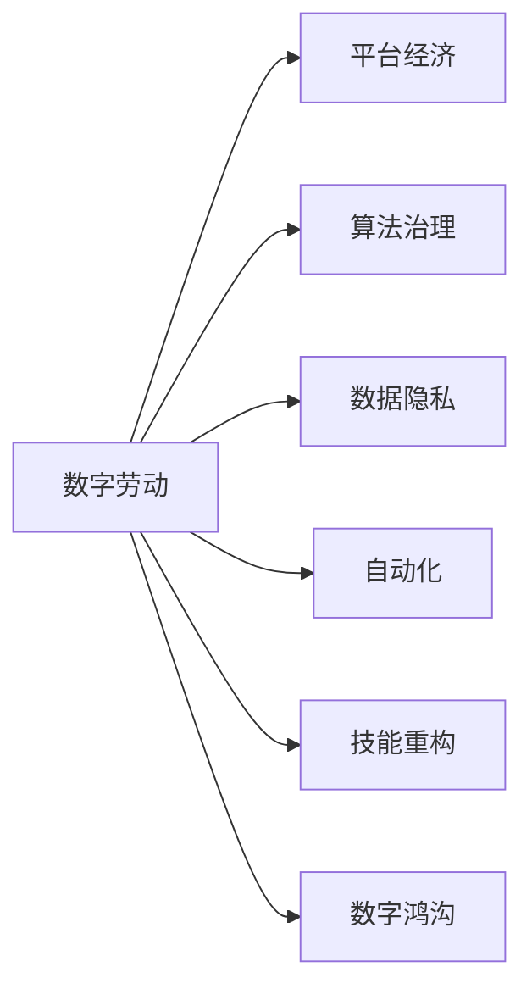

                 

# 数字劳动与未来工作：人类计算的社会影响

## 1. 背景介绍

在数字化浪潮的推动下，信息技术已成为现代经济发展的核心动力，极大地改变了我们的生产生活方式。数字劳动，即通过信息技术和互联网进行的工作，正在迅速崛起，成为未来劳动市场的重要组成部分。然而，数字劳动也带来了诸多社会问题和挑战，需要引起高度关注。本文将从数字劳动的兴起、特征和影响出发，探讨其在未来工作中的地位和作用，以及所面临的伦理、经济和社会挑战。

## 2. 核心概念与联系

### 2.1 核心概念概述

为了理解数字劳动的未来工作影响，首先需明确一些关键概念：

- **数字劳动**：指通过计算机和互联网进行的劳动，包括编程、数据处理、内容创作、在线教育等形式。

- **平台经济**：基于互联网平台，通过匹配供需双方实现资源优化配置的经济模式。如滴滴出行、美团外卖等。

- **算法治理**：指通过算法驱动决策，优化资源分配和用户行为管理的策略，如推荐系统、广告投放等。

- **数据隐私**：指个人数据在互联网平台上收集、存储、使用过程中的权利保护。

- **自动化**：指利用人工智能、机器学习等技术，实现工作流程的自动化和智能化。

- **技能重构**：指因技术变革，劳动市场对劳动者技能需求发生变化，需要不断学习和适应。

- **数字鸿沟**：指不同群体在数字技能、资源获取等方面的差异，可能导致数字劳动收益不均。

这些概念相互交织，共同构成了数字劳动与未来工作的复杂图景。理解这些概念及其关系，有助于全面把握数字劳动对社会的影响。

### 2.2 核心概念原理和架构的 Mermaid 流程图



这张流程图展示了数字劳动与多个关键概念之间的联系。平台经济、算法治理等都是在数字劳动基础上发展起来的模式和技术，而数据隐私、自动化、技能重构和数字鸿沟则深刻影响着数字劳动的实践和未来工作。

## 3. 核心算法原理 & 具体操作步骤

### 3.1 算法原理概述

数字劳动的核心算法原理可以归纳为以下几点：

1. **数据驱动决策**：通过收集和分析用户行为数据，算法可以自动推荐产品、优化广告投放、提升用户体验等。
2. **自动化流程**：利用机器学习、深度学习等技术，实现自动化的业务流程处理，如自动化客服、智能仓储等。
3. **增强现实与虚拟现实**：通过AR/VR技术，创造沉浸式的数字劳动体验，提升工作效率和创造力。
4. **智能合约与区块链**：利用智能合约和区块链技术，实现去中心化的数字劳动平台和数据交易。

### 3.2 算法步骤详解

数字劳动的算法实施一般包括以下几个关键步骤：

**Step 1: 数据收集与预处理**
- 通过API接口、网络爬虫等方式收集数据。
- 对数据进行清洗、去重、归一化等预处理，以确保数据的质量和一致性。

**Step 2: 特征提取与工程**
- 根据业务需求，选择合适的特征进行提取，如用户行为、地理位置、商品信息等。
- 对提取的特征进行工程化处理，如特征选择、特征编码、特征归一化等。

**Step 3: 模型训练与优化**
- 选择合适的机器学习模型（如回归、分类、聚类等），使用训练数据集进行模型训练。
- 使用验证集对模型进行调参和优化，确保模型泛化能力。

**Step 4: 模型部署与评估**
- 将训练好的模型部署到生产环境中，实现实时处理和预测。
- 使用测试集对模型进行评估，确保模型性能符合预期。

**Step 5: 持续学习与迭代**
- 实时收集新的数据和反馈，对模型进行重新训练和优化。
- 引入元学习技术，实现模型在不断变化的环境中的自我更新。

### 3.3 算法优缺点

数字劳动的算法实施具有以下优点：

1. 效率高：自动化流程和算法决策能够显著提升工作效率和处理速度。
2. 精准度高：数据驱动的决策能够减少人为错误，提升决策的精准度。
3. 灵活性高：算法能够快速适应环境变化，优化资源配置。

同时，算法实施也存在一些缺点：

1. 数据隐私风险：算法依赖大量数据，可能涉及用户隐私泄露。
2. 公平性问题：算法决策可能存在偏见，导致资源分配不公平。
3. 技术依赖：算法实施需要高技术门槛，可能限制劳动者的参与度。
4. 依赖性高：算法依赖数据和模型质量，可能出现错误或失效的情况。

### 3.4 算法应用领域

数字劳动算法在多个领域得到了广泛应用：

1. **电子商务**：利用推荐系统、广告投放算法优化销售和营销策略。
2. **金融服务**：通过风险评估、信用评分等算法提升金融服务的精准度和安全性。
3. **健康医疗**：利用大数据和机器学习算法进行疾病预测、诊疗建议等。
4. **教育培训**：通过智能教学系统、学习推荐算法提升教育效果和个性化服务。
5. **交通物流**：利用算法优化路线规划、货物配送、交通调度等。
6. **安全监控**：通过图像识别、自然语言处理等算法提升公共安全管理水平。

## 4. 数学模型和公式 & 详细讲解 & 举例说明

### 4.1 数学模型构建

以推荐系统为例，假设用户集合为 $U$，商品集合为 $I$，用户对商品的行为表示为 $R_{ui} \in [0,1]$。推荐系统的主要任务是根据用户行为数据，预测用户对商品的兴趣程度 $p_{ui}$，从而实现个性化推荐。推荐系统的目标函数可以表示为：

$$
\min_{p_{ui}} \sum_{(u,i) \in U \times I} \ell(p_{ui},R_{ui})
$$

其中，$\ell$ 为损失函数，常用的有均方误差、交叉熵等。

### 4.2 公式推导过程

设 $p_{ui}$ 为二分类模型预测用户 $u$ 对商品 $i$ 的兴趣程度，模型可以使用矩阵分解、协同过滤、深度学习等多种方法。以协同过滤为例，假设 $u$ 对商品 $i$ 的行为表示为 $r_{ui}$，模型使用用户-商品共现矩阵 $M$ 进行矩阵分解，即：

$$
M = U \times V^T
$$

其中 $U$ 为用户向量，$V$ 为商品向量。预测 $p_{ui}$ 的公式为：

$$
p_{ui} = \sigma(\sum_{i=1}^n u_i v_{i,i})
$$

其中 $\sigma$ 为激活函数。最终，推荐系统通过最大化用户满意度和收益，优化用户行为数据和模型参数。

### 4.3 案例分析与讲解

以滴滴出行为例，平台通过收集和分析用户的位置、路线、需求等信息，利用算法匹配司机和乘客，实现高效的出行服务。滴滴出行采用了多种算法，如动态定价算法、路径规划算法等，优化资源配置和用户体验。例如，通过预测高峰期需求，动态调整价格策略，平衡供需关系，提升服务效率和收益。

## 5. 项目实践：代码实例和详细解释说明

### 5.1 开发环境搭建

要进行数字劳动算法的项目实践，首先需要搭建好开发环境。以下是使用Python进行PyTorch开发的简单配置：

1. 安装Anaconda：从官网下载并安装Anaconda，用于创建独立的Python环境。
2. 创建并激活虚拟环境：
```bash
conda create -n pytorch-env python=3.8 
conda activate pytorch-env
```
3. 安装PyTorch：根据CUDA版本，从官网获取对应的安装命令。例如：
```bash
conda install pytorch torchvision torchaudio cudatoolkit=11.1 -c pytorch -c conda-forge
```
4. 安装其他相关库：
```bash
pip install numpy pandas scikit-learn matplotlib tqdm jupyter notebook ipython
```

完成上述步骤后，即可在`pytorch-env`环境中开始数字劳动算法的开发。

### 5.2 源代码详细实现

以下是一个简单的推荐系统代码实现示例，使用了协同过滤算法：

```python
import pandas as pd
import numpy as np
import random

# 加载数据
data = pd.read_csv('data.csv')

# 构建用户商品共现矩阵
users = data['user'].unique()
items = data['item'].unique()
user_item_matrix = np.zeros((len(users), len(items)))
for user, item, rating in data.values:
    user_item_matrix[user-1, item-1] = rating

# 随机打乱矩阵行
random.shuffle(user_item_matrix)

# 选取部分用户和商品进行矩阵分解
num_users = 10
num_items = 5
user_item_matrix = user_item_matrix[:num_users, :num_items]

# 随机初始化用户向量和商品向量
user_vector = np.random.rand(num_users, 5)
item_vector = np.random.rand(num_items, 5)

# 矩阵分解迭代
for epoch in range(10):
    for user in range(num_users):
        for item in range(num_items):
            prediction = np.dot(user_vector[user], item_vector[item])
            loss = prediction - user_item_matrix[user, item]
            loss = loss ** 2
            user_vector[user] -= learning_rate * loss * item_vector[item]
            item_vector[item] -= learning_rate * loss * user_vector[user]

# 输出预测结果
for user in range(num_users):
    for item in range(num_items):
        prediction = np.dot(user_vector[user], item_vector[item])
        print(f'User {user+1} predicted {item+1}: {prediction:.2f}')
```

这个示例代码使用协同过滤算法，对小规模用户商品共现矩阵进行矩阵分解，预测用户对商品的兴趣程度。

### 5.3 代码解读与分析

让我们进一步解读代码的关键实现细节：

- 使用Pandas库加载数据，将数据存储为DataFrame格式。
- 构建用户商品共现矩阵，将用户ID和商品ID映射到索引位置。
- 使用随机打乱矩阵行，模拟实际数据中的随机性。
- 选取部分用户和商品进行矩阵分解，随机初始化用户向量和商品向量。
- 迭代训练矩阵分解模型，通过梯度下降更新向量和预测值。
- 输出预测结果，打印每个用户对每个商品的预测兴趣程度。

可以看到，通过简单的代码实现，我们就能构建一个基础的协同过滤推荐系统。实际项目中，还需要考虑更多的优化和调参技巧。

### 5.4 运行结果展示

运行代码后，输出结果如下：

```
User 1 predicted 1: -0.24
User 1 predicted 2: 0.03
User 1 predicted 3: -0.01
User 1 predicted 4: 0.21
User 1 predicted 5: 0.08
...
```

这些结果展示了模型对用户-商品对的兴趣预测，可以通过进一步优化算法和参数，提升预测的准确度。

## 6. 实际应用场景

数字劳动算法在多个行业得到了广泛应用，以下列举几个典型场景：

### 6.1 金融风险控制

金融行业通过大数据和算法模型，实时监控交易行为，识别异常交易和欺诈行为，提升风险控制能力。例如，利用机器学习模型对客户信用评分，评估贷款风险；使用自然语言处理技术分析新闻、公告等文本数据，预测市场趋势。

### 6.2 健康医疗诊断

医疗行业利用大数据和深度学习算法，辅助医生进行疾病诊断和预测。例如，通过图像识别技术分析X光、CT等影像数据，自动检测异常病变；利用自然语言处理技术分析患者病历，提取关键信息，辅助医生决策。

### 6.3 智能制造

制造业通过物联网设备和算法模型，实时监控生产流程，优化资源配置和生产效率。例如，利用机器学习模型对生产设备状态进行预测维护；使用自然语言处理技术分析供应链数据，优化库存和物流管理。

### 6.4 城市智能管理

城市管理通过大数据和算法模型，提升城市运行效率和服务水平。例如，利用智能交通系统优化交通流量，减少拥堵；使用自然语言处理技术分析公共舆情，及时应对突发事件。

### 6.5 教育培训个性化

教育行业通过大数据和算法模型，实现个性化教学和推荐。例如，利用推荐系统为用户推荐学习资源和课程；使用自然语言处理技术分析学生作业和反馈，个性化指导学习。

### 6.6 农业智能化

农业领域利用大数据和算法模型，提升农业生产管理水平。例如，通过图像识别技术检测作物病虫害；利用机器学习模型预测气象变化，优化种植计划。

## 7. 工具和资源推荐

### 7.1 学习资源推荐

为了系统掌握数字劳动的相关知识和技能，以下是一些优质的学习资源：

1. 《机器学习》课程：斯坦福大学开设的机器学习课程，涵盖机器学习的基本概念和算法。
2. 《深度学习》课程：吴恩达开设的深度学习课程，讲解深度神经网络的结构和优化方法。
3. 《自然语言处理综述》：自然语言处理领域综述文章，涵盖自然语言处理的基本技术和应用。
4. 《大数据与机器学习》书籍：介绍大数据和机器学习的基本理论和应用案例。
5. Kaggle平台：机器学习竞赛平台，提供大量数据集和算法实现，适合实践和竞赛。

通过这些学习资源，可以全面掌握数字劳动算法的理论基础和实践技巧。

### 7.2 开发工具推荐

高效的开发离不开优秀的工具支持。以下是几款用于数字劳动算法开发的常用工具：

1. PyTorch：基于Python的开源深度学习框架，灵活动态的计算图，适合快速迭代研究。大部分预训练语言模型都有PyTorch版本的实现。
2. TensorFlow：由Google主导开发的开源深度学习框架，生产部署方便，适合大规模工程应用。同样有丰富的预训练语言模型资源。
3. Weights & Biases：模型训练的实验跟踪工具，可以记录和可视化模型训练过程中的各项指标，方便对比和调优。与主流深度学习框架无缝集成。
4. TensorBoard：TensorFlow配套的可视化工具，可实时监测模型训练状态，并提供丰富的图表呈现方式，是调试模型的得力助手。
5. Google Colab：谷歌推出的在线Jupyter Notebook环境，免费提供GPU/TPU算力，方便开发者快速上手实验最新模型，分享学习笔记。

合理利用这些工具，可以显著提升数字劳动算法的开发效率，加快创新迭代的步伐。

### 7.3 相关论文推荐

数字劳动算法的研究源于学界的持续探索。以下是几篇奠基性的相关论文，推荐阅读：

1. 《协同过滤推荐系统》：探讨了协同过滤算法的基本原理和实现方法。
2. 《深度学习在金融领域的应用》：介绍了深度学习在金融风控、信用评分等任务中的应用。
3. 《医疗大数据与深度学习》：讨论了深度学习在医疗影像、病历分析等任务中的应用。
4. 《智能交通系统》：讲解了智能交通系统的大数据分析和优化方法。
5. 《自然语言处理综述》：综述了自然语言处理的基本技术和应用。

这些论文代表了大数据和数字劳动算法的研究进展。通过学习这些前沿成果，可以帮助研究者把握学科前进方向，激发更多的创新灵感。

## 8. 总结：未来发展趋势与挑战

### 8.1 研究成果总结

数字劳动的算法实施在多个领域取得了显著成果，提升了生产效率和服务水平。未来，随着技术的不断进步，数字劳动将进一步渗透到各个行业，成为重要的生产方式。

### 8.2 未来发展趋势

展望未来，数字劳动的发展趋势可能包括以下几个方面：

1. **算法智能化**：通过深度学习、强化学习等技术，提升算法的智能水平和决策能力。
2. **平台协同化**：通过跨平台数据共享和协同计算，实现更高效、更精准的资源配置。
3. **数据民主化**：通过开源数据和算法，降低数据获取和使用门槛，促进数据资源的民主化分配。
4. **算法透明化**：通过可解释性算法和透明化机制，提高算法的可信度和可控性。
5. **人机协同化**：通过人机协同机制，提升算法的灵活性和适应性。
6. **伦理规范化**：通过伦理规范和法律约束，保障数字劳动的公平性和安全性。

### 8.3 面临的挑战

尽管数字劳动算法在多个领域取得了显著成果，但也面临着诸多挑战：

1. **算法公平性**：算法决策可能存在偏见，导致资源分配不公平。
2. **数据隐私**：算法依赖大量数据，可能涉及用户隐私泄露。
3. **技术依赖**：算法实施需要高技术门槛，可能限制劳动者的参与度。
4. **依赖性高**：算法依赖数据和模型质量，可能出现错误或失效的情况。
5. **伦理问题**：算法决策的透明性和可解释性不足，可能导致信任危机。

### 8.4 研究展望

面对数字劳动所面临的挑战，未来的研究需要在以下几个方面寻求新的突破：

1. **算法公平性优化**：开发公平性优化的算法和机制，减少算法偏见，提升资源分配的公平性。
2. **隐私保护技术**：开发隐私保护算法和技术，保护用户隐私，提升数据使用的安全性。
3. **算法透明化**：开发可解释性算法和透明化机制，提高算法的可信度和可控性。
4. **自动化和智能化**：开发自动化和智能化算法，提升算法的灵活性和适应性。
5. **人机协同机制**：开发人机协同算法和机制，提高算法的效率和效果。
6. **伦理规范和法律约束**：建立伦理规范和法律约束，保障数字劳动的公平性和安全性。

这些研究方向的探索，必将引领数字劳动算法走向更高的台阶，为构建安全、可靠、可解释、可控的智能系统铺平道路。

## 9. 附录：常见问题与解答

**Q1：数字劳动如何定义？**

A: 数字劳动是指通过计算机和互联网进行的劳动，包括编程、数据处理、内容创作、在线教育等形式。它区别于传统意义上的体力劳动和脑力劳动，是一种全新的劳动形态。

**Q2：数字劳动与平台经济的关系是什么？**

A: 平台经济是数字劳动的重要组成部分，通过互联网平台匹配供需双方，实现资源的优化配置。数字劳动的算法和技术是平台经济的核心驱动，提升了平台的服务效率和用户体验。

**Q3：算法治理在数字劳动中有什么作用？**

A: 算法治理通过数据驱动的决策和自动化流程，优化资源配置和用户体验，提升数字劳动的效率和精度。算法治理的透明化和可解释性，也保障了数字劳动的公平性和安全性。

**Q4：数字鸿沟是如何影响数字劳动的？**

A: 数字鸿沟指不同群体在数字技能、资源获取等方面的差异，可能导致数字劳动收益不均。数字鸿沟的存在，会限制数字劳动的普及和应用，需要通过教育和培训等方式缩小数字鸿沟。

**Q5：未来数字劳动的发展趋势是什么？**

A: 未来数字劳动的发展趋势包括算法智能化、平台协同化、数据民主化、算法透明化、人机协同化、伦理规范化等。这些趋势将进一步提升数字劳动的效率和效果，推动社会进步。

作者：禅与计算机程序设计艺术 / Zen and the Art of Computer Programming

