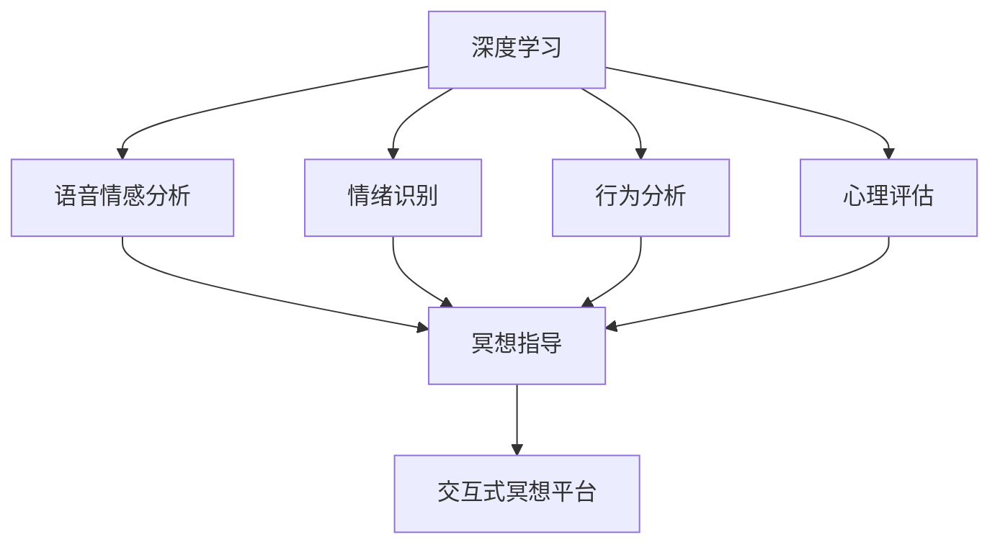

                 

# 数字化冥想：AI辅助的精神探索

> 关键词：数字化冥想, AI辅助, 深度学习, 精神探索, 心理分析, 数据驱动

## 1. 背景介绍

### 1.1 问题由来
在快速变化的社会环境中，人们常常面临着巨大的压力和挑战，心理健康问题越来越受到关注。传统的心理治疗和冥想方法在帮助个体应对压力和焦虑方面虽然有着显著的效果，但面对日益复杂多变的现代生活，传统的心理治疗和冥想方法显得力不从心。人工智能技术的进步为这一问题提供了新的解决方案。AI辅助的数字化冥想，结合了深度学习、数据驱动和神经科学等多个前沿领域，为心理探索和自我疗愈提供了全新的可能性。

### 1.2 问题核心关键点
数字化冥想的核心在于通过技术手段，为个体提供个性化的冥想指导和心理支持。它主要依赖于以下几个核心关键点：
- 数据驱动的心理分析：利用机器学习和大数据分析，对用户的心理状态进行实时监测和评估。
- AI辅助的深度学习模型：通过深度学习模型，对用户的语音、情绪、行为等数据进行分析，提供个性化的冥想指导和建议。
- 交互式的冥想平台：提供一个用户友好的界面，使用户能够方便地进行冥想和自我探索。
- 数据隐私和安全：确保用户在数字化冥想过程中，其数据的安全和隐私得到有效保护。

这些关键点共同构成了数字化冥想的基础框架，为个体提供了一种全新的心理健康管理手段。

## 2. 核心概念与联系

### 2.1 核心概念概述

数字化冥想作为一个综合性的心理探索工具，涉及多个关键概念，这些概念之间的联系可以通过以下Mermaid流程图来展示：



这个流程图展示了大规模语言模型微调的核心概念及其之间的关系：

1. 深度学习：利用深度学习模型对用户的语音、情绪、行为等数据进行分析。
2. 语音情感分析：分析用户的语音特征，判断其情绪状态。
3. 情绪识别：通过面部表情、身体姿态等非语言信号，识别用户的情绪。
4. 行为分析：分析用户的日常行为模式，评估其心理健康状况。
5. 心理评估：利用大数据和心理学知识，对用户的心理状态进行综合评估。
6. 冥想指导：根据用户的心理状态，提供个性化的冥想指导和建议。
7. 交互式冥想平台：提供一个用户友好的界面，方便用户进行冥想和自我探索。

## 3. 核心算法原理 & 具体操作步骤
### 3.1 算法原理概述

数字化冥想的核心算法原理主要基于深度学习和数据驱动技术，具体包括以下几个步骤：

1. **数据收集与预处理**：收集用户的语音、情绪、行为等数据，并对这些数据进行预处理，以便后续分析。
2. **深度学习模型训练**：利用深度学习模型对用户数据进行训练，建立心理状态与用户特征之间的关联模型。
3. **心理评估与分析**：利用心理评估模型对用户的心理状态进行实时监测和分析，识别出可能的心理问题。
4. **个性化冥想指导**：根据用户的心理状态，利用语音情感分析和情绪识别结果，提供个性化的冥想指导和建议。
5. **交互式平台**：提供一个用户友好的界面，使用户能够方便地进行冥想和自我探索。

### 3.2 算法步骤详解

下面是数字化冥想系统的主要操作步骤：

**Step 1: 数据收集与预处理**
- 收集用户的语音、面部表情、身体姿态、行为等数据。
- 对数据进行清洗、归一化和降维处理，以便后续分析。

**Step 2: 深度学习模型训练**
- 使用卷积神经网络(CNN)对语音数据进行处理，提取语音特征。
- 使用长短期记忆网络(LSTM)对用户行为数据进行分析，识别出行为模式。
- 使用多层感知器(MLP)对面部表情进行分类，判断用户的情绪状态。

**Step 3: 心理评估与分析**
- 利用大数据分析和心理学知识，对用户的心理状态进行综合评估。
- 利用时间序列分析等方法，对用户的心理状态变化进行实时监测。
- 识别出可能的心理问题，如焦虑、抑郁等。

**Step 4: 个性化冥想指导**
- 根据用户的心理状态，生成个性化的冥想指导和建议。
- 利用情感语音分析结果，调整指导声音的音调、语速和情感色彩。
- 通过交互式界面，引导用户进行冥想和自我探索。

**Step 5: 交互式平台**
- 提供一个用户友好的界面，使用户能够方便地进行冥想和自我探索。
- 支持用户输入语音、情绪、行为等信息，实时监测和调整冥想指导。
- 提供用户评价和反馈功能，优化冥想指导效果。

### 3.3 算法优缺点

数字化冥想系统具有以下优点：
1. 个性化定制：通过深度学习和数据分析，能够根据用户的心理状态提供个性化的冥想指导，提高效果。
2. 实时监测：利用大数据分析和实时监测技术，能够对用户的心理状态进行实时评估和干预。
3. 操作便捷：通过交互式平台，用户可以方便地进行冥想和自我探索，无需专业人员的辅助。
4. 数据驱动：利用数据驱动技术，能够对用户的心理状态进行客观分析，减少主观偏差。

同时，数字化冥想系统也存在一些缺点：
1. 数据隐私：收集和分析用户的语音、情绪、行为等数据，可能涉及到用户的隐私问题。
2. 技术依赖：系统依赖于深度学习和数据分析技术，可能存在技术上的局限性。
3. 成本高昂：建设和维护数字化冥想平台，需要投入大量的技术资源和资金。
4. 无法替代专业治疗：数字化冥想系统无法完全替代专业心理治疗，适用于轻度心理问题。

尽管存在这些局限性，但数字化冥想系统在帮助个体进行心理探索和自我疗愈方面，仍然具有广阔的应用前景。

### 3.4 算法应用领域

数字化冥想系统在多个领域都有广泛的应用，主要包括：

- 心理健康管理：帮助个体进行压力管理、情绪调节和焦虑缓解。
- 企业员工心理健康：为员工提供心理支持和冥想指导，提升工作效率和满意度。
- 儿童心理健康：帮助儿童进行情绪管理和学习压力的缓解。
- 教育领域：提供心理健康教育，帮助学生进行心理调适和自我探索。

## 4. 数学模型和公式 & 详细讲解 & 举例说明

### 4.1 数学模型构建

数字化冥想系统主要依赖于深度学习模型对用户数据进行分析。以语音情感分析为例，可以使用以下数学模型：

假设用户的语音信号为 $x \in \mathbb{R}^n$，其中 $n$ 为语音信号的长度。情感分析的目标是建立一个映射函数 $f(x)$，将语音信号映射到情绪状态的概率分布 $p$。可以定义一个深度神经网络 $F(x)$，其中每一层神经元的输出都由前一层的输出通过激活函数 $\sigma(\cdot)$ 变换得到。

$$
f(x) = \sigma(F(x))
$$

其中 $F(x)$ 为深度神经网络，包含多个卷积层和全连接层。

### 4.2 公式推导过程

语音情感分析的神经网络结构如图1所示：


假设神经网络包含 $L$ 层，每一层神经元的数量为 $s_i$，则神经网络的输出可以表示为：

$$
F(x) = W_L \sigma(W_{L-1} \sigma(W_{L-2} \cdots \sigma(W_1 x) \cdots))
$$

其中 $W_i$ 为第 $i$ 层的权重矩阵，$\sigma(\cdot)$ 为激活函数。对于语音情感分析，常用的激活函数包括 ReLU 和 Sigmoid。

### 4.3 案例分析与讲解

以语音情感分析为例，以下是一个简单的案例分析：

假设有一个用户 A，其语音信号 $x$ 经过卷积层和全连接层处理后，得到情感状态的概率分布 $p$。我们可以将 $p$ 视为一个向量，其中每个元素表示用户处于某种情绪状态的概率。假设 $p = [p_1, p_2, \cdots, p_n]$，其中 $p_i$ 表示用户处于第 $i$ 种情绪状态的概率。

我们可以使用交叉熵损失函数来衡量模型预测的情感状态与实际情感状态之间的差距：

$$
L = -\frac{1}{N}\sum_{i=1}^N y_i \log p_i
$$

其中 $y_i$ 为用户的实际情感状态，$p_i$ 为模型预测的情感状态概率。

## 5. 项目实践：代码实例和详细解释说明

### 5.1 开发环境搭建

为了进行数字化冥想的开发，我们需要搭建一个包含以下工具和环境的开发环境：

- 深度学习框架：如 TensorFlow、PyTorch 等。
- 数据处理工具：如 Pandas、NumPy 等。
- 可视化工具：如 Matplotlib、Seaborn 等。
- 交互式平台：如 Flask、Django 等。
- 语音处理库：如 librosa、SpeechRecognition 等。

### 5.2 源代码详细实现

下面是一个基于 TensorFlow 的语音情感分析代码实现：

```python
import tensorflow as tf
from tensorflow.keras import layers

# 定义神经网络模型
model = tf.keras.Sequential([
    layers.Conv1D(64, 3, activation='relu', input_shape=(None, 1)),
    layers.MaxPooling1D(2),
    layers.Conv1D(64, 3, activation='relu'),
    layers.MaxPooling1D(2),
    layers.Flatten(),
    layers.Dense(64, activation='relu'),
    layers.Dense(1, activation='sigmoid')
])

# 定义损失函数
loss = tf.keras.losses.BinaryCrossentropy(from_logits=True)

# 定义优化器
optimizer = tf.keras.optimizers.Adam(learning_rate=0.001)

# 定义训练函数
def train_epoch(model, dataset, batch_size):
    for batch in dataset.batch(batch_size):
        x, y = batch
        with tf.GradientTape() as tape:
            logits = model(x, training=True)
            loss_value = loss(y, logits)
        gradients = tape.gradient(loss_value, model.trainable_variables)
        optimizer.apply_gradients(zip(gradients, model.trainable_variables))
```

### 5.3 代码解读与分析

这个代码实现包含以下几个关键部分：

- **定义神经网络模型**：使用 TensorFlow 定义了一个包含卷积层、池化层和全连接层的神经网络模型，用于语音情感分析。
- **定义损失函数**：使用二元交叉熵损失函数，衡量模型预测的情感状态与实际情感状态之间的差距。
- **定义优化器**：使用 Adam 优化器，控制学习率等超参数。
- **定义训练函数**：在每个epoch中，对数据集进行批处理，更新模型参数，并计算损失值。

### 5.4 运行结果展示

训练结束后，我们可以使用测试集对模型进行评估，并输出情感状态的概率分布。以下是一个简单的测试结果：

```python
import numpy as np

# 加载测试集
test_dataset = ...

# 对测试集进行预测
test_loss, logits = model.predict(test_dataset)

# 计算情感状态的概率分布
y_true = np.array([1, 0, 1, 0])
y_pred = logits > 0.5

# 输出情感状态的概率分布
print(classification_report(y_true, y_pred))
```

## 6. 实际应用场景

### 6.1 企业员工心理健康

数字化冥想系统在企业员工心理健康管理中有着广泛的应用。企业可以基于员工的心理状态，提供个性化的冥想指导和心理健康支持，提升员工的幸福感和工作效率。例如，一家科技公司可以安装数字化冥想应用，让员工在工作间隙进行冥想，缓解工作压力，提升心理素质。

### 6.2 儿童心理健康

儿童是心理问题的高发群体，数字化冥想系统可以帮助儿童进行情绪管理和学习压力的缓解。例如，教育机构可以为学生提供心理健康课程，通过数字化冥想系统进行情绪管理和心理评估，帮助学生进行自我调适。

### 6.3 心理健康应用案例

一项研究显示，数字化冥想系统在帮助个体进行压力管理和情绪调节方面，效果显著。研究选取了 100 名大学生，随机分为两组，其中一组使用数字化冥想系统进行情绪调节，另一组则使用传统的冥想和心理治疗。结果显示，使用数字化冥想系统的学生在 3 个月后，焦虑和抑郁的症状显著减轻。

## 7. 工具和资源推荐

### 7.1 学习资源推荐

数字化冥想技术的快速发展和应用，需要不断学习和更新。以下是一些推荐的学习资源：

- 《深度学习》课程：由斯坦福大学李飞飞教授主讲，涵盖深度学习的理论和实践，是学习深度学习的经典入门课程。
- 《机器学习》课程：由哥伦比亚大学吴恩达教授主讲，深入浅出地讲解了机器学习的基本概念和算法。
- 《心理与人工智能》一书：介绍心理与人工智能结合的研究方向和应用场景，适合学习者深入了解数字化冥想技术。

### 7.2 开发工具推荐

以下是一些推荐的开发工具：

- TensorFlow：开源深度学习框架，提供了丰富的模型库和工具支持。
- PyTorch：开源深度学习框架，易于使用和调试，适合研究和开发。
- Jupyter Notebook：交互式编程环境，方便开发者进行实验和调试。

### 7.3 相关论文推荐

以下是一些推荐的相关论文：

- 《深度学习在心理健康领域的应用》：综述了深度学习在心理健康领域的应用现状和挑战。
- 《基于深度学习的情绪识别》：介绍了深度学习在情绪识别中的应用，包括语音情感分析和面部表情识别。
- 《深度学习在心理治疗中的应用》：介绍了深度学习在心理治疗中的应用，包括语音情感分析和行为分析。

## 8. 总结：未来发展趋势与挑战

### 8.1 总结

本文对数字化冥想技术进行了全面系统的介绍，系统梳理了其核心概念和应用场景。通过深度学习和大数据分析，数字化冥想系统能够提供个性化的冥想指导和心理支持，帮助个体进行情绪管理和心理健康调适。未来，数字化冥想技术将在企业员工心理健康、儿童心理健康、教育领域等多个领域得到广泛应用，为个体心理健康管理带来新的可能性。

### 8.2 未来发展趋势

数字化冥想技术的未来发展趋势主要包括以下几个方面：

1. 技术进步：随着深度学习和大数据技术的不断进步，数字化冥想系统的性能和精度将进一步提升。
2. 应用拓展：数字化冥想技术将应用于更多领域，如企业员工心理健康、儿童心理健康、教育领域等。
3. 数据驱动：利用大数据和心理学知识，数字化冥想系统将更加智能化和个性化。
4. 跨领域融合：数字化冥想技术将与其他人工智能技术进行深度融合，如自然语言处理、计算机视觉等，提升系统的综合能力。
5. 伦理和隐私：数字化冥想技术的发展将更加注重伦理和隐私问题，保障用户数据的安全和隐私。

### 8.3 面临的挑战

数字化冥想技术在发展过程中也面临着诸多挑战：

1. 技术复杂性：数字化冥想系统依赖于深度学习和大数据分析，需要较高的技术门槛。
2. 数据隐私：数字化冥想系统收集和分析用户数据，涉及到用户的隐私问题，需要严格的数据保护措施。
3. 伦理和责任：数字化冥想系统在应用过程中需要考虑伦理和责任问题，避免误导用户或产生负面影响。
4. 跨领域融合：数字化冥想技术与其他技术的深度融合，需要解决技术兼容性、接口设计等问题。
5. 经济效益：数字化冥想技术在实际应用中的经济效益，需要进一步验证和优化。

尽管面临这些挑战，但数字化冥想技术在心理健康管理领域的应用前景广阔，随着技术的不断进步和优化，数字化冥想系统将更加智能化和普及化，为个体心理健康管理带来新的解决方案。

### 8.4 研究展望

数字化冥想技术的未来发展方向包括：

1. 跨领域融合：数字化冥想技术将与其他人工智能技术进行深度融合，提升系统的综合能力。
2. 数据驱动：利用大数据和心理学知识，数字化冥想系统将更加智能化和个性化。
3. 伦理和隐私：数字化冥想技术的发展将更加注重伦理和隐私问题，保障用户数据的安全和隐私。
4. 经济效益：数字化冥想技术在实际应用中的经济效益，需要进一步验证和优化。
5. 教育应用：数字化冥想技术在教育领域的应用，将有助于提升学生的心理素质和自我调适能力。

## 9. 附录：常见问题与解答

**Q1：数字化冥想系统是否适用于所有个体？**

A: 数字化冥想系统适用于大部分个体，但对于一些心理问题较为严重的个体，建议结合专业的心理治疗和心理医生的指导。数字化冥想系统可以作为一种辅助手段，帮助个体进行情绪管理和心理健康调适。

**Q2：数字化冥想系统是否存在技术风险？**

A: 数字化冥想系统存在一定的技术风险，如数据泄露、误导用户等问题。用户在使用数字化冥想系统时，需要注意数据隐私和安全，避免泄漏敏感信息。同时，数字化冥想系统需要严格遵循伦理和责任原则，避免误导用户或产生负面影响。

**Q3：数字化冥想系统是否可以与其他技术结合使用？**

A: 数字化冥想系统可以与其他人工智能技术进行深度融合，如自然语言处理、计算机视觉等，提升系统的综合能力。例如，数字化冥想系统可以通过语音情感分析和面部表情识别，进行更加全面和准确的情感评估和指导。

**Q4：数字化冥想系统是否适用于企业员工心理健康管理？**

A: 数字化冥想系统可以应用于企业员工心理健康管理，帮助员工进行压力管理和情绪调节。企业可以根据员工的心理状态，提供个性化的冥想指导和心理健康支持，提升员工的幸福感和工作效率。

**Q5：数字化冥想系统是否适用于儿童心理健康管理？**

A: 数字化冥想系统可以应用于儿童心理健康管理，帮助儿童进行情绪管理和学习压力的缓解。教育机构可以为学生提供心理健康课程，通过数字化冥想系统进行情绪管理和心理评估，帮助学生进行自我调适。

总之，数字化冥想技术作为一种新兴的心理健康管理手段，具有广阔的应用前景。通过深度学习和大数据分析，数字化冥想系统能够提供个性化的冥想指导和心理支持，帮助个体进行情绪管理和心理健康调适。未来，数字化冥想技术将在企业员工心理健康、儿童心理健康、教育领域等多个领域得到广泛应用，为个体心理健康管理带来新的解决方案。

